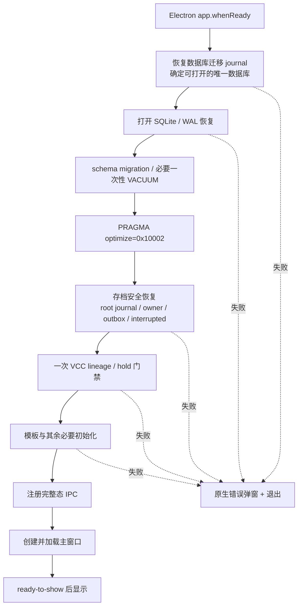
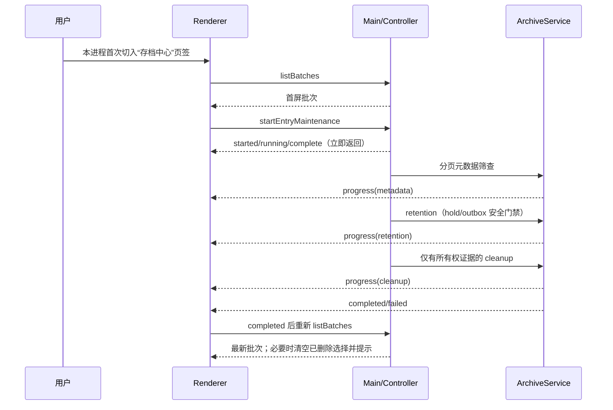
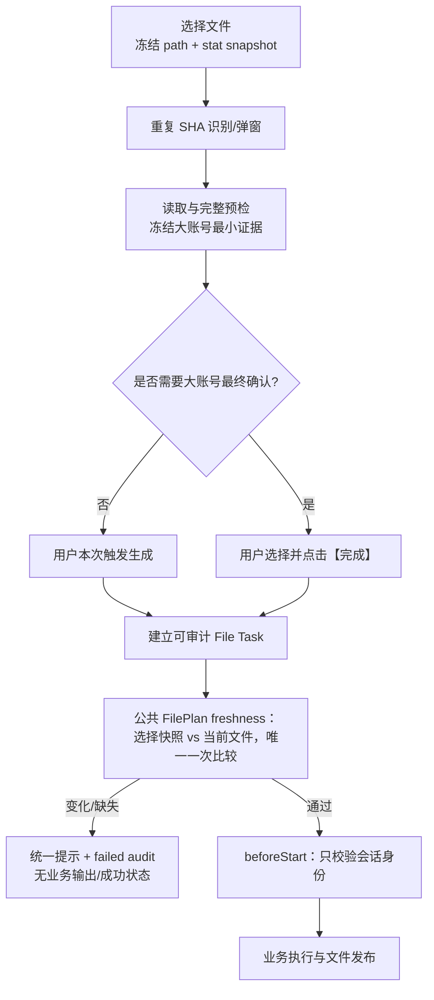
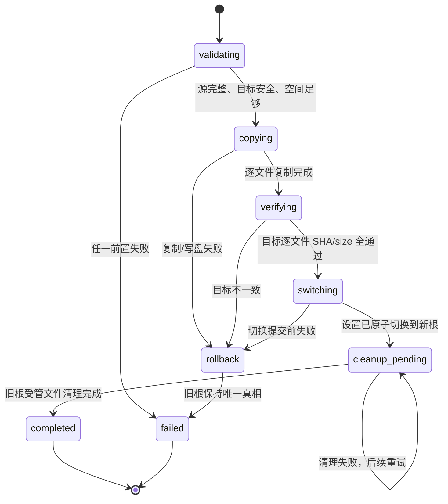

# TechDoc — v3.1.12 确认期文件校验、启动治理、VCC 币种与存档中心

| 项目 | 内容 |
| --- | --- |
| 目标版本 | v3.1.12 |
| 文档版本 | v1.0 |
| 日期 | 2026-08-19 |
| 状态 | 已确认；实施中 |
| 关联 Spec | `changes/3.1.12/spec.md` |
| 产品代码基线 | `ccfa71ffc92bb26bbf47c05efa87740d972cf209`（最新 `origin/main`；包版本已预置 v3.1.12） |
| 当前工作分支 | `v3.1.12` 集成分支；各功能 PR 使用独立 `codex/v3.1.12-*` 分支并回合并到本分支 |
| 发布门禁 | 定向测试、集成、smoke、release-check、check-vars、Windows packaged 性能对拍、VCC 人工资金复核 |

> 本文是已确认的实施技术合同。实施中若发现会改变产品行为、数据合同、失败策略、兼容边界或验收口径的新事实，必须先反向同步 Spec 与本文，再继续编码。

---

## 0. Task Brief

### 0.1 Goal

在不削弱现有资金、存档和崩溃恢复安全门禁的前提下，完成四个收口：

1. 网银账单只在用户最终确认时做一次“选择后是否变化”的物理源文件比较；
2. Windows 正常启动不再执行无界 `ANALYZE`、重复 VCC 核对和存档全量保洁；
3. v3.1.12 新导入的 VCC CNH 在业务层按 CNY 处理，原始审计保持 CNH；
4. 存档位置调整为清晰布局，变更位置时迁移内容，日常健康检查改为首次进入后增量执行。

### 0.2 Constraints

- 版本归属只能是 v3.1.12。
- 网银账单“一次比较”不等于移除读取稳定性、SHA、会话所有权或归档完整性校验。
- VCC 历史数据不迁移、不重算、不改哈希；输出仍为九币种。
- 存档根切换必须维持单一权威根、逐文件 SHA 和可恢复 journal。
- 未知文件宁可保留并告警，也不得无所有权证据删除。
- 启动性能优化不得绕过 migration journal、outbox、WAL/SQLite 恢复或 retention 前 VCC hold 门禁。
- 不实现任何 WAL 限额或 WAL 清理设置。

### 0.3 Done when

- Spec 中 BSF/STP/VCC/ARC/API/TST 合同均有唯一代码落点和测试落点；
- 正常启动初始化完成前没有 BrowserWindow；失败只显示原生弹窗并退出；
- Windows installer/portable 同基线数据库至少 5 次对拍，中位数相较 3.1.11 缩短至少 70%；
- VCC 各输入来源的 CNH/CNY 主体、币种、金额、幂等、审计和 Excel 经人工复核；
- 存档迁移、首次进入维护、未知文件和历史 NULL 指纹边界均通过故障矩阵；
- 所有实现偏差已先同步文档，无静默决定。

---

## 1. 当前代码事实与问题定位

### 1.1 网银账单确认期校验被重复调用

当前 `src/main.js` 的 `createPreviewSourceFreshnessGuard()` 已经使用 `sizeBytes/mtimeMs/ctimeMs/ino?`，底层 `src/main-process/archive-center/source-snapshot.js` 也已有规范化与比较函数，但调用点分散：

| 当前调用点 | 现状 | v3.1.12 处理 |
| --- | --- | --- |
| 删除重复文件弹窗返回 | `resolveImportFileSelection()` 每次弹窗后比较 | 删除确认期比较；重复识别 SHA 保留 |
| 文件选择与解析后 | `prepareStatementImportFiles()` 多次创建/组合 guard | 只保留选择时快照，不比较 |
| 完整预检后 | import prepare 再比较 | 直达生成路径挪到唯一终点 |
| 大账号 `prepare` | 首次大账号准备时比较 | 删除；此时尚未最终确认 |
| 大账号【完成】 | complete prepare 与 `beforeStart` 均可能比较 | 复用 picker snapshot，只由公共 `assertFilePlanFresh()` 比较一次 |
| 大账号顺序保存/提取 | 既比较又重新读取源文件 | 改为会话校验 + 冻结证据，不再读源 |

`TaskLifecycle.run()` 当前顺序是：建立 Task Run → 形成非空 FilePlan → 预留 File Batch → 公共 `assertFilePlanFresh()` → `beforeStart` → 启动 File Task → 业务 `execute`。因此最终确认校验复用公共 freshness 门禁即可保证业务尚未执行；`beforeStart` 只校验 session/context identity。freshness 失败会保留一个内部 failed Task/File Batch 审计，这是可解释失败记录，不是业务会话成功提交。

### 1.2 Windows 启动的已确认放大链

当前 `src/backend/database.js` 每次 `AppDatabase.init()` 都执行无参数 `ANALYZE;`。用户提供的诊断样本主库约 2.9GB；无参数 `ANALYZE` 会遍历索引统计，时间随数据库规模放大。SQLite 说明 `ANALYZE` 不是正确性必需项，新版推荐以有界、通常为空操作的 `PRAGMA optimize` 管理统计信息。[SQLite ANALYZE 文档](https://sqlite.org/lang_analyze.html)

同时存在两个次要放大项：

1. `ArchiveCenterController` 的 post-outbox hook 已执行 `reconcileVccImportArchiveLineage()`，`runBackgroundInitChain()` 随后又显式执行一遍；
2. `ArchiveStorageRootManager._prepareActiveRoot()` 为了检查少量关键路径，先通过 `_evidence()` 把全部 Blob、ready artifact 和 cleanup job 读入内存；Archive startup 又继续做 retention、目录化修复、Blob/Artifact 筛查和孤儿扫描。

当前默认启动时序由 `DEFERRED_WINDOW_STARTUP` 控制：先创建窗口，renderer 通过 `app:get-info -> {initPending:true}` 显示加载态并监听初始化进度。该时序没有缩短初始化本身，只提前显示了未就绪界面，也扩大了 IPC 双态。

“全量 `ANALYZE` 是约 2.9GB 样本的首要原因”目前是已提供的诊断基线，不等于本机已重复测量。v3.1.12 必须用新增阶段耗时和 Windows packaged 对拍完成闭环。

### 1.3 VCC 币种入口并不只有一个字段

当前业务字段由 `src/backend/vcc-financial-op/row-mapper.js` 和 `system-op-importer.js` 形成：

- 非通道使用 `我方币种`；
- 通道按 CITI/billdate 分支实际选择交易、清算或结算币种；
- Pending 同时保存 `币种` 与 `流水_币种`，再比较是否错币；
- 系统财务 OP 以主体×币种建九币种快照。

目前 `requireSupportedCurrency()` 只接受九币种的精确大写 token；原始审计 JSON 在业务映射前形成。普通明细 `HASH_VERSION=1`、Pending `PENDING_HASH_VERSION=2`，哈希直接包含原始数组，因此只改业务字段而不改哈希会把 CNY/CNH 错判为冲突。

### 1.4 存档迁移已有安全骨架，但启动维护过重

`src/main-process/archive-center/storage-root-manager.js` 已具备：

- migration journal；
- 源根/目标根 marker 与祖先目录所有权检查；
- 全源核验、复制、目标核验；
- 数据库设置切换；
- 切换后旧根清理与 `cleanup-pending`。

所以“变更地址后内容是否同步”已有肯定答案：当前设计本来就是迁移而非仅改路径。v3.1.12 不重写这套状态机，主要修正 UI、启动边界、健康筛查方式、指纹和未知文件删除合同。

当前 `ArchiveService` 会分页读取元数据，但 startup 仍从头启动 Blob/Artifact/孤儿扫描；SHA 形状正确但数据库无记录的文件可能被当作孤儿删除。仅凭“位于受管目录”或“文件名像 SHA”不能证明应用拥有该文件，必须收紧。

---

## 2. 总体目标时序

### 2.1 启动主链



任何失败路径都不得先创建业务窗口。Mac 的 `activate` 只在全局初始化成功后允许补建窗口。

### 2.2 存档首次进入主链



列表首屏与维护解耦；失败不在后台自旋，只有用户下一次离开后重新进入该页签才重试。

### 2.3 网银账单确认主链



---

## 3. 网银账单技术设计

### 3.1 `StatementSourceSelectionSnapshot`

复用并收敛 `source-snapshot.js` 的快照合同：

```js
{
  resolvedPath: String,
  sizeBytes: Number,
  mtimeMs: Number,
  ctimeMs: Number,
  ino: String | undefined
}
```

技术实现使用 `fs.stat(..., { bigint: true })` 能力时把 inode/file ID 转为十进制字符串，避免 Windows 64 位 file ID 被 JavaScript Number 舍入；无法可靠取得时省略 `ino`。读取旧的数字型快照时先转为同一 token，保持当前会话兼容。

路径必须由 main 进程在选择后 `path.resolve()`；renderer 后续提交的路径不参与重新定位快照。

### 3.2 唯一确认比较

代码取证发现，所有 eager File Task 在 `beforeStart` 之前已经统一调用一次 `assertFilePlanFresh(filePlan)`。因此不再新增网银专用物理 guard，也不跳过公共安全门；而是扩展 `normalizeFilePlanV1()` 的 input，使其可选接收 main 进程已经捕获并校验的 `sourceSnapshot`：

```js
{
  filePath,
  role,
  sourceOperation,
  sourceSnapshot,          // 可选；网银传 picker-time snapshot
  freshnessFailure        // 可选；网银统一 code/message
}
```

规则：

1. 未提供 `sourceSnapshot` 的其他模块继续在 FilePlan normalize 时捕获，行为不变；
2. 网银 direct 与大账号 complete FilePlan 注入选择文件时的 snapshot，normalize 不重新覆盖它；
3. `assertFilePlanFresh()` 使用该 snapshot 与最终当前文件比较，成为唯一一次确认期 metadata comparison；
4. `beforeStart` 只校验 pending/session 身份，不再 stat；
5. snapshot/freshnessFailure 只能来自 main 进程形成的 prepared FilePlan，renderer 不能直接提交或覆盖；
6. raw snapshot 格式非法时 fail-closed 为 FilePlan invalid，不回退成当前时点 snapshot；
7. supplied snapshot 的 input 若在 normalize 前连父目录一起消失，仅以规范化绝对路径形成 lexical alias，仍进入公共 freshness 门禁并产生统一失败审计；正常存在路径继续使用 realpath/hardlink alias 防护，未 supplied snapshot 的其他模块不使用该 fallback。

统一错误建议：

```text
code: BANK_STATEMENT_SOURCE_CHANGED_DURING_CONFIRMATION
message: 网银明细源文件在确认期间已变化，请重新选择
```

不得把文件缺失另写成第二种用户提示。日志可在内部 detail 中区分 `missing/not-file/metadata-changed`，但 renderer 只显示统一文案。

公共确认比较通过后，Statement 若仍需实际读取 workbook，则 reader 起点必须先校验当前文件仍匹配已通过公共门的 FilePlan `sourceSnapshot`，再以该起点快照与读取结束快照执行 BSF-06 稳定性校验。这是公共门到实际读取的身份连续性，不是新增第二次用户确认比较，不计入 BSF-03。preview/preflight 未经公共最终门，仅执行自身 start/end 稳定性，不用 picker snapshot 做 expected 比较。任一步失败必须在生成输出和提交 session 前抛出同一 code/message。

### 3.3 调用边界

- 直达生成：prepare 保留 picker snapshot 到 normalized FilePlan；预留完成后公共 `assertFilePlanFresh()` 比较一次，随后 `beforeStart` 校验 session，才允许 `execute`。
- 大账号：首次 preview 只携带 picker snapshot 和冻结证据进入 `pendingBigAccountContext`；【完成】构建最终 FilePlan 时复用原 snapshot，公共 freshness 比较一次。
- 删除重复文件弹窗、预检、顺序提取、顺序保存和 `beforeStart` 都不得再做物理比较。
- 公共 `assertFilePlanFresh()` 失败发生在 task start/execute 之前：`startFileTask=0`、`execute entry=0`、业务输出/session 成功提交=0、failed audit=1。
- reader identity/start/end 失败发生在 actual execute 内：内部 File Task 已 started 且 execute 已进入，但在 workbook 读取起点或结束处阻断；业务输出/session 成功提交/成功状态=0、failed audit=1。`execute entry` 本身不是业务副作用。

### 3.4 大账号冻结证据

预检读取工作簿时形成可冻结、可按会话引用的普通对象，不保存整份 raw rows：

```js
{
  version: 1,
  sessionId: String,
  files: [{
    fileOrdinal: Number,
    resolvedPath: String,
    fileName: String,
    rows: [{
      blockOrdinal: Number,
      sourceRow: Number,
      merchantId: String,
      currency: String,
      matchKind: String,
      accountKey: String,
      ambiguityCode: String | null
    }],
    orderedAccountKeys: [String]
  }]
}
```

规则：

- `blockOrdinal`、`sourceRow`、`fileOrdinal` 由 main 进程生成；renderer 只能提交选中行号/账号键；fixed/unfixed 证据关联使用 per-file `blockOrdinal`，不使用可因空 block 重复的 `sourceRow`；
- self-input bridge 的首次 raw callback 不直接决定 block 归属，只按 header window/ordinal 冻结 `bridgeCandidatesByBlock: [[{ sourceRow, clearingAccountId }]]`；该临时对象不保存 raw row、cell 内容或 workbook；
- `mappedRows` 形成后，以 `identifyAccountBlocks(..., { includeEmptyBlocks: true })` 的 `blockOrdinal`、Credit/Debit 实际交易裁剪结果和 `rowMetas[endIndex].sourceRowNumber` 确定上一 block 最后一条实际交易；当前 block 只接受严格位于该交易之后、当前 header 之前的 bridge candidate；
- 上一 block 无实际交易时，下界使用上一 header 的明确 source row；block、header 或 row meta 不能证明归属时，本 ordinal 保留空槽并 fail closed，禁止把前一 block 交易行里的 bankId 或 bridge 回退给后续 block；
- 完成归属后，会话内 recognition basis 只保留对齐 ordinal 的 `bridgeClearingIdsByBlock`，临时 bridge candidates 不进入 renderer 或持久化顺序证据；
- fixed 自动匹配消费 `bridgeClearingIdsByBlock` 时保留空 ordinal；只要任一槽为空，整文件不得进入保存顺序匹配，不得用其余已识别账号压缩后继续匹配；
- fixed/unfixed 模式复用预检阶段已经运行的同一账号识别函数，结果冻结为数组；
- `file:extract-big-account-order` 从冻结数组筛选，不打开源文件；
- `big-account-order:save` 只校验 sessionId、模板/账号模式和账号键集合，不调用确认 guard；
- session 释放、用户重新选文件或另一次 preview 后，旧证据不可再用。

### 3.5 与其他安全校验的区分

| 校验 | 时机 | 是否计入“一次” |
| --- | --- | --- |
| 选择快照 vs 最终确认快照 | 公共 `assertFilePlanFresh()` | 是，必须恰好一次 |
| 实际读文件前后稳定性 | 每次被允许的业务/预检读取 | 否 |
| 重复文件 SHA | 选择去重 | 否 |
| 归档 Blob SHA | 存档发布/读取 | 否 |
| FilePlan normalize 的路径/普通文件/alias 校验 | manifest 形成 | 否；不比较两个时点 |
| FilePlan 输出目标快照 | 文件发布前 | 否 |
| session/task ownership | 状态转移时 | 否 |

---

## 4. Windows 启动技术设计

### 4.1 删除两阶段 UI 合同

主进程：

- 删除 `DEFERRED_WINDOW_STARTUP` 产品分支和 `initPending` 返回；
- `app:get-info` 只在完整初始化后可调用，始终返回完整 DTO；
- 删除 init progress/init done 广播；
- `app.whenReady()` 中先 `await initializeApplication()`，成功后注册 IPC、创建窗口；
- 保留现有 native error dialog 与退出路径，并确保 dialog 不依赖 BrowserWindow parent。

preload/renderer：

- 删除 `onInitProgress`、`onInitDone` 暴露和卸载逻辑；
- 删除 renderer 的 loading skeleton/进度文案/二次 `initialize()`；
- 初始化只有一个完整态入口。

### 4.2 数据库初始化分段

`AppDatabase.init()` 增加可选只写日志的阶段回调，或内部统一 `measureStartupPhase()`：

1. `database-open`：`new DatabaseSync`、PRAGMA、SQLite 对已有 WAL 的正常恢复；
2. `database-migrations`：幂等 schema migrations；
3. `database-vacuum`：仅已有一次性条件命中时记录，否则 `skipped`；
4. `database-optimize`：`PRAGMA optimize=0x10002`。

替换：

```sql
ANALYZE;
```

为：

```sql
PRAGMA optimize=0x10002;
```

不捕获并吞掉 optimize 错误；数据库初始化失败仍走启动失败。日志同时记录 `outcome=success|failed|skipped`，不记录数据库内容。

### 4.3 一次 VCC lineage/hold 门禁

保留 Archive controller 的 post-outbox hook，删除 `runBackgroundInitChain()` 末尾显式第二次 `syncImportArchiveLineage()`。

将 `activeReferenceCount(db, sourceId)` 的逐来源查询替换为一次集合查询：

```sql
SELECT import_source_id, SUM(reference_count) AS reference_count
FROM (
  SELECT import_source_id, COUNT(*) AS reference_count
  FROM vcc_fin_op_effective_raw_fallback
  WHERE import_source_id IS NOT NULL
  GROUP BY import_source_id

  UNION ALL

  SELECT import_source_id, COUNT(*) AS reference_count
  FROM vcc_fin_op_effective_rows
  WHERE import_source_id IS NOT NULL
  GROUP BY import_source_id

  UNION ALL

  SELECT import_source_id, COUNT(*) AS reference_count
  FROM vcc_fin_op_system_snapshots
  WHERE import_source_id IS NOT NULL
  GROUP BY import_source_id
)
GROUP BY import_source_id;
```

兼容旧 schema 时，仍使用 `tableHasColumn()` 先构建存在的 UNION 分支，但每张表最多一条聚合查询，不回退到 per-source `COUNT`。

新增：

```sql
CREATE INDEX IF NOT EXISTS idx_vcc_fin_op_system_snapshots_import_source
ON vcc_fin_op_system_snapshots(import_source_id, id)
WHERE import_source_id IS NOT NULL;
```

核对仍加载全部来源、artifact 和 hold 并保持原完整安全语义；本迭代不把它收缩为脏来源增量核对，以免同时改变性能和安全语义。

### 4.4 Archive startup 拆分

`ArchiveCenterController.initialize()` 收缩为安全恢复：

- 存档根 migration journal 恢复到“唯一权威根可确定”；
- marker 与固定关键目录祖先校验；
- owner/outbox/flow bind intent 恢复；
- 中断 Task/Artifact 状态收口；
- post-outbox VCC gate；
- 不执行 retention、目录化修复、历史 Blob/Artifact SHA 筛查或通用 orphan scan。

`cleanup-pending` 已发生原子根切换，新根是唯一权威根。启动只验证新根与 journal，旧根的大量删除放到首次进入维护；切换前、`copying/verifying/switching` 等会影响权威根判断的 journal 阶段仍必须阻塞恢复完成。

`ArchiveStorageRootManager._prepareActiveRoot()` 在 marker 有效时不得先调用全量 `_evidence()`：

- 启动只检查 marker、根本身、`blobs`、`blobs/sha256`、`.staging`、`.readonly` 的固定祖先；
- 每次具体文件打开、写入、删除、迁移时继续验证该路径全部祖先，防止 junction/symlink 越根；
- 全 DB evidence 只在用户触发迁移或首次进入维护时分页加载。

### 4.5 阶段日志

新增统一结构日志，例如：

```json
{
  "event": "startup-phase",
  "phase": "archive-outbox",
  "durationMs": 18.4,
  "outcome": "success",
  "counts": { "replayed": 0 }
}
```

不得记录文件绝对路径、账号、金额、原始行或 SQL 参数。失败日志仅记录 code、阶段和经过现有脱敏的 message。

阶段至少包括：

| 阶段 | 起止点 |
| --- | --- |
| database-open | 打开主库至 SQLite/WAL 可查询 |
| database-migrations | migrations 开始至提交 |
| database-vacuum | 条件检查至结束/skip |
| database-optimize | optimize 单语句 |
| archive-root-recovery | journal/marker/关键路径 |
| archive-outbox | outbox/owner replay |
| vcc-lineage-gate | post-outbox hook |
| template-sync | 模板同步 |
| window-create | BrowserWindow 构造至 loadFile |
| window-load | loadFile 至 ready-to-show |
| startup-total | app ready 链开始至 ready-to-show |

### 4.6 Windows 对拍工具

现有 `scripts/measure-startup.js` 只创建空白临时 userData，不足以复现 2.9GB 数据库。实现时扩展或新增 packaged runner，合同如下：

- 输入 3.1.11 installer 安装后的 exe、3.1.11 portable、3.1.12 installer 安装后的 exe、3.1.12 portable；
- 以同一只读 golden 数据库生成四份初始字节一致的工作副本，记录初始 SHA-256；
- 每个变体顺序执行至少 5 个正常关闭样本，不丢弃首个样本；运行顺序轮换，降低 OS cache 和杀毒扫描偏差；
- 外部启动指标从进程创建开始，3.1.11 与 3.1.12 均必须等到 renderer `totalInitMs` 完成才停表；3.1.12 还必须同时取得 `window-ready` 与 `startup-total` success，避免在 `getInfo`/模板刷新/事件绑定结束前提前停表；复制数据库的耗时不计入启动；
- Windows 的真实 PowerShell process snapshot/action/receipt 探针必须在 `release-check` 之后独立串行执行，不与全量 `node:test` 文件并发；普通全量单测只覆盖可注入的进程树合同，专用工作流通过显式环境开关执行真实外部进程语义，且不得为通过门禁取消或无限放宽外部命令硬超时；
- 每个样本记录主库、`-wal`、`-shm` 大小，恢复任务数量和阶段耗时；
- 一次性 migration/VACUUM 与人为构造的崩溃恢复各自用独立副本、独立表格；
- 报告 average/median/min/max，但验收只看正常场景 median 与阶段解释。

---

## 5. VCC CNH→CNY 技术设计

### 5.1 唯一词法/业务归一化函数

在 VCC row mapper 层新增共享函数，system importer 复用：

```js
function normalizeIncomingVccCurrency(value, field) {
  const sourceToken = requireText(value, field); // 只 trim，不 upper-case
  if (sourceToken === 'CNH') {
    return { sourceToken, businessCurrency: 'CNY' };
  }
  if (!SUPPORTED_CURRENCIES.includes(sourceToken)) throw ...;
  return { sourceToken, businessCurrency: sourceToken };
}
```

不调用 `.toUpperCase()`，所以 `cnh/Cnh/cNY` 继续失败。`sourceToken` 是 trim 后的审计辅助值；`rawJson` 继续保留原单元格字符串，不用 sourceToken 覆盖。

### 5.2 明细映射

| 来源 | 参与字段 | 业务保存 | 原始审计 |
| --- | --- | --- | --- |
| 非通道 | 我方币种 | CNH→CNY 写 `statCurrency` | rawJson 保留 CNH |
| CITI 通道 | 交易币种 | CNH→CNY | rawJson 保留全部列 |
| 其他通道且 billdate>月末 | 清算币种 | CNH→CNY | 同上 |
| 其他通道且 billdate≤月末 | 结算币种 | CNH→CNY | 同上 |
| Pending | 币种、流水_币种 | 两侧分别 CNH→CNY，再判 mismatch | rawJson 两列保持原值 |

通道本行未被业务分支选中的其他币种列不新增校验、也不在规范哈希中改写；否则可能拒绝从未参与本行金额计算的历史脏列。

### 5.3 规范哈希副本

`baseMappedRow()` 同时形成：

- `rawJson`：原审计数组，永不改写；
- `canonicalHashValues`：只复制数组，并把本行实际参与业务的币种单元格中的 `CNH` token 替换为 `CNY`；
- 其他单元格保持原始字符串；
- 通道的 assigned subject 继续进入哈希。

业务字段仍按 trim 后的 token 保存 CNY。哈希副本为了不改变历史 CNY 的 content hash，只替换 token 本身并保留原单元格首尾空格：例如 `" CNH " -> " CNY "`，而既有 `" CNY "` 保持原样。这样“只差 CNY/CNH 写法”会相同，其他词法差异仍沿用当前冲突合同。

版本：

- 普通/通道明细 `HASH_VERSION: 1 -> 2`；
- Pending `PENDING_HASH_VERSION: 2 -> 3`；
- 历史行不 UPDATE；
- 系统 OP 的 content hash 本来由主体、月份和规范 balances 形成，无需新增独立 hash version。

### 5.4 旧哈希兼容

不新增第二套历史哈希，也不复用现有 `vcc_fin_op_effective_rows.legacy_content_hash`；该列属于既有 Pending raw contract 迁移证据，改变语义会扩大兼容风险。

兼容依赖“CNY 原文不改、CNH token 投影成同位置 CNY”：

- 历史 CNY 行完全相同重放：新 canonical hash 与旧 stored hash 相同；
- 历史 CNY 与新 CNH 只差 token：新 CNH 投影后与旧 CNY stored hash 相同；
- 新合同 CNY/CNH 只差 token：content hash 相同；
- 金额、subject、其他列或币种单元格首尾空格也变化：content hash 不同，继续 conflict。

detail importer 可继续以 `content_hash` 作为幂等比较主键；只需确认所有 staging、同批混键、effective 比较和 anomaly evidence 都使用新 canonical hash。`hash_version` 用于审计合同来源，不参与“同内容”的额外宽松判断。旧行和 `legacy_content_hash` 均不 UPDATE。

### 5.5 系统财务 OP

读取每行时保留：

```js
{
  sourceCurrency: 'CNH',
  currency: 'CNY'
}
```

`buildSubjectSnapshot()` 继续用规范 `currency` 建 `Map`：

- 同主体 CNY + CNH 会命中重复 CNY，整个主体进入 validation error；
- 当前 `rowsBySubject` 的 per-subject try/catch 保证其他主体继续；
- `rawPayload.rows[].sourceCurrency` 保留 CNH，`normalizedCurrency` 为 CNY；
- 完整主体仍必须具备九个规范币种，CNH 不能作为第十币种。

### 5.6 金额、行数和幂等守恒

必须记录并断言：

- 导入输入行数 = accepted + skipped + conflict/error；
- 归一化前 CNY 金额 + CNH 金额 = 归一化后 CNY 金额；
- 其他八币种金额和行数不变；
- Pending 的 mismatch 只由两侧规范币种比较决定；
- 系统 OP 错误主体不写快照，完整主体写入数守恒；
- Excel 不出现 `CNH` header、sheet currency key 或额外列。

---

## 6. 存档中心技术设计

### 6.1 UI 布局

当前设置页的 `.archive-center-storage-location-row` 同行放路径和按钮，路径 CSS 使用 ellipsis。改为：

```html
<div class="archive-center-storage-location-heading">
  <span>存档位置</span>
  <button type="button">变更</button>
</div>
<p class="archive-center-storage-path" aria-readonly="true">完整路径</p>
```

路径样式：

```css
white-space: normal;
overflow-wrap: anywhere;
word-break: break-word;
user-select: text;
```

不使用 `text-overflow: ellipsis`；`title` 可保留但不能是查看完整路径的唯一方式。窄屏与 125%/150% Windows scale 下按钮不得被路径挤出。

### 6.2 存档根迁移状态机



关键约束：

- 迁移入口先暂停 Archive 新操作并等待活跃文件任务达到安全点；
- `_evidence()` 在迁移入口允许完整读取，因为迁移本身是显式重操作；
- 源文件在复制前流式 SHA，目标落盘/fsync 后再次流式 SHA；
- database setting 只在所有目标证据通过后切换；
- `.staging/.readonly` 不进入 published file 列表；
- 源根出现不在 DB/journal evidence 中的文件立即阻断，既不复制也不删除；
- 切换后旧根清理失败只记录精确受管路径的 cleanup job/journal，不扫描并扩大删除范围；
- 用户关闭窗口、退出请求或更新安装在迁移开始后必须等待状态机到安全终点，不提供取消按钮。

### 6.3 `ArchiveFileFingerprint`

内部 DTO：

```js
{
  sizeBytes: Number,
  mtimeMs: Number,
  ctimeMs: Number,
  ino: String | undefined
}
```

语义：

- 前三项必须同时存在且有效，`ino` 可空；
- inode/file ID 以十进制字符串保存，避免 Windows 64 位精度损失；
- fingerprint 相等只是“本轮维护可跳过 SHA”的提示，不是完整性真相；
- 打开、另存、迁移、Blob 发布仍做完整 SHA，成功后可刷新新合同记录的 fingerprint。

### 6.4 数据库迁移

采用离散可空列，避免 JSON 查询和部分字段静默缺失：

```sql
ALTER TABLE archive_blobs ADD COLUMN fingerprint_size_bytes INTEGER;
ALTER TABLE archive_blobs ADD COLUMN fingerprint_mtime_ms REAL;
ALTER TABLE archive_blobs ADD COLUMN fingerprint_ctime_ms REAL;
ALTER TABLE archive_blobs ADD COLUMN fingerprint_ino TEXT;

ALTER TABLE archive_artifacts ADD COLUMN storage_fingerprint_size_bytes INTEGER;
ALTER TABLE archive_artifacts ADD COLUMN storage_fingerprint_mtime_ms REAL;
ALTER TABLE archive_artifacts ADD COLUMN storage_fingerprint_ctime_ms REAL;
ALTER TABLE archive_artifacts ADD COLUMN storage_fingerprint_ino TEXT;
```

迁移由现有 `addColumnsIfMissing()` 幂等执行；不运行 UPDATE 回填。repository mapper 只有前三项都有效时才返回 fingerprint，避免半写状态被当成可信缓存。

写入边界：

- 新 Blob：源文件 SHA 验证、canonical Blob 原子发布并最终 stat 后，与 `completeArtifact()` 同一数据库事务保存 fingerprint；
- 已存在旧 Blob 去重复用：Blob 的 NULL fingerprint 保持 NULL；只更新已有 `last_verified_at`，不借新引用回填旧物理文件；
- 新目录化 artifact：materialized copy SHA 验证、最终 stat 后保存 `storage_*` fingerprint；
- 新合同记录的 fingerprint DB 写入失败时，本次 metadata completion 失败并走现有可重试收口，不把缺指纹的新行伪装成完整成功；物理 staging/canonical 清理由既有 owner/outbox 证据接管。

### 6.5 首次进入维护状态

Controller 维护进程内状态：

```js
{
  status: 'idle' | 'running' | 'succeeded' | 'failed',
  attemptId: String,
  startedAt: String | null,
  lastErrorCode: String
}
```

行为：

- 进程启动时为 idle，不写数据库“本日已执行”标记；
- 首次实际切换到存档中心页签时先 list，再 invoke start；
- running 时重复 invoke 返回同一 attempt，不启动第二条链；
- succeeded 后本进程后续进入直接返回 complete；
- failed 后保持 failed，只有用户离开再进入产生的新调用才能新建 attempt；
- 进程重启后重新从 idle 开始。

不持久化“已执行”是刻意选择：产品合同是“每次软件启动第一次进入”，持久化日期会把崩溃、跨午夜和多进程语义混为一谈。

### 6.6 维护分页与 fingerprint 筛选

建议阶段与稳定 cursor：

1. `cleanup-journal`：处理已经有精确所有权记录、且不影响启动权威根的 cleanup-pending；
2. `blob-metadata`：按 `archive_blobs.id` 分页；
3. `artifact-metadata`：按 `archive_artifacts.id` 分页；
4. `retention`：在安全门禁通过后分页删除到期批次；
5. `owned-orphans`：只消费 durable owner 记录；
6. `complete`。

每页处理后让出事件循环并发送进度；默认 batch size 沿用当前 64/可配置内部常量，不暴露 UI 设置。

Blob/Artifact 判断矩阵：

| 记录/实体 | 处理 |
| --- | --- |
| 路径越根、祖先 symlink/junction、非普通文件 | 立即按现有安全失败处理，不跟随 |
| 物理文件缺失 | definitive failure；进入现有 unavailable/repair 合同 |
| 新记录 fingerprint 相同 | 跳过 SHA |
| 新记录 fingerprint 变化 | 计算 SHA；相同则刷新 fingerprint，不同则修复/失败 |
| 旧记录 fingerprint NULL、size 相同 | 只完成 metadata 筛查，跳过 SHA且不回填 |
| 旧记录 fingerprint NULL、size 不同 | size 已证明不可能匹配原 Blob，按损坏/修复合同处理；仍不伪造 fingerprint |
| materialized copy 损坏、canonical Blob 完整 | 按现有逻辑从 canonical 修复，SHA 成功后写新 copy fingerprint |
| canonical Blob 损坏 | 不用目录化副本静默替代唯一 canonical 真相；按现有失败合同告警 |

打开、另存和根迁移不走“fingerprint 相同跳过 SHA”的快路径，继续做完整 SHA。

### 6.7 “有所有权证据”的精确定义

允许删除/清理的证据至少满足一项：

1. `archive_cleanup_jobs` 中有精确 relative path、Blob id/SHA 或 materialized path；
2. storage migration journal 明确列出本次创建/待删除的精确路径；
3. Archive artifact/outbox/owner intent 记录了精确 staging/canonical 路径和任务身份；
4. retention 正在删除数据库中明确存在的 batch/artifact/blob，且 hold 与引用检查已通过。

以下均不是所有权证据：

- 文件位于存档根；
- 文件位于 `blobs/sha256`；
- 文件名看起来是 SHA-256；
- 文件扩展名、mtime 或目录名符合应用习惯；
- `.staging/.readonly` 下的未知文件但没有 owner/journal。

因此当前按 SHA 目录扫描并删除“DB 中不存在的文件”的通用 orphan 路径必须移除或改为只报告。未知文件记录脱敏计数与相对路径 hash，留给人工处理；不得复制、打开或删除。

### 6.8 retention 前门禁

启动已完成一次 VCC lineage/hold reconcile。首次进入维护执行 retention 前再做轻量状态门禁，不再做第二遍全量 VCC reconcile：

- 无 pending/failed 的 Archive outbox owner intent；
- 无正在提交 artifact/hold 的活跃文件任务；
- 启动 VCC gate 在本进程内成功；
- repository 当前 hold 查询成功。

任一不满足则本次 retention 阶段失败并停止后续删除；列表仍可用，用户下次进入可重试。这样避免重复全量核对，又不在同进程的新 outbox 异常窗口删除文件。

### 6.9 维护完成后的 renderer 收口

新增事件建议：

```js
archiveCenter.onEntryMaintenanceProgress(listener)
// { attemptId, phase, processed, remaining, status, errorCode? }
```

IPC：

```text
archive-center:start-entry-maintenance
```

invoke 立即返回：

```js
{ ok: true, status: 'started' | 'running' | 'complete', attemptId }
```

completed 后 renderer 重新读取 list/stats：

- 原选中 batch 仍存在：刷新 detail；
- 已因到期删除：清空 `selectedBatchId` 与 detail，提示“存档维护已完成，当前批次已到期并删除”；
- 失败：保留现有列表和选择，显示非阻断提示，离开后再进入可重试；
- 页面销毁时解除 progress listener，防止重复订阅。

---

## 7. Schema、接口与兼容总表

### 7.1 数据库变化

| 对象 | 变化 | 历史处理 |
| --- | --- | --- |
| archive_blobs | 4 个 nullable fingerprint 列 | 全部保持 NULL |
| archive_artifacts | 4 个 nullable storage fingerprint 列 | 全部保持 NULL |
| vcc_fin_op_system_snapshots | 新增 import_source_id partial index | 只建索引，不改行 |
| VCC detail rows | 新行 hash version 2/3 | 旧版本、旧 hash 不变 |

所有 schema 迁移均幂等；无整表 backfill、无历史结果重算、无 CNH 列。

### 7.2 IPC 变化

| 层 | 新增 | 删除/收缩 |
| --- | --- | --- |
| main | entry maintenance start handler；progress event | initPending/progress/done；第二次 VCC sync |
| preload | archive maintenance invoke/subscription | initialization progress/done subscription |
| renderer | 首屏后启动维护；完成后刷新 | loading skeleton 与二阶段 initialize |

### 7.3 兼容策略

- 旧 archive 指纹 NULL 是合法状态，不代表损坏；
- 旧 VCC hash version 可继续读取和精确重放；
- 新 CNY/CNH 规范只写新导入业务行；
- 未新增公开设置项，旧 settings DTO 无需 version bump；
- startup metrics 新字段只加不删，现有测量读取器对未知阶段字段应保持兼容；
- 3.1.11 回滚读取带新 nullable archive 列的数据库时会忽略新列；但 v3.1.12 新 VCC CNH 行的业务币种已存 CNY，可由旧版本作为 CNY 读取。回滚后再次导入 CNH 仍会按旧规则拒绝，这是版本能力差异，不做双写。

---

## 8. 失败、恢复与并发矩阵

| 场景 | 预期行为 | 恢复/重试 |
| --- | --- | --- |
| 公共最终 freshness 门发现源文件变化 | 统一提示；File Task failed；start=0、execute entry=0、无业务输出/成功提交 | 用户重新选择 |
| 公共门后 reader 起点/读取中发现源文件变化 | 统一提示；File Task 已 started、execute 已进入并在 reader 阻断；无业务输出/成功提交 | 用户重新选择 |
| 大账号证据 session 过期 | 拒绝旧提交，不 stat 旧源 | 重新预检 |
| database optimize 失败 | 启动失败、原生弹窗 | 下次启动重试；不吞错 |
| outbox/VCC gate 失败 | 不创建窗口，不进入 retention | 下次启动恢复 |
| Archive cleanup-pending | 新根继续权威；启动不做大清理 | 首次进入维护重试 |
| 维护运行时再次进入 | 返回同一 attempt | 不并发第二条链 |
| 维护失败 | 列表保持可用，不后台自旋 | 离开后再次进入 |
| retention 时出现 active task/outbox | 停止删除阶段 | 下次进入重试 |
| fingerprint 变化但 SHA 相同 | 刷新新记录指纹，状态不变 | 无 |
| fingerprint 变化且 SHA 不同 | canonical 失败或 materialized 修复 | 走现有 repair/retry |
| 未知 SHA 形状文件 | 不删除、不迁移 | 只告警/人工处理 |
| 根迁移目标磁盘不足 | 切换前失败，旧根权威 | 更换位置/腾空间 |
| 根迁移复制中崩溃 | journal 决定回滚/续传，未切设置 | 下次启动阻塞恢复 |
| 根迁移切换后崩溃 | 新根权威，旧根 cleanup-pending | 首次进入维护清理 |
| VCC 同键仅新合同 CNY/CNH 不同 | skip | 无 |
| VCC 同键金额不同 | conflict | 人工处理 |
| 系统 OP 某主体 CNY+CNH | 仅该主体拒绝 | 修正源文件重导 |

---

## 9. 测试设计

### 9.1 网银账单

重点扩展 `tests/unit/main-process/bank-statement-run-handler-seam.test.js`、`statement-big-account-preview.test.js`、`bank-statement-op-lock.test.js`：

1. 直达生成从选择到 execute，snapshot comparator 调用恰好 1 次；
2. 出现 1 次或多次重复文件弹窗，仍恰好 1 次；
3. 完整预检成功不触发比较，预留 File Batch 后由公共 `assertFilePlanFresh()` 触发；
4. 大账号 preview/提取/保存顺序均 0 次，点击【完成】后恰好 1 次；
5. 顺序提取断言文件 reader 未再次调用；
6. size/mtime/ctime/ino 任一变化与文件删除均统一 code/message；
7. 公共 FilePlan 使用 picker snapshot，其他模块未提供 snapshot 时仍按原时点捕获；
8. 公共 freshness 门失败断言 `startFileTask=0`、`execute entry=0`、业务输出=0、成功 session commit=0、failed task audit=1；reader continuity/start/end 失败断言 `startFileTask=1`、`execute entry=1`、业务输出=0、成功 session commit=0、成功状态=0、failed task audit=1；
9. 会话失效不再触发额外 stat，且不读取不属于当前会话的路径。

### 9.2 启动

扩展 `tests/unit/backend/startup-failure.test.js` 并增加 main startup contract：

- 源码/行为断言无无参数 `ANALYZE`，有 exact `PRAGMA optimize=0x10002`；
- initialization resolve 前 `BrowserWindow` constructor=0；
- 任一必要阶段失败时 native dialog=1、window=0、exit=1；
- `app:get-info` 不再返回 initPending；
- renderer/preload 不再暴露 init progress/done；
- Archive post-outbox hook 与显式调用总数恰好 1；
- retention/materialization/orphan scanner 不在 startup 调用；
- 各 phase timer 在 success/failure/skip 下均闭合。

### 9.3 VCC

扩展 row mapper、detail importer、system importer、calculator/result write 测试：

- 四类实际币种字段分别覆盖 CNY/CNH；
- 小写/混合 token 仍拒绝；
- 未选中的通道币种脏值不改变现有分支结果；
- Pending CNY/CNH 双向组合 mismatch=0，CNY/USD 仍为 1；
- rawJson/sourceCurrency 保留 CNH，业务字段为 CNY；
- 新 hash 内只有 token 不同的 CNY=CNH；金额、其他字段或额外空格变化不等；
- 新 hash version 的 skip/conflict；
- 历史 CNY exact replay、历史 CNY 与新 CNH 的同位置 token projection；
- 系统同主体 CNY+CNH 仅该主体失败，其他主体完成；
- 九币种模板/结果没有 CNH；
- 主体×币种金额、accepted/skipped/error 行数守恒。

### 9.4 存档

扩展 archive repository/service/controller/root migration/UI tests：

- nullable 列幂等新增，历史行 NULL；
- 新 Blob/materialized copy SHA 后写 fingerprint；
- 旧 Blob dedupe 不回填；
- 相同 fingerprint 不 SHA，变化候选才 SHA；
- 打开/另存/迁移即使 fingerprint 相同仍 SHA；
- old NULL same-size 不 SHA、不回填；missing/size mismatch 正确收口；
- 同进程首次进入启动一次，running 去重，success 不重复，failed 离开再进重试；
- list 首屏不等待 maintenance；
- 当前选择被 retention 删除后清空并提示；
- 未知 SHA 文件、未知 staging 文件不删除；有 cleanup job 的精确文件可删除；
- root marker/关键祖先启动检查不加载全 evidence；每次文件操作仍阻断 symlink/junction；
- migration 源未知文件、目标冲突、磁盘不足、copy/hash/fsync/switch/cleanup 各故障点；
- `cleanup-pending` 启动不阻塞大删除，首次进入可续跑；
- hold/outbox/active task 任一存在时 retention 不执行。

### 9.5 自动与人工门禁

实施完成后的执行顺序：

1. changed-file syntax/lint；
2. 上述定向 unit；
3. 相关 integration；
4. `npm run smoke`；
5. `npm run release-check`；
6. `npm run check:vars`；
7. Windows 3.1.11/3.1.12 installer + portable 对拍；
8. 财务人工按来源类型抽查 VCC。

Windows 性能与 VCC 人工复核是发布红线，不能由本机 macOS 自动测试替代。

---

## 10. 盲区扫描与风险控制

### 10.1 文件与状态边界

| 风险 | 防线 |
| --- | --- |
| “只调用一次”误删其他 SHA/读取稳定性 | 按 §3.5 分类测试，不按函数名一刀切 |
| 大账号 IPC 用 renderer 路径绕过冻结证据 | 只接受 sessionId + main 生成 row/account key |
| 公共 freshness 门失败后仍启动/执行/提交 | lifecycle seam 断言 start、execute entry、业务输出和成功提交均为 0，failed audit=1 |
| reader continuity/start/end 失败被误报为“未进入 execute”或仍产生业务副作用 | lifecycle seam 断言 start=1、execute entry=1，但业务输出/session 成功提交/成功状态均为 0，failed audit=1 |
| 初始化前 IPC 访问未就绪 service | 初始化后才注册完整 IPC |
| 窗口延后导致启动失败无反馈 | 保留无 parent 的 native error dialog |
| root startup 减量后 junction 越根 | 固定关键祖先 + 每次具体文件操作祖先校验 |
| 通用 orphan 删除用户文件 | 所有权证据白名单；路径/文件名不算证据 |
| cleanup 与活跃业务竞态 | active task/outbox/hold 门禁，删除阶段 fail-closed |

### 10.2 VCC 资金红线

| 风险 | 防线 |
| --- | --- |
| 只改展示、不改分组键 | 业务字段在 import mapper 即 CNH→CNY |
| raw audit 被改成 CNY | rawJson 单独冻结，测试 sourceCurrency=CNH |
| 通道选错币种列 | 复用现有金额分支，并按各分支单测 |
| Pending 只规范一侧 | 两侧各自规范后再 mismatch |
| 同键金额变化被误跳过 | canonical hash 只改参与币种字段，其他 raw 保持 |
| 历史 hash 静默改写 | schema 无 UPDATE；兼容候选只在内存比较 |
| 系统一个坏主体拖垮全部 | 保持 per-subject error accumulation |
| CNY+CNH 造成金额双计 | 系统 OP 归一后 duplicate 拒绝；普通明细按行正常合计并做行数守恒 |

资金人工抽查至少选择：非通道、CITI、非 CITI 清算分支、非 CITI 结算分支、Pending、系统 OP；每类核对源行、规范行、幂等结果、金额、审计 JSON 和最终 Excel。

### 10.3 性能与可观测性盲区

- Windows Defender、同步盘、网络存档根和首次 OS cache 会影响结果，报告必须记录环境并轮换运行顺序；
- `PRAGMA optimize` 可能在首次连接执行有限分析，不能把“不是零毫秒”判作失败；看上限和总体中位数；
- 大库复制不能计入启动测量，但 WAL 恢复必须计入；
- 将保洁移到首次进入后可能造成 UI/磁盘争用，分页后每页让出事件循环并记录 phase；
- 维护失败不应让用户以为列表不可用，反馈与 list 状态分离。

---

## 11. 显式技术决定（评审时逐项确认）

以下不是用户原文中的新产品功能，而是为了可实施必须锁定的内部选择；全部公开列出，避免实施时自行决定：

| 编号 | 技术决定 | 理由/影响 |
| --- | --- | --- |
| D-01 | 使用 File Batch 预留后的公共 `assertFilePlanFresh()` 作为唯一确认期比较 | 不新增/跳过安全门；公共门失败时 start/execute entry/业务副作用均为 0，但保留 failed task/batch 审计；actual reader 失败的 execute entry 口径见 §3.3 |
| D-02 | FilePlan input 可选继承 picker snapshot；`beforeStart` 只做 session identity | 解决公共 freshness 与专用 guard 重复；其他模块未提供时行为不变 |
| D-03 | inode/file ID 用可空十进制字符串 | 避免 Windows 64 位值超过 JS 安全整数；不可得时依赖 size/mtime/ctime |
| D-04 | 大账号冻结普通数组，不保留 raw rows/Map | 最小化内存和泄露面；可冻结、可测试、不可由 renderer 改路径 |
| D-05 | 普通 hash version 升 2，Pending 升 3 | 与现有 1/2 明确区分，不修改旧行 |
| D-06 | hash 只把参与字段的 CNH token 换成同位置 CNY，保留首尾空格 | 只放宽 CNY/CNH 写法，不改变既有其他词法幂等合同；历史 CNY hash 保持一致 |
| D-07 | 不新增兼容哈希列，也不复用现有 `legacy_content_hash` | 现有 content hash 已可通过 token projection 兼容；`legacy_content_hash` 保持 Pending 迁移原语义 |
| D-08 | CNY/CNH 之外的空格、金额或其他原文差异继续 conflict | 精确执行“仅 CNY/CNH 写法不同”，不扩大幂等合并范围 |
| D-09 | fingerprint 用 8 个离散 nullable 列，inode 为 TEXT | 易查询、易判断全/半状态；历史 migration 只加列不回填 |
| D-10 | 旧 Blob 被新批次 dedupe 复用仍不补 fingerprint | 严格执行“3.1.12 前旧存档不补建”；新 materialized copy 可写自身指纹 |
| D-11 | fingerprint 只优化后台维护；打开/另存/迁移仍完整 SHA | 不降低用户真正取用文件时的完整性门禁 |
| D-12 | 首次进入成功状态仅存在内存，不写“今日已维护” | 精确表达每次进程启动，避免跨午夜/崩溃语义漂移 |
| D-13 | `cleanup-pending` 的大规模旧根删除延到首次进入 | 原子切换后权威根已确定；保留启动 journal 检查，同时不让保洁阻塞启动 |
| D-14 | retention 前只做 outbox/active/hold 轻门禁，不做第二次全量 VCC reconcile | 满足一次 gate；同进程新异常时 fail-closed 停止删除 |
| D-15 | 未知文件只报告，不提供本迭代自动/手工删除入口 | 用户明确要求无所有权证据不得自动删除；避免顺带扩大 UI |
| D-16 | Windows 测量四个变体各用同一 golden 的独立字节副本 | 防止 3.1.11 ANALYZE 或 3.1.12 optimize 改动同一物理库而污染对拍 |
| D-17 | 生产代码只在 v3.1.12 集成分支派生的独立 PR 分支实施 | 已从最新 `origin/main` 建立 `v3.1.12`；严格隔离 v3.1.11 已发布事实 |
| D-18 | `PRAGMA optimize` 失败继续按数据库初始化失败处理 | 保持当前 ANALYZE 的错误传播语义；数据库错误不静默降级启动 |
| D-19 | 维护 cursor 只在当前进程内保留，成功页才推进；失败重试当前页，重启从头分页 | 不新增持久扫描状态；不会跳过失败页，也符合“每次启动首次进入” |
| D-20 | 新建物理文件的 fingerprint 持久化属于 completion 合同 | 新记录不得静默退化为历史 NULL 语义；失败由现有 owner/outbox 可重试收口 |
| D-21 | supplied input 的祖先目录缺失只允许 lexical alias 形成计划，最终仍由公共 freshness 失败 | 覆盖 Windows 网络盘卸载/父目录移动；正常路径的 realpath/hardlink 防护不降级，其他模块不变 |

若任一项需要改动，先修改 Spec/TechDoc；评审通过后才实施。

---

## 12. 实施切片与文件落点

评审通过后的建议顺序按风险消除排列，不代表当前已经实施：

### Slice A — 合同测试与网银唯一确认点

实施前置已完成：文档已保存，并已从最新 `origin/main` 创建 `v3.1.12` 集成分支；生产代码不得写回 v3.1.11 命名分支。

- `src/main.js`
- `src/main-process/archive-center/source-snapshot.js`
- statement session/big-account preview 相关模块
- 网银 seam 与 preview 单测

先用测试证明所有旧重复调用点关闭、顺序提取不重读，再改业务调用。

### Slice B — VCC 规范币种与幂等

- `src/backend/vcc-financial-op/row-mapper.js`
- `src/backend/vcc-financial-op/system-op-importer.js`
- detail importer/hash comparison
- calculator/result/export contract tests

这是资金红线切片，先完成单来源纵切，再覆盖所有来源；实现后立即做专项盲区复核。

### Slice C — 启动主链与 SQLite

- `src/backend/database.js`
- `src/main.js`
- `src/preload.js`
- `src/renderer.js`
- startup metrics/measurement scripts

先建立失败测试和阶段日志，再移除 initPending，避免无反馈启动失败。

### Slice D — Archive schema、fingerprint 与维护拆分

- `src/backend/database/archive-repository.js`
- `src/main-process/archive-center/archive-service.js`
- `storage-root-manager.js`
- `src/main-process/archive-center/controller.js`
- archive preload/renderer API

先迁移与 repository，再 service 筛选，再 controller 状态机，最后 UI；每层保持可回滚。

### Slice E — UI、整体验收与版本文档

- archive 设置布局/CSS
- full integration/smoke/release-check/check-vars
- Windows packaged 对拍
- VCC 人工复核
- 评审通过并完成实现后再更新 `CHANGELOG.md`、`docs/VERSION_FEATURE_HISTORY.md`、`docs/USER_GUIDE.md` 和 package version。

---

## 13. 当前结论与实施许可

- 已确认产品范围内没有剩余未公开 `BLOCK`。
- 本文列出的 D-01～D-21 是全部已知的内部落地选择和兼容边界；当前没有在文档外自行确定的行为。
- 用户已确认 TechDoc；当前尚未修改生产代码、数据库或发布文档。
- 后续按 Slice A→E 实施，并执行每 PR 独立 Review Agent 的本地 review/fix 闭环。
