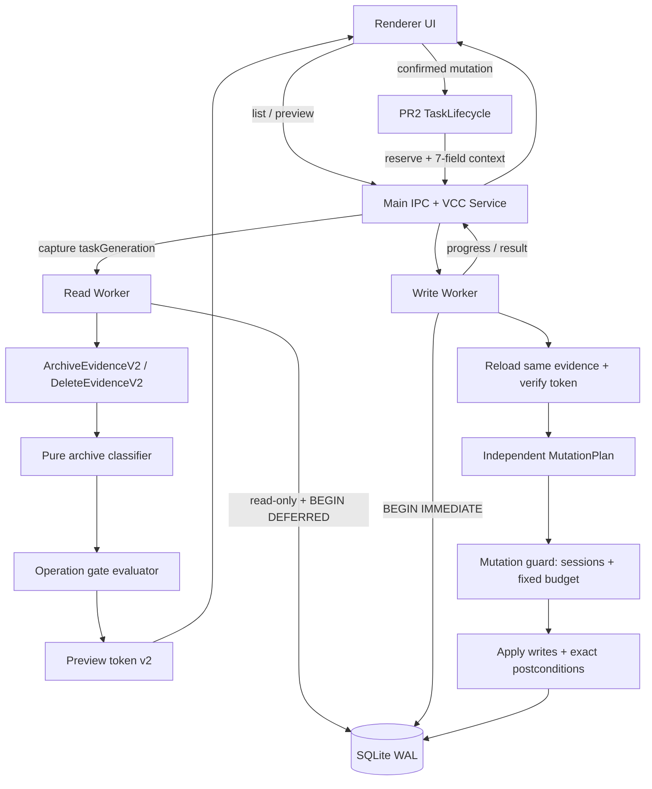

# VCC 财务 OP v3.1.8 卡顿与旧归档兼容纠错 TechDoc v1.1

> document-version: `1.1`<br>
> document-date: `2026-08-10`<br>
> product-spec: `VCC财务OP-3.1.8卡顿与旧归档兼容纠错Spec-v2.md`<br>
> implementation-release: `v3.1.9`<br>
> implementation-baseline-candidate: `1687cfa；仅在 PR2 CI 全绿后冻结`<br>
> supersedes: `VCC财务OP-3.1.8卡顿与旧归档兼容纠错TechDoc-v1.md`<br>
> status: `implementation-ready；合并/发布 PROBE 仍待完成`

## 0. 文档目的

本文把 Spec v2 转换为可直接实施的技术合同，覆盖：

- 归档结构分类与操作门禁分离；
- 轻量一致性快照和 preview token v2；
- 数据管理、删除目标和归档枚举的性能改造；
- 修改结果、确认归档、解归档和删除的写 worker；
- 固定变化预算 mutation guard；
- PR2 TaskLifecycle、七字段 worker context、进度和取消；
- 真实 v3.1.7 fixture、16 GB 基准和发布门禁。

本设计不修改金额、币种、主体、九币种计算、调整公式、跨月期初或五表新计算规则。

### 0.1 v1.1 修订记录

本次不改变 Spec v2 的产品口径，只关闭进入 C1/C2 前的技术缺口。

| 类别 | v1.1 决定 | 证据/原因 | 放弃的方案 |
|---|---|---|---|
| 资金证据 | ArchiveEvidenceV2 增加 Pending effective facts、run rows、adjustment lineage、基础余额和调整后有效余额证据。 | 当前归档保存 `effectiveCalculatedBalance`；`getEffectiveRunResult()` 会验证 run rows、sequence、metadata 和 revision。 | 只比较基础 `calculatedBalance` 或只看 adjustment count。 |
| 读取边界 | 候选月结果证据必须按表集合读取，并在 JS 中按 run 分组执行同一纯校验器。 | 逐月调用 `getEffectiveRunResult()` 会重新形成 N+1。 | 为每个月调用现有完整结果读取。 |
| 写保护 | 大表采用定义完备的 `largeTableScopeProof`；不再允许未定义的“等价 row-scope guard”。 | session changeset 对百万行删除有内存放大风险。 | 对大表生成全量 changeset，或只检查总变化数。 |
| 失败审计 | guard/runtime/trigger 不可信时只写应用日志；其他 rollback 审计使用独立、受保护的 audit-only 事务。 | 原事务外直接 INSERT 可能再次触发未受保护写入。 | 无条件 best-effort 写 `rolled_back` audit。 |
| 状态所有权 | preview generation 绑定无 TTL 的独占 claim。 | 现有 service 已有 `activeTask/taskGeneration`；本项目明确不新增 lease/timer/retry。 | “本地任务租约”表述。 |
| PR 边界 | active month visibility 从 A 移到 B，与 read worker 和集合查询同时切入口。 | effective rows 约 610 万行，B 前不得把扫描放回主进程。 | A 中先切生产入口。 |

已确认事实与代码证据：

- `src/backend/vcc-financial-op/calculator.js:1399` 的 `archiveRun()` 把 `effectiveCalculatedBalance` 写入 archive；
- `src/backend/vcc-financial-op/result-adjustments.js:310,790` 的 adjustment/result 校验覆盖基础结果行、目标 metadata/sequence、`result_revision` 和九币种有效余额；
- `src/backend/vcc-financial-op-db/migrations.js:631` 的 `idx_vcc_fin_op_effective_month_source` 已以 `target_month` 为前导列；本方案不新增 schema migration；
- `src/main-process/archive-center/task-policy-registry.js:16` 仍把 VCC channel 留给 PR3；`src/main-process/vcc-financial-op-service.js:188` 附近已有 `activeTask/taskGeneration` 进程内独占基础。

剩余 runtime、真实旧库和 16 GB 性能未知继续按 §20 的 PROBE 管理，不升级为假定事实。

### 0.2 Task Brief

- **Goal**：让 PR2.5-A/B/C1/C2 能按确定的资金证据、并发和写保护合同实施，并先于 PR3-VCC 落地。
- **Context**：Spec v2 产品口径已解除 BLOCK；TechDoc v1 的 evidence、row-scope guard 和 PR 边界仍不完整。
- **Constraints**：不改变 Spec v2、不新增 schema migration、不逐月读取完整结果、不新增 lease/timer/retry、不在 guard 不可信时降级写库。
- **Done when**：DTO 能证明调整后余额和 legacy Pending 缺失；每个写 operation 有固定 step/scope/budget/postcondition；失败审计安全；A/B 边界不把 610 万行扫描留在主进程；剩余发布未知均有 PROBE 和失败处置。

## 1. 当前实现与根因

### 1.1 当前调用链

```text
Renderer
  ├─ openDataManager() 等待 listImportMonths + listArchivedResultMonths
  ├─ confirmArchive() → archive IPC
  └─ delete/unarchive dialogs → preview → execute
        │
        ▼
Main process / VCC service
  ├─ 多个只读方法直接使用主进程 DatabaseSync
  ├─ archive / adjustment 使用 runDirectTask
  └─ delete / unarchive 使用 worker
        │
        ▼
VCC backend
  ├─ buildOperationState()
  │    └─ snapshotSourceFacts()
  │         └─ GROUP BY vcc_fin_op_import_rows.target_month
  └─ snapshot*MutationState()
       └─ 前后遍历 VCC 事实表并 SHA-256
```

### 1.2 已确认问题

- `openDataManager()` 在弹窗挂载前等待数据库响应。
- `listArchivedResultMonths()` 对每个候选月份构建完整 operation state。
- `snapshotSourceFacts()` 读取约千万行 import rows；归档枚举并不需要这些数据。
- `listDeleteTargets()` 对多个目标重复 preview，renderer 切换目标后再次请求。
- archive 和 adjustment 在主进程同步事务中执行。
- adjustment、archive、unarchive 和三类删除使用全事实表前后指纹，耗时与无关历史数据增长。
- worker 每次打开数据库都调用 migration，并设置 journal mode；只读 worker 不应具有该副作用。

## 2. 目标架构



核心分层：

1. **Evidence loader**：只负责在单个数据库快照内读取事实。
2. **Archive classifier**：纯函数，只判断结构。
3. **Operation gate**：只判断当前能否解归档。
4. **Preview token**：绑定结构证据、gate 证据和 task generation。
5. **Mutation plan**：写入前独立计算允许变化。
6. **Mutation guard**：阻止任何计划外写入。

## 3. 模块边界

### 3.1 建议新增或拆分的内部模块

```text
src/backend/vcc-financial-op/
  archive-evidence.js          # 集合化 archive/result evidence read loader
  result-evidence.js           # 纯 run/adjustment/effective balance 校验
  archive-contract.js          # 纯分类器
  unarchive-gate.js            # gate 读取与评估
  operation-token-v2.js        # canonical token
  mutation-guard.js            # table registry/session/large-table scope proof
  mutation-plans.js            # operation-specific expected plans

src/main-process/
  vcc-financial-op-read-worker.js
  vcc-financial-op-service.js  # read/write worker dispatch + task generation
```

可以复用现有 worker entry，也可以拆成 read/write 两个 entry；最终合同必须保证 read worker 永远不能进入写路径。推荐拆分两个 entry，降低 action 配置错误导致的权限扩大。

### 3.2 现有模块职责调整

- `unarchive.js`：消费分类结果和 gate，不再自行混合读取 source facts。
- `operation-state.js`：旧 token v1 只保留兼容测试；新路径不再构建全量 state。
- `preserved-state.js`：从产品写路径移除全事实表 SHA；可保留为离线诊断工具，或在无调用后删除。
- `calculator.js` / `result-adjustments.js`：写事务接入 MutationPlan/Guard。
- `data-target-deletion.js` / `dataset-deletion.js`：单月 evidence、固定预算、审计物化优化。
- `worker-entry.js`：不执行 migration；写 action 进入 critical section 后不可 terminate。
- renderer：先挂载 shell、使用 target preview cache、消费 operation progress。

## 4. 核心 DTO 与类型合同

以下为内部合同，字段名可按现有 JS 风格调整，但语义不得省略。

### 4.1 ArchiveEvidenceV2

```ts
type ArchiveRunEvidence = {
  id: number;
  targetMonth: string;
  status: 'calculated' | 'archived';
  resultRevision: number;
  inputFingerprint: string | null;
  inputRevisions: Record<string, number> | null;
  inputRevisionsParseError: boolean;
  createdAt: string;
  updatedAt: string | null;
  archivedAt: string | null;
};

type DatasetEvidence = {
  datasetType: string;
  dataStatus: 'unprocessed' | 'archived';
  revision: number;
  archivedRunId: number | null;
  generatedAt: string | null;
  updatedAt: string | null;
};

type ArchiveRowEvidence = {
  subject: string;
  runId: number;
  archivedAt: string;
  balances: Record<string, string> | null;
  balancesParseError: boolean;
  balancesHash: string;
};

type RunRowEvidence = {
  id: number;
  runId: number;
  rowKey: string; // 由现有 buildRunRowKey(metadata) 语义派生
  rowKind: 'movement' | 'pending';
  subject: string;
  sourceType: string;
  categoryMajor: string;
  categoryMinor: string;
  currency: string;
  amount: string;
};

type RunAdjustmentEvidence = {
  id: number;
  runId: number;
  rowKey: string;
  subject: string;
  sourceType: string;
  categoryMajor: string;
  categoryMinor: string;
  currency: string;
  adjustmentAmount: string;
  reason: string;
  sequence: number;
  createdAt: string;
  createdAppVersion: string | null;
  createdBuildSha: string | null;
};

type StoredRunBalanceEvidence = {
  runId: number;
  subject: string;
  currency: string;
  openingBalance: string;
  periodAmount: string;
  calculatedBalance: string;
  systemBalance: string;
  difference: string;
};

type EffectiveBalanceEvidence = {
  runId: number;
  subject: string;
  currency: string;
  openingBalance: string;
  basePeriodAmount: string;
  baseCalculatedBalance: string;
  baseDifference: string;
  systemBalance: string;
  adjustmentAmount: string;
  effectivePeriodAmount: string;
  effectiveCalculatedBalance: string;
  effectiveDifference: string;
};

type ResultValidationEvidence = {
  resultValidationVersion: 1;
  runId: number;
  baseRowCount: number;
  adjustmentCount: number;
  adjustmentSequenceMax: number;
  sequenceContinuous: boolean;
  revisionMatchesAdjustmentCount: boolean;
  adjustmentTargetsValid: boolean;
  adjustmentMetadataValid: boolean;
  baseBalanceFormulaValid: boolean;
  currenciesComplete: boolean;
  effectiveBalances: EffectiveBalanceEvidence[];
  violations: string[];
};

type ArchiveEvidenceV2 = {
  evidenceVersion: 2;
  targetMonth: string;
  runs: ArchiveRunEvidence[];
  datasets: DatasetEvidence[];
  archives: ArchiveRowEvidence[];
  runRows: RunRowEvidence[];
  runAdjustments: RunAdjustmentEvidence[];
  storedRunBalances: StoredRunBalanceEvidence[];
  resultValidations: ResultValidationEvidence[];
  pendingEffectiveFactCount: number;
  pendingRunRowCount: number;
  pendingSummaryCount: number;
  pendingCurrencyTotalCount: number;
};
```

规则：

- read worker 对全部候选 run 分别以一次 set query 读取 run rows、adjustments 和 run balances，在内存按 `run_id` 分组；不得逐月或逐 run 调用 `getEffectiveRunResult()`。
- `validateEffectiveResultEvidence()` 必须是纯函数，并复用现有 `buildRunRowKey()`、金额规范化和九币种语义；`resultValidations` 只能由该纯函数从同一批 raw evidence 产生，不能直接信任 SQL 返回的布尔摘要。
- 每个 run 必须验证 `resultRevision === adjustmentCount`、sequence 从 1 连续递增、`sequenceMax === adjustmentCount`、调整坐标唯一、rowKey 目标存在、主体/来源/分类 metadata 与目标完全一致。
- effective balance 必须从基础 run rows、stored run balances 和 adjustment totals 逐主体逐币种重算；archive 只能与 `effectiveCalculatedBalance` 比较，不能与基础 `calculatedBalance` 比较。
- `pendingEffectiveFactCount` 来自 `vcc_fin_op_effective_rows WHERE source_type='pending_archive_removal'` 的集合查询；legacy 要求它与其他三类 Pending child count 全部为 0。
- 数组必须按稳定键排序。
- `input_revisions_json` 先解析为对象，再校验精确键集合和整数 revision；禁止原始 JSON 字符串比较。
- 金额先通过 `canonicalizeVccAmount()`，分类器比较规范十进制字符串。
- hash 只在上述语义校验通过后用于 token 和审计摘要，不能代替金额、sequence 或血缘校验。

### 4.2 ArchiveContractResult

```ts
type ArchiveContract =
  | 'current-five-dataset'
  | 'legacy-v3.1.7-four-dataset'
  | 'inconsistent';

type ArchiveContractResult = {
  classifierVersion: 1;
  contract: ArchiveContract;
  structuralReasons: string[];
  runId: number | null;
  archivedAt: string | null;
  resultRevision: number | null;
  subjects: string[];
  datasetTypes: string[];
};
```

`structuralReasons` 只能由 ArchiveEvidenceV2 产生，禁止加入 active task、unresolved import 或 later dependency。

### 4.3 UnarchiveGateEvidence

```ts
type LaterDependencyEvidence = {
  targetMonth: string;
  runs: Array<{
    id: number;
    status: 'calculated' | 'archived';
    resultRevision: number;
    updatedAt: string | null;
    archivedAt: string | null;
  }>;
  archiveCount: number;
  archivedDatasetTypes: string[];
};

type UnresolvedImportEvidence = {
  id: number;
  sourceType: string;
  status: string;
  resolutionStatus: 'unresolved';
};

type UnarchiveGateEvidence = {
  gateVersion: 1;
  taskGeneration: number;
  taskActive: boolean;
  activeBatchIds: string[];
  importingRecordIds: number[];
  unresolvedRecords: UnresolvedImportEvidence[];
  laterDependencies: LaterDependencyEvidence[];
};
```

### 4.4 UnarchivePreviewV2

```ts
type UnarchivePreviewV2 = {
  targetMonth: string;
  archiveContract: ArchiveContract;
  structuralReasons: string[];
  runId: number | null;
  archivedAt: string | null;
  resultRevision: number | null;
  subjects: string[];
  dependentMonths: string[];
  canEnumerate: boolean;
  canExport: boolean;
  canUnarchive: boolean;
  code: string;
  message: string;
  previewToken: string;
  taskGeneration: number;
};
```

renderer 不展示 `archiveContract`，但测试、日志和 audit 可以读取。

## 5. 结构分类算法

### 5.1 纯函数入口

```js
classifyArchiveContract(evidence) -> ArchiveContractResult
```

该函数：

- 不接收 DatabaseSync；
- 不读取 task state；
- 不读取 import records、import rows 或后续月份；
- 对相同 canonical evidence 始终返回相同结果。

### 5.2 通用结构检查

1. archived run 恰好 1 个。
2. calculated run 为 0 个。
3. archive 至少 1 条，subject 唯一，全部 run ID 相同。
4. 恰好一份 `ResultValidationEvidence` 指向该 run，且 raw run rows、adjustments、stored balances 全部属于该 run。
5. 纯校验器的 `violations` 为空；基础行、调整目标/metadata/sequence、基础余额公式及 revision 合同全部成立。
6. `effectiveBalances` 的 subject×currency 坐标唯一，每个主体币种集合精确等于九币种集合。
7. archive 与 `effectiveBalances` 主体集合相等。
8. archive 金额与 `effectiveCalculatedBalance` 逐坐标规范十进制相等。

通用检查失败直接 inconsistent，不再尝试 legacy fallback。

### 5.3 current 分类

- dataset 类型精确等于五类集合；
- dataset 全 archived 且 archivedRunId 为目标 run；
- input revisions 精确等于五类 dataset revision；
- input fingerprint 通过现有有效格式校验；
- `resultRevision === adjustmentCount`，sequence 从 1 连续到 result revision；
- 调整目标 rowKey、主体、来源、分类和币种血缘有效；
- archive 比较的是含全部合法调整后的九币种有效余额。

### 5.4 legacy 分类

- dataset 类型精确等于 v3.1.7 四类集合；
- input revisions 精确等于四类 dataset revision；
- input fingerprint 必须为 SQL NULL；空字符串不等同 NULL；
- result revision 为 0；
- adjustment count 和 sequence max 均为 0；
- `pendingEffectiveFactCount`、Pending run rows、Pending summary 和 Pending currency totals 均为 0；
- 不存在 Pending dataset；不得把缺失 Pending 解释成一个空 Pending dataset。

### 5.5 不允许的实现

- “缺 Pending 就当 legacy”的宽松判断；
- current 失败后忽略其他异常强制降为 legacy；
- 根据 app version、created_at 或文件名猜测旧版本；
- 比较 JSON 文本或余额 hash 代替语义解析；
- 为补齐调整后余额证据而逐月/逐 run 调用 `getEffectiveRunResult()`；
- 把 later month、active task 或 unresolved import 写进 structural reasons。

## 6. 操作门禁算法

```js
evaluateUnarchiveGate(contractResult, gateEvidence) -> {
  canUnarchive,
  code,
  message,
  dependentMonths
}
```

固定优先级：

1. contract inconsistent → `archive-state-inconsistent`
2. `taskActive=true`、`activeBatchIds` 非空或 `importingRecordIds` 非空 → `active-vcc-task`
3. unresolvedRecords 非空 → `unresolved-imports`
4. laterDependencies 非空 → `unarchive-not-tail`
5. 否则允许。

`listArchivedResultMonths()` 和 `getArchivedRunByMonth()` 只消费 contractResult：

- current/legacy 均列出并允许导出；
- inconsistent 排除并记录结构原因；
- gate 不影响枚举或导出。

## 7. 只读快照与 token v2

### 7.1 Read worker 数据库连接

```js
const db = new DatabaseSync(dbPath, { readOnly: true });
db.exec('PRAGMA query_only = ON');
db.exec('PRAGMA foreign_keys = ON');
db.exec('PRAGMA busy_timeout = 30000');
assertVccSchemaReady(db);
db.exec('BEGIN DEFERRED');
try {
  const result = loadEvidenceInOneSnapshot(db, payload);
  db.exec('COMMIT');
  return result;
} catch (error) {
  if (db.isTransaction) db.exec('ROLLBACK');
  throw error;
}
```

禁止：

- `ensureVccFinancialOpTablesSupport()`；
- `PRAGMA journal_mode=WAL`；
- CREATE/ALTER/UPDATE；
- migration 或 recovery side effect。

### 7.2 Schema-ready 断言

`assertVccSchemaReady()` 只读检查：

- 必需表存在；
- run 的 `result_revision/input_fingerprint/updated_at` 列存在；
- import record lifecycle 列存在；
- mutation guard 需要的主键和现有索引存在。

失败返回 `vcc-schema-not-ready`，提示重启应用完成初始化；worker 不自行修复。

### 7.3 token v2 canonical payload

```js
{
  tokenVersion: 2,
  action: 'unarchive' | 'delete-data-target',
  targetMonth,
  scope,
  classifierVersion,
  archiveContract,
  structuralEvidence: {
    run,
    datasets,
    archives: [{ subject, runId, archivedAt, balancesHash }],
    resultValidationVersion,
    resultEvidenceDigest,
    effectiveBalanceHash,
    adjustmentCount,
    adjustmentSequenceMax,
    pendingEffectiveFactCount,
    pendingChildCounts
  },
  gateEvidence: {
    taskGeneration,
    activeBatchIds,
    importingRecordIds,
    unresolvedRecords,
    laterDependencies
  }
}
```

使用稳定键排序和 canonical JSON 后计算 SHA-256。不得包含：

- 未经语义验证的 balance/adjustment hash；`resultEvidenceDigest` 只能在纯校验器完成金额、sequence、metadata 和 revision 校验后生成；

- 全量 import rows；
- 与 target/scope 无关的其他月份事实；
- opening、source facts 等本操作不依赖的数据；
- renderer 可伪造的 app/build/task provenance。

### 7.4 竞态闭合

1. Main 捕获 `taskGeneration` 和 activeTask 状态。
2. Read worker 在一个数据库快照中读取 evidence。
3. worker 返回后，Main 再检查 taskGeneration 和 activeTask 未变化；否则返回 `state-changed`/`active-vcc-task`。
4. 提交时 Service 原子取得 generation-bound 独占 claim：仅当 `activeTask === null` 且当前 generation 等于 preview generation 才成功；claim 绑定 action、generation 和进程内 task identity，并且只释放一次。
5. Write worker `BEGIN IMMEDIATE` 后重新读取同一 evidence，重新生成 token。
6. token 不同则 rollback，零业务写入。

该 claim 不是 lease：没有 TTL、到期、timer、续租、后台恢复、自动重试或跨进程抢占。worker 不自行 acquire/release claim；Main 在终态 CAS 收敛后按现有 `releaseTask()` 语义递增 generation。

## 8. 集合化归档读取

`listArchivedResultMonths()` 不允许按月份调用 N 次完整 state builder。

目标实现：

1. 一次读取候选 target_month，并用 CTE/临时只读 candidate relation 贯穿后续查询。
2. 以候选集合分别批量读取 runs、datasets、archives、run rows、run balances、run adjustments、Pending summary/currency totals，以及 Pending effective fact count；每张表至多一条 set query。
3. 在内存按 target_month/run_id 分组，派生 rowKey，并用 `validateEffectiveResultEvidence()` 重算基础汇总、调整 totals 和 `effectiveCalculatedBalance`。
4. 只有纯结果校验无 violations 后，才生成 result evidence digest，并对每月调用同一个 pure classifier。
5. 返回 current/legacy，记录 inconsistent 的结构化 reasons。

SQL trace 必须证明：

- 零 `vcc_fin_op_import_rows`；
- 零 opening 查询；
- 零逐月/逐 run `getEffectiveRunResult()`；
- 0/1/100 候选月份的 SQL 语句数量保持常数级；
- 不为每个候选月创建临时 B-tree 扫描事实大表。

若 SQLite 参数数量限制影响 100+ 候选，使用单次 JOIN/CTE，不退回逐月查询。run rows 或 adjustments 总量超出 worker 内存预算时必须分页流式读取并按稳定 `run_id,id` 归并；分页次数可以随行数增长，但 SQL 形态不能随月份数形成 N+1。

## 9. 活动月份读取

### 9.1 派生集合

活动月份来自：

```sql
SELECT target_month FROM vcc_fin_op_datasets
UNION SELECT target_month FROM vcc_fin_op_runs
UNION SELECT target_month FROM vcc_fin_op_archives
UNION SELECT target_month FROM vcc_fin_op_opening_balances
UNION SELECT target_month FROM vcc_fin_op_import_batches WHERE status = 'importing'
UNION
SELECT target_month FROM vcc_fin_op_import_records
WHERE status = 'importing'
   OR resolution_status = 'unresolved'
   OR (
     status IN ('success', 'success_with_skips', 'all_skipped')
     AND dataset_deleted_at IS NULL
   )
UNION SELECT target_month FROM vcc_fin_op_effective_rows
UNION SELECT target_month FROM vcc_fin_op_system_snapshots
ORDER BY target_month DESC;
```

要求：

- effective rows 只使用现有 target_month-leading covering index；不得读取 raw_json。
- 结果按 taskGeneration 缓存；导入、计算、归档、解归档、删除或异常处理完成后失效。
- import rows、operation audit、dataset deletion 和 module first_month 不进入集合。
- 若 covering-index 扫描在 16 GB 副本上超出预算，允许把 orphan-fact 扫描拆为异步诊断缓存，但不得直接删除该 fail-safe；变更必须反向同步 Spec/TechDoc。

### 9.2 隐藏与重现

- 删除完成后重新计算活动月份。
- target month 仍存在则保持选择。
- target month 消失则选择最新活动月。
- 无活动月则禁用删除/导出并显示空状态。
- 新导入或新 run 使月份自动重现。

## 10. 删除目标一次快照

### 10.1 DeleteEvidenceV2

一次读取：

- target month datasets；
- runs/archives；
- opening count；
- effective rows 按 source_type 分组计数；
- system snapshot count；
- active/importing/unresolved evidence；
- module first_month；
- taskGeneration。

从同一 evidence 派生最多五类 source、opening 和 result 目标。每个目标的 token 为：

```text
hash(shared DeleteEvidenceV2 + targetType)
```

renderer 切换 target 时直接使用响应中的完整 preview，不调用第二次 preview IPC。保留单目标 preview IPC 仅用于兼容、显式刷新和测试。

### 10.2 计数口径

- source count：当前 effective rows 或 system snapshots 数量。
- result count：calculated run 数量。
- opening count：opening subject 数量。
- 不在预览中统计 import rows 审计数量。

## 11. Worker 协议

### 11.1 Read actions

```text
list-archive-months
preview-unarchive
list-delete-targets
preview-delete-target
list-active-months
```

- 不进入 TaskLifecycle；
- 不创建批次；
- 不接受 worker batch context；
- 必须 read-only。

### 11.2 Write actions

```text
add-adjustment
archive-run
unarchive-month
delete-data-target
```

- 进入受保护 critical section 后才能打开写连接和开始事务；
- 不执行 migration；
- 最终 PR3 接线后接收并 refreeze 恰好七字段 context：

```text
batchId / batchNumber / taskRunId / taskKey /
moduleId / parentRunId / operationKey
```

- worker 不接收 `settleArtifacts`、service/repository 对象或生命周期控制函数；
- worker 永远不 reserve/reopen/create batch。

PR2.5-C 的中间分支尚未接入 PR3 时允许 context 缺失，但该中间状态不得发布；PR3 后 reserve action 必须要求 context 存在。

### 11.3 Progress

IPC event：`vccFinancialOp:operation:progress`

```ts
type OperationProgress = {
  action: 'adjustment' | 'archive' | 'unarchive' | 'delete';
  targetMonth: string;
  runId: number | null;
  phase:
    | 'validating'
    | 'preserving-audit'
    | 'applying'
    | 'verifying'
    | 'committed';
  cancellable: boolean;
};
```

事件由 worker → main → renderer 单向发送，不走业务 invoke，不进入 TaskPolicyRegistry reserve 集合。

### 11.4 Cancel

- `critical-ready` 前 cancel：worker 返回 `operation-cancelled`，TaskLifecycle 恰好一次 CAS 为 cancelled。
- Main 发送 `critical-ack` 前必须先把 task 标为 protected。
- protected 后不 terminate worker；cancel 调用等待 completion。
- commit 成功返回 succeeded，rollback 返回 failed；迟到 cancel 不得覆盖终态。

## 12. Mutation Guard

### 12.1 目标

替代全事实表前后 SHA，同时保留“本操作只能修改明确集合”的失败关闭能力。

### 12.2 Table policy registry

建立单一 `VCC_TABLE_POLICY_REGISTRY`：

```js
{
  tableName: {
    primaryKey: ['id'],
    category: 'business' | 'audit' | 'metadata',
    operations: {
      [operation]: 'protected' | 'allowed'
    }
  }
}
```

CI 读取 `sqlite_schema` 中全部 `vcc_fin_op_%` 表；任一新表未登记即失败。生产数据库发现未批准的 VCC trigger 时返回 `vcc-trigger-policy-violation`。

### 12.3 Runtime capability

应用发布前必须在开发 Node、macOS Electron、Windows installer 和 portable runtime 中验证：

- `DatabaseSync.createSession` 存在；
- 空 session changeset 为空；
- trigger 间接写入受保护表会产生非空 changeset；
- `SELECT total_changes()` 包含 trigger 写入；
- session 可在 COMMIT/ROLLBACK 后关闭且无泄漏。

任一失败返回 `mutation-guard-unavailable` 并阻断发布；运行时不得降级为只做后置查询。

### 12.4 MutationPlan

```ts
type MutationScope =
  | { kind: 'exact-pk-set'; primaryKeys: Array<string | number> }
  | { kind: 'locked-predicate'; predicateId: string; expectedRows: number };

type MutationStepPlan = {
  stepId: string;
  tableName: string;
  mutation: 'insert' | 'update' | 'delete';
  expectedChanges: number;
  scope: MutationScope;
  postconditionId: string;
};

type TableMutationBudget = {
  inserts: number;
  updates: number;
  deletes: number;
  protection: 'empty-session' | 'planned-scope';
};

type MutationPlan = {
  operation: string;
  targetMonth: string;
  runId: number | null;
  lockedEvidenceToken: string;
  steps: MutationStepPlan[];
  tableBudgets: Record<string, TableMutationBudget>;
  expectedTotalChanges: number;
  expectedPostState: unknown;
};
```

MutationPlan 必须在 `BEGIN IMMEDIATE` 内、首个业务写入前，从锁定前态独立产生。禁止把执行后 SQL `.changes` 汇总成 expected plan。

所有 DML 必须来自不可变的 `MUTATION_SQL_STEP_REGISTRY`。每个 `stepId` 固定 table、verb、SQL 文本、参数绑定方式、pre-count 和 postcondition；业务 payload 只能提供经过规范化的 month/run/source/PK 参数，不能提供表名、列名、WHERE 或 SQL 片段。CI 对 registry SQL 做快照并验证没有未登记的 VCC DML。

### 12.5 Guard 执行顺序

```text
BEGIN IMMEDIATE
  → reload evidence / verify preview token
  → build independent MutationPlan
  → assert trigger policy
  → record total_changes baseline
  → create empty-change sessions for every wholly protected table
  → execute registered steps only
  → each statement .changes == plan table/step budget
  → total_changes delta == expectedTotalChanges
  → every protected session changeset is empty
  → every planned-scope step passes exact postconditions
  → exact success-evidence assertion
COMMIT
```

任一步失败先 ROLLBACK。是否允许写 `rolled_back` audit 必须走 §12.10；禁止直接调用旧的无保护 best-effort INSERT，失败审计不能覆盖原始异常。

### 12.6 非目标行保护：largeTableScopeProof

SQLite session 只用于“本次完全禁止变化”的整表空 changeset 断言。允许写入的表——包括同表中的非目标月份/非目标 run——统一使用以下完备证明，不再保留“或等价 row-scope guard”占位：

1. **无 trigger**：事务首写前确认全部 `vcc_fin_op_%` 表不存在未批准 trigger；否则零写入失败关闭。
2. **锁定前态**：在同一 `BEGIN IMMEDIATE` 内，用 registry 固定 count query 计算目标行数、目标 PK（小表）或不可变 scope predicate（大表）。
3. **固定 SQL**：只有 registry 中的 step 可执行；WHERE 必须由固定 month/run/source/FK scope 组成。
4. **逐步预算**：每条 DML 的 `.changes` 必须等于该 step 的锁定前 count，不能只检查操作总数。
5. **目标穷尽断言**：小表逐 PK 校验 old/new；大表验证目标范围归零或目标字段全部达到精确值。所有应完成目标均成立后，计划内变化数已经被穷尽。
6. **总量守恒**：`total_changes - baseline === expectedTotalChanges`。任何额外 direct SQL、no-op UPDATE、先改后还原或非目标行写入都会增加 delta 并回滚。
7. **保护表为空**：所有未列入 operation allowlist 的 VCC 表 session changeset 必须为空。

因此，如果计划内目标全部通过且总变化数精确，allowed table 中不可能再有非目标行变化；否则必然表现为 step count、postcondition 或 total delta 至少一项不一致。

大表不得生成全量 session changeset，以免复制百万行。以下表固定使用 `largeTableScopeProof`：

- `vcc_fin_op_effective_rows`；
- `vcc_fin_op_import_rows`；
- `vcc_fin_op_system_snapshots`；
- `vcc_fin_op_system_snapshot_attempts`。

### 12.7 锁定前预算符号

以下计数全部在 `BEGIN IMMEDIATE` 和 token 重验后、首写前产生：

| 符号 | 锁定范围 |
|---|---|
| `N` | archive subject/row 数。 |
| `K` | 目标 archived dataset 数；current=5，legacy=4。 |
| `R` | 本次删除的 calculated run 数。 |
| `C_adj/C_row/C_bal/C_ps/C_pc` | 上述 run IDs 在 adjustment、run rows、run balances、Pending summary、Pending currency totals 的行数。 |
| `O` | 目标月 opening rows。 |
| `E` | 目标月+source 的 effective rows。 |
| `Q` | `existing_effective_id` 指向上述 `E` 集合的 import audit rows。 |
| `S` | 目标月 system snapshots。 |
| `B` | system snapshots 中缺少唯一 accepted attempt、需要补录的数量。 |
| `A` | 补录后仍以 `existing_snapshot_id` 指向目标 snapshots 的 system attempts 数，等于原关联数加 `B`。 |
| `D` | 目标 dataset 行数，只能为 0 或 1。 |
| `M` | 目标月+source、success-like 且尚未标 deleted 的 import records。 |

每个符号都保存 count query ID 和 scope 参数；禁止用执行后 `.changes` 回填。run child 删除必须逐表保留五个独立预算，不能只保存 `ΣC`。

### 12.8 C1 operation allowlist 与固定预算

C1 生成 plan 前必须先识别 legacy 解归档后的四数据集 calculated run；此状态的 adjustment/archive 直接返回 `result-recalculation-required`，零 DML、零 success evidence，不得依赖普通五表 preflight 偶然报错。

#### Adjustment

| stepId | 表 | 唯一允许范围 | 预算 | 精确提交前断言 |
|---|---|---|---:|---|
| `adjustment.insert` | `vcc_fin_op_run_adjustments` | 一个新 ID，`run_id=runId`、目标 rowKey+currency，ID 大于锁定 boundary | INSERT 1 | 所有列（目标 metadata、amount、reason、sequence、app/build/time）与 plan 相等；boundary 后恰好 1 行。 |
| `adjustment.bump-run` | `vcc_fin_op_runs` | `id=runId AND status='calculated' AND result_revision=expected` | UPDATE 1 | revision=`expected+1`、status 不变、updated_at=事务时间。 |

总预算固定为 `2`。本操作不另写 operation audit；不可变 adjustment row 本身是 success evidence，必须按上表逐字段断言。若未来新增 operation audit，必须先反向同步 Spec/TechDoc 并把预算改为 3。

#### Archive

| stepId | 表 | 唯一允许范围 | 预算 | 精确提交前断言 |
|---|---|---|---:|---|
| `archive.audit-success` | `vcc_fin_op_operation_audit` | boundary 后唯一新 ID | INSERT 1 | 满足 §12.10 success audit 合同。 |
| `archive.insert-subjects` | `vcc_fin_op_archives` | 精确 `(targetMonth, subjectSet)` | INSERT `N` | 恰好 N 个主体；runId/time 一致；九币种金额等于已验证 `effectiveCalculatedBalance`。 |
| `archive.mark-run` | `vcc_fin_op_runs` | `id=runId` | UPDATE 1 | archived/status/time/revision/fingerprint 精确，其他列不变。 |
| `archive.mark-datasets` | `vcc_fin_op_datasets` | 目标月精确五类 PK | UPDATE 5 | 五类均 archived、archivedRunId=runId、time 一致，revision 不变。 |

总预算固定为 `N+7`。

### 12.9 C2 operation allowlist 与固定预算

#### Current unarchive

| stepId | 表 | 唯一允许范围 | 预算 | 精确提交前断言 |
|---|---|---|---:|---|
| `unarchive.audit-success` | `vcc_fin_op_operation_audit` | boundary 后唯一新 ID | INSERT 1 | 满足 success audit 合同。 |
| `unarchive.delete-archives` | `vcc_fin_op_archives` | `target_month=targetMonth` 的锁定 subjectSet | DELETE `N` | 目标月 archive 为 0；其他月份不在固定 SQL scope。 |
| `unarchive.restore-run` | `vcc_fin_op_runs` | `id=runId AND target_month=targetMonth` | UPDATE 1 | calculated、archived_at NULL、time 精确；金额/revision/input 不变。 |
| `unarchive.restore-datasets` | `vcc_fin_op_datasets` | 目标月、runId、五类 PK | UPDATE 5 | 五类均 unprocessed、archivedRunId NULL、time 精确、revision 不变。 |

总预算固定为 `N+7`。

#### Legacy unarchive

与 current 使用相同 step，唯一区别是 dataset 精确 PK 集合为 v3.1.7 四类、`K=4`。总预算固定为 `N+6`；不得创建或更新 Pending dataset/facts。

#### Result/opening/source delete

| operation | 允许表/step | 固定范围与逐步预算 | 总预算 |
|---|---|---|---:|
| result delete | operation audit INSERT 1；五个 run child 表分别 DELETE `C_*`；runs DELETE `R` | run IDs 必须等于锁定 calculated run set；逐表归零；目标月不得剩余 run/child。 | `1 + R + ΣC` |
| opening delete | result delete 全部 step；opening DELETE `O` | opening PK 精确为目标月 subjectSet；目标月 opening/run/child 归零；module `first_month` 只读且仍等于目标月。 | `1 + R + ΣC + O` |
| detail source delete | operation audit INSERT 1；五个 child DELETE `C_*`；runs DELETE `R`；import rows snapshot UPDATE `Q`；import rows FK-null UPDATE `Q`；effective DELETE `E`；dataset DELETE `D`；dataset deletion INSERT 1；import records UPDATE `M` | detail audit scope 只允许 `existing_effective_id` 指向锁定 E 集合；删除 effective 前逐字段验证 snapshot 等于源事实并验证引用归零；E/target dataset/run/child 归零；M 行精确绑定新 deletionId/time。 | `2 + R + ΣC + 2Q + E + D + M` |
| system source delete | operation audit INSERT 1；五个 child DELETE `C_*`；runs DELETE `R`；attempt backfill INSERT `B`；attempt snapshot UPDATE `A`；attempt FK-null UPDATE `A`；system snapshot DELETE `S`；dataset DELETE `D`；dataset deletion INSERT 1；import records UPDATE `M` | 每个 snapshot 最终恰好一条语义一致 accepted attempt；物化字段逐字段相等后才清 FK；目标 S/dataset/run/child 归零；新 attempt IDs、time 和 deletion row 精确。 | `2 + R + ΣC + B + 2A + S + D + M` |

共同要求：

- 公式中的 `ΣC` 仅为展示缩写，等于五张 child 表预算之和；runtime plan 仍必须保留五个独立 step。
- `D` 只能是 0 或 1；`D=0` 但存在有效 facts 时按现有 orphan-fact 删除语义显式记录诊断，不伪造 dataset，也不把它扩展为 archive legacy fallback。
- `M` 必须大于 0 且与锁定 success-like record set 完全一致。
- `C_*`、R、O、E、Q、S、B、A、D、M 各 step 的 `.changes` 必须分别相等；不得只验证右侧总公式。
- 小表的允许 PK/复合 PK 全部写入 plan；大表通过 §12.6 固定 predicate、逐步 budget 和前后断言保护非目标行。

### 12.10 Success audit 与 rollback audit

archive、current/legacy unarchive、result/opening/source delete 的 success audit 必须满足：

- ID 大于锁定 `operationAuditMaxId`，boundary 后恰好 1 条；
- `target_month`、`operation_type`、`run_id`、`status='success'` 精确；
- preview token：archive 为明确的 `null`，其他确认操作等于锁定 token；
- canonical evidence hash、`error_message IS NULL`、app version、build SHA、created_at=事务时间全部精确；
- evidence 只保存合同、计数、主键/范围摘要和已验证 digest，不复制完整千万行事实。

Adjustment 以 §12.8 的 immutable adjustment row 作为 success evidence，不额外写 operation audit。

原业务事务 rollback 后按错误类型处理：

1. `mutation-guard-unavailable`、`vcc-trigger-policy-violation`、`vcc-schema-not-ready`、SQLite corruption/I/O、rollback 失败或连接健康未知：**禁止任何数据库失败审计**，只写脱敏应用日志。
2. 其他业务/invariant 失败只有在 guard runtime 已通过、trigger policy 已知安全且原事务确认结束后，才允许发起一次独立 audit-only 事务；无 retry/timer。
3. audit-only 事务使用新连接，重新 schema-ready/trigger/session probe，`BEGIN IMMEDIATE`，对所有非 operation-audit VCC 表创建 empty session，仅 INSERT 1 条 `rolled_back` audit；其 target month、operation type、run ID、preview token、status、脱敏 error code/message、evidence digest、app/build/time 必须等于独立 plan，并断言 `.changes=1`、total delta=1、boundary 后唯一，再 COMMIT。
4. audit-only 任一步失败立即 ROLLBACK 并写应用日志；永远返回原始业务错误，不用 audit 错误覆盖它。

旧 `persistRolledBackAudit()` 不能直接用于新路径；必须改为上述 `persistRolledBackAuditSafely()` 或仅保留给未迁移的旧路径。

## 13. 源表删除优化

### 13.1 必须保留的业务行为

- 删除前将有效事实的原始血缘物化到 import audit snapshot 字段。
- 清除 audit 对即将删除 effective/system row 的外键引用。
- 删除目标有效事实和 dataset。
- 作废该月 calculated runs 及子表。
- success-like import records 写 `dataset_deleted_at/deletion_id`。
- 写 dataset deletion 和 operation audit。

### 13.2 SQL 优化

- 使用现有 `existing_effective_id` 索引连接 import rows 与 target effective rows。
- 优先使用单次 `UPDATE ... FROM` 写入全部 snapshot 字段，避免每列一个相关子查询。
- 使用同一 target scope 验证物化值，再统一清空引用。
- 不新增 `import_rows(target_month, ...)` 启动索引。
- 不把审计物化拆成可部分提交的多个事务。

### 13.3 Runtime gate

Windows 打包 SQLite 必须验证 `UPDATE ... FROM`。若不支持，只允许改为语义等价、仍使用 existing-effective 索引且通过 16 GB 性能门禁的实现；不能回退当前多次相关子查询后声称完成。

## 14. UI 状态机

### 14.1 Data manager

```text
closed
  → shell-loading
  → ready | inline-error
  → operation-running
  → refresh-once
  → ready | empty
```

- shell-loading 在任何后端 await 前挂载。
- inline-error 提供重试，不关闭 modal。
- `months` 与 `archivedMonths` 必须为可更新 state，不能保留初始 const 快照。
- 删除完成后刷新活动月份、归档月份和当前 section 各一次。

### 14.2 Delete dialog

- `listDeleteTargets` 响应即完整 preview cache。
- target change 只切换 cache item。
- state-changed 后重新加载全部 targets。
- 操作成功后关闭子 dialog，再刷新父 manager。

### 14.3 Archive/adjustment

- checkbox/确认按钮触发后立即锁定 review UI，但动画和窗口事件继续。
- progress phase 更新状态文案。
- 失败按现有 refetch/poison review 规则处理。
- legacy calculated run 的 adjustment/archive 按钮可保留入口，但提交返回 `result-recalculation-required`；renderer 展示重新导入 Pending 并重跑的明确说明。

### 14.4 Legacy 可见性

- 月份列表、导出列表和结果页不显示“旧版”badge。
- 解归档确认统一提示：完成后不得使用低于 v3.1.9 的版本继续写入数据库。
- audit/log 内记录 contract，普通 UI 不展示内部枚举值。

## 15. 错误码与可观测性

| code | 条件 | 用户行为 |
|---|---|---|
| `archive-state-inconsistent` | 结构分类失败 | 阻断，导出诊断/联系支持。 |
| `active-vcc-task` | 存在活动/导入任务 | 等待任务完成后刷新。 |
| `unresolved-imports` | 目标月有未处理导入异常 | 先处理异常。 |
| `unarchive-not-tail` | 存在后续依赖 | 从最新月份向前处理。 |
| `state-changed` | token/generation 失效 | 自动刷新 preview，重新确认。 |
| `result-recalculation-required` | legacy 解归档后调整/归档 | 真实导入 Pending 后重新运行。 |
| `vcc-schema-not-ready` | worker 发现 schema 未初始化 | 重启应用；worker 不 migration。 |
| `mutation-guard-unavailable` | session/runtime 不可用 | 阻断操作和发布。 |
| `vcc-trigger-policy-violation` | 数据库存在未批准 trigger | 阻断并生成诊断。 |
| `mutation-budget-mismatch` | 实际变化越过固定预算 | 整事务回滚。 |

日志不得输出完整原始金额明细或账号；记录月份、run ID、contract、reason codes、计数、hash、app version、build SHA 和 task/batch identity。

## 16. v3.1.7 Fixture

### 16.1 生成要求

fixture 必须由 `v3.1.7` tag 的真实代码路径生成：

1. 使用 v3.1.7 migrations 创建数据库。
2. 使用 v3.1.7 importer 创建四类 dataset 和事实。
3. 使用 v3.1.7 calculator 生成 run。
4. 使用 v3.1.7 archiveRun 归档。
5. 正常关闭数据库并固定文件。
6. 生成 manifest：source tag/commit、SQLite version、表 schema hash、各表行数、run ID、dataset revisions、主体九币种余额和数据库 SHA-256。

不得用当前 schema 手工 INSERT 模拟。

### 16.2 当前版本测试

1. 复制 fixture 到临时目录。
2. 运行当前应用启动 migration。
3. 关闭重开。
4. 分类应为 legacy-four。
5. 枚举与导出成功。
6. 后续依赖/异常只阻断解归档，不改变分类。
7. 解归档固定 N+6。
8. 重开后状态保持。
9. adjustment/archive 返回 recalculation required。
10. 删除全部活动状态后月份隐藏、审计仍可查询。

另需构造由真实 fixture 变异得到的代表反例：缺非 Pending dataset、run ID 错配、主体/币种/金额错配、Pending 残留、adjustment/revision 异常。

## 17. 测试计划

### 17.1 Unit

- pure classifier current/legacy/inconsistent 矩阵；
- 有调整 current archive 必须按 `effectiveCalculatedBalance` 通过，按基础 `calculatedBalance` 比较的实现必须失败；
- Pending effective fact、revision/count 不等、sequence 断裂/重复、rowKey 缺失、metadata/币种错配分别归 inconsistent；
- JSON key order 不影响 revisions 语义；
- NULL 与空 fingerprint 区分；
- gate 与 classifier 正交；
- token v2 canonical 排序和字段变化敏感性；
- active month visibility；
- MutationPlan 各 operation 的逐表/逐 step 预算与 §12.7 公式；
- largeTableScopeProof 对目标漏写、非目标写、额外 no-op、SQL step 越权分别失败；
- trigger/direct/no-op/先改后还原写入均被 guard 捕获；
- TaskLifecycle cancel terminal CAS。

### 17.2 Integration

- 真实 v3.1.7 fixture migration → classify → export → unarchive → delete；
- current 五表归档全链路回归；
- preview 后并发状态变化；
- 每个写阶段故障注入和受保护 rolled_back audit；guard/session/trigger/rollback 不可信时断言数据库零失败审计、仅应用日志；
- success audit/adjustment success evidence 逐字段与 boundary 唯一性断言；
- import audit materialization 和显式历史查询；
- worker schema-not-ready、read-only 写尝试和 migration 禁止；
- restart 后状态、task identity 和 batch context。

### 17.3 Renderer

- 数据管理 shell 先于后端完成出现；
- 0/1/100 archive months；
- inline retry；
- target switch 0 backend call；
- 删除后 month 保持/隐藏/空状态；
- archive/adjustment progress 和错误 refetch；
- legacy 无 badge；
- 取消前后 critical 状态。

### 17.4 SQL trace / Performance

- archive list 和 unarchive preview 零 import rows；
- archive list SQL 数量不随候选月份线性增长，且零逐月/逐 run `getEffectiveRunResult()`；
- delete target 一次 effective group；
- adjustment/archive/unarchive/result delete 无全事实表 fingerprint；
- 16 GB 副本 P50/P95、main event-loop lag、worker wall time、WAL 增量；
- 其他月份数据翻倍后的相对增长。

### 17.5 Runtime / Release

- macOS Electron runtime session/changeset/total_changes probe；
- Windows installer 和 portable 同一 probe；
- SQLite readOnly、query_only、UPDATE FROM；
- `npm run release-check`；
- `npm run scan:vars` / `npm run check:vars`；
- Windows 构建；
- 财务人工核对。

## 18. PR 拆分与所有权

所有 PR 串行，从前一张已冻结头分支；不同 dev agent 不并行修改同一 VCC 文件。按既定规则，实际 dev agent 分别使用 5.6 sol high。

可以从 `1687cfa` 开始 stacked 开发，但 PR2 人工 GUI/资金验收属于整组 merge gate；若验收要求修改 PR2 核心合同，PR2.5 系列必须从新的 PR2 冻结头 rebase，不得带着旧七字段/context 假设继续合并。

### PR2.5-0 — Spec / TechDoc

- 仓库内 v3.1.8 纠错补遗；
- v3.1.9 窄范围 erratum；
- Unknowns Register、测试和发布门禁；
- 无生产代码。

### PR2.5-A — Compat foundation

- ArchiveEvidenceV2 DTO；
- `validateEffectiveResultEvidence()` 纯校验器；
- pure classifier；
- gate 分离合同；
- 真实 v3.1.7 fixture 及分类测试。
- 只提供模块和测试，不切换现有归档枚举、解归档或月份生产入口。

### PR2.5-B — Read performance

- read worker 与 schema-ready；
- snapshot/token v2；
- archive/result set loader；
- active month visibility 与 covering-index 查询；
- delete target one-shot preview；
- data manager shell/cache；
- SQL trace 与读取性能。

### PR2.5-C1 — Guard + adjustment/archive

- mutation guard/table registry/runtime probe；
- largeTableScopeProof、SQL step registry 和受保护失败审计基础；
- adjustment 固定预算；
- archive 固定预算；
- adjustment/archive 写 worker；
- 确认归档卡顿专项验收。

### PR2.5-C2 — Unarchive/delete

- current/legacy unarchive plan；
- opening/result/source delete plan；
- audit materialization 优化；
- progress/cancel；
- fault injection 与 16 GB 删除验收。

### PR3-VCC — TaskLifecycle

- VCC action reserve/exclude；
- 七字段 context；
- BOR、cancel、terminal CAS；
- metadata/artifact 登记；
- 不修改本纠错业务合同。

### PR3-Toolbox — 独立接线

- 工具箱生命周期和文件存档；
- 不触碰 VCC classifier/token/guard。

PR4 及后续只能在上述链路完成并冻结后开始；不得跨过 PR2.5-C2 或 PR3-VCC 提前依赖未落地的 VCC 状态合同。

## 19. 发布、备份与降级

### 19.1 真实数据库副本

- 应用完全退出后复制完整 userData 目录，包含 SQLite、WAL/SHM 和相关 run-data；或使用 SQLite online backup API 生成一致性副本。
- 禁止在应用运行中只复制主 `.sqlite` 文件作为验收库。
- 记录源路径、时间、文件大小和 SHA-256。

### 19.2 Pilot

1. 对目标副本只读 inspect。
2. 财务确认 contract、主体、币种、金额、后续依赖。
3. 副本执行 legacy unarchive。
4. 重启、导出、逐表删除、审计查询。
5. 恢复备份演练。
6. 正式环境首次 legacy 操作前确认可恢复备份。

### 19.3 降级

- legacy unarchive success audit 写 `minimumSafeAppVersion=3.1.9`。
- 成功执行后不支持 3.1.8 写入该库。
- 代码回滚不能自动恢复 archive；只有恢复操作前完整备份受支持。
- 不提供反向 migration、通用重试或自动 fallback。

## 20. Unknowns Register

| 未知 | 类型 | 影响 | 处理 | 最便宜验证 | 当前决定 |
|---|---|---:|---|---|---|
| Packaged Electron `createSession` 行为 | Runtime | 高 | PROBE | installer/portable feature test | 不可用则阻断发布。 |
| Packaged SQLite `UPDATE ... FROM` | Runtime | 中 | PROBE | 临时表集成测试 | 只接受等价且过性能门禁的替代实现。 |
| 由真实 v3.1.7 代码生成的 fixture 精确形态 | 数据兼容 | 高 | PROBE | tag/commit 固定的生成脚本与 manifest | 证据不符先修合同，禁止放宽 classifier。 |
| 真实旧库是否标准 legacy-four | 数据兼容 | 高 | PROBE | 完整副本 inspect | 非标准一律 inconsistent。 |
| 16 GB 库实际延迟和 WAL 增长 | 性能 | 高 | PROBE | 冷/热 P95 基准 | 不达标继续定位，不放宽安全门禁。 |
| 生产库是否存在自定义 VCC trigger | 兼容 | 高 | PROBE | sqlite_schema 只读扫描 | 未批准 trigger 阻断写入。 |
| PR2 人工 GUI/资金验收结果 | 上游基线 | 高 | PROBE | 验收记录与最终冻结 SHA | 可 stacked 开发；未通过则整组 rebase，禁止合并。 |

当前无待用户确认的 BLOCK。上述 PROBE 失败不会自动扩大兼容范围或启用降级路径。

## 21. Definition of Done

- Spec v2 与 TechDoc 已进入仓库并互相引用；
- A/B/C1/C2/PR3-VCC 串行完成；
- pure classifier 与 gate 无交叉依赖；
- current/legacy 均从集合化 raw result evidence 重算调整后余额，零逐月/逐 run `getEffectiveRunResult()`；
- read/write worker 零 migration；
- token v2 在 read snapshot 和 write lock 下同源重算；
- 固定 mutation budget、protected sessions、SQL step registry 与 largeTableScopeProof 覆盖全部写操作；
- unsafe guard/runtime/trigger 失败数据库零失败审计；其余 rollback audit 仅走受保护 audit-only 事务；
- confirm archive、delete、unarchive 页面不冻结；
- 真实 v3.1.7 fixture 和目标旧库副本通过；
- 16 GB 性能门禁通过；
- PR2 TaskLifecycle、七字段 context 和 cancel terminal 无回归；
- full release-check、check-vars、Windows runtime/build 通过；
- ⚠️ 财务人员完成主体、九币种、余额、跨月血缘、审计和备份人工复核。
