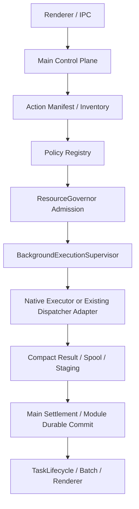

# v3.2.0 Spec — 后台执行平台落地、成熟样板适配与 VCC OP 多文件解析

| 项目 | 内容 |
| --- | --- |
| 目标版本 | v3.2.0 |
| 日期 | 2026-08-21 |
| 状态 | Implementation Ready / VCC saveRun 生产切换受 receipt migration 门禁 |
| E00 合同前置 | Platform Contract v1 与 Lifecycle Mapping 已冻结；平台源码由本版 E02-A～C2 唯一实施 |
| 配套 TechDoc | `changes/3.2.0/techdoc.md` |
| 涉及范围 | 平台核心、Action Inventory、成熟执行器样板 adapter、VCC OP scan-and-compute/save-run |

## 0. 规范性依赖与文档状态

本文件是 E00 Platform Contract v1 冻结后的版本级产品规格。以下文件具有更高优先级，本文件不得重新定义同义字段：

- `changes/background-execution/platform-contract-v1.md`；
- `changes/background-execution/platform-contract-v1.schema.json`；
- `changes/background-execution/platform-lifecycle-mapping.md`；
- `changes/background-execution/E00-platform-contract-v1-spec.md`；
- `changes/background-execution/E00-platform-contract-v1-techdoc.md`。

本文件只回答四类问题：

1. 本版本接管哪些静态 `actionKey`；
2. 每个 action 选择哪一种正式 `mode`、`lifetime` 和 `commit.kind`；
3. 模块业务不变量、持久 receipt/inspector 与 artifact 结算边界是什么；
4. 哪些 action 已可生产启用，哪些仍为 `blocked` 或 `legacy-preserved`。

统一术语：

```text
actionKey      静态 Registry / Inventory 主键
operation      Protocol v1 消息命令或事件
operationKey   跨重启稳定的业务幂等与恢复身份
jobId          一次 transport attempt
unitId         parent job 内工作单元
```

正式执行模式仅允许：

```text
inline-async
thread-single
thread-pool
utility-process
```

正式提交策略仅允许：

```text
none
main-settlement
worker-durable
existing-critical-protocol
```

任何 `commitState=unknown`、`partially-committed` 或 committed-but-result-lost 必须按生命周期合同把 TaskRun 置为 `interrupted`；Batch 基础 `task_status` 保持兼容值 `failed`，effective Batch 状态由 Option B overlay 表达为 `interrupted/recovering`。Renderer 显示 `recovery-required` 并创建 Recovery Hold；不得静默降级为普通 failed/cancelled，也不得自动重跑。

## 1. Task Brief

### Goal

把 E00 冻结的公共合同落实为可运行的平台核心，并选择三条互补样板验证平台不是“万能 Worker 池”：

1. 既有通用大表导入：只做外围 adapter，不重写内部 Parser Pool、Reducer 或单 DB Writer；
2. Toolbox 大文件拆分：只接 transport、资源和指标，正式发布继续由既有 durable Publisher 控制；
3. VCC OP：新增“单文件 Parser Core + 有序 Reducer”，并为 `saveRun` 建立可唯一查询的同事务 operation receipt。

### Done when

- 全部已登记 action 都有显式 Inventory disposition，新增 action 未登记时 CI 失败；
- Supervisor、Policy Registry、ResourceGovernor、Critical Intent Store、Recovery Hold 与 TaskLifecycle `interrupted` 接线通过平台 canary；
- 两套既有执行器接入后不增加额外 Worker、不改变内部并行度、不产生第二终态；
- VCC OP 解析的新旧结果逐字段等价；
- `vcc-op:save-run` 的 COMMIT 后回包前 crash 可由 operation receipt 唯一恢复；
- 新增池未通过性能和内存门禁时，生产 `effectiveWorkerCount=1`。

## 2. 范围

### 2.1 必做

- Action Manifest、Inventory、Policy Registry 与 coverage gate；
- Protocol v1 validator、Supervisor exactly-once execution settle；
- Worker thread、utility process、inline async、existing dispatcher 四类 adapter；
- ResourceGovernor 全量 lease 实现；
- Critical Intent Store、Recovery Hold、startup recovery scan；
- Staging/Artifact technical validator；
- 通用大表导入 adapter 样板；
- Toolbox large split adapter 样板；
- VCC OP Parser Core、Parser Pipeline、Ordered Reducer；
- VCC OP `saveRun` operation receipt、inspector 与 lifecycle mapping；
- Windows packaged canary、资源泄漏检查和 action 级 benchmark。

### 2.2 非目标

- 不迁移 Statement、FundRecon、Duplicate、BankBU、ReconFix 的业务状态；
- 不重写 Pending/BizOP 大表引擎；
- 不重写 Toolbox Publisher；
- 不把 Position 改为 worker thread；
- 不向 Renderer 暴露线程数、入口路径、resourceLimits 或 recovery internals；
- 不在运行中 fallback；
- 不把 `jobId` 当作持久幂等键；
- 不以版本发布代替 action 独立生产门禁。

## 3. Action 级策略

下表分别表达版本开始时的现状与目标；Registry 实际对象仍只有一个 canonical `disposition/mode/lifetime/commit.kind/production.enabled`。

| actionKey | currentDisposition | targetDisposition | mode | lifetime | adapterKind | commit.kind | production.enabled（代码合并时） | 关键门禁 |
| --- | --- | --- | --- | --- | --- | --- | --- | --- |
| `background-execution:canary` | `blocked` | `managed` | `thread-single` | `job` | `native` | `worker-durable` | `false` | canary receipt、startup recovery、schema/semantic validator |
| `background-execution:pure-compute-canary` | `blocked` | `managed` | `thread-single` | `job` | `native` | `none` | `false` | none context、精确 payload wrapper、纯计算 execution settle；不覆盖 durable recovery |
| `pending:import` | `legacy-preserved` | `managed` | `thread-pool` | `job` | `existing-dispatch` | `existing-critical-protocol` | `false` | 不额外 spawn；compound lease 与旧事务零漂移 |
| `biz-op:import-flow` | `legacy-preserved` | `managed` | `thread-pool` | `job` | `existing-dispatch` | `existing-critical-protocol` | `false` | fileIndex 顺序、空批 rollback、月末事务不变 |
| `toolbox:split-large` | `legacy-preserved` | `managed` | `thread-single` | `job` | `existing-dispatch` | `main-settlement` | `false` | 生成与 Publisher 分层；无第二 Publisher |
| `toolbox:publish` | `legacy-preserved` | `managed` | `thread-single` | `job` | `existing-dispatch` | `existing-critical-protocol` | `false` | durable journal 是唯一发布证据 |
| `vcc-op:scan-and-compute` | `legacy-preserved` | `managed` | `thread-pool` | `job` | `native` | `none` | `false` | 解析并行、归约有序、snapshot adoption 后 Task 成功终结 |
| `vcc-op:compute-amounts` | `inline-excluded` | `inline-excluded` | `inline-async` | `job` | `native` | `none` | `true` | 轻量读取 Compute Snapshot；不创建 Worker |
| `vcc-op:save-run` | `legacy-preserved` | `managed` | `thread-single` | `job` | `native` | `worker-durable` | `false` | 同事务 receipt、inspector、COMMIT 后回包前 crash |

Release 时由 Effective Production Strategy Snapshot 决定是否把某 action 的 `production.enabled` 改为 `true`；未通过门禁时保持 legacy/disabled，不能使用“blocked → managed”作为非法枚举。

Action 表是版本切片，不替代全量 Inventory。任何未列出的 action 必须登记为 canonical disposition。

## 4. 平台产品边界



主进程仍是以下事项的唯一控制面：

- 文件选择和危险确认；
- 业务互斥锁；
- FilePlan、Task Run、Batch 和血缘；
- Critical Intent 的创建与 ACK；
- Publisher、归档和 artifact settle；
- Task 最终 succeeded/failed/cancelled/interrupted。

Worker 或 existing dispatcher 只能产生 ExecutionResult、module receipt 或 staging manifest，不能自行宣布业务 Task 成功。

## 5. VCC OP 行为规格

### 5.1 Parser 单元

一个 `unitId=file:NNNNNN` 对应一个输入文件。Parser Core 复用当前日期、月份、方向、金额和行校验逻辑，输出紧凑聚合：

- fileIndex 与 source snapshot；
- 有效行数、错误总数和有限错误样本；
- 月份集合、币种集合；
- 入/出金额的安全整数分；
- per-file 统计和语义 hash。

Parser 不访问业务 DB，不创建 run，不返回完整行数组。

### 5.2 Ordered Reducer

- 完成顺序不参与业务顺序；
- Reducer 只按 fileIndex 0..N-1 消费；
- `perFile` 顺序与用户输入一致；
- 所有金额以整数分归约；
- 跨月、空数据和错误上限与旧路径一致；
- 全部 unit 成功后才原子替换 Compute Snapshot；
- 任一失败/取消时本轮候选 snapshot 不可用于保存。

### 5.3 `saveRun` operation identity

`saveRun` 不再仅依赖月份、金额、文件数推断本次提交。每次保存必须拥有稳定：

```text
actionKey = vcc-op:save-run
operationKey
TaskRunId
Compute Snapshot hash
```

建议在同一 VCC OP 数据库事务中写独立 operation receipt。receipt 至少包含：

- action_key；
- operation_key；
- producer_task_run_id；
- run_id；
- year_month；
- compute_snapshot_hash；
- input_file_count；
- committed_at。

唯一约束至少覆盖 `(action_key, operation_key)`。若重复同一 operationKey，返回现有 receipt，不再插入第二个 run。

### 5.4 Inspector

`inspectVccOpSaveRunOutcome` 只读查询：

- 唯一 receipt 且关联 run 完整：`committed`；
- receipt 不存在且事务无本 operation 证据：`not-committed`；
- receipt/run 冲突、重复或不完整：`unknown`。

`unknown` 创建 Recovery Hold，阻断同一月份/数据集上的冲突保存。

## 6. 资源与性能

- `CPU-2` 是全应用预算；
- VCC Parser Pipeline 申请 CompoundLease，父 job + Parser 子 Worker 均计费；
- 单文件或低内存固定 1；
- 默认 requested max 为 4，但生产有效值由 benchmark 决定；
- Worker 不缓存整文件；
- 既有大表内部池由 adapter 申报完整拓扑，平台不再 spawn 包裹 Worker；
- queue 中 job 可取消；active job 不动态切换策略。

VCC 多文件大型样本只有在五次中位数端到端改善至少 15%、小样本回退不超过 5%、峰值 RSS 合格时才允许 `effectiveWorkerCount>1`。

## 6.1 Task 边界

VCC OP 三个入口是三个独立 action / Task：

| actionKey | currentDisposition | targetDisposition | mode | lifetime | commit.kind | production.enabled | Task 终结点 |
| --- | --- | --- | --- | --- | --- | --- | --- | --- |
| `vcc-op:scan-and-compute` | `legacy-preserved` | `managed` | `thread-pool` | `job` | `none` | `false` | Compute Snapshot 成功采用后 `succeeded`；门禁通过后可启用，低内存降为 1 |
| `vcc-op:compute-amounts` | `inline-excluded` | `inline-excluded` | `inline-async` | `job` | `none` | `true` | 读取冻结 snapshot 并返回轻量计算后 `succeeded` |
| `vcc-op:save-run` | `legacy-preserved` | `managed` | `thread-single` | `job` | `worker-durable` | `false` | receipt gate 通过后，run 与 operation receipt 同事务 COMMIT、settlement 完成后 `succeeded` |

scan Task 不得保持 running 等待未来 save；save 使用新的稳定 operationKey。为实现唯一恢复证据，本版本允许新增不改变业务口径的 operation identity/receipt schema；这不是金额或业务模型变更。

## 7. 验收标准

### AC-01 Action Coverage

Inventory、Registry、FilePlan、handler manifest 的静态 `actionKey` 集合可交叉验证；重复 actionKey、缺 policy、生产指向 test seam 均阻断 release-check。

### AC-02 平台三层终态

Execution `job:done` 不直接写 Task success。提交、Publisher、归档完成后才 settle；unknown/partial 映射 interrupted + recovery-required。

### AC-03 ResourceGovernor

Base/Persistent/PendingInteraction/Phase/Compound lease 和原子 replacement 均有并发、取消、泄漏和低内存测试。

### AC-04 既有 adapter 零漂移

Pending/BizOP/Toolbox 样板没有额外 Worker，没有改变内部 workerCount、Reducer、SQL、事务、cancel 和错误结构。

### AC-05 VCC 等价

旧路径与 Parser Pipeline 的月份、币种、行数、金额、perFile 顺序、错误分类和拒绝结果完全一致。

### AC-06 VCC 持久恢复

故障注入覆盖：critical ACK 前、BEGIN 前、事务中、COMMIT 后 receipt event 前、receipt event 后 job done 前。不得产生重复 run。

### AC-07 Artifact/Publisher

Toolbox large split generation failure不进入 Publisher；Publisher 不确定状态只走既有 durable journal recovery。

### AC-08 Windows

Setup/portable 的 Worker、native SQLite、asar 路径、cancel、app quit 和 startup recovery 通过。

## 8. 测试与发布门禁

- Protocol envelope、seq、late event、exactly-once settle；
- Registry JSON Schema 与语义 coverage；
- Resource lease FIFO/aging/cancel/replace/compound；
- Critical Intent Store prepared/acked/committed/recovered/closed；
- Recovery Hold 对 managed 与 legacy 路径都生效；
- VCC 1/2/4/8 文件、乱序完成、跨月、错误上限、source change；
- `saveRun` operationKey 重放与 crash window；
- existing adapter done/error/exit 双终态竞态；
- event-loop delay、RSS、文件句柄和 Worker 泄漏；
- Windows packaged 与资金人工复核。

## 9. PR 顺序

| PR | 交付 | 门禁 |
| --- | --- | --- |
| E01 | Action Manifest、Inventory、基线与 coverage | actionKey 集合可复现 |
| E02-A（=E00-A） | Protocol/Supervisor/Adapters | exactly-once execution settle + Job/Service Control 双 envelope |
| E02-B（=E00-B） | ResourceGovernor 全 lease | compound accounting、grant/adoption、无泄漏 |
| E02-C1（=E00-C） | Lifecycle/Batch overlay/recovery events | prepared、interrupted→running(recovery)、Option B |
| E02-C2（=E00-D） | Critical Intent/Recovery Hold | generic source hold、startup scan |
| E02-D | 大表与 Toolbox mature adapter 样板 | 无额外 spawn、零业务漂移 |
| E03-A | VCC Parser Core/Pipeline/Reducer | 新旧等价、默认 single |
| E03-B | VCC saveRun receipt migration/inspector | crash recovery、无重复 run |
| R3.2.0 | benchmark、Windows、人工复核 | action 独立 enable 结论 |

## 10. Unknowns 与 action 门禁

| 项目 | 分类 | 当前决定 |
| --- | --- | --- |
| VCC receipt 使用新增表还是 run 表加列 | DECISION REQUIRED | TechDoc 采用独立 receipt 表；变更需反向更新 Spec |
| 大表既有事务能否由现有证据唯一恢复 | PROBE | adapter 可 observation；未知时沿用既有恢复并落 interrupted |
| VCC 最优 Worker 数 | PROBE | 生产先 1，性能/RSS证据后调整 |
| Windows asar/native 加载 | PROBE | packaged canary 阻断并行默认启用 |

## 11. 资金与审计红线

⚠️ 必须人工复核：VCC 输入行去向、方向、整数分、月份、begin/end OP、operation receipt 与重复保存；Pending/BizOP 适配前后行序、rowid、事务和错误报告；Toolbox 正式目标和 durable journal。任何无法唯一解释 committed/not-committed 的状态都不得自动重跑。
