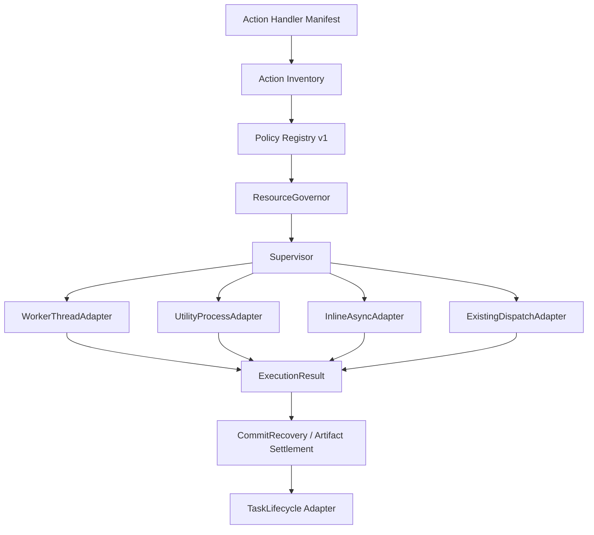

# v3.2.0 TechDoc — Platform Core、成熟执行器 Adapter 与 VCC OP Receipt

| 项目 | 内容 |
| --- | --- |
| 目标版本 | v3.2.0 |
| 日期 | 2026-08-21 |
| 状态 | Implementation Ready / VCC saveRun 默认 blocked 直至 receipt/inspector 通过 |
| E00 合同前置 | Platform Contract v1 与 Lifecycle Mapping 已冻结；平台源码由本版 E02-A～C2 唯一实施 |
| 产品 Spec | `changes/3.2.0/spec.md` |
| 涉及范围 | Supervisor、Policy Registry、ResourceGovernor、Critical Intent/Recovery Hold、成熟 adapter、VCC OP Parser/SaveRun |

## 0. 规范性技术依赖

本 TechDoc 直接实现 Platform Contract v1，不另起协议方言。所有消息使用 Protocol v1 的 canonical operation：

```text
job:start
unit:start
unit:done
unit:error
critical:ready
critical:ack
critical:reject
commit:receipt
job:done
job:error
job:cancel
cancel:ack
```

所有 Policy 使用 `actionKey` 作为静态主键；运行期 `operationKey` 只用于幂等、Critical Intent、module receipt 与 Recovery Hold。既有执行器使用真实 `mode` 加 `adapterKind='existing-dispatch'`，不得创建第五种 mode，也不得在外层再包一个 Worker。

ResourceGovernor 必须计入：

- BaseLease；
- PersistentReservation；
- PendingInteractionReservation；
- PhaseLease；
- CompoundLease；
- `replacePersistentReservation` 原子替换。

本文件中的任何 action 只有在 Registry coverage、资源 lease、取消/关闭、receipt/inspector、故障注入、Windows packaged 和人工资金门禁全部满足后，才允许从 `blocked/legacy-preserved` 切到 managed production。

## 1. 技术拓扑



建议目录：

```text
src/main-process/background-execution/
├── action-manifest.js
├── action-inventory.js
├── execution-policy-registry.js
├── protocol-v1.js
├── supervisor.js
├── resource-governor.js
├── resource-lease.js
├── critical-intent-store.js
├── recovery-hold-store.js
├── recovery-coordinator.js
├── lifecycle-adapter.js
├── staging-artifacts.js
├── metrics.js
└── adapters/
    ├── worker-thread-adapter.js
    ├── utility-process-adapter.js
    ├── inline-async-adapter.js
    └── existing-dispatch-adapter.js

src/main-process/vcc-op/
├── parser-core.js
├── parser-worker-entry.js
├── parser-pipeline.js
├── ordered-reducer.js
├── save-run-worker-entry.js
├── save-run-receipt-repository.js
└── save-run-inspector.js
```

## 2. Action Manifest 与 coverage

Handler 注册必须同时导出静态 metadata，而不是通过正则扫描 IPC 文本推断：

```javascript
registerAction({
  actionKey: 'vcc-op:scan-and-compute',
  handler,
  filePlanActionKey: 'vcc-op:scan-and-compute',
  inventoryOwner: 'vcc-op'
});
```

构建时集合：

```text
HandlerActionKeys
FilePlanActionKeys
InventoryActionKeys
RegistryActionKeys
InspectorActionKeys
```

CI 计算差集并拒绝：

- handler/FilePlan 未进入 Inventory；
- managed action 无 Registry；
- worker-durable 无 inspector；
- thread-pool 无 work-unit/failure policy；
- service 无 resource/close/token policy；
- artifact action 无 validator/Publisher；
- 重复静态 actionKey。

## 3. Policy 示例

### 3.1 VCC scan

```javascript
{
  actionKey: 'vcc-op:scan-and-compute',
  moduleId: 'vcc-op',
  disposition: 'managed',
  mode: 'thread-pool',
  adapterKind: 'native',
  entryKey: 'vcc-op-parser',
  lifetime: 'job',
  context: { kind: 'operation', validatorKey: 'exact-5' },
  protocolLimits: { commandMaxBytes: 262144, eventMaxBytes: 262144 },
  workUnits: {
    kind: 'file',
    ordering: 'input-index-reducer',
    requestedMaxWorkers: 4,
    minUnitsPerWorker: 2,
    plannerKey: 'vcc-op-file-planner',
    reducerKey: 'vcc-op-ordered-reducer'
  },
  commit: { kind: 'none' },
  production: { enabled: true, effectiveWorkerCount: 1 }
}
```

### 3.2 VCC save

```javascript
{
  actionKey: 'vcc-op:save-run',
  moduleId: 'vcc-op',
  disposition: 'blocked',
  mode: 'thread-single',
  adapterKind: 'native',
  entryKey: 'vcc-op-save-run',
  lifetime: 'job',
  protocolLimits: { commandMaxBytes: 262144, eventMaxBytes: 262144 },
  commit: {
    kind: 'worker-durable',
    criticalIntent: true,
    receiptKind: 'module-local',
    inspectorKey: 'inspect-vcc-op-save-run',
    conflictScopeResolverKey: 'vcc-op-month-scope'
  },
  legacyStrategyKey: 'vcc-op-save-run-current',
  production: { enabled: false, effectiveWorkerCount: 1 }
}
```

E03-B 完成后将 disposition 改为 managed。Policy mutation 与代码 migration 必须同 PR 或先后受 CI gate 控制。

以上仅为关键字段摘录，不是可直接提交的完整 Policy；完整有效对象以 `changes/background-execution/validation/fixtures/valid/policy-registry.v3.2.x.json` 和 JSON Schema 为准。

## 4. Supervisor 与 Protocol

本版同时实现 `JobEnvelopeV1` 与 `ServiceControlEnvelopeV1`。VCC 本身使用 JobEnvelope；Service init/close/resource request 由公共 canary 和后续 Service 测试覆盖。协议实现必须直接通过 `platform-protocol-v1.schema.json` fixture。

Supervisor job state：

```text
created → queued → spawning → running
                         ↘ waiting-critical → protected
running/queued → cancelling
任一合法终态 → settled
```

关键规则：

- `unit:done` 只关闭 unit；
- `job:done` 只产生 ExecutionResult；
- `commit:receipt` 记录 durable evidence，不结束 job；
- seq 按 `(jobId, workerInstanceId, direction)` 单调；
- late event 诊断后丢弃；
- protocol violation 失败且不 fallback；
- listener/timer/lease 在 settle gate 后 exactly once 清理。

## 5. ResourceGovernor 实现

以下接口只允许 Main Supervisor/ServiceHost 调用：

```javascript
await governor.acquireBaseLease(request);
await governor.acquirePhaseLease(request);
await governor.acquireCompoundLease(request);
await governor.acquirePendingInteractionReservation(request);
await governor.replacePersistentReservation(oldLease, newRequest);
lease.releaseOnce();
```

全局预算至少包含：

```text
cpuSlots
workerThreadSlots
utilityProcessSlots
ioHeavySlots
memoryBytes
```

existing dispatcher adapter 在 admission 前声明完整内部拓扑，例如大表 engine 主 Worker + N Parser Worker；平台只申请一个 CompoundLease，不能逐子进程临时绕过预算。

## 6. Critical Intent / Recovery Hold

平台表由 E00 migration 创建。ACK 时序：

```text
INSERT/UPDATE intent prepared
→ UPDATE intent acked + fsync/commit
→ send critical:ack
→ executor transaction + module receipt
→ receive commit:receipt
→ receipt/inspection=committed 时 mark committed；明确 not-committed 时仅从 prepared/acked mark recovered
→ business settlement
→ close intent
```

startup recovery：

1. 扫描 prepared/acked/committed-not-closed；
2. 根据 actionKey 查静态 inspector；
3. 调用只读 inspector；
4. committed 恢复 settlement；
5. not-committed 关闭或失败；
6. partial/unknown 建 Recovery Hold；
7. legacy 与 managed handler 都检查 conflictScopeKey。

## 7. Existing dispatcher adapters

### 7.1 大表引擎

Adapter 接收现有 dispatcher callback/event，不创建 Worker：

- 现有 engine Worker 是 root executor；
- Parser Pool 是 CompoundLease children；
- nextWriteIndex 与 fileIndex reducer 不变；
- transaction/cancel/error shape 不变；
- adapter 只映射 Protocol v1、metrics 与 lifecycle。

### 7.2 Toolbox large split

- generation action 使用现有 large split Worker；
- Worker 只产生 staging；
- `toolbox:publish` 使用既有 publication dispatcher；
- durable journal 映射 `existing-critical-protocol`；
- crash 后调用既有 recovery，不重新 generation/publish。

## 8. VCC Parser Pipeline

Parser Worker 输入：

```javascript
{
  fileIndex,
  filePath,
  sourceSnapshot,
  maxErrors,
  parserContractVersion: 1
}
```

输出：

```javascript
{
  fileIndex,
  sourceSnapshot,
  rowCount,
  monthKeys,
  currencies,
  amountOutCents,
  amountInCents,
  errorCount,
  errorRows,
  semanticHash
}
```

Ordered Reducer：

- Map 缓存乱序 unit result；
- `nextExpectedIndex` 连续消费；
- 校验 snapshot、safe integer、fileIndex 唯一；
- 只在全成功后构造 immutable Compute Snapshot；
- snapshot 包含 input evidence hash，供 save-run receipt 使用。

## 9. VCC SaveRun migration

建议表：

```sql
CREATE TABLE IF NOT EXISTS vcc_op_operation_receipts (
  id INTEGER PRIMARY KEY AUTOINCREMENT,
  action_key TEXT NOT NULL,
  operation_key TEXT NOT NULL,
  producer_task_run_id TEXT NOT NULL,
  run_id INTEGER NOT NULL,
  year_month TEXT NOT NULL,
  compute_snapshot_hash TEXT NOT NULL,
  input_file_count INTEGER NOT NULL,
  committed_at TEXT NOT NULL,
  UNIQUE(action_key, operation_key),
  FOREIGN KEY(run_id) REFERENCES vcc_op_calc_runs(id)
);
```

保存事务：

```text
BEGIN IMMEDIATE
validate Compute Snapshot and opening balance
insert run
insert run balances/details
insert operation receipt
COMMIT
```

重复 operationKey：先查 receipt；若 receipt 完整，返回相同 runId 与 outcome `recovered-existing-commit`；不得重新计算或插入。

Inspector：

```javascript
inspectOutcome({ actionKey, operationKey, taskRunId })
```

- receipt 唯一且 run 完整、hash 匹配 → committed；
- 无 receipt、无关联 operation evidence → not-committed；
- receipt/run/hash/task 冲突 → unknown。

## 10. Lifecycle mapping

| execution / inspection | TaskRun | Renderer | retry |
| --- | --- | --- | --- |
| parser job done、Compute Snapshot 原子采用 | succeeded | compute ready | scan Task 已终结；后续 save 使用独立 TaskRun/operationKey |
| `vcc-op:compute-amounts` 读取已冻结 snapshot | succeeded（`inline-excluded` 轻量 action） | computed | 不重新扫描文件 |
| save committed + settlement complete | succeeded | success | 禁止重复保存 |
| save not-committed | failed/cancelled，按触发原因 | failure/cancelled | 用户可新建任务 |
| save unknown/partial | interrupted | recovery-required | 阻断同月冲突保存 |
| Publisher journal committed | `interrupted → running(recovery) → succeeded` | recovered-success | 不重复 publish |

`vcc-op:scan-and-compute`、`vcc-op:compute-amounts`、`vcc-op:save-run` 是三个独立 Task 入口：scan 在 snapshot adoption 后成功终结；compute-amounts 是轻量 `inline-excluded` 读取；save 另建 TaskRun。不得让 scan Task 长期停留 running 等待用户保存。

## 11. Fault matrix

| 故障点 | 结果 |
| --- | --- |
| Parser spawn/parse crash | parent scan failed；不采用候选 snapshot |
| Reducer 发现重复/缺失 fileIndex | protocol/business failure；不保存 |
| save critical ACK 前 crash | inspector not-committed |
| save BEGIN 中 crash | SQLite rollback；not-committed |
| save COMMIT 后回包前 crash | receipt committed；startup 恢复同 runId |
| receipt/run 冲突 | interrupted + Recovery Hold |
| adapter late done/error | Supervisor 只保留第一个 execution terminal |
| Publisher uncertain | existing journal inspector；不重放 |

## 12. 测试

- schema validation + semantic registry tests；
- protocol envelope fuzz/size/seq；
- lease cancellation/aging/replace/compound/leak；
- intent startup scan、inspector idempotence、hold conflict；
- VCC parser core golden、乱序 reducer、source change；
- save receipt unique、retry same operationKey、crash windows；
- existing adapter 无额外 spawn 的进程拓扑断言；
- Windows Setup/portable、asar/native SQLite；
- benchmark 1/2/3/4 Worker，记录 parse/reduce/save/RSS/event-loop。

## 13. 发布与回滚

- E03-A 可先以 1 Worker 上线；
- E03-B migration 与 inspector 未过时 `vcc-op:save-run` 保持 legacy；
- active job 不切换；
- 回滚 Parser Pool 只改变新 job policy；
- receipt migration 不 down-migrate，旧代码必须容忍新表；
- Recovery Hold 存在时 legacy path 也不得绕过。
