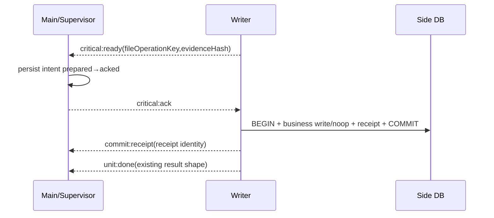

# v3.2.1 TechDoc — Toolbox Sealed Route DB 与 PreFund Per-file Durable Receipt

| 项目 | 内容 |
| --- | --- |
| 目标版本 | v3.2.1 |
| 日期 | 2026-08-21 |
| 状态 | Implementation Ready / E04-A 可先实施，双 Writer 与 mutation 受门禁 |
| 实施前置 | 进入本版本编码前，v3.2.0 E02-A～C2 必须已合并并通过 platform canary |
| 产品 Spec | `changes/3.2.1/spec.md` |
| 涉及范围 | Toolbox generation graph、Route DB sealing、PreFund spool/Ordered Writer/receipt/inspector |

## 0. 规范性技术依赖

本 TechDoc 直接实现 Platform Contract v1，不另起协议方言。所有消息使用 Protocol v1 的 canonical operation：

```text
job:start
unit:start
unit:done
unit:error
critical:ready
critical:ack
critical:reject
commit:receipt
job:done
job:error
job:cancel
cancel:ack
```

所有 Policy 使用 `actionKey` 作为静态主键；运行期 `operationKey` 只用于幂等、Critical Intent、module receipt 与 Recovery Hold。既有执行器使用真实 `mode` 加 `adapterKind='existing-dispatch'`，不得创建第五种 mode，也不得在外层再包一个 Worker。

ResourceGovernor 必须计入：

- BaseLease；
- PersistentReservation；
- PendingInteractionReservation；
- PhaseLease；
- CompoundLease；
- `replacePersistentReservation` 原子替换。

本文件中的任何 action 只有在 Registry coverage、资源 lease、取消/关闭、receipt/inspector、故障注入、Windows packaged 和人工资金门禁全部满足后，才允许从 `blocked/legacy-preserved` 切到 managed production。

## 1. 组件边界

```text
src/main-process/toolbox-background/
├── merge-worker-entry.js
├── split-worker-entry.js
├── route-scanner-worker-entry.js
├── route-db-contract.js
├── route-db-sealer.js
├── output-writer-worker-entry.js
├── shard-planner.js
└── artifact-join.js

src/main-process/pre-fund-reconciliation/mpt-import/
├── parser-core.js
├── parser-worker-entry.js
├── spool-contract.js
├── spool-writer.js
├── spool-reader.js
├── ordered-coordinator.js
├── writer-worker-entry.js
├── operation-receipt-repository.js
└── outcome-inspector.js
```

公共 Supervisor 不包含 Toolbox filter、Excel style codec、MPT schema、sequence 或 SQL。

## 2. Toolbox single Worker path

E04-A 的 Worker 输入只含：

- FilePlan-owned source path/snapshot；
- normalized operation config；
- FilePlan-owned generation path；
- exact-5/7 context。

Worker 调用现有核心写 staging并执行模块业务回读，返回 artifact manifest。Main 再做 technical validator、Publisher和归档。

## 3. Route DB Contract v1

### 3.1 角色

Route DB 是 task-private、read-only handoff：

```text
Scanner sole writer
Writer workers read-only consumers
Main validates seal and lifecycle
```

建议 schema：

```sql
CREATE TABLE route_meta (
  schema_version INTEGER NOT NULL,
  source_size INTEGER NOT NULL,
  source_mtime_ms INTEGER NOT NULL,
  source_sha256 TEXT NOT NULL,
  input_data_row_count INTEGER NOT NULL,
  output_plan_hash TEXT NOT NULL,
  sealed_at TEXT
);

CREATE TABLE route_rows (
  source_row_index INTEGER PRIMARY KEY,
  sheet_index INTEGER NOT NULL,
  row_payload BLOB NOT NULL,
  style_payload BLOB,
  route_mask BLOB NOT NULL
);
```

`row_payload/style_payload` codec 是模块合同；必须保存旧 writer 生成相同值、类型、数字格式、字体、填充、边框、对齐、行高、列宽和合并所需的最小信息。

### 3.2 Seal 时序

Scanner 完成后：

```text
finish transaction
PRAGMA wal_checkpoint(TRUNCATE)（仅若曾进入 WAL）
PRAGMA journal_mode=DELETE
close all DB connections
确认不存在 -wal/-shm/-journal
fsync DB file
fsync parent directory
open read-only and PRAGMA integrity_check
read meta/count
compute size + sha256
write sealed manifest last
```

若平台/SQLite 无法可靠将 WAL 转回 DELETE，本 action 固定单 Worker，不能把含未合并 sidecar 的 DB交给 Writer。

### 3.3 Writer

每个 Writer：

- read-only 打开 sealed DB；
- 校验 schema/version/hash/plan；
- 只处理自己的 outputIndex 子集；
- 顺序读取 route_rows；
- 写独占 generation path；
- commitAndValidate；
- 返回 artifact manifest；
- 不访问 final target 或 Publisher。

## 4. Toolbox Shard Planner / Join

Planner 约束：

- 1 或最多 2 Writer；
- outputIndex 唯一覆盖；
- 确定性分配；
- 每个 generation path 只归一个 Writer；
- Worker 数由 ResourceGovernor和benchmark共同决定。

Join 校验：

- route DB evidence一致；
- outputIndex全集、无重复；
- FilePlan ownership；
- stat/hash/size/业务 validator；
- 结果按 outputIndex排序；
- 全成功后只调用一次 Publisher。

## 5. PreFund Spool Contract v1

目录：

```text
<task-staging>/mpt/<jobId>/file-000000/
├── rows.ndjson.ready
├── issues.ndjson.ready
└── manifest.json.ready
```

所有文件 `.part → fsync → rename .ready`，manifest最后发布。Reader严格校验：

- schemaVersion、jobId、fileIndex、fileOperationKey；
- source snapshot + sha256；
- basename、目录边界、非 symlink；
- size/hash/NDJSON count；
- 每行 schema、长度、安全整数；
- contentHash 与 header identity。

Spool只是中间产物，不是业务事实，不跨重启自动续跑。

## 6. Parser Core

Parser Core只做：

- 文件/schema/header识别；
- sourceType/sourceBatch/sourceDate/source sequence；
- 行标准化、日期、金额文本、fingerprint；
- valid/error/excluded候选分类；
- content hash与计数。

不做 DB 查询、noop/replacement、batch.id、dataset version、repair token、候选排序或 commit。

## 7. Ordered Coordinator

Coordinator状态：

```javascript
{
  nextDispatchIndex,
  nextConsumeIndex,
  parserUnits,
  readySpools,
  fileResults,
  parentOperationKey,
  writerState
}
```

规则：

- Parser结果可乱序缓存；
- 只有 nextConsumeIndex ready/error 才推进；
- Writer一次只处理一个文件；
- Parser business error可形成file error并继续；
- Parser transport crash默认fail-unit-and-continue还是fail-job，必须按旧行为在E05-P0锁定；
- parent task最终shape与旧service一致。

## 8. Writer transaction / receipt

建议表：

```sql
CREATE TABLE IF NOT EXISTS pre_fund_operation_receipts (
  id INTEGER PRIMARY KEY AUTOINCREMENT,
  action_key TEXT NOT NULL,
  operation_key TEXT NOT NULL,
  producer_task_run_id TEXT NOT NULL,
  file_index INTEGER NOT NULL,
  outcome_kind TEXT NOT NULL CHECK(outcome_kind IN (
    'inserted','replaced','noop-existing-batch'
  )),
  batch_id INTEGER NOT NULL,
  dataset_id TEXT,
  dataset_version_before INTEGER,
  dataset_version_after INTEGER,
  source_file_name TEXT NOT NULL,
  source_sha256 TEXT NOT NULL,
  content_hash TEXT NOT NULL,
  committed_at TEXT NOT NULL,
  UNIQUE(action_key, operation_key)
);
```

每个 fileOperationKey 只对应一条 receipt。事务顺序：

```text
BEGIN IMMEDIATE
check existing filename/hash/identity/sequence
choose inserted/replaced/noop
perform mutation or preserve existing batch
update lineage/version where applicable
insert receipt for this fileOperationKey
COMMIT
```

对 noop，receipt仍在本事务写入并引用旧 batch；dataset version是否变化严格保持当前业务基线，receipt记录before/after而不擅自递增。

## 9. Critical handshake



进入 protected 后 shutdown不得强制终止并写cancelled。若transport丢失，Main调用 inspector。

## 10. Inspector

```javascript
inspectPreFundMptFileOutcome({
  actionKey,
  operationKey: fileOperationKey,
  taskRunId
})
```

返回：

- committed + receipt/outcome/batch/dataset；
- not-committed；
- unknown。

Inspector校验 receipt 与 batch/header/hash/version。发现 receipt存在但业务行/lineage不一致返回unknown，不自行修复。

## 11. Parent lifecycle / partial results

每个文件有独立 commitState。Parent job聚合：

```text
all parser/writer outcomes complete
→ build results in input order
→ apply current product's mixed-result terminal mapping
→ archive successful input evidence and error artifacts by existing rules
```

E05-P0必须用现有 handler golden确定 mixed success 是否映射 Task succeeded-with-partial-result 或 failed-with-committed-units。文档不得猜测；实现将结果写入 action-specific test fixture并冻结。

Crash后：

- committed file receipts被恢复，不重复写；
- not-committed files保持失败；
- unknown file产生Recovery Hold，阻断相同batch scope冲突mutation；
- 不自动“补跑剩余文件”，除非用户创建新Task且模块幂等规则允许。

## 12. Resource / backpressure

- Scanner + Writer图与Parser + Writer图都申请CompoundLease；
- ready Route DB只有一个；ready spool数量有高水位；
- Writer慢时停止派发新Parser；
- staging磁盘空间在job start前估算；
- 低内存降级single；
- task完成/失败/取消后lease、DB、fd、temp dir exactly once清理。

## 13. Fault matrix

| 故障 | Toolbox | PreFund |
| --- | --- | --- |
| Scanner/Parser crash | generation失败或按unit policy | 当前file error/parent policy |
| Route DB/spool hash错 | 无Publisher | 文件不进事务 |
| Writer crash before critical | 无正式输出 | not-committed |
| Writer crash after COMMIT | 不适用 | receipt恢复，不重复导入 |
| Publisher crash | journal inspector | 不适用 |
| source changed | 整项generation失败 | 当前file失败 |
| disk full | no publish | 当前file rollback/无receipt |
| cleanup失败 | 记录恢复路径 | 记录恢复路径，不当成功 |

## 14. Tests / benchmark

- Route DB codec golden、seal sidecar、integrity、tamper；
- 1/2 Writer等价与RSS；
- Publisher spy 0/1次；
- PreFund parser/spool/reader schema fuzz；
- high/low sequence乱序完成；
- inserted/replaced/noop receipt；
- crash windows与same operationKey replay；
- mixed result lifecycle golden；
- Windows file lock/fsync/rename；
-五次中位数与event-loop/RSS报告。

## 15. Rollback

- Toolbox双Writer可回到single，不改变Publisher；
- Route DB generation未发布可清理；
- PreFund target action在receipt未通过前保持legacy；
-已提交receipt不删除，不进行down migration；
- Recovery Hold存在时legacy不得绕过。
