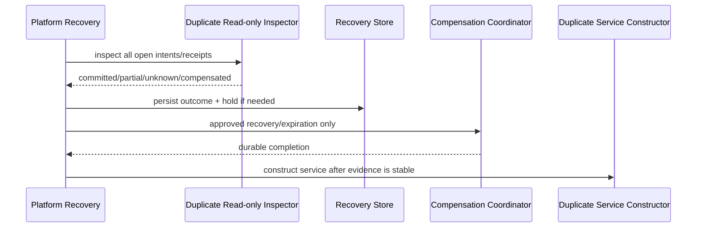

# v3.2.2 TechDoc — Stateful Services、Duplicate Startup Recovery 与 BankBU Side/Main Identity

| 项目 | 内容 |
| --- | --- |
| 目标版本 | v3.2.2 |
| 日期 | 2026-08-21 |
| 状态 | Implementation Ready / mutation action 默认 legacy 直至 receipt/inspector 通过 |
| 实施前置 | 进入本版本编码前，v3.2.0 E02-A～C2 必须已合并并通过 platform canary |
| 产品 Spec | `changes/3.2.2/spec.md` |
| 涉及范围 | FundRecon/Duplicate ServiceHost、paired parser、BankBU jobs、operation receipts、startup recovery |

## 0. 规范性技术依赖

本 TechDoc 直接实现 Platform Contract v1，不另起协议方言。业务命令使用 JobEnvelope；Service 生命周期与资源协调使用独立 ServiceControlEnvelope。

Job operations：

```text
job:start / unit:start / unit:done / unit:error
critical:ready / critical:ack / critical:reject / commit:receipt
job:done / job:error / job:cancel / cancel:ack
```

Service control operations：

```text
executor:init / executor:ready / executor:error / executor:close / executor:close-ack
resource:request / resource:grant / resource:reject
resource:adopted / resource:adopt-ack / resource:release / resource:release-ack
```

所有 Policy 使用 `actionKey` 作为静态主键；运行期 `operationKey` 只用于幂等、Critical Intent、module receipt 与 Recovery Hold。既有执行器使用真实 `mode` 加 `adapterKind='existing-dispatch'`，不得创建第五种 mode，也不得在外层再包一个 Worker。

ResourceGovernor 必须计入：

- BaseLease；
- PersistentReservation；
- PendingInteractionReservation；
- PhaseLease；
- CompoundLease；
- `replacePersistentReservation` 原子替换。

本文件中的任何 action 只有在 Registry coverage、资源 lease、取消/关闭、receipt/inspector、故障注入、Windows packaged 和人工资金门禁全部满足后，才允许从 `blocked/legacy-preserved` 切到 managed production。

## 1. 建议目录

```text
src/main-process/background-execution/
├── service-host.js
├── service-client.js
└── startup-recovery-coordinator.js

src/main-process/fund-recon-worker/
├── worker-entry.js
├── service.js
├── state-footprint.js
└── artifact-generator.js

src/main-process/duplicate-inbound-match/
├── startup-inspector.js
├── recovery-coordinator.js
├── worker-entry.js
├── worker-client.js
├── paired-parser-dispatch.js
└── operation-receipt-repository.js

src/main-process/bank-bu-worker/
├── worker-entry.js
├── import-operation.js
├── run-operation.js
├── export-operation.js
├── dual-parser-dispatch.js
└── outcome-inspector.js
```

## 2. ServiceHost Contract

```javascript
{
  serviceId,
  workerInstanceId,
  serviceGeneration,
  stateRevision,
  activeJobId,
  stableSummary,
  baseLease,
  persistentReservation,
  statusMaxBytes
}
```

命令 envelope仍是Protocol v1。Service active时：

- mutation/import/run/export返回SERVICE_BUSY；
- status可返回`active`和上一次stableSummary；
- 不排队执行过期命令；
- close只在idle或模块安全点；
- terminate后generation失效，不能当rollback证明。

State adoption：

```text
build candidate state
→ estimate footprint
→ replacePersistentReservation(old,new)
→ success: atomically publish state/revision
→ failure: discard candidate, keep/clear old按模块既有语义
```

## 3. FundRecon Service

State：bankSession、gatewaySession、refundSession、processingResult、stableSummary。

Run在Worker内建立working copies；轮次之间可yield event loop但不得接受第二业务command。`processingResult`只在所有轮次、审计和输出组装成功后采用。

Export：Worker只写FilePlan staging并返回artifact manifests；Main执行technical/business validation、Publisher和Task settle。

## 4. Duplicate startup recovery

应用启动：



Inspector模块不得require会在constructor中`clearAll()`的Service；只使用read-only repositories。

## 5. Duplicate receipt model

由于side store与main mirror是两个提交点，建议两侧共享：

```text
action_key
operation_key
producer_task_run_id
side_run_id/import_bundle_id
phase
input_evidence_hash
committed_at
```

Side DB receipt在side mutation同事务写。Main mirror保存operationKey和side identity。

Run inspector：

```text
side receipt absent, mirror absent                -> not-committed
side receipt present, mirror matching             -> committed
side receipt present, mirror absent                -> partially-committed
mirror present without matching side               -> unknown
identity/snapshot conflict                         -> unknown
compensation receipt complete                      -> compensated
```

partial recovery只补镜像/标记状态，不重新执行candidate matching。

Import committed但内存session丢失时，持久mutation不能自动重复；Task可interrupted，用户发起新import由业务identity判断noop/replacement。

## 6. Paired parser reservation

顺序：

```text
reserve Duplicate Service command
→ acquire compound parser lease
→ parse Bank/Document to separate spools
→ validate both spools
→ Service enters critical mutation
→ commit or abort reservation
```

reservation期间拒绝其它import/run/export。Parser不访问side/main DB，不构建候选，不消费MPT。

## 7. BankBU import receipt

建议月侧库增加：

```sql
CREATE TABLE IF NOT EXISTS bank_bu_operation_receipts (
  action_key TEXT NOT NULL,
  operation_key TEXT NOT NULL,
  producer_task_run_id TEXT NOT NULL,
  operation_kind TEXT NOT NULL,
  year_month TEXT NOT NULL,
  side_run_id INTEGER,
  input_evidence_hash TEXT NOT NULL,
  committed_at TEXT NOT NULL,
  PRIMARY KEY(action_key, operation_key)
);
```

Import事务：clear old input/runs → insert Pending → insert Bank → update dataset evidence → insert import receipt → COMMIT。

## 8. BankBU run side/main identity

Side run row至少保存 `operation_key / producer_task_run_id`。Main mirror至少保存：

```text
operation_key
side_run_id
year_month
status
```

### 8.1 Critical 前捕获旧 mirror pre-image

同月重跑时 Main 在发送 `critical:ack` 前读取当前 mirror，并把以下 bounded evidence 持久化到 Critical Intent：

```javascript
{
  yearMonth,
  expectedPreviousMirrorIdentity: null | {
    mirrorId,
    operationKey,
    sideRunId,
    status
  },
  expectedPreviousMirrorHash,
  expectedNewOperationKey,
  expectedInputEvidenceHash
}
```

`expectedPreviousMirrorHash` 使用同一 canonicalizer 计算；mirror 不存在时使用明确 absent digest。

### 8.2 提交顺序

```text
critical intent prepared/acked（含 previous mirror evidence）
→ side DB run + side receipt COMMIT
→ main DB CAS mirror transaction
   - re-read current mirror
   - 必须等于 captured pre-image 或已等于目标 post-image
   - delete/replace old mirror
   - insert/upsert new mirror(operationKey, sideRunId)
→ commit:receipt with both identities
```

### 8.3 Inspector

| 新 side receipt | 当前 main mirror | 结果 |
| --- | --- | --- |
| 不存在 | 等于 captured pre-image | `not-committed` |
| 存在 | 等于 new operationKey + sideRunId | `committed` |
| 存在 | 等于 captured pre-image（包括旧 mirror 仍存在） | `partially-committed` |
| 存在或不存在 | 既非 captured pre-image 也非 new post-image | `unknown` |
| receipt / task / month identity 冲突 | 任意 | `unknown` |

`partially-committed` recovery 只能执行幂等 CAS 补 mirror：再次确认 current mirror 等于 captured pre-image，然后写 new identity。若期间发生其它修改，立即返回 `unknown` 并创建 hold；不得重新运行 1:1/1:N/N:1/N:M 算法。

## 9. BankBU dual parser

两个Parser分别输出角色spool。Coordinator必须：

- 固定Pending角色先、Bank角色后交给Writer；
-统一source row序；
-两者全成功才critical；
-不因完成顺序改变DB insert顺序；
-低内存/单文件/性能不合格降为single。

## 10. Protocol / lifecycle

Service command和one-shot job都使用 canonical operations。Mutation流程：

```text
critical:ready
→ persist intent prepared/acked
→ critical:ack
→ protected DB transitions
→ commit:receipt
→ job:done
```

`job:done`后Main仍需检查receipt/Publisher/Task settle。App quit：

- pure memory active job按无持久提交证据处理；
- protected mutation超时落interrupted；
- startup inspector解决后再终结Task。

## 11. Fault tests

- Duplicate constructor spy证明inspector/hold先执行；
- side commit后kill、mirror前kill、mirror后reply前kill；
- compensation成功/失败/unknown；
- BankBU import COMMIT后reply前kill；
- 同月已有旧 mirror：new side run COMMIT 后、mirror事务前 kill；inspector 必须识别“mirror仍等于captured pre-image”为 partial 并 CAS 补镜像；
- side run后mirror前kill并补镜像；
- mirror identity冲突返回unknown；
- FundRecon crash清generation/state；
- Service reservation/lease泄漏；
- paired/dual parser一快一慢和source change；
- Windows多轮service、app quit、native DB locks。

## 12. Production gates

- FundRecon：golden/RSS/Windows通过即可独立managed；
- Duplicate：startup顺序+两侧identity+inspector全部通过；
- BankBU import/run：operation identity migration+partial recovery通过；
- paired/dual parser：15%收益、RSS和ResourceGovernor通过；
- exports可在mutation blocked时按稳定持久run独立启用，但不得绕过Recovery Hold。
