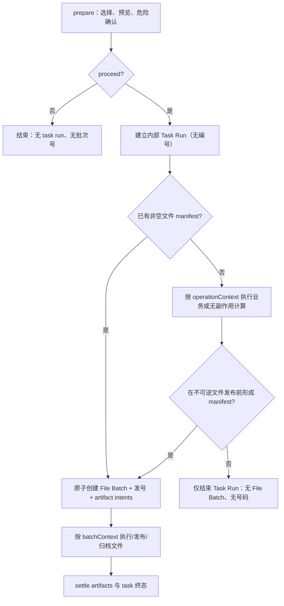

# 存档中心“有文件才有批次” Spec

> status: draft / implementation in progress
> product code baseline: `MatthewPZhong/bank-bill-excel-tool` `main@35f11e153962c34cba0e9d4c7084e9df85c9f209`
> current PR merge base: `main@6f1c09236a6c36f72eb82d61dc14508adfe20eec`
> review evidence head (2026-08-18): `458e73f0f2861cacc0579a4bac20b45900bdb3b3`
> baseline version: `3.1.10`（正式发布后的远端 `main`）
> target version: 3.1.11
> owner: 存档中心 / 全局任务生命周期 / 工具箱
> created: 2026-08-17
> last updated: 2026-08-18
> authority: 本文件是该需求后续实现、测试和验收的独立前向合同；不追溯改写 v3.1.9/v3.1.10 已发布二进制和历史发行事实。

---

## 1. Task Brief

### Goal

存档中心前端只出现有真实文件内容的批次；没有文件内容的操作不显示，也不申请、不消耗全局批次号。

同时收口三项已确认异常：

1. `2026-08-13-017`、`2026-08-13-018` 的工具箱拆分批次因保存目录被误当输入文件而显示“存档不完整”；
2. `2026-08-17-001` 的工具箱合表因输入文件 evidence 在 IPC prepare 对象复制后丢失，导致只有输入、没有输出；
3. 当前远端把大量纯状态、配置、计算操作也当成 numbered archive batch，形成空卡和无意义的号码消耗。

并收口一项本机已确认的 VCC 存储升级边界：不再向普通用户提供历史 v1 数据迁移入口；空 v1 只升级为空 v2，非空 v1 禁止自动迁移或删除。当前机器的既有 VCC v1 数据通过一次性 COW 维护重置处理，切换和复验期间先保留可回滚备份；复验通过后，旧备份再按用户的独立明确授权永久删除。

### Context

远端 v3.1.10 将“任务运行身份、业务流程关联、文件存档、全局批次号”放在同一套 `archive_batches` 生命周期中。该设计能给所有受控任务分配身份，但也导致无文件任务仍然先发号；artifact 要到业务结束后才追加，期间或失败路径会形成零 artifact 批次。

本需求不能只靠 renderer 隐藏解决。仅隐藏卡片仍会：

- 推进 `archive_daily_sequences`，与“不占用批次号”冲突；
- 让列表、详情直查、统计、最新批次和关联任务使用不同口径；
- 破坏 VCC、平盘、收单等任务当前依赖的 `batchContext`、取消和恢复链路。

### Constraints

- 不重编号、不回收、不复用历史已发行号码；历史允许保留号码间隙。
- 不伪造文件、输出或成功状态；不把目录、日志、数据库记录、按钮事件、metadata 或 placeholder 当作文件内容。
- 不新增“隐藏操作事件时间线”或不可点击事件；无文件操作继续留在原业务审计和 activity log。
- 不改变金额、币种、借贷方向、匹配、行数、Excel 内容和业务计算算法。
- 不取消 IPC prepare 的防御性复制；修复 evidence 的显式传递。
- 文件任务的编号、artifact manifest 和幂等身份必须可恢复、可审计、并发安全。
- VCC contract-v1 的自动升级只允许在全部业务/审计表为空时执行；发现任意非空数据必须在首笔 VCC 写入前 fail-closed，不能自动迁移、清空或降级写入。
- 当前机器的一次性 VCC 重置不删除 Archive Center 的 batch、artifact、Blob、flow anchor 或 operation issuance，也不改其它业务模块数据；旧数据库备份至少保留到切换后独立复验完成。后续永久删除必须再次取得精确授权，并明确记录删除后不再具备旧 v1 整库回退能力。

### Done when

1. 任一公共存档批次均满足 `artifactCount >= 1`；列表、详情、统计、latest、related 共用同一服务端可见性口径。
2. 新的无文件操作不写 `archive_batches`、不写 batch issuance、不推进全局日序号。
3. 新的文件批次只能通过“批次 + 非空 artifact manifest”原子事务产生；失败回滚时号码不被消耗。
4. 无文件任务仍能正常执行、互斥、取消、恢复和串联后续文件任务，但使用无编号的内部 task run，而不是伪批次号；复用导入与多 run 汇总通过精确 lineage 串联，不按日期、月份或 latest 猜测。
5. `017/018` 精确恢复为每批 `1 input + 2 output`、业务成功、存档完整；`001` 保留为真实失败的 `2 input + 0 output`。
6. 59 个 no-file、63 个 file action 与全部 exclude action 完成 literal inventory 闭合；未知 action 不能默认发号。
7. 专项测试、`npm run release-check`、`npm run check:vars` 和真实数据库/UI 人工验收通过。
8. VCC 数据管理不再显示【优化存储】，renderer/preload/main 不再暴露对应 inspect/migrate 用户通道；启动恢复与 COW/journal 内部安全能力保留。
9. 全新安装在首次初始化内直接得到无业务/审计数据的 v2，旧空 v1 静默升级为同一状态；两者均无升级按钮、进度或迁移提示。初始化可创建 `vcc_fin_op_module_state` 空结构单例，不视为历史数据；非空 v1 启动被明确阻断且 VCC 数据不变。
10. 当前机器经副本验证后重置为空 v2，并回读证明非 VCC/Archive 数据及 VCC 自增高水位守恒；旧 v1 备份在复验完成后按用户明确授权永久删除，活动库与不可变 JSON 审计报告继续保留。
11. VCC 数据管理继续先挂载可操作框架，但内容区首帧不显示三条横向骨架；月份与归档读取在 150ms 内完成时直接进入正式内容，超过阈值才显示骨架。成功、失败或关闭弹窗都必须取消待触发计时器，不改变任何读取接口、数据状态或操作门禁。

---

## 2. 远端基线与已确认事实

### 2.1 基线分层

2026-08-18 对当前 PR Git DAG 与相关提交内容只读复核后，基线分为三层：

- v3.1.10 产品代码基线：`35f11e153962c34cba0e9d4c7084e9df85c9f209`，即 PR #148 的 release commit，`package.json.version=3.1.10`；
- 当前 PR merge base：`6f1c09236a6c36f72eb82d61dc14508adfe20eec`，即 PR #149 的发布证据合并；相对产品代码基线只修改发布文档、规则和测试，没有 `src/` 产品代码变化；
- 本轮复审取证 head：`458e73f0f2861cacc0579a4bac20b45900bdb3b3`，用于固定最新评论所审查的实现快照，不作为产品代码基线。

2026-08-17 初稿生成时，本地 `origin/main` 尚指向 `35f11e…` 且对象库中尚无 `6f1c092…`；该记录只保留为历史时点事实，不能继续描述当前 PR。当前工作树不 rebase、不覆盖既有未跟踪文件；以下“远端产品事实”以 `35f11e…` 为准，“PR 差异”从 `6f1c092…` 计算，“实施进度”以当前共享工作树为准，三者不得混写。

### 2.2 当前代码事实

| 事实 | 远端位置 | 影响 |
| --- | --- | --- |
| `TaskLifecycle.run()` 先 `reserveTaskBatch()`，后调用 `beforeStart`，业务结束后才 `appendOperationFiles()` | `src/main-process/archive-center/task-lifecycle.js` | prepare 后失败、beforeStart 失败、纯状态动作都可能已占号但没有 artifact |
| `reserveTaskBatch()` 在事务内发号并插入 batch/issuance，但不插 artifact | `src/backend/database/archive-repository.js` | 当前“发号”和“有文件内容”不是同一原子事实 |
| 当前 policy 有 121 个 `reserve` action；其中 operation tracker 认定 63 个是 file channel，另有 58 个没有文件解析规则 | `task-policy-registry.js` + `operation-tracker.js` | 58 个纯状态/配置/计算 action 是空批次的结构性来源 |
| 只有 `bank-statement:run`、`template:save-mappings` 已显式走 `no-archive-artifact` | `task-policy-registry.js` | 远端已有“受控执行业务但不发号”的先例，范围尚未完整 |
| `listBatches()`、`getBatch()`、`listRelatedBatches()` 没有 artifact existence filter | `archive-repository.js` / `archive-service.js` / `controller.js` | 空批次可从列表、直查和关联任务暴露 |
| `getStats()` 直接统计全部 `archive_batches`；latest 读取最后一次 issuance | `archive-repository.js` / `controller.js` | 隐藏 renderer 卡片不会修正运行次数和最新批次 |
| `showImportOpenDialog()` 记录全部 dialog selection；wrapper 将其全部并入 `selectedPaths` | `src/main.js` | `openDirectory` 会被通用输入 resolver 当作输入文件 |
| `prepareIpcTaskInvocation()` 对 prepare 结果做对象展开，产生规范化副本 | `ipc-task-contract.js` | 闭包晚写原对象的字段不会自动出现在规范化副本 |

当前共享工作树的最终 registry checkpoint 为：59/59 no-file 已切换到无编号 Task Run；63/63 file action 已进入原子文件生命周期；117/117 exclude 与前两类互斥闭合，临时 file allow-list 已删除。该状态不是远端 v3.1.10 的既有行为，并已由 literal inventory 与完整 release-check 实测，不能靠文档常量宣称完成。

### 2.3 当前真实数据库样本

对当前用户 `tool-data.sqlite` 执行 `query_only` 只读聚合，结果为：

| 指标 | 数量 | 结论 |
| --- | ---: | --- |
| 全部 batch | 95 | 当前公共统计基数 |
| 零 artifact batch | 34 | 迁移后应隐藏，但不删除、不重编号 |
| 至少一个 ready artifact 的 batch | 53 | 正常可打开文件批次 |
| 有 artifact、但没有 ready artifact 的 batch | 8 | 均为真实 failed-only 文件证据，不能按 ready-only 隐藏 |

这 8 个 failed-only 批次共有 13 个 `ARCHIVE_BLOB_MISSING` 文件 artifact（9 input、4 output）。因此公共可见条件必须是“至少有一个有效文件 artifact”，不能是 `readyArtifactCount > 0`。

34 个零 artifact 批次中，32 个业务成功、2 个业务失败；代表 task 包括 VCC calculate/archive/unarchive、场景开关、业务对账 run、数据删除，以及两次 `vccFinancialOp:import:apply`。这证明空批次既来自纯无文件 action，也来自文件 action 在 artifact 追加前失败的生命周期窗口。

---

## 3. 产品合同

### 3.1 什么是“有内容的文件批次”

公共存档中心中的一个批次必须至少拥有一个合法文件 artifact。合法文件 artifact 只允许两类：

1. **输入文件**：用户或业务明确选中的普通文件，并在发号前形成路径、文件名、来源 action 和文件快照；
2. **输出文件 intent**：本任务已确定要生成或发布的具体普通文件路径/文件名；文件生成后补齐大小、SHA-256、Blob 和只读副本。

`pending`、`ready`、`failed` 都算“有文件内容”：

- `ready` 可打开/另存；
- `pending` 表示已登记的具体文件尚未完成归档；
- `failed` 表示具体文件归档或生成失败，必须保留文件名、方向、原因和合法的重试入口。

以下内容不构成文件 artifact：

- `openDirectory/createDirectory` 选择结果或保存目录；
- 业务状态、配置修改、计算点击、预览和确认事件；
- 数据库行、日志、统计摘要、task metadata；
- 为满足非空条件人工构造的 placeholder；
- 没有具体路径和角色的“可能输出”。

### 3.2 前端行为

- 批次列表只返回文件批次；renderer 可保留 `artifactCount >= 1` 防御断言，但不得成为唯一过滤层。
- 通过 batch number 或 internal id 直接打开历史零 artifact batch 时，公共 API 返回“存档批次不存在”；内部维护/恢复接口仍可读取原记录。
- “运行次数”只统计当前未删除的可见文件批次。
- “最新批次”是按 `localDate/globalDailySequence/id` 排序的最新可见文件批次，不再等于最后一次内部 task issuance。
- “文件总大小”继续只累计 ready artifact 的逻辑大小，不因 pending/failed 可见而虚增。
- 关联任务合并同一 `parentRunId` 下的可见文件批次与精确 lineage 的直接邻域；结果去重并按时间排列，过滤后不足 2 个时不显示“关联任务”。
- 关联 UI 保持现有平铺列表，不新增分组、图谱或事件时间线。
- 不新增状态事件时间线；无文件操作不会以第二种 UI 形式回到存档中心。

### 3.3 编号行为

- 新的无文件 action 不申请号码，也不推进 `archive_daily_sequences`。
- 文件 batch 的号码只在非空 manifest 已验证后分配。
- 号码分配、batch、issuance、至少一个 pending artifact 必须同事务提交或同事务回滚。
- 已发行历史号码永久不重排、不回收、不复用。升级后看到 `...-016` 后直接到 `...-019` 属于正常历史兼容，不补造 `017/018`。
- batch 被永久删除后仍沿用当前 issuance 防复用合同；删除不能让号码重新可用。
- eager batch 以真正执行 `reserveFileTaskBatch()` 事务时的本地日发号；deferred batch 以执行 `ensureFileBatch()` 的本地日发号。跨午夜的 deferred 文件归入文件实际建立批次的日期，不回写前一天、也不制造乱序补号。

---

## 4. 目标模型：Task Run 与 File Batch 解耦

当前远端把任务控制身份和文件批次身份绑在一起。目标模型将二者拆开：

- **Task Run**：内部、无编号、不可见，用于互斥、取消、恢复、幂等、flow identity 和 worker 所有权；
- **File Batch**：面向存档中心、带全局批次号，且必须原子拥有非空 artifact manifest。

内部 Task Run 不是存档批次，不进入列表、详情、统计、latest、related，也不会生成事件时间线。



### 4.1 内部 Task Run

新增内部表 `archive_task_runs`，最小字段如下：

| 字段 | 合同 |
| --- | --- |
| `task_run_id` | UUID/稳定内部主键；不使用 `YYYY-MM-DD-NNN` |
| `module_id`, `task_key`, `operation_key` | 任务归属与幂等身份；`module_id + operation_key` 唯一 |
| `parent_run_id` | 业务流程关联身份 |
| `status` | `prepared/running/succeeded/failed/cancelled/interrupted` |
| `failure_code/message` | 内部恢复和诊断，不进入存档卡 |
| `metadata_json` | 仅保留必要恢复证据；不得存伪文件 |
| timestamps | created/started/finished/updated |

约束：

1. `archive_task_runs` 不包含 batch number、global daily sequence 或 issuance；
2. file batch 可通过现有 `archive_batches.task_run_id` 逻辑关联至一个 task run；一个 task run 最多对应一个 file batch；
3. 历史 v1 batch 可没有 task run；v2 历史 batch 保持原 `task_run_id`，不要求全量回填；
4. startup 可将未完成 task run 标记 interrupted，但不能因此补发批次号；
5. 表和内部 API 不通过 preload 暴露给 renderer。
6. task run 的清理不得早于其终态、module recovery 和 task-owned flow-bind intent；清理后 flow anchor 仍可保留 parentRunId，不能级联删除已发行 file batch 或业务审计。

#### 4.1.1 精确数据血缘

新增内部表 `archive_task_lineage`，表达 Task Run 之间已经冻结的直接消费关系：

| 字段 | 合同 |
| --- | --- |
| consumer TaskRun | 当前业务 run 或导出任务；必填 |
| producer TaskRun | 生产具体 dataset 或业务 run 的任务；仅历史 v0 数据允许为空 |
| `lineage_kind` | 仅 `dataset-input` / `run-output` |
| `lineage_key` | dataset UUID，或模块前缀加持久业务 run locator |
| `input_role` | T1 OP、T2 OP、Flow、Bank、MPT、Gateway、Export Run 等调用方冻结角色 |
| `state` | 仅 `planned / committed / discarded` |
| timestamps | 创建、更新以及可空 committed/discarded 时间 |

唯一键为 `consumer + kind + key + role`；consumer、producer 均建索引并引用 `archive_task_runs`。`LineageIntentV1` 只在 TaskLifecycle 入口规范化一次：

1. `dataset-input` 表示一次业务 run 消费的具体导入版本，`lineageKey` 是不可变 dataset UUID；
2. `run-output` 表示一次导出消费的具体业务 run，`lineageKey` 是模块前缀加真实持久 run locator；
3. `beginTaskRun()` 在同一事务写 Task Run 与全部 `planned` lineage；同 operation replay 只有 lineage 集合完全一致才幂等，不同集合直接 conflict；
4. Task Run `succeeded` 时 lineage 原子转 `committed`，`failed/cancelled` 转 `discarded`，`interrupted` 保留 `planned` 供 module owner 恢复；
5. terminal outbox 只按 Task Run 已持久化的 planned lineage 收口，不从日期、月份、parent 或 latest 推断；
6. 公共 DTO 不暴露 TaskRun、dataset、parent 或 lineage 内部字段。

`parentRunId` 继续表达一次运行到单次导出的兼容关系；它不再是复用导入和多 run 汇总的唯一关联依据。

### 4.2 两种执行上下文

新增不可混用的上下文：

```text
operationContext = {
  taskRunId, taskKey, moduleId, parentRunId, operationKey
}

batchContext = {
  batchId, batchNumber,
  taskRunId, taskKey, moduleId, parentRunId, operationKey
}
```

- 所有受控 mutation 至少拿到 `operationContext`；
- 只有已原子创建 file batch 的任务才能拿到现有 exact-7 `batchContext`；
- 禁止为通过 `freezeWorkerBatchContext()` 而生成占位 `batchId/batchNumber`；
- VCC、Position、Acquiring 等纯业务 worker 若只需要任务所有权，应迁移到 versioned `freezeWorkerOperationContext()`；
- 工具箱 publication、VCC 文件 handoff、文件输出恢复等确实需要 file batch 的路径继续使用 exact-7 `batchContext`。

### 4.3 eager 与 deferred file batch

1. **Eager**：prepare 后已经知道至少一个输入文件或确定输出路径；在业务开始前原子创建 file batch。导入、工具箱、已选择保存路径的导出默认走此路径。
2. **Deferred**：prepare 后还不能证明会产生文件，但业务可先做只读/临时、可丢弃计算；必须在写正式目标、提交 durable publication 或建立文件恢复 journal 之前调用 `ensureFileBatch(manifest)`。如果最终没有文件，task run 结束但不产生批次号。`monthly-balance:assemble` 与 `new-account:generate` 在已确认非空并确定唯一 internal output 后，可只创建该具体输出父目录以满足 target alias/snapshot 规范化；随后必须立即 normalize → promote → write，期间不得写 workbook、业务记录或恢复 journal，空结果路径也不得创建目录。
3. 依赖 `batchContext` 才能开始 worker 或不可逆业务写入的 action 必须走 eager；不能用 deferred 绕过所有权和恢复合同。
4. action 若既无法 eager 形成 manifest，也无法在不可逆副作用前 deferred promote，实施时升级为 BLOCK，不允许回退到 metadata-only batch。

---

## 5. Artifact Manifest 合同

### 5.1 prepare 输出

`prepareIpcTaskInvocation()` 的目标返回值增加显式 `filePlan`，并对 descriptor 做防御性复制：

```js
{
  proceed: true,
  filePlan: {
    version: 1,
    allocation: 'eager' | 'deferred' | 'none',
    inputs: [{ artifactKey, filePath, originalName, role, sourceOperation, sourceSnapshot }],
    outputs: [{ artifactKey, filePath, originalName, role, sourceOperation, targetSnapshot }]
  }
}
```

不再把“所有 dialog selection 的字符串数组”当作权威 manifest。

### 5.2 合法性

- manifest 的 `inputs + outputs` 对 eager 分配必须非空；
- 每个 `artifactKey` 在 batch 内唯一且由方向、角色、source operation、规范化路径稳定派生；
- input 必须是绝对路径、存在、为普通文件，并带初始 `sourceSnapshot`；目录和非普通文件在发号前拒绝；
- output 必须是绝对具体文件路径，不能只给父目录；覆盖目标需带用户确认时的 target snapshot；
- 原始文件名、方向、role、source operation 均不能为空；
- 零字节普通文件仍是文件 evidence，不能用全局 `size > 0` 规则隐藏；具体业务可按自身格式合同拒绝空文件。symbolic link、directory 和其他非普通文件沿用 fail-closed 拒绝；
- input/output 路径使用平台一致的 alias identity 做去重和冲突检查；同一任务默认禁止 output 覆盖/别名指向 input，只有已有专项原子发布合同的入口可以显式放行；
- descriptor 校验在序号事务前完成；非法 manifest 不占号；
- 发号后、业务开始前再次检查 input freshness 和 target freshness；变化时批次保留为有文件 evidence 的失败批次。

### 5.3 原子创建

新增 repository/service 边界 `reserveFileTaskBatch({ taskRun, manifest, ... })`：

1. 事务外完成纯校验和普通文件快照；
2. 同一 SQLite write transaction 内：
   - 校验 operation idempotency；
   - 推进全局日序号；
   - 插入 `archive_batches`；
   - 插入 `archive_operation_issuances`；
   - 为全部 manifest 项插入 `archive_artifacts(status='pending')`；
   - 更新 allocator 的 latest-issued 内部游标；
3. 任一步失败时全部回滚，包括 sequence；
4. 同 operation key 重放时，只有 manifest identity 完全一致才返回原 batch；路径、方向、role 或 artifactKey 变化时返回 conflict；
5. `createBatch(files)`、`archiveFile()`、`stageFile()`、outbox replay、legacy sink 也必须走同一原子 primitive，不能保留“先空 batch、后 append”的旁路。

现有 `archive_artifacts` 足以承载 pending intent，不新增 placeholder 表。manifest version、input snapshot、target snapshot 可写入 artifact metadata；不得把 metadata-only row 算作 artifact。

### 5.4 settle 与终态

- `appendFiles()` 使用与 manifest 相同的 `artifactKey` settle 既有 pending row，不重复插入；
- ready 时绑定 SHA-256、size、Blob 和 materialized copy；
- 实际文件归档失败时将对应 intent 改为 failed；
- task 进入 failed/cancelled/interrupted 时，仍为 pending 的 intent 必须转为具体 failed code，不能永久 staging；
- succeeded 时不允许遗留无解释的 pending intent。若 output 是条件性产物，必须在 promote 前完成零输出判断；
- task failed 与 archive complete 可以并存。例如业务失败但两份输入已完整归档的 `001`，业务/存档状态必须分别展示。
- 除“永久删除整个 batch”外，普通维护/重试不得删除一个 batch 的最后一项 artifact；历史 repair 也必须证明删除后仍有真实 artifact，避免把已发行 file batch 修成新的空批次。

---

## 6. Policy 目标状态

`batchPolicy` 目标上拆为三类：

| policy | 是否执行 BOR/退出/升级闸门 | 是否建内部 Task Run | 是否可发批次号 |
| --- | --- | --- | --- |
| `file` | 是 | 是 | 仅非空 manifest 原子创建时 |
| `no-file` | 是 | 是 | 否 |
| `exclude` | 视现有只读/picker/preview 合同 | 否 | 否 |

当前 `no-archive-artifact` 两项并入 `no-file`，但仍保持“业务受控执行、存档中心初始化/发号前返回”的行为。

### 6.1 目标 57 个基线无文件 reserve action

以下 action 在远端基线中是 `reserve`，但不在 `FILE_CHANNELS`。目标全部改为 `no-file`，除非实施 inventory 用代码证据证明该 action 实际拥有具体文件 manifest；不能因名称像“run”或“save”自行推断。

- Statement：`account-mapping:distribute-migration`、`account-mapping:save`、`balance-adjustment:save`、`big-account-mode:save`、`big-account-order:save`、`big-account:save-own-accounts`、`template:clear-bill-split-merge-groups`、`template:delete`、`template:delete-bill-split-row`、`template:rename`、`template:save-amount-split-rules`、`template:save-bill-split-amount-rules`、`template:save-bill-split-mappings`、`template:save-bill-split-merge-group`、`template:save-bill-split-meta`、`template:save-bill-split-row`、`template:save-bill-split-row-count`、`template:save-filename-fixed-field`、`template:set-child-parent`、`template:set-parent-status`；
- Bank Statement：`channels:create`、`channels:delete`、`channels:update`、`fund-transfer-account-mapping:save`、`linked-table:delete-by-date-range`、`scenarios:batch-delete`、`scenarios:create`、`scenarios:delete`、`scenarios:set-applicable-channels`、`scenarios:toggle-enabled`、`scenarios:transfer`、`scenarios:update`；
- Recon runs：`bankBuRecon:run`、`bizOpRecon:run`、`duplicate-inbound-match:run`、`pending:reconcile:run`、`pending:rule:save`、`pre-fund-reconciliation:run`、`recon-id-fix:clear-session`、`recon-id-fix:run`；
- Position：`position-reconciliation:bank:delete`、`position-reconciliation:mappings:save`、`position-reconciliation:run`、`position-reconciliation:run:confirm`、`position-reconciliation:source:delete`；
- Pre-fund temp：`pre-fund-reconciliation:temp:clear`、`pre-fund-reconciliation:temp:delete`、`pre-fund-reconciliation:temp:delete-by-date-range`；
- Acquiring：`acquiringBillCurrency:clearMonth`；
- VCC OP：`vccOpCalc:run:compute-amounts`、`vccOpCalc:run:save`；
- VCC Financial OP：`vccFinancialOp:data-manager:delete`、`vccFinancialOp:opening:initialize`、`vccFinancialOp:run:adjustment-add`、`vccFinancialOp:run:archive`、`vccFinancialOp:run:calculate`、`vccFinancialOp:run:unarchive`。

此外，远端已排除的 `bank-statement:run`、`template:save-mappings` 也统一登记为 `no-file`，目标总数为 59。v3.1.10 的 `vccFinancialOp:imports:resolve` 随【标记已处理】功能整体删除，不再属于任何 policy inventory。

### 6.2 当前 63 个 file-capable action

当前 `FILE_CHANNELS` 中的 63 项保留 file capability，但每项必须提供 literal manifest resolver；`FILE_CHANNELS` 只表示“可能产生/消费文件”，不再自动等于“本次必定发号”。

- importing/processing scopes：Acquiring 5、Bank BU 3、Bank Statement 7、Biz OP 4、Duplicate Inbound 2、Pending 5、Position 10、Pre-fund 5、Recon ID Fix 2、VCC Financial 4、VCC OP 1；
- Statement generator 11；
- New account 2；
- Toolbox 2。

实施 PR 必须生成机器可审计 inventory，逐项注明：`eager/deferred`、输入来源、输出来源、是否需要 exact-7 batchContext、零输出处理和恢复 owner。任一已注册 file action 缺 resolver 时 CI 失败。

---

## 7. 对关联任务、取消与恢复的影响

### 7.1 关联任务

移除无文件 batch 后，不能再靠它承载 `parentRunId`。目标合同：

1. stable business identity 与持久 dataset/run identity 是关联真相；禁止用 month、date、file hash、renderer state 或“最新批次”猜测关联；
2. `archive_flow_anchors.source_batch_id` 继续允许为空。无文件 task 可将 stable identity 绑定到 `parentRunId`，但 source batch 为空；
3. 为 batchless bind failure 保留 additive durable intent，以 `source_task_run_id` 为 owner；不把空 batch 当重试锚点，也不破坏现有 batch-owned intent；
4. parent 保留同一运行到单次导出的兼容关系；复用导入和多 run 汇总必须由 `archive_task_lineage` 的直接边表达；
5. 新增 `listVisibleRelatedBatchesForBatch(batchId)`：合并同 parent 可见批次与精确 lineage 邻域，先应用统一 visible predicate，再去重、按时间排列；
6. import 批次只定位直接消费该 dataset 的业务 run；export 批次只定位它直接消费的业务 run；对每个定位 run，仅取直接输入批次与直接导出批次；
7. 查询禁止递归扩散到“共享某个输入的所有其它链”。无文件 calculate/confirm/archive 不占 related 位置，前端继续使用现有平铺列表。

必须专项验证的链路：

- Bank Statement `run → export`（远端已有 batchless run 先例）；
- Bank BU 的 stable parent 兼容链；
- Biz OP 同一 OP/Flow dataset 被多个 run 复用、单 run 导出和区间汇总导出；
- Pending 覆盖导入产生新 dataset tag、旧 committed lineage 保持不变，单次/汇总导出冻结真实 run；
- Pre-fund 银行 session、MPT batch 与 linked gateway 行级 tag 被一次 run 精确消费并导出；
- Position `run → confirm → export/import-result`；
- VCC Financial `calculate → adjustment/archive/unarchive → export`；
- Acquiring `run/resume → export`。

### 7.2 Worker 与业务服务

当前 VCC 和 Position 的多个无文件 mutation 会强制 `freezeWorkerBatchContext()`；Position pending recovery、VCC cancel callback、部分 worker grant 也使用 batch identity 作为任务所有权。直接把 policy 改成 exclude 会造成业务失败，禁止这样实施。

迁移要求：

- 只需要互斥/所有权/幂等/flow 的 worker 改收 `operationContext`；
- 需要文件 publication、archive handoff、artifact recovery 的 worker 继续收 `batchContext`；
- active task registry 同时登记 operation-only 和 file-batch task；
- `cancelActive` 对 operation-only task 只调用业务取消并终结内部 task run，不调用 `cancelTaskBatch()`；
- file-batch task 继续同步更新 batch 终态；
- 旧持久 `batchContext` 恢复记录继续可读；新 operation context 使用独立版本，不能假装成旧 exact-7；
- Acquiring `run:resume` 必须区分两种 owner 语义：进程崩溃留下的 `interrupted` Task Run 按 exact owner 复用原 Task Run/File Batch；用户取消或业务失败留下的 partial run 属于新的业务尝试，必须新建 Task Run/File Batch，并在 worker 启动前通过侧库 CAS 把该 exact partial run 的 `chunk_progress.batchContext` 从旧终态 owner 转给新 owner。旧 owner、旧批次和旧失败证据不改写；CAS 冲突时新任务明确失败，禁止按月份或 latest 另找 partial run；
- 升级/退出闸门和 BOR 互斥不得因不发号而绕过。
- no-file task 在跨午夜后仍按原 taskRunId/operationKey 恢复；只有后来真正 promote 的 file batch 使用 promote 当日号码。

VCC Financial 的文件 handoff 进一步固定为精确指针合同：

- `vccFinancialOp:import:apply` 在 prepare 阶段冻结全部输入 FilePlan，beforeStart 只计算冻结文件的 SHA-256、大小、来源类型和来源序号；
- execute 的第一步按全部 manifest key settle 输入，只有全部输入已形成 durable artifact，才把每项 settle 返回的真实 `artifact.id` 连同 exact-7 `batchContext` 交给 worker；业务不得先写入再按文件名、顺序或月份寻找 artifact；
- worker 在创建 `vcc_fin_op_import_sources` 时持久化该 `archive_artifact_id`。启动与同步只直查这个 ID，并核对 artifact 所属 batch 的 TaskRun、`sourceOperation`、SHA-256 和大小；已有正整数 ID 缺失或身份不符时 fail-closed，不允许换绑相似 metadata artifact；
- 只有 `archive_artifact_id IS NULL` 的历史 v0 来源可走旧 metadata 兼容匹配，且 producer/关联仍不得伪造；
- 三类 VCC 导出在 prepare 阶段冻结全部具体目标路径，正式 publication receipt 只有在 manifest settle 与 File Task 终态耐久后才确认；崩溃时由原 exact-7 owner 重放，不重新发号。

### 7.3 幂等与重跑

- no-file task 的幂等归 `archive_task_runs`/业务主键管理，不写 batch issuance；
- file task 的 operation key 同时约束 task run、batch 和 manifest identity；
- 业务失败后重跑是新的 task run。只有明确的 crash recovery 才沿用原 task run/file batch；
- Acquiring 用户取消后的 partial resume 按业务重跑处理，因此产生新批次号；只有 startup 已将原 owner 确认为 `interrupted` 的 crash resume 才不发新号；
- 后来成功重跑的文件不能回填到旧失败批次；
- 并发第一次为同一 stable identity 建 flow anchor 时必须 CAS/fail-closed，不能产生两个 parent 或 latest fallback。

### 7.4 三条复用数据链

#### Biz OP

- 在对应业务侧库保存 OP `(dataDate, normalizedBu)` 与 Flow `(dataDate)` dataset head；成功覆盖导入在同一业务事务生成新 UUID、记录生产者 TaskRun 和递增 version。
- 月末数据复制到下月侧库时原样保留 datasetId、producer 和 version，不把复制误记为新导入。
- run 在开始前冻结 T1 OP、T2 OP、Flow 三个 tag 并写 `dataset-input` planned lineage；缺任一真实 head 时按原业务规则拒绝，不按日期找“最近导入”。
- `biz_op_recon_runs` 记录 Archive contract version、TaskRun identity 和 terminal ack。日期导出冻结一个真实 run；区间导出冻结全部实际采用的 run locator，并分别写 `run-output` lineage。

#### Pending

- `pending_months` 增加 datasetId、producer 和 version；移除 Pending 使用独立月份 dataset head，不与普通 Pending 月份元数据混用。
- 覆盖导入生成新 tag，旧 run 的 committed lineage 永不改写；run 精确消费 upper、lower 和可选 removed dataset。
- `diff_runs` 记录 Archive contract version、TaskRun identity 和 terminal ack。单次导出关联一个 run；汇总导出在 prepare 阶段冻结实际采用的 run locator 集合。

#### Pre-fund

- 银行导入只在当前内存 session 保存 datasetId、producer TaskRun 和 version；重启后 session 原本就不可继续，本需求不新增恢复框架。
- 每个成功新建或替换的 MPT batch 保存新 datasetId、producer 和 version；同文件同 hash 的 noop 保留原 tag。
- `linked_gateway_bill` 行保存其当前来源 datasetId/TaskRun/version；后续覆盖只更新实际命中的行，历史大表行保持 v0/null，不做伪造回填。
- `linked_gateway_bill` 另保留不公开的逐行 write nonce：当前版本每次物理 upsert 都更新 nonce；旧 binary 回滚写入不会更新 nonce，再次前滚时只把这些实际被旧写命中的行降为 v0/null。同一 v1 文件内重复 `ReconBillBizId` 仍保留本次真实 tag，nonce 不参与 lineage 或公共 DTO。
- run 冻结当前银行 session、实际 MPT batches 与所读取 gateway 行的 distinct tag；results side DB 的 `pre_fund_reconciliation_runs` 与主库 `pre_fund_reconciliation_run_mirrors` 都记录 Archive contract version、TaskRun identity 和 terminal ack，恢复按 TaskRun 精确核对两侧身份；导出只关联本次真实 run。
- Pre-fund terminal ack 固定先写主库 mirror、再写 side receipt；main 已 ack/side 未 ack 可幂等重放，禁止先 ack side 后丢失 owner 扫描入口。未 ack receipt 存在时，开始新 run 不得先修改旧 mirror 或删除 results side DB。
- Pre-fund 的持久 run identity 使用主库 run mirror id。结果侧库会在下一轮前整库回收，`sideDbRelPath + sideRunId` 可在同月重用，只作为 receipt/结果读取定位，不得作为 `run-output.lineageKey`；lineage key 固定为 `pre-fund:<mirrorRunId>`。

三类业务 run 的成功回执必须在通用 interrupted sweep 之前由 module owner 处理，Pre-fund 还必须早于旧结果回收。回执与持久 TaskRun 不一致时 fail-closed；禁止 date/month/latest 修补。

---

## 8. 公共可见性与查询合同

### 8.1 唯一 predicate

repository 定义唯一公共 predicate，语义等价于：

```sql
EXISTS (
  SELECT 1
  FROM archive_artifacts visible_artifact
  WHERE visible_artifact.batch_id = archive_batches.id
)
```

新数据由原子 manifest 保证该行是合法文件 intent；历史目录伪 artifact 由 §10 精确修复。不得把 `ready`、blob existence、task succeeded 或 archive complete 加入可见条件。

### 8.2 必须统一接入的入口

- repository/public service：list、public get-by-id/number、related、count、latest；
- controller：`resolveBatchId()` 的数字直查和 cache hit 后都要重新验证可见性；
- stats：runCount/latest；
- renderer：列表、详情刷新、筛选、删除后重算、related 导航；
- retention/delete/repair：内部 raw query 与公共 visible query 明确分层，不能误用。

SQL 必须先套 visible predicate，再做 `ORDER BY/LIMIT/OFFSET`；不能取 1000 条后在 controller 过滤，否则分页和搜索会漏项。

### 8.3 历史行为

- 当前 34 个零 artifact batch 从公共视图隐藏；数据库记录、operation issuance、task 终态和序号游标保留；
- 公共直链变为 not-found 是有意兼容变化；内部诊断仍能按 raw id 读取；
- 隐藏批次不计 runCount、不参与 latest、不参与 related；
- retention cleanup 是否最终删除 raw metadata 沿用现有内部策略，但不能回收号码；
- 8 个 failed-only 文件批次继续显示，保留失败原因和重试入口。
- VCC storage rebuild、startup repair、hold/retention 等内部维护继续读取 raw batch/artifact；它们不得因公共 visible filter 而漏检或错误解除业务 hold。普通用户可触发的 VCC storage inspect/migrate 入口按 §8.4 移除，既有 journal 的启动恢复仍保留。

### 8.4 VCC v1 收口与当前机器一次性重置

#### 普通升级合同

- 全新安装没有历史 VCC 业务数据，在首次数据库初始化内直接完成 contract-v2 精简 schema、marker 与写保护，不向 renderer 暴露“正在升级”状态；初始化允许创建 `vcc_fin_op_module_state(singleton_id=1, first_month=NULL)` 结构单例，该行不属于需迁移的业务/审计数据；
- 启动时在首笔 VCC DML 前读取 storage contract marker，并对全部既有 `vcc_fin_op_*` 表做精确行数检查；
- 唯一允许忽略的是 `vcc_fin_op_module_state` 的结构性单例，且其 `first_month` 必须为 `NULL`；任何其它 VCC 行、非空首月或未知非空 VCC 表都视为“非空 v1”；
- 空 v1 在受保护事务内把空 `vcc_fin_op_effective_rows` 替换为 v2 精简 schema，恢复必要索引和自增高水位，写入 contract-v2 marker，安装连接能力触发器，并执行 foreign-key/schema 回读；
- 非空 v1 必须抛出稳定错误并停止初始化，不执行历史迁移、不删除数据、不写 contract marker，也不允许继续按 v1 合同写入；
- v2 正常启动保持幂等，不重复改表。

#### 产品与前端表现

- 移除「VCC 财务 OP 校验 → 数据管理」中的【优化存储】按钮及对应 renderer/preload/main IPC 用户能力；task-policy exclude inventory 同步移除这两个已不存在的 channel；
- 保留 COW rebuild、journal recovery 和 v2 write guard 作为内部恢复/维护基础，不能从普通前端触发；
- 数据管理仍同步挂载弹窗框架并异步读取月份/归档信息，但内容区初始为空且保持 `aria-busy=true`；三条横向骨架延迟 150ms 后才允许出现，快速本地读取不得产生首帧闪烁，慢读取继续保留明确反馈；
- 导入记录不再显示任何原始文件存档状态小字；`ready`、`pending`、`failed`、`unavailable` 均只保留内部文件血缘状态，不生成 `<small>` 文本或占位。
- 移除【标记已处理】按钮、确认弹窗、renderer/preload/main IPC、service/repository 写入口和 usage action；task-policy no-file inventory 因此由 60 降为 59。
- 失败导入继续保留失败状态、六类计数和可导出的紧凑异常证据，但不进入有效数据集，也不再形成计算、归档、解归档或删除门禁；运行继续使用此前已生效的数据。新失败记录写 `resolution_status='not_applicable'`；旧库中的 `unresolved/resolved` 及说明字段只作 schema 兼容保留，读取时不得改变操作结果，也不做破坏性回填。
- 仅含失败导入记录的月份仍按失败 `status` 出现在数据管理月份列表，不能因取消人工处置状态机而丢失审计入口。

#### 当前机器一次性维护合同

- 仅对当前机器已确认的非空 v1 主库执行，不能打包成“所有检测到 v1 就清空”的发布迁移；
- 使用同目录 COW 候选库：源库 WAL 收敛、完整性/外键/空间检查和 `BEGIN IMMEDIATE` 写锁通过后，逐表精确复制全部非 VCC 数据，所有 `vcc_fin_op_*` 业务/审计行不复制；
- 保留源库所有可落到目标表的 `sqlite_sequence` 高水位，防止保留下来的 Archive flow identity 或历史引用与未来 VCC 新 ID 冲突；
- Archive Center 的 batch、artifact、Blob、task run、flow anchor、operation issuance 及其它模块数据逐表守恒；如存在仍有效的 VCC artifact hold、活动 import/staging 或未知外键状态则停止，不能猜测清理；
- 候选库必须是 contract-v2、全部 `vcc_fin_op_*` 表为空、无 staging、完整性/外键通过；原子切换后再次只读复验，旧库保存为显式备份，维护程序本身不自动删除。复验后的备份处置属于新的破坏性动作，必须精确核对路径、确认未占用并再次获得用户授权；
- 成功后在主库同目录原子写入一份不可覆盖的 JSON 审计报告，至少记录重置前 VCC 各表行数、Archive 各表行数、VCC 自增高水位、重置后回读、活动库/当时保留的备份路径和体积变化；报告写入失败必须明确告警，不能伪报整个操作未发生。备份后来被授权删除时，不改写这份时点审计报告，而是在实施证据中追加最终处置记录。

#### 当前机器已执行结果（2026-08-17～2026-08-18）

- 2026-08-17 23:59 CST 完成 reset-only COW：活动库由 `36,437,766,144` bytes 缩小为 `2,835,148,800` bytes，活动库减少 `31.29 GiB / 92.22%`；
- 切换后、首次重新启动应用前的独立只读回读确认 contract-v2、23 张 `vcc_fin_op_*` 表合计 0 行、69 个写保护 trigger、`PRAGMA quick_check=ok`，slim effective schema 不再包含 `raw_json`、`idempotency_key_raw`、`source_file`；后续正常启动可重建空的 module-state 结构单例，不代表历史业务数据恢复；
- Archive 13 张表逐表与重置前审计一致，其中 batches 97、artifacts 134、Blobs 101、flow anchors 28、operation issuances 97；12 张 VCC AUTOINCREMENT 表的 sequence 高水位保持不变；
- 重置完成时旧 v1 库以 `tool-data.sqlite.pre-vcc-reset-20260817T153933Z.bak` 保留，审计报告 `tool-data.sqlite.vcc-reset-report-20260817T153933Z.json` 原子落盘，SHA-256 为 `781895914145d1af45337d1a769f31a0f7915fed80668b4ab4cf72743a7093e9`；
- 2026-08-18，用户再次明确指定该精确备份后，删除前复核其为未占用的独立普通文件且与活动库 inode 不同，再永久删除；实际回收约 `33.94 GiB`，活动 v2 库和审计报告未改动。旧 v1 数据至此不再可由该备份恢复；报告中的 `oldDatabaseRetained=true` 只陈述重置完成时的历史事实。

---

## 9. Toolbox 前向修复

### 9.1 Dialog selection 角色

`showImportOpenDialog()` 记录的 selection 增加显式 kind：

- properties 含 `openFile`：可作为 legacy input fallback；
- properties 含 `openDirectory/createDirectory`：只能作为 output planning context；
- 同一 selection 不能同时被解释为 input file 和 output directory；
- filePlan 已提供 inputs 时，不再重复合并 dialog fallback。

`runArchiveAwareOperation()` 不再执行当前的：

```text
prepared.inputPaths + 所有 dialogSelections.filePaths
```

而是只消费规范化 `filePlan.inputs`；legacy fallback 必须按 kind 过滤且列入 literal allow-list。

### 9.2 Merge evidence 对象身份

当前 merge 根因：prepare 原对象 P0 被 `prepareIpcTaskInvocation()` 展开为 P1，箭头 `beforeStart` 仍把 `inputFiles` 写进 P0，execute/publication 从 P1 读取，得到 `undefined`。

目标合同：

1. prepare 结束前就在 `filePlan.inputs` 中建立初始 snapshot；
2. IPC normalizer 显式复制/冻结 filePlan，不依赖原对象 identity；
3. `beforeStart` 返回结构化 fresh evidence，不通过闭包修改 prepare 对象；
4. lifecycle 将 fresh evidence 放入 `taskContext.fileEvidence`，runtime 和 publication 读取同一份 evidence；
5. 不删除 publisher 当前 fail-closed 校验：输入 evidence 必须非空、与 protected source 一一对应，并具有绝对路径、来源和 snapshot；
6. evidence 校验继续发生在 journal、target staging 和正式目标写入之前。

### 9.3 Split

- split read 保持 preview/no batch；
- split export 的 source file 是唯一输入 manifest；
- multi split 的保存目录只生成 N 个具体 output intents；
- 正常结果精确为 `1 input + N output`；
- 目录本身永远不产生 `ARCHIVE_SOURCE_NOT_FILE` artifact。

---

## 10. 三个现场批次

### 10.1 `2026-08-13-017` / `2026-08-13-018`

#### 已确认事实

- batch 66/67，task 均为 `toolbox:split:export`、`succeeded`；
- 每批各有 1 个 ready input、2 个 ready output；
- 每批另有 1 个 failed input，错误码 `ARCHIVE_SOURCE_NOT_FILE`；
- 该 failed path 是多文件拆分选中的输出目录，不是业务输入；
- 因额外目录 artifact，两个 batch 的 archive status 为 incomplete。

#### 处置

提供显式 maintenance repair，不在所有安装上无条件启动删除：

1. 先备份数据库并在副本 dry-run；
2. 只接受明确输入的两个 batch number；
3. 每批必须精确满足：task/channel 为 split export、业务 succeeded、恰有 1 ready input + 2 ready output + 1 failed input、failed code 为 `ARCHIVE_SOURCE_NOT_FILE`、failed path 是两个 output path 的共同父目录，且伪 artifact 没有 Blob 和 business hold；
4. 任一指纹不满足时整批 skip 并报告，不能部分修改；
5. 同一 SQLite transaction 内写 repair audit snapshot、删除/隔离该目录伪 artifact、重算 batch；
6. 结果为 `1 input + 2 output`、archive complete；清理 current last error，但保留累计 failure/audit 历史；
7. batch number、task status、parentRunId、三个真实文件的 artifact id/Blob/SHA-256/size/hold 全部不变；
8. 二次执行命中 0 项并返回 already-repaired。

不得按 `ARCHIVE_SOURCE_NOT_FILE` 全库删除；真实普通文件也可能因环境或历史问题使用相同错误族。

### 10.2 `2026-08-17-001`

#### 已确认事实

- batch 95，task `toolbox:merge`，task failed、archive complete；
- artifact 133/134 是两份 ready input，当前源文件 SHA-256 与归档 Blob 一致；
- output 为 0；错误为“工具箱存档交接缺少输入文件证据”；
- publisher 在 normalize archive input evidence 时失败，早于 journal creation 和 target staging；现场 journal index 为空，临时目录已清理。

#### 处置

- 旧 `001` 继续作为有内容的失败批次显示：`2 input + 0 output`；
- 不补写 output、不改成 succeeded、不创建伪 journal；
- 详情必须显示原 business `failureMessage` 和“需从工具箱重新执行”；由于 artifact 本身均 ready，不提供误导性的“重试存档”按钮；
- 修复代码后由用户重新合表，产生新的 batch number；
- 新批次正常闭环必须为 `2 input + 1 output`，业务和 archive 均成功，目标文件与归档 output 的 SHA-256/size 一致。

---

## 11. 影响评估

| 范围 | 预期变化 | 风险/兼容处理 |
| --- | --- | --- |
| 存档中心 UI | 空卡消失；运行次数和最新批次下降/回退到最近文件批次 | 这是产品口径变化，不是数据丢失；提供升级说明 |
| 批次号 | 新无文件 action 不占号；历史仍有间隙 | 不重排、不复用；按发行事实解释旧间隙 |
| 失败任务 | 有具体 input/output intent 的失败任务仍显示 | failed/pending 不能被 ready-only filter 隐藏 |
| 关联任务 | related 中不再出现 calculate/config/delete 等空动作；复用导入与汇总导出可显示直接文件邻域 | parent 保留兼容链，dataset/run lineage 表达复用关系；查询有界且禁止递归扩散 |
| VCC/Position/Acquiring worker | 部分无文件 worker 不再拿 exact-7 batchContext | 引入 operationContext；文件 publication 仍要求 batchContext；分阶段迁移和兼容读旧记录 |
| 取消/退出/升级 | 不再用公开 batch 状态表示所有任务 | 内部 task run + active registry 继续提供互斥、取消和 interrupted 终结 |
| 幂等/恢复 | operation identity 与 file batch identity 分层 | task run 管业务；issuance + manifest 管文件；同 key manifest 冲突 fail-closed |
| 日切 | deferred task 可能开始于前一日、建立文件批次于后一日 | 批次日期取 promote 时刻；task start 时间仍保留在内部 task run |
| API/书签 | 历史空 batch 的公共直链变 not-found | raw/internal API 保留；不暴露隐藏记录 |
| 存储/保留期 | 34 个历史空 batch 元数据仍占少量 DB；无 Blob 变化 | 不为“清界面”做破坏性删除；后续 cleanup 仍不回收号码 |
| 内部任务元数据 | no-file action 改写小型 `archive_task_runs` 行，而不是 numbered batch | 不含 Blob/文件副本；按 recovery/flow owner 保护期清理并监控行数 |
| 查询性能 | list/stats/latest/related 增加 artifact existence 条件 | 复用现有 `archive_artifacts(batch_id, id)` 索引；真实库检查 query plan 和分页耗时 |
| Toolbox split | 不再归档保存目录；017/018 可恢复 complete | 精确 repair + dry-run，禁止泛删 |
| Toolbox merge | 输入 evidence 在对象复制后仍可用 | evidence 采用显式 immutable 传递；publisher fail-closed 不放宽 |
| 金额/Excel | 无算法或输出格式变化 | 通过结果 hash/行数/金额抽样证明上下文重构未改变业务结果 |

### 用户可见的主要差异

1. 连续执行配置、计算、归档状态等无文件操作时，存档中心的运行次数、最新批次和批次号不再变化；
2. 一个业务流程的“关联任务”只剩真正包含输入/输出文件的节点；复用导入或汇总导出可通过精确直接血缘出现，但仍是去重后的平铺列表；
3. 失败但已留下具体文件 evidence 的批次仍会看到；不会为了界面整洁隐藏可恢复证据；
4. 升级前已经存在的空批次不会再显示，但其号码形成的历史间隙仍存在。

---

## 12. 数据迁移、发布与回滚

### 12.1 Schema/兼容策略

- `archive_task_runs`、`archive_task_lineage` 与 batchless flow-bind intent 采用 additive schema；旧 binary 可忽略新表；
- Biz OP/Pending/MPT 的小型 dataset head 与三类业务 run receipt 字段使用 additive migration；历史小型 metadata 生成 v0 datasetId、producer 为空；
- `linked_gateway_bill` 仅 additive 增加来源字段和内部 write nonce，历史大表行保持 v0/null，不做大规模回填；nonce 只用于识别旧 binary 实际覆盖的行，不作为 dataset identity；
- 现有 `archive_batches`、`archive_artifacts`、Blob 和 batch number 格式不改；
- 新 manifest metadata 使用版本字段，旧 reader 会把它当普通 metadata；
- 不在启动迁移中删除 34 个历史空 batch；可见性是查询行为变化；
- 017/018 repair 是用户数据库 maintenance action，和通用 schema migration 分离。

### 12.2 分阶段上线

1. 先增加 Task Run、operation context、精确 lineage、flow bind 和兼容恢复；
2. 按 Pending → Biz OP → Pre-fund 顺序闭合一个最小端到端数据链，并验证覆盖、重启与回执；
3. 再完成剩余 file action 原子 lifecycle，63/63 后删除临时 allow-list 和 legacy 发号旁路；
4. server-side visibility/stats/latest/related 与 policy 切换在同一 release 启用，避免口径半切；
5. 修 Toolbox evidence 两条链并跑正常/失败/崩溃测试；
6. 用数据库副本验证历史过滤和 repair；canary 后才对真实数据库执行 017/018 repair。

### 12.3 回滚

- feature rollback 不删除 task run、新 artifact intent 或历史记录；
- 回滚到旧 binary 后可能重新产生空 batch，这是行为回退，不得以改序号表补救；
- 017/018 repair 前必须有可恢复备份；repair audit 保留 before snapshot；
- 已成功发布的新文件 batch、Blob、SHA 和号码不得因回滚而改写；
- 若 operation context 兼容测试未通过，停止 policy 切换，不能用伪 batchContext 临时兜底。

---

## 13. 测试与验收矩阵

| ID | 优先级 | 场景 | 必须断言 |
| --- | --- | --- | --- |
| NFB-01 | P0 | no-file action | 业务仍执行并受 BOR/退出/升级闸门保护；不写 batch/issuance、不推进 sequence |
| NFB-02 | P0 | 原子 reserve | batch、issuance、sequence、至少一个 pending artifact 同提交/同回滚 |
| NFB-03 | P0 | 非法/空 manifest | 在发号前拒绝；directory/metadata/placeholder 不能进入 |
| NFB-04 | P0 | 并发 reserve | 多连接并发号码唯一连续；失败事务不留下号码洞 |
| NFB-05 | P0 | operation replay | 同 manifest 幂等返回原 batch；不同 manifest conflict |
| NFB-06 | P0 | 瞬时刷新 | file batch 一旦公共可见就至少有一行 artifact，不出现短暂空卡 |
| NFB-07 | P0 | pending/failed-only | 仍可见并保留错误、重试、task 终态；无 ready Blob 也不隐藏 |
| NFB-08 | P0 | terminal pending | failed/cancelled/interrupted 后没有永久 pending；每项有明确失败原因 |
| NFB-09 | P0 | 历史过滤 | 95 批样本中 34 个零 artifact 不出现在 list/get/stats/latest/related；raw 仍可读 |
| NFB-10 | P0 | 统计/分页/直查 | filter 在 SQL pagination 前；cache、internal id、batch number 不能旁路可见性 |
| NFB-11 | P0 | related | `文件A—无文件B—文件C` 只显示 A/C；复用同一导入的多个 run 与汇总导出的多个 run 仅返回各 pivot run 的直接输入/输出；不递归扩散；单项隐藏、跨重启一致 |
| NFB-12 | P0 | batchless/lineage | no-file run 继承正确 parent；dataset 覆盖产生新 tag 且旧 committed lineage 不变；legacy producer 为空不伪造关联；无 date/month/latest fallback |
| NFB-13 | P0 | operation context | VCC/Position no-file worker 正常运行、取消、退出、interrupted；无伪 batch number |
| NFB-14 | P0 | 恢复/重跑 owner | 旧 exact-7 persisted batchContext 继续恢复；新 operation context 版本不混读；Acquiring interrupted resume 复用原 owner/不发号，cancelled/failed partial resume 以新 owner CAS 接管/发新号，原失败批次不变 |
| NFB-15 | P0 | outbox/旁路 | 空 files outbox 不能新建 batch；legacy createBatch 也走原子 manifest primitive |
| NFB-16 | P0 | split directory | multi split 精确 `1 input + N output`，保存目录不生成 artifact |
| NFB-17 | P0 | 017/018 repair | 只命中两个完整指纹；各保留 1+2 ready、complete、原号/SHA/parent/hold 不变；二次 0 变更 |
| NFB-18 | P0 | merge evidence | prepare 复制后 fresh input evidence 在 lifecycle/runtime/publication 完整一致 |
| NFB-19 | P0 | publisher fail-closed | evidence 缺失/不一致在 index/journal/staging/正式目标前失败，既有目标不变 |
| NFB-20 | P0 | merge success | 新批次 `2 input + 1 output`，task/archive complete，目标与归档 SHA/size 一致 |
| NFB-21 | P0 | 001 历史保留 | failed、2 input、0 output；不补成功/输出/journal；重跑使用新号 |
| NFB-22 | P1 | 无事件时间线 | UI 没有状态 timeline；原业务 audit/activity log 仍存在 |
| NFB-23 | P1 | 历史号兼容 | 旧间隙保留；隐藏/delete/rollback 均不复用号码 |
| NFB-24 | P1 | 隐私 | 公共 DTO 不暴露 source path、内部 task metadata 或 repair before snapshot |
| NFB-25 | P1 | 跨午夜 deferred | task run 保持原身份；batch 以 promote 当日本地日期发号，latest/related 顺序稳定 |
| NFB-26 | P1 | 文件边界 | 零字节普通文件可形成 evidence；directory/symlink 拒绝；input/output alias fail-closed |
| NFB-27 | P1 | input-only/all-skipped | 有真实输入、零输出的合法结果保留 input-only batch 和明确业务结果，不伪造 output |
| NFB-28 | P1 | 001 可解释性 | 详情展示 business failureMessage/原入口重跑提示，且不显示错误的 archive retry |

### 13.1 自动化范围

- unit：allocator/repository、task policy、task/operation lifecycle、flow resolver、operation tracker、IPC contract、controller/UI contract、Toolbox publication；
- integration：Toolbox merge/split roundtrip、VCC output/handoff、Position recovery、Acquiring resume、Archive startup/outbox/storage migration；
- full gate：`npm run release-check`、`npm run check:vars`；
- policy inventory：63 file、59 no-file 与全部 exclude action literal 闭合，无 wildcard/default reserve；63/63 file 均走 `runFileTask()`。

### 13.2 真实数据库/UI

1. 数据库副本先验证 95/34/53/8 口径、SQLite integrity、foreign keys 和 query plan；
2. 连续执行至少三种 no-file action，确认 UI count/latest/sequence 不变；
3. 执行 input-only、output-only、input+output、failed-only、cancelled 和 crash-recovery 场景；
4. dry-run 与执行 017/018 repair，并回读三个真实 artifact 的 SHA/hold；
5. 回读 001，真实重跑 merge 后对比新旧批次；
6. 在副本回读 Biz OP、Pending、Pre-fund dataset tag、业务 run receipt 和直接关联结果；
7. 2 viewport × 3 zoom 检查列表、详情、平铺 related 和失败行没有布局回归。

### 13.3 ⚠️ 资金/审计红线，请人工复核

本需求不修改金额、币种和匹配算法，但会改任务身份与文件血缘承载方式。上线前必须人工确认：

- VCC/Position/Acquiring 代表性任务的输入文件 SHA、业务 runId、parentRunId、输出 SHA 与旧版本语义一致；
- no-file context 迁移前后，计算行数、主体×币种金额、调整/归档状态和导出内容无变化；
- 017/018 repair 没有删除三个真实 artifact、Blob 或业务 hold；
- 001 的零输出仍明确显示为业务失败，不能被静默解释为成功或全量跳过；
- 重跑和并发不会把新输出绑定到旧失败 task/batch。
- Biz OP、Pending、Pre-fund 的输入 tag、业务 run、输出文件和行数能逐项闭合；覆盖/noop/月末复制不改变既有资金事实的归属。
- 当前机器 VCC 重置前后，Archive/非 VCC 行数和 VCC sequence 水位逐项守恒；旧备份删除后必须保留不可变审计报告，并明确披露已经失去旧 v1 整库回退能力。

人工项未通过时不得发布；自动测试不能代签文件血缘与资金事实。

---

## 14. Unknowns Register

| 未知 | 类型 | 风险 | 处理 | 实施门禁 |
| --- | --- | --- | --- | --- |
| 63 个 file-capable action 是否都能在不可逆副作用前形成 manifest | PROBE | 高 | 生成逐 action manifest inventory，定位 eager/deferred/none | 任一主要入口未证明时阻断该入口迁移 |
| VCC/Position/Acquiring 哪些字段真正需要 exact-7 batchContext | PROBE | 高 | 静态调用图 + worker/恢复故障注入；区分 file ownership 与 operation ownership | operationContext 契约与兼容测试通过前不切 no-file policy |
| batchless flow bind 失败后的 durable owner | 已知未知 | 高 | additive task-owned bind intent；模拟 crash/replay/anchor conflict | 不允许丢 identity 或 latest fallback |
| Biz OP/Pending/Pre-fund 的复用导入与汇总导出如何跨重启精确关联 | 已确认合同 | 高 | 持久 dataset/run identity + `archive_task_lineage`；module receipt owner 先于 sweep 恢复 | 不允许同 parent、日期、月份或 latest 代替精确边 |
| output-only 条件性任务的零输出点 | PROBE | 高 | 将零输出判断前移到无副作用 preflight，或在 temp generation 后、正式 publication 前 deferred promote | 不能先发号后删空 batch |
| 内部 task run 的保留/清理周期 | PROBE | 中 | 按 module recovery、flow-bind intent 和 operation idempotency 取最大保护期；做 cleanup 故障注入 | 不得级联影响 file batch、anchor 或业务审计 |
| failed/pending artifact 是否算内容 | 已确认产品解释 | 中 | 保留为文件 evidence；ready-only 会丢 8 个历史失败批次及重试入口 | 按 §3.1 测试，不再作为开放问题 |
| 历史号码是否回收 | 已确认兼容边界 | 高 | 永不回收/重排/复用 | 任何 renumber 方案直接拒绝 |
| 017/018 repair 是否精确命中真实库 | PROBE | 高 | 副本 dry-run、before snapshot、二次幂等、SHA/hold 回读 | 未人工确认不得改真实库 |

当前没有需要用户补充产品选择的 BLOCK；上述 PROBE 均可由远端代码、故障注入和数据库副本关闭。如果代码证明某 file action 无法在不可逆副作用前形成 manifest，则该 action 升级为实现 BLOCK，必须先重排生命周期，不能放宽本 Spec。

### 14.1 Evidence-based Blindspot Pass

#### [Critical] 无文件 policy 不能直接绕过现有 batchContext

- 场景：把 VCC calculate/archive、Position run/confirm 等 action 直接改成现有 exclude/no-batch 分支。
- 事实与证据：远端 service、worker grant、cancel 和 recovery 多处强制 exact-7 `freezeWorkerBatchContext()`；Position pending recovery 还核对 batchId/taskRunId/parentRunId。
- 推断/未知：部分调用只需要任务所有权，部分确实需要文件 publication owner，必须逐项拆分。
- 资损或审计影响：直接切 policy 会让任务无法运行、无法取消/恢复，或失去 run→export 文件血缘。
- 最便宜验证：生成 context consumer 调用图，并对 VCC/Position/Acquiring 做取消、崩溃、重启故障注入。
- 处置：**PROBE；operationContext 兼容门禁通过前阻断 no-file policy 切换。**

#### [Critical] 发号与 artifact 追加分离存在所有入口旁路

- 场景：只修改 `TaskLifecycle.reserveTaskBatch()`，但保留 `createBatch/archiveFile/stageFile/outbox` 的先建批后追加。
- 事实与证据：远端 service 的 create/reserve 与 append 是分开的 write transaction，controller outbox 可调用 `createBatch(payload)`。
- 推断/未知：任一旁路仍能在附件登记失败时留下已发行空 batch。
- 资损或审计影响：继续产生号码空洞；operation replay 还可能形成 ghost batch 或 manifest 漂移。
- 最便宜验证：静态枚举全部 allocator caller，故障注入每个“batch insert 后、artifact insert 前”检查点。
- 处置：**已由 §5.3/NFB-02/NFB-15 覆盖；所有创建入口必须汇聚到同一原子 primitive。**

#### [Important] 单层 UI 过滤会被直查、分页、统计和关联旁路

- 场景：renderer 只过滤 `artifactCount===0`。
- 事实与证据：远端 controller 可按 numeric id 直读 repository，latest 读 issuance cursor，list 先分页，related 单独查询。
- 推断/未知：空 batch 仍可能作为 latest、related 或缓存详情出现。
- 资损或审计影响：同一批次在不同页面/刷新时可见性不一致，用户无法解释号码和运行次数。
- 最便宜验证：repository/controller contract test 覆盖 list/get/cache/stats/latest/related/delete-refresh。
- 处置：**已由 §8/NFB-09—11 覆盖；唯一 server-side predicate。**

#### [Important] 历史修复若按错误码泛删会破坏文件血缘

- 场景：全库删除 `ARCHIVE_SOURCE_NOT_FILE` 或所有 failed input。
- 事实与证据：017/018 的伪 artifact 可用 batch number、task/channel、方向、1+2 ready 集合、共同输出父目录和无 Blob/hold 精确证明；同一错误族未来可能用于真实源路径异常。
- 推断/未知：不同安装的同号 batch 未必具有相同事实。
- 资损或审计影响：误删真实 artifact、Blob 引用或 business hold 会破坏 VCC/对账输入血缘。
- 最便宜验证：真实库副本 dry-run、before snapshot、SHA/hold 回读和二次幂等。
- 处置：**PROBE + 人工复核；只提供显式目标的 maintenance repair，不做启动期泛化删除。**

---

## 15. 实施顺序

1. **合同反向同步**：先锁当前远端基线、精确 lineage、业务 receipt、related 有界查询和续作起点 36/63。
2. **精确 lineage foundation**：落 `archive_task_lineage`、TaskLifecycle planned/terminal/replay、terminal outbox 和公共 DTO 边界。
3. **三条复用链**：按 Pending → Biz OP → Pre-fund 实现 dataset head、run receipt、owner-first recovery 与直接关联查询。
4. **剩余文件迁移**：完成 Statement/New Account 7、Position 10、Acquiring 5、VCC Financial 4、Pre-fund repair 1，共 27 个 action。
5. **统一入口**：63/63 后删除 `atomicFileLifecycleChannels` allow-list；全部 file policy 进入 `runFileTask()`，不存在 legacy 发号旁路。
6. **查询与 UI**：一次性闭合 list/get/stats/latest/related、controller cache 和现有平铺列表口径。
7. **Toolbox/历史兼容**：保持冻结 FilePlan/committed receipt；先只读隐藏验证，再 dry-run/人工执行 017/018 repair；001 只读保留。
8. **发布门禁**：最后统一版本 `3.1.11`、三份发布文档、release-check、scan/check vars、真实 UI/DB 与资金/血缘人工复核。

---

## 16. 非目标

- 不新增批次详情事件时间线或隐藏操作列表；
- 不把所有业务操作都改成文件批次；
- 不删除各业务模块现有 audit/activity log；
- 不对历史批次重新编号、压缩号码或填补间隙；
- 不将后续成功重跑结果回填到旧失败批次；
- 不修改银行账单、VCC、平盘、收单的金额/币种/匹配/Excel 算法；
- 不放宽 Toolbox/VCC publication 的 fail-closed 文件证据校验；
- 不把当前机器的一次性 VCC 重置泛化为发布后的全用户清空，也不迁移任何非空 v1 历史业务数据；
- 除当前机器经副本验证、显式安全门禁、切换后复验和独立备份处置授权的一次性 VCC 重置外，不直接修改用户真实数据库。

---

## 17. 预计改动面

核心文件：

- `src/backend/database/archive-repository.js`：task run schema、原子 file batch、visible query、stats/latest/related；
- `src/main-process/archive-center/archive-service.js`：manifest reserve/settle、raw vs public API；
- `src/main-process/archive-center/task-lifecycle.js`：operation-only/file-batch 双生命周期、取消/恢复；
- `src/main-process/archive-center/task-policy-registry.js`：`file/no-file/exclude` inventory；
- `src/main-process/archive-center/ipc-task-contract.js`：filePlan/evidence 规范化；
- `src/main-process/archive-center/operation-tracker.js`：manifest authority、directory filter、artifactKey settle；
- `src/main-process/archive-center/business-flow-resolver.js`：batchless anchor/bind intent；
- `src/main-process/archive-center/controller.js`：公共可见性、直查/cache/stats；
- `src/main.js`：wrapper、Toolbox merge/split prepare 与 evidence 传递；
- `src/main-process/toolbox-output-publication*.js`：保持 fail-closed，接收显式 immutable evidence；
- VCC/Position/Acquiring 相关 service/worker/recovery，以及 VCC storage rebuild：按 operationContext 与 batchContext 职责拆分并保持 raw archive 维护语义；
- `src/backend/vcc-financial-op-db/{migrations,storage-contract}.js`：空 v1 精确识别、原子升级为空 v2、非空 v1 启动 fail-closed；
- `src/main-process/vcc-financial-op-storage-rebuild.js` 与一次性 maintenance 入口：当前机器 COW 空 v2 重置、非 VCC 守恒、自增高水位和切换后复验；
- `src/renderer-vcc-financial-op.js` / `src/preload.js` / `src/main.js`：移除 VCC【优化存储】与【标记已处理】用户入口，隐藏全部存档状态小字；
- Archive/Toolbox/业务 lifecycle 对应 unit/integration/UI contract tests。

发布迭代时按仓库约定同步：`CHANGELOG.md`、`docs/VERSION_FEATURE_HISTORY.md`、`docs/USER_GUIDE.md`。

---

## 18. 最终验收语句

满足本 Spec 后，下列语句必须始终为真：

> 存档中心看到的每一个批次都有至少一项具体文件证据；没有文件证据的操作仍能安全执行和关联，但永远不会生成存档卡，也不会消耗 `YYYY-MM-DD-NNN` 批次号。
