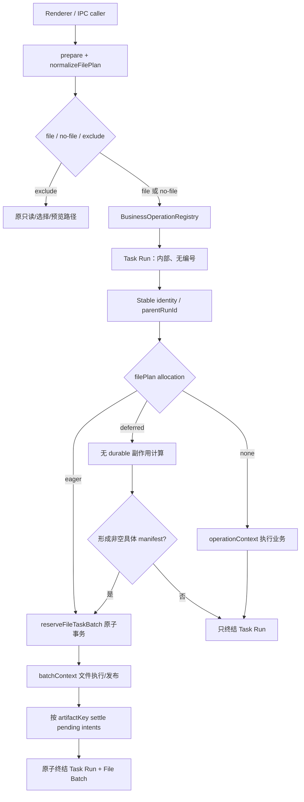

# TechDoc - 网银账单生成小助手 v3.1.11：存档中心“有文件才有批次”

| 项目 | 内容 |
| --- | --- |
| 版本 | v3.1.11 |
| 文档版本 | v1.2 |
| 日期 | 2026-08-18 |
| 作者 | 主 agent（技术合同与质量把控） |
| 状态 | 代码与自动门禁已完成；真实数据库/UI 与人工资金血缘待验收 |
| 关联 Spec | `changes/archive-center-file-batch-contract/spec.md`（NFB-01～NFB-28） |
| 产品代码基线 | `MatthewPZhong/bank-bill-excel-tool` `main@35f11e153962c34cba0e9d4c7084e9df85c9f209`（v3.1.10） |
| 当前 PR merge base | `main@6f1c09236a6c36f72eb82d61dc14508adfe20eec`（PR #149 发布证据；无 `src/` 产品代码变化） |
| 复审取证 head | `458e73f0f2861cacc0579a4bac20b45900bdb3b3`（2026-08-18） |
| 目标发布 | v3.1.11 |
| 实施执行 | 已由 `gpt-5.6-sol`、`high reasoning` 的 dev agent 按本合同执行；主 agent 独立审查和验收 |
| 质量门 | 专项测试、`npm run release-check`、`npm run check:vars`、真实数据库/UI 验收、文件血缘与资金人工复核 |

> 本文是 Spec 的实施侧技术合同，不修改 v3.1.9/v3.1.10 已发布事实。实施发现的新事实或用户确认的合同变化必须先反向同步到 Spec/本文件，再修改生产代码或真实数据库。

当前工作树不 rebase、不清理既有脏改动。续作起点经删除 VCC 人工处置 action 后为 no-file `59/59`、atomic file `36/63`；当前 registry inventory 已闭合为 no-file `59/59`、file `63/63`、exclude `117/117`，临时 file allow-list 已删除。完成状态由 registry inventory 与调用链测试计算，不信任手写计数。

---

## 0. 文档目的与 Task Brief

### 0.1 Goal

把“存档中心前端只出现有真实文件内容的批次；无文件操作不显示、也不占用批次号”落实为可直接实现的技术设计，并同时关闭以下已确认问题：

1. `2026-08-13-017`、`2026-08-13-018` 把拆分保存目录误登记为 input，导致成功任务显示“存档不完整”；
2. `2026-08-17-001` 的 merge input evidence 写入 prepare 原对象，但 IPC normalizer 已生成副本，publication 收不到 evidence；
3. 121 个 reserve action 中有 58 个没有文件解析规则，另有 2 个已按 `no-archive-artifact` 执行，纯状态/配置/计算任务仍大量占号；
4. 当前 File Batch 同时承担任务身份、取消恢复、流程关联、文件存档和全局编号，无法只删空卡而不破坏关联任务。
5. 实施前当前机器存在非空 VCC storage contract-v1；其他安装没有需要迁移的 v1 业务数据，因此 v3.1.11 收口为“新装直接初始化无业务/审计数据的 v2、空 v1 静默达到同一状态、非空 v1 fail-closed”，并以一次性 COW 维护重置当前机器，不继续保留普通用户【优化存储】入口。该本机重置现已完成，旧备份在独立复验后按用户再次明确授权永久删除。

### 0.2 Constraints

- 公共 File Batch 必须至少有一个具体文件 artifact；`pending/ready/failed` 都算文件证据。
- directory、日志、数据库行、metadata、placeholder 和按钮事件不能冒充 artifact。
- 无文件任务继续受业务互斥、退出、升级、取消和恢复门禁保护，但不再产生批次号。
- 历史号码不重排、不回收、不复用；隐藏或删除不能让号码重新可用。
- 不新增事件时间线或隐藏操作列表。
- 不改变金额、币种、借贷方向、匹配、行数、Excel 内容和业务计算算法。
- 不删除 IPC prepare 的防御性复制；evidence 改为显式传递。
- 不为不可达状态增加兜底，不在多个内部层重复校验同一规范化 DTO。
- VCC 空/非空判定必须发生在首笔 VCC DML 前；非空 v1 不自动迁移、不自动删除、不继续降级写。
- 当前机器重置只清空 `vcc_fin_op_*` 业务/审计行；Archive Center 与其它模块逐表守恒。maintenance CLI 不自动删除旧库；复验后的永久删除是独立破坏性动作，必须精确核对文件、确认未占用并再次取得用户授权，删除后不再承诺整库回滚。

### 0.3 Done when

- Spec NFB-01～NFB-28 全部有代码落点和测试落点。
- 新 no-file action 不写 batch、issuance 或 sequence；新 file action 的 batch 与非空 manifest 同事务产生。
- list/get/stats/latest/related 共用唯一服务端 visible predicate，且在分页前过滤。
- operation-only 与 file-batch worker 均能取消、恢复和继承正确 `parentRunId`。
- Biz OP、Pending、Pre-fund 的复用导入与多 run 汇总使用持久 dataset/run identity 和直接 lineage；跨重启不依赖 date/month/latest fallback。
- `017/018` 可通过显式 maintenance repair 恢复为 `1 input + 2 output`；`001` 保持真实失败的 `2 input + 0 output`。
- 59 个 no-file action、63 个 file action和全部新增 action在 literal registry 中闭合。
- VCC【优化存储】和【标记已处理】按钮、preload API、main IPC 及对应 policy 全部移除；导入记录不显示任何存档状态小字。
- 全新安装在首次初始化内直接得到无业务/审计数据的 v2，旧空 v1 静默升级并安装写保护，均不产生前端升级感知；允许存在 `first_month=NULL` 的 module-state 结构单例。任意非空 v1 在无 VCC 写入的前提下稳定阻断；当前机器 COW 重置通过副本、候选库、切换后只读三段验证，旧备份的最终删除另有精确证据。
- 实现没有过度防御、重复 guard、无依据 fallback 或先发号后补 artifact 的旁路。

---

## 1. 技术评审与当前根因

### 1.1 已确认代码事实

| 事实 | 当前实现 | 直接影响 |
| --- | --- | --- |
| lifecycle 先发号 | `TaskLifecycle.run()` 在 `beforeStart` 和业务执行前调用 `reserveTaskBatch()` | 纯无文件操作、freshness 失败和早期业务失败都可能留下空 batch |
| 发号与 artifact 分离 | `ArchiveRepository.reserveTaskBatch()` 事务只写 sequence、batch、issuance | artifact 追加失败时号码已永久发行 |
| 文件解析发生在终点 | `operationTracker.appendOperationFiles()` 在业务结束后从 args/prepared/result/runtime 推断文件 | 不能证明建批时已有文件内容，也会把 dialog directory 混入 input |
| policy 与文件能力分离 | registry 有 121 个 `reserve`，`FILE_CHANNELS` 仅 63 个 | 58 个无文件 reserve 是结构性空批来源 |
| 公共查询没有文件存在条件 | repository 的 list/get/related/stats/latest 直接读 batch 或 issuance | renderer 单层过滤会被直查、缓存、统计、分页和关联任务旁路 |
| context 强制带 batch | `freezeWorkerBatchContext()` 要求 exact-7；多个 VCC/Position/Acquiring worker 直接消费 | 直接把 action 改为 exclude 会让执行、取消或恢复失败 |
| dialog selection 没有角色 | `showImportOpenDialog()` 只记录 `properties` 和 `filePaths`，wrapper 合并所有 selection | `openDirectory` 被当作输入文件 |
| prepare identity 不稳定 | `prepareIpcTaskInvocation()` 使用对象展开返回 P1，merge `beforeStart` 修改 P0 | P1 中没有 `inputFiles`，publisher fail-closed 拒绝业务发布 |

### 1.2 当前空批次链路

```text
prepare 成功
  -> BOR.begin
  -> reserveTaskBatch
       -> archive_daily_sequences +1
       -> archive_batches INSERT
       -> archive_operation_issuances INSERT
  -> beforeStart / execute
  -> appendOperationFiles（此时才尝试得到文件）
```

空批次有两类真实来源：

- action 本身没有文件：配置、状态修改、计算、归档状态切换、删除等；
- action 有文件能力，但在 append 前失败：prepare 副本 evidence 丢失、freshness 失败、worker/业务早期失败或 outbox 追加失败。

只改 renderer 会保留 sequence 消耗和内部查询不一致，因此不采用。

### 1.3 `017/018` 根因链

```text
split:export prepare
  -> openDirectory/createDirectory 返回输出目录
  -> showImportOpenDialog 记录 dialogSelections
  -> wrapper 将全部 dialogSelections.filePaths 合入 selectedPaths
  -> operation tracker 把 selectedPaths 解释为 input
  -> ArchiveService.stat(directory)
  -> ARCHIVE_SOURCE_NOT_FILE
```

两批业务都 succeeded，真实 artifact 均为 `1 ready input + 2 ready output`；额外的 failed input 是两个输出文件的共同父目录。修复必须改 selection role，并对历史两批做精确指纹 repair，不能按错误码泛删。

### 1.4 `001` 根因链

```text
merge prepare 返回 P0
  -> prepareIpcTaskInvocation: { ...P0 } 生成 P1
  -> P0.beforeStart 闭包给 P0.inputFiles 赋值
  -> execute/runtime/publication 读取 P1.inputFiles
  -> undefined
  -> publisher: 输入 evidence 缺失，fail-closed
```

现有两份输入 artifact 都 ready，且 Blob SHA-256 与当前源文件一致；失败发生在 journal、staging 和正式目标写入之前。因此旧批次不补 output、不改 succeeded，只修前向 evidence 合同。

### 1.5 技术风险与处理

| 编号 | 风险 | 决定 |
| --- | --- | --- |
| R-1 | 只隐藏 UI，sequence、stats、latest、related 仍错误 | repository 提供唯一 visible query 族，controller/public service 只走 visible |
| R-2 | 直接切 no-file 导致 exact-7 worker context 缺失 | 新增 exact-5 `operationContext`，按 worker ownership 迁移 |
| R-3 | 只改 lifecycle，createBatch/outbox/legacy sink 仍可建空 batch | 全部“新建批次”入口汇聚到 `reserveFileTaskBatch()` |
| R-4 | deferred action 在业务副作用后才建批 | 只有无 durable 副作用的计算阶段允许 deferred；正式文件写入/发布前必须 promote |
| R-5 | task run 与 batch 双状态发生漂移 | started/terminal repository 操作同时处理 task run、可选 batch 和 terminal pending intents |
| R-6 | 新 public filter 被内部 migration/hold/recovery 误用 | 现有 repository raw 读取保持；仅新增 visible 方法供公共 service 使用 |
| R-7 | 新旧恢复记录混读 | 持久 owner 使用显式 version/kind；只对无 version 且满足旧 exact-7 的记录做 legacy 读取 |
| R-8 | repair 泛化删除真实文件证据 | 仅显式 batch number + 完整指纹 + 默认 dry-run + 事务 audit |
| R-9 | 上下文重构改变资金结果或输出 | 对比输入/输出 SHA、业务 runId、parentRunId、行数和主体×币种金额，人工复核 |
| R-10 | 为理论异常堆叠 guard，增加状态分支 | §12 作为硬性 review 拒收标准 |
| R-11 | 同 parent 无法表达“一次导入被多次 run 复用”与“一个导出汇总多个 run” | 新增 `archive_task_lineage` 与业务 dataset/run receipt；related 只遍历一跳直接边 |

### 1.6 与 Spec 的差异

产品和兼容口径无差异。本文仅锁定两项 Spec 中待技术选择的实现决定：

- v3.1.11 不自动清理 `archive_task_runs`；待运行数据证明保留周期后再单独设计 cleanup。
- 历史 repair 选择“事务内写 audit 后删除伪 artifact”，不新增 artifact 可见性枚举；三个真实 artifact 保持不变。

---

## 2. 目标架构

### 2.1 分层



### 2.2 核心对象

| 对象 | 可见性 | 是否编号 | 职责 |
| --- | --- | --- | --- |
| Task Run | internal only | 否 | BOR 后的任务身份、幂等、互斥、取消、恢复、flow owner |
| File Batch | Archive Center public | 是 | 一次具体文件输入/输出集合及全局序号 |
| Artifact Intent | 随 File Batch 可见 | 否 | 发号时已知的具体 input/output；状态 pending/ready/failed |
| Flow Anchor | internal | 否 | stable identity 到 parentRunId 的唯一绑定 |
| Task Lineage | internal | 否 | consumer TaskRun 到具体 dataset/run producer 的直接、不可递归消费边 |
| Durable Intent | internal | 否 | flow bind、terminal 或 file append 的崩溃恢复 owner |

### 2.3 不变量

1. `public File Batch => EXISTS artifact`。
2. `File Batch creation => non-empty validated manifest`。
3. `no-file Task Run => no batch + no issuance + no sequence mutation`。
4. 一个 Task Run 最多对应一个 File Batch；一个 operation key 永远不能发行第二个号码。
5. 业务重跑创建新 Task Run；只有 crash recovery 复用原 Task Run/File Batch。Acquiring 用户取消/业务失败后的 partial resume 是新业务尝试，不属于 crash recovery。
6. 新文件不能回填到旧失败批次。
7. task status 与 archive status 独立：业务失败可以 archive complete，业务成功也可以 archive incomplete。
8. terminal 后不得遗留 pending artifact。
9. raw/internal 维护读取不受 public visibility 过滤。
10. 不存在批次详情事件时间线；无文件操作只留在原业务 audit/activity log。
11. `committed` lineage 不可改写；覆盖导入只能生成新 dataset tag，新 run 写新边。
12. related 只合并 same-parent 与 pivot business run 的直接输入/输出；禁止递归图扩散。
13. public DTO 不包含 TaskRun、dataset、parent、lineage 或业务 receipt 内部字段。

---

## 3. Additive Schema 与迁移

### 3.1 `archive_task_runs`

由 `ensureArchiveMetadataSupport(db)` 幂等创建：

```sql
CREATE TABLE IF NOT EXISTS archive_task_runs (
  task_run_id TEXT NOT NULL PRIMARY KEY,
  module_id TEXT NOT NULL,
  task_key TEXT NOT NULL,
  operation_key TEXT NOT NULL,
  parent_run_id TEXT NOT NULL,
  status TEXT NOT NULL
    CHECK (status IN (
      'prepared', 'running', 'succeeded',
      'failed', 'cancelled', 'interrupted'
    )),
  failure_code TEXT,
  failure_message TEXT,
  metadata_json TEXT NOT NULL DEFAULT '{}',
  created_at TEXT NOT NULL,
  started_at TEXT,
  finished_at TEXT,
  updated_at TEXT NOT NULL,
  UNIQUE (module_id, operation_key)
);

CREATE INDEX IF NOT EXISTS idx_archive_task_runs_parent
  ON archive_task_runs(parent_run_id, created_at, task_run_id);

CREATE INDEX IF NOT EXISTS idx_archive_task_runs_status
  ON archive_task_runs(status, updated_at);
```

约束：

- 不保存 `batch_number`、`daily_sequence` 或 issuance。
- `module_id + operation_key` 是 operation 幂等边界。
- 不给 `archive_batches.task_run_id` 增加外键或历史唯一索引；旧 batch 可无 Task Run。新路径由同 operation key 和 `reserveFileTaskBatch()` 事务校验一对一。
- v3.1.11 不实现自动 cleanup；不允许 retention 删除 Task Run。

### 3.2 `archive_task_lineage`

由 Archive metadata migration 幂等创建：

```sql
CREATE TABLE IF NOT EXISTS archive_task_lineage (
  id INTEGER PRIMARY KEY AUTOINCREMENT,
  consumer_task_run_id TEXT NOT NULL,
  producer_task_run_id TEXT,
  lineage_kind TEXT NOT NULL
    CHECK (lineage_kind IN ('dataset-input', 'run-output')),
  lineage_key TEXT NOT NULL,
  input_role TEXT NOT NULL,
  state TEXT NOT NULL
    CHECK (state IN ('planned', 'committed', 'discarded')),
  created_at TEXT NOT NULL,
  updated_at TEXT NOT NULL,
  committed_at TEXT,
  discarded_at TEXT,
  UNIQUE (
    consumer_task_run_id,
    lineage_kind,
    lineage_key,
    input_role
  ),
  FOREIGN KEY (consumer_task_run_id)
    REFERENCES archive_task_runs(task_run_id) ON DELETE RESTRICT,
  FOREIGN KEY (producer_task_run_id)
    REFERENCES archive_task_runs(task_run_id) ON DELETE RESTRICT
);

CREATE INDEX IF NOT EXISTS idx_archive_task_lineage_consumer
  ON archive_task_lineage(consumer_task_run_id, state, id);

CREATE INDEX IF NOT EXISTS idx_archive_task_lineage_producer
  ON archive_task_lineage(producer_task_run_id, state, id);

CREATE INDEX IF NOT EXISTS idx_archive_task_lineage_key
  ON archive_task_lineage(lineage_kind, lineage_key, state, id);
```

约束：

- `producer_task_run_id IS NULL` 只表示业务 metadata 明确标记的历史 contract-v0 dataset/run；新 contract-v1 producer 必填。
- `planned` 只能由 `beginTaskRun()` 与 Task Run 在同一事务写入。
- `committed`/`discarded` 只能随 Task Run terminal CAS 在同一事务更新；`interrupted` 不改 planned。
- committed 行不可更新或删除；覆盖导入生成新 UUID 和新 lineage，不重指旧边。
- schema 不实现递归 closure、通用 graph type 或 date/month/latest fallback。

### 3.3 task-owned flow-bind intent

保留现有 batch-owned `archive_flow_bind_intents`；新增：

```sql
CREATE TABLE IF NOT EXISTS archive_task_flow_bind_intents (
  id INTEGER PRIMARY KEY AUTOINCREMENT,
  module_id TEXT NOT NULL,
  identity_type TEXT NOT NULL,
  identity_value TEXT NOT NULL,
  parent_run_id TEXT NOT NULL,
  source_task_run_id TEXT NOT NULL,
  attempt_count INTEGER NOT NULL DEFAULT 0 CHECK (attempt_count >= 0),
  last_error_code TEXT,
  last_error_message TEXT,
  created_at TEXT NOT NULL,
  updated_at TEXT NOT NULL,
  UNIQUE (module_id, identity_type, identity_value),
  FOREIGN KEY (source_task_run_id)
    REFERENCES archive_task_runs(task_run_id) ON DELETE RESTRICT
);

CREATE INDEX IF NOT EXISTS idx_archive_task_flow_bind_owner
  ON archive_task_flow_bind_intents(source_task_run_id);
```

持久化前先检查现有 anchor、batch-owned intent 和 task-owned intent：同 identity/同 parent 幂等复用，不同 parent 返回 `ARCHIVE_FLOW_ANCHOR_CONFLICT`。两个 intent 表的 replay 最终都通过 `archive_flow_anchors` 主键 CAS；禁止创建第二个 parent 或回退 latest。

### 3.4 maintenance audit

```sql
CREATE TABLE IF NOT EXISTS archive_maintenance_audits (
  repair_key TEXT NOT NULL PRIMARY KEY,
  repair_type TEXT NOT NULL,
  batch_id INTEGER NOT NULL,
  batch_number TEXT NOT NULL,
  before_json TEXT NOT NULL,
  after_json TEXT NOT NULL,
  app_version TEXT NOT NULL,
  created_at TEXT NOT NULL
);

CREATE INDEX IF NOT EXISTS idx_archive_maintenance_audits_batch
  ON archive_maintenance_audits(batch_id, created_at);
```

该表只用于显式 maintenance；不通过 preload 或公共 Archive Center API 暴露。`before_json/after_json` 可能含内部路径，只能写 activity log 的脱敏摘要。

### 3.5 现有表的使用

- `archive_batches`：结构不重建；新 batch 继续写 format v2，并在 `metadata_json._fileManifest` 保存 `{version, identity, artifactKeys}`。
- 为 direct related 增加非唯一 partial index `archive_batches(task_run_id)`（排除 null/空）；不对历史数据施加新唯一约束。
- `archive_artifacts`：复用现有 pending/ready/failed 和唯一 `(batch_id, artifact_key)`；descriptor snapshot 写内部 metadata。
- `archive_operation_issuances`：只随 File Batch 写入；Task Run 不写。
- `archive_daily_sequences`：只在 `reserveFileTaskBatch()` 事务推进。
- `archive_flow_anchors.source_batch_id`：现有 nullable 合同继续使用；batchless Task Run 可先绑定 null，后续第一个 File Batch 可补 source batch。
- `archive_task_lineage`：仅供 lifecycle、module recovery 与 related raw resolver 使用；不通过 preload 暴露。

公共 DTO 必须剔除 `_fileManifest`、source/target snapshot、source path 和 maintenance audit。

### 3.6 迁移顺序与兼容

1. 在现有 Archive schema/column 初始化完成后创建 `archive_task_runs`、`archive_task_lineage`、task-owned flow intent、maintenance audit 及索引。
2. 不回填 34 个历史零 artifact batch，不扫描或重写历史号码。
3. 不给旧 batch 伪造 Task Run；旧 exact-7 recovery 继续按原 batch 读取。
4. schema migration 不执行 017/018 repair。
5. 旧 binary 可忽略新表和 metadata；回滚后可能再次产生空 batch，但不得修改 sequence 修补。

### 3.7 业务 dataset head 与 run receipt

业务侧库不对 Archive 主库建立跨库外键；只持久化 TaskRun UUID，由 Archive lifecycle/recovery 校验其存在和归属。

#### Biz OP

每个 Biz OP side DB 新增 `biz_op_recon_dataset_heads`：

```sql
CREATE TABLE IF NOT EXISTS biz_op_recon_dataset_heads (
  dataset_kind TEXT NOT NULL CHECK (dataset_kind IN ('op', 'flow')),
  data_date TEXT NOT NULL,
  normalized_bu TEXT NOT NULL DEFAULT '',
  dataset_id TEXT NOT NULL,
  producer_task_run_id TEXT,
  dataset_version INTEGER NOT NULL CHECK (dataset_version >= 0),
  archive_contract_version INTEGER NOT NULL DEFAULT 0
    CHECK (archive_contract_version IN (0, 1)),
  updated_at TEXT NOT NULL,
  PRIMARY KEY (dataset_kind, data_date, normalized_bu),
  UNIQUE (dataset_id)
);
```

`biz_op_recon_runs` additive 增加：

```sql
archive_contract_version INTEGER NOT NULL DEFAULT 0,
archive_task_run_id TEXT,
archive_terminal_ack_at TEXT
```

OP 成功替换按 `(data_date, normalizeBu(bu))` 写新 dataset UUID；Flow 按 `data_date` 写新 UUID。删除旧行、插入新行和替换 head 必须在同一业务事务。月末复制 head 时保留原 datasetId、producer、datasetVersion 和 contractVersion。历史已有 OP/Flow 分组在各 side DB 建 v0 head：生成 datasetId，producer 为空；不为历史 run 伪造 TaskRun。

Biz run locator 为 `biz-op:<sideDbRelPath>#<runId>`；date export 冻结一个 locator，date-range export 在 prepare 内冻结查询实际返回的全部 locator。

#### Pending

`pending_months` additive 增加 `dataset_id`、`producer_task_run_id`、`dataset_version`、`archive_contract_version`；另建 `pending_removed_months(year_month PRIMARY KEY, dataset_id UNIQUE, producer_task_run_id, dataset_version, archive_contract_version, updated_at)`。普通覆盖导入和 removed 覆盖导入各自在原数据替换事务中换新 UUID 并递增 version。

`diff_runs` additive 增加 `archive_contract_version`、`archive_task_run_id`、`archive_terminal_ack_at`。历史月份和 removed 元数据生成 v0 datasetId、producer 为空；历史 diff run 不生成 TaskRun 或 lineage。Pending run locator 为 `pending:<runId>`；汇总导出 prepare 冻结实际采用的全部 locator，execute 不重新查询 latest。

#### Pre-fund

`pre_fund_reconciliation_gateway_batches` additive 增加 `dataset_id`、`producer_task_run_id`、`dataset_version`、`archive_contract_version`。成功新建/替换写新 UUID；命中现有 `(source file, content hash)` noop 时不更新这四个字段。历史 batch 生成 v0 datasetId、producer 为空。

`linked_gateway_bill` additive 增加 `source_dataset_id`、`source_task_run_id`、`source_contract_version NOT NULL DEFAULT 0`，以及不公开的 `source_write_nonce TEXT`。新导入对实际 insert/update 的行写当前来源 tag，并在每次物理 upsert（包括同一文件内重复 `ReconBillBizId`）生成新的 write nonce；未命中的既有行不更新。历史行保持 v0/null，不扫描 JSON 推断来源。

nonce 只用于既定 rollback 合同：旧 binary 的 `ON CONFLICT DO UPDATE` 不认识来源列，也不会改变 nonce；再次前滚时，行级 trigger 仅在业务列被更新且 nonce 未变化时把该行来源降为 v0/null。当前 v1 writer 每次 upsert 都改变 nonce，因此同一 v1 dataset 内重复 key 不会被误判。nonce 不进入 `LineageIntentV1`、查询关联或公共 DTO，不扩展为通用写入版本框架。

内存 bank session 增加 `{datasetId, producerTaskRunId, archiveContractVersion:1}`；session 不跨重启，保持现有生命周期。results side DB 的 `pre_fund_reconciliation_runs` 与主库 `pre_fund_reconciliation_run_mirrors` 都 additive 增加 `archive_contract_version`、`archive_task_run_id`、`archive_terminal_ack_at`，主库对 v1 TaskRun 建 partial unique index；历史 mirror/run 保持 v0/null，不伪造身份。现有流程会在下一轮前删除 results side DB，side `runId` 因此会在同月重用；`resultsDbRelPath + sideRunId` 只用于 receipt/结果读取，恢复按 TaskRun 查主库 mirror 后再核对 side location。持久 run locator 使用不会随结果回收重用的主库 run mirror id，格式为 `pre-fund:<mirrorRunId>`。

Pre-fund terminal ack 的跨库顺序固定为 main mirror → side receipt。若在两次 ack 之间崩溃，side receipt 仍会进入 owner 扫描，owner 对 main ack 幂等重放后再 ack side。开始新 run 或启动旧结果回收前先证明所有 v1 success receipt 已 ack；检查失败时不得先把 main mirror 标为 superseded/expired，也不得删除 side DB。

三类 run receipt 的共同状态顺序：

1. 业务事务写成功 run row，包含 `archive_contract_version=1`、当前 `archive_task_run_id`、`archive_terminal_ack_at=NULL`；
2. Archive terminal CAS 将 TaskRun 与 planned lineage 原子提交；
3. module owner 更新 `archive_terminal_ack_at`；
4. 崩溃重启时 module owner 在通用 interrupted sweep 前读取未 ack receipt，按精确 TaskRun/locator 重放第 2～3 步；Pre-fund owner 还必须早于旧结果回收；
5. receipt 指向不存在、operation 不一致或已由另一终态占用的 TaskRun 时 fail-closed 并保留现场，不按日期、月份、parent 或 latest 修补。

---

## 4. DTO 与内部接口合同

### 4.1 `operationContext` 与 `batchContext`

```ts
type OperationContext = Readonly<{
  taskRunId: string;
  taskKey: string;
  moduleId: string;
  parentRunId: string;
  operationKey: string;
}>;

type BatchContext = Readonly<{
  batchId: number;
  batchNumber: string;
  taskRunId: string;
  taskKey: string;
  moduleId: string;
  parentRunId: string;
  operationKey: string;
}>;
```

- `freezeWorkerOperationContext()` 只接受和输出 exact-5。
- `freezeWorkerBatchContext()` 保持现有 exact-7。
- 内部 Task Run 建立后总有 `operationContext`；只有成功 reserve/promote 后才有 `batchContext`。
- 不生成空 `batchId/batchNumber`，不把 operation context 填充成 batch context。

持久化 envelope：

```ts
type PersistedTaskOwner =
  | { version: 1; kind: 'operation'; operationContext: OperationContext }
  | { version: 1; kind: 'file-batch'; batchContext: BatchContext };
```

无 version 的旧 exact-7 记录按 `{version:0, kind:'file-batch'}` 读取；其它无 version 形态直接拒绝，不猜测 owner。

### 4.2 `LineageIntentV1`

```ts
type LineageIntentV1 = Readonly<{
  version: 1;
  kind: 'dataset-input' | 'run-output';
  lineageKey: string;
  inputRole: string;
} & (
  | Readonly<{
      sourceContractVersion: 1;
      producerTaskRunId: string;
    }>
  | Readonly<{
      sourceContractVersion: 0;
      producerTaskRunId: null;
    }>
)>;
```

- `dataset-input.lineageKey` 是业务 dataset head 的 UUID；`run-output.lineageKey` 是 §3.7 定义的持久 run locator。
- 业务 prepare/resolver 只返回当次实际采用的 intent；汇总导出必须在 prepare 冻结完整集合，execute 不二次选 run。
- `normalizeLineageIntentsV1()` 在 TaskLifecycle 边界规范化、按 `(kind,key,role)` 排序、冻结并拒绝重复一次；service/repository/worker 不再重复 shape 校验。
- `beginTaskRun({..., lineageIntents})` 在插入 Task Run 的同一事务写 planned rows。同 `moduleId + operationKey` replay 比较规范化后的完整集合：相同幂等，不同返回 `ARCHIVE_TASK_LINEAGE_CONFLICT`。
- 新来源只能使用 `sourceContractVersion:1` 和非空 producer；null producer 只能由 v0 business metadata adapter 构造。
- 无消费关系的 TaskRun 传空集合，不构造 placeholder lineage。

### 4.3 `filePlan v1`

```ts
type SourceSnapshot = {
  sizeBytes: number;
  mtimeMs: number;
  ctimeMs: number;
  ino?: number;
};

type TargetSnapshot =
  | { exists: false }
  | { exists: true; snapshot: SourceSnapshot };

type FilePlanItemBase = Readonly<{
  artifactKey: string;
  filePath: string;
  originalName: string;
  role: string;
  sourceOperation: string;
  aliasKey: string;
}>;

type InputFilePlanItem = Readonly<FilePlanItemBase & {
  direction: 'input';
  sourceSnapshot: SourceSnapshot;
}>;

type OutputFilePlanItem = Readonly<FilePlanItemBase & {
  direction: 'output';
  targetSnapshot: TargetSnapshot;
}>;

type FilePlanV1 =
  | Readonly<{
      version: 1;
      allocation: 'eager';
      inputs: readonly InputFilePlanItem[];
      outputs: readonly OutputFilePlanItem[];
    }>
  | Readonly<{
      version: 1;
      allocation: 'deferred' | 'none';
      inputs: readonly [];
      outputs: readonly [];
    }>;

type ArtifactManifestV1 = Readonly<{
  version: 1;
  identity: string;
  inputs: readonly InputFilePlanItem[];
  outputs: readonly OutputFilePlanItem[];
}>;
```

`filePlan` 描述入口的分配策略；`ArtifactManifestV1` 才是发号事务的输入，且 `inputs + outputs` 必须非空。eager plan 在 prepare 后直接规范化为 manifest；deferred plan 初始固定为空，只能在业务的无副作用计算阶段结束后构造新的非空 manifest；none 永远不能构造 manifest。两者不共用“有时允许为空”的对象。

`prepareIpcTaskInvocation()` 必须：

- 调用唯一 `normalizeFilePlanV1()`；
- 对 plan、数组、item 和 snapshot 做复制并冻结；
- 保留 `args`、业务字段和 `onAbandon/beforeStart`，但文件权威来源只认 `filePlan`；
- legacy `inputPaths/outputPaths` 仅由 literal adapter 转换，不能与 dialogSelections 再次合并。

### 4.4 descriptor 形成与校验边界

只在 `filePlan` builder/normalizer 或 deferred promotion builder 这一入口边界校验一次：

- input：绝对路径；`lstat` 为普通文件且不是 symlink；使用现有 `sourceSnapshotFromStat()` 形成 snapshot；
- output：绝对具体文件路径；父目录存在；使用现有 `captureToolboxTargetSnapshots()` 语义形成 target snapshot；
- alias：复用 `toolbox-target-identity.js` 的 Unicode/case/real-parent 合同；
- input/output 默认不得 alias；已有专项原子 publication 明确授权时才放行；
- `artifactKey` 沿用 `direction + role + sourceOperation + aliasKey` 的 SHA-256 身份；
- 同 batch 内 artifactKey 唯一；原始文件名、role、sourceOperation 非空；
- eager 的 `inputs + outputs` 必须非空；deferred/none 在 normalize 阶段必须为空。
- `InputFilePlanItem` 必须且只能有 source snapshot；`OutputFilePlanItem` 必须且只能有 target snapshot。该判别联合在 boundary 形成后，内部层不再补方向性 guard。

repository 接收已经规范化的 manifest，不再重复 stat、path shape 或 DTO 字段校验；只校验数据库身份、事务状态和唯一约束。

### 4.5 manifest identity

canonical payload 按 `artifactKey` 排序，只包含：

```text
version\0artifactKey\0direction\0role\0sourceOperation\0aliasKey
```

整体 SHA-256 为 `manifestIdentity`。snapshot 不进入 identity：同路径文件在 prepare 后变化由 freshness 失败表达，不伪装成另一个 operation manifest。

同 `moduleId + operationKey` 重放：

- identity 一致：返回原 Task Run/File Batch；
- path/direction/role/sourceOperation/artifactKey 变化：`ARCHIVE_MANIFEST_IDENTITY_CONFLICT`；
- issuance 已 deleted：沿用 `ARCHIVE_OPERATION_DELETED`，不得新发号。

### 4.6 Task Context

```ts
type IpcTaskContext = Readonly<{
  operationContext: OperationContext;
  batchContext: BatchContext | null;
  lineageIntents: readonly LineageIntentV1[];
  fileEvidence: Readonly<Record<string, unknown>>;
  ensureFileBatch: (manifest: ArtifactManifestV1) => Promise<BatchContext>;
  settleArtifacts: (outcome?: object) => Promise<object>;
}>;
```

- eager file task 进入 execute 前已有 batchContext。
- no-file task 的 batchContext 为 null；其 handler/worker 只消费 operationContext。
- deferred task 在 `ensureFileBatch()` 返回前不能写正式目标、提交 publication journal 或持久化 file-batch recovery owner。
- `settleArtifacts()` 对未 promote 的 no-file/deferred-zero-output task 返回 `{handled:false}`，不访问 batch API。

### 4.7 repository/service 接口

| 接口 | 事务/职责 |
| --- | --- |
| `beginTaskRun({...payload, lineageIntents})` | 同事务插入/幂等读取 Task Run 与 planned lineage；不发号 |
| `reserveFileTaskBatch({taskRun, manifest: ArtifactManifestV1, ...})` | sequence + batch + issuance + 全部 pending artifacts 同一 write transaction |
| `markTaskStarted({operationContext, batchContext?})` | 同事务将 Task Run 和可选 batch 从 prepared/reserved 转 running |
| `settleManifestArtifacts({batchContext, files})` | 只按已登记 artifactKey 更新 pending；v3.1.11 新 batch 禁止追加未知 key |
| `finishTaskRun({operationContext, outcome})` | 同事务终结 operation-only Task Run，并将 planned lineage 转 committed/discarded |
| `finishFileTask({batchContext, outcome})` | 同事务终结 Task Run、File Batch、terminal pending 与 planned lineage |
| `beginTaskRecovery(owner, evidence)` | 新 TaskRun 仅 `interrupted` 可按 exact owner CAS 重开；failed/cancelled 已 discard lineage，不得复活。旧 batch recovery adapter 保持其历史合同；Acquiring cancelled/failed partial 改由新 TaskRun/FileBatch 接管，不调用此接口复活旧 owner |
| `bindFlowAnchorFromTask(...)` | sourceBatchId 可空，Task Run 为 durable owner |

现有 `completeTaskBatch/failTaskBatch/cancelTaskBatch` 保留给旧 batch recovery adapter；新 lifecycle 不分别调用多个非原子终态方法。

### 4.8 原子 reserve 伪代码

```js
reserveFileTaskBatch({ taskRun, manifest, batchAttributes }) {
  // manifest 已在事务外完成文件系统校验和规范化。
  return withWriteTransaction(db, () => {
    requireRunningOrPreparedTaskRun(taskRun);
    assertManifestReplayIdentity(taskRun, manifest);
    const sequence = allocateGlobalDailySequence(now);
    const batch = insertBatch(taskRun, sequence, manifest.identity, batchAttributes);
    insertOperationIssuance(batch);
    insertPendingArtifacts(batch.id, manifest.items);
    updateLatestIssued(batch);
    return readRawBatchDetail(batch.id);
  });
}
```

任一 INSERT/UPDATE 失败时 sequence 更新一并回滚。不得在该事务前持久化“已发行”游标，也不得在事务后补插第一项 artifact。

---

## 5. 生命周期与状态机

### 5.1 新任务顺序

```text
1. prepare：picker / preview / danger confirmation
2. proceed=false：直接返回；无 BOR、Task Run、batch、sequence
3. registry.require(channel)
4. BOR.begin
5. resolve stable flow + parentRunId；业务 resolver 同时冻结 `LineageIntentV1[]`
6. beginTaskRun(status=prepared) 与 planned lineage 同事务提交
7. eager：reserveFileTaskBatch；deferred/none：跳过
8. bind initial flow identity；失败则持久 task-owned intent，否则业务不开始
9. beforeStart 返回 fresh evidence；不修改 prepare 对象
10. markTaskStarted(Task Run + optional batch)
11. execute(operationContext / optional batchContext)
12. deferred 在正式文件写入前 ensureFileBatch
13. settleManifestArtifacts
14. bind result identities；失败持久化对应 owner intent
15. finishTaskRun/finishFileTask 原子写 Task Run、optional batch、terminal pending 和 lineage terminal state
16. 业务 run 成功回执由 module owner ack；BOR.end
```

### 5.2 eager 与 deferred

| allocation | 使用条件 | 失败/零输出语义 |
| --- | --- | --- |
| eager | prepare 或 task-run pre-execution resolver 已有至少一个具体 input/output | reserve 后失败保留有文件 evidence 的失败批次 |
| deferred | 只能先做无 durable 副作用计算，之后才能确定是否及产生哪些文件 | 零输出只终结 Task Run；非空后先 promote，再写正式文件 |
| none | action 合同明确无文件 | 永不调用 batch API |

v3.1.11 只有 `monthly-balance:assemble`、`new-account:generate` 使用 deferred：

- 先完成参数/模板/数据非空判断和内存结果计算；
- 非空结果确定唯一 internal output 后，只允许创建该具体输出父目录，作为 target alias/snapshot 规范化的路径准备；不得提前写 workbook、业务记录或恢复 journal，空结果不创建目录；
- 得到具体输出路径后调用 `ensureFileBatch()`；
- promote 成功后才写 workbook；
- 结果 empty/validation failure 不建 batch、不占号。

其它 61 个 file action 均在业务副作用前通过 input、save path、export plan、恢复计划或 deterministic run output resolver 得到非空 manifest。

### 5.3 状态转换

Task Run：

```text
prepared -> running -> succeeded | failed | cancelled
prepared -> failed | cancelled
prepared | running -> interrupted（startup owner 确认无人恢复）
interrupted -> running（仅 module receipt/明确 crash recovery）
succeeded -> 终态闭锁
```

File Batch 继续使用现有 `reserved/running/succeeded/failed/cancelled`。Task Run `interrupted` 对应 File Batch 写 `failed`，failure code 为 `ARCHIVE_TASK_INTERRUPTED`。

Lineage：

```text
planned -> committed（Task Run succeeded，同事务）
planned -> discarded（Task Run failed/cancelled，同事务）
planned -> planned（Task Run interrupted，等待 module owner 精确恢复）
committed/discarded -> 终态闭锁
```

Acquiring `run:resume` 在状态机外再做一次明确分流：原 Archive Task Run 为 `interrupted` 时才走 exact recovery；原 Task Run 为 `cancelled/failed` 时，按新业务尝试 reserve 新 File Batch，并在 side DB 单事务内以旧 `batchContext + runId + progress/outputIntent snapshot` 为 CAS 条件，把该行 owner 替换为新 exact-7 `batchContext`。CAS 必须发生在 worker 启动前；失败时由新 File Task 正常进入 failed，旧终态 Task Run/File Batch 不变。不得扩大 `interrupted -> running` 以外的恢复边。

业务失败后新重跑使用新 TaskRun 和新 planned rows；不得复用或重指旧 consumer 的 lineage。同 operation crash replay 必须携带与已持久化集合一致的 intent，terminal outbox 直接读取该集合收口，不重算业务来源。

Archive status：

- 有 pending 且任务仍运行：`staging`；
- 全部 ready：`complete`；
- 任一 failed 或 terminal 时仍有 pending：将 pending 转 failed 后为 `incomplete`；
- artifact 为空：只允许历史 raw batch；新路径不可能产生。

### 5.4 freshness 与 publication 顺序

1. prepare 捕获 source/target snapshot；
2. reserve 原子建立 pending intents；
3. beforeStart 再检查 source/target freshness；
4. 变化时不执行业务，保留 batch，并把对应 intent 终结为 `ARCHIVE_INPUT_CHANGED` 或 `ARCHIVE_TARGET_CHANGED`；
5. output publication 继续采用 temp/staging/journal/atomic rename；
6. publication durable handoff 后 settle output；
7. 正式目标和归档 Blob 的 SHA-256/size 必须一致。

VCC import 的不可逆边界固定在第 3～4 步之间：beforeStart 只对 frozen FilePlan 输入计算 SHA-256/size/来源序号；execute 先按全部 manifest key settle，并从返回结果取得每项真实 `artifact.id`，随后才把 exact-7 owner、artifactId、来源类型/序号、SHA-256/size 送入 worker。worker 创建 `vcc_fin_op_import_sources` 时直接持久化 `archive_artifact_id`。正常启动/同步只直查该 ID，并验证 artifact 所属 batch 的 `taskRunId`、`sourceOperation`、SHA-256 和 size；已有 ID 缺失或不符时 fail-closed，不能用 filename、ordinal、month、latest 或相似 metadata 改绑。旧 metadata 扫描只服务 `archive_artifact_id IS NULL` 的历史 v0 来源。

VCC result/data/audit export 在 prepare 阶段固定全部具体目标路径和 target snapshot；多主体目录不能作为 artifact。publication receipt 在正式目标 committed 后保留，只有 manifest settle 与原 File Task terminal 均耐久后才 ack；中途崩溃由 receipt 中原 exact-7 owner 接管，不重新规划文件名或新建批次。

### 5.5 终态与 outbox

现有 archive outbox envelope 增加 `owner`：

```ts
type TerminalOutboxRecord = {
  version: 2;
  owner: PersistedTaskOwner;
  terminalOutcome: {
    taskStatus: 'succeeded' | 'failed' | 'cancelled';
    code: string;
    message: string;
    metadata: object;
  };
  files: readonly object[];
};
```

- operation owner：只重放 Task Run terminal 与其已持久化 planned lineage，不创建 batch。
- file-batch owner：先确认 manifest artifact 已 durable，再原子终结 Task Run + batch + 已持久化 planned lineage。
- terminal outbox 只承载 `succeeded/failed/cancelled`；`interrupted` 由启动时 module owner recovery 或 ownerless sweep 处理，不持久为 `TerminalOutboxRecord`。
- `files=[]` 且没有 target owner 的旧 outbox 不能创建 batch。
- legacy outbox 有非空 files、无 targetBatchId 时，由 files 形成 manifest 并调用原子 reserve；创建后先耐久回写真实 batchId，再继续 settle。
- manifest v1 新 batch 的 append 只能 settle；历史无 manifest batch 保留现有 legacy append 供原批次恢复。

### 5.6 取消、恢复和 active registry

- active registry 以 `taskRunId` 为任务身份，记录 operationContext 与可选 batchContext。
- `cancelActive(predicate)` 对 operation-only task 调业务 cancel + `finishTask(cancelled)`；不调用 `cancelTaskBatch()`。
- file task 同一 `finishTask` 同步终结 batch。
- cancel/success 竞态继续采用终态 CAS；迟到结果不覆盖先到终态。
- startup 顺序：模块 owner recovery → terminal/file outbox replay → flow intent replay → 无 owner Task Run interrupted sweep → raw storage/hold/retention maintenance。
- owner 清单读取损坏时沿用 fail-closed：跳过通用 sweep并阻止可能覆盖原任务的启动路径。

---

## 6. Task Policy 与 Manifest Inventory

### 6.1 单一 registry

`task-policy-registry.js` 成为 policy、allocation、manifest resolver 和 worker owner 的唯一事实源：

```ts
type TaskPolicy = Readonly<{
  channel: string;
  taskKind: 'file' | 'no-file' | 'exclude';
  scopeId?: string;
  taskKey?: string;
  allocation?: 'eager' | 'deferred' | 'none';
  filePlanResolver?: (invocation: object) => FilePlanV1;
  promotionManifestResolver?: (result: object) => ArtifactManifestV1;
  workerContext?: 'batch' | 'operation' | 'none';
  excludeReason?: string;
  // 现有 flow/result classifier 字段继续保留
}>;
```

规则：

- `file` 必须有 allocation 和 literal `filePlanResolver`；
- eager action 的 resolver 必须直接形成非空 plan；deferred action 还必须有 literal `promotionManifestResolver`，且只允许该 resolver 形成非空 manifest；
- `no-file` 固定 `allocation:'none'`，不得有任何 file/manifest resolver；
- `exclude` 不建立 Task Run；
- `FILE_CHANNELS` 改为从 `taskKind==='file'` 派生，不再维护第二份手写 Set；
- registry 不支持 wildcard、prefix default 或 unknown fallback；未登记 channel 在 execute 前直接失败；
- CI 从 main literal IPC 和 preload 暴露集合反向校验，任何新增 mutation action 必须显式分类。

### 6.2 59 个 no-file action

| 范围 | actions | worker owner |
| --- | --- | --- |
| Statement 配置/状态 | `account-mapping:distribute-migration`、`account-mapping:save`、`balance-adjustment:save`、`big-account-mode:save`、`big-account-order:save`、`big-account:save-own-accounts` | operation/none |
| Template 配置 | `template:clear-bill-split-merge-groups`、`template:delete`、`template:delete-bill-split-row`、`template:rename`、`template:save-amount-split-rules`、`template:save-bill-split-amount-rules`、`template:save-bill-split-mappings`、`template:save-bill-split-merge-group`、`template:save-bill-split-meta`、`template:save-bill-split-row`、`template:save-bill-split-row-count`、`template:save-filename-fixed-field`、`template:set-child-parent`、`template:set-parent-status`、`template:save-mappings` | operation/none |
| Bank Statement 配置/状态 | `channels:create`、`channels:delete`、`channels:update`、`fund-transfer-account-mapping:save`、`linked-table:delete-by-date-range`、`scenarios:batch-delete`、`scenarios:create`、`scenarios:delete`、`scenarios:set-applicable-channels`、`scenarios:toggle-enabled`、`scenarios:transfer`、`scenarios:update`、`bank-statement:run` | operation/none |
| Recon runs | `bankBuRecon:run`、`bizOpRecon:run`、`duplicate-inbound-match:run`、`pending:reconcile:run`、`pending:rule:save`、`pre-fund-reconciliation:run`、`recon-id-fix:clear-session`、`recon-id-fix:run` | operation/none |
| Position | `position-reconciliation:bank:delete`、`position-reconciliation:mappings:save`、`position-reconciliation:run`、`position-reconciliation:run:confirm`、`position-reconciliation:source:delete` | operation |
| Pre-fund temp | `pre-fund-reconciliation:temp:clear`、`pre-fund-reconciliation:temp:delete`、`pre-fund-reconciliation:temp:delete-by-date-range` | operation/none |
| Acquiring | `acquiringBillCurrency:clearMonth` | operation |
| VCC OP | `vccOpCalc:run:compute-amounts`、`vccOpCalc:run:save` | operation |
| VCC Financial OP | `vccFinancialOp:data-manager:delete`、`vccFinancialOp:opening:initialize`、`vccFinancialOp:run:adjustment-add`、`vccFinancialOp:run:archive`、`vccFinancialOp:run:calculate`、`vccFinancialOp:run:unarchive` | operation |

`bank-statement:run` 和 `template:save-mappings` 从现有 `excludeReason='no-archive-artifact'` 迁入 `no-file`：它们仍有 Task Run、BOR 和 flow 能力，但不发号。

### 6.3 63 个 file action

`E` = eager；`D` = deferred。表中的 manifest source 必须在实现中成为 literal file-plan resolver；两个 deferred action 的 promote 点另有 literal promotion resolver，不再由业务结束后的通用路径猜测。

| 范围 | action | 分配 | manifest source | handler/worker context |
| --- | --- | --- | --- | --- |
| Acquiring | `acquiringBillCurrency:importBill`、`acquiringBillCurrency:importFlow` | E | prepare 的全部选择文件 | batch |
| Acquiring | `acquiringBillCurrency:run` | E | Task Run 建立后、worker 启动前生成确定的 diff/report 路径 | batch |
| Acquiring | `acquiringBillCurrency:run:resume` | E | persisted resume plan 的原 diff/report 路径；crash 分支复用原 owner，cancelled/failed 分支以 CAS 转交给新 owner | batch |
| Acquiring | `acquiringBillCurrency:export` | E | save dialog 目标 | none |
| Bank Statement | `bank-statement:import`、`bank-statement:batch-import` | E | prepare 的全部选择文件 | none |
| Bank Statement | `bank-statement:export` | E | export plan 的 main/hit/platform/refund 具体目标集合 | none |
| Bank BU | `bankBuRecon:import:run` | E | payload 的 pendingPath + bankPath | none |
| Bank BU | `bankBuRecon:export:single`、`bankBuRecon:export:aggregate` | E | payload 中 picker 已确定的 savePath | none |
| Statement | `big-account:import-bank-info`、`file:import` | E | picker 的全部输入文件 | none |
| Statement | `file:complete-big-account-selection`、`file:save-balance-seed` | E | current statement session 已确认的输入文件及 snapshot | none |
| Statement | `file:export-detail`、`file:export-balance`、`monthly-balance:export` | E | save dialog 目标 | none |
| Statement | `monthly-balance:assemble` | D | 非空装配结果得到具体 internal output 后、write workbook 前 promote | none |
| New account | `new-account:generate` | D | 参数/模板/非空结果确认后、write workbook 前 promote | none |
| New account | `new-account:export` | E | save dialog 目标 | none |
| Template | `template:import`、`template:import-bundle` | E | picker 输入文件 | none |
| Template | `template:export-bundle` | E | save dialog 目标 | none |
| Scenario | `scenarios:import-bundle-apply` | E | payload/picker 的 bundle 输入文件 | none |
| Scenario | `scenarios:export-bundle` | E | save dialog 目标 | none |
| Gateway/linked | `gateway-recon:import`、`linked-table:import` | E | picker 的全部输入文件 | none |
| Biz OP | `bizOpRecon:import:run-biz-op`、`bizOpRecon:import:run-flow` | E | payload 的 filePath/filePaths | batch |
| Biz OP | `bizOpRecon:export:date`、`bizOpRecon:export:date-range` | E | save path | none |
| Duplicate inbound | `duplicate-inbound-match:import-files` | E | picker 的全部输入文件 | none |
| Duplicate inbound | `duplicate-inbound-match:export` | E | save dialog 目标 | none |
| Pending | `pending:import:start`、`pending:removed:import` | E | normalized submission 的全部输入文件 | batch/none |
| Pending | `pending:diff:export-single`、`pending:diff:export-aggregate`、`pending:error:export-report` | E | save dialog 目标 | none |
| Position | `position-reconciliation:bank:apply-import`、`position-reconciliation:source:prepare-import`、`position-reconciliation:source:apply-import`、`position-reconciliation:run:import-result` | E | staged/import token 中已固定的全部输入；prepare-import 还可含具体 staging output | batch |
| Position | `position-reconciliation:bank:export`、`position-reconciliation:linked:export`、`position-reconciliation:raw:export`、`position-reconciliation:run:export`、`position-reconciliation:run:export-filtered`、`position-reconciliation:source:export-anomaly` | E | save dialog 目标 | none |
| Pre-fund | `pre-fund-reconciliation:import-bank`、`pre-fund-reconciliation:import-mpt` | E | picker 的全部输入文件 | none |
| Pre-fund | `pre-fund-reconciliation:mpt-errors:repair` | E | prepare 由 repairTokens 解析出的全部重试源文件 | none |
| Pre-fund | `pre-fund-reconciliation:mpt-errors:export` | E | save dialog 目标 | none |
| Pre-fund | `pre-fund-reconciliation:export` | E | `buildExportPlan()` 返回的全部具体输出文件 | none |
| Recon ID Fix | `recon-id-fix:import` | E | picker 输入文件 | none |
| Recon ID Fix | `recon-id-fix:export` | E | main/unmatched 具体输出计划 | none |
| VCC OP | `vccOpCalc:import:scan` | E | payload 的全部输入文件 | none |
| VCC Financial OP | `vccFinancialOp:import:apply` | E | inspected payload 中的全部输入文件及 snapshot | batch |
| VCC Financial OP | `vccFinancialOp:data-manager:export`、`vccFinancialOp:export:import-audit` | E | prepare 的单一具体输出及 target snapshot | batch |
| VCC Financial OP | `vccFinancialOp:export:result` | E | prepare 固定单/多主体全部具体文件名和 target snapshot；目录不能代替 manifest | batch |
| Toolbox | `toolbox:merge` | E | prepare 的 N 个 input + 1 个 output | batch |
| Toolbox | `toolbox:split:export` | E | prepare 的 1 个 input + N 个具体 output | batch |

该表共 63 个 action。实现测试必须从 registry 计算数量并逐项断言 resolver 存在；表中 action 的拼写不允许通过 prefix 规则补齐。

### 6.4 输入与零输出处置

- import manifest 登记用户本次实际提交的全部普通文件，不再用业务结果的 `status==='ok'` 过滤输入集合。
- 文件可以归档 ready、同时业务解析失败；task failure 与 archive result 分开表示。
- eager output intent 若业务意外未产出，terminal 时转 `failed/ARCHIVE_OUTPUT_NOT_PRODUCED`，不能删除最后 artifact。
- 合法“本次没有输出”只能发生在 deferred action promote 之前；此时不建 batch。
- input-only 成功或失败都是合法 File Batch，不伪造 output。

### 6.5 续作起点与 27 个 action 的完成状态

文档反向同步时的实测 registry checkpoint 为 atomic file `36/63`。剩余 action 按源码 ownership 分批迁移：

- Statement/New Account 7：`file:complete-big-account-selection`、`file:export-balance`、`file:export-detail`、`file:import`、`file:save-balance-seed`、`monthly-balance:assemble`、`new-account:generate`；
- Position 10：`position-reconciliation:bank:apply-import`、`position-reconciliation:bank:export`、`position-reconciliation:linked:export`、`position-reconciliation:raw:export`、`position-reconciliation:run:export`、`position-reconciliation:run:export-filtered`、`position-reconciliation:run:import-result`、`position-reconciliation:source:apply-import`、`position-reconciliation:source:export-anomaly`、`position-reconciliation:source:prepare-import`；
- Acquiring 5：`acquiringBillCurrency:export`、`acquiringBillCurrency:importBill`、`acquiringBillCurrency:importFlow`、`acquiringBillCurrency:run`、`acquiringBillCurrency:run:resume`；
- VCC Financial 4：`vccFinancialOp:data-manager:export`、`vccFinancialOp:export:import-audit`、`vccFinancialOp:export:result`、`vccFinancialOp:import:apply`；
- Pre-fund repair 1：`pre-fund-reconciliation:mpt-errors:repair`。

上述 27 个 action 已全部迁移，registry 当前精确闭合为 atomic file `63/63`、no-file `59/59`、exclude `117/117`。临时 `atomicFileLifecycleChannels` allow-list 已删除；所有正常 `taskKind:'file'` 统一进入 `runFileTask()` / `runDeferredFileTask()`。唯一保留的旧入口是 Acquiring v3.1.9 exact-7、无 TaskRun 的显式 existing-batch recovery adapter，它只恢复已存在批次，不参与新任务发号，也不按 channel 绕过正常生命周期。

---

## 7. 公共可见性与查询

### 7.1 唯一 predicate

repository 定义并复用单一 SQL fragment：

```sql
EXISTS (
  SELECT 1
  FROM archive_artifacts visible_artifact
  WHERE visible_artifact.batch_id = b.id
)
```

不得附加 `status='ready'`、Blob existence、task succeeded 或 archive complete。新数据的 artifact 合法性由 manifest boundary 保证；017/018 的目录伪 artifact 由专项 repair 清理。

### 7.2 raw 与 visible 方法

现有 repository 方法保持 raw/internal 语义，避免 migration、hold、recovery、storage rebuild 和 repair 被公共过滤影响；新增：

| repository 方法 | 语义 |
| --- | --- |
| `getVisibleBatch(id)` | visible predicate 后读 batch |
| `getVisibleBatchDetail(id)` | visible batch + artifacts |
| `listVisibleBatches(filters)` | WHERE 先应用 visible，再 ORDER/LIMIT/OFFSET |
| `listVisibleRelatedBatches(parentRunId)` | raw-compatible helper：同 parent 下仅 visible batch |
| `listVisibleRelatedBatchesForBatch(batchId)` | public related：same-parent 与精确 lineage 直接邻域的有界并集 |
| `getLatestVisibleBatch()` | 按 `local_date DESC, global_daily_sequence DESC, id DESC` 取 visible 最新 |
| `getVisibleStats()` | visible batch 基数上的 public stats |

以下现有方法保持 raw：`getBatch()`、`getBatchDetail()`、`listBatches()`、`listRelatedBatches()`、`getLatestIssuedBatch()`、`getStats()`。公共 `ArchiveService` 的同名 public API 改调用 visible 方法；内部代码直接使用 repository raw 方法。

### 7.3 公共行为

- list：只返回 visible batch。
- get by id/number：历史零 artifact 返回 `ARCHIVE_BATCH_NOT_FOUND`；不能泄露“被隐藏”。
- controller `resolveBatchId()`：numeric id、batch number、cache hit 后都必须调用 public visible get；cache 不是授权来源。
- stats：`batchCount/lockedBatchCount/logicalFileCount/failedFileCount/logicalBytes` 均以 visible batch 为范围；ready artifact 才计 bytes。
- latest：不再读取最后 issuance；返回最新 visible batch。
- related：公共入口只调用 `listVisibleRelatedBatchesForBatch(batchId)`；过滤后不足 2 个时 DTO 返回空数组，renderer 不显示关联任务区。
- delete/retention 后刷新使用同一 public stats/latest，不能用旧 cache 推算。
- renderer 保留 `artifactCount >= 1` 断言作为故障提示，但不承担业务过滤。

#### 7.3.1 related 有界查询

查询使用非递归 CTE，逻辑固定为：

1. `visible_batches` 先应用 §7.1 predicate；seed batch 不可见则直接 not-found；
2. `same_parent` 取 seed 的同 parent 可见批次，保留既有运行→单次导出兼容关系；
3. seed 是 import producer 时，从 committed `dataset-input` 找直接 consumer business TaskRun；
4. seed 是 export consumer 时，从 committed `run-output` 找直接 producer business TaskRun；
5. 对得到的 pivot business TaskRun，只各走一跳：`dataset-input.producer_task_run_id` 对应的可见输入批次，以及 `run-output.consumer_task_run_id` 对应的可见导出批次；
6. 合并 seed、same-parent、direct-input、direct-output，按 batch id 去重，再沿用现有 related UI 的时间正序 `local_date/global_daily_sequence/id ASC`。

禁止从某个 direct input 再查它的其它 consumer，也禁止从某个 direct output 再查其其它 run；因此“一次导入供多个 run 复用”不会把所有下游 run 的完整网络互相扩散。`producer_task_run_id IS NULL` 的 v0 lineage 不产生输入批次关联，也不伪造 producer。

建议 SQL 形态：

```sql
WITH visible_batches AS (...唯一 visible predicate...),
seed AS (... FROM visible_batches WHERE id = :batch_id),
pivot_runs(task_run_id) AS (
  SELECT l.consumer_task_run_id
  FROM archive_task_lineage l JOIN seed s
    ON l.producer_task_run_id = s.task_run_id
  WHERE l.lineage_kind = 'dataset-input' AND l.state = 'committed'
  UNION
  SELECT l.producer_task_run_id
  FROM archive_task_lineage l JOIN seed s
    ON l.consumer_task_run_id = s.task_run_id
  WHERE l.lineage_kind = 'run-output' AND l.state = 'committed'
),
neighbor_task_runs(task_run_id) AS (
  SELECT producer_task_run_id FROM archive_task_lineage
  WHERE state = 'committed' AND lineage_kind = 'dataset-input'
    AND consumer_task_run_id IN (SELECT task_run_id FROM pivot_runs)
  UNION
  SELECT consumer_task_run_id FROM archive_task_lineage
  WHERE state = 'committed' AND lineage_kind = 'run-output'
    AND producer_task_run_id IN (SELECT task_run_id FROM pivot_runs)
)
SELECT DISTINCT vb.*
FROM visible_batches vb, seed s
WHERE vb.id = s.id
   OR vb.parent_run_id = s.parent_run_id
   OR vb.task_run_id IN (SELECT task_run_id FROM neighbor_task_runs)
ORDER BY vb.local_date ASC, vb.global_daily_sequence ASC, vb.id ASC;
```

实现可拆为等价 prepared statements，但不得改成 JS 递归遍历或先查 raw batch 后再过滤。

### 7.4 分页与索引

```sql
SELECT ...
FROM archive_batches b
WHERE <filters>
  AND EXISTS (...)
ORDER BY b.local_date DESC, b.global_daily_sequence DESC, b.id DESC
LIMIT ? OFFSET ?;
```

复用 `idx_archive_artifacts_batch(batch_id,id)` 完成 EXISTS；direct related 使用 `archive_task_lineage` consumer/producer 索引与 `archive_batches(task_run_id)` partial index。真实 95 批数据库和放大 fixture 必须检查 `EXPLAIN QUERY PLAN`，禁止先取固定上限再在 JS 过滤。

### 7.5 UI 状态

- card 文件数可包含 pending/failed；按钮能力按 artifact 状态决定。
- business failure 显示 `failureMessage`；archive incomplete 显示具体 artifact failure，两者不互相覆盖。
- “重试存档”只在至少一个 failed artifact 有合法 retry source 时出现。
- task failed 但 artifacts 全 ready 时只给原业务入口重跑提示；不显示 archive retry。
- 不新增 timeline、隐藏事件卡或不可点击操作记录。

---

## 8. Flow、Worker Ownership 与兼容恢复

### 8.1 Flow anchor

`BusinessFlowResolver.bind()` 接收 owner union：

```ts
type FlowBindOwner =
  | { kind: 'task-run'; sourceTaskRunId: string; sourceBatchId: null }
  | { kind: 'file-batch'; sourceTaskRunId: string; sourceBatchId: number };
```

- no-file 起点可直接插入 `archive_flow_anchors(source_batch_id=NULL)`。
- 后续第一个 file batch 用同 parent/identity 绑定时可把 null source 补为该 batch id。
- 已有非 null source 不改写；同 identity 不同 parent fail-closed。
- result identity bind 失败时，按 owner kind 写对应 intent；重放后删除 intent。
- 不允许 month、year-month、file hash、renderer state 或 latest batch 作为 identity。

### 8.2 Worker context 迁移

| 模块/动作 | v3.1.11 context |
| --- | --- |
| VCC calculate/opening/adjustment/archive/unarchive/delete | `operationContext` |
| VCC import/export/publication | `batchContext` |
| Position run/confirm/mapping/delete | `operationContext` |
| Position import staging/apply/result import | `batchContext` |
| Position 普通 save-path export | 文件 lifecycle 有 batch；业务 exporter 本身不接 context |
| Acquiring clearMonth | `operationContext` |
| Acquiring import/run/resume | `batchContext`（side DB recovery/file owner） |
| Bank BU/Biz OP/Pending/Pre-fund 无文件 run/config | `operationContext` 或无需 worker context |
| Biz OP/Pending 文件导入 worker | `batchContext` |
| Toolbox/VCC output publication | `batchContext` |

新增 `freezeWorkerOperationContext()` 与 versioned persistence helper；不让每个业务 service 自行判断 context 类型。registry 的 `workerContext` 决定 IPC wrapper 传哪一种；不需要 context 的 handler 不接收占位对象。

### 8.3 重点链路

- Bank Statement：`run(no-file) -> export(file)` 通过 stable run identity 继承 parent。
- Bank BU：保留 stable parent 兼容链。
- Position：`run(no-file) -> confirm(no-file) -> export/import-result(file)`。
- VCC Financial：`calculate/adjustment/archive/unarchive(no-file) -> export(file)`。
- Acquiring：`import(file) -> run/resume(file) -> export(file)`；crash resume 的 side DB persisted owner 使用原 Task Run/File Batch，用户取消/业务失败后的 partial resume 使用新 Task Run/File Batch，并以一次 exact CAS 转交 side owner，保留旧失败批次。

VCC Financial import 的业务来源行直接保存 settle 返回的 `archive_artifact_id`。v1 同步只接受“persisted artifactId → exact batch TaskRun/sourceOperation → exact SHA/size”这一条链；指针缺失或 owner 不符时保持 unavailable/failed，不退回 metadata 搜索。历史 `archive_artifact_id IS NULL` 才允许按旧 handoff metadata 兼容绑定。VCC 三类 output publication 使用 prepare 冻结的 literal 路径和 committed receipt，receipt 由原 File Task terminal 后确认。

Biz OP、Pending、Pre-fund 不再要求所有复用节点强塞同一 parent，改用以下精确链：

#### 8.3.1 Biz OP

```text
OP import TaskRun -> OP dataset head ┐
OP(T-2) TaskRun -> OP dataset head   ├-> Biz run TaskRun/receipt
Flow import TaskRun -> Flow head     ┘       └-> date/range export TaskRun(s)
```

- import 成功事务替换业务行与 head；覆盖导入换 tag，月末副本保留 tag。
- Biz run prepare 解析 T1/T2/Flow 三个 head，按角色冻结三个 `dataset-input` intent；业务 run row 与 Archive TaskRun identity 一一对应。
- date export 冻结一个 `run-output`；range export 冻结查询实际采用的全部 run locator，writer 只用冻结集合。

#### 8.3.2 Pending

```text
upper Pending dataset ┐
lower Pending dataset ├-> diff run TaskRun/receipt -> single/aggregate export
removed dataset?      ┘
```

- 覆盖任一月份只影响新 run；旧 committed lineage 仍指向旧 UUID。
- removed head 独立，缺少 removed 数据时不构造 placeholder intent。
- aggregate export 的 run 集合在 prepare 冻结；execute 不再按月份重新查询最新 run。

#### 8.3.3 Pre-fund

```text
bank session dataset ┐
MPT batch datasets   ├-> pre-fund run TaskRun/receipt -> exact export
gateway row tags     ┘
```

- MPT 相同文件/相同 hash noop 复用现有 tag；replace 才生成新 tag。
- gateway 来源以本次读取行的 distinct `(datasetId, producerTaskRunId)` 为准；行级覆盖只改变实际覆盖行。
- 银行 session 不跨重启；进程重启后没有 session 就不能继续旧 run，不增加恢复 fallback。

三类业务 run 的 module recovery owner 顺序固定为：读取未 ack 成功 receipt → 核对精确 TaskRun/operation → 重放 Archive terminal/lineage → ack receipt → 通用 interrupted sweep；Pre-fund 再进入旧结果回收。任一 identity 不一致立即 fail-closed 并保留记录。

### 8.4 VCC storage contract 收口

#### 8.4.1 启动判定与空 v1 升级

`ensureVccFinancialOpTablesSupport()` 在注册当前连接的 v2 write capability 后、执行任何 VCC schema/DML 前完成一次只读 assessment：

```ts
type VccV1Assessment = Readonly<{
  empty: boolean;
  nonEmptyTables: readonly { tableName: string; rowCount: number }[];
  moduleStateFirstMonth: string | null;
}>;
```

- 没有 `app_settings` 的最小测试/嵌入式连接不参与产品自动升级；正式 `AppDatabase` 必须有该表；
- 已有 contract-v2 直接走当前幂等 schema support；
- contract-v1 只允许所有 `vcc_fin_op_*` 表为 0 行，或仅 `vcc_fin_op_module_state` 存在 `singleton_id=1, first_month=NULL` 的结构单例；未知 VCC 表也纳入同一计数，不能 allow-list 漏检；
- assessment 非空时抛出 `vcc-storage-v1-data-present`，错误携带非空表计数，且在此之前不得执行 VCC `CREATE/ALTER/UPDATE/INSERT/DELETE`；
- assessment 为空时先按现有 schema support 补齐结构，再二次复核仍为空；在 SAVEPOINT 内保存 `vcc_fin_op_effective_rows` 的自增高水位、替换为空的 slim table、恢复三个必要索引、写 v2 marker、安装全部 VCC guard，并以 `foreign_key_check` 和移除字段回读收口；任一步失败整体回滚。

正式全新安装没有历史 VCC 业务行。`AppDatabase` 初始化在 renderer 可操作前走同一空库收口路径，最终直接暴露 contract-v2；不创建升级任务、不发送进度事件，也不显示按钮、弹窗或提示。初始化或后续正常启动可以物化 `vcc_fin_op_module_state(singleton_id=1, first_month=NULL)` 结构单例，该行不构成历史业务/审计数据。已有空 v1 使用相同事务静默升级；只有非空 v1 才以 `vcc-storage-v1-data-present` fail-closed。

返回值增加 `storageContractMigration` 诊断；调用方无需分支，但专项测试要覆盖 fresh DB、已有结构空 DB、非空表、非空 first month、二次幂等及失败回滚。

#### 8.4.2 普通用户入口移除

- 删除 renderer 的 `optimize-storage` 按钮、运行状态与 click handler；数据管理返回按钮不再受 storage migration state 影响；
- 删除 preload 的 `inspectStorage`、`migrateStorage`、`onStorageMigrationProgress`；
- 删除 main 的 coordinator 构造/活动门禁和 `vccFinancialOp:storage:{inspect,migrate}` handler；
- 从 task-policy `read-only-query` / `archive-center-maintenance` 及对应 literal 测试移除这两个 channel，exclude 总数从 119 变为 117；
- `recoverVccStorageMigration()` 及其 journal path 必须继续在主 DB 打开前执行，用于收口既有/一次性维护 journal；rebuild/coordinator 模块可保留为不可由前端触发的内部能力。

导入记录表只渲染主导入状态 badge；`ready/pending/failed/unavailable` 四种 `archive_state` 均不得生成 `<small>`、title 或占位文本。内部 archive state、artifact 绑定、fallback、hold 与存档重试合同保持不变，本次只移除数据管理页的小字展示。

数据管理首帧继续遵守“`openDataManager()` 同步挂载 shell、后端读取随后异步执行”的既有性能合同，但不再把三条骨架写进初始 `bodyHtml`。`refreshManagerData()` 清空内容区并保持 `aria-busy=true`，通过单一 150ms 计时器延迟调用 `renderManagerSkeleton()`；计时器回调必须同时校验本次 `loadVersion`、`loadingManagerData` 和 `content.isConnected`。读取成功、读取失败或弹窗关闭时均清除计时器；新一轮刷新先取消上一轮计时器。这样快速本地查询直接显示正式内容，慢查询仍显示骨架，同时不延迟弹窗挂载、不改变 IPC 顺序或读取结果。

【标记已处理】按完整能力链删除：

1. renderer 不再根据 `resolutionStatus` 生成按钮，不保留处置弹窗和事件绑定；preload/main 不注册 `vccFinancialOp:imports:resolve`；service/repository 不暴露 `resolveRecord/resolveImportRecord`；usage registry 不再登记该动作；
2. 新失败记录在 `finishImportRecord()` 中固定写 `resolution_status='not_applicable'`。既有 `resolution_status/resolved_at/resolution_note/resolution_action` 列继续留在 schema 与兼容 migration 中，避免对用户库做删列重建；历史值不自动改写；
3. 计算 preflight/input fingerprint、结果归档、解归档、首月期初删除、operation state 与 v2 token evidence 均移除 unresolved 分支。旧库存在 `resolution_status='unresolved'` 时，不再阻断任何操作，也不再改变 token；
4. 失败记录仍按 `status IN ('failed_conflict','failed_validation')` 进入 active-month 列表，主状态、错误计数和六列异常导出继续可见；失败尝试没有进入 effective dataset，后续计算只消费此前已生效数据；
5. `UNARCHIVE_GATE_VERSION` 升为 2；旧 preview token 在升级/刷新边界自然失效，renderer 必须重新读取，不提供兼容处置旁路。

#### 8.4.3 当前机器一次性 COW reset

现有 `buildVccStorageCandidate()` 增加内部 `resetVccData: true` 模式，但不接 IPC：

1. 沿用 WAL truncate、source integrity/FK、space gate、`BEGIN IMMEDIATE`、同目录 target 和 worker ready/ack；
2. `createTargetTables()` 仍创建全部表，`vcc_fin_op_effective_rows` 固定使用 slim schema；复制循环只跳过全部 `vcc_fin_op_*`，其它表逐列复制；
3. `preserveAutoincrementHighWatermarks()` 仍覆盖 VCC 表，避免保留的 Archive flow anchor/历史身份与未来自增 ID 复用；
4. reset preflight 要求 contract-v1、无 importing/staging、无 `archive_artifact_holds(owner_module='vcc-financial-op')`；不自动删除未知 hold；
5. reset 不执行历史 anomaly 转换、artifact 绑定、summary 刷新或 hold reconcile；写 v2 marker 后复制 secondary schema；
6. attached validation 要求非 VCC 源集合逐字段保留、全部目标 `vcc_fin_op_*` 行数为 0、自增高水位不倒退、v2 slim columns/guards 存在；候选关闭/fsync 后再次完整性与空表回读；
7. journal 记录 `resetVccData=true`，atomic switch、启动 recovery 与 reopen verification 都据此追加“全部 VCC 表为空”门禁；旧库 backup 至少显式保留到独立复验完成，CLI 不自动删除。

一次性 maintenance CLI 必须要求绝对 `--source` 和不可误触的确认参数，默认生成唯一 target/backup/journal/report，不覆盖现有文件；它只用于当前机器，不能进入 package UI 或启动自动任务。切换后再次回读活动库，并在主库同目录以临时文件 + fsync + rename 原子发布 JSON 审计报告；报告固定保存 before/after VCC 行数、Archive 行数、VCC `sqlite_sequence` 高水位、体积变化、活动库与重置完成时保留的备份路径，以及候选/重开/非 VCC 精确守恒门禁结论。后续备份删除不得改写该时点报告，必须作为追加证据记录。

#### 8.4.4 当前机器执行与最终备份处置

执行时间线与可复核证据：

1. 2026-08-17 23:59 CST，CLI 以 `RESET_CURRENT_MACHINE_VCC_V1` 显式确认运行；source `36,437,766,144` bytes，candidate/active `2,835,148,800` bytes；
2. 切换前后确认 23 张 VCC 表全部不复制业务/审计行，首次重新启动应用前的独立回读合计 0 行；contract=2、69 个 guard、slim columns 与 `quick_check=ok`。后续启动可重建空的 module-state 结构单例，不改变“历史业务/审计数据已清空”的结论；
3. Archive 13 张表逐表计数与 before report 一致，VCC `sqlite_sequence` 12 项高水位一致；非 VCC 表由 rebuild attached validation 做逐字段守恒；
4. active/backup/report 路径、大小、before/after 计数和守恒门禁写入 `tool-data.sqlite.vcc-reset-report-20260817T153933Z.json`；报告 SHA-256 为 `781895914145d1af45337d1a769f31a0f7915fed80668b4ab4cf72743a7093e9`；
5. 重置完成时 backup 为 `tool-data.sqlite.pre-vcc-reset-20260817T153933Z.bak`，contract=1、大小 `36,437,766,144` bytes；2026-08-18 用户再次明确指定该文件后，删除前核对为未占用普通文件且 inode 与 active 不同，随后永久删除；
6. 删除后 backup path 不存在，active 与 report inode/size 未变，可用空间增加约 `33.94 GiB`。该机器不再具备旧 v1 整库回滚能力；JSON 中 `oldDatabaseRetained=true` 是 reset 完成时事实，不是当前文件存在性声明。

---

## 9. Toolbox 前向修复

### 9.1 Dialog selection role

`showImportOpenDialog()` 记录：

```ts
type DialogSelection = Readonly<{
  scope: string;
  kind: 'file' | 'directory';
  filePaths: readonly string[];
}>;
```

映射规则只看 Electron properties：

- 含 `openFile` -> `kind:'file'`；
- 含 `openDirectory` 或 `createDirectory` -> `kind:'directory'`；
- 同一调用同时声明 file 和 directory 视为 handler 编程错误，直接 fail-fast。

filePlan 已存在时不再消费 dialog fallback。legacy adapter 只允许 literal allow-list 中的 `kind:'file'` selection，目录只能用于 output plan builder。

### 9.2 Merge immutable evidence

prepare 直接形成：

```js
filePlan: {
  version: 1,
  allocation: 'eager',
  inputs: choice.filePaths.map(inputDescriptor),
  outputs: [outputDescriptor(saveResult.filePath)]
}
```

`beforeStart()` 返回：

```js
{
  inputFiles: refreshedInputDescriptors,
  targetSnapshots: refreshedTargetEvidence
}
```

lifecycle 将返回值冻结为 `taskContext.fileEvidence`；merge execute 和 `publishToolboxArtifacts()` 读取这份 evidence。禁止再写 `prepared.inputFiles`，publisher 现有 fail-closed 校验不放宽。

正常 merge 必须闭环为 `N input + 1 output`；目标与 archive output 的 SHA-256/size 一致。

### 9.3 Split

- `toolbox:split:read` 保持 preview/exclude，不建 Task Run/File Batch。
- export manifest 固定 `1 input + N output`；multiple 模式在 prepare 已由 directory + group filename 构造具体 output path。
- 输出目录只参与 target planning，不进入 manifest item。
- 单/多模式均在 reserve 前完成 source/target alias 和 target snapshot。
- 结果 0 命中是业务失败或取消时，已有具体 output intents 转 failed；不得删除 batch 最后一项 artifact。

---

## 10. 历史批次处置

### 10.1 `2026-08-13-017/018`

新增内部 repository maintenance 方法和脚本：

```text
scripts/maintenance/archive-repair-split-directory-artifacts.js
  --db <absolute tool-data.sqlite>
  --batch-number 2026-08-13-017
  --batch-number 2026-08-13-018
  [--dry-run]        # 默认
  [--apply]
  --backup <absolute backup.sqlite>  # apply 必填
```

apply 前要求应用退出，并先用 SQLite 一致性快照生成 backup。每批必须同时满足：

1. batch number 是显式参数；
2. task/channel 为 `toolbox:split:export`，task succeeded；
3. 恰有 `1 ready input + 2 ready output + 1 failed input`；
4. failed input code 为 `ARCHIVE_SOURCE_NOT_FILE`；
5. failed source path 是两个 output path 的共同父目录；
6. failed artifact 无 blob、无 hold；
7. 三个 ready artifact 的 id、SHA-256、size、blob 和 hold 可读。

任一条件不满足则该批 `skipped`，不部分修改。全部满足时单一 transaction：

1. 构造完整 before snapshot；
2. 删除唯一目录伪 artifact；
3. 重算 batch 为 archive complete，清 current last error；`failure_count` 不回退；
4. 构造 after snapshot；
5. 插入唯一 `repair_key=split-directory-artifact-v1:<batchId>:<artifactId>` audit；
6. commit 后回读三个真实 artifact 的 id/SHA/size/hold。

二次执行返回 `already-repaired`、0 mutation。禁止按错误码、日期或 failed input 类型做全库删除。

### 10.2 `2026-08-17-001`

- 不执行 repair，不新增 output/journal，不改 task status。
- 公共详情继续显示 `task failed + archive complete + 2 ready input + 0 output`。
- 显示原 `failureMessage` 和“请从工具箱重新执行”；不显示 archive retry。
- 修复代码后重新 merge 使用新 operation key/Task Run/batch number。
- 新批次验收 `2 input + 1 output`，目标和归档 output SHA-256/size 一致。

---

## 11. 错误、可观测性与隐私

### 11.1 新增错误码

只为公共/持久边界增加稳定 code；内部 DTO 违反合同继续抛 `TypeError`，不扩散业务错误码。

| code | 触发条件 | 用户/恢复行为 |
| --- | --- | --- |
| `ARCHIVE_FILE_PLAN_INVALID` | IPC/legacy adapter 不能形成合法 filePlan | 发号前失败，重新选择文件/目标 |
| `ARCHIVE_FILE_MANIFEST_EMPTY` | eager reserve 收到空 manifest | 发号前失败；视为实现错误或入口合同错误 |
| `ARCHIVE_MANIFEST_IDENTITY_CONFLICT` | 同 operation key 重放了不同 manifest | fail-closed，禁止覆盖原 batch |
| `ARCHIVE_MANIFEST_ARTIFACT_UNKNOWN` | manifest v1 batch settle 未登记 artifactKey | fail-closed，保留原 pending/failed evidence |
| `ARCHIVE_INPUT_CHANGED` | input freshness 变化 | 不执行业务；原 intent failed，重新执行原入口 |
| `ARCHIVE_TARGET_CHANGED` | output target freshness 变化 | 不发布；重新确认目标 |
| `ARCHIVE_OUTPUT_NOT_PRODUCED` | eager output intent 到 terminal 仍未产出 | batch incomplete，显示业务/文件原因 |
| `ARCHIVE_TASK_INTERRUPTED` | startup 确认无 owner 的 prepared/running Task Run | Task Run interrupted；有 batch 时 batch failed |
| `ARCHIVE_TASK_STATUS_CONFLICT` | terminal/recovery CAS 冲突 | 迟到结果不覆盖已有终态 |

现有 `ARCHIVE_BATCH_NOT_FOUND`、`ARCHIVE_OPERATION_DELETED`、`ARCHIVE_FLOW_ANCHOR_CONFLICT` 和文件归档错误码继续复用。

### 11.2 可观测性

不新增通用 metrics 框架。复用 activity log、现有 warning callback 和公共 DTO，记录：

- filePlan 在发号前被拒绝的 channel/code；不记录完整源路径；
- manifest replay conflict；
- terminal pending 被转换的数量和 code；
- task-owned/batch-owned flow intent replay 失败；
- legacy batch append adapter 被使用；
- startup interrupted sweep 的 task run/batch 数量；
- public zero-artifact escape（理论上应为 0，命中时 error log）；
- maintenance dry-run/apply 的 matched/skipped/already-repaired 摘要。

不把无文件操作写入 Archive Center timeline；它们继续使用各业务已有 audit/activity log。

### 11.3 隐私

- public batch/artifact DTO 不返回 `source_path`、aliasKey、source/target snapshot、Task Run metadata、outbox payload 或 repair before snapshot。
- 错误文案可返回原始文件名和文件角色，不返回完整本机目录。
- activity log 只写 batch number、channel、artifact count 和脱敏错误；maintenance 本地控制台可在显式执行时输出目标 batch 的必要路径。

---

## 12. 禁止过度防御的实现准则

> 本节是硬性技术合同，也是后续代码 review 的拒收标准。

### 12.1 允许的必要防御

只保护下列真实可达的信任边界：

- renderer/IPC 传入的数据；
- 用户选择的文件、目录和保存路径；
- 文件从选择到执行之间发生变化的 TOCTOU；
- SQLite 事务失败、并发发号和 operation replay；
- worker、进程崩溃和持久恢复记录；
- 已存在的历史 schema、旧 exact-7 `batchContext` 和真实脏数据；
- `017/018`、`001` 已证明的异常路径；
- 真实旧 outbox、storage rebuild、hold 和 retention 兼容路径。

### 12.2 禁止的防御

- 已由入口规范化并冻结的 DTO，在 service、worker、repository 中重复检查同一字段。
- 为 exhaustive policy/state switch 已排除的值增加 default fallback。
- 为调用图证明不可能为空的内部依赖反复补 `null`、空数组或 optional chaining。
- 捕获程序错误后返回“成功但无内容”、默认 batch、默认 parent 或 latest batch。
- 同一异常在多层重复 catch、包装、记录后继续执行。
- 为“以后也许出现”的输入、状态、存储方式提前建设通用框架。
- 为不可达状态编写大量机械组合测试。
- 用 placeholder、metadata-only artifact、空 output intent 或伪 batchContext 绕过合同。
- 因一次历史坏数据就做全库容错扫描或错误码泛化删除。

### 12.3 实施规则

1. 同一数据只在最靠近信任边界的位置校验一次，之后传规范化冻结对象。
2. repository 只保护数据库身份、事务和唯一约束，不重复文件系统校验。
3. 内部合同被违反时 fail-fast，让单测暴露编程错误。
4. 每项新增 guard 必须对应 Spec 条款、真实事故、外部输入、持久兼容或可复现故障。
5. 无法说明触发条件和用户影响的 guard 不进入代码。
6. 优先复用现有 transaction、source snapshot、target identity、artifact key 和 outbox。
7. 测试覆盖真实边界、事务原子性和状态转换，不制造不可能 case。
8. 主 agent review 每个新增条件分支；缺少现实依据的防御代码必须删除。

### 12.4 具体反例

| 拒收写法 | 正确写法 |
| --- | --- |
| normalizer、lifecycle、service、repository 四层都检查 filePath 是否 string | normalizer 校验并冻结；repository 信任 item，只处理 DB 冲突 |
| `batchContext` 为空时调用 `makePlaceholderBatchContext()` | no-file 使用 operationContext；需要 batch 时先 promote |
| flow anchor 不存在时取 latest batch | 按 stable identity 创建/读取 parent，冲突 fail-closed |
| output 没产出就删除空 batch | 条件性输出 deferred；eager 未产出则 intent failed |
| catch 所有错误后返回 `{status:'success', files:[]}` | 保留原错误或返回明确 failed/cancelled |
| 对每个 task status × artifact status 做全组合 guard | 只测试状态机允许的边和真实迟到/崩溃竞态 |

---

## 13. 预计改动文件

### 13.1 核心源码

| 文件/模块 | 改动 |
| --- | --- |
| `src/backend/database/archive-repository.js` | Task Run/lineage schema 与 API、原子 File Batch、visible/direct-related query、task-owned flow intent、maintenance audit |
| `src/main-process/archive-center/task-lifecycle.js` | operation-only/file-batch 双生命周期、LineageIntent boundary、eager/deferred、原子 started/terminal、owner recovery |
| `src/main-process/archive-center/archive-service.js` | manifest reserve/settle、visible public API、legacy batch adapter |
| `src/main-process/archive-center/task-policy-registry.js` | `file/no-file/exclude` 单一 registry，63/59/exclude inventory 闭合并删除 atomic allow-list |
| `src/main-process/archive-center/ipc-task-contract.js` | `filePlan v1` 规范化、双 context taskContext、fresh evidence |
| `src/main-process/archive-center/operation-tracker.js` | 从事后路径推断改为 manifest settle；移除手写 FILE_CHANNELS 真相源 |
| `src/main-process/archive-center/business-flow-resolver.js` | task/batch owner union、batchless bind intent |
| `src/main-process/archive-center/controller.js` | public visible list/get/stats/latest/related、cache 重验、outbox owner v2 |
| `src/main-process/archive-center/worker-operation-context.js`（新增） | exact-5 freeze 与 versioned persisted owner |
| `src/main-process/archive-center/file-plan.js`（新增） | descriptor、canonical identity、一次性 boundary validation |
| `src/main-process/archive-center/task-file-plan-registry.js`（如从 policy 文件拆出） | 仅承载 63 个 literal resolver；不得成为 wildcard 框架 |
| `src/main.js` | wrapper、selection kind、Toolbox evidence、各 action filePlan/context 接线 |
| `src/main-process/toolbox-output-publication*.js` | 消费 taskContext.fileEvidence；保持 fail-closed publication/recovery |
| VCC/Position/Acquiring 及 Biz OP/Pending worker/service | 按 §8.2 切 operationContext/batchContext；旧 persisted context 兼容 |
| Biz OP side-DB migrations/repositories | OP/Flow dataset head、run receipt、月末复制保留 tag、date/range export 冻结 run locator |
| Pending migrations/repositories/session | 普通/removed 月份 dataset head、diff run receipt、single/aggregate export 冻结 lineage |
| Pre-fund store/service 与 linked-table repository | bank session tag、MPT batch tag/noop、gateway 行级来源、run receipt 与 owner-first recovery |
| `src/backend/vcc-financial-op-db/storage-contract.js` / `migrations.js` | §8.4 空 v1 assessment、空 v2 原子 schema 升级、非空 v1 fail-closed |
| `src/main-process/vcc-financial-op-storage-rebuild.js` + maintenance CLI | 当前机器 reset-only COW、非 VCC 守恒、高水位与 reopen 空表门禁；不暴露产品入口 |
| `src/renderer-vcc-financial-op.js` / `src/preload.js` / `src/main.js` | 删除 VCC 优化存储与人工处置 UI/API/IPC；全部存档状态小字隐藏、启动 journal recovery 保留 |
| `scripts/maintenance/archive-repair-split-directory-artifacts.js`（新增） | 017/018 dry-run/apply/backup/audit |

`task-file-plan-registry.js` 仅在 63 个 resolver 使主 policy 文件明显不可维护时拆出；两者仍通过一个 registry export 暴露，不能形成第二份 action 清单。

### 13.2 UI 与文档

- `src/renderer.js` / `src/renderer-dialogs.js`：仅调整失败提示、retry 能力和 related 空态；不做主过滤，不新增 timeline。
- 实际 v3.1.11 发布时同步 `CHANGELOG.md`、`docs/VERSION_FEATURE_HISTORY.md`、`docs/USER_GUIDE.md`。
- 版本号、lockfile 与发布文档只在源码/测试门禁闭合后集中更新到 `3.1.11`。

---

## 14. 测试计划与 Spec 映射

### 14.1 NFB-01～NFB-28

| ID | 自动化落点 | 关键断言 |
| --- | --- | --- |
| NFB-01 | task lifecycle/policy | no-file 业务、BOR、取消均正常；batch/issuance/sequence 0 变化 |
| NFB-02 | repository fault injection | sequence/batch/issuance/pending artifacts 同提交或同回滚 |
| NFB-03 | file-plan unit | 空 manifest、directory、symlink、metadata/placeholder 在发号前拒绝 |
| NFB-04 | allocator integration | 多连接并发号码唯一连续；失败事务不留下号码洞 |
| NFB-05 | repository replay | 同 manifest 返回原 batch；不同 identity conflict |
| NFB-06 | controller/service | 新 batch 首次可见时 artifactCount >= 1，无瞬时空卡 |
| NFB-07 | visible query/UI | pending/failed-only 仍可见，无 ready Blob 也不隐藏 |
| NFB-08 | terminal fault/recovery | failed/cancelled/interrupted 后无永久 pending，均有 code |
| NFB-09 | compatibility fixture | 95 批样本：34 hidden、61 visible；53 ready-any + 8 failed-only 均保留；raw 95 |
| NFB-10 | repository/controller contract | visible 在 pagination 前；numeric/cache/batch number 无旁路 |
| NFB-11 | flow/lineage/related | A(file)-B(no-file)-C(file) 只显示 A/C；同一导入被多 run 复用与汇总导出多 run 只返回 pivot 的直接邻域，不递归扩散；平铺去重，单项隐藏 |
| NFB-12 | flow/lineage/restart | batchless parent 兼容；覆盖导入换 tag 且旧 committed edge 不变；MPT noop/Biz 月末副本保留 tag；legacy null producer 不伪造；无 date/month/latest fallback |
| NFB-13 | worker lifecycle | VCC/Position no-file worker 运行、取消、退出、interrupted，无伪号码 |
| NFB-14 | persisted context/retry | 旧 exact-7 可恢复；新 exact-5 envelope 不混读；Acquiring interrupted exact recovery 不发号，cancelled/failed partial 由新 owner CAS 接管且原失败批次不变 |
| NFB-15 | outbox/create paths | 空 files 不建 batch；全部新建入口走原子 manifest primitive |
| NFB-16 | Toolbox split integration | `1 input + N output`；directory selection 不产生 artifact |
| NFB-17 | maintenance test | 只命中完整 017/018 指纹；三文件 SHA/hold 不变；二次 0 mutation |
| NFB-18 | IPC/Toolbox merge | prepare 复制后 fresh evidence 在 lifecycle/runtime/publication 一致 |
| NFB-19 | publication fault injection | evidence 缺失/变化在 journal/staging/正式目标前失败，原目标不变 |
| NFB-20 | Toolbox merge roundtrip | 新批 `2 input + 1 output`，task/archive complete，SHA/size 一致 |
| NFB-21 | historical fixture | 001 保持 failed、2 input、0 output；重跑新号 |
| NFB-22 | renderer contract | 无 timeline；原业务 activity log 仍写 |
| NFB-23 | sequence/delete/rollback | 历史间隙保留，隐藏/删除/回滚均不复用号码 |
| NFB-24 | public DTO | 不暴露 source path、snapshot、Task Run metadata、repair audit |
| NFB-25 | clock-controlled lifecycle | deferred 跨午夜以 promote 日发号，Task Run 身份不变 |
| NFB-26 | path identity unit | 零字节普通文件可用；directory/symlink 拒绝；alias conflict fail-closed |
| NFB-27 | input-only/all-skipped | 真实 input、零 output 保留 input-only batch和明确业务结果 |
| NFB-28 | detail UI contract | 001 显示 business failure/rerun hint，无错误 archive retry |

### 14.2 重点测试文件

- 扩展：`archive-repository.test.js`、`archive-task-lifecycle.test.js`、`archive-task-policy-registry.test.js`、`archive-ipc-task-contract.test.js`、`archive-business-flow-resolver.test.js`、`archive-center-controller.test.js`、`archive-operation-tracker.test.js`。
- 新增：Task Run/schema、filePlan/manifest、visible query、maintenance repair 专项 unit。
- lineage 专项：同一导入被多个 run 复用、汇总导出关联多个 run、查询不递归扩散、覆盖换 tag 保留旧 edge、MPT noop、Biz 月末副本、legacy null producer、run receipt 在 sweep 前恢复。
- 集成：Pending 最小 E2E、Biz OP side DB/month-end、Pre-fund bank/MPT/gateway、Toolbox archive、VCC output/import handoff、Position pending recovery、Acquiring resume/outbox、Archive startup/storage migration。
- renderer：空 batch 不可达、failed-only 可见、related/详情/retry 语义。

### 14.3 不做的测试

- 不对 registry 已排除的未知 policy 值做排列组合；只测未登记 fail-fast。
- 不在每一层重复测试同一个 filePath 类型错误；boundary normalizer 测一次。
- 不为 impossible “no-file task 同时拥有 batchContext”写兼容分支测试；用 contract test 证明构造器不产生。
- 不构造没有触发路径、没有历史证据的 filesystem/SQLite 理论状态。

### 14.4 全量与人工门禁

自动：

```bash
npm run test:unit
npm run test:integration
npm run smoke
npm run release-check
npm run scan:vars
npm run check:vars
git diff --check
```

真实数据库/UI：

1. 副本检查 95/34/53/8、foreign keys、integrity 和 query plan；
2. 连续执行至少三种 no-file action，确认 count/latest/sequence 不变；
3. 执行 input-only、output-only、input+output、failed-only、cancelled、crash recovery；
4. 017/018 dry-run、apply、二次 dry-run及三文件 SHA/hold 回读；
5. 回读 001，并重新 merge 对比新旧批次；
6. Biz OP、Pending、Pre-fund 回读 dataset tag、producer、业务 run receipt、lineage state、输出文件与行数；
7. 两种 viewport × 三档 zoom 检查卡片、详情、平铺 related 和失败行。

### 14.5 ⚠️ 文件血缘/资金红线，请人工复核

本需求不改金额算法，但改变任务 owner、幂等和文件血缘承载，命中人工门禁：

- VCC/Position/Acquiring 代表任务的 input SHA、业务 runId、parentRunId、output SHA 与旧语义一致；
- no-file context 迁移前后，行数、主体×币种金额、调整/归档状态和 Excel 内容一致；
- 重跑/并发没有把新输出绑定旧失败 Task Run/File Batch；
- input 有数据但 output 为零时，必须是明确 input-only/失败/全跳过语义，不能静默成功；
- 017/018 repair 不删除真实 artifact、Blob 或 hold；
- 001 的零输出继续解释为业务失败。
- Biz OP、Pending、Pre-fund 的每个输出都能解释其直接输入 tag 和真实业务 run；覆盖、noop、跨月复制不会把当前结果归到旧/错来源。

人工项未通过不得发布，自动测试不能代签文件血缘和资金事实。

---

## 15. 实施阶段、发布与回滚

### 15.1 风险优先阶段

1. **已完成 foundation checkpoint**：59/59 no-file、36/63 atomic file、原子 reserve、visible predicate、Toolbox receipt 和 operation owner 基础测试保持绿色。
2. **Lineage foundation**：`archive_task_lineage`、`LineageIntentV1`、begin/terminal/replay/outbox 与 public DTO 边界。
3. **最小端到端数据链**：先 Pending，后 Biz OP，再 Pre-fund；逐条闭合 dataset head、run receipt、owner-first recovery 和 direct related。
4. **剩余 27 action（已完成）**：按 §6.5 分模块迁移，atomic file 达到 63/63，临时 allow-list 已删除；Acquiring 旧批恢复仅保留隔离 adapter。
5. **Policy + public query（代码闭合）**：63 file、59 no-file、117 exclude 与 list/get/stats/latest/related 已按同一可见性合同启用；最终 release gate 继续回归。
6. **Toolbox/历史兼容**：保持 selection role、immutable evidence、committed receipt；数据库副本验证 017/018 maintenance 与 001 展示。
7. **VCC v1 收口（已完成 checkpoint）**：保持新装/空 v1 无感收口、非空 v1 fail-closed 与 reset-only COW 门禁；本机 reset、复验、备份最终处置和审计证据均已闭合，不让后续存档中心改动覆盖。
8. **发布收口**：最后统一 3.1.11、lockfile、三份发布文档、full gate、scan/check vars、真实 UI/DB 和人工血缘复核。

不引入运行时 feature flag 或双写框架。阶段隔离靠小 commit、测试和未接生产入口的内部 adapter；最终 v3.1.11 一次切公共口径，避免半切状态。

### 15.2 回滚

- 回滚代码不删除 Task Run、artifact intent、flow intent、audit 或新文件批次。
- 旧 binary 忽略 additive 表和 metadata；可能重新创建空 batch，这是行为回退，不改 sequence 补救。
- 旧 binary 回滚期间新写的业务 dataset/run 行不会带 v1 Archive identity；再次前滚时只按 v0/null producer 读取，不把日期、月份或现有最新 TaskRun 补成生产者。
- 已发行号码、Blob、SHA、hold 和业务状态不回写。
- 017/018 apply 前必须有一致性 backup；需要回退时恢复整库 backup，不手工补 artifact 行。
- operationContext 兼容未通过时停止 policy 切换，不用 placeholder batchContext 兜底。
- 当前机器 VCC reset 的旧 v1 backup 已在独立复验后按用户明确授权永久删除，不能再作为回滚源；JSON audit 只能证明历史操作，不能恢复业务数据。若活动 v2 库后续损坏，只能使用删除后新建立的常规备份或其它可信来源，不能把审计报告当数据库。

---

## 16. 任务分解与执行协议

### 16.1 Dev agent 执行

TechDoc 定稿后，使用 `gpt-5.6-sol`、`high reasoning` 的 dev agent 逐阶段实现。dev agent 必须收到：

- 本 TechDoc 是唯一实施合同；
- 明确的文件/模块所有权；
- 当前工作树还有用户和其他任务改动，不得回退或覆盖；
- §12 是硬性拒收标准；
- 每阶段提交 diff、测试命令和真实输出，不以文字声称替代证据。

主 agent 负责检查实际 diff、调用接缝、状态迁移、查询计划和测试日志；不直接采信 agent 汇报。

### 16.2 实施任务

| 序号 | 任务 | 验证 | 状态 |
| --- | --- | --- | --- |
| T1 | action/context/filePlan inventory 红测 | 63 file / 59 no-file / exclude literal 闭合 | done（VCC 人工处置 action 删除后复核） |
| T2 | Task Run schema/repository/operationContext | schema 幂等、CAS、旧 context | done（续作前 checkpoint） |
| T3 | task-owned flow intent + terminal owner v2 | crash/replay/conflict | done（续作前 checkpoint） |
| T4 | manifest normalizer + 原子 reserve/settle | NFB-02～08、15、26 | done（63/63；临时 allow-list 已删除） |
| T5 | lifecycle eager/deferred/no-file | NFB-01、13、25、27 | done（no-file 59/59；两个 deferred 与跨日发号专项通过） |
| T6 | `archive_task_lineage` + lifecycle/outbox | planned/commit/discard/replay/restart | done（120/120 独立复跑） |
| T7 | Pending/Biz OP/Pre-fund dataset + run receipt | reuse/overwrite/noop/month-end/owner-first recovery | done（专项与主 agent 独立复跑通过；最终门禁继续回归） |
| T8 | 业务 worker context 与剩余 4 file action | VCC | done（VCC import exact artifactId handoff、三类 output publication 与 owner-first recovery 已闭合） |
| T9 | visible public query/controller/UI + direct lineage related | NFB-06～12、22～24、28 | done（统一 visible predicate、直接一跳 related、平铺 UI 与 public DTO privacy 已闭合） |
| T10 | Toolbox merge/split evidence/publication | NFB-16、18～20 | done（保持回归） |
| T11 | 017/018 maintenance + 001 fixture | NFB-17、21、28 | done（默认 dry-run、apply backup、精确指纹/audit/幂等；001 严格只读） |
| T12 | release docs/full gate/manual checklist | release-check/check-vars/人工签字 | in progress（自动 release-check 已通过；真实副本/UI 与资金人工签字待完成） |
| T13 | VCC 空 v1 升级、入口移除与当前机 reset | storage contract/COW/UI/真实库逐表回读/备份最终处置 | done（478/478、25/25、真实库与 JSON 证据） |
| T14 | VCC 数据管理首帧骨架去闪烁 | 150ms 延迟、版本/连接守卫、成功失败关闭清理、renderer 定向测试 | done |

### 16.3 Commit 粒度

| 序号 | Commit message 建议 |
| --- | --- |
| 1 | `[v3.1.11] add unnumbered archive task runs and operation context` |
| 2 | `[v3.1.11] add atomic file manifest batch reservation` |
| 3 | `[v3.1.11] migrate task policies and worker ownership` |
| 4 | `[v3.1.11] unify archive center visible batch queries` |
| 5 | `[v3.1.11] fix toolbox manifest evidence and directory roles` |
| 6 | `[v3.1.11] add split directory artifact maintenance repair` |
| 7 | `[v3.1.11] close archive batch contract tests and release docs` |

主 agent 每个 commit review：新增 guard 是否有现实依据、是否重复校验、是否存在 unknown fallback、是否仍有先建空 batch 的入口。

---

## 17. Unknowns Register 与证据门禁

### 17.1 Register

| 事项 | 原类型 | 已锁定决定 | 实施成功证据 | 失败处置 |
| --- | --- | --- | --- | --- |
| 63 个 file action 能否形成 manifest | PROBE | §6.3 已逐项分为 61 eager + 2 deferred | registry resolver test + 各入口 prepare/worker contract | 任一入口不符合时重排该入口；不得放宽为空 manifest |
| exact-7 consumer 范围 | PROBE | §8.2 按 file publication/recovery 与 operation ownership 分组 | 静态调用图 + VCC/Position/Acquiring 故障注入 | 未通过的模块不切 no-file policy |
| batchless flow bind owner | 已知未知 | 新 `archive_task_flow_bind_intents`，Task Run RESTRICT owner | crash/replay/anchor conflict test | 不允许 latest fallback |
| Biz OP/Pending/Pre-fund 缺 stable dataset identity | 原 BLOCK | 用户已锁定 §3.2/§3.7 精确 lineage 与业务 metadata；parent 仅保留兼容链 | reuse/aggregate/overwrite/noop/month-end/restart tests | identity/receipt 不一致 fail-closed，不允许 date/month/latest 修补 |
| related 是否递归扩散 | 原 BLOCK | §7.3.1 固定 same-parent + pivot run 一跳邻域 | shared-input 多 run fixture 证明无关系爆炸 | 不引入通用图 traversal |
| 条件性 output-only 零输出点 | PROBE | 仅 monthly assemble/new-account generate deferred，write 前 promote | empty/非空/写失败测试 | 无法前移时拆任务，不先发号后删除 |
| Task Run cleanup | PROBE | v3.1.11 不清理 | schema/retention test 证明 cleanup 不触及表 | 后续版本按真实规模单独设计 |
| 017/018 精确命中 | PROBE | 显式 batch + 完整指纹 + 默认 dry-run | 副本 dry-run、SHA/hold 回读、二次幂等 | 任一不符 skip；不改真实库 |
| failed/pending 是否可见 | 已确认 | 可见 | 8 个 failed-only fixture | 不允许 ready-only filter |
| 历史号码回收 | 已确认 | 永不回收/重排/复用 | sequence/delete/rollback test | 任何 renumber 方案拒绝 |
| 其他用户 v1 数据范围 | 已确认 | 无需要迁移的 v1 业务数据；仅空 v1 自动升级 | fresh/empty v1 fixture + 非空 v1 fail-closed fixture | 发现非空即阻断，不扩大为自动清空 |
| 当前机器清空范围与执行结果 | 已完成 | 只清空全部 `vcc_fin_op_*` 行；Archive Center 与其它模块保留；独立复验后按再次授权永久删除旧备份 | active v2/23 表 0 行、Archive 13 表与 12 项 sequence 守恒、69 guard、quick_check、JSON SHA、backup absent 与空间回收回读 | 已闭合；不得把本机 reset 泛化为产品启动迁移，且不得声称旧 v1 仍可回滚 |
| 导入记录存档状态小字与失败处置 | 已确认 | 四种 archive state 小字全部隐藏；人工处置能力和 unresolved 门禁删除 | renderer/API negative contract + legacy unresolved calculation/archive/unarchive/delete fixtures | 失败审计与月份入口必须保留，不得把失败尝试写入 effective dataset |

当前没有需要实现者或用户临场选择的 BLOCK。表中 PROBE 是实施门禁，不是方案分叉。

### 17.2 Evidence-based Blindspot Pass

#### [Critical] 批次创建旁路

- 事实：当前 createBatch、reserveTaskBatch、outbox create 与 appendFiles 分离。
- 影响：任一旁路都能继续发行空号码或 ghost batch。
- 证据：`archive-repository.js`、`archive-service.js`、`controller.js` 现有调用链。
- 最便宜验证：静态枚举所有 batch INSERT/creator caller，并在 batch/artifact 之间注入失败。
- 处置：所有新建入口汇聚 `reserveFileTaskBatch()`；已由 T4/NFB-02/NFB-15 覆盖。

#### [Critical] operation-only terminal 仍依赖 batch outbox

- 事实：当前 `persistTaskTerminalIntent()` 强制 exact-7 batchContext。
- 影响：no-file task 终态写失败时只能补造 batch 或丢恢复 owner。
- 证据：controller terminal outbox 与 lifecycle terminal failure 路径。
- 最便宜验证：Task Run terminal DB failure + filesystem outbox replay。
- 处置：versioned owner union；已由 §5.5/T3 覆盖。

#### [Important] 业务失败输入被成功过滤丢失

- 事实：operation tracker 对部分 import 使用 `successfulSelectedPaths()`。
- 影响：解析失败的真实输入不进入 manifest，用户看不到完整提交证据。
- 证据：`bank-statement:batch-import`、`linked-table:import`、`pre-fund-reconciliation:import-mpt` 当前 resolver。
- 最便宜验证：一批一成功一解析失败，断言两项 input artifact 均存在且业务 disposition 可解释。
- 处置：manifest 在业务前登记全部提交文件；业务成功与 archive ready 分离。

#### [Important] public filter 被 cache/分页/maintenance 绕过

- 事实：numeric id、cache、latest issuance、related 和 raw maintenance 是独立入口。
- 影响：同一历史空批在不同页面或启动任务中出现不同语义。
- 证据：controller resolve/cache、repository list/related/stats/latest。
- 最便宜验证：NFB-09～11 controller/repository contract。
- 处置：public visible 方法 + raw 方法分层；不让 renderer 负责主过滤。

#### [Critical] ⚠️ 文件血缘 owner 变化可能造成重跑错绑

- 场景：operationContext/batchContext 迁移、恢复或并发重跑把新 output 绑定旧失败 owner。
- 事实与证据：VCC/Position/Acquiring 当前把 batchContext 持久到 worker/side DB/publication journal。
- 资损或审计影响：输入输出血缘不一致，可能错误解释资金结果来源。
- 最便宜验证：失败后新重跑 + crash recovery 对照 taskRunId/operationKey/parentRunId/SHA。
- 处置：operation replay 与业务重跑严格分离；自动测试 + 人工血缘复核，未通过不得发布。

#### [Critical] 业务侧库成功与 Archive terminal 存在跨库崩溃窗口

- 事实：Biz OP 与 Pre-fund run 持久在 per-month side DB，Pending 持久在独立 DB；Archive TaskRun/lineage 位于主库，不能共享一个 SQLite transaction。
- 影响：业务 run 已成功但 TaskRun 仍 running/interrupted 时，通用 sweep 若先执行会丢失可证明的成功终态。
- 证据：`src/backend/run-data-store.js` 的 side DB DDL、`src/backend/pending-db/migrations.js`、Archive startup 编排。
- 最便宜验证：在业务 run commit 后、Archive terminal 前注入崩溃；重启断言 receipt owner 先提交原 TaskRun/lineage，再 ack，随后 sweep 不改写。
- 处置：§3.7 owner-first receipt 协议；identity mismatch fail-closed，不建设跨库双写或猜测 fallback。

#### [Critical] ⚠️ Gateway 行级覆盖必须保持来源与行数可解释

- 场景：新 linked gateway 导入只覆盖部分 `recon_bill_biz_id`，若批量重写来源 tag，会把未参与本次导入的历史行错误归属给新文件。
- 事实与证据：`linked_gateway_bill` 以 `recon_bill_biz_id` 唯一 upsert；Pre-fund run 读取持久行作为资金对账输入。
- 资损或审计影响：输出 lineage 会宣称消费了错误输入版本，无法解释实际行来源。
- 最便宜验证：旧/新数据集合部分重叠 fixture，断言 insert/update 行换 tag、未命中行 tag 不变，run distinct tag 集合与实际读取行一致且行数守恒。
- 处置：行级 source tag 与人工资金血缘复核；未通过不得发布。

#### [Important] 历史 v0 不得制造可点击关系

- 事实：历史小型 metadata 可生成 dataset UUID，但没有真实 producer TaskRun；linked gateway 大表不回填来源。
- 影响：伪造 producer 会把历史文件批次错误关联到未证明的业务 run。
- 最便宜验证：v0 producer null fixture 同时含同日期/月份的多个批次，related 不返回任何猜测输入。
- 处置：null producer 只保留 lineage key 审计语义，不产生输入批次边；已由 §3.2/§7.3.1 覆盖。

---

## 18. Open Technical Questions

无。

所有原 PROBE 已转为有唯一预期结果的实施门禁；若代码事实不满足门禁，实施必须重排对应生命周期，不能临场选择 fallback、placeholder 或空 batch。

---

## 19. Definition of Done

- 公共 Archive Center 任一 batch 都有至少一项具体文件 evidence。
- no-file action 安全执行但不写 batch/issuance/sequence。
- 新 File Batch 只能由非空 manifest 原子产生，失败事务不耗号。
- Biz OP/Pending/Pre-fund 的 dataset/run lineage、成功回执与跨重启恢复闭合；related 仅返回 same-parent 与直接一跳文件邻域。
- VCC/Position/Acquiring/Biz OP/Pending 的 owner、取消、恢复和 related 链路正确。
- 017/018 精确恢复，001 保持真实失败。
- 59 no-file + 63 file + exclude inventory literal 闭合，新增 action 无默认策略。
- 63/63 file action 统一进入 `runFileTask()`；`atomicFileLifecycleChannels` 与 legacy 发号旁路不存在。
- NFB-01～28、release-check、check-vars、真实 UI/DB 和人工血缘复核通过。
- 代码中没有过度防御、重复 guard、不可能 case 兜底、无依据 fallback 或 metadata/placeholder artifact。

最终验收语句：

> 存档中心看到的每一个批次都有至少一项具体文件证据；没有文件证据的操作仍能安全执行和关联，但永远不会生成存档卡，也不会消耗 `YYYY-MM-DD-NNN` 批次号。
