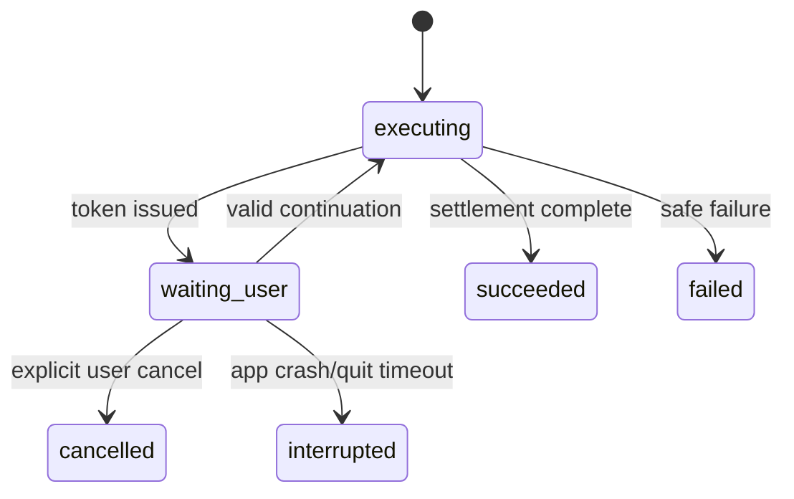

# v3.2.3 TechDoc — Statement Token/Reservation、Atomic Balance Seed 与 NewAccount Generation

| 项目 | 内容 |
| --- | --- |
| 目标版本 | v3.2.3 |
| 日期 | 2026-08-21 |
| 状态 | Implementation Ready / manual seed 默认 blocked 直至 inspector/fault injection 通过 |
| 实施前置 | 进入本版本编码前，v3.2.0 E02-A～C2 必须已合并并通过 platform canary |
| 产品 Spec | `changes/3.2.3/spec.md` |
| 涉及范围 | Statement ServiceHost/token store/waiting-user/generation；balance seed main settlement；NewAccount Worker/async copy |

## 0. 规范性技术依赖

本 TechDoc 直接实现 Platform Contract v1，不另起协议方言。业务命令使用 JobEnvelope；Service 生命周期与资源协调使用独立 ServiceControlEnvelope。

Job operations：

```text
job:start / unit:start / unit:done / unit:error
critical:ready / critical:ack / critical:reject / commit:receipt
job:done / job:error / job:cancel / cancel:ack
```

Service control operations：

```text
executor:init / executor:ready / executor:error / executor:close / executor:close-ack
resource:request / resource:grant / resource:reject
resource:adopted / resource:adopt-ack / resource:release / resource:release-ack
```

所有 Policy 使用 `actionKey` 作为静态主键；运行期 `operationKey` 只用于幂等、Critical Intent、module receipt 与 Recovery Hold。既有执行器使用真实 `mode` 加 `adapterKind='existing-dispatch'`，不得创建第五种 mode，也不得在外层再包一个 Worker。

ResourceGovernor 必须计入：

- BaseLease；
- PersistentReservation；
- PendingInteractionReservation；
- PhaseLease；
- CompoundLease；
- `replacePersistentReservation` 原子替换。

全局 Governor 仅在 Main。Statement Worker 必须通过 Service Control Envelope 的 `resource:request / grant / adopted / adopt-ack` 申请 state/token reservation，禁止直接调用 `governor.acquire*()`。

本文件中的任何 action 只有在 Registry coverage、资源 lease、取消/关闭、receipt/inspector、故障注入、Windows packaged 和人工资金门禁全部满足后，才允许从 `blocked/legacy-preserved` 切到 managed production。

## 1. 目录

```text
src/main-process/statement-worker/
├── worker-entry.js
├── service.js
├── session-state.js
├── state-footprint.js
├── token-store.js
├── interaction-reservation.js
├── generation.js
└── worker-client.js

src/main-process/statement-balance-seed/
├── atomic-seed-writer.js
├── seed-intent-evidence.js
└── seed-outcome-inspector.js

src/main-process/new-account/
├── generation-core.js
├── worker-entry.js
├── worker-client.js
└── artifact-copy.js
```

## 2. Statement Service state

```javascript
{
  serviceGeneration,
  sessionRevision,
  sessions: Map,
  tokens: Map,
  stableSummary,
  activeJobId,
  persistentReservation,
  pendingInteractionReservations: Map
}
```

Token private context不得进入status DTO。status返回数量、purpose、expiresAt、active phase等小型信息。

## 3. Token contract

```javascript
{
  tokenId,
  purpose: 'big-account' | 'manual-balance' | 'scope-generation',
  serviceGeneration,
  sessionKey,
  sessionRevision,
  expiresAt,
  allowedChoiceDigest,
  reservationId
}
```

创建函数必须按以下原子顺序：

```javascript
const bytes = estimatePendingContext(candidate);
const request = buildResourceRequest({
  requestKind: 'pending-interaction-create',
  requested: { memoryBytes: bytes },
  owner: tokenOwnerIdentity(candidate),
  jobRef
});
serviceControl.postMessage(request);        // Worker → Main ServiceHost
const grant = await waitForResourceGrant(request.requestId);
tokenStore.insertPrivate(candidate, grant.reservationId, grant.grantId);
serviceControl.postMessage(buildResourceAdopted(grant, candidate));
await waitForResourceAdoptAck(grant.grantId);
return publicTokenDto(candidate);            // adopt-ack 后才能返回 Renderer
```

消费时先校验generation/revision/purpose/TTL/allowedChoice，再标记single-use。业务采用成功或失败都释放reservation；若需要生成新token，先申请新的再关闭旧的。

## 4. waiting-user coordinator

Main保存TaskRun与token handle，不保存private context。



进入waiting_user：

- `job:done`返回interaction-required结果，但业务Task不终结；
-释放active PhaseLease与operation lock；
-保留Base/Persistent/PendingInteraction leases；
-Renderer收到token+DTO。

Continuation：

-新jobId，复用同一TaskRunId；
- Main 在 Task 持久 metadata 中原子分配 `interactionOrdinal`；
- manual balance 的 operationKey 为 `derive(taskRunId, actionKey, interactionOrdinal)`；
- 同 token transport recovery 复用 ordinal，新 token 使用新 ordinal；
-重新获取lock/PhaseLease；
- Service验证token/evidence；
- stale返回业务错误并终结/等待重新导入，按现有UI合同处理。

## 5. Session adoption

Import构建candidate session。采用前：

```text
validate source/template evidence
estimate new persistent bytes
replacePersistentReservation(old,new)
atomically replace session/batch/revision
invalidate affected tokens/artifacts
return bounded summary
```

若新reservation失败，candidate丢弃；旧session保留还是失效按当前import golden锁定，不得仅因资源失败改变业务语义。

## 6. Generation

Service内部调用现有单一真相函数：mapped rows merge、amount/bill split、balance、warning、template writer。Worker不并行detail/balance，避免改变warning/输出顺序。

Artifact manifest含：artifactKey、generationPath、size、sha256、rowCounts、warning summary、sessionRevision、inputEvidenceHash。Main重新验证FilePlan和业务validator后Publisher。
单 artifact size 以 `256 MiB` 为 dormant validation hard bound，Worker 与 manifest validator 同源拒绝超限，避免 Main readback 接受无界 workbook。

Worker manifest 字段保持冻结且不声明 artifact kind。Main 另持有
`MainExpectedArtifactDescriptorV1[]`，每项以 artifactKey 绑定 kind、ordinal、
stagingResourceId、sheetName、精确 headers、input/output rowCounts、业务 evidence digests
（有序 records/date/account/currency/amount direction）、warning summary、sessionRevision、
inputEvidenceHash 与 writer/style/watermark/template lineage。descriptor 只含 bounded 摘要，不含 raw rows/prepared batch；Main 按 descriptor
顺序同时绑定 FilePlan output 与 manifest，禁止信任 Worker 自报 kind 或仅凭相同 rowCounts。

staging ownership 是 technical validator、journal Publisher prepare 前和 restart cleanup
的共享前置条件：staging root 与 root 下每级现存祖先均须为非 symlink 目录，最终 artifact
须为非 symlink 普通单链接文件，realpath 必须留在 root realpath 内；artifact 集合还须按
平台 case/Unicode key 与 inode 做非 alias 校验。finally/cleanup 只能使用 Main-owned
descriptor 中且已通过该归属验证的路径；schema/hash/outside manifest 不能提供删除权限。

## 7. Balance seed atomic writer

建议写法：

```javascript
async function writeSeedAtomically({ targetPath, bytes, expectedPre }) {
  assertTargetSnapshot(targetPath, expectedPre);
  const tempPath = sameDirectoryTemp(targetPath);
  await openWriteFsync(tempPath, bytes);
  await rename(tempPath, targetPath);
  await fsyncDirectory(path.dirname(targetPath));
  return inspectFile(targetPath);
}
```

每个 manual balance token 同时保存：

```javascript
{
  interactionOrdinal,
  operationKey: `${taskRunId}/statement:resolve-manual-balance/${interactionOrdinal}`,
  reservationId,
  targetAliasKey
}
```

同一 TaskRun 可以顺序产生多个 seed operation；不得复用 operationKey。

Critical Intent evidence限制为bounded metadata：

```javascript
{
  targetAliasKey,
  pre: { exists, size, sha256 },
  expectedPost: { size, sha256 },
  sessionRevision,
  tokenIdHash
}
```

no-op：pre hash等于post hash时不创建 intent，直接返回 noop outcome。

本 action 的 Policy 固定为：

```text
commit.kind = main-settlement
receiptKind = target-post-image
criticalIntent = true
coordinationKind = main-owned-settlement
```

Main 在写 temp 前通过 `MainSettlementIntentCoordinator` 创建/ack intent；这里**不发送** Worker `critical:ready / critical:ack`。权威提交证据是 `targetPath` 的 durable post-image：rename + directory fsync 后由 Inspector 重新读取文件并比较 hash/size。Intent 只保存 expected pre/post 与 operation identity，不能自身证明 committed；任何“已观察到 post-image”的内存/消息通知都不是权威 receipt，startup recovery 仍必须重读目标文件。

directory fsync 必须尝试；只有平台明确返回 unsupported 时可记录 capability=`unsupported`，但 intent/source 保持 open，进入 `unknown`/`terminal-failure` 并创建 `DURABILITY_BARRIER_UNAVAILABLE` hold。Windows packaged probe 验证 durable primitive 前本 action `production.enabled=false`；legacy ArchiveOutboxStore 的静默吞错不能作为 durability 证据。

## 8. App quit / crash

- idle Service协作close；
- waiting-user Task：释放tokenreservation并将未终结Task映射interrupted；
- pure compute安全点可shutdown-only取消；
- seed critical后不得terminate并写cancelled；
-重启 Startup Coordinator 将 open seed intent 转成 `RecoverySourceV1(sourceKind=target-post-image)`，调用 hash inspector；
- committed seed可恢复后续Task状态，但内存session不可恢复。

## 9. NewAccount Worker

Worker输入：小型账户数组、冻结模板路径/snapshot、日期/币种配置、generationPath。Worker不接收final target。Main在dispatch前从同一冻结输入独立异步分批计算bounded expected descriptor：artifactKey、template hash、精确Sheet names/order/count、完整headers/column count、expected used range/dimension range、rowCount、四类业务digest与summary；该descriptor为out-of-band Main authority，不能从Worker result/manifest回填。生产路径每个bounded batch以`setImmediate`等scheduler让出Main event loop并检查Task cancel/app-quit signal；取消发生在authority期间时不调用runtime/不spawn Worker、不创建或遗留staging。同步构造器仅保留作小型oracle。

Core输出records并写workbook。Worker result只作为技术观察；Main technical validator复核staging identity/size/hash，再用out-of-band authority回读精确Sheet集合、列顺序、记录数、日期、账户、币种/records digest。strict scanner必须拒绝任何超出expectedColumnCount/expected used range的cell（包括styled blank）、merge和dimension，不得用`slice(expectedColumnCount)`静默截断。Main Publisher前的authority模式另外要求formula count为0，并拒绝calcChain、externalLink与hyperlink；generic raw oracle仍可读取合法cached formula以维持E10-A差分边界。Publisher metadata中的sheetCount/rowCount/size/hash必须来自Main验证事实，不得硬编码或采用Worker自报值。

Export copy：`fs.promises.copyFile`到task staging，校验源/副本hash，再调用既有single FIFO Publisher；这是一等`inline-async`策略，不占CPU Worker slot但占I/O lease。Publisher固定`requireArchiveHandoff=true`，journal在正式目标committed后继续作为唯一RecoverySource/Hold evidence；TaskLifecycle先settle FilePlan input/output artifacts，只有artifact durable且Task终态持久化后才用既有recovery acknowledgement清理journal。settlement失败返回committed + pending handoff，不得重新解释为可重试业务失败。

E10-B只接收Main当前进程内由`normalizeFilePlanV1`冻结并brand的FilePlan authority；raw object或structured clone不具authority。`FilePlanV1.outputs[*]` additive包含`targetParentIdentity={canonicalRealPath,aliasKey,deviceId,inode,identityReliable,identityKind}`：Main normalizer对resolved direct parent执行`lstat/realpath/stat({bigint:true})`后独立构造并冻结，调用方提供的同名字段必须忽略或拒绝，不能成为authority。direct parent必须是ordinary directory且自身不是symlink；`deviceId/inode`采用bounded十进制string，任一为0、类型/稳定性不可证明时标记`unsupported`。本合同只冻结direct parent，不持久整条ancestor chain：普通上级rename+replacement会使重新解析出的direct parent identity变化；direct parent移走后同一对象移回则identity仍匹配。

E10-B不得再次normalize/resnapshot，必须在copy dispatch前、copy完成handoff前和Publisher调用前对同一原始source/target snapshot及`targetParentIdentity`执行freshness检查。E10-B要求`identityReliable=true`，否则返回稳定capability failure且Publisher=0；generic FilePlan/Publisher只有明确require或携带该evidence时才启用检查，既有action不得因Windows能力未知被误伤。target确认时不存在但随后出现未知文件、existing target被replacement（包括伪造相同size/mtime）、或direct parent被ordinary replacement都必须失败。

E10-B将FilePlan中的exact identity逐字传入Publisher target `expectedTargetParentIdentity`；Publisher不得重建caller authority。Publisher在preflight、artifact staged后、进入commit前与每个backup/publish正式target mutation紧前复核；Node文件API只能把检查窗口收窄到每次mutation紧前，本合同不宣称消除检查后纳秒级竞态。journal v1 entry additive持久同一identity，新E10-B journal必填；恢复读取带字段journal时，在任何target mutation/rollback前先复核，漂移进入现有`manual-recovery`/Recovery Hold且绝不重publish。旧journal缺字段沿既有恢复语义继续处理，不做DB migration或批量取消旧prepared任务。

inline transport持有实际execution promise。正常terminal、shutdown cancel和close/terminate都在policy timeout内等待execution真实结算后才释放lease；timeout沿既有Supervisor映射为cleanup failure/transport leak并保留transport与task-owned staging cleanup ownership，late success/error不能改写已冻结terminal。

## 10. Fault matrix

| 故障 | 结果 |
| --- | --- |
| token reservation失败 | 不保存token/context，不泄漏内存 |
| token issued后expiry | context清理，continuation stale |
| waiting-user app crash | Task interrupted；session/token丢失 |
| seed temp写失败 | pre保持，not-committed |
| seed rename后回包前crash | post hash committed，startup恢复 |
| seed target既非pre也非post | unknown + hold |
| Service crash after seed | seed不重复；session需重新导入 |
| NewAccount Worker crash | no artifact handle/publish |
| copy source变化 | fail closed，不发布 |
| Worker自洽伪造账户/币种digest或附加Sheet | Main authority readback失败，Publisher=0 |
| 额外列/styled blank/merge/dimension或formula cached/外链/超链接 | Main worksheet authority失败，Publisher=0 |
| Main authority大批量计算期间cancel/app quit | bounded safepoint取消，不spawn Worker、不留staging |
| target absent后被创建/existing被替换或传入unbranded plan | 原FilePlan authority freshness失败，Publisher=0 |
| direct parent/grandparent rename后ordinary replacement | FilePlan或Publisher exact parent identity失败，Publisher=0；恢复时manual-recovery/Hold且不触碰target |
| direct parent为symlink或dev/ino不可靠 | normalizer拒绝symlink；E10-B对unreliable返回稳定capability failure，Publisher=0 |
| Publisher committed后回包丢失/进程退出 | 同一journal恢复handoff，禁止重copy/重publish |
| inline copy超过shutdown deadline | interrupted/cleanup leak evidence，保留owner，不虚报lease/leak收口 |

## 11. Tests

- token maxOutstanding/TTL/singleUse/revision/generation；
- reservation acquire/release/replace/expiry race；
- waiting-user lock/lease释放和continuation；
- heap/IPC payload无detailRows；
- Statement四金额/余额/current/all golden；
- seed no-op/pre/post/unknown/crash；
- NewAccount日期/账户/币种/模板golden；
- artifact tamper/Publisher failure；
- direct parent rename+ordinary replacement、grandparent replacement、same parent不变、原对象移走再移回、symlink与unreliable capability；
- Publisher prepare/stage/pre-commit/逐target mutation、journal recovery parent drift、旧journal兼容与committed不二次publish；
-连续十轮Service、Windows Setup/portable、app quit。

## 12. Release strategy

- Statement import可先shadow-free、单路切换；
- manual seed保持legacy直到atomic writer/inspector通过；
- NewAccount独立flag；
- active Task不切换；
- Service rollback前先close/使generation失效；
-已提交seed不down-migrate或猜测回滚。
- E10-B selector关闭即回到legacy；FilePlan/journal reader接受旧记录缺少additive identity。向旧二进制回滚前必须以open Publisher journal=0作为release gate，不在本版增加迁移器。
