# Spec — 平盘对账全入口百万级 Excel 流式导入与崩溃隔离

> change-name: `position-reconciliation-large-table-import`
> status: propose
> owner: PM / Dev
> created: 2026-07-29
> updated: 2026-07-29
> target-version: TBD
> risk: 🔴 资金红线（银行范围替换、来源主键幂等、文件级部分成功、侧库 checkpoint 与存档恢复）

---

## 0. Task Brief

- **Goal**：修复开发环境在「平盘对账数据处理 → 链接表管理」一次导入 5 份网关原始订单时 Electron 直接退出的问题，并把同一套有界内存导入能力覆盖平盘银行对账单、网关入账、网关出账、调拨订单、测试付款和银行账户快照。
- **Context**：v3.1.0 已定义平盘侧库、五类链接原始表、银行确认导入、文件存档与 checkpoint 恢复契约，但当前实现仍在 Electron 主进程内用 SheetJS 全量读取 workbook、全量构造行数组和主键 Map，随后又全量重建链接表。
- **Constraints**：
  1. 不改变 `changes/3.1.0/spec.md` 已发布的业务契约。
  2. 批量业务数据仍只进入平盘侧库，主库不得新增银行或订单明细。
  3. 银行导入继续整批原子替换；普通来源继续逐文件原子、允许文件级部分成功。
  4. 文件证据、业务写入、revision、checkpoint 和存档恢复关系必须可证明。
  5. 金额、币种、日期、长 ID、Excel 物理行号和原始行序列化口径不得因换解析引擎而漂移。
  6. 导入期间 Electron 主进程不得持有随行数增长的数据结构。
- **Done when**：
  1. 真实 5 文件批次不再导致主程序退出，且每一行都有可解释去向。
  2. 平盘银行单、网关入账和网关出账分别通过不少于 300 万数据行的多文件批次压力测试。
  3. 主进程内存不随导入行数线性增长；解析子进程异常退出时主程序存活。
  4. 既有事务、主键、部分成功、checkpoint、存档和暂存清理测试全部保持通过。
  5. 新旧解析器在代表性小样本上的数据库结果与错误契约等价。

---

## 1. 背景、现象与已确认事实

### 1.1 真实复现批次

复现目录：

`/Users/pzhong/Desktop/小助手-Debug/3.1.3/2026/出账原始订单/`

| 文件 | worksheet dimension | 数据行数 | `sheet1.xml` 解压后大小 |
| --- | ---: | ---: | ---: |
| `1426944489706424320_1.xlsx` | `A1:AJ300001` | 300,000 | 592,352,904 B |
| `1426944489706424321_2.xlsx` | `A1:AJ300001` | 300,000 | 592,565,468 B |
| `1426944489706424322_3.xlsx` | `A1:AJ300001` | 300,000 | 593,616,689 B |
| `1426944489706424323_4.xlsx` | `A1:AJ300001` | 300,000 | 594,372,224 B |
| `1426944489706424324_5.xlsx` | `A1:AJ139186` | 139,185 | 272,866,605 B |
| **合计** | — | **1,339,185** | **2,645,773,890 B** |

补充事实：

- 五个 ZIP 完整性检查通过。
- 五个文件表头与 `SOURCE_DEFINITIONS[GATEWAY_OUTBOUND].headers` 精确一致。
- 使用现有逐行流式读取原语在 `--max-old-space-size=512` 下可扫完整批次，证明文件本身不是损坏文件，问题来自现行全量物化链路。
- `.xlsx` 单个 worksheet 的规范行数上限为 1,048,576；本规格中的“300 万行”默认指用户一次选择的多文件批次总量，不代表单个标准 worksheet 可以容纳 300 万行。

### 1.2 崩溃证据

- 应用日志：
  - `/Users/pzhong/Documents/网银账单生成小助手/logs/2026-07/07-29/error.log`
  - 已出现 `Array buffer allocation failed`。
- macOS 诊断报告：
  - `Electron-2026-07-29-222931.ips`
  - `Electron-2026-07-29-223452.ips`
  - `Electron-2026-07-29-223516.ips`
- 诊断报告共同特征：
  - 触发线程为 `CrBrowserMain`。
  - 信号为 `SIGTRAP / EXC_BREAKPOINT`。
  - 顶层栈包含 `v8::ExternalMemoryAccounter::Increase`。

结论：这是 Electron 主进程在 workbook/worksheet/行对象连续物化时发生的 V8 外部内存分配失败，不是普通可捕获的业务校验异常。

### 1.3 当前代码中的线性内存链

| 环节 | 当前事实 | 证据 |
| --- | --- | --- |
| workbook 读取 | `XLSX.readFile(..., { cellDates: true, raw: true })` 在主进程全量打开文件 | `src/main-process/position-reconciliation/readers.js:45-57` |
| sheet 行物化 | `sheet_to_json` 先生成整个 sheet 的对象数组，再转二维行数组 | `readers.js:67-85` |
| 银行批次 | 全批次保留 `records`、`bizIds Map`、文件范围和内容 hash | `readers.js:114-224` |
| 来源单文件 | 同时保留 `rows`、`parsedRows`、`seen Map`、`records` 和 `stableHash(records.map(...))` | `readers.js:302-396` |
| 来源多文件 | 全批次保留每个 parsed result 和 `acceptedKeys Map` | `readers.js:399-450` |
| 暂存 | `copyFileSync` 和同步 SHA-256 在主进程执行，虽不直接造成本次 OOM，但会长时间阻塞 UI | `src/main-process/position-reconciliation/input-staging.js:98-129` |
| 来源写库 | `applySourceImport` 遍历完整 `parsed.records` | `src/main-process/position-reconciliation/store.js:2197-2244` |
| 链接派生 | 每次来源写入后读取该来源全表、生成完整 `derived` 数组、删除并重建全链接表 | `store.js:2247-2280` |
| 其它入口 | 保存调拨映射、删除来源也会调用全量 `rebuildLinkedRows` | `store.js:2147`、`store.js:2409` |
| 银行确认摘要 | prepare 为显示每个既有 scope 行数调用 `getBankRows(...).length`，会反序列化该 scope 全部 JSON | `src/main-process/position-reconciliation/service.js:404` |
| 银行删除 | 先用 `getBankRows` 全量读取所选范围，再构造全量 ID 列表执行 `DELETE ... WHERE id IN (...)` | `src/main-process/position-reconciliation/store.js:2102-2115` |

因此只把 `XLSX.readFile` 换成逐行读取仍不构成完整修复；写库和派生阶段会成为第二个内存崩点。

### 1.4 现有引擎资产对比

| 资产 | 可复用能力 | 不能原样接入的原因 |
| --- | --- | --- |
| `pending-import/streaming-xlsx-reader.js` + `linked-table-stream-source.js` | 逐行回调、内存有界、已有大表实测 | 基于 JSZip，单 ZIP entry 达 2 GiB 附近会失败；默认只读物理 `sheet1.xml`；现有链接表路径仍在主进程 |
| `backend/big-table-import/zip-reader.js` | `yauzl`、workbook rels 正解、Zip64 友好、shared strings 支持 | `openWorkbook` 的既有公共契约是“唯一 sheet”，不能直接替代平盘当前的“扫描全部 sheet 后唯一识别”语义 |
| `backend/big-table-import/row-scanner.js` | 高速单遍字节扫描、真实物理行号、按列取值 | 当前输出主要面向字符串契约；平盘还需补 SheetJS `raw + cellDates` 的数字、布尔、日期样式和 1904 日期系统等价层 |
| `backend/big-table-import/import-worker.js` + `pipeline.js` | 契约化校验、worker 调度、进度、错误上限 | v1 会在每个解析 worker 中构造完整 `batch`，再通过 `postMessage` 把整文件传给写侧；36～49 列、百万行不满足本规格的有界内存目标 |
| `biz-op-recon-import/import-worker.js` / pending worker | Electron `utilityProcess` 隔离、解析与 SQLite writer 同进程、逐行 INSERT、失败回滚 | 业务契约不同，但进程拓扑最接近本规格目标 |

**技术结论**：采用混合方案——复用通用大表引擎的 `yauzl + row-scanner` 解析原语，复用业务 OP/Pending 的独立进程与逐行落库拓扑；不复用通用引擎 v1 的整文件 `batch` 管道。

---

## 2. 范围

### 2.1 必做

1. 平盘银行对账单 46/49 列 `.xlsx/.xls` 导入。
2. 五类链接原始表：
   - 中台调拨订单表
   - 中台测试付款全量信息表
   - 中台网关原始入账订单
   - 中台网关原始出账订单
   - 清结算银行账户表
3. 暂存复制、SHA-256、解析、预检和写库移出 Electron 主线程。
4. `.xlsx` 使用有界内存流式解析；`.xls` 允许 SheetJS 兼容读取，但只能在独立子进程内执行。
5. 跨文件/文件内主键去重改用磁盘型临时账本。
6. 来源行与链接行增量写入；全量映射重建改成数据库游标流式重建。
7. 保留现有确认 token、返回结果、错误码、存档、checkpoint 和 revision 语义。
8. 新增导入阶段、文件、已扫描行数、吞吐和取消进度。
9. 新增子进程崩溃、磁盘不足、SQLite busy、暂存字节变化和取消的明确用户提示。
10. 银行确认摘要改用 SQL `COUNT/GROUP BY`，银行范围删除改用范围条件直接删除；不得在“导入后管理”路径重新加载数百万行。
11. 百万行银行/来源删除和调拨映射重建同样放入 utilityProcess，避免虽有界内存但长事务继续冻结 Electron main。

### 2.2 明确不做

1. 本规格不重写平盘资金性质匹配算法。
2. 本规格不交付 300 万行链接表/原始表的流式导出。
3. 本规格不改变 Excel 单 sheet 行数上限，也不自动把多个同结构 sheet 合并成一个来源。
4. 本规格不改变来源主键、状态过滤、金额校验、币种校验、日期字段或派生规则。
5. 本规格不把 job ledger 或业务明细写入主库。
6. 本规格不新增第三方依赖；优先复用仓库已有 `yauzl`、`sax`、`xlsx` 和 `node:sqlite`。

### 2.3 下游容量边界

当前 `service.run()`、`exportBank()`、`exportLinked()` 和 `exportRaw()` 仍会把选中范围或全表读成数组。完成本规格后：

- “300 万行可导入、可管理、可删除、可重建派生”属于本规格验收范围。
- “300 万行可直接运行资金性质校验并导出单一文件”不属于本规格验收范围。
- 在下游另行完成分区匹配和流式拆分导出之前，版本说明不得宣称“平盘 300 万行端到端全链路完成”。

---

## 3. 必须保持的业务不变量

### 3.1 平盘银行对账单

1. prepare 完成全部文件校验后才返回确认信息。
2. 用户确认前不修改侧库。
3. apply 仍是所选文件的单一事务：
   - 重新验证暂存文件身份；
   - 验证 BizId 在本次选择中唯一；
   - 验证 BizId 不得从既有其它 Channel+月份迁移；
   - 删除本次 Channel+月份旧范围；
   - 插入全部新行；
   - revision、文件提交凭证和 checkpoint 同事务提交。
4. 任一文件、任一行或任一数据库写入失败，整个银行批次回滚，旧范围保持不变。
5. `import_order` 继续按用户选择文件顺序、文件内物理行顺序单调递增。
6. prepare 展示旧范围行数时使用数据库聚合计数，不得为计数解析 `original_json/working_json`。
7. 删除银行范围时直接按 Channel+月份条件删除并使用 `changes`/聚合结果统计；不得把全部 ID 拉回 JS，也不得生成超出 SQLite 参数上限的 `IN`。

### 3.2 普通链接来源

1. 同一次选择先完成全批次预检，再开始自动写库。
2. 结果顺序继续等于用户选择顺序。
3. 单文件规则：
   - 完全相同的同主键行折叠；
   - 同主键内容不同则整份文件拒绝；
   - 任一非法行整份文件拒绝；
   - 被拒绝文件不得产生任何来源行、链接行、revision、checkpoint 或文件提交凭证。
4. 跨文件规则：
   - 已被前序“预检接受”的文件占用的主键，会使后续文件整份拒绝；
   - 即使前序文件随后因数据库系统错误未写入，后续文件仍保持预检阶段的拒绝结果；不得因写库结果重新分配主键所有权。
5. 写库继续逐文件独立事务：
   - 文件 A 成功、文件 B 失败时保留 A；
   - 每个成功文件独立推进一次 side DB generation；
   - 存档只包含实际提交的文件。
6. 后续独立导入同一业务主键继续执行 upsert，而不是按跨文件冲突处理。

### 3.3 清结算银行账户表

1. 同一次选择最多一份账户快照。
2. prepare 只保留小型 manifest/token，不保存百万行 JS 数组。
3. 仅 `账户状态=正常` 的行进入有效快照。
4. 过滤后为 0 行时拒绝，旧快照不覆盖。
5. 用户确认后的 apply 是单一整表替换事务。

### 3.4 派生与顺序

1. 派生规则继续唯一来源于 `derivation.js`，不得在 worker 中复制第二套业务判断。
2. 新增单记录派生 API，例如 `deriveLinkedRowsForRecord(sourceType, record, mappings)`；现有批量 API可包装调用该单记录 API。
3. 普通来源 upsert 一条来源记录时，只重建该 `source_row_id/business_key` 对应的链接行。
4. 删除来源记录依赖外键级联删除其链接行，不再为删除操作重建整个来源表。
5. 调拨账户映射变化仍需重建全部 FundTransfer 派生，但必须使用 `SELECT ... ORDER BY id` 游标逐行读、逐行派生、逐行写，不得生成完整 `sourceRecords` 或 `derived` 数组。
6. 链接行稳定顺序改由 `(source_row_id, leg_index, id)` 定义。该顺序与现行“来源 `ORDER BY id`，每条记录按 legIndex 展开”的相对顺序等价；不得依赖全表致密重算的 `ordinal`。
7. `ordinal` 列保留兼容，不做破坏性 schema 迁移；新写入值必须确定性生成，读取排序不再只信任历史 `ordinal`。

### 3.5 文件身份、checkpoint 与存档

1. 原文件继续先复制到应用私有暂存区，业务读取和存档都使用同一暂存副本。
2. 暂存复制前后校验源文件 stat；暂存副本记录 `sourceSnapshot + sizeBytes + SHA-256`。
3. 解析、确认 apply、side DB 提交前和存档复制时继续复核暂存字节。
4. job ledger 自身记录文件大小、SHA-256 和 manifest hash；apply 前只读打开并复核，禁止信任可被替换的 ledger。
5. worker 每个成功事务必须同时写入：
   - 业务数据；
   - 对应 revision；
   - `position_operation_inputs` 文件提交凭证；
   - checkpoint generation/token/history。
6. 普通来源多文件发生部分提交后崩溃，恢复存档集合继续为：

   `主库 pending.archiveFiles ∩ side DB position_operation_inputs(operationToken)`

7. worker 直接写侧库时必须复用与 `PositionReconciliationStore._mutation` 相同的 checkpoint helper，禁止复制一套近似实现。
8. worker 首次写前验证侧库 checkpoint 等于主进程传入的基准 checkpoint；每次文件提交后以本 worker 刚生成的 checkpoint 作为下一事务父节点。
9. 侧库、checkpoint、文件证据或 pending 所有权不一致时 fail closed。
10. worker fatal 前已有来源文件提交时，主进程优先在同一进程内调用既有恢复意图逻辑完成“已提交文件存档/持久 outbox → checkpoint 同步 → 未提交 staging 清理”；同进程恢复也失败时保留 pending，要求重启恢复，禁止直接重试导入。

### 3.6 Excel 值口径

新流式解析器必须与当前 `XLSX.readFile({ raw: true, cellDates: true })` 对齐：

- 字符串、inline string、shared string、公式缓存字符串；
- 普通数字、科学计数法、负数、零和空；
- 布尔值和错误单元格；
- 日期样式数字、ISO 日期、Excel 1900/1904 日期系统；
- 日期对象序列化后的真实时间值；
- 15 位以上 ID、前导零和文本数字；
- 空白行与稀疏物理行号；
- XML 实体、富文本 shared strings 和跨 chunk UTF-8。

若某种合法单元格形态尚未证明与 SheetJS 等价，必须明确拒绝或保留在旧 `.xls` 子进程路径；不得静默转为空字符串。

---

## 4. 目标架构

### 4.1 数据流

```mermaid
flowchart LR
    A["Renderer 选择文件"] --> B["主进程创建 jobId / operationToken"]
    B --> C["utilityProcess: 异步暂存 + SHA-256"]
    C --> D["yauzl + workbook rels + row-scanner"]
    D --> E["磁盘型 job ledger：文件、主键、范围、计数"]
    E --> F{"需要用户确认？"}
    F -- "银行 / 账户快照" --> G["返回小型 manifest + token"]
    G --> H["确认后重新校验暂存副本"]
    F -- "普通来源自动导入" --> I["登记已预检接受文件的存档意图"]
    H --> J["utilityProcess: apply"]
    I --> J
    J --> K["逐行校验 + SQLite prepared write"]
    K --> L["逐行来源 upsert / 链接派生"]
    L --> M["同事务：revision + input evidence + checkpoint"]
    M --> N["主进程同步 checkpoint / 完成存档 / 清理 staging"]
```



### 4.2 新组件建议

```text
src/backend/position-reconciliation-import/
├── xlsx-reader.js          # 基于 big-table zip-reader/row-scanner 的平盘值等价层
├── xls-reader.js           # SheetJS 兼容路径，仅在 utilityProcess
├── contracts.js            # 银行与五类来源表头、行映射、校验契约
├── ledger.js               # job ledger schema、文件级 savepoint、主键/范围查询
├── source-writer.js        # 来源 upsert + 单记录派生 + 文件级事务
├── bank-writer.js          # 银行整批范围替换事务
└── worker-entry.js         # stage/preflight/apply/delete/rebuild-mapping 作业入口

src/main-process/position-reconciliation/
├── import-dispatch.js      # utilityProcess/spawn、协议、取消、异常还原
└── side-db-mutation.js     # Store 与 worker 共用的 checkpoint/input-evidence 事务 helper
```

文件名可在实现阶段调整，但职责边界不得退回“解析 worker 产出完整 batch，主进程写库”。

### 4.3 进程拓扑

- Electron 环境使用 `utilityProcess.fork`，使解析/原生解压/V8 OOM 与 Electron main 隔离。
- 纯 Node 单测使用 `spawn(process.execPath)` 或可注入 fake dispatcher。
- 解析器和 SQLite writer 位于同一独立进程，行数据不经过 IPC。
- 主进程与 worker 之间只允许传输：
  - job 配置和文件 descriptor；
  - 每文件 manifest；
  - 有上限的错误明细；
  - 进度和资源统计；
  - 最终小型结果。
- 禁止通过 `postMessage/stdout` 传输完整行数组、完整主键数组、完整 raw JSON 集合或完整冲突集合。

### 4.4 作业阶段

#### Stage

1. worker 创建现有平盘 staging 根目录下的批次子目录。
2. 使用异步流复制源文件，并在同一次顺序读取中计算 SHA-256。
3. 复制前后校验源文件身份；写入完成后校验暂存文件大小和摘要。
4. 失败时只清理本次新建且未被 pending/outbox 保护的 staging/ledger。

#### Preflight

1. 按用户选择顺序逐文件扫描。
2. 识别唯一合法业务 sheet。
3. 严格校验表头和每行。
4. 把去重主键写入 job ledger，不进入 JS `Map/Set`。
5. 计算文件级：
   - sourceType/sheetName；
   - 扫描行、空白行、有效唯一行、相同重复折叠、过滤行；
   - 日期范围/Channel+月份范围；
   - 增量 content hash；
   - 有上限错误摘要。
6. 文件预检失败时回滚该文件对 ledger 的全部写入；前序已接受文件的主键继续保留。
7. 所有文件预检结束后再进入普通来源 apply，保证跨文件主键所有权不受后续 DB 写入成败影响。

增量 content hash 必须与现有 `stableHash(records.map(record => record.row/originalRow))` 等价：按稳定 JSON 数组语法依次向 SHA-256 写入 `[`、行间逗号、每行 `stableJson`、`]`，不得改成简单拼接行 hash。

#### Apply

- 普通来源：按预检结果顺序处理每个接受文件，每文件一个 side DB transaction。
- 银行：用户确认后，所有文件一个 side DB transaction。
- 账户快照：用户确认后，一个全表替换 transaction。
- apply 再次扫描暂存文件并重新执行核心校验；apply 结果的行数/content hash 必须与 preflight manifest 一致，否则回滚并报“预检与提交结果不一致”。

### 4.5 Job ledger

job ledger 是 staging 批次内的临时 SQLite 文件，不属于主库或平盘业务侧库。最小概念表：

```sql
job_files(
  file_index INTEGER PRIMARY KEY,
  source_type TEXT,
  staged_path TEXT,
  sha256 TEXT,
  size_bytes INTEGER,
  sheet_name TEXT,
  status TEXT,
  scanned_rows INTEGER,
  accepted_rows INTEGER,
  collapsed_rows INTEGER,
  filtered_rows INTEGER,
  content_hash TEXT
);

source_seen_keys(
  source_type TEXT,
  business_key TEXT,
  row_hash TEXT,
  first_file_index INTEGER,
  first_row_number INTEGER,
  PRIMARY KEY(source_type, business_key)
);

bank_seen_biz_ids(
  biz_id TEXT PRIMARY KEY,
  channel TEXT,
  month_key TEXT,
  first_file_index INTEGER,
  first_row_number INTEGER
);

bank_scopes(
  channel TEXT,
  month_key TEXT,
  row_count INTEGER,
  PRIMARY KEY(channel, month_key)
);
```

要求：

- `PRAGMA temp_store=FILE`，禁止百万主键临时表被强制放入内存。
- 文件预检使用 savepoint/transaction；失败文件不得污染 batch 主键集合。
- 错误详情只保留前 50～100 条，另记全量错误计数。
- token 只保存 ledger 路径、manifest 和文件 descriptor，不保存行。
- ledger 完成 preflight 后关闭连接，再计算 ledger SHA-256；apply 以只读方式打开并验证摘要/manifest，防确认等待期间被替换。
- ledger 不进入存档；成功、取消或无恢复引用的失败任务完成后删除。

### 4.6 XLSX 解析

1. 复用 `big-table-import/zip-reader.js` 的 `yauzl` 打开和 `locateSheets`。
2. 平盘新增 sheet 选择层：
   - 银行只接受 sheet 名为“渠道对账单”且表头为 46/49 列；
   - 来源扫描所有 workbook sheet 的表头；
   - 恰好一个来源契约命中时读取该 sheet；
   - 0 个命中报未识别；
   - 多个命中报歧义；
   - 不因存在无关说明 sheet 就直接拒绝。
3. 复用字节层 row-scanner，但增加可选 cell metadata/value decoder：
   - `t` 类型；
   - `s` style index；
   - workbook `date1904`；
   - styles numFmt/cellXfs；
   - SheetJS 对等的数字与日期转换。
4. shared strings：
   - 小 SST 可在设定内存预算内加载；
   - SST 超预算时写入临时长度前缀文件，并使用 64 位 offset 索引 + 有界 LRU；
   - 禁止无上限 `string[]` 成为新的百万级内存源；
   - SST entry 损坏、索引越界或读取不完整必须显式失败。
5. worksheet XML、sharedStrings 或单行 XML 大于预期时仍逐 chunk 处理；禁止完整 `Buffer.concat`。
6. ZIP entry 元数据、worksheet 物理行号和实际列号超出本格式容量契约时显式拒绝；压缩比、解压字节数和运行时长纳入 zip-bomb 防御及日志，不能因 `yauzl` 可读取 Zip64 就无限制解压。

### 4.7 XLS 兼容路径

- `.xls` 继续使用 SheetJS，以保持 BIFF 和日期格式兼容。
- 读取必须位于 utilityProcess，主进程只接收 manifest/result。
- 标准 `.xls` 单 sheet 行数上限远低于本规格 300 万行目标，因此不要求为 `.xls` 新写 BIFF 流式解析器。
- `.xls` 子进程异常退出时主程序仍须存活并显示文件级错误。

### 4.8 侧库写入

#### 普通来源

每条接受记录执行：

1. 按现有 `stableJson` 语义计算 row hash。
2. upsert `position_source_rows` 并取得稳定 `source_row_id`。
3. 删除该 `source_row_id` 既有链接行。
4. 调用单记录派生 API。
5. 写入 0/1/2 条链接行。

文件扫描完成且 manifest 对账通过后：

1. bump `source/<sourceType>` revision；
2. bump `linked/<sourceType>` revision；
3. 写文件提交凭证；
4. 推进 checkpoint；
5. COMMIT。

#### 银行

1. 先以只读方式 attach 已验证 ledger，再执行 `BEGIN IMMEDIATE`；ledger 在业务事务内只读，禁止跨数据库写入造成原子性歧义。
2. 用 SQL join 重新检查 incoming BizId 与现有其它 scope 冲突，最多返回前 50 条并记录总数。
3. 删除 manifest 中的目标 scope。
4. 重新流式扫描全部文件并 INSERT。
5. 行数/hash/scopes 与 manifest 精确一致后，bump 每个 scope 和 `bank-global` revision。
6. 写全部输入文件提交凭证并推进一次 checkpoint。
7. COMMIT；任一失败 ROLLBACK。

#### 银行摘要与删除

- 新增 SQL 聚合 API，例如 `countBankRowsByScopes`，prepare 只读取 `{channel, monthKey, rowCount}`。
- `deleteBankScopes` 先用 `SELECT channel, month_key, COUNT(*) ... GROUP BY` 取得本次实际命中的 scope，再在同一 mutation 中按选定 Channel/月直接 `DELETE`；只 bump 实际有删除行的 scope 与 `bank-global` revision，并按实际 changes 返回计数。
- 删除前后不得调用 `getBankRows`，不得解析 JSON，不得构造 ID 数组。
- 大范围删除通过 utilityProcess 执行，仍由平盘全局 operation lock 和 checkpoint lifecycle 包裹。

#### 来源删除

- 按 sourceType+月份直接删除 `position_source_rows`，依赖外键级联删除对应链接行。
- 删除后只 bump source/linked revision，不再调用全量 `rebuildLinkedRows`。
- 账户快照整表删除保持现有二次确认和 wholeTable 门禁。
- 百万行级删除通过 utilityProcess 执行；取消仅允许发生在事务提交前，失败必须完整回滚。

#### 映射重建

- 保存映射仍是单一业务事务。
- FundTransfer 来源通过 SQLite iterator 顺序读取。
- 每读一条立即解析 raw JSON、派生、插入链接行。
- 映射表修改和新链接表必须同事务可见；任一解析或写入失败恢复旧映射和旧链接行。
- 映射重建也应运行在 utilityProcess，防 300 万行来源表阻塞主进程。

### 4.9 Side DB mutation helper

从 `PositionReconciliationStore._mutation` 和 `_recordOperationInputs` 抽出纯 Node helper，供 main-side Store 与 worker 共用：

- 校验当前 checkpoint/history；
- 校验 expected identity/generation/token；
- 绑定外部 operationToken；
- 执行业务回调；
- CAS 更新 generation/token；
- 插入 checkpoint history；
- 记录并复核 operation input evidence；
- COMMIT/ROLLBACK。

worker 不执行侧库迁移。主进程先完成侧库初始化和迁移，再把 dbPath、schema version、base checkpoint 和 operationToken 传给 worker；worker 只验证，不擅自修复或接管未知侧库。

worker side DB connection 必须镜像当前正式连接的关键 PRAGMA：`foreign_keys=ON`、`journal_mode=WAL`、`synchronous=NORMAL`、`busy_timeout=30000`，并在开始前读回验证。平盘全局 operation lock 继续覆盖 worker 整个生命周期；并发 status/summary 只允许通过 WAL 读取提交前或提交后的完整快照，不得观察半事务。

### 4.10 错误分级

| 类型 | 示例 | 行为 |
| --- | --- | --- |
| 文件级业务错误 | 表头错误、坏行、文件内主键冲突、跨文件后序冲突 | 拒绝该文件；普通来源继续后序文件，银行整批拒绝 |
| 暂存身份错误 | SHA/size/snapshot 不一致 | 拒绝对应提交，不修改 side DB |
| 可恢复 DB 竞争 | `SQLITE_BUSY` 在 busy_timeout 后仍失败 | 当前事务回滚，显示明确错误 |
| 系统级 fatal | disk full、I/O error、checkpoint 分叉、schema 不匹配 | 终止剩余写入；保留 pending/ledger/staging 供恢复或诊断 |
| worker 异常退出 | OOM、SIGKILL、未捕获 native error | Electron 保持运行；当前 SQLite transaction 自动回滚；已提交文件按 operation evidence 恢复 |
| 用户取消 | preflight/apply 中取消 | 终止解析；当前事务回滚；已提交普通来源文件不撤销，返回文件级部分成功 |

错误结果必须包含阶段、文件名、文件序号、已扫描行数、错误码和有限 detailLines；不得通过日志或 IPC 携带完整原始行集合。

### 4.11 进度与取消

新增统一进度事件，例如 `position-reconciliation:import-progress`：

```js
{
  jobId,
  kind: 'bank' | 'source' | 'account' | 'mapping-rebuild',
  stage: 'staging' | 'preflight' | 'applying' | 'deriving' | 'committing',
  currentFile,
  totalFiles,
  fileName,
  scannedRows,
  acceptedRows,
  committedRows,
  elapsedMs
}
```

- 进度最多每 100ms 或每 10,000 行上报一次。
- Renderer 退订必须放在 `finally`，防 listener 泄漏。
- 用户取消通过 jobId 发给 dispatcher；worker 在文件流、行循环和事务提交前检查取消标记。
- COMMIT 开始后不宣称取消成功；若事务已经提交，返回真实已提交结果。

### 4.12 内存与磁盘门禁

1. 主进程不得创建随输入行数增长的 `Array/Map/Set/string`。
2. worker 允许的线性结构仅限：
   - 当前行；
   - prepared statement；
   - 有界错误列表；
   - 有界 shared-string cache；
   - 小型文件 manifest。
3. 主键、跨文件去重和 scope 统计默认落 job ledger。
4. 解析前读取 ZIP entry 元数据和磁盘可用空间，估算：
   - staging 副本；
   - ledger；
   - side DB/WAL 事务空间；
   - shared-string spill。
5. 空间不足时在任何业务 DELETE 前拒绝；实际写入发生 `SQLITE_FULL` 时事务回滚。
6. 具体磁盘估算系数在真实 5 文件和 300 万行 probe 后固化，未校准前不得用过低常数造成静默磁盘打满。

---

## 5. 接口、状态与兼容

### 5.1 IPC

以下业务 IPC 名称与返回主形态保持不变：

- `position-reconciliation:bank:prepare-import`
- `position-reconciliation:bank:apply-import`
- `position-reconciliation:bank:cancel-import`
- `position-reconciliation:source:prepare-import`
- `position-reconciliation:source:apply-import`
- `position-reconciliation:source:cancel-import`

变化：

- service 方法内部转为 async。
- bank/source token 从完整 parsed rows 改为小型 manifest descriptor。
- 增加 progress/cancel-active 辅助 IPC，不改变既有确认取消 IPC 的含义。
- 现有 `status / message / results / successCount / failedCount / confirmationCount / inputFiles / cleanupPaths` 字段继续保留。

### 5.2 数据库

- 平盘业务侧库不要求新增业务表。
- job ledger 是临时文件，不参与业务备份和存档。
- 若为 worker 状态或版本门禁新增 side DB metadata，必须单独列迁移并证明旧版本回滚安全；默认方案不新增。
- 链接行读取顺序调整需要 characterization test，不能仅靠代码推理放行。

### 5.3 回退

- 保留新旧 reader 的开发期特性开关，用于小样本等价对照和紧急回退。
- 禁止新引擎失败后自动在 Electron 主进程调用旧 `XLSX.readFile`。
- 若关闭新引擎：
  - 小文件可走旧逻辑；
  - 超过安全阈值的文件必须明确拒绝并提示启用新引擎/升级版本；
  - 不允许以“兼容回退”为名重新引入主进程崩溃路径。
- 新方案不修改业务 schema，代码回退后既有已导入数据仍可被旧版本读取。

### 5.4 清理生命周期

- ledger 跟随对应 staging batch。
- prepare 返回确认 token 时，ledger 和暂存文件一起保留。
- 取消 token 时清理 ledger 和未被存档保护的 staging。
- 普通来源只清理失败文件或已完成存档且无未完成引用的成功文件。
- worker fatal 后：
  - 有 pending/operation input evidence 的路径由现有恢复机制接管；
  - 无提交凭证且无其它保护引用的 ledger/文件可在 checkpoint 恢复完成后清理；
  - 保护集读取失败时保守保留。
- staging、ledger 和大文件清理同样在 utilityProcess/异步文件路径执行；主进程不得用同步递归删除长时间阻塞 UI。

### 5.5 可观测性与隐私

每个 job 记录：

- jobId、kind、operationToken 摘要；
- 文件数、压缩大小、worksheet/sharedStrings 解压大小；
- 各阶段耗时和扫描行数；
- accepted/collapsed/filtered/rejected/committed；
- worker pid、退出码、峰值 RSS/heap；
- side DB generation before/after；
- 清理结果。

不得记录：

- 完整账号、卡号、原始整行；
- 全量业务主键；
- 未掩码的敏感账户表内容。

错误报告只保留定位所需的文件、sheet、物理行、字段和原因；账号类值按现有隐私规范掩码。

---

## 6. Unknowns Register

| 未知 | 类型 | 影响 | 可逆性 | 当前证据 | 处理 | 最便宜验证方式 | 当前决定 |
| --- | --- | --- | --- | --- | --- | --- | --- |
| “300 万行”是否包含单 workbook 多个同结构数据 sheet | 隐性输入契约 | 高 | 一般 | 当前 v3.1.0 是“唯一识别一张来源 sheet”；标准单 sheet 不超过 1,048,576 行 | ASSUME | 取得银行/入账实际大批次，列出 workbook sheet 结构 | 本规格按“多个单数据 sheet 文件合计 300 万”实现；多同结构 sheet 另开契约 |
| 新 scanner 对 SheetJS 数字/日期/布尔/公式是否逐值等价 | 已知未知 | 高 | 一般 | 当前 row-scanner 主要返回字符串；平盘旧 reader 使用 `raw + cellDates` | PROBE | 构造 cell-type 四方 fixture，逐 cell 和 DB JSON/hash 对比 | parser parity 未通过前不接生产写库 |
| 超大 sharedStrings 的真实分布和内存峰值 | 已知未知 | 高 | 容易 | 本次 5 文件 `sharedStrings.xml` 仅 137 B，但银行/入账来源未知 | PROBE | 对真实大文件输出 SST uncompressed size、uniqueCount、峰值 RSS | 必须实现内存阈值 + spill，不把当前样本当普遍前提 |
| 300 万行银行/来源的 side DB 与 WAL 磁盘放大系数 | 已知未知 | 高 | 容易 | 当前侧库存 raw/working/linked JSON，理论放大明显，但无真实 300 万数据 | PROBE | 临时侧库分别导入 30 万/100 万，按行数外推并用 300 万实测校准 | 磁盘门禁系数须由 probe 固化 |
| worker 连续提交多个来源文件后 fatal，当前 lifecycle 能否在同进程和重启两条路径正确收口 | 状态盲区 | 高 | 一般 | v3.1.0 已有 operation input evidence 和恢复交集；现有写入发生在 main connection | PROBE | 在 A commit 后、B 中途、checkpoint 同步前注入退出 | 未通过故障注入前不允许多文件生产接线 |
| 增量派生排序是否与全量重建逐行等价 | 数据契约盲区 | 高 | 容易 | 当前批量派生按 source id + leg 顺序；新方案拟按 source_row_id + leg_index | PROBE | 同一 fixture 分别跑旧全量与新增量，比较可见/隐藏行、顺序、JSON、匹配结果 | characterization 必须 byte-for-byte 或有显式批准差异 |
| 300 万行导入后的 run/export 仍会全量物化 | 入口旁路 | 高 | 困难 | `service.run/export*` 当前直接返回数组 | PROBE（后续规格） | 以已导入临时库测 run/export 峰值并形成独立 spec | 本规格不宣称端到端完成，发布说明显式限定 |
| 300 万行导入后 manager summary 的 SQL 聚合延迟是否可接受 | 性能盲区 | 中 | 容易 | summary 不解析 JSON，但 COUNT/MIN/MAX 仍需扫描索引/表 | PROBE | 在 300 万临时库测 status/data-manager/linked-manager P95 | P95 超 1 秒则补覆盖索引或持久汇总，不把同步卡顿留到发布后 |
| 开发目录名 3.1.3 与当前 `package.json.version=3.1.1` 不一致 | 环境未知 | 低 | 容易 | 仓库当前版本号为 3.1.1 | ASSUME | 实施前确认目标分支/版本 | Spec 不绑定目标版本，避免误写版本文档 |

### 6.1 BLOCK 问题

本规格的“导入修复”没有必须等待用户回答的 BLOCK 项。

若后续把“300 万行可运行并导出”纳入同一版本，则“超过 Excel 单 sheet 上限时拆 sheet 还是拆文件”属于会改变输出契约的 BLOCK 项，必须由业务负责人拍板。

### 6.2 保守假设

1. 保持当前“一个 workbook 最多唯一识别一张业务数据 sheet”的行为。
2. 用户选择顺序继续决定跨文件主键冲突的先后。
3. 不新增自动业务 fallback。
4. 不以提高堆上限作为主修复；堆上限只作为子进程防御值。
5. 实际 300 万行由多文件组成，单文件遵守对应 Excel 格式上限。

---

## 7. 盲区与风险处置

### [Critical] 优化不得改变银行整批原子替换与来源逐文件部分成功

- **场景**：为了减少 WAL 或缩短事务，把银行按文件/分块提交，或把普通来源改成全批次单事务。
- **事实与证据**：`changes/3.1.0/spec.md` 明确银行全部文件校验后按范围原子替换；普通来源跨文件后序冲突、已成功文件保留。当前 `replaceBankScopes` 单事务，`prepareSourceImport` 每成功文件单独 `applySourceImport`。
- **推断/未知**：任何“统一成同一种事务粒度”的抽象都会改变重试和部分失败结果。
- **资损或审计影响**：银行可能出现半批新旧混合；普通来源可能把本应保留的前序成功文件一并回滚，存档与实际写入不一致。
- **最便宜验证**：A/B 两文件故障注入矩阵，逐一比较 side DB generation、业务行、revision、operation inputs 和 archive files。
- **处置**：PROBE；⚠️ 资金红线，请人工复核。

### [Critical] Excel 值类型漂移可能改变日期、主键和重复判断

- **场景**：新 scanner 把 SheetJS 的 `Date/number/boolean` 一律变成字符串。
- **事实与证据**：旧 reader 使用 `cellDates:true, raw:true`；`stableJson` 对 Date 使用 ISO 时间，对 number 和 string 生成不同 hash。
- **推断/未知**：日期样式、1904 系统、科学计数和公式缓存可能在真实银行/入账文件出现。
- **资损或审计影响**：相同记录可能被判成不同、不同日期可能被折叠、月份范围可能错误、原始导出类型可能变化。
- **最便宜验证**：生成包含全部 cell 类型和日期系统的 fixture，同时跑 SheetJS 与新 reader，比较逐值类型、row hash、monthKey 和最终 DB。
- **处置**：PROBE；parser parity 是生产接线硬门禁。⚠️ 资金红线，请人工复核。

### [Critical] worker 部分提交后的 checkpoint/存档恢复

- **场景**：来源 A 已 commit，B transaction 中 worker OOM；主进程尚未同步 checkpoint。
- **事实与证据**：v3.1.0 恢复要求 pending 与 `position_operation_inputs` 严格交集；现有生命周期在存档未 durable 时禁止同步和清 pending。
- **推断/未知**：worker 使用第二 SQLite connection 后仍需证明 history 父链和 operation token 完全一致。
- **资损或审计影响**：可能漏存档已提交 A、错误存档未提交 B，或错误清除 pending 后失去恢复证据。
- **最便宜验证**：在 A commit 后、B 首行/中段/commit 前、worker 返回前分别 hard-exit，再重启恢复。
- **处置**：PROBE；共享 mutation helper，禁止双实现。⚠️ 资金红线，请人工复核。

### [Important] 只修 reader 会在链接全量重建处再次 OOM

- **场景**：流式解析成功后调用现有 `rebuildLinkedRows`。
- **事实**：现有函数同时物化全部来源和全部派生。
- **推断/未知**：网关入账/出账 300 万行时第二峰值可能高于读取峰值。
- **影响**：用户看到解析完成后软件仍退出，且问题更接近事务写入阶段。
- **证据**：`store.js:2247-2280`。
- **最便宜验证**：用临时侧库灌入 100 万来源行，仅运行现有 rebuild 记录峰值。
- **处置**：已覆盖；增量派生和游标重建与 reader 改造同批交付。

### [Important] 同步 staging 会造成“未闪退但 UI 假死”

- **场景**：多 GB 输入在主进程同步 copy/hash。
- **事实**：`stageInputFiles` 使用 `copyFileSync`、`readSync`、`rmSync`。
- **推断/未知**：大批次在 Windows 杀毒/网络盘环境可能阻塞数十秒。
- **影响**：用户可能重复点击、强退或误判导入失败。
- **证据**：`input-staging.js:98-129`。
- **最便宜验证**：对真实批次记录 event-loop delay 和窗口响应。
- **处置**：已覆盖；stage/hash 一并进入 utilityProcess。

### [Important] 银行确认计数和删除仍存在全量读取旁路

- **场景**：成功导入 300 万行后再次 prepare 同一 scope，或在数据管理中删除该 scope。
- **事实**：prepare 用 `getBankRows(...).length` 统计，删除先加载全部行和 ID。
- **推断/未知**：即使导入引擎内存有界，这两个管理动作仍会反序列化数百万行或触发 SQLite 参数上限。
- **影响**：用户会在导入后的常规管理流程再次遇到卡死/OOM，形成“只能导入、不能维护”的半成品。
- **证据**：`service.js:404`、`store.js:2102-2115`。
- **最便宜验证**：临时大库调用 prepare 摘要与 delete，记录 RSS、SQL 参数和结果计数。
- **处置**：已覆盖；SQL 聚合计数 + 范围 DELETE。

### [Important] 磁盘空间不足可能在范围 DELETE 后暴露

- **场景**：staging、ledger、side DB 和 WAL 同时占用空间，写入中途 `SQLITE_FULL`。
- **事实**：银行/来源保存 raw JSON，银行还保存 working JSON；事务回滚需要 WAL/页保留。
- **推断/未知**：压缩 XLSX 大小不能代表落库大小。
- **影响**：事务应回滚，但若错误处理或 checkpoint 顺序错误可能留下不可解释状态。
- **证据**：侧库 schema 和现有 transaction。
- **最便宜验证**：受控小容量磁盘镜像/故障注入验证 `SQLITE_FULL`。
- **处置**：PROBE；写前空间门禁 + 事务回滚 + 用户可见错误。

### [Important] 导入成功不等于 300 万行端到端可用

- **场景**：用户导入 300 万网关行后点击运行或导出。
- **事实**：`service.run()` 会加载所需来源全表；`exportRaw/exportLinked` 也会生成完整数组。
- **推断/未知**：当前下游仍可能 OOM，且单 sheet 无法导出超过 1,048,575 数据行。
- **影响**：若版本文案只写“支持 300 万行”，会形成错误预期。
- **证据**：`service.js:697-799`。
- **最便宜验证**：临时大库执行 run/export，记录峰值和失败模式。
- **处置**：已覆盖为明确非目标；另开下游扩容规格。

### [Minor] 错误集合本身可能被恶意或脏文件放大

- **场景**：数百万行全部非法或数百万跨文件冲突。
- **事实**：现有跨文件 `conflicting` 数组无固定上限。
- **推断/未知**：即使行对象不保留，错误字符串仍可导致 OOM。
- **影响**：失败文件仍可能拖垮 worker 或 IPC。
- **证据**：`readers.js:421-442`。
- **最便宜验证**：生成 100 万重复 key 文件。
- **处置**：已覆盖；全量计数、有限明细、错误报告注明截断。

### 7.1 资金红线人工复核项

1. 银行批次是否仍为全有或全无。
2. 普通来源 A 成功/B 失败时，业务数据、checkpoint 和存档是否只包含 A。
3. 文件内/跨文件/后续独立导入三种主键语义是否完全区分。
4. 金额、币种、日期和长 ID 是否与旧引擎一致。
5. 增量链接派生是否保持可见/隐藏、双腿、映射和顺序。
6. worker 崩溃恢复是否不会存档未提交文件或遗漏已提交文件。

### 7.2 已被现有规格证明为有意设计

- 普通来源跨文件冲突只拒绝后序文件，不是应改成整批失败的缺陷。
- 后续独立导入同主键执行 upsert，不是应改成重复拒绝的缺陷。
- 清结算银行账户表过滤非正常账户属于现行业务规则。
- 网关入账部分 tradeType/同币种行作为隐藏内部证据或不派生，链接可见行数不必等于原始行数。
- FundTransfer 一条来源最多派生两腿，链接行数允许大于来源行数。

---

## 8. 风险优先实施计划

| 顺序 | 步骤 | 消除的未知/保护的不变量 | 成功证据 | 失败影响 | 回滚/收缩 |
| ---: | --- | --- | --- | --- | --- |
| 1 | 建立旧 reader/旧 store characterization harness | 锁定表头、值类型、错误、重复、派生、顺序和响应形态 | 六类输入小样本的 DB snapshot/错误快照 | 若没有基线，后续无法证明等价 | 不接生产，只补测试 |
| 2 | 扩展 yauzl/row-scanner 平盘值等价层 | 解决 cell type、date1904、SST 和多 sheet 识别未知 | SheetJS vs 新 reader 逐值/逐类型/hash 全等 | 失败推翻新 parser 接线路径 | 保留现 reader；仅继续 probe |
| 3 | 抽共享 side-db mutation helper | 保护 checkpoint 父链、operation token 和 input evidence | Store 与 worker 共用测试、故障注入通过 | 失败推翻 worker 直写方案 | worker 暂不写库 |
| 4 | 实现 utilityProcess stage/preflight + job ledger | 消除主进程读取、同步 copy/hash 和 Map/Set | 真实 5 文件预检完成，main RSS 有界，结果顺序/冲突等价 | 不影响业务 DB，可独立回滚 | 保留旧小文件路径 |
| 5 | 接网关出账最小端到端切片 | 覆盖真实崩溃入口、单记录派生和逐文件事务 | 5 文件导入、恢复、存档、行数守恒通过 | 若失败，银行和其它来源不继续迁移 | feature flag 关闭大文件写入 |
| 6 | 接网关入账、调拨、测试付款 | 验证 0/1/2 派生、隐藏行、映射 | 新旧 DB/匹配 fixture 等价，300 万入账压力通过 | 局部来源类型回退 | 按 sourceType gate |
| 7 | 接银行 prepare/apply 与账户快照 | 保护整批范围替换和确认 token | 300 万银行批次、冲突、取消、disk-full 全通过 | 失败不得发布银行大表能力 | 银行继续旧小文件路径，大文件明确拒绝 |
| 8 | 改映射重建、来源删除与排序 | 消除 reader 修复后的第二 OOM/顺序漂移 | 100 万+游标重建、旧新增量等价 | 未完成则大表仍不可维护 | 禁止大表映射重建并明确提示 |
| 9 | 改银行摘要计数、范围删除与大文件清理 | 消除导入后的管理旁路 | 300 万行 prepare 摘要/delete RSS 有界、计数正确 | 未完成则大表不可维护 | 暂时对超阈值管理动作明确拒绝 |
| 10 | UI 进度、取消、日志和资源门禁 | 防假死、不可见失败和磁盘打满 | Windows/macOS 手测、event-loop/资源指标 | 不影响数据正确性但影响可用性 | 保留无取消但有进度的收缩方案 |
| 11 | 全链回归与人工资金复核 | 验证所有入口和恢复状态 | release-check、真实样本、300 万压力、人工抽样 | 失败阻断合并 | 关闭特性开关 |

### 8.1 建议 PR 拆分

| PR | 内容 | 生产接线 |
| --- | --- | --- |
| PR-A | characterization tests、parser parity fixtures、bench harness | 无 |
| PR-B | 平盘 XLSX reader、SST spill、job ledger、utilityProcess dispatcher | 仅 preflight feature flag |
| PR-C | 共享 side DB mutation helper、普通来源 writer、增量派生 | 网关出账首迁 |
| PR-D | 网关入账/调拨/测试付款、映射重建和删除路径 | 分 sourceType 接线 |
| PR-E | 银行/账户确认导入、进度取消、磁盘门禁 | 完整导入接线 |

每个 PR 若修改 `src/**/*.js`，结尾必须按 `rules/important-variables.md` 汇报关联功能 review；版本 bump、提 PR 或合并受保护分支时执行 `npm run scan:vars` 和 `npm run check:vars`。

---

## 9. 测试与验收

### 9.1 Parser contract

1. 表头：
   - 银行 46/49 列；
   - 五类来源；
   - 无关说明 sheet；
   - 0 命中、多命中；
   - 物理 sheet 编号与 workbook 顺序不一致。
2. 单元格：
   - inline/shared/formula string；
   - number、scientific notation、negative zero；
   - boolean/error；
   - 日期样式、1900/1904；
   - rich text、XML entity、UTF-8 跨 chunk；
   - 稀疏行/列、空白行、跳号物理行。
3. 新旧 reader 对比：
   - JS 值和类型；
   - `stableJson/stableHash`；
   - `normalizeDate/monthOf`；
   - raw/original/working JSON；
   - 错误码、message 和 detailLines。

### 9.2 业务语义

#### 银行

- 多文件 BizId 唯一。
- 文件内、跨文件重复。
- 其它 scope 既有 BizId 冲突。
- 多 Channel、多月份整批替换。
- 300 万行既有 scope 的 prepare 行数统计不得反序列化行 JSON。
- 300 万行范围删除不得构造 ID 数组，删除计数和 revision 必须正确。
- 大范围银行删除在 worker 内执行，主窗口保持响应。
- apply 前旧 scope 被其它操作改变时重新校验。
- 确认取消、token 过期、暂存字节变化。
- 事务任一点失败后旧数据、revision 和 checkpoint 不变。

#### 来源

- 同文件相同重复折叠。
- 同文件主键内容冲突整文件拒绝。
- 跨文件后序拒绝。
- 前序预检接受但写库失败时，后序冲突文件仍保持拒绝。
- 后续独立导入按 key upsert。
- 混合成功/失败返回顺序。
- Bank account 单快照、正常过滤、0 行保护旧快照。
- 百万行来源按月份删除依赖 FK 级联，不能触发全量派生重建。

#### 派生

- 出账 1 行。
- 入账按 tradeType 和币种生成可见/隐藏/0 行。
- 测试付款 0/1 行。
- 调拨 0/2 腿及映射。
- 账户 1 行或过滤。
- 旧全量 rebuild 与新增量/游标 rebuild 的链接 JSON、visible、leg、顺序和匹配结果等价。

### 9.3 行数守恒

普通来源每文件必须满足：

```text
扫描到的非空数据行
= 接受的唯一行
+ 完全相同重复折叠行
+ 业务规则明确过滤行
+ 被整文件拒绝的行
```

批次必须报告：

```text
选择文件数
= 成功提交文件数
+ 待确认文件数
+ 失败文件数
```

银行必须满足二选一：

- 成功：提交行数 = preflight 有效行数，全部目标 scope 已替换；
- 失败：提交行数 = 0，全部旧 scope 保持原样。

来源与链接不要求简单 1:1，但必须由派生规则解释 0/1/2 行差异。

### 9.4 故障注入

至少覆盖：

1. staging 复制中断；
2. SHA 期间原文件变化；
3. preflight 中 worker 退出；
4. side DB `BEGIN` 后退出；
5. 来源 A commit 后、B 中途退出；
6. 业务行已写、链接行未写；
7. revision 前后；
8. operation input evidence 前后；
9. checkpoint generation/token CAS 前后；
10. COMMIT 后、worker complete 消息前；
11. 主进程 checkpoint 同步前；
12. 正式存档失败、outbox 成功/失败；
13. cancel、`SQLITE_BUSY`、`SQLITE_FULL`、损坏 ledger。
14. worker fatal 后同进程恢复成功，以及同进程恢复失败后重启恢复。

断言：

- 当前未提交事务全部回滚；
- 已提交文件可由 operation evidence 证明；
- 恢复只存档已提交文件；
- pending 所有权和 checkpoint 不被错误清除；
- Electron 主程序保持存活。

### 9.5 真实 5 文件验收

使用本规格 §1.1 的五个文件，在临时 userData/side DB 上执行：

1. stage/preflight/apply 完整链路。
2. 扫描数据行总数必须为 1,339,185。
3. 每行进入“接受、重复折叠、规则过滤、拒绝文件”之一，合计守恒。
4. 不发生 Electron 退出或主进程 `Array buffer allocation failed`。
5. 主进程不持有完整 records/acceptedKeys/derived。
6. 每个成功文件具有独立 operation input evidence 和 checkpoint history。
7. 导入结果、来源行、链接行和文件结果顺序由业务负责人抽样核对。

### 9.6 300 万行容量验收

分别准备：

- 平盘银行单：多文件合计不少于 3,000,000 数据行；
- 网关入账：多文件合计不少于 3,000,000 数据行；
- 网关出账：多文件合计不少于 3,000,000 数据行。

放行门：

1. 主进程 RSS 增量不随 130 万 → 300 万行近似线性增长；参考机单次导入增量目标不超过 150 MiB。
2. utilityProcess 峰值 RSS 目标不超过 1 GiB；超过时必须重新评审 SST/cache/SQLite 配置，不得只放大堆。
3. 进度事件间隔不超过 2 秒，窗口保持可交互。
4. 取消后 10 秒内停止扫描或进入“已开始提交、等待事务完成”的明确状态。
5. 不因单个 worksheet XML 超过旧 JSZip 2 GiB 限制而失败。
6. 不产生超过错误上限的 IPC payload。
7. side DB、WAL、ledger、staging 的峰值磁盘占用有记录，磁盘门禁能够提前解释拒绝原因。
8. `status/data-manager/linked-manager` 在 300 万行临时库上的 P95 有记录；任一同步查询超过 1 秒必须在发布前优化或显式异步化。

### 9.7 自动化与人工门禁

- 定向 unit/integration tests。
- `npm run test:unit`
- `npm run test:integration`
- `npm run smoke`
- `npm run release-check`
- `npm run scan:vars`
- `npm run check:vars -- --include-minor`
- macOS 与 Windows 各一次真实导入手测。
- ⚠️ 使用真实或脱敏资金数据人工复核：
  - BizId/业务主键；
  - Channel+月份；
  - 日期；
  - 金额和币种；
  - 调拨双腿；
  - 可见/隐藏链接行；
  - 文件级部分成功与存档集合。

---

## 10. Acceptance Criteria

- **AC-01**：真实五文件批次可完成导入或按既有业务规则给出文件级失败，不再使 Electron 主程序退出。
- **AC-02**：平盘银行、网关入账、网关出账分别通过 300 万行多文件批次导入。
- **AC-03**：Electron 主进程不读取完整 workbook，不保存完整行、主键或派生集合。
- **AC-04**：worker OOM/native crash 时当前事务回滚，主程序存活并返回/恢复为明确状态。
- **AC-05**：银行仍为整批原子替换；普通来源仍为先全批预检、后逐文件提交。
- **AC-06**：同文件重复、同文件冲突、跨文件后序冲突和后续独立 upsert 语义保持不变。
- **AC-07**：Excel 值类型、日期、金额、币种、长 ID、row hash、monthKey 和物理行号通过新旧等价门禁。
- **AC-08**：来源写入不再触发全量链接表物化；映射重建和来源删除在百万行下有界内存。
- **AC-09**：每个成功事务的业务数据、revision、operation input evidence 和 checkpoint 原子一致。
- **AC-10**：多文件部分提交后崩溃，恢复存档集合严格等于 pending 与已提交凭证交集。
- **AC-11**：staging/ledger 的创建、保护、取消、成功和过期清理不删除仍被 pending/outbox/artifact 引用的文件。
- **AC-12**：用户可看到 staging/preflight/apply/derive/commit 进度，可取消未提交工作。
- **AC-13**：磁盘不足、暂存变化、文件损坏、DB busy 和 worker crash 均有结构化错误，不静默成功。
- **AC-14**：银行确认摘要、银行范围删除、来源删除和映射重建在百万行库上同样有界内存。
- **AC-15**：release-check、重要变量检查、真实样本和资金红线人工复核全部完成后才允许合并。

---

## 11. 后续独立规格

以下工作不与本导入修复混在同一实施 PR，但应在导入容量上线后继续：

1. 平盘资金性质校验按候选键/来源类型分区，避免 `service.run()` 全量读取银行和链接表。
2. run worker 化、chunk progress、崩溃续跑及全局严格 1:1 的分区等价证明。
3. 原始表、链接表和银行结果的流式导出。
4. 超过 1,048,575 数据行时的拆 sheet/拆文件产品契约。
5. 300 万行端到端运行、确认和导出的独立容量验收。

在上述后续规格完成前，产品文案只能表述为“支持百万级平盘 Excel 数据导入”，不能表述为“支持百万级平盘全链路处理”。
