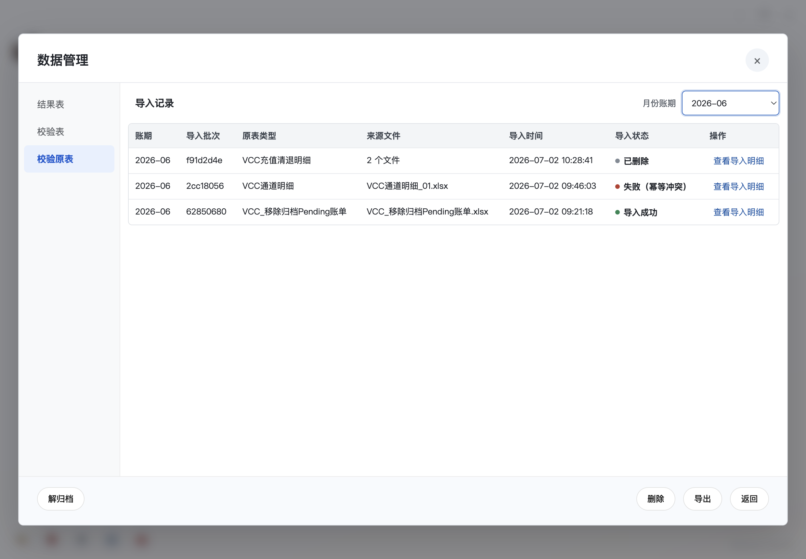
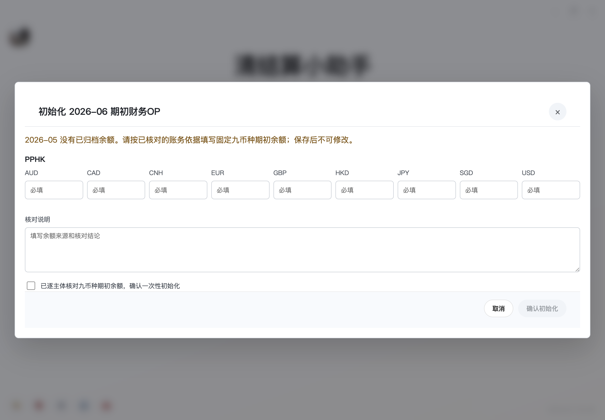
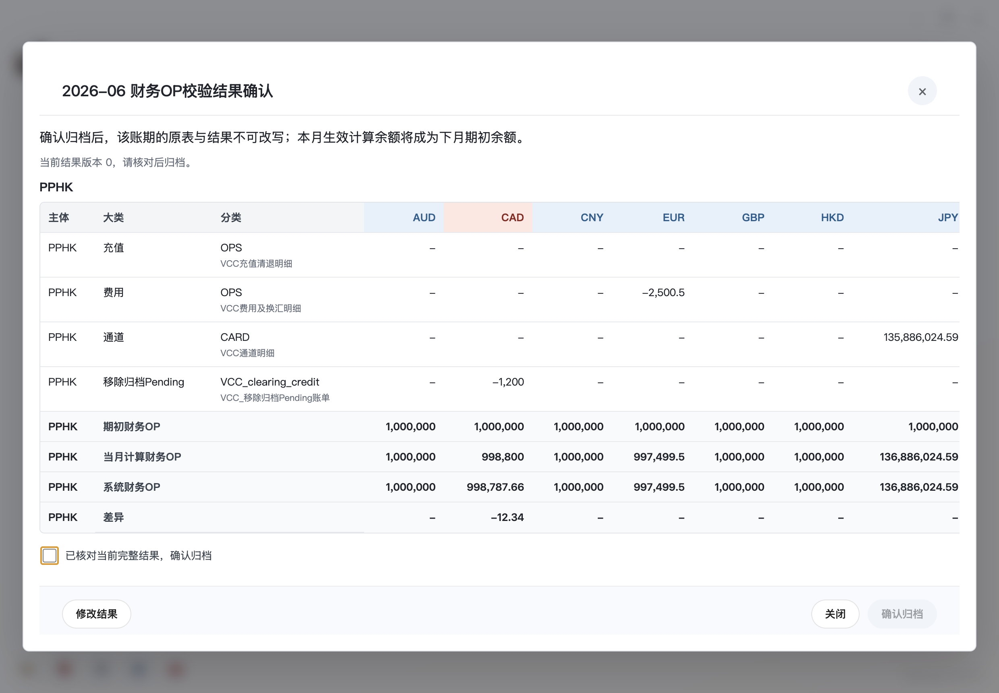
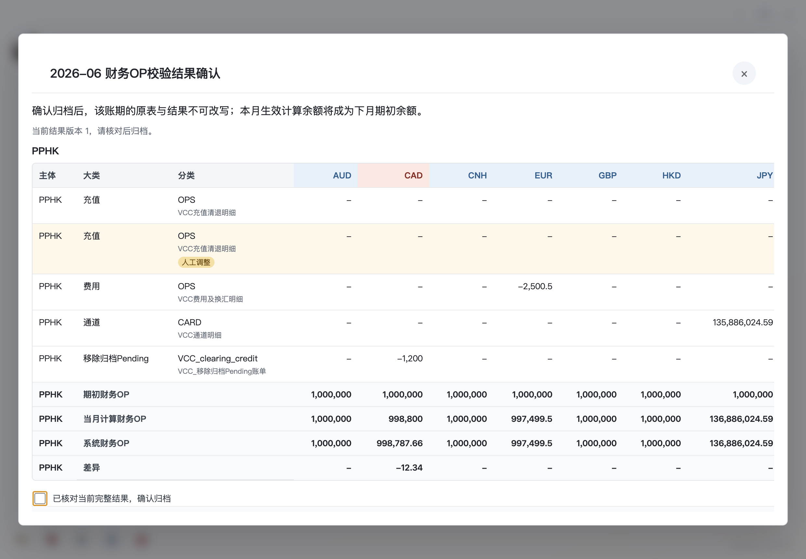
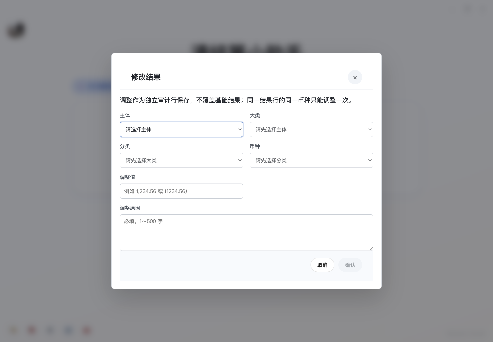
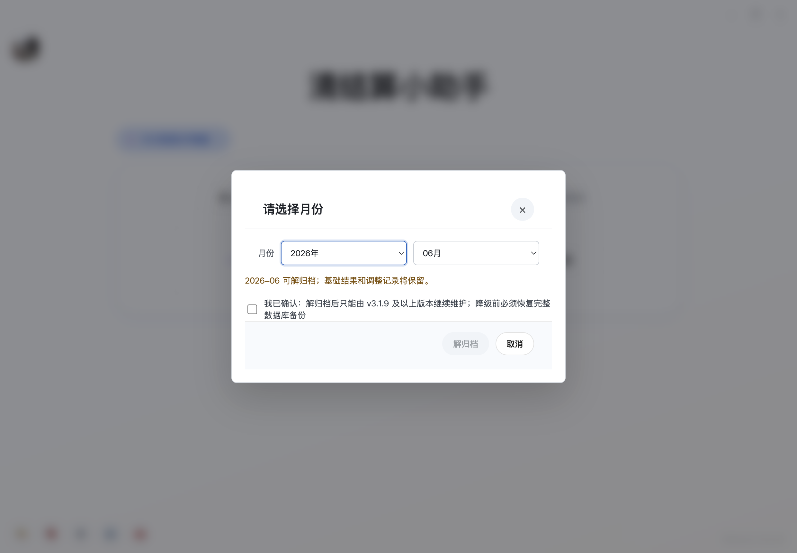
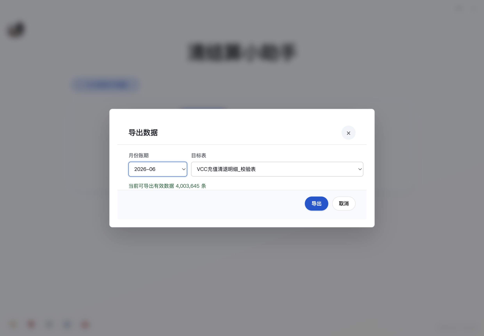

# 清结算小助手使用手册

版本：`v3.2.6`

> v3.2.6：银行对账单赋值自身支持“等于 / 包含”；提取大账号顺序时，明确识别出未维护账号会提示来源，确认后结束本次整批导入。首次使用请用脱敏样本核对匹配和账号归属。

> v3.2.5 历史版本说明：v3.2.5 已由发布负责人授权在 v3.2.4 完成正式技术发布后，经受保护 PR、唯一 annotated tag 与 Windows Release workflow 串行发布。Pending、BizOP、PreFund、Position、VCC Financial OP 与 Acquiring 的剩余只读导出，以及 Pending/BizOP/Acquiring/Position 的成熟执行器 adapter，已经纳入统一资源、receipt、取消与恢复审计；Action Manifest 覆盖 54 个 action。application effective production strategy 对全部 action 仍保持 legacy/0，production 继续关闭，日常用户入口、金额/币种和 Excel/Workbook 结果保持既有行为。

> v3.2.5 历史验收说明：该版本不会自动解除 Recovery Hold，也不会在 unknown、partial 或 committed-result-lost 状态下自动重跑。冻结 R3.2.5 evidence 中 Windows packaged 仍为 `NOT_RUN`，真实业务样本及资金/恢复仍为 `PENDING_HUMAN_REVIEW`，Excel/WPS、RSS 与稳定观察窗口也保持历史未执行状态；发布负责人已另行确认本次资金、恢复、真实业务样本及稳定窗口人工验收通过，但该签字不改写冻结快照，也不启用 production。最终 Windows Release 资产、SmartScreen、离线覆盖和在线更新仍按 Issue #220 发布后复核。遇到新的恢复要求时应先核对持久 intent、receipt、journal、Hold 与真实输出。

> 网银账单修复：模板管理中的重命名不再因空的任务 evidence 提前失败；人工补录上一账单日余额时，`0` 是合法余额。补录提交失败会显示错误并保留已填日期和余额，重新确认前不会重复提交；若原账单源文件已经不可用，软件会要求重新导入后再补录。


> v3.2.7 开发预告：业务 OP 新区间功能正在分 PR 交付，当前尚未启用。正式开放后可一次导入多个文件、选择起止日期核对、查看缺失输入、保留历史版本并导出全量或差异结果。删除前会展示关联结果和原件影响，选择保留结果或同时删除关联结果。当前安装版本和日常旧入口不因这些开发提交自动切换。
>
> 后续正式启用时，只清理设计中明确列出的旧业务 OP 明细和专属月度侧库；历史存档、原件、用户锁、其他模块与外部文件保留。中途失败会保持恢复保护并继续同一次迁移。激活后降回旧程序不会恢复旧业务数据，须按明确备份和人工流程处理；不要手工删除恢复记录来跳过保护。

---

## v3.2.6 操作更新

### 银行对账单赋值自身：选择对账方式

在【资金对账数据处理 → 场景管理 → 银行对账单赋值自身】中，每条对账字段可单选“等于”或“包含”，新增行与旧场景默认“等于”。“等于”保留原有比较方式；“包含”表示**左侧字段值包含右侧字段值**，两侧去除首尾空白后比较，区分大小写，任一侧为空不命中，数值 `0` 可以参与匹配。多条对账字段须全部满足。

每条条件按自己选择的左右账单类型取值。例如第一条选择“类型 1 的币种等于类型 2 的币种”，第二条仍可选择“类型 2 的附言包含类型 1 的附言”；第二条按类型 2 包含类型 1 执行，不受第一条方向影响。

只有配对双方都各自唯一时才会赋值并锁定。某行能匹配多行，或被多行匹配时，会报告对应歧义；交叉关系中的候选也会完整计入检查。相关配对不赋值、不锁定，其他独立合法配对继续处理。已有“等于”条件若使用反向类型且两端字段名不同，本版会修正取值来源，命中结果可能改变，请纳入验收核对。

例如：左侧 `ABC123`、右侧 `123`，选择“包含”可以命中；交换左右后不命中。保存、编辑、复制、确认详情和场景导入导出都会保留选择。使用“包含”后如需降回旧版，先停用相关场景或改回“等于”。

### 网银账单：未维护大账号的提醒

导入 `MerchantId=自己输入` 的模板文件后，在大账号选择窗口点击【提取大账号顺序】，软件检查整批文件中明确识别出的所有账号，含已手动绑定、未参与提取以及保留的空交易分段。若有账号未维护，提醒会列出账号原值、文件和分段位置；长列表可滚动查看。

定位行优先指向该账号分段的表头。即使首段、中间段或末尾分段没有交易，也可以按本段表头查找；没有表头位置信息时才使用预览行号。

点击提醒里的【确认】会关闭大账号选择并结束**本次整批导入**，本批不生成明细和余额，也不保存本批账号顺序；以前成功导入的批次及结果保留。请先补充维护账号，再重新导入文件。取消失败时点击【重试取消】。

完全提取不到账号时，可以确认提示后返回手动选择；账号已维护但存在多个币种时，继续按原提示选择币种。提取和完成请求处理中，请等待结果后再操作。

## 一、模块

1. 生成网银账单
2. 新开银行账户生成余额账单
3. 月度Pending数据核对（`v2.0.0` 新增；`v2.1.13` 把这个功能的名字从「月度 Pending 数据核对」改成「月度Pending数据核对」）
4. 资金对账数据处理（`v2.0.0-beta.3` 新增）。此后多个版本陆续完善，主要变化（按用户能看到的为准）：
   - 这个功能原来叫「银行对账单处理」，后来改名为「资金对账数据处理」；主面板改成三行布局，新增「链接表管理」入口和「导入不平表」按钮，功能不变。本节正文及历史更新记录里出现的旧名「银行对账单处理」指的是同一个功能。
   - 网关对账数据改为从导入的 `assets/网关对账单.xlsx`（网关对账单文件）读取表头列（⚠️ 这是破坏性改动：以前配过的相关场景需要重新配置一次）；对账对上之后如有差额，会写到 `Extra Fee` 列并标黄；场景管理弹窗里新增「网关对账单修复」入口。
   - 导入对账单改成可以一次选多个文件批量导入（自动按表头识别、多个银行对账单合并对账）；「链接表管理」里导入的数据会持久保存；软件自带的写死场景可以填优先级。
   - 新增多步骤的自动对账主流程：先把对账ID 一一配对、再走渠道分配规则、补齐缺口、核对资金性质，最后处理中台订单数据（自动回填对账ID、并剔除中台加款单里的脏数据），同时导出一份中台加款单剔除文件；场景管理的「功能类别」按业务分组展示。⚠️ 涉及资金，使用时务必用真实数据核对结果。
   - 「链接表管理」新增第 5 个数据表库「银行对账单入金表」（模板取 `银行对账单.xlsx`，存 C~N 列加资金性质共 13 列，复用现有「导入」按钮）；导入银行对账单后软件会在后台整理出渠道、渠道-地区的清单，供后续 JPM 渠道的退款回填使用。
   - 运行后的状态框会在每条前面标出「渠道-地区」；取消了导入明细的确认框（失败/跳过的提示并入状态框）；网关相关提醒改为指向「链接表管理」里保存的网关对账单，避免悄悄漏对账。链接表支持导入大文件（65.7 万行 / 147MB 的渠道账单不再误报「文件为空或不可读」）。
   - 网关对账单导入改为「按对账单业务编号跨次累加」（一次选多个文件不再互相覆盖丢数据）；「链接表管理」新增《删除》按钮（按数据日期范围删除）；导入完成提示会显示「覆盖 N 条 / 拒入 M 条」；ADM 渠道没有可处理数据时不再误弹「已创建」。
   - 运行后状态框的「命中场景」改成按渠道分行显示——以前只写「场景 1、3」，多个渠道时看不出是哪个渠道的；现在写成 `JPM:1、3` / `CITI:2` 一个渠道一行（同一个场景在两个渠道都命中都会显示，不再被吞掉）；状态框内容多时不再被撑大，改成框内滚动。
5. 对账单 ReconID 修复（`v2.1.0-beta.1` 新增单据对账单玩法 / `v2.1.0-beta.3` 扩展网关对账单玩法 / `v2.1.5` 模块名加空格 / `v2.1.13` 场景管理去掉渠道这一层 + 新增「复制场景」 / **`v3.0.2` 这个功能显示名改为「对账单修复」**——去掉「ReconID」字样，两个场景类别的名字改成「单据对账修复」/「网关对账单修复」；软件内部标识和使用统计都不变，只是用户看到的文字变了。本节正文仍沿用旧名「对账单 ReconID 修复」指同一功能）
6. 月度银行对账单BU回填校验（`v2.1.2` 新增）
7. 业务OP数据核对（`v2.1.3` 新增；`v2.1.12` 导入支持上百万行的大文件，处理更快、结果不变；`v3.0.2`「导入流水表」改成可批量多选导入：先选日期 → 一次选多个流水表 → 合并进该日期（多个文件合起来就是这一天的完整流水，⚠️ 同一天多次导入不会互相覆盖，任何一行出错整批都不导入），只选一个文件时行为不变；同版本撤掉了 v3.0.1 给本功能左列加的整体右移）
8. 收单单据币种校验（`v2.1.6` 新增；`v2.1.12` 导入和对账速度提升，结果不变；`v2.1.15` 导出差异文件更快，50 万条差异从约 61.6 秒降到 5.2 秒（约快 11.9 倍），导出内容完全一致；`v3.0.3` **导入更快 + 导入期间界面不卡 + 一次多选大文件**：流水表导入更快（50 万行约快 6 倍）、对账统计约快 5 倍，导入期间整个界面不再卡顿（处理都放到后台），一次选多个大文件时会同时处理（约快 3 倍）；导入出来的数据与旧版**完全一致**，结果不变）
9. VCC业务OP计算（`v2.1.12` 新增）
10. 前置资金对账（`v3.0.14` 新增；本版只支持「缺网关账单」）
11. 重复入金匹配（`v3.0.15` 新增）
12. 平盘对账数据处理（`v3.0.24` 新增；`v3.1.0` 开放第一期“平盘资金性质校验”；`v3.1.5` 支持调拨/测试付款异常行自动过滤和导出）
13. VCC财务OP校验（`v3.1.6` 新增）

> **v3.0.25 设置与存档调整**：设置页底部统一为“确认”；存档默认保留 60 天，可选 30、60、90、180、365 天或永久。网银模板“不存档”已移除，旧排除配置升级后全部失效，后续网银账单和月度余额均按正常规则存档。

> **v3.1.1 方向与日期防误匹配**：资金对账的 R3.5、R4、R5 调拨候选现在会先核对银行真实借贷方向，账号、币种、金额等关键值不能为空；调拨日期统一由“调拨回填功能管理”设置同日优先和 `±N` 天。另修复了合法 generation 0 bootstrap 下、十张相关表全空的旧平盘侧库被误阻断的问题。工具箱格式保真不在本版。

> **v3.1.2 工具箱格式保真**：🧰“合并表格 / 拆分表格”现在会保留来源 Excel 的日期/数字/文本格式、字体、填充、边框、对齐、行高和列宽；长账号、长订单号和前导零值不会变成科学计数法或近似数。`.xlsx`、标准 `.xls`、CSV 均进入同一处理链路；本版 Windows Excel/WPS 人工发布验收已确认通过，详见 §1.11.7。

> **v3.1.3 平盘百万级导入**：「平盘对账数据处理」的银行对账单和五类链接原始表改为后台流式导入，并支持大批量数据的管理、删除和调拨链接重建。导入弹窗会显示扫描、接受和提交进度，可在提交前取消；本版不承诺百万级资金性质校验运行或单文件 Excel 导出。

> **v3.1.5 平盘异常行过滤**：中台调拨单和测试付款单中的两类明确无效证据行会自动过滤，正常行继续落库；导入完成可立即导出异常报告，之后也可在存档中心下载。资金校验结果确认页始终显示“过滤数据导出”，无过滤数据时按钮置灰。付款成功调拨缺金额/币种仍会整文件拒绝。

> **v3.1.6 VCC财务OP校验与平盘修复**：导入三类 VCC 单据、移除归档 Pending 和系统财务 OP 后，软件按主体与九币种计算发生额、比较系统余额并归档。四类明细用业务键防重复导入；首次没有上月归档时必须人工初始化期初，归档后不允许补数、撤销或重算。同版修复平盘普通链接原始表预检完成后可能提示存档清单数量不一致的问题；失败发生在业务数据写入前，升级后可重新导入。

> **v3.1.7 Payment 与 R5s2 调拨回填**：开启 Payment 后，软件强制使用中台调拨派生表并固定 Payment 先运行、R5s2-recon 后运行；两个引擎共享派生行使用状态和银行消费集合。Payment 新增“付款账户（卡号）= Drawee CardNo”必选条件，并按连续 ISO 订单周边界选择银行行。

> **v3.1.9 全局批次与存档中心正式发布**：实际处理、写入、导出和删除任务统一使用跨模块连续的 `YYYY-MM-DD-NNN` 批次号；失败和取消也保留号码，关联任务可跨重启查看。VCC财务OP校验和工具箱已真实接入存档，运行文件按年/月/日/批次目录展示，并支持存储位置迁移、修复、保留期清理和新的统计/列表/设置界面。VCC 大库信息改为后台读取，标准 v3.1.7 旧归档可以受控查看、导出和解归档；VCC 人民币代码统一为 CNY，异常明细/异常主体快照会被过滤而正常数据继续落库。v3.1.9 已于 2026-08-13 正式发布，仍待人工验证的环境与资金边界见 §1.11.9。

> **v3.1.10 VCC 存储瘦身正式发布**：v3.1.10 已于 2026-08-17 正式发布。有效数据只保留计算、校验、幂等和最小血缘字段；原始输入由存档 artifact 保存，只有真正异常进入紧凑审计。数据管理改为六列【导出明细】，校验原表按当前有效行从已验证原件重建；历史血缘缺口可明确标记后部分导出，实体损坏则整次停止。【优化存储】通过维护模式 copy-on-write 重建数据库。三项发布门禁已明确确认 PASS，正式 tag、Release 与四项公开资产已完成回读。

> **v3.2.4 ReconFix / VCC Financial OP 后台执行基础**：对账单修复的导入状态和运行结果由长驻 Service 单一持有；普通/BOC 只读运行和 JPM 写回分别受 source/revision、Critical Intent、同事务 receipt、Inspector 与 Recovery Hold 保护，多份结果经 Main 深度回读后由唯一 Publisher 整批发布。VCC 财务 OP 单主体/全主体输出使用冻结 authority、主体查询下推和最多两个只读 Writer，所有 Writer 完成后仍只发布一次。金额、币种、方向、匹配、Workbook、样式和行序不变，production enablement 仍关闭。Issue #220 已授权正式技术发布，发布负责人确认本次资金、恢复、真实样本及稳定窗口人工验收通过；最终 Windows Release 资产、SmartScreen、离线覆盖与在线更新仍按发布后计划逐项复核，遇到恢复要求不得自行重复执行。

> **v3.2.3 Statement / NewAccount 后台执行基础**：Statement 大状态由长驻 Service 单一持有，大账号和手工余额 continuation 使用有界单次 token；current/all 生成只读 staging 并由唯一 Publisher 发布，manual balance seed 受 durable receipt/inspector/Recovery Hold 保护。NewAccount 生成使用 one-shot Worker，另存为在校验来源、目标和父目录 identity 后经 durable Publisher 提交。四金额模式、借贷方向、币种、余额、Workbook、日期、账户和命名不变，production enablement 仍关闭。Issue #220 已授权正式技术发布，发布负责人确认本次资金、恢复、真实样本及稳定窗口人工验收通过；最终 Windows Release 资产、SmartScreen、离线覆盖与在线更新仍按发布后计划逐项复核，遇到恢复要求不得自行重复执行。

> **v3.2.2 FundRecon / Duplicate / BankBU 后台执行基础**：资金对账、重复入金匹配和月度银行对账单 BU 回填校验已具备受资源治理的 Service/Worker、operation receipt、inspector 与 Recovery Hold capability；同版修复模板重命名的空 evidence 错误，以及内存账单会话人工余额补录的空 FilePlan、余额 `0` 和提交失败无反馈问题。业务顺序、金额/币种、Excel/Workbook 与既有覆盖确认保持不变，production enablement 仍关闭。发布负责人确认本次资金、恢复、真实样本及稳定窗口人工验收通过；v3.2.2 已通过 PR #225、annotated tag 与 Windows Release workflow 完成正式技术发布，四项公开资产及更新元数据已独立回读一致；Issue #220 中 Windows Release 资产实机、SmartScreen、离线覆盖与在线更新仍按发布后计划逐项复核，遇到恢复要求不得自行重复执行。

> **v3.2.1 Toolbox / PreFund 受控后台执行**：Toolbox 可用受管 one-shot Worker 准备拆分输出，正式文件仍由单一 Writer/FIFO Publisher 收口，第二 Writer gate 已明确拒绝；PreFund MPT 可先生成任务私有 spool，再由单一有序 DB Writer 按文件顺序处理，普通 import 具备受限 parser pool capability，repair 仍为 exact-one。金额、币种、文件顺序和 Excel/Workbook 结果不变，production enablement 仍关闭。发布负责人确认本次资金、恢复、真实样本及稳定窗口人工验收通过；v3.2.1 已通过 PR #223、safe forward-fix PR #224、annotated tag 与 Windows Release workflow 完成正式技术发布，四项公开资产及更新元数据已独立回读一致；Issue #220 中 Windows Release 资产实机、SmartScreen、离线覆盖与在线更新仍按发布后计划逐项复核。

> **v3.2.0 公共后台执行底座与 VCC OP Pipeline**：系统已具备受资源治理的 Supervisor、冻结消息/context、operation receipt、inspector、Recovery Hold 与 artifact authority capability；VCC 财务 OP 多文件读取可并行准备 spool，但月份归约、金额/币种处理、单一 writer、事务、Excel/Workbook 结果和正式文件发布仍按既有顺序收口。v3.2.0 已通过受保护 PR、annotated tag 与 Windows Release workflow 完成正式技术发布，发布负责人确认资金、恢复、真实样本及稳定窗口人工验收通过，四项公开资产及更新元数据已独立回读一致；production enablement 继续关闭，Issue #220 中 Windows 10/11、SmartScreen、离线覆盖和在线更新 canary 仍按发布后计划逐项复核，遇到不确定结果不得自行重复执行。

> **v3.1.14 VCC 财务 OP 大批量导入修复**：导入 VCC 充值清退、费用换汇、通道或移除归档 Pending 明细时，工作簿读取阶段继续显示“正在导入”；该类明细全部文件读取并校验完成后，状态框会切换为“正在校验并写入”，不再停留在最后一条读取行数。充值清退和 Pending 同批时会分别显示自己的阶段。点击取消后，状态框保持“正在取消导入并回滚本次未完成数据…”，不会被晚到进度覆盖。金额、币种、幂等、异常和最终结果口径均未改变。v3.1.14 已于 2026-08-21 通过 Windows Release workflow 完成正式技术发布，Setup、portable、blockmap 与 `latest.yml` 四项公开资产已独立回读；Windows packaged VCC、Windows 10/11 Setup/portable、SmartScreen、`v3.1.13 -> v3.1.14` 离线覆盖及 `production/latest` canary 仍为 `MANUAL / NOT RUN`，技术 Release 完成不是人工 PASS。

> **v3.1.13 工具箱、存档中心与状态框调整**：🧰工具箱在“合并表格 / 拆分表格”左侧新增状态框，显示等待、运行、完成、失败或取消；运行期间右上角关闭按钮会隐藏，两枚【导入文件】也会暂时禁用。多文件拆分遇到同名目标文件时，确认框改为【返回 / 覆盖全部】；返回不会创建或覆盖文件。存档中心的日期默认留空并直接展示全部日期的可见批次，设置齿轮移到“存档中心”标题右侧；设置页【变更】紧邻“存档位置”，并移除“存储统计”、文件总大小、运行次数和最新批次。后台维护不再向顶部提示栏显示过程或结果文本。平盘对账数据处理和对账单修复首次成功加载时状态框保持“欢迎使用小助手”，真实 session 与按钮仍会同步，读取失败仍显示错误。所有状态框的星星 SVG 同步移除，只保留状态文字。v3.1.13 已于 2026-08-21 完成正式技术发布并正式发布为 latest stable Release，Setup、portable、blockmap 与 `latest.yml` 四项资产已完成无凭据回读；Windows 原生确认框、packaged 长任务、安装升级和在线 canary 仍未人工验证，不能把技术 Release 表述为这些项目已通过。

> **v3.1.12 网银源文件、启动、VCC 币种与存档中心**：网银账单在真正生成前只核对一次用户确认期间的源文件身份，文件变化会要求重新选择；软件完成数据库与必要恢复后才显示主窗口，并移除每次启动的全库 `ANALYZE`。VCC 财务 OP 的新导入接受标准大写 CNH，并在计算、幂等和输出中统一为 CNY，历史数据不改。该版本当时的存档设置第一行左侧显示“存档位置”、右侧显示【变更】，完整路径移到下一行；变更位置会完整迁移已有存档。每次启动首次进入存档中心后再后台分页维护。本版已于 2026-08-20 正式发布为 latest stable Release，四项 Windows 资产已公开；v3.1.13 已再次调整按钮相邻位置。

> **v3.1.11 存档中心与 VCC v1 收口正式发布**：v3.1.11 已于 2026-08-19 正式发布。存档中心只显示至少有一项真实文件证据的批次；纯计算、确认、调整、归档、解归档、删除和配置保存不再生成空卡片，也不占用批次号。关联任务继续使用平铺列表，只展示直接相关的有文件批次。VCC 数据管理移除【优化存储】；全新安装和没有 VCC 业务数据的旧空 v1 会无感得到 v2，非空 v1 在写入前停止且不自动迁移或清空。导入记录不再显示存档状态小字，并移除【标记已处理】。当前机器的既有非空 v1 已完成一次性受控维护，JSON 审计报告保留；旧备份在复验后按用户再次明确授权永久删除，不会成为所有用户的启动清空逻辑。发布负责人已确认本版真实数据库/UI、文件与资金血缘及 Windows 10/11 Setup、portable、SmartScreen 发布前门禁全部 PASS，未使用豁免；PR #150、annotated tag、latest stable Release 与四项公开资产已完成回读。

> **v3.1.8 VCC财务OP校验正式发布**：Pending 新导入改为 46 列正式模板，系统财务OP优先使用 Excel 原始数值，运行前强制核验五张必需表。结果页新增完整明细、一次性人工调整、尾月解归档、首月期初/未归档结果删除和历史归档月份导出。结果必须使用内置结果模板，模板不一致时会明确失败，不回退到旧样式。六项人工发布门禁已确认通过，v3.1.8 已于 2026-08-09 正式发布。自动化与技术 Release 不替代真实月份、主体和九币种的财务人工核对。

> **v3.1.0 平盘资金性质校验**：「平盘对账数据处理」第一期已开放银行数据、五类链接数据、十组 FundType 校验、差异导出、49 列结果回导和确认；其它两个平盘功能仍未开放。Payment 多账号规则继续沿用 v3.0.24 的严格账号隔离。

> **v3.0.22 存档中心历史入口**：该版本最初支持按日期、模块和批次查看当时 12 个模块的输入/结果文件，并提供文件去重和失败重试。v3.1.9 已升级为 13 个主模块加工具箱的全局任务批次中心，VCC财务OP校验和工具箱也会按真实任务存档；当前操作方式见 §1.11.9。

> **v3.0.23 C3 与资金性质校验**：C3 在加载网关候选时不再区分 Channel 的英文大小写；Ach Return、Wire Return、HX-out、HX-in 则改为账号、币种、对账 ID、金额和方向完整一致后的严格 1:1。详见下文“⭐ v3.0.23”。

> **v3.0.21 资金校验修复**：中台退款订单回填现在只会被 R1 实际配对且 `TradeType=AchReturn` 的网关行拦截，不再因同对账 ID 下存在 `Inbound-VA` 等无关网关行而漏回填；DBS-Charge 步骤2只读取 12 类明确网关 TradeType，并在银行 `Credit Amount` 非零时停止步骤2改写、把方向异常写入错误报告。升级后请用真实退款和 DBS 样本逐笔复核。

> **v3.0.20 主页面显示修复**：除「新开银行账户生成余额账单」外，上述主模块状态框里的星形图标会与整段状态文字垂直居中；“模式 / BU / 对账场景 / 账单类别 / 场景”标签也会与对应下拉框垂直居中。按钮位置、控件宽度、操作流程和导出结果均未改变。

> **v2.1.4 起**：左上角模块切换菜单默认只展示 3 个高频模块（网银账单生成 / 资金对账数据处理 / 对账单修复），其他模块包括「前置资金对账」「重复入金匹配」默认收起，需通过主页面右下角 🔄「小助手功能收纳」启用。详见 §1.10。

---

## 1.1 生成网银账单

### 1.1.1 导入文件的文件类型和导入方式

- 支持 `xlsx` / `xls` / `csv` 类型文件导入；
- 支持多个文件一起导入。

### 1.1.2 主要功能

1. 把各银行 / 渠道的原始网银明细账单的各列，对应到清结算系统的通用列（即统一的标准账单列，下文称 COMMON 类型），并导出成统一格式的明细账单；
2. 支持根据发生额自动计算余额，导出余额账单；
3. 支持对方账号 / 户名按发生额的收付方向自动分配到 Payee / Drawee；
4. 支持将一笔原始账单按不同币种或金额列拆分成多笔明细账单，并可按规则再合并输出（`v1.4.9` 新增）；
5. 支持模板的导入 / 导出，方便跨人交接与模板共享；
6. 支持多文件批量导入和全部未命中文件的聚合告警；
7. 支持主/子模板关系，同一银行 / 渠道的多套字段规则可以按主模板分组管理（`v1.5.1` 新增）；
8. 支持账户映射按模板隔离，同一银行账号在不同模板下可配置不同的系统账号（`v1.5.1` 新增）；
9. 支持文件重复导入按路径 / 文件名 / 内容三维度判重，防止同一份账单被重复生成（`v1.5.1` 新增）；
10. 支持「按表头自动识别模板」默认导入模式：用户无需手动切换具体模板，系统会按表头自动匹配唯一模板后输出（`v1.5.2` 新增）；
11. 导入模板文件时自动校验表头唯一性，防止完全相同的表头出现在多个模板中（`v1.5.2` 新增）；
12. 多个文件匹配到不同模板时自动合并导出汇总文件（`v1.5.2` 新增）；
13. 大账号确认页支持「单个账号匹多个文件（多个文件对一个账号）」：多个文件（或同一文件里的多段数据）可共用同一个大账号，避免重复勾选（`v1.5.2` 新增）；
14. 子模板保存前自动检查「子模板名里要包含主模板名」，防止把子模板错挂到主模板下（`v1.5.2` 新增）；
15. 主页面「模板」下拉改为「模式」下拉：`制作网银账单`（保留 v1.5.2 行为）/ `导出月度余额账单`（`v1.5.3` 新增），两种模式互不影响；
16. 新增「导出月度余额账单」模式，按模板、按月份直接用软件本地保存的余额数据拼出并导出月度余额 Excel，不用再重新导入账单文件（`v1.5.3` 新增）；
17. 自有账号并入大账号表（用一个「账号性质」标记区分客资/自有），软件启动时会自动把以前单独存放的自有账号数据并进来；自有账号**只在「导出月度余额账单」模式下参与**，其它场景会自动过滤掉（`v1.5.3` 新增）；
18. 导出 xlsx（明细 / 余额 / 月度余额 / 多模板合并 / 新开账户模块）的**第 1 行表头**字体统一改为 Courier New；数据区字体不变（`v1.5.3` 新增）；
19. 账单拆分合并算净额时强制保留 2 位小数四舍五入，修复像 `2377.49 + 178.31` 这种相加后多出一长串小数尾巴的问题（`v1.5.3` 新增）。

### 1.1.3 工作流

> 制作模板 → 修改模板 → 使用模板 → 导入文件 → 输出明细 / 余额账单

#### 1️⃣ 制作模板

1. 将网银原始明细账单里带有与交易有关的字段复制到第 1 行，行首字段复制到表格 `A1` 单元格；
2. 另存为后，将文件名修改成以下格式：

   `<清结算系统里的银行 / 渠道名 + "-" + 清结算系统里的开户地 + "-" + 其他>`

   如要建一个 METACOMP 银行新加坡分行的模板，模板名称应设为 `METACOMP-SG.xlsx`；

   如果中国银行美国分行的 NRA 账户和 OSA 账户里的字段不一样，需要建两个模板，名称应设为 `METACOMP-SG-OSA….xlsx` 和 `METACOMP-SG-NRA….xlsx`。

> *其他：同一银行 / 渠道存在多个模板时，自己用来区分不同模板的文字内容。*
>
> *例如：同一银行 / 渠道，不同公司主体及不同账户类型（NRA、FTN、OSA）的账户导出的网银明细账单字段可能不同。*

#### 2️⃣ 修改模板

1. **目的**：把网银原始明细账单里的各列，和 COMMON 类型（统一标准账单）的各列对应起来。
2. **操作方式**：模板管理 → 在模板名称列找到对应模板 → 点击最右侧执行操作列的 `修改` 按钮 → 进入对应模板的映射关系管理。
3. **两列的含义**：
   1. **模板字段**：这一列列出的是 COMMON 类型（统一标准账单）的各个列名，供选择；
   2. **映射字段**：这一列列出的是当前模板原始账单的各个列名，供选择。

   其中模板字段 `Balance` 的设置会影响余额账单的导出。

   4. 当主页面下拉选中「按文件名映射模板」并导入文件时，软件会逐个比对所有模板，按表头自动找出唯一匹配的那个模板再处理（`v1.5.2` 新增，用户不用在映射管理里额外配置）。

4. **例子**：

   网银账单里的账单日期为 `26-03-01`，

   将模板字段 `BillDate` 的映射字段选择为 `账单日期`，

   导出的明细账单里的 `BillDate` 即为 `26-03-01`。

#### 3️⃣ 使用模板

- `v1.5.2` 起：导入网银文件前只要保持默认的「按文件名映射模板」即可，软件会按表头自动找出唯一匹配的模板再处理。
- `v1.5.3` 起：主页面顶栏「模板」下拉已改为「模式」下拉，值域为两条——
  - `制作网银账单`（默认选中）：按 v1.5.2 的「表头自动识别模板」方式处理，现有功能不变；
  - `导出月度余额账单`：专用于用软件本地保存的余额数据拼出月度余额账单，不需要导入账单文件。详见 Q&A「20) 导出月度余额账单（`v1.5.3` 新增）」。

#### 4️⃣ 导入文件

可选择一个或多个网银原始明细账单一起导入。

v3.1.12 起，从选择文件到点击最终生成期间不要移动、替换或继续保存原文件。软件会在真正开始业务处理前用选择时的文件身份做一次变化核对；若文件缺失或已变化，会提示“网银明细源文件在确认期间已变化，请重新选择”，且不会生成结果或提交本次成功状态。文件实际读取期间仍会检查内容是否保持稳定。

#### 5️⃣ 输出明细 / 余额账单

第一次导入账单时，如果最早的交易日存在两笔及以上的交易，则需要输入初始余额进行余额校验。

### 1.1.4 相关功能 Q&A

#### 1) 余额

**Q：** 网银明细账单里没有余额值，但想导出余额账单。

**A：** 模板字段找到 `Balance`，对应的映射字段选 `通过发生额计算`。

#### 2) 账单日期

**Q：** 账单日期是由多个字段拼接而成的，该怎么操作？

**A：** 模板字段找到 `BillDate`，对应的映射字段选 `需要拼接字段`。其他字段（除了 `MerchantId` 和 `Currency`）也可以做拼接。

#### 3) 账户号

**Q：** 账户号在模板字段没有，在模板字段的上方单独显示，该怎么设置？

**A：** 模板字段找到 `MerchantId`，对应的映射字段选 `自己输入`。点击出现的 `维护大账号` 按钮，进入维护大账号页面。先根据模板的银行地区信息，在清结算系统 - 资金管理 - 账户管理页面里搜索，搜索出相关信息后点击 `导出` 按钮，得到银行账户信息分页文件。回到维护大账号页面，点击左下角 `导入银行账号信息` 按钮，选择刚才下载的银行账户信息分页文件，点击导入。完成操作后点击右下角 `完成`。全部映射字段设置完成后，导入网银明细账单文件，再选择对应大账号进行导出账单操作。

**Q：** 网银账单里的账户号与清结算系统里对应账号的银行账号不一样，想导出的账单和清结算系统的账号信息保持一致，该怎么操作？

**A：** 在网银账单生成页面，点击模板下拉框下方的 `账户映射`，输入相关信息后点击 `完成` 即可。

#### 4) 币种

**Q：** 网银账单有账户号字段，但没有币种字段，该怎么设置？

**A：** 目前仅支持单币种账号的账单导出。需做以下操作：

1. 在模板管理里找到对应模板，点击 `修改` 进入映射关系管理，在模板字段里找到 `Currency`，将 `Currency` 对应的映射字段留空；
2. 在网银账单生成页面，点击模板下拉框下方的 `账户映射`，网银大账号 ID 和清结算系统大账号 ID 输入相同的账户号，勾选 `有账户号无币种` 框，输入相应币种后点击右下角 `完成` 即可。

#### 5) 发生额

**Q：** 发生额在一个字段里，并存在正负号（正数为收，负数为支）。

**A：** 映射关系管理页面拉到最下方，在 `映射关系设置 - 按正负号拆分的发生额` 旁边的下拉框里选择对应发生额的字段。

**Q：** 发生额是按某个字段的值（借 / 贷、Sell / Buy 等）做方向区分。

**A：** 映射关系管理页面拉到最下方，在 `映射关系设置 - 按字段区分发生额` 旁边的下拉框里选择 `是`，然后点击旁边的 `发生额映射关系管理` 按钮，按提示配置两行规则——每行是「看哪一列、那一列等于什么值 → 就填到哪一列」（一行对应 `Credit Amount`，一行对应 `Debit Amount`）。配置完成后点击 `完成` 即可。

#### 6) 对方账号 / 户名场景

**Q：** 网银账单里存在「对方账号」和「对方户名」两个字段，希望导出时根据发生额的收付方向，自动分配到 Payee 或 Drawee 一侧，该怎么操作？

**A：** 映射关系管理页面拉到最下方，在 `映射关系设置 - 根据发生额做映射的户名 / 账户号` 旁边的下拉框里选择对方户名 / 账号，并在模板字段 `Payee Name` / `CardNo` 和 `Drawee Name` / `CardNo` 里选择对方户名 / 账号。设置该映射后，导出的明细账单里会根据账单的发生额方向，自动将网银账单里对方账号和对方户名的值填入 `Payee Name` / `CardNo` 或 `Drawee Name` / `CardNo` 中。

#### 7) 模板交接

**Q：** 有银行渠道需要交接出去，对方想要对应的模板。

**A：** 点击 `模板管理`，然后点击页面右下角的 `导出模板文件` 按钮，把导出的模板文件发给对方。对方点击 `模板管理` 右下角的 `导入模板文件`，选择这个模板文件导入即可。

#### 8) 拆分 / 合并账单（`v1.4.9` 新增）

**Q：** 一笔网银原始账单需要按不同币种或金额列拆分成多笔明细账单。

**A：** 在映射关系管理页面拉到最下方，将 `账单拆分合并管理 - 是否拆分 / 合并明细账单` 选为 `是`，右侧会出现 `拆分 / 合并账单映射关系管理` 按钮。点击该按钮进入弹框，按以下步骤配置：

1. `需要拆分成几份账单` 输入数字 N，点 `拆` 按钮生成 N 行；
2. 在下方六列表格中，逐行配置每一份拆分账单的 `Currency`、`Credit Amount`、`Debit Amount`、`发生额` 分别取原始文件的哪一列；
3. 每一行配置完成后点 `完成` 按钮锁定该行；
4. 如果需要再把其中几份账单合并成一条输出，勾选右上角的 `合并账单`，在出现的多选下拉中选择需要合并的账单序号，点 `完成`。合并后的行会按净值方向自动填入 `Credit` 或 `Debit`。

**Q：** 拆分后的账单，非金额列（如 `BillDate`、`Description`、对方户名等）需要用一套单独的对应关系，而不是沿用主模板，该怎么操作？

**A：** 在映射关系管理页面拉到最下方，将 `账单拆分合并管理 - 复用模块字段的映射关系` 选为 `否`，右侧会出现 `拆分 / 合并账单映射关系设置` 按钮。点击该按钮进入弹框，可为非金额列单独设置对应关系。若想从主模板复制一份作为起点，可点击右上角的 `导入当前映射关系` 按钮（`Currency` / `Credit Amount` / `Debit Amount` 这三列会被自动排除）。

#### 9) 发生额精度（`v1.5.0` 新增）

**Q：** 网银原始账单里的金额有很多位小数（如 `0.123456789012`），导出后小数被截断了。

**A：** `v1.5.0` 起，`Credit Amount`、`Debit Amount` 和发生额支持保留最多小数点后 12 位。原始值有几位就保留几位，不补零。余额账单里的余额也同步支持高精度输出。导出的 Excel 默认使用数字格式；当金额的有效数字超过 15 位时，会自动切换为文本格式以保证精度完整。

#### 10) 多账号账单排序检查（`v1.5.0` 新增）

**Q：** 导入多个账号的文件后，想快速确认大账号的排序是否正确。

**A：** 在 `网银账单解析大账号确认` 页面，点击左下角的 `提取大账号顺序` 按钮。系统会自动识别文件里的账户号，并在弹出的 `确认大账号顺序` 页面中展示提取结果。确认无误后点 `完成`，提取的排序会自动填入右侧的大账号顺序表。如果某些行提取不到大账号信息，会弹出提醒框告知具体是哪些行，点确认后可返回手动处理。

#### 11) 记住大账号排序（`v1.5.0` 新增）

**Q：** 每次导入同样的文件都要重新选择大账号排序，想让软件记住。

**A：** 在 `网银账单解析大账号确认` 页面，将 `多账号账单导入解析模式` 切换为 `账号顺序固定`，勾选左下角的 `记住顺序`，完成导入后排序会自动保存。下次导入相同结构的文件时（文件个数一致、各文件的账户个数和账户号匹配），系统会自动按保存的排序直接输出明细和余额账单，无需再手动确认。如果导入的文件个数与保存的不一致，会自动切换为 `账号顺序不固定` 模式供手动选择；如果文件个数一致但某些文件的账户信息对不上，会弹出提醒框告知哪些文件匹配不上，可选择 `变更配置` 重新设置或 `确认` 返回主页面。

#### 12) 指定账单实现功能（`v1.5.0` 新增）

**Q：** 拆分/合并账单弹框里配置了「按正负号拆分的发生额」或「按字段区分发生额」后，默认会对所有拆分行的 `Credit Amount` / `Debit Amount` 都按副区域规则计算。但实际只希望对其中一部分拆分行走副区域规则，另一部分仍然走行级 `Credit` / `Debit` 直接映射。

**A：** 在映射关系管理 → 拆分/合并账单映射关系管理弹框的副区域（`拆分/合并账单——发生额映射关系管理`）里，当「按正负号拆分的发生额」或「按字段区分发生额」有值时，会出现 `指定账单实现功能` 勾选框 + 多选账单序号下拉。勾选并指定需要使用副区域规则的账单序号后：被指定的行按副区域规则计算 `Credit` / `Debit`、该行的 `Credit` / `Debit` 下拉会被禁用；未指定的行则保留行级 `Credit` / `Debit` 直接映射可编辑。如果不勾选 `指定账单实现功能`，所有拆分行的 `Credit` / `Debit` 都会被禁用并统一走副区域规则。

#### 13) 使用手册导出（`v1.5.0` 新增；`v2.0.0` 简化为 HTML / TXT 两选）

**Q：** 想把使用手册导出成文档发给同事。

**A：** 点击页面底部的 `使用手册` 按钮 → `导出` → 在保存对话框选择格式：`html`（默认，浏览器可直接打开的网页，带排版）或 `txt`（纯文本）。`html` 格式会自动把 Markdown 渲染成带排版的 HTML 页面。`v2.0.0` 起去掉了 `md` 选项（避免分发原 Markdown 源文件）。

#### 14) 主/子模板（`v1.5.1` 新增）

**Q：** 同一个银行 / 渠道下有几套字段规则（例如同一银行不同账户类型），想把它们作为一组关联管理，但模板列表里只保留一个入口。

**A：** 先建一个主模板并在映射关系管理 dialog header 勾选 `设为主模板`；再建其他子模板，在同一位置勾选 `设为子模板` 并在新出现的主模板下拉框里选择对应的主模板。配置完成后：
- 子模板在模板管理页面归属到主模板下，主模板行前会出现 `▶ / ▼` 展开折叠按钮，点击可以展开 / 收起所有子模板，子模板缩进显示；
- 「制作网银账单」模式下，软件会按文件表头自动找出可能匹配的主 / 子模板；如果有多个子模板都可能匹配，会在选大账号那一步再确定具体用哪一套。

**Q：** 主模板和子模板互斥吗？

**A：** 是的。`设为主模板` 和 `设为子模板` 两个勾选框互斥，一个模板只能是其中一种状态，或者都不勾（作为独立模板）。

#### 15) 账户映射按模板隔离（`v1.5.1` 新增）

**Q：** 同一个银行账号在不同模板里需要配置成不同的系统账号，该怎么做？

**A：** `v1.5.1` 起，账户映射不再是所有模板共用一份，而是每个模板各存各的。在账户映射弹框左上角的模板下拉框里选择对应模板（下拉框会显示全部模板，包括子模板），然后为当前模板配置账号对应关系即可。不同模板下的对应关系互不影响。

**Q：** 从旧版本升级过来以后打开账户映射，弹出「迁移分配对话框」是什么意思？

**A：** 旧版本的账户映射是所有模板共用一份。升级到 `v1.5.1` 后如果本地有多个模板，软件需要把这份旧的共用映射分到每个模板下。弹出的「迁移分配对话框」会列出旧的映射记录，请按实际情况把每条记录分给需要的模板。分配过一次后，以后再打开账户映射就不会再提示了。

#### 16) 文件重复导入判定（`v1.5.1` 新增）

**Q：** 想避免同一份网银账单被重复生成明细。

**A：** `v1.5.1` 起，导入文件会按三个维度自动判定重复：
1. **路径**：相同的文件完整路径；
2. **文件名**：同名但路径不同；
3. **内容**：按文件内容判定（软件会对文件内容算出一个唯一指纹比对），即使重命名 / 移动位置也能识别出是同一份。

命中重复时会弹出对话框显示重复原因，提供两个选项：`覆盖旧记录`（用新文件替换已有记录继续生成）或 `取消本次导入`（保留旧记录不生成）。

#### 17) 按表头自动识别模板（`v1.5.2` 新增）

**Q：** 有几十个模板要按不同银行管理，每次导入都手动切模板太麻烦，能不能让系统自动挑模板？

**A：** `v1.5.2` 起，在「制作网银账单」模式下，**默认就是按表头自动识别模板**——用户**不用额外配置**，只需直接点击「导入文件」选择文件即可。软件会自动拿文件表头去逐个比对所有模板：只有一个匹配上，就按那个模板处理导出。

如果某次导入出现「无法通过表头匹配任何模板」或「表头匹配到多个模板」，会弹出错误提示并**整批取消本次导入**（所有文件都不导入），需要调整模板配置让表头唯一后再重新导入。

**Q：** 如何确保不会出现"表头匹配到多个模板"？

**A：** `v1.5.2` 新增了表头查重：导入模板文件时，如果新模板的表头和已有模板完全相同，会被拒绝；批量导入一组模板时，每个模板也会逐个查重，重复的会被跳过并记录下来。这样就能保证按表头自动识别时只会匹配到唯一一个模板。

#### 17a) 多模板合并导出（`v1.5.2` 新增）

**Q：** 一次导入多个文件，分别属于不同银行的模板，能一起导出吗？

**A：** 可以。`v1.5.2` 起，如果多个文件匹配到不同模板，软件会按各自模板分别生成（银行名称 / 所在地各自正确），最后合并成一个汇总文件。汇总文件名格式为 `{模板数量}-COMMON-{日期范围}.xlsx`（明细）/ `{模板数量}-BALANCE-{日期范围}.xlsx`（余额）。合并时是直接把单元格复制过去、保留原格式。

#### 18) 单个账号匹多个文件（`v1.5.2` 新增）

**Q：** 同一个大账号的账单按月拆成了 3 个文件，每次都要在大账号确认页重复勾 3 次同一个大账号，能不能一次性绑定？

**A：** `v1.5.2` 起，「网银账单解析大账号确认」对话框的「提取大账号顺序」按钮右侧新增了一个勾选框「单个账号匹多个文件」（**默认不勾选**），以及一个「编辑 / 完成」切换按钮。勾选后进入编辑状态：
- 左侧文件列表**左边会多出一列字母**，用来标识属于哪一组；
- 勾选时文字不会发生左右移动，勾选某段数据时它的位置保持不变。

成组的两种操作顺序都可以：
- **先左后右**：先勾若干左侧数据段 → 再勾一个右侧大账号 → 成为一组（组 a）；接着勾新的右侧大账号就开启组 b；
- **先右后左**：先勾一个右侧大账号 → 再勾若干左侧数据段 → 成为一组。

同一个文件里的多段数据可以分别归到不同组、或都不归组（勾选是**按数据段**，不是整个文件）。没参与「多对一」的数据段，仍按原来「一段对一个账号」的方式勾选。

**完成后的排序**：没成组的数据段排在前面、保持原来的顺序；已成组的排在后面，按组 a→z 排列（同一组内按原文件顺序）。已经配过账号的数据段不参与「提取大账号顺序」，确认弹窗里也不显示它们。

**重新编辑**：点「编辑」会恢复成原来的排序，并**保留已有的分组结果**供你修改（不会清空已经分好的组）。

点击对话框右下角的「完成」后，同一组里所有被勾选的数据段都会共用该组绑定的大账号（即同一个 MerchantId + Currency），和没参与「多对一」、按「一段对一个账号」处理的部分一起生效。

**Q：** 多对一 M:1 模式和固定模式的「记住顺序」能同时用吗？

**A：** 不能。「单个账号匹多个文件」与「记住顺序」在 `v1.5.2` 里**只能选其一**（勾上一个，另一个会自动变灰不可选）。如果要记住固定顺序，请取消「单个账号匹多个文件」；如果要用「多个文件对一个账号」，请先取消「记住顺序」。

**Q：** "导出当前文件"和"导出所有"按钮文案有变化吗？

**A：** 是的。`v1.5.2` 起，"导出当前文件"更名为"导出**当前批次文件**"，"导出所有"更名为"导出**所有批次文件**"。

#### 19) 主 / 子模板名校验（`v1.5.2` 新增）

**Q：** 不小心把子模板挂到完全无关的主模板下，后续导入会错乱，能不能在保存时拦一道？

**A：** `v1.5.2` 起，在映射关系管理对话框点击「完成」时会先做一道名称检查：如果勾选了「设为子模板」并选中了某个主模板，软件会看「当前模板名里是否包含主模板名」。如果不包含，会弹出提醒框「子模板与主模板模板名匹配不上，请检查。」，**整个保存会被拦下**（对应关系也不会保存）；点「确认」后重新打开对话框，需要把模板名改成包含主模板名（例如主模板「中行001」、子模板改成「中行001-明细」）再点「完成」。

这道检查只针对「勾了『设为子模板』并选了主模板」的情况；主模板、普通模板、以及没勾「设为子模板」的情况都不受影响，和 v1.5.1 一样。

#### 20) 导出月度余额账单（`v1.5.3` 新增）

**Q：** 月末要给财务团队交「全部银行大账号 3 月最后一日余额」的报告，每次都得走「制作网银账单 → 导入 → 生成」这一整条流程，能不能直接一键导出？

**A：** `v1.5.3` 起，主页面顶栏的「模式」下拉新增 `导出月度余额账单` 选项，操作步骤如下：

1. 把「模式」下拉切换为 `导出月度余额账单`；此时「导入文件 / 导出明细 / 账户映射」会置灰禁用，「导入模板 / 模板管理 / 导出余额」保持可用；
2. 点击「导出余额」按钮，弹出「请选择需要导出月度余额账单的银行渠道」对话框；
3. 在「模板」下拉中选择某个具体模板，或保留默认的 `全部银行渠道`；
4. 在「时间」处依次选择年份（范围 = 近 10 年 ~ 今年+1）和月份（必须主动选）；
5. 点击「完成」按钮——软件会用本地保存的余额数据拼出这个范围的月度余额；
6. 拼好后弹窗自动关闭，状态栏提示「月度余额账单已生成，可点击导出余额另存为文件」；
7. 再次点击「导出余额」按钮，选择保存位置即可。文件名为 `月度余额账单-{模板名 或 "全部银行渠道"}-{YYYY-MM}.xlsx`，整个文件只有一页表格，所有模板/大账号/币种都合并在这一页里，表头固定用软件自带的余额模板。

**Q：** 「模板」或「时间」没选，或所选范围内没有余额记录会怎么样？

**A：** 会弹提醒框：
- 模板为空 → `请选择模板`；
- 时间为空 → `请选择时间`；
- 两者都空 → `请选择模板和时间`；
- 拼不出任何数据 → `所选模板在 {年}年{月}月的月末及更早均无余额记录，无法生成月度余额账单`。

点「确定」后会回到弹窗并保留已填值（比如「时间」改一下再点完成），不需要从零重新选。

**Q：** 系统是怎么决定某个大账号取哪一天的余额？

**A：** 对每个「大账号 × 币种」组合，按下面的规则取：

1. **优先**：如果本地余额数据里有「账单日期正好是目标月份最后一天」的记录，就直接用它；
2. **对不上时再用最近的兜一道**：如果月末当天没有记录、但有更早的记录，就取「账单日期不晚于月末最后一天」里日期最靠后的那一条；
3. **排除未来余额**：如果这个大账号的所有余额记录日期都晚于月末最后一天，这个大账号就**不出现**在导出文件里（也不报错）；
4. **完全没有余额记录**：同样跳过这个大账号。

多币种的大账号会按币种拆成多行；选「全部银行渠道」时只处理普通模板，主模板和子模板不在其中。

#### 21) 自有账号合并入大账号表（`v1.5.3` 新增）

**Q：** 以前导入银行账号信息 Excel 时，自有账号会被单独存放、和客资大账号分开管理。`v1.5.3` 还是这样吗？

**A：** 不是。`v1.5.3` 起自有账号会**并入大账号表**（表里新增了一个「账号性质」标记，用来区分客资/自有）：

- 导入银行账号信息 Excel 后，客资和自有都会显示在「维护大账号」对话框的表格里（界面上不用颜色或标记区分；查看时自有账号的账号号前面会多一个 `[自有] ` 前缀方便辨认，但这只是显示用的，不会影响导入导出的真实账号号）；
- `v1.5.3` 启动时会把以前单独存放的自有账号数据一次性并入大账号表（多次启动也不会重复并入）；这个并入过程会记一份日志，存放在软件的数据目录下；
- 原来单独存放的自有账号文件**会保留、不删除**，只作为出问题时的备用；
- 并入时如果遇到冲突（同一个账号 + 同一币种已经存在）→ 保留已有的记录（客资优先）；
- 如果某个银行名在模板库里找不到对应模板 → 跳过这一份数据并记一条警告日志，不算并入失败；
- 即使整体并入失败（比如自有账号数据文件损坏）也不会卡住软件启动，但主页面状态栏会出现告警提示「自有账号迁移失败，请查看迁移日志后联系技术支持」。

**Q：** 合并后，自有账号会出现在「制作网银账单」的大账号选择弹框里吗？

**A：** 不会。**自有账号仅在「导出月度余额账单」模式下参与**（§3.1 隔离规则）。在以下所有场景里自有账号都会被过滤：

- 「制作网银账单」模式下的大账号排序提取；
- 导入文件后的「大账号选择」弹框；
- 明细账单生成的分组、大账号检测、字段固定分配；
- 余额管理、账户映射等对话框；
- 「模板管理」页面显示的 `bigAccountCount` 数量（只统计客资）。

只有在拼月度余额账单时才会专门放行自有账号，让它们一起出现在导出的 Excel 里。

#### 22) 导出表头字体（`v1.5.3` 新增）

**Q：** 导出的 xlsx 表头字体变了，是我的 Excel 出问题了吗？

**A：** 不是。`v1.5.3` 起，所有导出 xlsx 的**第 1 行表头**字体统一改为 **Courier New** 等宽字体，方便数字/英文表头对齐审计。覆盖范围包括：

- 明细账单（COMMON）；
- 余额账单（BALANCE）；
- 月度余额账单（`v1.5.3` 新增模式）；
- 多模板合并的汇总文件；
- 新开账户模块的导出文件。

**不受影响**的部分：

- 数据区字体：保持 v1.5.2 行为（模板字体/系统默认）；
- 字号 / 颜色 / 粗体 / 合并单元格属性：保持原样；
- 报错 xlsx / 错误报告：保持系统默认字体。

**Q：** Courier New 对中文字符怎么显示？

**A：** `v1.5.3` 按用户决策**不加中文回退链**，中文字符依赖 Excel / WPS / 系统级字体替换。不同系统 / 应用版本的中文字宽/行距可能略有差异，但数据区字体不受影响，内容可读性不受影响。

#### 23) 账单拆分合并浮点精度（`v1.5.3` 修复）

**Q：** 之前用账单拆分合并导出时，Debit Amount 偶尔会带浮点尾巴（如 `2555.7999999999997`，应为 `2555.80`）。`v1.5.3` 修了吗？

**A：** 修了。`v1.5.3` 在账单合并算净额（收方合计减去付方合计）时，加了一道「强制保留 2 位小数四舍五入」，把多出来的小数误差去掉：

- `2377.49 + 178.31` → `2555.80`（稳定）；
- `65572.01 + 4917.90` → `70489.91`（稳定）；
- `0.1 + 0.2 - 0.3` 这种正好抵消的情况 → 净额精确为 0，这一合并组会被自动跳过（不出现在明细里）。

对资金来说保留 2 位小数是精确的（不会丢信息）；本项目的模板库没有用到 3 位小数的货币（如 KWD / BHD 等）。其它处理金额的方式（直接映射 / 按正负号拆分 / 按字段区分发生额）本来就不受这个问题影响。

---

## 1.2 新开银行账户生成余额账单

### 1.2.1 使用场景

用于为「新开户至今未发生交易的账户」生成余额账单。

> *注意：该模块仅支持开户至今未发生过任何交易的账户。如果账户已经产生交易，应使用「生成网银账单」模块。*

### 1.2.2 主要功能

1. 按账户维度批量录入开户信息；
2. 支持单币种账户和多币种账户两种模式；
3. 一个账户下支持添加多个银行账号（通过 `+` 按钮新增行）；
4. 支持一次性录入多组账户后批量生成；
5. 输出的余额账单文件格式与「生成网银账单」模块的余额账单保持一致。

### 1.2.3 工作流

> 填写账户信息 → 生成 → 导出

#### 1️⃣ 填写账户信息

每一组账户包含以下字段：

1. **银行名称**：与清结算系统一致；
2. **所在地**：与清结算系统一致的开户地；
3. **币种**：
   - 单币种账户：直接从下拉框选择对应币种；
   - 多币种账户：勾选右侧 `多币种账户` 复选框；
4. **银行账号**：填入实际银行账号；同一账户下可以通过 `+` 按钮添加多行银行账号；
5. **开户日期**：填入账户的开户日期。

#### 2️⃣ 添加更多账户

若需要同时为多个账户生成余额账单，点击页面上新增账户按钮，继续填写下一组账户信息。

#### 3️⃣ 生成

全部账户信息填写完成后，点击 `生成` 按钮。成功后页面状态会提示「新开账户余额账单已生成，可点击导出」。

#### 4️⃣ 导出

点击 `导出` 按钮，选择保存位置，即可得到新开账户的余额账单文件。

---

## 1.3 月度 Pending 数据核对

### 1.3.1 使用场景

用于每月比对"上上月"与"上月"两份 Pending 数据，自动找出新增（`new`）、消失（`missing`）、变更（`changed`）三类差异，输出结构化 xlsx 供财务/运营审计。

> *注意：本功能与前两个功能完全分开，用的是各自独立的数据存储，切换到其它功能时数据不会丢失。*

### 1.3.2 主要功能

1. 支持多文件合并导入同一月份的 Pending 数据（仅 `.xlsx`）；
2. 单月最大数据量约 300 万行 / 31 列，导入在后台进行，不会卡住界面；
3. 重复导入同一月份时自动留底旧数据为 xlsx 至 `Documents/网银账单生成小助手/pending-archives/{YYYY-MM}/`；
4. 多个文件合并时会自动检查是否有重复行（整行 31 列的值完全一样），有冲突就整批不导入并导出错误报告；
5. 可以通过规则灵活指定「对账字段」（用来配对两个月数据的那几列）和「对账内容」（用来看值有没有变化的那几列）；
6. 支持跨年相邻月份对账（`2025-12 ↔ 2026-01`）；
7. 每次「开始运行」都会自动把当时用的规则存一份，历史差异结果可以随时回溯；
8. 差异结果可按单月或按所有月份汇总导出为 xlsx；
9. 状态栏全流程提示 + 报错态下可点击直接导出报错文件。

### 1.3.3 工作流

> 配置规则 → 导入月度 Pending 数据 → 开始运行（对账）→ 导出差异

#### 1️⃣ 配置规则

首次使用状态栏提示 `初次使用请确认用来筛选的字段~`。

1. 点击 `规则管理` 按钮；
2. 在弹出的对话框里选择：
   - **对账字段**：用来把两个月的数据一一配对的列（至少选 1 列），例如 `order_no`（订单号）；
   - **对账内容**：用来看值有没有变化的列（可以不选），例如 `金额`、`币种`；
3. 点击 `完成` → 二次确认 → 保存（会覆盖原来的规则，整个功能只保留这一条规则）。

> *两个下拉框里的可选项完全一样，都是软件自带 Pending 模板的那 31 列；同一列可以同时出现在两边，但业务上建议不要重叠。*

#### 2️⃣ 导入月度 Pending 数据

规则配置完成后状态栏提示 `请导入 Pending 数据。`。

1. 点击 `导入文件` 按钮；
2. 选取一个或多个 `.xlsx` 文件（多选支持，所有文件归为同一月份）；
3. 在弹出的年月选择对话框里选择年份（近 10 年 ~ 今年+1）和月份（1-12），点 `确认`；
4. 若所选年月已有数据，会弹出覆盖提示：
   - 确认覆盖 → 旧数据自动留底为 xlsx 到 `pending-archives/{YYYY-MM}/` 目录，再入库新数据；
   - 取消 → 中止，不改动旧数据；
5. 状态栏实时显示进度 `正在导入 {YYYY-MM}：{file}（已处理 N 行）`；
6. 成功后状态栏提示 `{YYYY-MM} 数据已导入（N 行）。`。

##### 常见报错

| 报错文案 | 原因 | 处理 |
|----------|------|------|
| `表头字段不一致，请检查并重新导入。` | 某个文件的表头和软件自带的 Pending 模板（31 列）不完全一致 | 对照 `assets/Pending.xlsx`（自带模板文件）改好原始文件表头后重新导入 |
| `导入失败，发现 N 条重复行` | 多个文件合并时有完全相同的 31 列值行 | 点击状态栏导出报错 xlsx 查看明细，去重后重新导入 |

##### 核对移除 Pending 数据（`v2.1.11` 新增 · 可选）

某月 Pending 数据导入成功后，会弹出 `是否核对移除pending数据？` 提示框，用来把「对账后消失的行」和「本月被移除归档的 Pending 行」对一对，区分出「确实是因为被移除归档才消失的」和「找不到对应消失行的移除记录」。

1. **选「否」**：跳过移除核对，后续操作和旧版完全一样（不影响新增 / 消失 / 变更这三类差异）；
2. **选「是」**：弹出文件选择框 → 选一份**移除归档 Pending 账单** Excel（模板见软件自带的 `assets/移除归档Pending账单.xlsx`，共 46 列；只读取文件的第一页）→ 读入后和本次导入的月份关联保存；
   - 同一个月如果重复导入移除文件，会先清掉旧的再存新的（不会叠加累积）；
3. 这些移除数据会在**下一步「开始运行」对账完成后自动参与核对**——软件用当前规则里的**对账字段**把上月的消失行和移除数据一一配对，再用**对账内容**逐列核对内容是否一致；
   - 对账完成后状态栏会追加移除核对摘要（匹配 N 条 / 未匹配 M 条）；
   - 金额这类数字列在比对时会先统一格式（`100` 和 `100.00`、带千分位的 `1,000.00` 都算相等，不会误报差异）。

> *移除核对的结果只有在「导出差异」选**单月导出**时，才会多生成一页表格（见下文「导出文件结构」）；选「汇总导出」时本版本暂时不含移除核对这一页。*

#### 3️⃣ 开始运行（对账）

至少导入 2 个月的 Pending 数据后，状态栏提示 `已导入 {月份列表}。请点击"开始运行"选取对账月份。`。

1. 点击 `开始运行` 按钮；
2. 在弹窗里分别选择 `上上个月 Pending 文件` 和 `上个月 Pending 文件`；
3. 点 `完成` → 二次确认 → 软件检查这两个月是不是相邻的（跨年的 `2025-12 ↔ 2026-01` 也算相邻）：
   - 不相邻 → 弹提示 `选取的月份不是相邻月份，请重新选择。`，点确认回弹窗保留已选值；
   - 相邻 → 进入对账；
4. 状态栏会显示预计完成时间（这是软件估算的，大致误差约 ±20%）：`正在对账 {下月} vs {上上月}，预计 N 秒...`；
5. 对账完成后状态栏显示统计：
   - 无差异：`对账完成：{下月} vs {上上月} 无差异。`；
   - 有差异：`对账完成：{下月} vs {上上月} 找出 N 条差异（X 新增 / Y 消失 / Z 变更），可点击"导出差异"另存。`。

> *每次运算的结果都会长期保存下来，同一对月份重跑也不会覆盖以前的记录；如果规则后来改过，每条记录里存的仍然是当时运算用的那份规则。*

#### 4️⃣ 导出差异

只要跑过至少一次对账，`导出差异` 按钮就可以用了。

1. 点击 `导出差异` 按钮；
2. 在弹窗中选择导出范围：
   - **导出指定月份**（默认选中）：两级下拉
     - 月份：有对账记录的月份（按较早的那个月标识）；
     - 运算记录：该月份的所有对账记录（按时间从新到旧排列，显示运算时间 + 差异条数 + 规则简要）；
   - **导出所有月份汇总（每月取最新一次）**：自动把所有月份各自最新的那次对账结果汇总到一起；
3. 点 `导出` → 选保存位置 → 系统生成 xlsx 文件。

##### 导出文件结构

**单月导出**：
- `第一页 = 汇总`：列 = 原来的 31 列 + 一列「差异类型」 + 按规则里「对账内容」那几列展开出来的 `{列名}_before`（旧值）/ `{列名}_after`（新值）；
- `第二页起`：按 `pending资金类型` 这一列里实际出现的值分页（如提现 / 退票 / 充值）。
- **移除核对页（`v2.1.11` 新增，只有当该月导入过移除归档文件时才会出现，放在最右边）**：
  - **`missing核对移除`**：列出本次对账里所有「消失」的行，末尾多加一列**「移除核对状态」**，有三种取值：
    - `核对无误`：这条消失行配上了一条移除记录，而且要比对的那几列内容全都一致；
    - `核对有差异：字段(missing值≠移除值)`：配上了移除记录，但某一列内容对不上（哪一列、两边各是什么值会写在状态文字里）；
    - `missing有_移除无`：这条消失行没有配上任何移除记录。
  - **`移除有_missing无`**（只有当存在「没配上任何消失行」的移除记录时才生成这一页）：按移除文件原本的 46 列原样列出这些移除记录。

**汇总导出**：
- `第一页 = 按月份分段汇总`：把各月份各自最新一次的对账结果按时间从早到晚接在一起，不同月份之间用空行加月份小标题隔开；
- `第二页 = 汇总`：把所有差异行平铺在一起（不分月份）；
- 列怎么扩展：把各月份当时规则里「对账内容」的列合并起来作为列头，某次运算没有的列就留空。

##### 各类差异行里 `_before`（旧值）/ `_after`（新值）分别填什么

| 差异类型 | 原 31 列取自 | `_before`（旧值） | `_after`（新值） |
|-----------|-----------|---------|---------|
| `changed`（变更） | 下月那份（新值） | 上上月的值（旧值） | 下月的值（新值） |
| `new`（新增） | 下月那份 | 空 | 空 |
| `missing`（消失） | 上上月那份 | 空 | 空 |

第 1 行表头字体固定为 `Courier New`，数据区字体保持默认。

---

## 1.4 资金对账数据处理（早期叫「银行对账单处理」，后来改名为「资金对账数据处理」，面板改成三行布局，新增了「链接表管理」入口和「导入不平表」按钮，功能没变；本节里凡是写「银行对账单处理」的地方，指的都是这同一个模块）

**这个模块是做什么的（一句话）**：把一份银行对账单（Excel 文件），按你事先配好的「场景」规则自动跑一遍，该补对账号的补对账号、该改资金性质的改资金性质，处理过的格子会标成黄色底色方便核对，跑出来的问题单独写一份报告文件。

**当前版本怎么用（按这 4 步走就行）**

> 完整的按钮说明见下文「工作流（4 按钮）」。这里先给最常用的一条主线。

1. **先准备好「网关对账单」数据**：点面板上的「链接表管理」按钮，把网关对账单文件导进去（这一步把网关数据存在本地，供后面对账时用）。详细操作见 [§1.11.4 链接表管理操作详解](#1114-链接表管理操作详解)。
2. **配好规则**：点「场景管理」，看看要用的场景有没有开启（场景 = 一条自动处理规则）。第一次用、不确定怎么配，先看 [§1.11.5 场景管理通用指南](#1115-场景管理通用指南)。
3. **导入银行对账单**：点「导入文件」选银行对账单 Excel（可以一次选多份，会自动合并成一份对）。
4. **跑 + 导出**：点「开始运行」等它跑完，再点「导出文件」把处理结果存到你指定的位置。

> ⚠️ 涉及资金，第一次用务必拿一份**真实数据**跑一遍并**人工核对**结果对不对，确认无误再正式用。各处资金红线提醒见下文带 🔴 的小节。

<details>
<summary><b>历次变化一览</b>（点击展开 · 本模块从最早版本起的历次重要变化，详细说明见对应小节）</summary>

| 阶段 | 主要变化 | 详见 |
|---|---|---|
| 最早版本 | 本模块新增（当时叫「银行对账单处理」） | 本节 |
| 后续 | C2 类规则的配置弹窗里加了「条件」栏（对账前先按某一列的值把行筛一遍） | 「C2…新增『条件』栏」 |
| 后续 | 引入「银行渠道」概念（规则按渠道分组，没归到具体渠道的走「通用」这一组兜底）；「命中场景行」改成单独的一份报表 | 「银行渠道维度」相关小节 |
| 后续 | 「银行对账单赋值自身」类规则的配置增强（一个类型支持多个筛选条件 / 资金性质改成下拉选 / 对账列可以不填） | 「…场景配置增强」 |
| 后续 | 「网关对账单赋值银行对账单」类规则加了「额外费用」匹配（处理手续费造成的金额差额） | 「…『额外费用』匹配」 |
| 后续 | 新增「自带写死场景」+「复制场景」+ 主面板左右镜像布局，多处改了名字 | 相关小节 |
| 后续 | 改名「资金对账数据处理」，面板改三行布局，加「链接表管理」入口 | 本节标题 |
| 后续 | 「网关对账单赋值银行对账单」类规则可选的网关列改成按 Excel 表头来定（升级后旧规则需重新配）+ 差额写到「Extra Fee」列 + 加「网关对账单修复」入口 | 「网关字段改读表头」小节 |
| 后续 | 导入改成可一次选多个文件、「链接表管理」改成真正存数据、对账分多步自动跑、银行对账单入金表 | 各 beta 小节 |
| 后续 | 状态框 / 弹框文案整理、链接表支持大文件、批量界面修复 | 见 CHANGELOG |
| 后续 | 网关对账单链接表改成「累加导入 + 按日期删除」、ADM 提醒收紧 | 「累加导入 + 删除」小节 |

</details>

> 以下小节是各版本历次变化的详细说明，按需查阅；日常使用照上面 4 步即可。

### 📦 「中台订单数据处理」总览（一类场景的导航）

**这一类是干什么的（一句话）**：把**中台系统里的订单数据**（调拨订单、加款单、退款订单、线下调拨订单），和银行对账单核对到一起——该把订单的流水号补进银行对账单「对账ID」的就补进去、该把混进来的脏数据挑出来另存一份的就挑出来。它是本模块「场景」里专门处理「中台订单 ↔ 银行对账单」这条线的一组规则。

**什么时候用**：当你这一批银行对账单里，有些行的对账ID还空着、需要靠中台的调拨 / 退款 / 线下调拨订单去补全，或者需要把中台加款单里的脏数据剔出来时。打开「场景管理」，这些场景就归在「**中台订单数据处理**」这一组下面（旁边另一组是「资金性质校验」）。和别的场景一样，先在「场景管理」里把要用的那个开启，准备好对应的中台订单数据，再「导入文件 → 开始运行 → 导出文件」。

**这一组里有这几个场景（每个一句话作用 + 详细操作去哪看）**：

| 场景 | 一句话作用 | 详细操作看这一节 |
|---|---|---|
| **中台调拨订单对账ID回填** | 把中台调拨订单的流水号，按日期 + 大账号 + 金额 + 币种对上后，补进银行对账单「调入 / 调出」那些行的「对账ID」 | 下文「⭐ v2.1.16-beta.2」③；数据来源「调拨对账单 / 网关」二选一见「⭐ v3.0.6」①② |
| **Payment 线下调拨订单回填** | 中台**线下**调拨订单这条单独的路：按「周数」把线下调拨订单的渠道流水号对上后回填进银行对账单「对账ID」（和上面走网关那条互不覆盖） | 下文「⭐ v3.0.4：Payment线下调拨订单回填处理」 |
| **中台退款订单回填** | 专门处理「Ach Return」退款行：把退款订单的信息和银行对账单对上，单独产出一份「退款回填文件」 | 下文「⭐ v3.0.5：中台退款订单回填」；和银行单要**一次一起导入**见「⭐ v3.0.7」🔴 那条 |
| **中台加款单脏数据处理** | 把中台加款单里混进来的脏数据挑出来，另存成一份「中台加款单剔除模板」文件（不动正常的入金行） | 下文「⭐ v2.1.16-beta.2」③；识别口径放宽见「⭐ v3.0.8」④ |

> 说明：这一组场景大多会**往银行对账单「对账ID」里写值、或挑数据另存文件**，都属资金核对的关键步骤。各场景具体怎么对、有哪些注意事项、哪些是升级后行为有变化的，都在上面表格指向的对应小节里写清楚了（带 🔴 的务必先用真实数据核对一份再正式用）。这里只做导航、不重复细节。
>
> 另外还有一个相关的「**BOC调拨订单修复**」，它放在「网关对账单修复」里（不在这一组），详见下文「⭐ v3.0.4：BOC调拨订单修复」。

### ⭐ 重大变化：引入「银行渠道」分组

**自此版本起，规则按"银行渠道"分组管理**。银行对账单里每一行，会根据它的「Channel」列加上「地区」列匹配到一个具体渠道（比如「工商-上海」）。处理一行时，先用该渠道下的专属规则，再用「通用」这一组兜底，谁先命中就用谁、不再往下走：

```
某一行 → 用它的「Channel」+「地区」拼出渠道名 → 去渠道清单里找
  ↓ 找到了（比如「工商-上海」）
[第一步：用「工商-上海」这个渠道下的专属规则逐条试] 谁先命中用谁
  ↓ 都没命中
[第二步：用「通用」这一组规则逐条试] 谁先命中用谁
  ↓ 还是都没命中
→ 这一行被放进第二页「未命中场景行」
```

**关键点**：

- 「通用」是软件自带的一个渠道（不能删、不能改名），凡是没归到具体渠道的行、以及专属规则没命中的行，都由「通用」兜底
- 一行最多只会命中一条规则（谁先命中用谁）
- 「场景管理」顶部的下拉可以按渠道筛选当前看到哪些规则；用「转移」按钮可以把一条规则从一个渠道搬到另一个（从 A 搬到 B 后，A 里就没有它了）
- 「批量操作」按钮配合勾选列，可以一次转移或删除多条规则

**N5 「场景模板」按渠道导入/导出**：场景管理底部「导出模板文件」选渠道生成 `scenarios-bundle-{YYYYMMDD}.json`；「导入模板文件」缺失渠道会弹确认框（用户确认后自动创建）+ 同名场景跳过报告。

### ⭐ 「命中场景行」改成单独一份报表

**原来「命中场景行」是写在导出主文件的第三页里的，从此版本起把它撤掉，改成单独导出一份报表文件**：

- **存放位置**：`Documents/网银账单生成小助手/error-reports/{date}/`（⚠️ 这是当时的位置；后续版本改放到 `Documents/网银账单生成小助手/bank-statement-process/{date}/`，和错误报告互换了目录；此处保留当时的记载）
- **文件名**：`命中场景行-{原文件名}-{时间}.xlsx`
- **列怎么排**：先是银行对账单原本那 44 列，再在末尾加 3 列
  - **匹配渠道** = 这一行实际命中的规则属于哪个渠道；命中专属规则 → 显示成「渠道名-所属地区」（如「工商-上海」）；命中「通用」兜底 → 显示「通用」；都没命中 → 留空
  - **匹配状态** = 「命中」（这一行匹配到了某个渠道，含「通用」本身）/ 「兜底」（这一行没匹配到具体渠道，走了「通用」兜底）
  - **命中场景** = 「[序号] 规则名称」

⚠️ 如果你之前有别的程序或表格公式专门去读导出主文件第三页的内容，现在要改成读这份单独的报表文件。

### ⚠️ 「银行渠道」分组的几处已知边界（已修复）

这一版上线前自查时发现了 4 个会影响资金核对的问题，**都已在上线前修好**。修好之后的行为如下（涉及资金，请知悉）：

- **「网关对账单赋值银行对账单」类规则在一条规则内仍是严格一对一**：同一条规则里，一条网关行只能被一条银行行用掉；按渠道分批处理时这一点天然成立
- **「银行对账单赋值自身」类规则的两两配对正常工作**：在某个具体渠道下配的这类规则（至少 1 个账单类型 + 至少 1 个对账列），现在能正确做两两配对，修掉了之前「具体渠道下这类规则永远命中不了」的问题
- ⚠️ **同一条网关行有可能被不同渠道下的规则各用一次**（这是预期行为，不是问题）：第一步专属渠道用掉的某条网关行，到第二步「通用」渠道时还可能再被用一次。**怎么避开**：对账列配得一样的「网关对账单赋值银行对账单」类规则，**不要**在某个具体渠道和「通用」里同时开启，否则同一笔网关金额会被对上不止一次。如果确实要在多个渠道复用这类规则，请让它们的对账列不重叠
- ⚠️ **同一个规则名可以在不同渠道各用一次**（此版本起的行为）：以前规则名在全部渠道里必须唯一，不能重名；现在改成「同一个渠道内不能重名，不同渠道之间可以同名」——「通用」里可以有一条叫「对账场景」、「工商-上海」里也可以有一条叫「对账场景」，这是两条互相独立的规则。但同一个渠道下还是不允许两条规则同名

### ⭐ 「自带写死场景」与「适用银行渠道」

此版本起，本模块新增一类**「自带写死场景」**（软件自带、固定好的规则）。它和普通规则（你自己新建的那几类）的区别：

- **不能新建**：新建规则时「类别」下拉里**看不到**它，没法手动创建——它是软件自带的；原本那条「从银行对账单的信息里提取调拨订单对账ID」规则，在此版本自动归到这一类里。
- **只在「通用」渠道能看到、固定排在最前**：把「场景管理」顶部「银行渠道」下拉切到**「通用」**时才会看到这条自带写死场景，它永远排在最前面、序号固定、优先级固定为 0（最低，专门用来兜底）。切到其他具体渠道时列表里不显示它（但它仍可能对那个渠道起作用，见下）。
- **操作列只有「管理」**：这条规则行右侧的操作列里**没有「转移」「删除」**，只有一个「管理」按钮；它也**不能勾选参与「批量操作」**（批量转移 / 批量删除）。但**仍然可以用启用勾选开关来启用 / 停用它**。

**「适用银行渠道」= 让一条自带写死场景对多个渠道都生效**：

- 点这条规则的「管理」按钮，会弹出**「请选择适用银行渠道」**窗口，里面是一个多选下拉，列出所有银行渠道，**默认全部勾上**。
- **默认全选 = 对所有渠道都生效**（包括以后新增的渠道）。
- 取消掉一部分勾选后，**只有"勾上的渠道"在跑对账时才会用到这条规则**——也就是说，跑某个渠道时，如果这个渠道在这条规则的「适用银行渠道」名单里（或者名单为空 = 等于全选），这条规则就会参与该渠道的处理。
- 因为它优先级固定为 0（最低），所以永远是**最后兜底**执行：某一行只要先被该渠道的专属规则、或「通用」里的普通规则命中，就不会再轮到它；只有这些都没命中、而且当前渠道又在它的适用名单里，这条规则才有机会处理这一行（一行只命中一条规则的原则不变）。

> 简单理解：普通规则靠「转移」一次只能挂在一个渠道下；自带写死场景靠「管理 → 适用银行渠道」可以**一次对多个渠道都生效**，不用在每个渠道下各建一份。

### ⭐ 复制场景（把已有规则的配置复制过来）

此版本起，新建 / 修改规则的配置弹窗**右上角**新增「**复制场景 / 选择**」入口，可以把**同一类别**的另一条规则的配置一键复制过来，省得重复填：

- **位置**：配置弹窗标题栏右上角（紧挨着关闭 ×）出现「复制场景」文字 +「选择」按钮。
- **能从哪复制**：只能从**同一类别**的其他规则复制（「银行对账单赋值自身」类只能复制同类、「网关对账单赋值银行对账单」类只能复制同类，以此类推）。
- **🔴 会覆盖什么**：复制会**把你当前正在编辑的这条规则的配置内容整体覆盖掉**，但**不会覆盖规则名称**——名称还是你自己填的，只是把规则内容搬过来。复制完请再核对一遍，确认没问题再保存。
- **从哪里挑来源**：
  - 「**银行对账单处理**」模块：分**两级**挑——先选「银行渠道」，再选该渠道下的「场景」。
  - 「**对账单 ReconID 修复**」模块：直接**选一条规则**（这个模块不分银行渠道，见 §1.5）。

> 「适用银行渠道」弹窗、「复制场景」弹窗在此版本都做了一些界面上的小调整（按钮贴齐右上角、下拉宽度对齐、间距和居中优化）。

### 主面板左右镜像布局

此版本起，「银行对账单处理」模块**主面板沿中线左右对调**（按钮列和状态框列的左右位置互换，和虚拟卡核对模块面板镜像是同样的做法）。功能、操作流程、文案都不变，只是视觉上左右镜像了一下。

### 工作流（4 按钮）

```
场景管理 → 导入文件 → 开始运行 → 导出文件
```

1. **场景管理**：维护"规则"清单。新建规则时可选 2 类（「从银行对账单自身提取对账ID」这一类从此版本起不再能手动新建，原有的归入「自带写死场景」，见下）：
   - **银行对账单赋值自身**（旧名「银行对账单字段赋值」）：先定义至少 1 种账单类型，对账列可以不填；当定义了 2 种以上类型 + 至少 1 个对账列时，做两两配对（比如把「outbound Fail」失败行和「outbound」行按「CustomerRef」列加金额配对）；当只有 1 种类型 + 不填对账列时，凡是命中这种类型的行就直接写值
   - **网关对账单赋值银行对账单**（旧名「提取ReconId-From 网关」）：和「资金对账不平结果表」按 币种 + 金额 + 商户号（MerchantId）+ 渠道（Channel）这 4 项都相同来匹配，匹配上就把网关那边的对账ID 写进银行对账单
   - **自带写死场景**（此版本新增的软件自带类别）：软件自带、不能新建、只在「通用」渠道里置顶显示；原本那条「从银行对账单的信息里提取调拨订单对账ID」归到这一类，可以通过「管理」配置「适用银行渠道」让它对多个渠道生效。详见下文「⭐ 自带写死场景与适用银行渠道」
2. **导入文件**：选银行对账单 Excel 文件；列的个数、列名、列的先后顺序都会严格核对，只要有一处对不上，这一批就整批不导入。导入成功后，**如果你开启了「网关对账单赋值银行对账单」这类规则、却还没导入「资金对账不平结果表」，软件会马上弹窗问你要不要现在导入**。
3. **开始运行**：按「优先级从高到低、优先级相同时先建的先跑」的顺序，逐条执行所有开启的规则；**谁先命中用谁**——某一行一旦被一条优先级较高的规则占用，后面优先级较低的规则就跳过这一行；命中了哪几条规则，会在状态框里显示成「（场景 1、3）」。
4. **导出文件**：弹出系统的保存窗口让你选存到哪；文件名是「银行对账单-年月日时分-处理结果.xlsx」；**只有命中的行**会进导出主文件；被改过的格子会标成黄色底色。如果跑出了问题，会另外单独生成一份错误报告，存到 `Documents/网银账单生成小助手/error-reports/{date}/` 下，文件名形如「时间-error-report.xlsx」（后续版本从 `bank-statement-process/` 改放到 `error-reports/`，和命中场景行报表互换了目录）；错误报告的第 3 列是「对账ID」（后续版本由原来的「行号」列改成银行行的对账ID（ReconciliationId）；如果对账ID 是空的，就退而显示软件内部给这行编的临时行号「row_N」）。

### 状态框文案（5 状态）

| 状态 | 框里显示的文字 |
|---|---|
| 刚打开 | `欢迎使用小助手` |
| 刚导入（只导了银行单） | `已导入：` + 换行 + `{文件名}（{N} 行）` |
| 刚导入（两个文件都导了） | 上一行 + 换行 + `不平账结果表：{文件名}（{N} 行）` |
| 跑完了 | `已处理：N 行命中（场景 …），M 警告`（如有跳过的还会加 ` · 跳过 K 个对账不平场景`）；后续版本起括号里**按渠道分行写**，如 `场景` 换行 `JPM:1、3` 换行 `CITI:2`（详见下文相关小节） |
| 导出完了 | `已导出：` + 换行 + `{文件名}`（如有错误报告再加 换行 + `error-report：{文件名}`） |

### ⭐ 状态框「命中场景」改成按渠道分行显示

此版本起，跑完后状态框里那句「已处理…命中（场景 …）」**改成按渠道一行一行写**，方便区分是哪个渠道命中了哪条规则。

- **以前**：只写 `已处理：45 行命中（场景 1、3），3 警告`。问题是每个渠道的规则序号都是**各自从 1 开始数的**，多个渠道一起跑时，看到「场景 1」分不清是哪个渠道的「场景 1」。
- **现在**：括号里按渠道一行一行写，渠道名后面跟冒号 + 该渠道命中的规则序号（同一渠道有多个序号就用顿号隔开），例如：

  ```
  已处理：45 行命中（场景
  JPM:1、3
  CITI:2），3 警告
  ```

- **同一条规则在两个渠道都命中时，现在两个渠道都会显示出来**（以前会合并、只显示一次，看不出它在第二个渠道也命中了）。
- **框子不会被撑大**：渠道多、行数多时，状态框**框内会出现滚动条**（最多约 7 行高），不会把下面的按钮区往下顶。

> 说明：这只是**显示得更清楚**，对账怎么跑、改了哪些数据**完全没变**。以前跑过、存下来的老结果（没有渠道信息的）还是按老样子显示「场景 1、3」，不影响查看。

### 软件自带的几条规则

模块第一次打开时会自带 3 条规则（本版本没有"恢复出厂"功能，删掉后只能手动重建）：

| 序号 | 名称 | 类别 | 默认状态 | 备注 |
|---|---|---|---|---|
| 1 | 从银行对账单的信息里提取调拨订单对账ID | 自带写死场景 | 启用 | 操作列只有「管理」，没有转移/删除；可配适用银行渠道 |
| 2 | outbound改标为outbound Fail | 银行对账单赋值自身 | 启用 | 可编辑/停用/删除 |
| 3 | 与网关对账单根据金额币种一对一匹配对账ID | 网关对账单赋值银行对账单 | 停用 | 可编辑/停用/删除 |

> 此版本起，自带的规则 1 从「从银行对账单自身提取对账ID」这一类归入「自带写死场景」，名称由「…提取对账ID」改为「…提取调拨订单对账ID」，优先级固定为 0、序号排在最前；它的操作列只保留「管理」按钮（不能再转移/删除，也不能被批量操作），但保留启用勾选。老的数据在软件升级时会自动处理好，原有配置不会丢。

### 导入文件的格式要求

> 「固定表头」= 文件第一行的列名、列的个数、列的先后顺序，都必须和模板完全一样，差一列或顺序错了都会导入失败。

- **银行对账单**：Excel 文件里那一页表格的名字要叫「渠道对账单」，一共 44 列，列名和顺序要和模板一致。
- **资金对账不平结果表**：那一页的名字要叫「网关账单」，一共 31 列。（后续版本起，「网关对账单赋值银行对账单」类规则里「网关账单字段」下拉能选哪些列，改成按 `assets/网关对账单.xlsx` 这个模板文件的表头来定，详见下文相关小节。）

### ⚠️ 涉及资金，请务必核对

- 规则命中后，会改写「对账ID」（ReconciliationId）、「资金性质」（FundType）等列的值，并把改过的格子标黄写进导出主文件。
- 早期版本起，**原本就有值的格子被覆盖时，不再单独记到错误报告里**——如果因为配置或优先级排序导致了你没料到的覆盖，只能靠导出主文件里标黄的那些格子自己去核对。
- 建议第一次跑规则前，先拿一份测试样本试跑一遍，确认规则没问题。

### 「网关对账单赋值银行对账单」类规则的配置弹窗新增「条件」栏

此版本起，「网关对账单赋值银行对账单」类规则的配置弹窗，在「优先级」和「对账字段」之间新增了「条件」栏，作用是在两边正式比对之前，先按某些列的值把网关账单 / 银行对账单各自筛一遍，减少对错的情况、也让处理更快。

- **一条条件行长这样**：`[选哪一边↓ 网关/银行] [选哪一列↓] [选怎么比↓] [填值] [×]`，行末有个「+ 新增条件」按钮可以继续加
- **第二格「选哪一列」下拉里有哪些列**：第一格选「网关」→ 列出网关那 31 列；第一格选「银行」→ 列出银行那 45 项（其中含一个算出来的「发生额绝对值」= 「Credit Amount」减「Debit Amount」再取绝对值）。**第一格一换边，第二格的列下拉会重新列、并把已填的值清空**
- **第三格「选怎么比」有这些**：等于 / 不等于 / 包含 / 不包含 / 空值 / 非空值 / 开头为（共 7 种）；选了「空值」「非空值」时，右边那个填值的框会自动隐藏
- **多个条件之间是「且」的关系**（注意区别于另一类规则的「或」关系）：所有条件同时满足，这一行才会进入比对环节
- **填写校验比较宽松**：
  - 条件可以一行都不填（不填 = 不筛，全部通过）→ 这样老规则不用改也能用
  - 填了的每一行，「选哪一边」「选哪一列」都必须填；只要不是「空值/非空值」这种比法，「值」也必须填
  - 会检查「哪一边」和「哪一列」是否对得上：选了「网关」却挑了一个不在网关那 31 列里的列（或反过来）→ 保存时会弹提示挡住
- **跑的时候怎么用这些条件**：跑规则时，会先按你配的条件把网关行、银行行各自筛一遍，筛剩下的两边再去做原来的比对；命中行最终写什么值的逻辑一点没改（涉及资金，行为保持不变）
- **老规则照样能用**：老的「网关对账单赋值银行对账单」规则里如果没有「条件」这部分配置，会当成「没条件、不筛」来处理，行为和以前完全一样
- **保存前的确认弹窗**：保存前的确认弹窗里，如果配了至少 1 个条件，会列出来给你看，类似「条件（且）：网关 BillDate 等于 2026-04-01；银行 Currency 包含 USD」

> **一处显示修复**：之前条件行里第一格切到「网关」时，第二格的列下拉因为有很长的列名（30 多个字符），会把下拉框撑宽，导致切换时行会跳一下。此版本给条件行固定了各格宽度，下拉展开时能看全列名，收起时太长的名字会截断、末尾用省略号表示。

### 「网关对账单赋值银行对账单」类规则新增「额外费用」匹配（涉及资金，请核对）

此版本起，「网关对账单赋值银行对账单」类规则的配置弹窗左下角新增一个勾选框，专门用来处理**网关对账单金额和银行对账单金额之间有一笔固定差额（比如手续费）**的情况。

- **勾选框上的文字**：「网关对账单金额与银行对账单不一致」（默认**不勾**）
- **勾上后会出现一行公式**：「网关对账单金额 +」`[输入框]`「= 银行对账单金额」；取消勾选就隐藏（你填的值不会清掉，下次再勾还在）
- **怎么算匹配**：勾上之后，这类规则在比金额时，会把**网关订单金额 + 这笔额外费用**之后，再去和银行对账单金额比（也就是「网关金额 + 额外费用 = 银行金额」才算金额对上，其他对账列照常比）
- **额外费用这个值怎么填**：
  - **可以填正数也可以填负数**——按「网关金额 + 这个值 = 银行金额」来算；填**正数** = 网关比银行少收（要补上差额），填**负数** = 网关比银行多收（要减去差额）
  - **可以填小数**（钱保留 2 位）；软件内部算加法时会精确到「分」，避免出现「0.1 + 0.2 不等于 0.3」这种小数计算误差
  - 输入框看着只有 4 个字符宽，那只是外观，实际能填多长不受限（比如「1234.5」能正常填进去）
  - 勾了这个框后，这个值**必须填、而且必须是数字**，否则保存时报错；没勾就不检查
- **⚠️ 涉及资金，必读**：
  - 这笔额外费用**只会加在「银行侧那一列 = 发生额绝对值」（「Credit Amount」减「Debit Amount」取绝对值）的那一对对账列上**——这是这类规则里「银行对账单金额」的唯一来源，这样设计是为了避免误把费用加到别的金额列（比如另有一个 Fee 列）上、造成对错
  - 这笔额外费用直接决定哪条网关行去核销哪条银行行（也就是对账ID 写到哪一行），**算错了、方向填反了、多填少填，都会对错 → 银行账单上写错对账号（白白核销掉本不该核销的行）**；第一次用，务必拿真实的「网关账单 + 银行对账单（金额含手续费差）」跑一遍，并人工核对核销结果
  - **不勾这个框、或额外费用填 0 时，匹配行为和以前完全一样**（对老规则没有任何影响）；老的这类规则（配置里本来没有这个值）打开正常、跑的时候不加费用

> **文案微调**：本节说的这类规则后来改名为「**网关对账单赋值银行对账单**」（原名「提取ReconId-From 网关」），功能不变。同时这个配置弹窗也做了点调整：「金额不一致」勾选项的**文字加粗**了；勾上之后右边会显示一行说明「**输入框的差额用于网关账单与银行对账单的金额比对**」，原来那行「网关对账单金额 + 输入框 = 银行对账单金额」公式往下挪了。怎么算匹配和上文完全一致。

### ⭐ 网关账单可选的列改成按 Excel 表头来定（升级后需重配）+ 差额写到「Extra Fee」列 + 加「网关对账单修复」入口

此版本起，「网关对账单赋值银行对账单」类规则有 3 项变化：

**① 「网关账单字段」可选项改成读 `assets/网关对账单.xlsx` 的表头（升级后需重新配）**

这类规则配置里所有「网关账单字段」下拉（对账成立后赋值的数据来源、对账列、条件行里网关那一侧）能选哪些列，从原来软件内部写死的 31 列，改成**打开时去读 `assets/网关对账单.xlsx` 那一页表格的表头那一行**。

- 如果这个文件丢了、读不出来、或表头是空的，会自动退回用原来内置的那批列（下拉不会变空白）。
- ⚠️ **升级必读**：新模板的表头和原来内置的 31 列**几乎全对不上**（列名的大小写、叫法、增减都变了）。**升级到这一版后，已有的这类规则里凡是引用了旧列名的「对账列 / 条件 / 赋值」配置都会失效（下拉显示空白或匹配不上），需要打开规则配置弹窗、按新表头重新选列再保存。** 建议升级后把已开启的这类规则一条条检查一遍，重配完用真实数据试跑、核对核销结果。

**② 对账成立后把差额写进银行行的「Extra Fee」列并标黄（涉及资金，请核对）**

勾上「网关对账单金额与银行对账单不一致」并填好差额后，这类规则一旦对账匹配成功——除了原有的「对账成立后赋值」之外——还会**把这笔差额（公式输入框里填的值）取相反数，写进对应那条银行对账单行的「Extra Fee」列，并把格子标黄**（后续版本起取相反数，怎么算匹配没变），方便财务在导出文件里看到这笔补差。

- 只有勾了「金额不一致」、而且差额是个有效数字时，才会写这一列。
- 如果银行行的「Extra Fee」**本来就已经等于要写进去的那个值（差额的相反数）**，就只占用、不再重复标黄（和「对账成立后赋值」遇到原值相同时不标黄是一样的做法）。
- 后续版本起，写进去的值 = **输入框里差额的相反数**：填「5」写「-5」、填「-3」写「3」、填「0」写「0」（不会出现「-0」）、填小数「0.5」写「-0.5」，精确到分、不出现小数计算误差。⚠️ 升级提示：之前写的是原值（填「5」写「5」），已经配过「金额不一致」的这类老规则升级后，同样的输入会得到**正负号相反**的「Extra Fee」值——升级后请拿真实数据核对一份样本，看正负号对不对；这个取了相反数的值会同时出现在导出主文件、命中明细文字、命中场景行报表这三个地方。
- 🔴 这和匹配、赋值一样涉及资金：差额算错了，会同时影响核销对了哪条、以及「Extra Fee」列里的金额，务必人工核对。

**③ 「资金对账数据处理」模块的「场景管理」新增「网关对账单修复」入口**

在「资金对账数据处理」模块点「场景管理」打开的弹窗顶部，「银行渠道 [管理]」右边新增了「**网关对账单修复 [管理]**」。点这个「管理」会直接打开**对账单 ReconID 修复模块**里「网关对账单」那一组规则的管理页面（和从 ReconID 修复模块主面板进去的是同一个页面），方便你在资金对账流程里顺手维护网关那边的修复规则。这个入口只在资金对账模块的「场景管理」里出现，ReconID 修复模块自己的场景管理不会重复显示它。

### ⭐ 第一阶段：导入改成一次可选多个文件（按表头自动识别）+ 「链接表管理」真正存数据

> 本节是「资金对账数据处理」扩建的**第一阶段**，先把基础和数据通路打好。**资金性质校验、多步自动对账、网关对账单的专门读取这些，留到第二阶段做**。

**① 「导入对账单」改成可一次选多个文件（按表头自动认 + 多份银行对账单合并对账）**

此版本起，面板上的「导入对账单」从「一次只能选一个文件」改为**一次可以选多个 Excel 文件**：

- **自动认出是哪种表**：导入时不用你手动指明文件是什么表——软件会按每个文件的**表头**自动判断它是「银行对账单 / 中台退款订单 / 入账原始订单」里的哪一种。判断结果有 4 种：认准了（按对应类型处理）、认不准（表头同时像好几种表，跳过并提示）、认不出（不像任何一种要处理的表，跳过并提示）、读不了（文件是空的或坏了，跳过并提示）。
- **每个文件单独处理，不会整批失败**：选的多个文件一个个处理，某个文件认不出、或表头对不上，只影响它自己，其余文件照常导入；导入完成后会一个文件一个文件地告诉你结果（成功 / 为什么被跳过）。
- **这一阶段只先开通银行对账单这条路**：被认成「中台退款订单 / 入账原始订单」的文件，这一阶段会标成「暂不处理」跳过（这两条路留到第二阶段再做）。
- 🔴 **多份银行对账单 = 合并到一起对账（不是互相覆盖）**：当你一次（或分几次）导入**多份银行对账单**时，软件会把它们**合并成一份统一对账**，而不是后导的把先导的顶掉。规则：
  - 第一份银行对账单建立本批数据，并记下都是从哪些文件来的；
  - 后面每一份银行对账单**必须和已导入的表头完全一样**（44 列、列名和顺序都相同）才会被**追加**进来；表头不一样的文件会标成「无法合并」并跳过（免得结构不同的表混进来把对账搞乱）；
  - 合并后所有行会**重新统一编号**，保证后面「开始运行」时一行只会命中一条规则、不会因为来自不同文件而对错。
- **状态框**：导入后状态框显示当前银行对账单的文件名和合并后的总行数（多文件合并时，行数就是各文件相加）。

**② 「链接表管理」：导入改成真正把数据存下来**

更早的版本里「链接表管理」弹窗里的导入只是个摆设（点了提示「后续版本开放」、并不真存）。此版本起**导入会真正把数据存到本地**：

- 在「资金对账数据处理」面板点「链接表管理」打开弹窗，可以分别为 **网关对账单 / 中台调拨订单表库 / 外汇交割表库** 这三张表库导入数据文件；导入后整张表库会被**新数据整体替换**（旧数据清掉），弹窗里会显示这张表库的「**数据日期范围 / 行数 / 来源文件名 / 表库更新日期**」。
- **「数据日期范围」是怎么算出来的**：
  - 网关对账单看「Billdate」列、外汇交割表看「交易日期」列、**中台调拨订单看「交易时间」列**（不是看「业务日期」——业务日期经常是空的，会让最早的那批数据被漏在范围之外）；
  - 日期是空的那些行不算进日期范围（但仍会被存下来）。
- **「外汇期权表库」这一阶段还是个摆设**：弹窗里会显示「外汇期权表库」这一行，但因为模板还没定下来，**导入会被拒绝**（留到第二阶段补好模板后再开放）。

**③ 自带写死场景的「管理」弹窗新增优先级输入框**

「自带写死场景」（比如自带的「从银行对账单的信息里提取调拨订单对账ID」）的「管理」弹窗，此版本起在「银行渠道」旁边新增了**优先级输入框**（填 0 到 3 的整数，**3 = 最高、0 = 最低**，默认 0）——原来这类自带规则优先级固定为 0、改不了，现在可以调它在「开始运行」时相对其他规则的先后顺序（优先级高的先跑）；这个优先级会和「适用银行渠道」一起，在你点「保存」时一并存下来。

### ⭐ 网关对账单链接表改成「累加导入 + 删除」+ ADM 提醒收紧

此版本对「链接表管理」里的**网关对账单表库**做了一次和资金有关的改造，并收紧了 ADM 相关的提醒：

**① 网关对账单改成「累加导入」，不再整表覆盖（🔴 一处重要的使用习惯变化）**

- **旧的做法**：每次导入网关对账单都是「整表替换」——重导一份就把库里旧数据全清空。一次选了 3 个同类型的网关对账单文件时，前 2 个会被第 3 个悄悄顶掉，库里只剩最后一个（数据不声不响就丢了）。
- **新的做法**：网关对账单按「ReconBillBizId」这一列（每条网关账单的唯一标识）来「累加」：
  - 一次选多个文件，**全部生效、互不覆盖**（除非它们之间有相同的「ReconBillBizId」）；
  - 分多次导入也是**一直往上累加**（不再每次清空）；
  - 库里已经有相同「ReconBillBizId」的行 → 用新行**覆盖更新**；没有的 → **追加进来**；
  - 「ReconBillBizId」是空的行**直接不让入库**（防止脏数据、防止标识冲突）。
- **导入完成的提醒**：本次如果发生过覆盖或被拒，完成弹窗会提示「有 N 条因「ReconBillBizId」已存在被覆盖更新 / 有 M 条因「ReconBillBizId」为空被拒绝入库」；没发生就不提示。
- ⚠️ **想「换一批数据」怎么办**：因为不再「重导就清空」，要清掉旧数据请用下面新增的《删除》按钮。

**② 「链接表管理」新增《删除》按钮（按日期范围删，🔴 删了恢复不了）**

- 「链接表管理」弹窗底部新增了**《删除》**按钮 → 点开删除弹框（`v3.0.26` 起标题统一为“删除数据”）：
  - 选**起始日期 / 结束日期**（按数据的「Billdate」列，**含起止这两天**）；
  - 点「删除」**马上就执行**（没有二次确认弹窗，删之前请看清日期范围；软件会先核对这个范围里确实有数据才让你点删除，防止误删）。
- 只能删**网关对账单表**（其它表库这一版不支持按范围删）。
- 🔴 **删了恢复不了**：删除后数据无法找回，请谨慎操作。

**③ 关于「累加了多个账期数据」后对账的一个已知限制**

- 网关对账单的对账ID（reconciliationid）在不同账期可能会重复使用。把多个账期的数据累加在一起后，对账时按网关原本的顺序「先到先得」做一对一匹配，**同一个对账ID 后面那条网关行可能就匹配不到银行行、被悄悄跳过**（漏匹配）。这一版**接受**这个限制——「累加导入」的定位就是「方便导入、存档、不丢文件」，不是为了扩大对账的数据范围。涉及多账期一起对账时，请留意这个行为。

**④ ADM 银行对账单链接表的提醒收紧**

- 导入**不含「Channel」列等于「ADM」的调拨行**的银行对账单时，旧版还是会弹「ADM银行对账单链接表已创建」（其实一行都没生成出来）。此版本起：一行都没生成出来时**就不弹**这个提示了（静默处理）；只有真的生成了 ADM 数据时，才弹「已创建」或「部分成功未匹配」的明细。

> 另外，此版本还有两处纯外观上的修复——业务OP数据核对模块左边那列（「BU」下拉 + 导出差异按钮）整体往右挪了一点、更靠近右边那列；网关对账单修复的「场景选择弹框」样式（标题字号、内边距）做了修正。这两处都不影响操作流程。

### 「银行对账单字段赋值」类规则的配置增强

此版本起，「银行对账单字段赋值」类规则的配置弹窗有 3 项增强，让账单类型定义得更精确、「资金性质」（FundType）取值更不容易错、对账列更灵活。**老的这类规则打开时会自动升级成新结构，原配置不会丢，不用你手动处理。**

#### ① 一个账单类型可以配多个筛选条件（要全部满足）

- **旧版**：一个账单类型 = 一行 = 一个筛选条件（只能配一个）。
- **新版**：一个账单类型可以由**多个筛选条件一起**定义——只有同时满足这个类型下**全部**条件的行，才算这个账单类型。
- **怎么操作**：每个条件行「×删除」按钮右边新增了「新增」按钮，点一下会在当前条件行下方插入一行**空白**条件行（和当前行属于同一个账单类型）；
  - 顶部「+新增账单类型」按钮作用不变，点它是加一个**全新的账单类型**（新序号）；
  - 同一个账单类型的多个条件行会按序号分组显示，子序号形如「#1.1」「#1.2」，方便看出「哪几条属于同一个类型」。
- ⚠️ **注意**：因为多个条件要全部满足，如果给某个账单类型加了一行却留空没填，这个类型会因为「有一个空条件没满足」而整体一行都匹配不上（不会赋错值，但请确认每个条件行都填完整、或把多余的空行删掉）。

#### ② 筛选列选的是「FundType」（资金性质）时，值改成下拉选

- 账单类型条件行 / 赋值行里，当**那一列选的是「FundType」（资金性质）**时，原来填值的文本框会换成**下拉单选框**；
- 下拉里有哪些可选值、按什么顺序排，来自 `assets/FundType枚举值.xlsx` 这个文件（打开时去读），只能从里面挑，避免手打错；
- 如果老规则里 FundType 填的值不在现在这份清单里，下拉会保留那个旧值（标成不可选）并提示你，免得误覆盖；
- **读不到时**：如果 `assets/FundType枚举值.xlsx` 丢了或读不出来，FundType 的值会退回成手填文本框，并提示你一次。

#### ③ 对账列允许不填

- 这类规则的对账列放宽了「必须填」的要求：**允许整行留空，也允许一行都不配**；
- 这和实际处理逻辑是一致的——当配了至少 1 种账单类型、但对账列一行都没配时，凡是命中这种账单类型的行就直接赋值（也就是「不带条件、命中就赋值」）；当配了 2 种以上类型 + 至少 1 个对账列时，仍然是两两配对。

### ⭐ 第二阶段·分多步自动对账：资金性质校验 + 中台订单数据处理 + 中台加款单剔除导出

> 本节是「资金对账数据处理」扩建的**第二阶段**，在第一阶段的基础上做出了**分多步自动跑对账的核心处理**。点「开始运行」后，会对导入的银行对账单分几步逐步处理，最后产出改好的银行对账单 + 一份中台加款单剔除文件。⚠️ **这一版用户只手测了「场景管理列表界面」，分多步对账的运行 / 导出整条链路还没完整测过，留到下一版一起测**；第一次真正使用，务必拿真实数据先试跑、人工核对核销结果（涉及资金）。

#### ① 前置：先在「链接表管理」里导入网关对账单

这套对账要用的网关那边的数据，**不再从「导入对账单」那次临时导入里拿，而是从「链接表管理」存好的表库里读回来**。运行前请先：

- 在「资金对账数据处理」面板点「链接表管理」，给「**网关对账单**」表库导入数据文件（导入即整表替换、存到本地，见上文第一阶段 ②）。
- 如果没导入网关对账单链接表，几个用到网关数据的步骤就没东西可匹配，不会改写任何行、也不会挑出剔除行。

#### ② 主流程：导入银行对账单 → 开始运行（分几步跑）→ 导出

1. **导入对账单**：导入银行对账单 Excel（多份银行对账单会合并对账，见第一阶段 ①）。
2. **开始运行**：这一版「开始运行」除了原有的规则处理，还会接着分**几个步骤**跑对账：
   - **第一步 对账ID匹配**：把网关那边的对账ID（reconciliationid）和银行的「对账ID」（ReconciliationId）严格一对一匹配（区分大小写），**只是记下谁和谁是一对、不改任何列的值**，给后面的步骤提供配对依据。
   - **第二步 现有规则处理**：照常用「场景管理」里你配的规则按「谁先命中用谁」处理（你配的那几类规则行为完全不变）。
   - **第三步 暂时空着**：这一版原样放行所有银行行，不做任何处理。
   - **第四步 资金性质校验**：拿「第一步匹配上的网关行」和「全部银行行」按对账ID 关联起来，按 5 个自带子规则的优先级顺序改写银行的「资金性质」（FundType）（详见下面的「自带规则」表）。**同一行可以被多个子规则接连改写**。
   - **第五步 中台订单数据处理**：一个子规则把网关调拨订单的对账ID 回填进银行行；另一个子规则把中台加款单里的脏数据挑出来生成「剔除行」。
   - 被改写过的银行行，在导出主文件里**对应格子会标黄**。
3. **导出文件**：
   - 导出**银行对账单**（命中 / 被改写的行进导出主文件、改过的格子标黄，和原来一样）。
   - 如果开启了「中台加款单脏数据处理」这条规则、而且本次确实挑出了剔除行，会**在银行对账单同一个文件夹里**额外生成一份「中台加款单剔除模板-年_月_日_时分.xlsx」（如「中台加款单剔除模板-2026_06_07_1830.xlsx」）。没挑出剔除行就不生成这个文件；就算这份剔除文件写失败了，也不影响银行对账单正常导出。

#### ③ 「场景管理」新增几条自带规则（资金性质校验 / 中台订单数据处理）

打开「场景管理」（把顶部「银行渠道」切到「通用」），自带写死场景列表里多了这一版新增的几条自带规则，列表「功能类别」列会按业务分组显示：

| 功能类别（分组） | 自带规则 | 优先级（默认，可改） | 处理哪份文件 |
|---|---|---|---|
| 资金性质校验 | Ach Return（网关侧交易类型是「AchReturn」退款 → 把银行「FundType」资金性质改成「Ach Return」） | 3 | 银行对账单 |
| 资金性质校验 | Wire Return（网关侧是「WireReturn」 → 改成「Wire Return」） | 2 | 银行对账单 |
| 资金性质校验 | ~~Charge→outbound（第一步匹配上、且资金性质是「Charge」 → 改成「outbound」）~~（**后续版本退役**，见下文相关小节；改由只在 DBS 渠道生效的一条「DBS-Charge资金校验」承接，其它渠道不再做这个改写） | — | — |
| 资金性质校验 | HX-out（网关侧是「HX_OUTBOUND」 → 改成「HX-out」） | 1 | 银行对账单 |
| 资金性质校验 | HX-in（网关侧是「HX_INBOUND」 → 改成「HX-in」） | 0 | 银行对账单 |
| 中台订单数据处理 | 中台调拨订单对账ID回填（把「FundTransfer-out」调出 /「FundTransfer-in」调入的行回填「ReconciliationId」对账ID；**后续版本起数据来源可二选一**——默认用「调拨对账单」、也可切回网关，见下文相关小节） | 0 | 银行对账单 |
| 中台订单数据处理 | 中台加款单脏数据处理（命中「Inbound-VA」虚拟账户入金时生成剔除行） | 0 | 中台加款单剔除模板 |

> - 「功能类别」原来叫「中台订单校验」，这一版改名为「**中台订单数据处理**」。
> - 这些自带规则由软件第一次打开时自动建好，**不能新建**；可以在「管理」里调优先级、用启用勾选开关（把「中台加款单脏数据处理」停掉就不会生成剔除文件）。
> - ⚠️ **网关那边交易类型的实际写法（比如「AchReturn」「HX_OUTBOUND」「Inbound-VA」这些字面值）和优先级顺序，这一版先按自带的默认值来、并且都做成了可以改**；如果和你实际网关对账单里写的字面值对不上，对应子规则就会匹配不上——这一点**留到下一版拿真实网关数据来核对**。

#### ④ ⚠️ 涉及资金，本节必读

- 第四步会**改写银行的「FundType」资金性质**（这也是唯一允许同一行被反复改写的环节），第五步里那条回填规则会**回填银行的「ReconciliationId」对账ID**——改错、填错都会直接影响后面的资金核销，务必拿真实数据人工核对。
- 第五步那条回填规则比金额时，用**发生额绝对值（「Credit Amount」减「Debit Amount」取绝对值）和网关金额的绝对值，精确到分**来比，日期允许相差正负 1 天——金额没算准到分、或日期配错了，都会写错对账ID。
- 第五步那条剔除规则生成的剔除清单：加款单号取网关订单号、附言取这一行的「FundType」资金性质、其余列直接照搬银行行——任何一处放错位，导出的剔除清单就是错的。

### ⭐ v3.0.4：BOC调拨订单修复（软件自带场景 + 自动整理出 BOC链接表）

`v3.0.4` 起，「网关对账单修复」（在场景管理弹窗里点「网关对账单修复 [管理]」进入）新增了**第 2 个软件自带的场景「BOC调拨订单修复」**（序号 2，默认**不开启**）。它专门处理 BOC 渠道的调拨订单修复，靠软件在后台自动整理出来的一张「BOC链接表」，把外汇交割表、中台调拨订单、银行对账单这三张表的数据串到一起。

**它怎么用（四步）**：

1. **开启场景**：进「网关对账单修复」的场景管理，把「BOC调拨订单修复」的开启开关打开（软件自带的场景只有「管理」按钮，不能删、不能改名）。
2. **导外汇交割表（软件会自动整理出 BOC链接表）**：在「链接表管理」里导入**外汇交割表**——软件会在后台自动按文件里行的先后顺序把交易编号分组、和已经导进来的中台调拨订单对一对、补上「调拨单号」，再和银行数据对一对、补上「对账ID」，整理出一张幕后的「BOC链接表」。整理好会弹一句「BOC链接表已生成」的提示。
   - ⚠️ **中台调拨订单表更新过之后，请重新导一次外汇交割表**——单独重导中台调拨订单表**不会**自动重算 BOC链接表里的调拨单号（避免误触发一次大重算），只有重导外汇交割表才会整张重新算一遍。
3. **缺银行数据时的引导**：如果手里还没有可用的 BOC 银行对账单数据，导完外汇交割表后会弹框问你「是否现在导入 BOC 银行对账单？」——点「导入」就走导入流程，点「取消」就关掉（这时 BOC链接表已经整理好了，只是对账ID暂时还补不上）。
   - 如果你的银行对账单是 `v3.0.4` 之前的老版本导进来的（缺「Payment Detail」这一列），软件会提示你**重新导入一次银行对账单表**，才能支持 BOC 的回填。
   - 有些行的链接编号是空的，这种行只会记进操作日志（在 `logs` 文件夹），界面上不显示。
4. **运行与导出**：导入「资金对账不平表」（走网关那一档）之后，运行「BOC调拨订单修复」场景——软件会**一整组一起对**（一组里全部都对上了，才生成这一组的修复行），生成修复模板（其中 Type 填 1、Reference 填这一行的链接编号、Amount 填这一行第一个币种的金额），可以点「另存为」导出。没对上的会在运行结果弹框里一条条列出来（先显示前 5 条，再写「等 N 条，详见操作日志」），同时也记进操作日志。
   - 🔴 **`v3.0.8` 起，修复模板里的 `Type` 由原来的 2 改成了 1**（业务确认 BOC 修复模板的 Type 应该是 1）：`Type` 只是写进导出的 Excel 给后续流程用，软件内部并不会按 Type 的值去做什么筛选——但**如果你后续有别的工具 / 流程是按 Type=2 来解析这份修复模板的，请改成按 Type=1**。对账怎么对、一整组算成功还是失败，判定逻辑一点没变。

> 🔴 修复行属于资金对账的产出，整组匹配卡得很严（一组里只要有一项没对上，这一整组就不产出，宁可不出也不出错），导出后请用真实数据人工核对一份样本。

### ⭐ v3.0.4：Payment线下调拨订单回填处理（中台调拨订单对账ID回填扩展）

`v3.0.4` 起，「中台调拨订单对账ID回填」场景新增「**Payment线下调拨订单回填处理**」，用于把线下调拨派生行的 ReconID 回填到银行对账单。`v3.1.7` 起，Payment 与普通 R5s2-recon 共用同一份调拨对账单运行工作副本，并固定 Payment 先运行。

> `v3.0.6` 最初把“对账数据来源为中台调拨单表”和 Payment 作为两个独立开关；`v3.1.7` 起，只要开启 Payment，来源开关就会自动勾选并锁定。关闭 Payment 后才解除锁定，并保留原勾选值。

**它怎么配（勾选 + 三输入框）**：

1. 在场景管理中打开「中台调拨订单对账ID回填」的「管理」弹窗，勾选「Payment线下调拨订单回填处理」。
2. 勾选后下方展开**三个输入框**，三项**都得填**：
   - **银行渠道**（如 `CITI`）——匹配调拨派生行的「收款渠道」；
   - **地区**（用来在银行这一侧做筛选，对应银行对账单的「地区」列）；
   - **大账号**（如 `202782001`；可填 `202782001、202782002`）——使用中文顿号 `、` 分隔，同时匹配派生 `big_account` 和银行 `MerchantId`。不能使用逗号，不能有空段或重复账号。
   - 输入框不会预先帮你填好，只给个示例提示；填错了会当场提示你（不会关掉弹窗、把你填的内容丢掉）。点「保存」时，这三项会和日期配置、优先级一起存下来。
3. **导中台调拨订单表**：软件只让“付款成功、付款方式=线下”的 `FundTransfer-in` 派生行进入 Payment 候选；同订单的 `FundTransfer-out` 仍可留给后跑的 R5s2-recon。ReconID 或付款账户为空的派生行不参与匹配，并写入可见警告。
4. **导银行对账单 + 运行**：Payment 除金额、币种、渠道、地区和大账号外，还必须满足“调拨付款账户（卡号）= 银行 `Drawee CardNo`”。银行行按 BillDate 和原始行序消费，调拨候选按日期差和派生原序稳定选择。

**日期怎么取**：

- 调拨单号中的 FTA 日期按 ISO 周分组；同一订单周有多个日期时取最早日期作为边界。
- 最早订单周使用其前一完整 ISO 周的银行行；后续订单周使用 `[前一订单周最早日期, 本订单周最早日期)`，左侧日期包含、右侧日期不包含。
- 第一轮要求银行日期不早于交易时间；第二轮允许不早于交易时间减 2 天；第三轮不限订单周，以相同核对要素和前后 7 天兜底。
- 订单周不连续或存在非法 FTA 日期时，本次运行会在 Payment 和 R5s2-recon 写值前整体停止，不跨空档猜配。

**两个引擎如何避免重复使用**：Payment 命中后，会把该物理派生行的“是否被使用”标为 `1`，并把银行 `_rowId` 交给 R5 排除。同值命中虽然不会标成实际改写，也会消费派生行和银行行。每次重新运行前使用状态都会重置为空，运行态不会写回数据库。

运行结果额外包含“匹配对照”“银行行-原始”“调拨对账单行-原始”三个 Payment 核对 sheet；银行表使用回填前快照，派生表展示实际字段和“是否被使用”。本版不新增最终 ReconciliationId 重复检测或重复说明。

> 🔴 这是会往银行对账单的 ReconciliationId 写值的资金红线功能。自动测试只证明规则按代码执行，不能证明业务配对一定正确；正式使用前必须人工复核固定样本中的 220 条 Payment 配对和后跑 R5s2-recon 的 2 条回填。
> ⚠️ 跑出结果后如果重新导入了中台调拨订单表，直接导出会被拒（防止用旧结果导出），需要重新运行。

### ⭐ v3.0.5：外汇交割表 / 银行对账单入金表改「累加导入」（重要，心智要转过来）

`v3.0.5` 起，「链接表管理」里的**外汇交割表**和**银行对账单入金表**也改成了**累加导入**（和 `v3.0.1` 网关对账单同款）。在这之前这两张表是「整张表换新」——重新导一份旧数据会被清掉；现在改成**一直往里加、不再清空**：

- 一次多选好几个同类型文件，**全都会保留、互不覆盖**（以前一批多选只会剩最后一个，前面的被悄悄盖掉了）；分多次导入也是一直往里加。
- 新导入的数据里如果有和库里**同一笔**的行（外汇交割表按「交易编号」这一列认、入金表按「业务单号」这一列认），就用新的把那一行更新掉；不重复的就追加进去。
- 关键字段为空的行（比如外汇交割表最后那一行「合计 / 生成日期」，没有正经交易编号）会被**拒绝入库**。
- 导完如果发生过覆盖或拒绝，结果框会提示「有 N 条被覆盖更新 / 有 N 条被拒绝」；没发生就不提示。

> 因为这两张表现在不会「重导即清空」，**想换掉一批旧数据，要用「删除」按钮**（见 §1.11.4，`v3.0.5` 起删除支持选「目标表」）。

**外汇交割表导入会顺带全量重算 BOC链接表**：因为是累加，每导一次外汇交割表，软件会拿**库里全部**交割数据重新分组、重新匹配调拨单号、重新编号（不只是这次导入的文件）。所以——

- 如果你更新过中台调拨订单表，**重新导一次外汇交割表**，库里历史那些组的调拨单号也会跟着刷新到最新（注意：单独重导中台调拨订单表仍然不会触发重算，这点和 `v3.0.4` 一样）。
- 每次重算后组号会从 1 重新编号，活动日志里看到的组号跨次会变，属正常现象（组号只是组内标识，没有跨表业务含义）。
- ⚠️ **升级到 `v3.0.5` 第一次启动时**，软件会清空旧的两张 BOC链接表并提示你**重新导一次外汇交割表**来恢复（旧的原始分组无法自动还原，必须重导一次）。

> 🔴 这两张表是 BOC 调拨订单修复、中台退款回填等资金对账功能的数据来源，累加 + 全量重算都属资金红线。升级后第一次用，建议导完对一下导入完成框的「覆盖 / 拒绝」条数是否合理，并用真实数据核对一份 BOC 修复 / 退款回填结果。

### ⭐ v3.0.5：跨期重复命中提醒（入金表残留行的「疑似历史残留」提示）

因为入金表改成累加后会越攒越多（包含很多以前月份的数据），对账时这些老数据也会一起参与匹配。为了让你能发现「这条其实是上个月已经对过的、可能忘删了」的情况，`v3.0.5` 加了一个**重复命中提醒**：

- 当某条入金表数据被对账**再次命中**（且不是这一批新导入 / 本次运行刚命中的），软件会在对应的输出里加一句提醒：「⚠️ 桥接入金表行 BizId=… 此前已被命中，疑似历史残留」。
- 这句提醒会出现在两个地方：① **中台退款回填文件**对应回填行的「匹配命中详情」列；② 资金对账主输出的「命中明细」里。
- 看到这句话，意思是「这条入金数据上一期已经用过了，这次又被匹配上，你确认下是不是该删掉的旧数据没删」。确认确实是残留，就用 §1.11.4 的「删除」按钮把那段旧入金数据清掉。

> **为什么「这一批 / 本次」不会被误提醒**：这个提醒只会在「这条数据是以前某一批导入的、这次又被对上了」时出现。你这一批刚导进来的数据、同一次反复点运行 / 反复导出，**都不会**弹这个提醒（软件认得出哪些是这次导入的，不会自己吓自己）。
> 🔴 这个「已经用过」的记号，是在你点**「导出」并且导出成功之后**才记到入金表上的（导出 = 你确认认可了这批对账结果）。万一这个记号没记成功，软件只会写一条日志、**不影响导出的文件本身**——导出的对账数据是完整的。

### ⭐ v3.0.5：中台退款订单回填——新增几种命中规则 + 输出列变多

`v3.0.5` 对「资金对账数据处理」里的**中台退款订单回填**（这一步专门处理资金性质是「Ach Return」的退款行）做了一轮规则增强，并让导出文件带上更多信息。这些都是照着近 400 行真实退款数据（JPM 香港 / 美国）补出来的，对你来说主要有两类看得见的变化：

**一、能自动对上的退款变多了（多认 / 放宽了几种线索）**：

- **JPM 香港的银行打款流水号，认得更全了**：以前只认 `T54SWIC` 开头的流水号，实际数据里还有 `T54LCIC`、`T54CCBT` 等写法（都是 `T54` + 4 个字母 + 6 位数字），现在这些都能认出来、参与匹配（认出来之后，仍然要和「银行打款流水号」**完全一致**才算对上，不会乱配）。
- **退款附言里带着原始入金流水号的，也能对上了**：退款的附言里（「Payment Detail」「Extra Information」这两列）如果含有原始入金的客户流水号，现在也能对上（并且带了防误配的保护：像 `NOTPROVIDED` / `NONREF` 这种占位的词不算、太短的字符串也不算）。
- **香港的退款补了一条「按客户流水号再找一遍」的后路**：香港这边，万一按 `T54` 流水号没对上，会像美国那边一样，改用「退款的客户流水号 = 原始入金的客户流水号」再试着对一次。
- **新增按「付款人名称 + 原单日期」、「附言里的原单日期 + 金额 + 币种」来对账**：用来覆盖一些没有明确流水号、只能靠日期金额币种来推算的退款（这类属于「模糊命中」，见下）。

**二、日期允许的误差收紧了（🔴 注意行为变化）**：

- 最后兜底的那条「按金额币种 + 日期范围」对账，日期允许的误差从原来的「前后各 10 天」改成**「银行账单日期 比 退款提交日期 晚 0 到 21 天」**（只许晚、不许早）。
- 这意味着：**银行账单日期比退款提交日期还早的，现在不再算对上、会进报错**（以前在前后 10 天内还可能对上）。报错信息会写「早于退款提交日期或差异>21天」，请人工核对。

**三、导出文件的列变多了（🔴 如果你习惯用工具按列去读这份文件，要注意列变了）**：

- 退款回填文件（第一页）从 **14 列扩到 31 列**——在原有列的基础上，银行那一侧多了一列「Payment Detail」，并在最后追加了 15 列**退款订单本身的信息**（流水号 / 加款单号 / 渠道名称 / 银行大账号 / 虚拟卡号 / 原加款金额 / 退款金额 / 币种 / 付款人名称 / 付款卡号 / 附言 / 客户号 / 账户号 / 银行打款流水号 / 入账日期），方便你在同一行里直接核对退款单的原始值。第二页（没对上、报错那一页）也多了一列「Payment Detail」（12 列变 13 列）。
- 新增一列「**命中类型**」（排在「渠道退款时间」后面），值是「精准命中」或「模糊命中」——靠流水号、客户流水号、付款人这类确切线索对上的算「精准命中」，靠日期金额币种推算出来的算「模糊命中」，方便你优先去复核那些「模糊命中」的。
- 命中详情那一列，去掉了开头原来的「匹配成功:」几个字；按金额币种兜底对上的，详情统一写成「命中唯一值:退款提交日期+大账号+金额+币种」。

> 🔴🔴 **有一类规则请务必核对**：其中「按附言里的原单日期」来对的那种（美式电汇写法，日期形如 `DTD05/21/2026`），软件是按**美式的「月/日/年」**来理解这个日期的。要是日期顺序理解错了，会造成成片的错配，**强烈建议升级后用真实退款单核对一遍这类命中对不对**。
> ⚠️ 总的来说，规则变多 + 误差收紧之后，能自动对上的退款会变多、报错的构成也会变（有些以前只能落到兜底或报错的，现在被新规则准确对上了）——这是预期之内的，不是出错。

### ⭐ v3.0.17：中台退款订单回填——可选的银行打款流水号模糊匹配

在「场景管理 -> 中台订单数据处理 -> 中台退款订单回填 -> 管理」左下角，新增勾选框「**银行打款流水号模糊匹配**」。默认不勾选；不勾选时，退款回填完全沿用原来的匹配结果。

勾选后，软件仍先跑完原来的 S1-S4 规则，只对最后仍显示「未能关联到任何退款订单」的普通未命中行再尝试一次。日期异常、多候选或其它已经要求人工处理的结论不会被这条新规则改掉。

新规则同时检查：

1. 银行 `MerchantId` 与退款订单「银行大账号」一致；
2. 银行 `Currency` 与退款订单「币种」一致；
3. 退款订单非空「银行打款流水号」与银行 `ChannelOrderNo` 或 `CustomerRef` 完整一致；
4. `abs(abs(Credit Amount - Debit Amount) - 退款金额) < 10`。

上面的文本会去掉首尾空格后再比较，但仍区分大小写。金额用精确十进制计算：差额 `9.99` 可以命中，差额正好 `10` 不命中；银行借贷发生额中未发生的一侧允许为空并按 0 计算，非空非法金额或空退款金额不会偷偷当成 0。

银行行和退款订单必须是双向唯一的 1 对 1。一条银行行对应多条退款单、同一退款单被多条银行行引用，或有非法金额行与其它银行行争用同一退款单时，相关数据都会保留在人工页，不按顺序取第一条。成功救回的行会从人工页移除，在回填页显示「命中类型=模糊命中」、实际金额差，并把模板中参与匹配的流水号、金额、大账号和币种字段标黄。

> 🔴 这项开关会改变退款回填结果。首次启用必须用真实脱敏退款样本逐笔核对流水号、金额差、大账号、币种和双向 1 对 1 关系；自动测试不能替代人工复核。

### ⭐ v3.1.5：平盘来源异常行自动过滤与导出

在“平盘对账数据处理 → 链接表管理”点击“导入”，软件完成文件解析和校验后，会自动过滤以下两类异常并继续写入同一文件中的正常数据：

- 中台调拨单：调拨状态不是“付款成功”，但付款/收款金额或币种证据不完整；
- 中台测试付款单：目标金额和目标币种有效，但源金额或源币种不完整。

这不是“所有错误都忽略”。以下情况仍会整文件 0 行提交：付款成功调拨缺金额或币种、业务单号为空、日期非法、文件/表头损坏、过滤业务单号与正常记录碰撞，以及其它不在白名单内的错误。这样可以避免把本来可能形成有效资金腿的数据悄悄丢掉。

有过滤行时，写库完成后会出现“链接原始表导入提醒”，显示总数据、正常落库、过滤、重复折叠和生成链接行数，并提供：

- `导出异常数据`：可选，把本批异常报告保存到本地；不点击也不影响已经完成的正常数据落库；
- `关闭`：关闭提醒并返回链接表管理。

`v3.1.6` 起，提醒中的长文件名和汇总内容会自动换行，操作按钮统一靠右。平盘“对账数据管理”的状态列只显示状态名称，不再把行数拼在状态后；实际数量仍以表内数据和导出结果为准。

异常报告同时自动进入“设置 → 存档中心 → 平盘对账数据处理”，以后可下载同一份报告。报告包含来源文件、Sheet、Excel 行号、业务单号、ReconID、错误码、原因和完整原始列；长单号及前导零账号按文本保存，不会变科学计数法。

`v3.1.6` 还修复了普通链接原始表预检完成后偶发“manifest 文件数量与 pending 存档清单不一致”的问题。该错误发生在正式 apply 之前，失败批次不会推进侧库 checkpoint 或留下部分业务数据；升级后可直接重新导入原文件。若仍出现该提示，应停止重复操作并保留日志、账期和原文件供排查。

如果一份文件全部是可过滤行，导入结果会明确提示“有效落库数据为 0 行”。当资金校验所必需的某类来源在所选月份只有过滤记录、没有任何有效来源数据时，点击“开始运行”会直接阻断并提示补充正常数据，不提供强行继续按钮。

资金校验流程仍是“选择 Channel / 月份 → 开始运行 → 自动打开结果确认”。结果确认弹框始终显示`过滤数据导出`：本次运行涉及过滤行时可用，不涉及时置灰并提示“本次运行没有过滤数据”。它只用于下载本次运行冻结范围内的调拨/测试付款异常，不是最终确认的前置条件，也不能代替普通结果的“导出文件”或回导。

主页面的`结果确认`用于稍后关闭弹框或重启软件后重新打开已有 pending 结果，不会重新执行资金匹配。异常报告丢失或哈希不一致时，过滤导出和最终确认都会停止，要求先恢复审计文件。

> 🔴 自动过滤会减少进入平盘资金校验的来源候选。首次使用必须由业务负责人复核异常报告、正常落库行、金额、币种、方向和严格 1:1 结果；特别是付款成功调拨缺证据必须保持整文件拒绝，不能人工改成白名单过滤。

### ⭐ v3.1.3：平盘百万级 Excel 流式导入

平盘银行对账单和五类链接原始表现在由独立后台进程逐行识别、校验并写入，不再把完整工作簿和全部行同时放进软件主界面进程。大文件导入期间，弹窗会持续显示当前文件、已扫描行数、已接受行数、已提交行数和耗时。

- 银行对账单仍按一次所选文件整批确认、整批提交；任一文件或写入步骤失败时，本批不会留下部分银行数据。
- 调拨、测试付款、网关入账和网关出账仍先完成整批预检，再按文件独立提交；前面已成功的文件不会因后面文件失败而回滚。
- 清结算银行账户表仍需用户确认后整表替换；与普通来源同时选择时，普通来源先按文件完成，账户快照单独等待确认。
- 完全相同的普通来源记录按完整规范内容折叠；业务单号相同但其它内容不同的记录分别保留、分别派生和匹配，不再把业务单号误当成技术唯一键。
- 导入、删除和调拨账户映射重建均执行可用磁盘空间检查；空间不足会在修改现有数据前停止。
- 点击“取消导入”后进入“正在停止”；进入数据库最终提交阶段后按钮会明确显示“正在提交，无法取消”，避免把已提交数据误报成取消成功。
- 软件异常退出后会依据 checkpoint、文件级提交凭证和输入摘要判断哪些事务已经真实提交；证据不完整时停止恢复并提示人工处理，不会自动重做。

本版支持百万级平盘 Excel 数据的**流式导入、管理、删除和链接派生重建**。资金性质校验运行、结果确认和 Excel 输出的既有功能保持原数据量边界；不要把本版理解为可一次运行或导出 300 万行。

### ⭐ v3.1.1：调拨方向、日期和空旧平盘侧库兼容

本版解决两类独立问题：资金对账中方向相反但账号、币种、金额相同的银行行可能被误选；以及 v3.1.0 定稿前生成、结构完整且完全没有业务数据的旧平盘侧库可能被误判为“不完整”。两类处理都采用失败关闭：只有条件能够被完整证明时才继续，不会用模糊兼容兜底。

#### ① R3.5、R4、R5 先核对银行真实借贷方向

软件不再把银行行当前的 `FundType` 当成真实方向。候选进入多候选统计、排序、1 对 1 消费或字段改写之前，会直接检查 `Credit Amount / Debit Amount`：

| 资金类型或用途 | 银行真实方向 |
|---|---|
| `FundTransfer-out`、`Ach Return`、`HX-out` | Debit 必须是合法非零金额；Credit 只能为空或合法零 |
| `FundTransfer-in`、`Wire Return`、`HX-in` | Credit 必须是合法非零金额；Debit 只能为空或合法零 |
| R3.5 Stage B 把 sibling 置为 `Charge` | 仅允许严格 Debit |

主侧为 0、为空或非法，另一侧非零或非法，以及两侧同时非零，都会停止该候选。主侧负数按绝对值参与既有金额比较，不会因为负号被当成零。

- **R3.5 Step1**：账号、币种、金额、日期（日期开关开启时）、真实方向和未消费状态都通过，才可把 DBS 银行行识别为 `FundTransfer-in/out`。
- **R3.5 Stage B**：仍只处理阶段 A 实际形成的 ReconID、未被 Step1 保护且处于原 DBS sibling 范围的行，但现在只有严格 Debit 行能置为 `Charge`。同 ID 的 Credit/Inbound 行、双零、双非零或非法金额行保持原值。Stage B 不增加日期条件。
- **R3.5 Step2**：既有网关 TradeType 白名单、金额、币种和 Credit 守卫保持不变。
- **R4**：Ach Return、Wire Return、HX-out、HX-in 继续使用既有完整规则，仍同时核对 ReconID、MerchantId、Currency、方向金额、signed Extra Fee 和网关金额并执行严格 1 对 1。同值命中仍会占用具体 pair，但不会伪造改写或标黄。
- **R5s2**：不论选择调拨对账单还是网关对账单作为来源，银行真实方向都必须与 `FundTransfer-in/out` 一致。错误方向行不会增加多候选数、不会占用银行行、不会回填 ReconciliationId。`v3.1.7` 起 Payment 已先运行，R5s2 只处理 Payment 留下的银行行和派生行。

账号、币种和金额等关键值必须非空且按各引擎原精确口径相等；方向不符后不会降级成“只看 ReconID”或“按表格第一条”。因此，问题数据 `ChannelOrderNo=0016RF1210576` 和 `20260721UOVBSGSGBRT8522830` 这两笔 Credit/Inbound 行不会再被误改成 `FundTransfer-out`，也不会在 Stage B 被改成 `Charge`。

#### ② 在“调拨回填功能管理”统一设置日期

打开“资金对账数据处理 → 场景管理”，在“中台订单数据处理”分组找到系统自带的“中台调拨订单对账ID回填”，点击“管理”。管理页从本版起显示为：

```text
调拨回填功能管理

☑ 调拨单匹配日期    ± [ 1 ] 天              优先级 [ 0 ]
```

- 这个系统功能固定适用**所有银行渠道**，因此管理页不再显示“银行渠道”下拉框；场景管理顶部的银行渠道筛选仍保留。
- “调拨单匹配日期”和“优先级”显示在同一行，日期在左、优先级在右；日期勾选框和文字与下一行最左侧勾选项对齐。
- 日期开关默认勾选，天数默认 `1`，可填写 `1–999` 的整数。
- 取消勾选后输入框会禁用但保留原值。运行时完全跳过日期比较；账号、币种、金额、方向和严格 1 对 1 不会放宽。
- “对账数据来源为中台调拨单表”、Payment 线下调拨的银行渠道/地区/大账号、优先级等原配置仍保留。
- 即使停用了 R5 的“中台调拨订单对账ID回填”，R3.5 仍会读取这里保存的日期策略。

日期开启时采用**全局两阶段**，不是逐笔调拨单各自先找同日、再找附近日期：

1. 先让所有可参与的调拨行完成严格同日匹配；
2. 只有第一阶段未命中的调拨行，才能在仍未消费的银行行中查找前后 `±N` 天；
3. 第二阶段优先日期差绝对值较小的银行行，日期差相同时按银行文件原始行序，并保留多候选提醒。

前后边界都包含。例如调拨日期为 `260701`、配置 `N=7` 时，银行日期 `260708` 相差 `+7` 天，可以进入候选；`260709` 相差 `+8` 天，不能进入候选。日期开启但任一侧日期为空或非法时，不会偷偷改成忽略日期。

当多条调拨来源都与同一银行行形成“账号/币种/金额相近但日期失败”的诊断时，错误报告会按
银行原始行、期望方向和失败原因合并重复项；不会因为来源行数相乘而出现大量相同提醒。不同银行行、
不同方向或不同失败原因仍会分别展示。该处理只控制错误报告规模，不改变候选、消费或回填结果。

#### ③ 日期策略只有一个系统配置载体

“中台调拨订单对账ID回填”从本版起同时是全局调拨日期策略的唯一系统载体：

- 可以启停 R5s2、修改优先级、日期和保留的业务配置；
- 不能单独删除、批量删除、转移银行渠道或改掉系统身份；
- 普通新建、更新和配置包导入不能伪造 `isBuiltin` 或复制这套保留签名；
- 系统载体缺失时，启动迁移会用当前完整默认配置恢复一条**禁用**记录；已有正常记录不会被覆盖启停、名称、优先级或配置；
- 出现多条系统载体或旧普通场景占用保留签名时，本次运行会停止，不会任选第一条。旧冲突在列表显示“非系统冲突场景”和“删除冲突”，确认数据无用后可通过该按钮清理。

日期配置缺失时兼容默认“开启 + 1 天”；类型或范围非法时使用对应默认值并写入错误报告。运行后更改日期策略会使旧结果失效，必须重新运行，不能继续按旧日期范围导出。

#### ④ 旧平盘侧库只在“十表全空”时原地兼容

若 v3.1.0 定稿前曾打开过平盘功能，磁盘上可能留下旧版平盘侧库。本版只有同时满足以下条件才会自动兼容：

- SQLite 文件完整可读；
- 是软件明确支持的旧版十表结构，十张业务、元数据、运行、差异和消费关系表**全部为 0 行**；
- 不缺必需表，也没有未知业务表、视图或触发器；
- 主库没有正式平盘 checkpoint、没有待完成操作；
- 主库存在身份、generation 和 token 都合法的 generation 0 首次 bootstrap。

满足条件时，软件保留原文件和路径。它会先做一次完整预检，取得数据库写锁后再完整检查一次十表仍为空，才在同一事务中补齐当前 schema、索引、完整性字段和 generation 0 checkpoint history，再执行正常一致性校验；不会生成银行行、链接行、草稿、差异或消费关系。若其它 SQLite 连接在两次检查之间写入数据，第二次检查会阻断兼容。

全新安装时也不会只凭“刚才路径不存在”就无条件接管。软件打开新建候选后，会先在数据库写锁内
确认没有任何外部用户表、索引、视图或触发器；若其它进程抢先创建了内容，软件会保留该内容并
停止初始化，不会把平盘表混写进去，也不会改变该外部库的日志模式。只有正常新建或空旧库升级
事务成功后，正式侧库才会进入 WAL 模式。

任一表存在数据、只有旧 marker、缺表或多未知对象、SQLite 检查失败、主库已有 checkpoint、存在 pending、bootstrap 缺失/非法，或 identity/generation/token 不一致时都继续阻断。软件不会自动清空、删除、替换或接管这些侧库；请完全退出软件后恢复同一批次备份的整个软件数据目录，不要只替换 `tool-data.sqlite` 或单个 `run-data` 文件。

#### ⑤ v3.1.1 的历史范围

v3.1.1 当时**不包含**工具箱“合并表格 / 拆分表格”的 Excel 单元格格式保真和科学计数法处理；该功能现已在 v3.1.2 交付。仍停留在 v3.1.1 的电脑不会获得该修复。

> 🔴 本版改变方向候选、消费集合、日期范围和 FundType/ReconciliationId 改写边界，同时调整平盘侧库首次初始化分支。发布或首次使用前，必须在隔离副本确认旧侧库升级前后十表均为 0 行、checkpoint 与 generation 0 bootstrap 一致，并用真实或脱敏样本逐笔复核账号、币种、金额、方向、日期、1 对 1 去向及上述两笔问题数据；自动测试不能替代人工确认。

### ⭐ v3.1.0：平盘资金性质校验

「平盘对账数据处理」第一期已开放“平盘资金性质校验”。另外两个功能“平盘对账数据处理”和“平盘订单销账处理”仍会提示后续版本开放。

`v3.1.13` 起，本模块首次成功加载时状态框显示“欢迎使用小助手”，不会因为软件里已有银行数据或待确认结果而立刻变成历史摘要；真实数据和按钮状态仍会同步。导入、运行、导出、回导或确认后的反馈照常显示，切出再切回也不会被自动同步清掉；若状态读取失败，则优先显示错误。

#### ① 准备链接数据

1. 点击“链接表管理”。
2. 点击“导入”，一次可选择一份或多份原始表。软件会按严格表头识别：
   - 中台调拨订单表；
   - 中台测试付款全量信息表；
   - 中台网关原始入账订单；
   - 中台网关原始出账订单；
   - 清结算银行账户表。
3. 导入成功后，软件自动生成对应的平盘链接对账数据；无需再手工点击“生成”。

清结算银行账户表只保留“账户状态=正常”的行，不再限制账户性质或“是否参与对账”。正常账户必须有币种和账户性质，银行账号、系统账号至少填写一个。账户表按全量快照替换；如果新文件过滤后没有任何正常账户，软件会拒绝覆盖旧数据。

链接管理页显示五张表：中台调拨平盘对账单、中台测试付款对账单、中台网关入账对账单、中台网关出账对账单、清结算银行账户表。页面不显示“未归档”，每张表直接展示：

- **数据日期范围**：按可见链接数据的月份显示；同月显示 `YYYY-MM`，跨月显示 `YYYY-MM ~ YYYY-MM`，没有业务日期时显示“—”。
- **表库更新日期**：显示最近一次导入、删除或账户映射重建链接表的日期；没有更新记录时显示“—”。

页面显示的是涉及换汇的数据；同币种记录可能作为内部判断证据保留，但不会出现在链接表导出中。

列表不再提供逐行“操作”按钮。需要导出时，点击页面底部“导出”，在弹出的选择框中选择具体链接对账表，再另存为 Excel。底部“导入”为蓝色按钮，“导出”和“返回”为白色按钮。

进入“链接原始表”后，列表只显示原始表名、日期范围和更新时间，不显示行数或逐行操作。点击底部蓝色“导出”，选择具体链接原始表后另存为 Excel；“返回”为白色按钮。

调拨使用的中台账号与清结算银行账号不一致时，点击“账户映射管理”，维护：

```text
中台调拨单账户号 → 清结算系统银行账号
```

这套映射只属于平盘模块，不会改变“资金对账数据处理”的账户映射。保存后调拨链接数据会重新生成，已有待确认结果会失效。

#### ② 导入银行数据并运行

1. 点击“对账数据管理”进入未归档页，再点击“导入”。
2. 选择标准 46 列银行对账单，或本模块导出的 49 列结果表。49 列文件前三个旧审计值会被清空，作为一批新银行数据导入。
3. 软件按 `Channel + 月份` 替换同范围旧数据；`BizId` 为空/重复、Channel 为空或 BillDate 无法识别时，整次银行导入不会写入。
4. 返回主页面点击“开始运行”，选择一个或多个 Channel、月份。

只有状态为“未处理”的银行数据会参加运行。第一期全局只保留一个待确认结果；已有草稿时，新运行会先询问是否使旧结果失效。

“差异数据”页首列为“银行渠道”，按银行行的 `Channel-地区` 显示，例如 `DBS-HK`。同一个 Channel 下存在不同地区时会分行展示，点击该行“导出”只导出对应 Channel、地区、月份和状态的数据。

旧草稿失效和新草稿写入是一个整体操作；新结果生成失败时，旧草稿仍可继续使用。若软件检测到平盘侧库关键数据损坏或主库/侧库恢复批次不一致，会直接停止读取，并在管理页展示具体检查明细，不会把损坏数据当成普通未命中。

#### ③ FundType 判断口径

软件处理十组基础/FX二元关系：

```text
Inbound / Inbound&FX
outbound / Outbound&FX
FundTransfer-in / FundTransfer-in&FX
FundTransfer-out / FundTransfer-out&FX
Ach Return / Ach Return&FX
Wire Return / Wire Return&FX
Others / Others&FX
Revenue Clear / Revenue Clear&FX
From TREASURY FUND / From TREASURY FUND&FX
Test / Test&FX
```

- 订单类通常使用银行非空的 `ReconciliationId / ChannelOrderNo / CustomerRef` 与链接 ReconID 完整匹配，去掉首尾空格后仍区分大小写。
- 不同银行标识命中不同链接记录、一个标识命中多条记录，或多条银行行争用同一链接记录时，相关行进入差异，不按表格顺序取第一条。
- 这组 1 对 1 关系会在确认后持续保留：其它月份或重新导入来源后，已消费的订单记录不能再分配给另一银行 BizId；同一 BizId 复核原配对可以正常通过，但不能改配其它订单。
- 调拨金额按 `abs(方向金额) + Extra Fee` 计算；手续费保留正负号，空值按 0，非法值或合计为负时进入人工差异。
- Inbound 只有银行币种、订单币种、原始出金币种三者都有值且完全相同时，才会从 `Inbound&FX` 改回 `Inbound`；只有银行币种与订单币种一致、且两者不同于原始出金币种时，才会改为 `Inbound&FX`。三种币种互不相同时进入人工差异。
- Others、Revenue Clear、From TREASURY FUND 不使用 ReconID 和调拨单。软件先在 Payee CardNo、Drawee CardNo、MerchantId 中唯一识别自有账户，再从剩余字段唯一识别非自有账户，比较双方账户币种决定是否带 `&FX`。银行账号和系统账号属于同一账户的两个别名；多账户、多币种、多性质或别名冲突会进入差异。
- 不属于上述十组的 FundType 原样保留，标记为“不适用”。

#### ④ 导出、修改回导和确认

运行后会打开结果确认页：

- “导出文件”生成 `YYYYMMDDHHmm_平盘资金性质校验结果.xlsx`，固定 49 列；只有实际改变的 FundType 单元格标黄。
- 如需人工修改，可在结果文件中只调整 FundType 及对应详情，再点击“导入修改结果”。FundType 只能在该行原基础/FX二元组内切换。
- 删除/增加行、重复 BizId、修改其它字段、只改详情不改 FundType 都会被拒绝。
- Excel 写出再读回造成的日期时区往返会被安全识别；如果实际修改日期、时间或其它受保护字段，仍会被拒绝。
- 至少成功导出或合法回导一次后，“确认”才可点击。确认只更新软件表库中的工作 FundType、审计和状态；导入的 Excel 原文件及原始行快照不会被改写。
- 未解决差异可以确认保留，状态记为“人工确认保留”；人工修改的行记为“人工修改后确认”。未解决差异不会占用链接来源；原本唯一匹配后又被人工修改的行仍保留原匹配血缘，防止同一来源被其它银行行重复使用。

确认后对应银行数据状态变为“已校验性质”。这不等于业务归档；第一期“归档”按钮只会提示没有符合条件的数据。银行、链接表或账户映射在确认前发生变化时，旧结果会失效，必须重新运行。

“对账数据管理 → 差异数据”只显示仍有效的待确认批次和已确认批次。页面上方通过“功能”和“月份”两个单选下拉框筛选：第一期功能固定为“平盘资金性质校验”，月份默认选择最新的差异月份，可切换查看其它月份。下方表格只显示银行渠道、运行批次、状态、差异数和操作；银行渠道按 `Channel-地区` 展示。

被替换或已失效的草稿不会继续显示为可操作记录；差异导出严格限定当前运行、Channel、地区、所选月份和状态，已确认批次的差异仍可再次导出为 49 列文件。

> 🔴 本功能会批量改变银行 FundType。首次使用必须拿真实或脱敏数据逐笔核对账号别名、自有/非自有账户、币种、方向、日期、正负手续费、严格 1 对 1、差异和人工回导；自动测试不能替代资金验收。

### ⭐ v3.0.26：R5 调拨回填金额包含 Extra Fee

“中台调拨订单对账ID回填”不论使用默认的调拨对账单，还是取消勾选后改用网关对账单，银行侧匹配金额都统一改为：

```text
abs(Credit Amount - Debit Amount) + Extra Fee
```

- `Extra Fee` 按原正负号参与：正数增加、负数冲减，空值按 0。
- 软件先把手续费加进银行金额，再按原有精确到分规则比较；合计后不会再取绝对值。
- 非空手续费无法解析时，该银行行不会参与本轮 R5 回填或调拨多对多审计，主错误报告会提示核对手续费原值；其它合法行继续运行。
- `v3.0.26` 当时日期仍固定为同日优先、前后 1 天容差；`v3.1.1` 起改由“调拨回填功能管理”统一设置是否校验日期和 `±N` 天，其它大账号、币种、方向、候选顺序、严格 1:1 和同值消费规则继续保留。
- DBS-Charge 仍沿用旧银行金额，不会因为这次 R5 调整开始计算 `Extra Fee`。

> 🔴 新口径会改变哪些银行行能获得 ReconciliationId。首次使用必须分别拿两种数据来源核对正、负手续费，以及同金额候选的 1:1 去向；自动测试不能替代逐笔资金复核。

### ⭐ v3.0.24：平盘对账前端与 Payment 多大账号

#### ① 平盘对账数据处理

在主页面左下角打开“小助手功能收纳”，可从闲置功能中启用「平盘对账数据处理」。页面提供三个功能选项：

- 平盘资金性质校验；
- 平盘对账数据处理；
- 平盘订单销账处理。

`v3.0.24` 当时五个入口都只显示后续版本开放提示；`v3.1.0` 起“平盘资金性质校验”已开放，具体操作见上文。其它两个功能和“对账配置管理”仍未开放。

#### ② Payment 线下调拨订单回填多账号

“大账号”输入框支持一个或多个账号。多个账号必须使用中文顿号连接，例如 `202782001、202782002`；首尾顿号、连续顿号、空账号、重复账号以及英文逗号 `,` 或中文逗号 `，` 都不能保存。

运行时，每条银行行只会匹配“收款账户（卡号）”与其 `MerchantId` 完全相同的订单。即使两个账号的金额、币种和日期完全相同，主轮、日期容差轮和跨周兜底轮也不会跨账号借用候选。旧的单账号配置无需修改。

> 🔴 首次使用多账号配置时，请至少选择两个真实或脱敏账号，逐笔核对回填的银行 `MerchantId` 与订单“收款账户（卡号）”是否一致。自动测试不能替代资金人工确认。

### ⭐ v3.0.23：C3 渠道预筛与四类资金性质严格 1:1

本版本调整「资金对账数据处理」里的两处网关关联规则。

**C3 网关对账单赋值**：银行和网关的 Channel 都会先去掉首尾空格，再忽略英文字母大小写做候选预筛。例如银行是 `Maybank` 时，网关 `Maybank`、`MAYBANK`、`maybank` 都能进入 C3 候选，但 `MAYBANK2` 不会进入。

这不是模糊匹配，也不是全流程放宽：

- 只有 C3 使用这批大小写放宽后的候选。
- R1、DBS-Charge、R4 和 R5 仍按原来的大小写敏感 Channel 池运行。
- 如果 C3 场景里又明确配置了 Channel 条件或把 Channel 作为对账字段，场景内部仍区分大小写；预筛进来不代表最终一定命中。

**四类资金性质校验**：Ach Return、Wire Return、HX-out、HX-in 不再只凭同一个 ReconID 批量改写。每一笔必须同时满足：

```text
银行 ReconciliationId = 网关 reconciliationid
银行 MerchantId = 网关 merchantid
银行 Currency = 网关 currency
网关 TradeType = 当前资金性质对应的固定类型
abs(银行主方向金额) + 有符号 Extra Fee = 网关 amount
银行相反方向金额为空或为 0
```

四类金额方向如下：

| 目标资金性质 | 网关 TradeType | 银行主方向金额 | 必须为空或 0 的金额 |
|---|---|---|---|
| Ach Return | `AchReturn` | `abs(Debit Amount)` | `Credit Amount` |
| Wire Return | `WireReturn` | `abs(Credit Amount)` | `Debit Amount` |
| HX-out | `HX_OUTBOUND` | `abs(Debit Amount)` | `Credit Amount` |
| HX-in | `HX_INBOUND` | `abs(Credit Amount)` | `Debit Amount` |

金额按十进制原值精确计算，不使用浮点近似，也不按分舍入。主方向金额必须合法且非 0；Extra Fee 为空按 0，正负值按原符号相加；相反方向为空按 0，非 0 或非法文本都不会改写，并会进入主错误报告。

四类共用严格 1:1：程序先按网关链接表原顺序处理；同一网关有多条完整银行候选时，取银行原 Excel 顺序第一条并提示多候选；已被消费的银行行不能再被其它 R4 网关复用。匹配成功但 FundType 本来就正确时仍占用这次匹配关系，但不会标黄。

如果这条同值匹配属于 `Ach Return`，软件还会把这条具体配对关系交给后续退款回填：该银行行不会再次拿去匹配退款订单。这个排除只认本次 R4 实际配对的银行行，不会因为 ReconID 相同而连带排除其它银行行；也不会为了传递关系而制造改值或标黄。

> ⚠️ 这是资金性质认定口径变更。升级后需要逐笔核对真实 Ach Return、Wire Return 的账号、币种、金额、Extra Fee、方向和冲突去向；HX 缺少真实样本时只能认为自动测试通过，不能视为业务验收完成。

### ⭐ v3.0.21：Ach Return 退款过滤与 DBS-Charge 判断收紧

这次修复两类容易被同一个对账 ID 里的其它网关行干扰的问题。

**中台退款订单回填**：以前只要全量网关表里存在相同 `reconciliationid`，Ach Return 银行行就会被静默移出退款池，不看那条网关记录实际是什么交易类型。现在改为只认第一步 R1 的具体配对：只有与该银行行实际配对的网关 `TradeType` 去掉首尾空格后严格等于 `AchReturn`，才不再走退款回填。`Inbound-VA`、空类型、大小写不同，以及同 ID 下没有与该银行行配对的其它记录，都不会拦截它。

例如同一个对账 ID 的网关记录是 `Inbound-VA`、银行行仍是 `Ach Return` 时，升级后该银行行会继续按 `CustomerRef + 大账号 + 金额 + 币种` 匹配退款单，命中后类型为「精准命中」。

**DBS-Charge 步骤2**：网关记录只有以下 12 类才参加 `Charge/outbound` 判断：

`AchReturn、ACQ_WITHDRAW、B2B_FLOW_GOLD、B2B_FLOW_GOLD_SUPPLIER、B2B_SUPPLIER、B2B_WITHDRAW、CUR_PAY、FX_WITHDRAW、HX_WITHDRAW、MPT_SUPPLIER、MPT_WITHDRAW、PUBLIC_PAY`。

- 同一对账 ID 只有 `Inbound-VA` 等非白名单记录时，软件不再据此改动银行行，原来的 `Charge` 或 `outbound` 保持不变，也不额外告警。
- 同一对账 ID 同时有白名单和非白名单记录时，只拿白名单记录比较金额和币种。
- 同一对账 ID 存在白名单网关候选时，会先检查银行 `Credit Amount`；只有按现有资金性质方向口径等于 0，才继续比较金额和币种。Credit 非零时保持进入步骤2前的 FundType、步骤2不会再标黄，错误报告会提示「DBS-Charge 方向不符」。如果该行此前已被步骤1作为同 ID sibling 归并成 `Charge`，步骤1的改值和标黄仍会保留。
- 为保持与既有 R4 一致，Credit 空值或非法文本按 0 处理；DBS 调拨步骤1及非 DBS 银行目标行不受这次改动影响。
- 步骤2目前仍不校验网关候选的 `Channel` 和 `MerchantId`。其它网关渠道或商户下只要对账 ID 相同且 TradeType 在白名单内，仍可能参与金额币种判断；遇到重复或跨来源 ID 时必须人工核对。

> 🔴 这两项都会改变部分行的处理去向。请重点复核真实样本中的精准退款命中、DBS 白名单 TradeType、金额币种和借贷方向；自动测试不能替代人工确认。

### ⭐ v3.0.6：自动整理出调拨对账单 + 对账数据来源二选一 + DBS-Charge 资金校验（重要，含行为变化）

`v3.0.6` 围绕「调拨」对账做了三件事：导入中台调拨订单时**自动整理出一张「调拨对账单」**，把它接进**「中台调拨订单对账ID回填」**当作新的对账依据（可以一键切回原来的网关依据），并把原来对所有渠道生效的「Charge转outbound」**改成只对 DBS 渠道生效**的资金校验。下面分三块讲清楚怎么用、哪里变了。

#### ① 导入「中台调拨订单」会自动整理出一张幕后的「调拨对账单」

在「链接表管理」里导入**「中台调拨订单」**后，软件会在幕后**自动整理出一张「调拨对账单」**——把**一行中台调拨单拆成两行**：一行代表**调入方向**（`FundTransfer-in`）、一行代表**调出方向**（`FundTransfer-out`）。

- 拆出来的每一行带这些内容：调拨单号 / 账单日期（取中台单里的「交易时间」）/ 对账用的流水号（取中台单里的「渠道流水号」）/ 付款账号 / 收款账号 / 付收渠道 / 金额 / 币种。
- **大账号按方向取**：调入那一行的大账号取**收款账户（卡号）**、调出那一行取**付款账户（卡号）**（这样后面对账时直接拿大账号去和银行的大账号比就行，不用再分方向）。调入那一行的渠道、金额、币种取收款这一侧，调出那一行取付款这一侧。
- 导入成功后，提示里会多一句「**已生成 N 条调拨对账单**」（N = 中台调拨单行数 × 2）。
- 这张表是**幕后用的表**（在「链接表管理」弹窗里看不到它，和 v3.0.4 那张幕后的「BOC链接表」一样，是软件自己在后台整理出来给对账用的），它是下面 ② ③ 两个功能的数据依据。

> 🔴 这张表是资金对账的数据依据，**升级后想用 ② ③，得先在「链接表管理」导入一次「中台调拨订单」，让软件把它整理出来**。中台原始表里「付款账户（卡号）」「收款账户（卡号）」这些列名用的括号是**全角的（中文括号）**，导入用的表里这些列名不要改动（如果改成半角括号，软件会取不到大账号、导致对账对错）。

#### ② 「中台调拨订单对账ID回填」可以二选一选数据依据了（🔴 默认做法变了）

「中台调拨订单对账ID回填」场景的管理弹窗里，`v3.0.6` 新增了一个勾选框「**对账数据来源为中台调拨单表**」，**默认是勾上的**。`v3.1.1` 起弹窗改名为“调拨回填功能管理”，固定适用所有银行渠道，不再显示适用渠道下拉，并新增独立的“调拨单匹配日期 ±N 天”配置：

- **勾上（默认）**：用上面 ① 整理出来的**「调拨对账单」**，去和银行对账单里资金性质是「调入 / 调出」（`FundTransfer-in` / `FundTransfer-out`）的那些行对，对上了就把调拨对账单里的流水号回填进银行行的「对账ID」（并标黄）。对账依据 = **日期（全局同日优先，未命中再按配置的前后 ±N 天）+ 大账号 + 含手续费金额 + 币种 + 银行真实借贷方向**。
- **取消勾选**：用「网关对账单」作为对手方，日期、账号、含手续费金额、币种、真实方向和 1:1 规则与默认来源保持一致。

`v3.0.26` 起，两条来源的银行金额都按 `abs(Credit Amount - Debit Amount) + signed Extra Fee` 计算，先加总后精确到分比较；手续费为空按 0，非法非空值退出候选并进入错误报告。

> 🔴 **升级以后，默认走的是「调拨对账单」这条新路**。如果你过去一直靠**网关对账单**来回填，升级后请到这个场景的「管理」弹窗里，把「对账数据来源为中台调拨单表」**取消勾选**，才能保持原来的做法。
> 要走新路（勾上）的话，记得**先在「链接表管理」导入一次「中台调拨订单」**（好让软件整理出调拨对账单），否则没有可对的数据、回填不了。

#### ③ 「Charge转outbound」改写成只对 DBS 渠道生效的「DBS-Charge 资金校验」（🔴 行为收紧）

`v3.0.6` 把原来对**所有渠道**都生效的「Charge转outbound」这个自带场景**整体下线**，换成一个**只对 DBS 渠道生效**的新自带场景「**DBS-Charge资金校验**」（默认**开启**），它会在对账流程的中段（资金性质校验之前）自动跑一步。

它对 DBS 渠道的银行行分两步处理：

1. **第一步（用调拨对账单认出「调入 / 调出」行）**：拿 ① 整理出来的「调拨对账单」里**付款渠道和收款渠道都是 DBS**的那些行，去和 DBS 的银行行按**大账号 + 金额 + 币种 + 配置日期 + 银行真实借贷方向**一对一对；对上的银行行，资金性质就标成对应方向（`FundTransfer-in` 调入 / `FundTransfer-out` 调出）并回填对账流水号。`v3.1.1` 起，同一笔下其它没被认出来的 sibling 只有真实方向为严格 Debit 时才可归成 `Charge`；Credit/Inbound 或方向金额异常的行保持原值。
2. **第二步（用网关认出真正的 `outbound` 行）**：第一步之后剩下的、资金性质还是 `Charge` 或 `outbound` 的那些行，再拿同一笔的网关对账单按**金额 + 币种**比——对得上的标成 `outbound`，**对不上的归成 `Charge`**。
   - 结果：每一笔下 = 1 条调入 / 调出（第一步认的）+ 网关确认的 `outbound`（第二步认的）+ 其余全是 `Charge`。
   - **v3.0.21 起**：第二步只认上文列出的 12 类网关 TradeType，并要求银行 `Credit Amount` 为 0；方向不符会保留进入第二步前的资金性质并进入错误报告，第一步已经产生的改值不会回滚。

> 🔴🔴 这一步会改写 DBS 银行行的「对账ID」和「资金性质」两列（都会标黄留痕），属资金红线，**升级后请用真实的 DBS 数据人工核对一份样本**。DBS 渠道没数据、或者还没导入「中台调拨订单」（调拨对账单是空的）时，这一步会整个跳过、不动任何行（没有 DBS 数据就完全没影响）。

**⚠️ 对非 DBS 渠道的影响（升级必读）**：因为原来的「Charge转outbound」是**所有渠道**都生效的，现在收窄成只剩 DBS 渠道——

- **非 DBS 渠道升级后不再有「Charge 转 outbound」**：以前会被改成 `outbound` 并标黄的非 DBS 行，现在资金性质保持 `Charge` 不动；连带后面「`outbound` 再转 `HX-out`」这类接力改写的行数也会**跟着减少**。
- v3.0.4 里那条「同一笔有好几条 `Charge` 行时只转其中付款金额最大的那一行」的细则**也一并下线**（它本来就是「Charge 转 outbound」的一条子规则）。
- 旧库里之前留下的「Charge转outbound」场景，升级后软件会在**每次启动时自动清理掉**（场景列表里不再显示它）。
- 如果你之前的对账口径依赖「所有渠道都做 Charge 转 outbound」这个旧行为，请重新核对一遍。

---

### ⭐ v3.0.7：「导入对账单」改名「导入文件」+ 面板简化 + 状态框/命中明细文案优化

`v3.0.7` 是对「资金对账数据处理」模块的一轮**好用 + 产出更清楚**的优化（另外顺手修了一个导致 Windows 安装包打不出来的问题）。这里面只有「导入文件」会按文件内容自动归类这一项会影响数据去向、需要留意，其余都只是**界面显示 / 文件格式**上更清楚，**不动任何对账结果**。

#### ① 「导入对账单」改名「导入文件」，并升级为「一个入口管所有导入」

面板左上原来的「导入对账单」按钮，改名叫「**导入文件**」（按钮还是那个按钮，导入的用法、一次能选几个文件都没变）。它现在是**一个通用的导入入口**：你把文件丢进来，软件会**先按表头自动认出这是哪一种表**，再决定怎么存——

- **如果是银行对账单**：先认成银行对账单，再看里面「渠道」这一列的内容，决定怎么处理：
  - 渠道**全都是 ADM / BOC / JPM-US 这几种**（清结算自己的渠道）→ 整份文件会被存进「链接表管理」里的「**银行对账单入金表**」当参考数据用，并自动整理出 ADM / BOC 对应的几张幕后参考表。这份入金数据，是后面对账、以及**中台退款订单回填**里 JPM-US 那条「先认银行打款流水号、再回头找原始入金信息」的核对线索的来源。
  - **含其它常规渠道**（CITI / JPM 等）→ 照旧走正常的对账流程。
- **如果是别的表**（中台调拨订单 / 网关对账单 / 外汇交割表 / 银行对账单入金表等）→ 软件也会按表头认出来，存进「链接表管理」里对应的那张参考表。

> 🔴 **「被存进参考表」不等于「这份数据不参与对账了」**——这些参考表本来就是对账要用的数据来源，存进去之后照样会被对账用到。原来的「**链接表管理**」入口和功能**一点没变**（还能单独进去查看 / 删除 / 导入），和「导入文件」是两个并存的入口，想从哪个进都行。

#### ② 面板更简洁：去掉了「导入不平表」

原来面板第二行的「**导入不平表**」和它旁边的「**导出文件**」这一对按钮**删掉了**。要做网关对账单的修复，照旧到「**对账单修复**」模块（见 §1.5）的「网关对账单」那一档里做，功能没丢。

#### ③ 点完「开始运行」后，状态框的命中提醒更清楚了

- **按「渠道-地区」一行一行列**：原来是一句「已处理：N 行命中（场景 1、3）」，现在改成按**渠道 + 开户地**一行一行写（每行写清「哪个渠道哪个地区、命中了几条、命中的是哪个场景」），多个渠道一眼就能分清。
- **不再显示「N 个警告」**：状态框末尾原来的警告条数去掉了——但**警告本身照样会写进报错文件里**（在「错误报告」文件夹），只是状态框上不再显示这个数字了。
- **新增两行命中数**（对应场景**只要开启就会显示**，哪怕一条没命中也会显示「0 条命中」）：「**中台加款单脏数据处理**」、「**中台退款订单回填**」。
  - 这两行可以当**运行后的自检信号**用：比如你明明开启了退款回填、跑完却显示「中台退款订单回填:0 条命中」，多半是退款单没和银行单一起导进来（见下面 🔴 的提醒）。

#### ④ 结果文件里的「命中明细」换成了更短的写法

结果文件里的「命中明细」这一列，原来是 `<命中场景:…;字段名:…;变更前:…;变更后:…>` 这样一长串，现在改成更短的「**哪一列:原来的值→改成的值**」：

- 被改的值**里面有数字** → 用中文双引号括起来，如 `"T54SWIC494447"`、`"123"`；**纯是文字 / 符号 / 或者是空的** → 用一对小尖括号括起来，如 `<Fundtransfer-out>`、`<>`（一眼就能看出原值是空的）。
- 一行里如果改了好几处，就用「分号 + 空格」接成**一行**（不再每处换一行），单元格也不再自动折行 → **表格的行不会再被撑得老高**，看着清爽。

#### ⑤ 状态框变高了，能多显示几行

面板右侧「场景管理 / 链接表管理」这一块和状态框重新排了一下版后，**状态框的上边对齐到「场景管理」、下边还和原来一样**，整体变高了一些（能多显示几行命中提醒）；右侧那三个按钮的位置没动。

#### 🔴 做退款回填时：退款单和银行单务必「一次一起选进来」（重要操作约束）

做**中台退款订单回填**时，**退款单和对应的 JPM-US 银行对账单，必须在同一次点「导入文件」时一起选进来（多选）**。如果**分两次**导（先导退款单、过一会儿再导银行单），第二次导银行单时，软件会把上一次导进来的退款单清掉，结果运行时手里就没有退款单了 → **退款回填会悄悄不生效、最后也不会产出那份退款回填文件**，而且不会专门报错提醒你。判断有没有踩到这个坑，就看上面 ③ 那行「中台退款订单回填:0 条命中」——开启了却显示 0 条，多半就是没一起导进来。

#### ⑥（升级提示）Windows 安装包恢复正常打包

顺手修了一个让安装包打不出来的问题（之前 v3.0.5 / v3.0.6 在 Windows 上一直卡在这步、出不了安装包）。这对软件功能**没有任何影响**，只是让安装包 / 免安装版恢复能正常打出来。

### ⭐ v3.0.8：场景管理分组折叠 + 运行不卡顿 / 进度提示 + 运行更省内存更快 + 一个对账场景识别更准

`v3.0.8` 对「资金对账数据处理」模块做了几项体验与稳定性优化，外加把一个对账场景的识别规则放得更准了。下面这些里，标 🔴 的会影响对账结果的正确性、请认真核对，其余的只是用着更顺手、不改对账结果。

#### ① 场景管理：下线一个旧场景 + 两大组折叠收起（更清爽）

打开「场景管理」弹框后，你会看到两处变化：

- **列表里不再出现「与网关对账单根据金额币种一对一匹配对账ID」这个自带场景**——它已经被更好的新做法取代、不再推荐使用，所以从列表里**藏起来了**。
  - 说明：这只是**从列表里藏起来、并没有删掉**。你之前用过它、设置过的记录都还在，将来如果需要还能恢复；只是新装的软件默认不再带它。它本来就是一个可选场景、和必须做的对账匹配步骤无关，藏掉它不影响其它对账。
- **其余场景按两大类收起来了**：分成「**资金性质校验**」和「**中台订单数据处理**」两大类，每一类前面有个可以点的小三角（▶ 是收起、▼ 是展开），**打开弹框时两类默认都是收起的**——点一下三角把那一类展开，才看到里面具体有哪些场景。这个展开 / 收起只是当时看着方便，不会记住，下次打开弹框又是默认收起的。

#### ② 「开始运行」不再卡死，还会显示进度（结果完全不变）

以前点「开始运行」跑大批量对账时，软件会从头到尾一口气把对账的几个步骤全跑完，这期间窗口拖不动、Windows 标题栏会显示「未响应」，常被误以为软件崩溃了。

- `v3.0.8` 起，运行过程中软件**不再一直占着不放**，窗口**全程都能动**（能拖、不再显示「未响应」）。
- 状态框会**随着一步步往下跑、更新提示文字**，让你看到现在跑到哪一步了。
- 重要：这次只是「让窗口能动 + 显示进度」，**对账怎么算、按什么顺序算、匹配规则都一个字没改，跑出来的结果文件和以前一模一样**。进度也只是文字提示，不是精确到百分比的进度条。

#### ③ 「开始运行」更省内存、跑得更快了

之前有用户在 Windows 上导入两千多行普通渠道的对账单后点「开始运行」特别卡。查下来发现导入本身很快，卡是卡在「开始运行」这一步——因为每次运行，软件都会把好几张「链接表管理」里的参考数据表整张整张地全部读进内存，哪怕这次用不上。`v3.0.8` 做了两处优化：

- **没用到退款核对时，就不再去读那张超大的「银行对账单入金表」**：以前不管你这次有没有用到「中台退款订单回填」，软件运行时都会把整张银行入金表（可以多到六七十万行、占用约一两个 G 的内存）读进来；可只要你这次没用退款核对，这份数据一行都用不上。现在改成——**没用退款核对，就直接跳过、根本不读它**。这一项只是少做了无用功，**对账结果一点不变**（这份数据原本这种情况下就没人用）。
- **「网关对账单」只读「这一批确实会用到的那些渠道」**：以前运行时会把整张网关对账单（可以多到几百万行）全部读进来；现在只读**这一批银行对账单里出现过的那几个渠道**对应的网关数据。
  - 这里有一条业务上一定成立的前提（已由业务负责人确认）：**对账永远是同一个渠道之间对**——某个渠道的银行行，只会和同一个渠道的网关行对上，绝不会跨渠道去对。所以「只读这一批出现过的渠道」不会漏掉任何本该对上的；被略过的只有「不同渠道之间硬对」这种情况，而那种情况本来就是错的、本就不该对上。**也就是说，这项优化顺带还把「不同渠道之间误对上」的情况也排除掉了，对账更准。**
- 效果：没用退款核对时省掉一大笔无谓的内存占用、网关对账单也只读用得到的那部分 → **占用内存明显下降、「开始运行」点下去很快就有反应、不再卡**，而且结果和优化前完全一致。

#### ④ 「中台加款单脏数据处理」识别更准了（🔴 会影响剔除清单，请核对）

「中台加款单脏数据处理」这个场景（跑完会产出一份「中台加款单剔除模板」文件）做了两处规则改进，让它认得更准：

- **拿对账号去找对应银行行时，多了一道兜底**：以前只拿网关那边的对账号，去对银行那边的「对账号」这一列；对不上就算了。现在**对不上时，会再拿同一个号去对银行那边的「渠道订单号」这一列**兜一道，这样能多认出一些原本漏掉的脏数据。
  - 注意：**如果第一道（按银行对账号）已经找到了、但找到的不止一行、又分不清该用哪一行（按收 / 付方向也分不出来），这时不会再去走第二道兜底**——这种情况会当作数据本身有问题，照旧给个提示并跳过这一行。兜底只补「一行都没找到」的情况，不补「找到了但分不清」的情况。另外，同一个银行行不管走第一道还是第二道，**都只会被用一次**，不会被重复占用。
- **判断「是不是入金」的口径放宽了**：以前是「资金性质这一列的值，必须**正好等于**『Inbound』，才当成入金、不剔除」。这样一来，像 `Inbound-VA`、`inbound-xxx` 这种其实也是入金、只是写法带后缀或大小写不同的，会被错当成「不是入金」而**被误放进剔除清单**。现在改成「资金性质这一列的值，**只要里面包含『Inbound』几个字（不分大小写）**，就当成入金、不剔除」——`Inbound`、`inbound`、`INBOUND`、`Inbound-VA` 都算入金、都不剔除；像 `outbound` 这种不含「Inbound」的，照旧该剔除还是剔除。
  - 这处改动对目前实际在用的那些资金性质值来说，结果其实没有任何变化（眼下只有「Inbound」这一个值里带「Inbound」几个字），主要是**提前防住将来出现入金新写法时被误剔除**。

### ⭐ v3.0.10：退款回填文件更好核对 + 资金性质方向对不上的行不再被改写

`v3.0.10` 围绕「资金对账数据处理」做了三处让结果**更准、更好核对**的改进：退款回填那份导出文件改得更好读了；「资金性质校验」遇到方向明显对不上的行不再硬改、改成提醒你人工核对。下面这些里，标 🔴 的会影响行的处理结果（涉及资金）、请认真核对，其余只是导出文件更清楚、不改对账结果。

#### ① 退款回填文件（第一页）：多了两列、对上的字段会标黄，方便核对

退款回填文件的**第一页**（对上、回填好的那一页），这次有两处变化，都是为了让你更好核对：

**a. 银行那一侧多了两列**

在原有列的基础上，银行那一侧又补了两列银行流水里本来就有的内容（接着原来那列「Payment Detail」一带）：

- **「Extra Information」（附加信息）**：银行流水里的附言 / 摘要类信息——很多退款就是靠这一列里的内容（比如里面带的一串编号）和退款单对上的。
- **「Drawee Name」（付款人名称）**：付款人的名字——有些退款是靠付款人名字和退款单对上的。

补这两列进来，是因为它们本来就是「这一行凭什么对上的」常用线索；以前没列出来，对上了你也看不到是凭它对的，现在列出来 + 标黄（见下），核对一眼就清楚。

**b. 对上的那几格会标黄**

第一页现在会把**这一行到底是凭哪些内容对上的**那几格标成黄色底色——比如靠银行打款流水号对上的，就把「银行打款流水号」那一格标黄；靠上面新加的「附加信息」对上的，就把「Extra Information」那一格标黄；靠「付款人名称」对上的，就把「Drawee Name」那一格标黄；靠日期对上的，就把对应的日期那一格标黄。

- 特别地，有些退款是软件**靠「日期 + 大账号 + 金额 + 币种」一起兜底对上的**（前面那些更精准的线索都没对上时才用这一招）。这种情况下，软件会把这四样对应的格子**两边都标黄**——银行这一侧的「日期 / 大账号（MerchantId）/ 金额（Debit Amount）/ 币种（Currency）」，和退款单那一侧的「日期（valueDate）/ 银行大账号 / 退款金额 / 币种」，让你能一眼对照这两边到底是不是真的该对上。
  - 这里银行侧标黄的是「Debit Amount」那一格（第一页银行金额只放了这一列）；但软件**实际比的金额，是收、付两个方向相减的绝对值**（不是单看 Debit Amount 一列），标黄只是给你指个位置方便核对。
- 这样你打开这份文件，一眼就能看出每一条退款是**凭什么线索**和银行流水对上的，复核起来更快、更放心。
- 标黄只是给对上的那几格加个黄色底色**方便你看**，格子里的内容没变。

#### ② 退款回填文件（第二页，没对上 / 报错那一页）：更精简、报错和提示一眼能分清

退款回填文件的**第二页**（没对上、报错那一页）改了三处：

- **去掉了两列**：删掉了开头的「**结果类型**」和「**退款单号**」这两列（这两列的信息靠下面的前缀和银行流水本身就能看清，留着反而占地方）。
- **银行那一侧也同步多了上面 ① 说的那两列**：和第一页一样，第二页银行流水这一侧也补上了「Extra Information」（附加信息）和「Drawee Name」（付款人名称）两列，方便你对着同一行核对没对上的原因。
- **报错和提示用文字前缀区分了**：原来报错和提示混在「报错/提示信息」这一列里、不好分辨；现在每条信息前面都会带一个前缀——属于报错的写「**【报错】**」开头，属于提示的写「**【提示】**」开头，一眼就能分清哪些是必须处理的报错、哪些只是提示。
- **不再列「只有退款单、没有对应银行流水」的那些行**：以前这一页里会混进一批「光有退款单、却找不到对应银行流水」的行，对你核对银行这一侧帮助不大、反而是噪声；现在这类行不再列进来，这一页**只聚焦银行这一侧**那些没对上 / 需要你看一眼的流水。

#### ③ 「资金性质校验」：方向明显对不上的银行流水，不再被改写（🔴 涉及资金，请核对）

「资金性质校验」这一步（把银行流水的「FundType」资金性质，按网关那边的交易类型改成 Ach Return / Wire Return / HX-out / HX-in 的那一步，见上文「第四步 资金性质校验」）这次加了一道**方向把关**：

- **入账性质**（Wire Return / HX-in）本该是「收进来」的钱，对应银行流水的「Debit Amount」（付出方）应当是 0；**出账性质**（Ach Return / HX-out）本该是「付出去」的钱，对应银行流水的「Credit Amount」（收入方）应当是 0。
- 现在如果某条银行流水虽然能和网关那边对上、但**借贷方向明显录反了**（比如本该 Debit 为 0 的行，Debit 那一列却有金额），软件**不再硬把它的资金性质改掉**，而是**保留原样、跳过这一行的改写**，并在**错误报告**文件里写一条提醒，请你人工核对这一行的方向到底对不对。
  - 错误报告还是存在 `Documents/网银账单生成小助手/error-reports/{日期}/` 下，那条提醒会写清是哪一行（带「对账ID」）、以及「可能原因」（资金性质命中但借贷方向对不上，已跳过改写，请人工核对方向）。
- 方向正常的行**照旧正常改写**，行为和以前完全一样；只有「方向对不上」的行才会被拦下来提醒你。

> 🔴🔴 这一步改的是「资金性质要不要改写」的判定，属资金红线。改进的目的，是把那种**方向录反、却被悄悄改成对应资金性质**的行，从「不声不响地改掉」变成「**不改 + 明确提醒你核对**」——避免错误被无声盖过去。升级后第一次用，建议拿真实数据核对一下：原来能正常对上、方向也对的退款 / 资金性质行，结果应当和以前一致；同时留意一下错误报告里有没有新冒出来的「方向对不上」提醒，逐条人工确认。
>
> 另外，**这一步之前的「对账ID匹配」如果已经把某条退款流水和网关对上账了，这条流水就不会再走一遍退款回填**——这是为了避免对同一条流水重复处理，你这边基本无感（这类流水本来就已经对上账、不需要再回填）。

---

### ⭐ v3.0.11：大文件处理不再卡死 + 导出提示更清爽 + 导入提示文件名显示全 + 加款单剔除更准

`v3.0.11` 做了一项让结果**更准**的规则收紧（🔴 涉及资金）和三项**用着更顺手**的体验改进。下面标 🔴 的会影响「中台加款单剔除」的结果、请认真核对，其余只是用着更舒服、不改对账结果。

#### ① 处理大文件时，「导入文件」「开始运行」不再让窗口卡死 / 未响应

以前导入很多、很大的文件，或对一大批对账单点「开始运行」时，软件窗口会卡住、显示「未响应」，只能干等。`v3.0.11` 做了优化：

- 点「**导入文件**」后，窗口全程能动（能拖、不再「未响应」），状态框还会显示「正在导入第 X/Y 个文件…」让你知道进度。
- 点「**开始运行**」后同样全程能动，状态框会显示「正在准备数据…」和对账进度。
- 一个动作正在跑的时候，相关按钮会**暂时变灰不能点**，跑完自动恢复；这是为了防止手快重复点导致重复处理（真重复点了软件也会拦住，提示「正在处理中…」）。
- ⚠️ 注意：这一版先优化了「**导入文件**」「**开始运行**」两步。「**导出文件**」对超大结果还是可能短暂卡一下，这部分留到后续单独优化。

#### ② 「导出文件」后的成功提示框，不再显示「error-report」那一行

以前导出对账单成功后，状态框里会多显示一行「error-report：xxx」。这一行对日常使用没什么用、反而占地方，`v3.0.11` 把它**从提示框里去掉了**。

- 注意：这只是**不在提示框里显示**——错误报告文件**照旧正常生成**，仍存在 `Documents/网银账单生成小助手/error-reports/{日期}/` 下，需要时照样能找到。

#### ③ 「链接表管理」导入后的提示框，长文件名能完整显示了

以前在「链接表管理」里导入表（比如调拨单表），导入成功的提示框里如果**文件名比较长会显示不全、被截断**。`v3.0.11` 修好了：现在长文件名会自动换行**完整显示**，一眼就能确认导入的是哪个文件。

#### ④ 「中台加款单脏数据处理」：有「付出金额」的银行流水不再被当成入金挑出来（🔴 涉及资金，请核对）

「中台加款单脏数据处理」这条规则（把中台加款单里混进来的脏数据挑出来、另存一份「中台加款单剔除模板」，见上文「⭐ v2.1.16-beta.2」③）这次加了一道**入账方向把关**：

- 这条规则本来针对的是「**入金**」（钱收进来）的情形。`v3.0.11` 起，软件在把银行流水拿去和中台加款单配对之前，先看这条流水的「**Debit Amount（付出金额）**」：只有「付出金额」是 **0 或空**（本就是一笔收进来的钱、没有付出）的流水，才会进入配对、可能被挑成剔除行；如果「付出金额」有实打实的金额（说明它是一笔付出去的钱、不是入金），就**不再**被当成入金去配对、也就不会被误挑进剔除文件。
- 一句话：**有「付出金额」的银行流水，不会再被误当入金挑进「中台加款单剔除模板」**，剔除结果更干净、更准。

> 🔴 这一步改的是「哪些银行流水能进入加款单剔除配对」的口径，属资金红线。升级后第一次用，建议拿真实数据核对一下：原来正常被挑出来的脏入金行应当照旧被挑出（它们的「付出金额」本就是 0 或空）；同时留意原来如果有「付出金额不为 0、却被挑进剔除文件」的行，这次应当不再出现——这正是本次要修正的。

---

### ⭐ v3.0.12：结果文件多一页「异常-人工判断」+ 新增「账户映射管理」（含资金口径变化，请核对）

`v3.0.12` 给「资金对账数据处理」加了两个新功能：结果文件里**多出一页「异常-人工判断」**，帮你把软件自己拿不准、只能「猜着填」的行挑出来复核；以及新增一处「**账户映射管理**」，让你维护「中台调拨单账户号」和「清结算系统银行账号」之间的对应关系。下面标 🔴 的会影响对账结果、请认真核对。

#### ① 结果文件新增一页「异常-人工判断」（帮你把软件「猜着填」的行挑出来复核）

先说这一页是干嘛用的。对账时偶尔会遇到这种情况：**同一个大账号、同一种币种、同一笔金额、同一天前后**，银行这边有**好几笔**流水、对面（网关对账单，或软件自动整理出的「调拨对账单」）也有**好几笔**记录，两边对不出谁该配谁——这种「银行好几笔对面也好几笔、没法一一对应」的情形，下面简称「**多对多**」。以前遇到这种情况，软件只会在后台记一条提醒、然后**自己挑头一笔填上**，你从结果文件里看不出来它是「猜着填的」。

`v3.0.12` 起，每次「开始运行」跑完、再「导出文件」时，结果文件会**自动多出一页，名字叫「异常-人工判断」**：

- 软件在所有对账步骤都跑完之后，**只是回头看一眼、不改任何数据**，把上面说的那种「多对多」的银行流水**全都列到这一页**。每行最前面有一列「**异常说明**」，用中文写清楚：是和谁（网关 / 调拨对账单）、在哪个账号 / 币种 / 金额上撞了多对多、这一组里银行有几笔、对面有几笔。
- 「异常说明」后面跟着的，就是这笔银行流水的完整信息（列和结果文件里「银行行-原始」那一页一模一样），方便你直接拿去人工核对。
- **它只是把这些行挑出来给你看、绝对不改对账结果**：原来的命中、回填、各页内容**一个字都没动**，行数也不变。纯粹是多给你一份「这些行软件拿不准、请你亲自看一眼」的清单。
- 如果这次运行没有任何「多对多」的情况，**就不会多这一页**（结果文件和以前长得完全一样）。

> 🔴 这一页是用来兜底「软件自动挑一笔填」这个风险的，建议每次对完账顺手翻一下：只要「异常-人工判断」这一页**有内容**，就说明这些行软件是「猜着填的对账ID」，请你按「异常说明」逐行核对、必要时手工改正。

#### ② 新增「账户映射管理」：让「中台调拨单的账户号」对上「清结算系统的银行账号」（🔴 涉及资金，请核对）

先说背景。软件做「调拨」对账时（见上文「⭐ v3.0.6」），会把中台调拨订单自动整理成一张幕后的「调拨对账单」，再拿里面的**大账号**去和银行对账单的**大账号**比。但有时候，**中台调拨单里写的账户号，和清结算系统（也就是银行那边）用的银行账号写法不一样**——同一个账户，两套系统各记各的号，直接拿去比就对不上。

`v3.0.12` 加了「**账户映射管理**」来解决这件事：你把「中台调拨单里的账户号」和「它对应的清结算系统银行账号」**配成一对一对的对照关系**存进去，之后软件整理「调拨对账单」时，会**先按这张对照表把中台的账户号换成清结算的银行账号**，再拿去和银行对账单比，这样就能对上了。

**在哪里、怎么用：**

1. 打开「**链接表管理**」弹窗（在「资金对账数据处理」面板上点「链接表管理」）。
2. 弹窗**左下角**新增了一个「**账户映射管理**」按钮，点它打开「账户映射管理」窗口。
3. 窗口里是一张三列的表：「**中台调拨单账户号**」「**清结算系统银行账号**」「**执行操作**」。
   - 点最下面那行的「**新增**」加一行，左边填中台调拨单里的账户号、右边填它对应的清结算系统银行账号。
   - 每行右边有「**编辑**」「**删除**」，可以随时改或删。
   - 填完点右下角「**完成**」保存。保存成功会提示一下，然后回到「链接表管理」。
4. 一个「中台调拨单账户号」**只能配一个**清结算银行账号（重复填同一个会被拦下来提醒你）；某一行只填了一半（一个填了、另一个空着）也会被拦下来，**两个都填**才能存。

**配了之后，对账时怎么生效：**

- 软件整理「调拨对账单」时，对每一行的大账号都查一下这张对照表：**对得上**，就把大账号换成清结算的银行账号再去对账；**对不上（没配过）就保持原样、和以前一模一样**。
- 受影响的就是用调拨对账单来对的那两处：「**中台调拨订单对账ID回填**」和「**DBS-Charge资金校验**」（都见上文「⭐ v3.0.6」）。

> 🔴 这个功能会改变「调拨对账单」里大账号的取值，进而影响上面那两处的对账结果，属涉及资金的改动。**这张对照表是空的时候（你一条映射都没配），软件的行为和升级前一字不差**——只有你真的往里面配了映射，才会按映射换账号。第一次配完，建议拿真实数据核对一下：原来对不上的那些调拨行，配上正确映射后应当能对上了。
> 这张对照表是**全局共用**的（不分模板、不分渠道，整个软件共用一份），配一次就一直存着，下次打开软件还在。

---

### ⭐ v3.0.13：导入更顺手，资金对账结果更干净（含输出列变化，请核对）

`v3.0.13` 主要做 5 件事：导入文件会记住上次打开的目录；网银账单生成时大账号识别不到会直接报错，不再猜；中台调拨只拿「付款成功」的数据去对账；资金对账结果里的「异常说明」并入「命中场景」；C3 多候选时优先保留和银行旧值一致的那条网关记录。下面标 🔴 的会影响对账结果或导出文件列结构，请升级后核对。

#### ① 导入文件会记住上次目录

以后点各类「导入文件」时，文件选择框会默认打开你上次在这个入口用过的目录。比如你上次在资金对账里从 `D:\银行流水\6月` 导入，下次再点资金对账的导入，默认就回到这个目录。

- 记忆是按入口分开的：资金对账、链接表、普通网银账单生成等入口互不抢。
- 某个入口第一次没有记忆时，会用最近一次业务导入的目录兜底。
- 选择背景图这类非业务导入不参与目录记忆。

#### ② 大账号识别不到会拦住，不再套用别的大账号

多大账号模板导入网银账单时，软件会先识别这份文件属于哪个大账号。以前有些文件识别不到时，可能会继续套用模板里维护的其他大账号，结果生成出来的大账号不对。

`v3.0.13` 起，这种情况会直接报错并停止生成：

- 文件里 / 文件名里识别不到大账号：提示「未识别到大账号」。
- 识别到了大账号，但你还没在「维护大账号」里维护它：提示「大账号未维护」。
- 同一个大账号维护了多个币种、软件需要你确认币种时，仍沿用原来的选择弹窗。

#### ③ 中台调拨只处理「付款成功」（🔴 涉及资金，请核对）

中台调拨单现在会先看「**调拨状态**」这一列：只有状态等于「**付款成功**」的行，才会整理成调拨对账单、再参与后续对账。

- 「处理中」「付款失败」「已撤销」、空状态等非「付款成功」的行，都会被跳过。
- 受影响的后续结果包括：中台调拨订单对账 ID 回填、DBS-Charge 资金校验，以及依赖调拨对账单的命中情况。

> 🔴 这会减少非成功调拨单误参与对账。升级后建议拿一份含失败 / 撤销 / 处理中状态的真实中台调拨单回归一次，确认这些行不再产生调拨命中。

#### ④ 「命中场景」只保留有结果可看的行，并新增「异常说明」列（🔴 输出列变化）

资金对账导出文件里，「命中场景」这一页现在只保留两类行：

- 字段真的被软件改过，比如 `FundType`、`ReconciliationId` 被回填或修正。
- 没改字段，但有非空「异常说明」，比如同账号、同币种、同金额、近日期内出现银行多笔对网关 / 调拨多笔，软件需要你人工复核。

对应的列也变了：

- 第 1 列仍是「命中明细」。
- 第 2 列新增「异常说明」。
- 原来的银行对账单字段从第 3 列开始。

以前单独的「异常-人工判断」或「异常-人工处理」sheet 不再生成，异常说明直接放进「命中场景」第 2 列。字段被改过、同时又有异常说明的行，会同时显示「命中明细」和「异常说明」；被改过的字段仍会标黄。只有锁定命中、但字段没变、也没有异常说明的纯 no-op 行，不再出现在「命中场景」里。

> 🔴 如果你有外部脚本按固定列号读取「命中场景」，需要把原银行字段整体右移一列；如果脚本读取旧的「异常-人工判断」sheet，需要改为读取「命中场景」第 2 列「异常说明」。

#### ⑤ C3 多候选时，优先选不会把旧值改坏的那条（🔴 涉及对账写值）

「网关对账单赋值银行对账单」场景里，如果同一条银行流水能匹配到多条网关候选，软件以前默认取第一条。`v3.0.13` 起，如果其中有一条网关候选的赋值字段，和银行当前旧值本来就是一样的，软件会优先选这条，避免把已经正确的值改成另一条候选的值。

简单说：能不改就不乱改；实在找不到同值候选，或者你配置的是自定义固定值，才继续按原规则处理。

---

### ⭐ v3.0.14：「命中场景」只认实际改值 + 新增前置资金对账

`v3.0.14` 收紧了「资金对账数据处理」的命中输出，并新增一个独立模块「前置资金对账」。

#### ① 只有真实改过字段的行，才会进「命中场景」（🔴 输出口径变更）

v3.0.13 会保留「字段没改、但异常说明有值」的行。`v3.0.14` 起，命中判定只看一件事：**至少有一个用户字段的旧值和新值真的不一样**。

- 场景匹配到了，但赋值前后一样：不算命中输出。
- 行被锁定、但没有改值：不算命中输出。
- 只是有多对多候选，但字段没改：这一行不再执行「异常说明」检测，也不会靠异常说明进命中页。
- 字段真的改过，同时检测到多对多：仍保留「异常说明」，被改的列仍然标黄。

> 🔴 这个改动会让「命中场景」行数减少，但不改任何 R2 锁定、R5/C3 回填值和总行数守恒；没有实际改值的行会进「未命中场景（导入前请删除）」。

#### ② 新增「前置资金对账」

3.0.14 只开放「缺网关账单」：拿本次导入的标准银行对账单，和临时 MPT 网关账单 + 现有网关链接表做严格 1:1 匹配，找出银行有、网关没有的右单边账。完全重复的网关记录会折叠为一条候选，但导出文件会保留“哪条被保留、哪些被折叠”的完整审计信息。具体操作见 §1.12。

---

## 1.5 对账单修复（含两种用法：单据对账修复 / 网关对账单修复）

导入一份含 4 页的 Excel，按你配置的对账规则自动找出两边对得上的单据，把对账成功后的修复结果写到「订单修复」这一页里导出；两边对不上的单据，另外单独导出一份「未匹配单据」清单提醒你。本模块有两种用法：

- **单据对账修复**：核对「业务部门账单」和「对手部门账单」两套账。
- **网关对账单修复**：核对「网关账单」和「渠道账单」两套账。

> 主界面「账单类别」默认就选好「**网关对账单**」（这是最常用的，省去先手动选一步）。要改成「单据对账单」自己点开换一下即可；你上次选过的类别下次打开会自动保留。

> `v3.1.13` 起，本模块首次成功加载时状态框保持“欢迎使用小助手”；已保存的账单类别、场景、已导入 session 和按钮可用性仍会正常恢复。导入、运行、导出或切换场景后的反馈继续显示，自动切回模块不会覆盖；场景或 session 读取失败时会明确显示错误。

> 本模块的场景管理里**没有「银行渠道」这个下拉**——它只按账单类别（单据 / 网关）区分，不分银行渠道（分银行渠道的只有 §1.4「银行对账单处理」）。本模块也支持**「复制场景」**（配置窗口右上角「复制场景 / 选择」），直接选一个现成「场景」来复制即可，详见 §1.4「复制场景」。

两种用法**彼此独立、互不影响**，操作界面和核对方式相似，但有这些区别：
- **导入文件的列**：单据用法的文件是「业务部门账单 23 列 / 对手部门账单 22 列 / 订单修复 15 列（含 SubBizType 列）」；网关用法的文件是「网关账单 31 列 / 渠道账单 16 列 / 订单修复 14 列（不含 SubBizType 列）」。
- **匹配方式的叫法**：单据用法叫 `主边 1v1 从边`，网关用法叫 `网关 1v1 渠道`。
- **「修复订单ID取值」选项**：单据用法是 `主边/从边/主从都修复`（取对方单据的对账ID再加自定义后缀）；网关用法是 `网关账单/渠道账单/自取值`（取对账ID）；网关用法在「一对多 / 多对一」时，「网关账单」这个选项不可选。
- **「一对多」的写值**：单据用法把两边 `Type` 都写 `0`；网关用法不保留那一笔网关账单，改为拆成 n 笔，每笔 `Type` 写 `1`、`Amount` 取对应那笔渠道账单的 `Receive Amount`。
- **「多对一」的写值**：单据用法把主边 `Type` 写 `2`、从边写 `0`；网关用法输出 n 笔，每笔 `Type` 写 `2`、`Amount` 保持原来的值不变。
- **导出文件名**：单据用法是 `单据对账修复-YYYYMMDDHHmm-{场景名}.xlsx`（中间是导出当时的年月日时分）；网关用法是 `网关对账修复-YYYYMMDDHHmm-{场景名}.xlsx`。

主界面第一行的「账单类别」下拉是第一层筛选：先选好账单类别，下面的「场景」下拉才会列出该类别对应的场景。你选的账单类别会被记住，下次打开软件自动恢复。

> *注意：两种用法的场景是分开存放的，在一种用法里新增、修改、删除场景，不会影响到另一种用法的场景。*

> 下面 §1.5.1 起的细节都以**单据对账修复**为例讲解。网关对账单修复的操作步骤基本一样，区别见上文以及各处标注的「网关模式差异」说明。

### 1.5.0 网关对账单修复 操作流程

1. **选账单类别**：在主界面「账单类别」下拉里选 `网关对账单`，下面一行会出现 [场景下拉 + 场景管理 + 导出文件]。
2. **新建/选择场景**：点「场景管理」→「新增场景」（直接进网关模式的配置窗口）；填写「账单类型」（主边按网关账单的列判断 / 从边按渠道账单的列判断）+「对账字段」（已固定的 `Amount` 对 `Receive Amount` 一行，另可加其他列）+「修复订单ID取值」（网关账单/渠道账单/自取值）+ 匹配规则（一对一 / 一对多 / 多对一）。
3. **导入文件**：点「导入文件」→ 选符合 `资金对账导出不平.xlsx` 格式的 Excel（含 4 页：网关账单 / 渠道账单 / 订单修复 / 对账结果）。
4. **开始运行**：点「开始运行」按场景自动核对（能把多笔小金额拼成大金额来配对，并允许 `BillDate` 账单日期相差 1 天也算对得上）→ 得出修复后的结果行。
5. **导出文件**：点「导出文件」→ 弹出另存为窗口，默认文件名 `网关对账修复-YYYYMMDDHHmm-{场景名}.xlsx` → 导出一份「订单修复」共 14 列的表。

⚠️ **网关「一对多」拆账**：1 笔网关账单 配 n 笔渠道账单（n 笔金额加起来相等）→ 拆成 n 笔输出，每笔沿用原网关账单的数据，但 `Type` 改成 `1`、`Amount` 取对应那笔渠道账单的 `Receive Amount`、`Reference` 按「修复订单ID取值」选项填写；**原来那 1 笔网关账单不再单独输出**（已经被拆出的 n 笔代表了）。

⚠️ **网关「多对一」**：n 笔网关账单 配 1 笔渠道账单（n 笔金额加起来相等）→ 输出 n 笔，每笔沿用对应网关账单的数据，但 `Type` 改成 `2`、`Amount` **保持原来的值不变**、`Reference` 按「修复订单ID取值」选项填写。

⚠️ **一条用一次**：每笔渠道账单全程只能被配对一次（避免被重复抵账）；同一组「一对多」里，n 笔渠道账单和拆出来的 n 笔网关账单一一对应（顺序按配对算法返回的顺序）。

#### 「修复订单ID取值」（配置窗口第 5 行）— 两种用法的区别

| 选项 | 单据对账单 | 网关对账单 |
|---|---|---|
| 第 1 项 | 主边单据修复 → `Reference` 填对方单据的对账ID | 网关账单 → `Reference` 填这笔网关账单的对账ID |
| 第 2 项 | 从边单据修复 → `Reference` 填对方单据的对账ID | 渠道账单 → `Reference` 填这笔渠道账单的对账ID |
| 第 3 项 | 主从都修复 → `Reference` 填一个共同的对账ID（见下方「取值来源」） | 自取值 → `Reference` = 取值来源 + 你填的后缀（见下方） |
| 取值来源（选第 3 项后展开） | 下拉：[空白 / 主边单据对账ID / 从边单据对账ID] +「加上」输入框 | 下拉：[空白 / 网关账单对账ID / 渠道账单对账ID] +「加上」输入框 |
| 取值规则 | 来源不为空 → 取该单据对账ID 再拼上你填的后缀；来源选空白 → 只用后缀（必填） | 来源不为空 → 取该单据对账ID 再拼上你填的后缀；来源选空白 → 只用后缀（必填） |

**校验**：选了「主从都修复」/「自取值」并且取值来源选了**空白**时，「加上」输入框**必须填内容**；否则点确认会弹错误提示，确认后回到配置窗口让你继续改（已填的内容不会丢）。

### ⭐ v3.0.2：网关对账单修复「修复订单ID取值」启用开关 + 新增「修复订单字段取值」

> 本小节是**网关对账单修复**新增的场景配置功能。单据对账单的用法不受影响。**以前建好的网关场景照常打开、照常运行**：新增的设置都是可选的，不填时默认「ID 取值开、字段取值关」，行为和以前完全一样，不用做任何额外处理，也不影响场景的导入导出。

#### ① 「订单修复ID取值」改名「修复订单ID取值」+ 新增「启用该功能」开关

- 原来的「订单修复ID取值」行（配置窗口第 5 行，三选一：网关账单 / 渠道账单 / 自取值）**改名为「修复订单ID取值」**，并在标题处新增一个**「启用该功能」勾选框**。
- **默认勾选（开启）**：和以前完全一样——对账成功后，按所选选项把对账ID写进网关账单的 `Reference` 列，必填检查照旧。
- **取消勾选（关闭）**：
  - 下方的三个选项和「公共ID / 自取值」一行整体**变灰、不可点**；
  - 跑对账时**不再填对账ID、也不做必填检查**，导出的订单修复文件里 `Reference` 列**保留网关账单本来的值**（既不改、也不清空）——也就是「不想动对账ID，只想用下面的『字段取值』去补别的列」时，就把它关掉。

#### ② 新增「修复订单字段取值」（独立开关 + 多行规则）

在「修复订单ID取值」下方新增一块**「修复订单字段取值」**，它有自己的**「启用该功能」开关**（默认关）。它**和「修复订单ID取值」互不影响**，可以只开一个，也可以两个都开。

- **用途**：对账成功后，把**渠道账单某一列的值**填到**网关账单的某一列**里，填好的结果直接体现在原本就会导出的「订单修复」文件里，**不用再单独导一次**。
- **可加多行规则**，每行从左到右有 5 个选项：

  | 选项 | 含义 |
  |---|---|
  | 第 1 个下拉（主分组） | 选一个**网关账单的账单类型分组**（来自本场景「账单类型」里主边的分组） |
  | 第 2 个下拉（网关列） | 选要被填写的**网关账单的列**（可选项就是网关账单的各列名） |
  | 「取」 | 固定文字，表示「网关账单的列 ← 渠道账单的列」这个填写方向 |
  | 第 3 个下拉（从分组） | 选一个**渠道账单的账单类型分组**（来自从边的分组） |
  | 第 4 个下拉（渠道列） | 选取值来源的**渠道账单的列**（可选项就是渠道账单的各列名） |
  | 「新增」/「×」 | 行尾按钮：点「新增」加一条规则；有多行时变成「×」可删掉该行 |

- **什么时候生效**：每条对账记录配对成功后，逐条规则检查——只有当这条记录的网关账单属于「第 1 个下拉选的分组」**并且**渠道账单属于「第 3 个下拉选的分组」时，这条规则才生效，把所选渠道账单那一列的值，写进所选网关账单那一列。
- **导出体现**：填好的结果会随订单修复「导出文件」按**网关版的 14 列模板**导出——**只有当你选的网关列正好在这 14 列里，导出文件里才看得到**；选了这 14 列以外的列不会报错，但导出里看不到（这是正常的）。
- **空值**：渠道账单那一列是空的 → 就填空（不报错、不中断）。

#### ③ ⚠️「修复订单字段取值」只在「网关1v1渠道」模式下可用

- 「修复订单字段取值」**只有在匹配模式选「网关1v1渠道」（一对一）时才能用**。
- 当场景的匹配模式选成**「网关1v多渠道」或「网关多v1渠道」**时：
  - 「修复订单字段取值」的「启用该功能」开关会**自动变灰、不可点**，并提示「**仅"网关1v1渠道"模式可用**」；
  - 如果之前已经开启，切到一对多 / 多对一时会**自动关掉**；
  - 即使配置里还残留着开启标记，**保存时会被拦下来**、**运行时也会强制关掉**（双保险）——一对多 / 多对一跑对账时绝对不会做字段取值。
- 原因：一对多 / 多对一本身是「把一笔拆成多笔 / 把多笔并成一笔」，而字段取值是「一条对一条地取值」，在拆并的情况下找不到唯一对应关系，所以只允许在一对一时用。

#### ④ 两块功能改为上下排列

- 「修复订单ID取值」和「修复订单字段取值」两块都改为**上下排列**：**标题在上**（功能名 + 鼠标停上去的说明 +「启用该功能」开关），**内容在下**（「修复订单ID取值」是三选一；「修复订单字段取值」是每行 4 个下拉的多行规则）。看起来更清楚，不再横着挤成一行。

#### ⑤ ⚠️ 重要提醒（本小节必读）

- 「修复订单字段取值」会**改动网关账单某列的值**并写进订单修复导出文件——填错列、填错值会直接影响后续环节。**第一次使用，务必先拿一份测试样本试跑、核对**导出结果再正式用。
- ⚠️ 在「网关1v多」拆账时，如果目标列选了 `Amount`，会**把拆账后的金额覆盖掉**（规则行上有鼠标提示说明）——不过因为上文 ③ 已经规定字段取值只能在一对一时用，正常情况下不会发生，这里只是把这层意思说明保留。
- 「修复订单ID取值」关闭时，`Reference` 保留网关账单**本来的值**（不清空），这是特意这么设计的（保留原来的对账ID 比清空更安全）。

### 1.5.1 模块用途

适用于这样的对账场景：同一笔资金，业务部门和对手部门各有一套账单记录，文件里已经有一页「对账结果」标注了哪些单据两边对得上。本模块帮你**自动完成「对账成功后该改的内容」**：

- 把被修复一方的 `Type` 列写成 `0` 或 `2`（按一对一 / 一对多 / 多对一三种匹配方式分别处理）；
- 把被修复一方的 `Reference` 列，写成对得上的那条对方单据的对账ID（如果是「主从都修复」，则写一个共同的对账ID）；
- 可选：被修复一方的 `SubBizType` 列，可以从「对账结果」页里自动查出来，也可以由你手动填写。

> 和「银行对账单处理」不同（那个会同时按多个场景、谁先匹配上算谁，并把命中的标黄），本模块每次只跑 1 个场景，不需要标黄，导出一份只有「订单修复」一页的 Excel，外加可选的「未匹配单据」文件。

### 1.5.2 场景管理

> 不清楚「场景 / 渠道 / 序号 / 优先级」是什么意思？先看 [§1.11.5 场景管理通用指南](#1115-场景管理通用指南)，那里用大白话统一讲过一遍。本节只讲本模块（对账单修复）场景的具体配置。

#### 场景管理对话框

点「场景管理」按钮会弹出场景管理窗口（和「银行对账单处理」是同一个）。表格有 6 列：`序号 / 功能类别 / 场景名称 / 优先级 / 执行操作 / 是否启动`。本模块**没有软件自带的场景**，第一次用要自己新增。

> ⚠️ 和「银行对账单处理」不同：那个模块软件自带了 3 个场景，而本模块**不自带**任何场景，需要你自己创建。

点「新增场景」按钮 → 弹出「类别选择窗口」（四选一）→ 选「单据对账修复」→ 进入场景配置窗口。

<!-- 截图占位：场景管理窗口 + 对账单修复行 -->

<!-- 截图占位：类别选择窗口，四选一 -->

#### C4 配置弹窗 5 行布局

对账单修复的场景配置窗口共 5 行：

| 行号 | 名称 | 填什么 | 说明 |
|---|---|---|---|
| 1 | **场景名称** | 输入框 | 不能为空，且不能和已有场景重名 |
| 2 | **匹配模式** | 3 个勾选框 | 单据用法：`主边 1v1 从边`（可与一对多 / 多对一同时勾）/ `主边 1v多 从边`（不能和多对一同时勾）/ `主边 多v1 从边`（不能和一对多同时勾）；至少勾 1 项 |
| 2.5 | **BillDate 日期范围** | 勾选框 + 数字输入 | 控制账单日期允许相差几天。不勾选 → 默认允许相差 1 天；勾选并填 N（1-999 的正整数）→ 改成允许相差 N 天，用于跨天结单的对账。无论怎么设，「日期完全一样」都会优先匹配，不受影响。问号图标里有默认说明 |
| 3 | **账单类型** | 可加多行 | 每行 = 自动编号 + 选主边/从边的列 + 选判断条件（等于、不等于、属于、不属于、包含、以…开头、以…结尾）+ ❌ 删除 +「+ 新增」；主边、从边各至少配 1 条 |
| 4 | **对账字段** | 可分组配置 | 默认有 1 个分组，里面固定 1 行 `Amount` 对 `Amount`（锁定不可改）；「+ 新增字段对」加一行「且」条件；「+ 新增 OR 分组」另开一个「或」分组；锁定行的下拉不可改、也没有删除按钮 |
| 5 | **修复结果输出** | 三选一 + SubBizType 三选一 + 问号说明 | 「主边修复 / 从边修复 / 主从都修复」三选一；选「主从都修复」会展开「共同 ID」区（取所选单据的对账ID + 你填的文本）；SubBizType 也三选一：自动查对账结果 / 主边手填 / 从边手填。**问号里的说明**：单据用法提示「主边修复 / 从边修复 / 主从都修复」及取值来源；网关用法这一行叫「修复订单ID取值」，说明里写「取自网关对账ID / 取自渠道对账ID / 自取值（自定义来源 + 拼上『加上』里填的文本）」 |

<!-- 截图占位：场景配置窗口 5 行布局，主边修复模式 -->

<!-- 截图占位：场景配置窗口 5 行布局，主从都修复模式 + 共同 ID 区展开 -->

#### Amount 字段对锁定（行 4）

对账字段（第 4 行）里，每个分组**默认都固定带一行 `Amount` 对 `Amount`（锁定不可改）**：

- 锁定行左右两个列的下拉**不可点**，改不了；
- 锁定行的 ❌ 删除按钮**被隐藏**，删不掉（确保每个分组至少有一条「金额必须相等」的约束）；
- 你点「+ 新增字段对」加出来的行不锁定（可随意配置或删除）；
- 你点「+ 新增 OR 分组」加出来的新分组，也会默认带一行锁定的 `Amount` 对 `Amount` 作为第一行。

> 原因：配对算法要靠「金额相等」才能把多笔小金额拼成一笔大金额（或反过来），所以强制锁定这一行，避免你配错或漏配。

#### 主面板「场景」下拉

建好场景回到主界面，「场景」下拉（第一行，在「导入文件」和「开始运行」之间）会自动更新：

- 列出本模块所有场景（不管是否启用）；
- 默认显示 `请选择场景`；一个场景都没有时，下拉不可点、并提示 `请先在场景管理中创建场景`；
- 改完场景（关掉场景管理窗口后）→ 下拉**立即同步更新**；
- 和「开始运行」按钮联动：没选场景或没导入文件时，按钮点不了。

<!-- 截图占位：主界面控制行 + 场景下拉 -->

### 1.5.3 对账匹配规则（第 2 行三个勾选框的含义）

#### 1v1（一一对应）

主边一条单据 对 从边一条单据，金额和其他对账列都一致。这是最常见的对账成功形态。

```
主边：[A1]  ←→  从边：[B1]
```

- 被修复一方的 `Type` 写 `0`；
- 被修复一方的 `Reference` 填对方单据的对账ID。

#### 1v多（一对多）

主边一条单据 对 从边 N 条单据，这 N 条从单的 `Amount` 加起来等于主单的 `Amount`，并且除金额外的其他对账列（`Currency` 币种 / `BizType` / `OrderId` 等）都一致。

```
主边：[A1]  ←→  从边：[B1, B2, B3]   （B1+B2+B3 金额 = A1 金额）
```

- 主边 `Type` 写 `0`；
- 从边 `Type` 写 `0`（选「只改主边」时不动从边）；
- 从边这 N 条的 `Reference` 都填同一个主单的对账ID。

#### 多v1（多对一）

主边 N 条单据 对 从边一条单据，这 N 条主单的 `Amount` 加起来等于从单的 `Amount`。

```
主边：[A1, A2, A3]  ←→  从边：[B1]   （A1+A2+A3 金额 = B1 金额）
```

- 主边这 N 条 `Type` 写 `2`（表示汇总到一张从单）；
- 主边这 N 条的 `Reference` 都填同一个从单的对账ID；
- 从边 `Type` 写 `0`（选「只改主边」时不动从边）。

> 这三种规则可以只勾一个，也可以一起勾（但一对多和多对一不能同时勾）；对账时会按你勾选的项，从一对一开始、再到一对多 / 多对一，依次尝试匹配。

### 1.5.4 写值规则（第 5 行的修复方向 + SubBizType）

#### 只改一边（只改主边 或 只改从边）— 7 条规则

只给被修复的那一边写 `Type` / `Reference` / `SubBizType`，对方那边不动。

| 规则号 | 修复方 | 匹配模式 | Type | Reference | SubBizType |
|---|---|---|---|---|---|
| R1 | 主边 | 一对一 | `0` | 对方单据对账ID | 按 R5/R7 |
| R2 | 主边 | 多对一 | `2` | 对方单据对账ID | 按 R5/R7 |
| R3 | 从边 | 一对一 | `0` | 对方单据对账ID | 按 R6/R7 |
| R4 | 从边 | 一对多 | `0` | 对方单据对账ID | 按 R6/R7 |
| R5 | 主边 | + SubBizType 自动查 | — | — | 用主边的 `BizType` + `OrderId` 去「对账结果」页查出「业务部门单据子类型」 |
| R6 | 从边 | + SubBizType 自动查 | — | — | 用从边的 `BizType` + `OrderId` 去「对账结果」页查出「对手部门单据子类型」 |
| R7 | 主/从 | + SubBizType 手填 | — | — | 直接用你输入的内容填 |

> R5/R6 和 R7 在配置窗口上**三选一**（自动查 / 主边手填 / 从边手填），不会冲突。R5/R6 自动查没查到时（用 `BizType` + `OrderId` 在「对账结果」页里找不到对应行）→ `SubBizType` 留空，并记一条警告（提示「未找到子类型」），**不会中断本次运行**，该行照样输出（只是 `SubBizType` 列为空）。

#### 两边都改（主从都修复）— 5 条规则

主边、从边都写 `Type` / `Reference` / `SubBizType`；`Reference` 用「共同 ID」（所选来源单据的对账ID + 你在输入框里填的文本）。

| 规则号 | 匹配模式 | 主边 Type | 从边 Type | Reference 共同 ID 来源 |
|---|---|---|---|---|
| RB1 | 一对一 | `0` | `0` | 主单对账ID + 后缀（来源选主或从由你设定） |
| RB2 | 多对一 | `2` | `0` | 主边代表行的对账ID + 后缀 |
| RB3 | 一对一（同 RB1） | `0` | `0` | 同 RB1（来源方向由你设定） |
| RB4 | 一对多 | `0` | **`0`** | 主单对账ID + 后缀 |
| RB5 | + SubBizType | — | — | 同 R5/R6/R7 的做法 |

> **RB4 的设计**：一对多时主边、从边的 `Type` 都写 `0`。原因：一对多场景下，从边那几张单据每张都是「各自独立的小单据」，应各自标 `0`；只有多对一（RB2）时主边那几张单据是「被汇总到一张从单」上，才写 `2`。只改一边（R1-R7）那套规则不受影响，这里只针对「两边都改」。

> **共同 ID 的取值口径**：共同 ID 的基础部分取来源单据的对账ID（配置窗口下拉里的文案也相应写成「主边/从边单据对账ID」）。

### 1.5.5 输出文件格式

#### 主输出「订单修复」（15 列）

主输出是一份只有「订单修复」一页的 Excel，**只有对账成功的行**才进这份文件。文件名 `单据对账修复-YYYYMMDDHHmm-{场景名}.xlsx`（中间是导出当时的年月日时分），通过另存为窗口让你选保存位置。

15 列表头：

| 列序 | 列名 | 含义 |
|---|---|---|
| 1 | BillDate | 账单日期（取自原始单据） |
| 2 | Bank | 银行（取自原始单据） |
| 3 | MerchantId | 商户号（取自原始单据） |
| 4 | OrderId | 单据 ID（取自原始单据） |
| 5 | DataSource | 数据来源（取自原始单据） |
| 6 | OppBu | 对手 BU（取自原始单据） |
| 7 | OriginBillSource | 原始账单源（取自原始单据） |
| 8 | BillType | 账单类型（取自原始单据） |
| 9 | Type | **由写值规则改写**（0 / 2） |
| 10 | Reference | **由写值规则改写**（对方对账ID 或共同 ID） |
| 11 | Currency | 币种（取自原始单据） |
| 12 | Amount | 金额（取自原始单据） |
| 13 | OriginBillBizId | 原账单业务 ID（取自原始单据） |
| 14 | ReconBillBizId | 对账业务 ID（取自原始单据） |
| 15 | SubBizType | **由 R5/R6/R7 规则改写**（自动查 / 手填 / 空） |

> ⚠️ 「业务部门账单」/「对手部门账单」两页都有 `BizType` 列（第 15 列）；但「订单修复」页**没有 BizType 列，只有 SubBizType**。R5/R6 用到 `BizType` 只是拿它去「对账结果」页查子类型用的，不会出现在导出文件里。

#### unmatched 告警 report（6 列）

对账跑完后，仍然没配上对的主从单据行会**单独导出一份「未匹配单据」Excel**（和主文件一起，点一次导出就都生成）。这页叫「未匹配单据」，共 6 列：

| 列序 | 列名 | 含义 |
|---|---|---|
| 1 | 场景名 | 本次运行用的场景名称 |
| 2 | 单据来源 | `主` 或 `从`（用中文标） |
| 3 | OrderId | 这条单据的 OrderId |
| 4 | BillDate | 这条单据的 BillDate |
| 5 | Amount | 这条单据的 Amount |
| 6 | 未配原因 | 见下方说明 |

「未配原因」有这几种：

- `1v1 严格 BillDate 未匹配` — 按「日期完全一样」一对一匹配，没配上；
- `1v1 BillDate ±1day 未匹配` — 放宽到「日期相差 1 天」一对一匹配，仍没配上；
- `池子内 BillDate 未匹配` — 在一对多/多对一里按「同一天 + 金额」凑组，没找到合适的；
- `池子内 BillDate ±1day 未匹配` — 在一对多/多对一里放宽到「相差 1 天 + 金额」凑组，仍没找到；
- `未勾 1v多/多v1，跳过` — 场景只勾了一对一，一对一没配上的行就归到这一类。

#### 文件名规则

| 对账成功行数 | 未匹配行数 | 另存为默认文件名 | 你选的路径写哪个文件 | 未匹配文件名 |
|---|---|---|---|---|
| > 0 | 0 | 主名 `单据对账修复-{时间}-{场景名}.xlsx` | 主文件 | — |
| > 0 | > 0 | 主名 `单据对账修复-{时间}-{场景名}.xlsx` | 主文件 | `{你给主文件起的名}-未匹配.xlsx`（同目录） |
| 0 | > 0 | 未匹配名 `单据对账修复-未匹配-{时间}-{场景名}.xlsx` | 未匹配文件（你起什么名就用什么名） | — |
| 0 | 0 | — | 不弹另存为窗口 | 直接提示「无可导出内容」 |

> 当没有对账成功的行、只有未匹配的行时，另存为默认名直接用未匹配文件名（「你选什么名 = 实际就写什么名」）。
>
> 当成功行和未匹配行都有时，未匹配文件名会跟着你改过的主文件名走（比如主文件改成 `myreport.xlsx`，未匹配文件就叫 `myreport-未匹配.xlsx`）。

#### 状态栏提示文案

| 状态 | 提示 |
|---|---|
| 初始 | `请先点击"场景管理"配置场景，再选择场景并导入文件` |
| 已选场景未导入 | `已选场景"{场景名}"，请点击"导入文件"` |
| 已导入未运行 | `已导入 {文件名}（{N} 行业务账单 / {M} 行对手账单）；请点击"开始运行"` |
| 已运行 | `场景"{场景名}"运行完成；命中 N 行修复，M 行警告，K 行未匹配` |
| 已导出（仅主文件） | `已导出 {主文件}` |
| 已导出（仅未匹配文件） | `已导出未匹配清单 {未匹配文件}` |
| 已导出（两个文件） | `已导出 {主文件} / {未匹配文件}` |

### 1.5.6 常见导入错误

导入失败时会弹出错误提示，分 3 种情况：

| 错误类型 | 什么情况会触发 | 怎么处理 |
|---|---|---|
| 缺少某一页 | 文件少了 4 页之一（业务部门账单 / 对手部门账单 / 对账结果 / 订单修复） | 检查文件里这几页的名字是否完全一致（别改名、别有前后空格） |
| 列数不对 | 某一页的列数不符（业务 23 列 / 对手 22 列 / 对账结果 18 列 / 订单修复 15 列） | 列数是固定的，多一列或少一列都不收，请对照模板补齐 |
| 列名不对 | 某一页的列名顺序或写法不符 | 严格按模板的顺序和原文（含中英文、大小写）填表头；任何一列错位或写错字都不收 |

> 报错时弹窗会具体指出是哪一页的第几列有问题，你照提示改好文件后重新导入即可。

> ⚠️ **重要提醒**：对账成功后会改动 `Type` / `Reference` / `SubBizType` 列并写进导出文件。建议第一次跑某个场景前，先拿一份测试样本试跑、核对规则；改过场景配置后，**之前跑出来的结果会自动作废**（双保险：发现配置已变就拒绝导出，并提示你重新跑一遍场景）。

### 主界面「场景」下拉的空状态优化 + 默认选第 1 个

对账单修复模块主界面「场景」下拉的显示规则统一为：「没有可选场景时就空着；有可选场景时直接列出来并默认选中第 1 个」：

| 情况 | 触发条件 | 早期行为 | 现在的行为 |
|---|---|---|---|
| 情况 1 | 没选账单类别 | 空着 + 不可点 | 不变 |
| 情况 2 | 选了账单类别，但该类别下 0 个场景 | 「请先在场景管理中创建场景」+ 不可点 | 改为空着 + 不可点（去掉提示文案） |
| 情况 3 | 选了账单类别，且至少有 1 个场景 | 第 1 项是 `请选择场景` 提示项 + 后面是场景列表 + 默认没选 | 去掉提示项，**默认选中第 1 个场景** |

情况 3 默认选中第 1 个场景后，只要该场景可用，主界面「开始运行」按钮马上就能点，不用你先手动展开下拉去选；进了模块就能直接跑，也不再需要经过「请选择场景」这一提示项。

---

## 1.6 月度银行对账单BU回填校验（v2.1.2 新增）

每月做完 Pending 数据核对后，还要把上个月银行对账单上回填的 BU，和 Pending 里的「财务BU」逐条核对，找出「对账ID对得上、但两边 BU 标注不一样」的差异行。本模块用来替代以前的人工核对。

### 1.6.1 模板文件

| 模板 | 关键列 | 说明 |
|---|---|---|
| Pending 数据管理 | `主对账单号`（用来配对的列）/ `财务BU`（用来比对的列） | 共 20 列；模板文件 `assets/Pending数据管理.xlsx`，取第一页（名为 `sheet`） |
| 银行对账单 | `ReconciliationId`（用来配对的列）/ `Remark-BU`（用来比对的列） | 共 44 列；模板文件 `assets/银行对账单.xlsx`，取第一页（名为 `渠道对账单`） |

> 银行对账单模板现在多了「合并单号」「合并状态」两列（一共 46 列）。本模块导入时会**自动跳过这两列**、其余列照常核对，导出的差异表里也**不含这两列**——不管你用 44 列的旧文件，还是带这两列的新文件来导，结果都一样。

### 1.6.2 操作流程

1. 从主菜单选「月度银行对账单BU回填校验」
2. 点「导入文件」→ **弹出月份选择窗口**（和「月度 Pending 数据核对」模块一样 — 年份、月份两个下拉，默认预选今年 + 上个月）→ 点「下一步」
3. 接着会依次出现 2 组提示 + 选文件窗口：
   - **请导入 Pending 数据管理文件** 提示 → 点「继续选择」→ 弹出选文件窗口 → 选 Pending 数据管理 Excel
   - **请导入银行对账单文件** 提示 → 点「继续选择」→ 弹出选文件窗口 → 选银行对账单 Excel
4. 等导入完成（状态栏显示行数，并锁定本次的月份）
5. 点「开始运行」按钮 → **弹出「选取需要对账的月份」窗口**（和「月度 Pending 数据核对」模块一样，一列单选）→ 选月份 → 点「完成」开始对账：
   - **运行成功**：状态栏显示 `对账完成：成功 X 行 / BU 差异 Y 行 / Pending 未匹上银行 Z 行 / 银行未匹上 Pending W 行 / N:M 异常 V 组`，「导出差异」按钮变亮可点
   - **运行成功**（即使存在 N:M 异常也算运行成功，不会中断；这些异常会单独写进差异表的第 3 页「异常」）
6. 运行成功后点「导出差异」→ 弹「导出差异」窗口（指定月份 / 全月份汇总）→ 选好后弹**另存为窗口**让你选保存位置 → 生成一份 **3 页的 Excel**（Pending / 银行对账单 / 异常）；默认文件名 `月度银行对账单BU回填校验_{年月}_{时分秒}.xlsx`（可改）

### 1.6.3 导出差异

点「导出差异」→ 弹出「导出差异」窗口（和「月度 Pending 数据核对」模块一样），有两个选项：

#### 1.6.3.1 导出指定月份

- 默认选中此项 + 月份下拉（只列出已有成功运行记录的月份）
- 点「导出」→ 弹另存为窗口 → 你选保存位置
- 输出：一份 Excel + **3 页**（含第 3 页「异常」）
  - **第 1 页 `Pending`**：表头 = 原始的 20 列，内容 = 该月所有对账成功的 Pending 行（含 1对1、1对N 里的 P、N对1 里所有 P）；BU 不一致的行整行标黄
  - **第 2 页 `银行对账单`**：表头 = 原始的 44 列，内容 = 该月所有对账成功的银行对账单行（含 1对1、1对N 里所有 B、N对1 里的 B）；BU 不一致的行整行标黄
  - **第 3 页 `异常`**：表头 = `对账单号 / Pending 匹配数量 / 银行匹配数量 / Pending 行号 / 银行对账单行号`；内容 = 所有 N:M 异常组（即使没有异常也保留表头）
- 默认文件名：`月度银行对账单BU回填校验_年月_时分秒.xlsx`（可改）

#### 1.6.3.2 导出所有月份汇总

- 选「导出所有月份汇总（每月取该月最后一次成功运行的结果）」
- 输出：一份 Excel + 3 页（Pending / 银行对账单 / 异常），**每页表头多加一列「对账月份」** 用来区分是哪个月的数据
  - 跨月的数据按「对账月份从早到晚、再按行号从小到大」排序
  - BU 不一致的行仍按月度规则整行标黄
  - 异常页汇总所有月份的 N:M 异常
- 默认文件名：`月度银行对账单BU回填校验_汇总_年月日T时分秒.xlsx`（可改）
- ⚠️ 早期设计里，如果某月最近一次运行是「异常失败」状态会被跳过；现在所有运行都算成功（N:M 异常不再中断），所以这条跳过逻辑保留着但实际不会触发

#### 1.6.3.3 不导出的内容

- 没匹配上对侧的行（Pending 没匹上银行 + 银行没匹上 Pending）— 只在状态栏里计数，不会导进差异表（已定为「只导对账成功的那一侧」）
- 早期设计里「异常失败」的月份在汇总时会被跳过（现在运行都算成功，实际不会发生）

### 1.6.4 ⚠️ 重要 — 1对1 / 1对N / N对1 算正常，N对M 算异常单独成页

按同一个对账ID在两侧各出现几条，分成以下几类：

| 模式 | 含义 | 处理 |
|---|---|---|
| **1对1** | 1 条 Pending 对 1 条银行 | 对账成功，比 BU；不一致则 Pending、银行两侧整行标黄 |
| **1对N** | 1 条 Pending 对 N 条银行 | 对账成功，**Pending 不标黄**；逐条比银行行的 BU，**只标黄不一致的银行行** |
| **N对1** | N 条 Pending 对 1 条银行 | 对账成功，**银行不标黄**；逐条比 Pending 行的 BU，**只标黄不一致的 Pending 行** |
| **N对M** | N 条 Pending 对 M 条银行（两侧都 ≥2）| **数据异常**，不比 BU；这一组写进差异表第 3 页「异常」 |

运行不会中断 — 状态栏会显示「N:M 异常 V 组」，差异表第 3 页「异常」会列出每一组：对账单号 / Pending 匹配数量 / 银行匹配数量 / Pending 行号 / 银行对账单行号。

> 设计意图：1对1 / 1对N / N对1 都是常见的对账情况（比如多笔 Pending 合并成一笔银行流水，或反过来）；只有 N对M 这种「两侧都有重复」才说明源数据确实有问题，需要人工核查。

### 1.6.5 BU 是否算「不一致」的判定规则

- **比 BU 的方式**：比较前先把两边的 BU 统一处理——去掉首尾空格、并忽略大小写。
- **空值处理**：空、未填、空字符串都当作「空」来比。
- **忽略大小写**：比如 `Flowmore` 和 `FlowMore` 视为相同，不会因为大小写不同就误标差异。
- **判定**：处理后比较 Pending 的 `财务BU` 和银行的 `Remark-BU`，不相等就标黄。
- **对账ID 的配对**：只去首尾空格，不忽略大小写（比如 `rec1` 和 `REC1` 算两个不同的，配不上）。

### 1.6.6 历史运行记录

每次运行都会存一条历史记录，包含运行时间、运行状态、各项统计、异常报告路径、导出路径。同一个月份可以多次重跑（每次重跑会覆盖导入的数据，并新增一条运行记录）。

---

## 1.7 业务OP数据核对

### 1.7.1 使用场景

- 运营/财务每天需要做 T-1 业务 OP 表的核对动作：把 T-2 期末余额加上 T-1 当天流水累加值，对照 T-1 业务 OP 表的期末余额，肉眼找差异
- 账户数量大时极易看错且无法批量处理 → 本模块自动化整套流程
- 同账户号多 OP 行场景：自动逐行精准比对，标出"哪条对得上、哪条对不上"
- 账户增减检测：自动列出"T-1 新增 / T-2 销户"两类账户行差异

### 1.7.2 模板文件

- 业务OP 账单：`assets/业务OP账单.xlsx`（23 列）
- 流水对账单：`assets/流水对账单.xlsx`（28 列）

模板需严格按列序匹配（表头容忍首尾空白）；任一列名/列数不匹配 → 状态栏报错"业务OP账单 表头第 X 列不匹配..."。

> 业务OP 账单 / 流水对账单**导入支持百万行级大文件**。以前一次性把整个文件读进来，文件太大（上百万行）时会读不出；现在改成边读边分批存、读大文件时主界面也不卡。双重校验、整批拒绝、失败报告、重新导入会清掉旧对账结果等**所有资金相关行为完全不变**。

### 1.7.3 主要功能

| 按钮 / 控件 | 启用条件 | 行为 |
|---|---|---|
| 主菜单条目「业务OP数据核对」 | 永远可用 | 切到本模块面板 |
| 「导入文件」 | 永远启用 | 弹日期对话框 → 文件选择 → 导入业务OP（或流水对账单） |
| 「BU」下拉框 | 已导入至少 1 条业务OP 数据 | 选择对账维度 BU（候选项来自已导入业务OP 表的「业务方」列，去重后列出）。**没有任何 BU 可选时，下拉显示一个空白项且不可点；有 BU 可选时不显示空白项，默认选中第一个（如果上次选的 BU 这次还在，会自动帮你保留上次的选择）**。下拉里只显示 BU 名字，不显示行数。BU 这一行的宽度与「导出差异」按钮左右对齐。 |
| 「开始运行」 | 已选 BU + 该 BU 下至少有 1 个「三样数据齐全」的日期（该日的 T-1 业务OP、T-2 业务OP、T-1 流水都有）| 弹对账日期对话框 → 自动跑对账 |
| 「导出差异」 | 已选 BU + 该 BU 下至少跑过 1 次成功的对账 | 弹导出对话框 → 单日 / 区间 → 另存为 |

### 1.7.4 工作流

#### 步骤 1：导入业务OP

1. 点「导入文件」→ 弹「选择业务OP所属日期」对话框（年 ±1 / 月 1-12 / 日 1-31，三下拉不联动；**默认值 = 系统日期 - 1**，可手动改）
2. 点「完成」→ 弹文件选择对话框 → 选 *.xlsx
3. 后台校验：
   - 表头必须正好是 23 列，列名、列序都要对上
   - 每行做**两道核对**（关系到资金，务必准确）：
     - 核对 (1): 发生额 应等于 发生额（入）减 发生额（出），相差不超过 0.01 才算通过
     - 核对 (2): 期末余额 应等于 期初余额加 发生额，相差不超过 0.01 才算通过
   - 只要有任意一行不通过 → **整份文件都不导入**（一行都不存）+ 生成一份失败报告 Excel，放到 `Documents/网银账单生成小助手/error-reports/{date}/`；**状态栏直接显示提示和失败报告的路径**（按住 cmd 点路径可以打开所在文件夹；不再单独弹报错窗）
4. 校验通过 → 一次性完成：先把这个日期+这个 BU 的旧数据清掉，再写入新行（要么全成功要么全不动）；BU 下拉框自动刷新
5. 若库里该 BU 仅有 1 日数据 → 弹「续导确认」对话框：
   - 点「是」→ 再走一轮业务OP 导入（第 2 日）
   - 点「否」→ 状态栏提示"待手动再次点击导入"
6. 库里这个 BU 已经有多天数据 → 自动进入流水对账单导入步骤

#### 步骤 2：导入流水对账单

> **⭐ 流水表支持一次选多个文件导入**。「导入流水表」从「一次只能选 1 个文件」改成「**先选一个日期 → 一次选多个流水表文件 → 全部合并存到这个日期**」。多个文件合并起来 = 这个日期的**完整流水**（效果和「重新导入、替换这个日期的流水」一样）。
> - 🔴 **一次性合并、只清空一次**：所有文件按顺序一起读入，这个日期的旧流水**只清空一次**（遇到第一条新数据时清），之后各文件依次**累加**写入；**只要任意一个文件的任意一行校验不过 → 整批都不导入（全部撤销，一行都不存），失败报告会汇总并标明是哪个文件出的错**。导入完成后状态栏显示「导入 N 个文件共 M 行」。
> - **只选 1 个文件导入**时，行为和以前一样。
> - 这个改动只针对**流水表**；业务OP 文件（步骤 1）的导入流程没有变。

1. 弹「选择流水对账单所属日期」对话框（**默认值 = 系统日期 - 1**，与业务OP 日期对话框一致；v2.1.3 fix2.5）
2. 弹文件选择 → 选 *.xlsx（**v3.0.2 起支持一次多选多个流水表文件**，全部合并导入到步骤 1 所选的同一日期）
3. 校验（逐个文件逐行检查；多文件时汇总）：
   - 表头必须正好是 28 列，列名、列序都要对上
   - 「出入方向」列（关系到资金）：只允许中文「入」或「出」
   - 「对账金额」列必须能当成数字
   - 「账户编号」列不能为空
4. 任意一个文件的任意一行不合格 → **整批都不导入**（全部撤销，不会只存一半）+ 生成失败报告（标明是哪个文件）
5. 全部通过 → 替换同一天的流水数据（按天替换，不分 BU；**多文件 = 这一天先清空一次再累加成完整的一天流水**）

#### 步骤 2.5：重导规则（v2.1.3 round 3 / round 4 P1 资金红线 ⚠️ 必读）

> 流水和业务OP 这两种数据的「被多少范围共用」不一样，**重新导入它们会清掉的旧对账结果范围也不一样**。本节同时解释这两种情况：流水是汇总性质（一份流水被多个 BU 共用 → 重导会清掉所有 BU 的旧结果）+ 业务OP 一天两用（既当今天的也当下一天的输入 → 重导会清掉两天的旧结果），方便你对照理解。

**A. 流水文件 = 该日所有部门的流水汇总**（用户每日只导一份，**不**按 BU 分别导出）：

文件里用「业务部门」列区分每行属于哪个 BU；导入后所有 BU 的行存在一起；跑对账时按「业务部门」筛出对应 BU 的行（比对时忽略大小写）。所以 BU-A 和 BU-B 的对账**共用同一份流水文件**：

- 跑 BU-A 对账 → 从流水里筛出业务部门为 BU-A 的行（比对时忽略首尾空格和大小写）
- 跑 BU-B 对账 → 同样地筛出 BU-B 的行

这也是为什么**重新导入某一天的流水，会把这一天所有 BU 的旧对账结果都清掉**（因为不管哪个 BU 跑对账都要用到这份完整流水 —— 流水里有没有某个 BU 的行，都会影响对账结果）。

> **⚠️ 流水重新导入会清掉旧对账结果**（关系到资金）：重新导入同一天的流水后，**这一天所有 BU 的旧对账结果都会被自动清空**，请重新点「开始运行」生成新差异，再「导出差异」。**资金红线**：流水换了但对账没重跑就导出旧差异 = 会出资金事故。

**B. 业务OP 文件 = 单 BU 单日数据 + 双角色（当天 T-1 + 下一日 T-2 输入）**：

业务OP 数据按「日期 + BU」分别存放；跑对账时对同一个账户号 `算出的 T-1 OP = T-2 期末 + 流水累加`（即对账第二步 a）。某一天的业务OP 数据**既是当天对账的 T-1，也是下一天对账的 T-2 输入** —— 所以重新导入后**这一天和下一天的旧对账结果都会被自动清空**：

- 当天的旧对账结果清空 —— 因为它用的是被替换前的旧 T-1 数据
- 下一天的旧对账结果也清空 —— 因为下一天的对账用的是旧的 T-2 数据（也就是被替换前的当天业务OP）

> **⚠️ 业务OP 重新导入会清掉两天的旧对账结果**（关系到资金）：重新导入业务OP 后，请重新点「开始运行」**分别**生成当天和下一天的新差异，再「导出差异」。**资金红线**：业务OP 换了但对账没重跑就导出旧差异 = 会出资金事故。

**C. 两种模型对照**：

| 重新导入的对象 | 会清掉哪些旧对账结果 | 跨 BU? | 跨日? |
|---|---|---|---|
| 某一天的流水 | 这一天所有 BU 的对账结果和差异 | ✅ 所有 BU | ❌ 仅这一天 |
| 某一天某 BU 的业务OP | 这个 BU 当天和下一天的对账结果和差异 | ❌ 仅这个 BU | ✅ 当天 + 下一天 |

#### 步骤 3：开始运行

1. 在 BU 下拉框选择目标 BU
2. 点「开始运行」→ 弹「选取需要对账的日期」对话框（下拉里只列出「三样数据齐全」的日期 = 该 BU 当天的 T-1 业务OP、T-2 业务OP、T-1 流水都不为空）
3. 对账分四步：
   - **第 1 步**：把流水按账户号汇总成当日发生额（入算加、出算减，累加起来）
   - **第 2 步 a**：T-2 业务OP 期末余额 + 流水累加值 = 算出来的 T-1 期末余额
   - **第 2 步 b**：把 T-1 实际业务OP 的期末，和算出来的 T-1 期末**一行一行单独比**（同一个账户号有 N 条 OP 行，就各自标「相等」或「不相等」），相差不超过 0.01 算相等
   - **第 3 步**：比 T-1 和 T-2 的账户号有没有差别 → 标出「T-1 有 T-2 无」「T-2 有 T-1 无」
4. 状态栏显示统计：`{date} BU={X} 对账完成：测算金额差异 N 笔 / T-1 有 T-2 无 X 笔 / T-2 有 T-1 无 Y 笔 / 多 OP 账户 Z 个`；当有 T-2 异常账户时，**额外**显示 ` / T-2 异常 W 个`（只在确实有异常时才显示，避免 T-2 数据干净时多出一个没用的项）
   - **多 OP 账户 N 个** = 这个 BU 这一天的 T-1 业务OP 表里，同一个账户号出现 2 次及以上的账户号去重后的个数（**不管 T-2 里有没有这个账户号**；包括只在 T-1 里出现的多 OP 账户）
   - **T-2 异常 W 个** = 这个 BU 这一天的 **T-2** 业务OP 表里，期末余额不是数字（比如 `#N/A`、空白、夹着字母）的账户号去重后的个数。这些账户号在对账第 2 步 a 会被跳过（算不出 T-1 期末），后面会归到「T-1 有 T-2 无」里。**只在有异常时状态栏才显示这一项**（没有就不显示）；如果有，建议去核查 T-2 源文件的期末余额列。**多行时的容错**：同一个账户号有多行时，只有**所有行都不是数字**才算「T-2 异常」；只要有一行是正常数字，就用那一行的期末来对账（不会因为部分坏行就把整个账户号丢掉）。

#### 步骤 4：导出差异

1. 点「导出差异」→ 弹「导出差异」对话框
2. 两种模式：
   - 「导出指定日期」（默认）：单日下拉里只列出对账成功的日期 → 导出 1 个文件、文件里只有一页（这一页的名字就是 `YYYY-MM-DD` 这种日期）
   - 「导出指定日期区间」：选起止两个日期 → 导出 1 个文件，文件里**只有一页，名叫「差异」**，区间内所有日期的差异行都合并在这一页；按数据日期从早到晚排、同一天内再按账户号排；**不会额外加一列「数据日期」**，要区分是哪天请看原表第 1 列 Billdate。区间里没有对账成功的日期，会在结果里以「跳过的日期」列出。
3. 点「导出」→ 弹另存为窗口（默认文件名 `业务OP数据核对_{BU}_{YYYYMMDD}_{HHMMSS}.xlsx`；区间则是 `业务OP数据核对_{BU}_{YYYYMMDD}-{YYYYMMDD}_{HHMMSS}.xlsx`）
4. 状态栏显示"差异表已生成: {path}"

> **⚠️ Billdate 注意提醒**：Billdate 是源文件作者在文件里自己填的那一列，**可能和你导入时选的「数据日期」对不上**。区间导出后如果发现 Billdate 和你选的日期不一致，请在状态栏查看相关提示记录（含账户号 / BU / Billdate / 数据日期 详情），并核查源文件。导出是按你选的「数据日期」排序的，但原表 Billdate 这一列会保留原值、不改动。

### 1.7.5 差异表字段

| 列号 | 列名 | 来源 |
|---|---|---|
| 1-23 | 业务OP 原表头 | 当日业务OP 原行（T-1 行 / T-2 行根据差异类型） |
| 24 | 比对T-2日 | 系统自动标：`T-1有T-2无` / `T-2有T-1无` / 空 |
| 25 | 同账户号多个OP | 系统自动标：`是` / `否`（看 T-1 表里同一账户号有几行）|
| 26 | 比对测算金额 | 系统自动标：`相等` / `不相等` / 空 |
| 27 | 测算金额差额 | 系统自动算：标「不相等」时 = `期末余额 与 算出来的 T-1 期末余额 之差的绝对值`；其余为空 |

**差异表没有颜色高亮**（早期版本曾用整行黄底标差异，后来去掉了）。差异类型完全靠新增的 4 列说明来表达，方便你在 Excel 里用筛选随意查询。

**哪些行会进差异表**：

- **同一个账户号有多条 OP 行的，所有行都会进差异表**（不管期末余额和算出来的 T-1 是否相等）；「比对测算金额」列分别标「相等」或「不相等」，「测算金额差额」列只在不相等时才有值。方便人工一行行审。
- **只有 1 条 OP 行的账户**：只有存在差异（账户增减 / 测算金额不相等）时才进差异表；没差异的相等行不导出（免得没差异的行混进来干扰）。
- 进表条件：「比对T-2日」不为空，或「比对测算金额」=「不相等」，或「同账户号多个OP」=「是」，三者满足其一即可。

### 1.7.6 资金红线（必读）

- ⚠️ 两道核对没通过 → 整份文件都不导入，一行都不存；必须改好源文件后重新导入
- ⚠️ 流水「出入方向」只允许「入」或「出」；其它任何值（包括空白、写错的字、英文 DEBIT/CREDIT）→ 整份文件都不导入
- ⚠️ 重新导入同一天、同一 BU 的业务OP 数据，会**把旧的对账结果和差异一起清掉**（一次性完成），避免「旧对账结果套到新数据上」的资金事故
- ⚠️ 一个账户号对多条 OP 行时逐行精准标差异：N 条 T-1 OP 行各自单独比测算金额，各自标「相等」或「不相等」
- ⚠️ BU 名比对时会忽略首尾空格和大小写（比如 BU-A 和 bu-a 视为同一个）；账户号匹配只去掉首尾空格、不忽略大小写

### 1.7.7 失败报告示例

校验失败时，自动生成失败报告 xlsx 到 `Documents/网银账单生成小助手/error-reports/{date}/`：

- 业务OP 失败报告：`业务OP校验失败报告_{BU}_{YYYYMMDD}_{HHMMSS}.xlsx`（25 列 = 23 原列 + 失败行号 + 失败原因）
- 流水失败报告：`流水对账单校验失败报告_{YYYYMMDD}_{HHMMSS}.xlsx`（30 列 = 28 原列 + 失败行号 + 失败原因）

失败原因示例：

- `双重校验失败：期末余额 12345.67 ≠ 期初余额 10000.00 + 发生额 2345.00，差额 0.6700`
- `双重校验失败：发生额 100.00 ≠ 发生额(入) 150.00 - 发生额(出) 40.00，差额 10.0000`
- `字段非数值：期初=abc 发生额=100 入=80 出=20 期末=180`
- `出入方向非法：实际值 "DEBIT"，仅允许 "入" 或 "出"`
- `对账金额非数值：xyz`
- `账户编号为空`

用户在错误报告对话框点「是」可一键打开报告所在文件夹。

### 1.7.8 截图

- 初始（无数据，BU 下拉为空）：`docs/previews/biz-op-recon-panel-initial.png`
- 导入中（业务OP 已导入，BU 已选）：`docs/previews/biz-op-recon-panel-importing.png`
- 对账结果（运行完成，状态栏显示统计）：`docs/previews/biz-op-recon-panel-result.png`
- 导出对话框（两 radio + 单日 / 区间联动）：`docs/previews/biz-op-recon-panel-export-dialog.png`

---

## 1.8 收单单据币种校验

### 1.8.1 使用场景

财务每月需要核对收单流水表和收单流水单据表的币种是否一致。理论上同一笔（流水表的「对账主Id」对上单据表的「主对账Id」）币种应该一样；如果不一样，通常是单据这边币种登记漏了或填错了，需要拿流水这边的币种来补齐。本模块每月自动把全部数据跑一遍比对，输出「币种不一致 + 单据币种缺失」的差异表，方便财务批量处理。

### 1.8.2 模板文件

- **收单流水表**（48 列）：关键列 `账单日期`（第 1 列）/ `对账主Id`（第 7 列）/ **`通道清算金额`（第 29 列）** / **`通道清算币种`（第 30 列）** — 现在对账以「通道清算」这两列为准（早期版本用过「对账金额」「币种」，那是订单角度、对出来全是零差异，已经不用了）
- **收单流水单据表**（26 列）：关键列 `账单日期`（第 1 列）/ `主对账Id`（第 15 列）/ `对账金额`（第 19 列）/ `对账币种`（第 20 列，单据这边本来就是清算角度，不用换）
- 一个 Excel 文件、一页，**行数不限**（现在采用边读边处理的方式，能读各种系统流式导出的 30 万行以上的大文件）；新版导入解析换了更快的方式，**实测整体快 5.6 倍（50 万行从 122 秒降到 22 秒）**、占用内存更低，存进来的金额、币种、原始数据和旧版**逐行核对完全一致**（用法和结果都不变）；按月份组织，多个 Excel 文件算作同一类
- 月份**由你自己选**（现在不用下拉框，改成点按钮后弹窗选）；文件里第 1 列 `账单日期` 必须和你弹窗选的月份一致，不一致整份文件都不导入
- 账单日期格式：支持 `YYYY-MM-DD` / `YYYY/M/D` / `YYYY-MM-DD HH:MM:SS` / `YYYY/M/D HH:MM:SS` 这几种写法，存进来时会统一成 `YYYY-MM-DD` 标准格式（保证后面导出文件里每页的日期命名不出错）
- 一次导入多个 Excel 文件时，它们的表头必须完全一样（列数、列名、列序都要一致）

### 1.8.3 主要功能（4 按钮 + 月份选择弹窗）

| 按钮 | 用途 |
|---|---|
| 导入流水表 | 点击后弹「**请选择导入文件的月份**」弹窗 → 选月份 → 一次选多个流水 Excel 文件，整批一起导入；只要有一个失败，全部撤销、都不导入 |
| 导入单据表 | 同上，弹窗标题相同；多选 xlsx 单据文件 |
| 开始运行 | 点击后弹「选择对账月份」弹窗 → 选月份 → 自动对账，并**同时生成**一个差异 Excel 文件（里面分多页）（数据量大时会自动并行处理来提速，50 万行实测快 2.3–2.7 倍，差异结果和不并行时完全一致；不到 100 万行时自动用单路处理，也可在设置里调整）|
| 导出差异 | 点击后弹「选择导出差异的月份」弹窗 → 选月份 → 弹保存窗口 → 把已经生成好的差异 Excel 复制到你选的位置（不会重新算一遍）|

> ⚠️ **现在没有月份下拉框**：导入、运行、导出这些操作都是点按钮后弹窗选月份，文件里的月份必须和你弹窗选的月份一致，不一致整份文件都不导入。

### 1.8.4 工作流

1. 进入「收单单据币种校验」模块（在左上角的模块切换菜单里选）
2. 点「导入流水表」→ 弹窗选月份 → 多选月份内所有流水 xlsx → 等待导入完成（状态栏显示行数 + 月份）
3. 点「导入单据表」→ 弹窗选同一月份 → 多选月份内所有单据 xlsx → 等待导入完成
4. 点「开始运行」→ 弹窗选月份 → 自动对账 → 同时生成差异 Excel（里面按账单日期分成多页 + 最后一页是「运行结果汇总」）→ 状态栏显示「共 X 条，币种差异 Y 条，未匹配 Z 条」
5. 点「导出差异」→ 弹窗选月份 → 弹保存窗口 → 把刚才已经生成好的差异 Excel 复制到你选的位置（程序内部默认放在 `Documents/网银账单生成小助手/exports/{date}/acquiring-bill-currency/`）

### 1.8.5 输出形态（v2.1.6 fix11/13 后最终）

**一个文件里分多页**（不再是一个对一个地输出多个文件，也不再单独生成一份报告文件）：

- 文件名：`acquiring-bill-currency-{monthKey}-diff-{HHMMSS}.xlsx`（如 `acquiring-bill-currency-2026-03-diff-225435.xlsx`）
- 第 1 到第 N 页：差异表，按账单日期从早到晚拆分（每页最多 1,048,575 行 = Excel 一页能装的上限）；每页名字是 `YYYY-MM-DD~MM-DD` 这种日期区间（如 `2026-03-01~03-13` / `2026-03-14~03-24` / `2026-03-25~03-31`）
- **最后一页**：「运行结果汇总」（含 11 个板块 —— 基础统计 / 流水侧统计 / 单据侧统计 / 币种分布前 20 / 差异类型分布 / 文件清单 / 性能数据 / 版本和作者等附加信息）

#### 差异表字段（29 列）

- 第 1-26 列：单据表原 26 列（含原 `对账金额` 在第 19 列、`对账币种` 在第 20 列，完整保留）
- **第 27 列 `单据_对账币种`**：从第 20 列复制过来，和右边的「流水侧」列摆在一起方便对比
- **第 28 列 `流水_通道清算币种`**（原名「流水币种」）：流水侧 `通道清算币种` 的原始值（原样照搬）
- **第 29 列 `流水_通道清算金额`**（原名「流水金额绝对值」）：流水侧 `通道清算金额` 的绝对值（去掉正负号）

**哪些行会进差异表**：单据币种 ≠ 流水币种（包括单据币种缺失）；比对时忽略大小写和首尾空格（`usd`、`USD`、`USD ` 视为同一种）；币种一致的行、以及流水里找不到对应记录的行都**不进**差异表。

### 1.8.6 资金红线（必读）

⚠️ **本模块用到金额绝对值 + 币种比对，财务可能照着差异表去调账，请务必严格审阅、用真实数据核对**：

- **金额取绝对值**：流水侧 `通道清算金额`（现在用清算角度的「通道清算金额」，不再用「对账金额」）存进来时已经取了绝对值；差异表里 `流水_通道清算金额` 列就是取绝对值之后的值；原来的正负号不再保留
- **金额和币种可以同时为空**：业务上 ACQ 部门的非清算流水（实测 30,057 行 / 占 0.6%）的「通道清算金额」和「通道清算币种」会同时为空（一起空，不会只空一边），这种允许导入；**对账时它们仍参与比对**：如果对应单据有币种，那么「空」和「有币种」会判为差异、写进差异表，财务能在差异表第 28、29 列看到「流水侧是空、单据有币种」这种情况，方便排查非清算流水的单据登记问题
- **币种比对统一格式**：忽略大小写和首尾空格后再比；空白或没有值都算「缺失」（标记为「单据币种缺失」）
- **必须一一对应**：流水、单据在同一个月里，`主对账Id` 都不能重复；一旦重复 → 整份文件都不导入 + 生成错误报告
- **整份文件都不导入**：表头对不上 / 多个月份混在一起（包括文件里月份和你弹窗选的月份不一致）/ 主对账Id 重复 / 金额读不出来 → 任一情况出现 → 已经读进来的和还没读的全部撤销，必须改好源文件后重新导入
- **对不上的行不进差异表**：单据里有 ID 但流水里找不到对应 ID 的行，只在「未匹配」数量里计个数，不会出现在差异文件里（如需深入排查请联系技术人员查后台数据）
- **覆盖导入**：再次导入同一个月的数据时，系统会先看一下月份 → 弹窗让你确认 → 你确认后，只把这一侧（流水或单据）的旧数据删掉再写入新数据（对账结果和差异不动，保留历史）

### 1.8.7 性能参考（实测，单月 466 万行、16 个文件）

- 单个 30 万行的大文件：快速看一眼月份只要 8 毫秒 / 完整导入约 55 秒 / 内存占用最高约 210MB
- 单月 466 万行流水 + 462 万行单据导入：约 30-40 分钟（数据量太大写入会变慢，每月一次性导入）
- 对账：比对约 3 分钟 + 写入 260 万条差异行约 5-10 分钟（边算边写、内存常驻不到 100MB）
- 把 260 万行差异写成多页 Excel：约 5-10 分钟，文件约 450MB
- 整月走完全流程，466 万行 × 2 张表 + 260 万差异：约 50-60 分钟（含导入 + 对账 + 写文件 + 后台清理）

### 1.8.7.1 v3.0.3 导入/对账更快 + 导入期间界面不卡

本模块换用了一套新的大表导入方式。对你来说，用法和按钮一点没变，只是更快、更顺：

- **导入流水表更快**：50 万行流水的导入实测约快 **6 倍**（以前会额外存一大堆用不上的原始数据，现在不存了）。
- **对账（开始运行）更快**：对账时统计差异这一步实测约快 **5 倍**。
- **导入期间界面不卡**：导入大文件时，读文件和存数据都放到后台进行，主界面**全程不再卡顿**，可以正常点别的地方（导入还没完成时去点对账等操作会提示稍候，免得数据没导完就开跑）。
- **一次选多个大文件时并行处理**：如果一次选了好几个大文件一起导，系统会**同时处理**它们，实测约快 **3 倍**；导入过程中可以**取消**（5 秒内停下）。

> ✅ **数据和以前一模一样**：新方式导入出来的数据，和旧版**一行一行完全相同**——金额、币种、原始数据、出错时的提示都一样，对账结果和导出的差异文件也一样。这一点用专门的对比测试一行行核对过（包括正常导入 / 主对账Id 重复 / 多月份混杂 / 表头不对 / 覆盖重导等多种情况），可以放心用。
>
> 万一实际使用中遇到异常，技术人员可以一键切回旧的导入方式，不影响你的数据。

### 1.8.8 启动期自动清理（v2.1.6 fix10）

应用启动时会**在后台自动扫**一遍「没用的残留数据」并清理（不影响窗口打开）：
- 哪些算残留：① 对账没跑成功就中断了（中途异常退出 / 内存不足闪退）+ ② 标记成功了但对应的差异文件已经丢了
- 分批清理（每批删 50,000 行，每批之间让一让，不卡界面）
- 清理期间会占住操作，这时点其他按钮会提示「正在清理上次未完成的对账数据…」
- 容错：清理出错只记录到日志，不影响你正常用应用

### 1.8.9 截图（v2.1.6 fix14 镜像布局）

- 初始（无数据）：`docs/previews/acquiring-bill-currency-panel-initial.png`
- 导入中（流水已导入）：`docs/previews/acquiring-bill-currency-panel-importing.png`
- 对账结果（运行完成）：`docs/previews/acquiring-bill-currency-panel-result.png`

### 1.8.10 原始数据的历史保留与自动清理（⚠️ 控制数据库体积）

> 🔴 **规则**：为了长期控制数据库体积 —— 对账成功的老数据，其保存的原始数据会自动清理；有差异的行，原始数据永远保留。

**背景**：每行存的原始数据现在只保留 9 个关键列；但即便如此，长期攒下来，对账成功行保存的原始数据仍是数据库变大的主要原因（估算用满 6 个月数据库会涨到 24GB 以上）。所以引入了自动清理机制，目标让 6 个月的体积减少约 99%（只保留有差异的行的原始数据 + 最近 7 天新行的原始数据）。

**清理策略**：

| 项 | 默认值 | 说明 |
|---|---|---|
| 保留时长 | **7 天** | 7 天内对账成功行的原始数据保留；超过 7 天的清空 |
| 怎么改保留天数 | 需技术人员操作 | 改完重启应用生效；如需调整请联系技术人员 |
| 可设范围 | 1-30 天 | 超出这个范围（小于 1、大于 30 或不是数字）→ 自动用默认的 7 天 |
| **有差异的行** | **原始数据永远保留** | 哪怕导入超过 7 天，只要这行进了差异表 → 它的原始数据完整保留 — **保证差异 Excel 随时能完整重新导出** |
| 什么时候清 | **闲置 30 分钟自动清** | 你离开 30 分钟后后台自动清；你不会有感觉；界面上没有手动入口 |
| 清理出错时 | 单独容错 | 清理出错只记录到日志、不影响其他清理；下次闲置时再试一遍 |

**清空成什么样**：

- 清空 = 把原始数据这一项设成空（设成空白，**不是删掉这一项**）
- 这一行本身还在（只是「原始数据」这一项被清空了），其他信息（导入时间、账单日期、对账主Id、清算币种等）都完整保留
- 重新导出差异 Excel 时，有差异的行的原始数据仍能正常读出来用（导出逻辑没变）

**如何验证清理是否正确**（需技术人员在后台核对，普通用户无需关心）：

- 有差异的行：原始数据应全部保留，数量应等于差异表的行数
- 对账成功的老行（7 天前的）：原始数据应已清空
- 最近 7 天内对账成功的行：原始数据应保留

**⚠️ 不可逆警告**：

- 一旦「原始数据」这一项被清空（设成空白），原始数据**在应用里无法恢复**
- 如果不小心把还需要的数据清空了（比如把保留天数调到 1 天，结果连 7 天内对账成功的行也被清了）：
  1. 优先用数据库备份来恢复（应用会在升级时自动备份一份；具体路径和操作请联系技术人员）
  2. 关闭应用 → 用备份把数据库还原回去 → 重启 → 数据回到备份时刻的状态
  3. **没有备份时**：有差异的行的原始数据永远保留 → 差异 Excel 仍能完整重新导出；对账成功行的原始数据则无法恢复（业务上对账成功 = 数据已经进了差异文件历史，一般不需要再用第二次）

### 1.8.11 对账放到后台进行，主界面不卡死

> 🔴 **重要改动**：对账现在在后台单独跑；主界面不再卡死。

**背景**：以前点「开始运行」对账时主界面会卡住（500 万行会卡 5-10 秒），表现是窗口没反应，偶尔还弹系统「程序无响应」的提示。现在把对账挪到后台单独跑，主界面就恢复流畅了。

**用户感知变化**：

| 行为 | v2.1.9 旧 | v2.1.10 新 |
|---|---|---|
| 「开始运行」时主窗口 | 卡顿、拖动迟滞 | **流畅可用**（其他模块可以继续操作）|
| 系统「程序无响应」提示 | 偶尔弹出 | **不再弹出**（实测卡顿程度改善了 48 倍）|
| 取消对账 | 要等它跑完才能再点 | 点取消 → **5 秒内**后台停下、解除占用 |
| 后台对账异常崩溃 | 整个应用卡死 | **自动恢复**（解除占用 + 弹通知「对账异常请重试」+ 下次自动重新启动）|

**性能数据**（实测）：

- 后台对账首次启动：约 11 毫秒（预热后接近 0）
- 主界面和后台来回通信：约 0.010 毫秒（1000 次平均）
- 对账总耗时：后台跑比以前在主界面跑慢约 5%（500 万行推算）—— 但**主界面不再卡**才是关键好处

### 1.8.12 分批运行

> 写入差异行改成一批一批地写；点取消会在每批写完的间隙响应。

| 项 | 默认值 | 说明 |
|---|---|---|
| 每批多少行 | **10 万行** | 在「取消响应快、内存不爆、总耗时短」三者间取的平衡 |
| 能不能调 | 暂不可调 | 目前固定每批 10 万行；实测过每批 1 千 / 1 万 / 10 万行的差异（每批 1 千行会慢 14%；每批 10 万行最快）|
| 取消多快响应 | 1 秒内 | 在每批之间的间隙就能停，不用等当前这一批写完 |
| 能不能续跑 | 暂无界面入口 | 续跑能力已具备，但**当前界面上没有续跑按钮**；后续版本评估在收单面板加这个按钮 |
| 速度 | 分批和不分批耗时基本一样 | 输出结果一模一样（多层测试锁定）|

**资金相关的保证**：

- 分批写入中途取消 → 正在写的那一批撤销、已经写完的批次保留
- 重新跑时会自动把旧的对账结果和旧差异清掉再算 → 重复跑也不会出乱子、结果一致
- 差异表的行（数量和内容）和不分批时算出来的完全一致（有测试锁定）

**续跑的几种情况**：

- 分批中途取消、或后台崩溃 → 这次对账标成「只跑了一半」；下次续跑时接着上次没跑完的地方继续（重复操作也不会出乱子）
- **关掉应用再开的情况**：现在应用启动时会**保护「只跑了一半」的对账**（不会把它当残留清掉）；你重启应用后仍然可以续跑
- **后台崩溃的情况**：系统会自动把卡在「进行中」的对账标成「只跑了一半」，保证之后还能续跑
- 当前界面上还没有续跑按钮（后续版本评估添加）；如确需续跑请联系技术人员
- 如果不想续跑 → 直接重新跑整月对账即可，系统会自动把上次「只跑了一半」的数据清掉再重新算

---

## 1.9 VCC业务OP计算

### 1.9.1 使用场景

- 财务每月需要根据当月「流水对账单」算出 VCC 业务的**月末 OP（期末 OP）**：用上月的期末 OP 加上当月的发生额（入账总额 − 出账总额）。
- 本模块**只做一件事**：导入流水对账单 → 按月把发生额「入」和「出」分别加总 → 你手填上月期末 OP（也就是期初 OP）→ 自动算出当月期末 OP 并保存，之后随时可以按月点「显示余额」查看。
- 和「业务OP数据核对」模块的区别：那个模块是**做对账**（要业务 OP 文件 + 流水，按 BU 核对、导出差异）；本模块是**纯算数**（只用流水文件，按月加总 + 做加法，不对账，只显示余额、不导出 Excel）。两者流水的列名虽然写法一样，但用途不同。

### 1.9.2 模板文件

- **流水对账单**：`assets/流水对账单.xlsx`（28 列）——**和「业务OP数据核对」模块的流水对账单是同一种格式**，用的是同一套表头。
  - 关键列：`出入方向`（分「入」/「出」，决定该行计入发生额入还是发生额出）/ `对账金额`（求和的金额）/ `账单日期`（决定流水所属月份 `YYYY-MM`）/ `币种`
- 模板要严格按列的顺序对上（表头允许有首尾空格）；列名或列数对不上，整份文件都不导入。
- 一次可以选多个 Excel 文件；**支持百万行级大文件**（采用边读边处理的方式，详见 1.9.5）。

### 1.9.3 主要功能（3 个按钮 + 弹窗）

| 按钮 / 控件 | 启用条件 | 行为 |
|---|---|---|
| 主菜单条目「VCC业务OP计算」 | 永远可用 | 切到本模块（默认是隐藏的，需要先在主界面 🔄「小助手功能收纳」弹窗里启用，见 1.10）|
| 「导入文件」 | 永远启用 | 选多个流水对账单 Excel → 边读边汇总 → 弹「月份 + 总条数确认框」 |
| 「开始运行」 | 已导入且统计完成（这次有待计算的数据）| 弹「计算框」：显示发生额出 / 入 / 总额 + 让你填期初 OP → 点「计算」算出期末 OP 并保存 |
| 「显示余额」（占的是其他模块「导出差异」按钮的位置）| 至少已经算过 1 次 | 弹「显示余额框」：按月份单选下拉，查这个月的 输入OP / 总发生额 / 计算OP |

> 面板、按钮、状态框的样式和「月度银行对账单BU回填校验」模块一样，只是把「导出差异」按钮换成了「显示余额」。

### 1.9.4 工作流

```
导入文件 → 开始运行（计算 + 落库）→ 显示余额
```

1. **导入文件**：点「导入文件」→ 选一个或多个流水对账单 Excel → 后台**边读边汇总**（状态框显示「正在读取 X / Y 万行…」的进度）→ 读完弹 **月份+条数确认框**：只显示「流水月份 `YYYY-MM`」+「总条数 N」→ 点「确认」就进入已统计好的状态（「开始运行」按钮由灰变亮）；点「取消」则状态不变。
   - 校验（关系到资金，任一不过 → **整份都不导入** + 生成错误报告）：出入方向只允许「入」或「出」；对账金额必须能当成数字；**一次导入的所有文件必须是同一个流水月份**（多个月份混在一起会报错）。
2. **开始运行**：点「开始运行」→ 弹 **计算框**：只显示「发生额出 / 发生额入 / 总发生额（= 入 − 出）」+ 一个「期初 OP」输入框 → 填入上月的期末 OP（**必填、可以填正负小数**，空着或填了非数字时「计算」按钮是灰的）→ 点「计算」：后台精确算出 `期末 OP = 期初 OP + 总发生额` 并**一次性完整保存**（这个月一行汇总 + 每个文件一行明细），框里显示期末 OP 并标「已保存」，按钮变成「关闭」。
   - 此时「显示余额」按钮变亮。
3. **显示余额**：任何时候点「显示余额」→ 弹 **显示余额框**：月份单选下拉（里面是已经算过的月份）→ 选个月点「查看」→ 显示这个月的「输入OP / 总发生额 / 计算OP」（取这个月最近一次的计算结果）。

### 1.9.5 数据怎么存、大文件怎么读

- **本地存 2 张表**（存在本机数据库里，软件升级时自动处理，不影响其他模块）：
  - **汇总表**：每个月一行 = 一次计算的汇总（就是大家口里说的「那张表」）——流水月份 / 文件数 / 发生额出合计 / 发生额入合计 / 总发生额 / 期初 OP / 期末 OP / 涉及币种 / 时间。
  - **明细表**：每次计算里每个文件一行（汇总表的进一步拆分）——文件名 / 流水条数 / 这个文件的发生额出 / 入 / 总额；和上面的汇总表关联在一起。
  - 金额这一类列用**文本**存（避免小数计算飘移）；**不保存流水的原始行**（只存加总后的数）；同一个月可以算很多次、都留着历史，「显示余额」取这个月**最近**一次。
- **大文件边读边处理**：真实流水文件常常**上百万行**（实测 78.7 万行 / 内部数据 811MB）。以前那种一次性把整个文件读进来的方式会读不出（即使加大内存也没用），有的流式读取方式又对某些系统导出的文件报错。本版改用边读边扫行的方式 + 自动找到数据所在的那一页（兼容含透视表 / 多页的文件）+ 文件损坏时给友好提示 + 显示读取进度，**内存占用恒定**、各种导出格式都能读。

### 1.9.6 资金红线（必读）

- ⚠️ **发生额加总、以及「期末OP = 期初OP + 发生额」都涉及资金计算**：全程用**精确算法**（把金额换算成「分」来加，最后再换回元），避免电脑算小数时 `0.1 + 0.2 算出来不等于 0.3` 那种误差；期末 OP 由后台算好并一次性完整保存，界面只负责显示、不自己再加一遍（避免两边算法不一致）。
- ⚠️ **多币种是全部混在一起加总的（这是确认过的口径）**：流水里有多种币种时，所有币种的「对账金额」**不分币种、全部加在一起**——发生额出 / 入、总发生额、期末 OP 都是**跨币种的合计数**（也就是「不区分币种的金额总和」，**不是按某种货币算出的真实余额**）。汇总表「涉及币种」列里存的是币种清单，或标 `MIXED`（混合）。如果你需要按币种分开算，请不要用本模块。
- ⚠️ **有问题就整份不导入，绝不偷偷跳过坏行**：出入方向是非法值（不是「入」/「出」）/ 一次导入的文件含多个月份 / 对账金额不是数字 → 整份文件都不导入 + 生成错误报告，绝不会「跳过坏行、凑个差不多的数」。
- ⚠️ 期初 OP 必填、允许正负小数；空或非数字时禁止计算。

### 1.9.7 截图

- 初始（无数据）：`docs/previews/vcc-op-calc-panel-initial.png`
- 计算框（输入期初 OP）：`docs/previews/vcc-op-calc-compute.png`
- 运行结果（已计算）：`docs/previews/vcc-op-calc-panel-result.png`
- 显示余额（按月查询）：`docs/previews/vcc-op-calc-show-balance.png`

---

## 1.10 主界面工具栏与模块收纳（v2.1.4 新增）

### 1.10.1 工具栏三个圆形按钮（主页面右下角）

| 按钮 | 用途 |
|---|---|
| 🎨 | 打开背景调色盘 / 切换页面风格（Clear / General） |
| 📕 | 导出使用手册（HTML / TXT 两种格式，v2.1.4 起样式由文字按钮改为圆形 emoji，与 🎨 统一） |
| 🔄 | 打开「小助手功能收纳」弹窗（v2.1.4 新增） |

### 1.10.2 小助手功能收纳弹窗

点击 🔄 按钮打开。弹窗左/右两个区域，中间是 ➡️ / ⬅️ 移动按钮，右下角是「完成 / 取消」两个按钮：

- **左侧「闲置功能」**：当前没有显示在左上角模块切换菜单的模块，按**视觉宽度**从短到长排列（CJK 字符算 2，其他字符算 1，使纯中文模块名展示比英文混排更合理）
- **右侧「启用功能」**：当前显示在左上角模块切换菜单的模块，顺序 = 切换菜单的显示顺序
- **点击行**：选中该行（高亮）；再次点击同一行 → 取消选中（点一下选中、再点一下取消）
- **➡️**：把左侧选中的模块移到右侧最下行
- **⬅️**：把右侧选中的模块移到左侧（左侧按视觉宽度重排）
- **拖拽手柄 ⋮⋮**（右侧每行末尾）：长按拖拽，松手时该行落到目标位置
- **「完成」按钮**（右下角蓝色）：把当前调整一次性保存 + 关闭弹窗；左上角模块菜单立即同步刷新
- **「取消」/ × / 点击弹窗外面的灰色区域**：丢弃所有变更 + 关闭弹窗（**还原成点击 🔄 按钮之前的状态**）

### 1.10.3 默认值

首次安装或从旧版升级时，**默认启用 3 个**模块（左上角切换菜单只显示这 3 个）：

1. 网银账单生成
2. 银行对账单处理
3. 对账单 ReconID 修复（v2.1.5 起模块名加空格）

其余模块（包括新开账户余额账单生成、月度Pending数据核对、月度银行对账单BU回填校验、业务OP数据核对、收单单据币种校验、VCC业务OP计算和前置资金对账）默认进入「闲置功能」区。用户可通过 🔄 弹窗自由调整。

### 1.10.4 约束

- **启用区至少保留 1 个模块**：仅剩 1 个时 ⬅️ 按钮不可用（防止把切换菜单清空）
- **当前激活模块被移到闲置区时**：自动切换到启用区第 1 个模块
- **未来新增模块**：默认进入「闲置功能」区，需要用户主动通过 🔄 弹窗启用

### 1.10.5 持久化

你启用了哪些模块，软件会自动记住，关掉再打开还在。模块顺序、启用/闲置状态在点击「完成」时一次性保存；点「取消」则丢弃当次所有变更，什么都不存。

### 1.10.6 界面示意

- 该弹窗的样子可参考随附的界面示意图。

---

## 1.11 通用功能与维护（⭐ v3.0.3 新增）

> 本章把跨多个模块都会用到的「日常维护、参数设置、出错排查、链接表、场景管理、Windows 性能」六类内容集中讲一遍，面向日常使用的财务 / 运营同事。需要更深入的技术排查（看日志原文、命令行操作）时，再翻文档后面的「故障排查」章节。

### 1.11.1 数据备份与恢复

软件用着用着，里面会积累不少重要数据——你建的模板、配的场景规则、导进去的链接表、平盘明细和对账历史等。它们分布在主数据库和 `run-data` 侧库中，**必须把整个软件数据目录作为同一批次备份和恢复**。只复制 `tool-data.sqlite` 会漏掉平盘明细、草稿和已消费链接记录。

#### 要备份的是什么

| 要备份的东西 | 在哪 | 怎么找 |
|---|---|---|
| **整个软件数据目录**（最重要）：`tool-data.sqlite`、`run-data/` 及同目录下的业务数据 | 软件的数据目录 | 见下方「怎么找到数据目录」 |
| **导出的 Excel 成果**（明细账单 / 余额账单 / 各种差异表） | `文档 / 网银账单生成小助手 / exports /` 下，按日期分文件夹 | 直接在「文档」里就能找到 |

#### 怎么找到数据目录

- **Windows**：按 `Win + R` 打开「运行」，输入 `%APPDATA%` 回车，会打开一个文件夹；在里面找到本软件对应的文件夹（名字是 `bank-bill-excel-tool`）。
- **macOS**：打开「访达」，菜单「前往 → 前往文件夹」，输入 `~/Library/Application Support/bank-bill-excel-tool/` 回车即可。

#### 备份操作（3 步）

1. **先完全退出软件**（一定要退干净，不能只是最小化——软件没退时数据库正在被占用，复制出来的文件可能是坏的）。
2. 回到数据目录的上一级，把整个 `bank-bill-excel-tool` 数据目录**完整复制一份**，存到 U 盘 / 网盘 / 另一个安全的文件夹。不要只复制其中的 `tool-data.sqlite`。
3. 顺手把「文档 / 网银账单生成小助手 / exports /」这个导出成果文件夹也定期复制备份一下。

> ⚠️ 如果数据目录里看到名字以 `.sqlite-wal` 或 `.sqlite-shm` 结尾的文件，说明软件可能**还没退干净**。请先彻底退出软件再备份。

#### 恢复操作（3 步）

1. **完全退出软件**。
2. 把当前整个 `bank-bill-excel-tool` 数据目录改名留底，再把之前备份的完整同名目录放回原位。不要把不同日期的 `tool-data.sqlite` 和 `run-data/` 混合恢复。
3. 重新打开软件，数据就回到备份那一刻的状态了。

> 软件重大升级时对主数据库执行的自动备份不能替代完整目录备份；`run-data/` 侧库仍需要随数据目录一起手工备份。详细的自动备份机制和升级失败处理见后面的「故障排查」章节。

#### 常见问题

- **恢复后提示“平盘对账侧库缺失/数据代次不一致”**：说明只恢复了主数据库、只恢复了旧 side DB，或主数据库与 `run-data/` 不属于同一备份批次。首次使用时主库与侧库会绑定同一个 bootstrap；已有侧库但主库没有绑定、仅有旧 marker、旧主库单独恢复、旧侧库或更高代次分叉都不能冒充当前数据。`v3.1.1` 唯一的自动兼容例外，是受支持的旧十表结构完整、十表全部 0 行、主库无正式 checkpoint/无 pending 且存在合法 generation 0 bootstrap 的首次绑定；任一条件不能证明时仍会阻断。后续会继续比较实例身份、数据代次、checkpoint 父链和主库预登记的 operation token，只有确属软件异常退出时留下的同一待完成操作才会自动追平。退出软件并恢复完整数据目录。
- **复制出来的数据库打不开 / 数据不全**：通常是没退干净软件就复制了，或只复制了部分文件。彻底退出后重新复制完整目录。
- **恢复后软件还是旧数据**：检查是否恢复到了正确的软件数据目录，以及主数据库与 `run-data/` 是否来自同一份备份。
- **找不到 `%APPDATA%` 文件夹**：这是系统隐藏目录，用上面「Win + R 输入 `%APPDATA%`」的方法一定能打开，不用自己一层层翻。

### 1.11.2 设置参数指南

软件里有几个「性能相关」的设置，控制它在处理大文件时跑多快、占多少内存、隔多久清一次临时数据。**绝大多数人不用管它们，保持默认就好。** 这里列出来只是让你知道有这么回事，以及万一处理超大数据量遇到问题时，知道可以找维护人员调哪个值。

| 参数（通俗叫法） | 默认值 | 作用（大白话） | 有界面入口吗 |
|---|---|---|---|
| **对账分批大小** | 10 万行 | 「收单单据币种校验」对账时，一次处理多少行。调大可能略快但更吃内存，调小更省内存但略慢。 | ❌ 暂无界面入口 |
| **同时并行处理几路** | 2 | 「收单单据币种校验」处理超大数据时同时分几路一起算。机器配置高可适当调大，太大反而可能内存不够。 | ❌ 暂无界面入口 |
| **临时数据保留天数** | 7 天 | 「收单单据币种校验」对账成功的原始数据保留几天后自动清理（省磁盘空间，差异数据永远保留不会被清）。 | ❌ 暂无界面入口 |
| **闲置自动清理间隔** | 30 分钟 | 你离开软件多久后，它在后台自动清一次上面说的临时数据。 | ❌ 暂无界面入口 |
| **启用哪些模块** | 3 个常用模块 | 左上角模块菜单里显示哪几个功能。 | ✅ 有：主页面右下角 🔄「小助手功能收纳」按钮（见 §1.10） |
| **页面风格** | Clear（白色主题） | 界面配色。 | ⚠️ 当前版本固定为 Clear，旧的「切换页面风格」入口已取消 |

> **「暂无界面入口」是什么意思**：上面前四个参数，当前版本**没有提供界面让你直接改**。它们都设了安全范围、默认值经过测试，正常使用完全不用动。**如果你的数据量特别大、确实遇到性能问题需要调整，请联系软件维护人员处理，不要自己去改数据库文件**（改错了可能影响资金数据的正确性）。

### 1.11.3 错误排查与日志查看

软件用起来如果哪一步报错了、或者结果跟预期不一样，按这一节找原因。

#### 出了错，去哪找文件（索引表）

不同功能出错时，报告文件落在不同地方，整理成下面这张表，照着去对应文件夹找就行（路径都在你电脑的「文档 / 网银账单生成小助手 /」下面）：

| 哪个功能出错 | 报告文件在哪 | 文件类型 |
|---|---|---|
| 生成网银账单 | `error-reports / {日期} /` | 文本文件（.txt），写明可能原因 |
| 月度 Pending 数据核对 | 点状态框里的「导出报错文件」按钮，自己另存 | Excel（.xlsx），多行+原因列 |
| 资金对账数据处理（错误报告） | `error-reports / {日期} /`（`v3.0.4` 起从 `bank-statement-process /` 改落此处） | Excel（.xlsx），多行+原因列；第 3 列为「对账ID」（`v3.0.4` 起由旧「行号」改为这一行的对账ID；这一行没有对账ID时，用「row_第几行」代替） |
| 资金对账数据处理（被规则处理过的行清单） | `bank-statement-process / {日期} /`（`v3.0.4` 起从 `error-reports /` 改落此处，与错误报告互换） | Excel（.xlsx），被规则处理过的行 + 末尾 3 列（匹配渠道 / 匹配状态 / 命中了哪条规则） |
| 对账单修复 | 跟主结果一起导出时自动生成「未匹配单据」报告 | Excel（.xlsx） |
| 业务OP数据核对 | `error-reports / {日期} /` | Excel（.xlsx），含失败行号+失败原因 |
| 收单单据币种校验 | 校验失败时整批拒绝并生成报告 | Excel（.xlsx） |
| **所有功能的运行记录 / 报警** | `logs /` 文件夹，按「年-月 / 月-日」分层 | 日志文件（.log） |

> 很多模块的失败报告，软件会在弹出的提示框里直接给出文件路径，点「是」还能一键帮你打开报告所在的文件夹，不用自己一层层翻。

#### 三类最常见问题的自查步骤

**1. 提示「表头不匹配 / 列数不对 / 文件格式不对」**

这是最常见的。原因几乎都是：你导入的 Excel，列名、列的个数或顺序，跟软件要求的模板对不上。

- 自查：打开模板文件（在软件安装目录的 `assets` 文件夹，或问维护人员要），对照你的文件第一行的列名、列数、顺序是不是**一模一样**（多一列、少一列、顺序换了、列名多个空格都不行）。
- 注意 Excel 里那张表的**名字**（底部标签页）也有要求，比如银行对账单那张表必须叫「渠道对账单」。
- 改好源文件后重新导入。

**2. 提示「文件为空或无法读取」**

- 先确认文件本身能正常用 Excel 打开、里面确实有数据。
- 如果是**特别大的文件**（几十万行以上）报这个错：新版本已经支持大文件，请确认软件是最新版；仍有问题就把文件交给维护人员看。
- 文件是从别的系统导出的特殊格式（加密、损坏）时也可能读不了，重新导出一份干净的再试。

**3. 数据量太大，软件变慢 / 像卡住了**

- 导入、对账几十万上百万行数据时，**需要等待是正常的**，进度条 / 状态框会一直更新（显示「正在读取 X / Y 万行…」之类）。**只要还在动，就别强制关软件**，否则这次处理的数据可能没存全。
- 新版本里，耗时的对账已经放到后台单独跑，处理大数据时主界面通常还能动；如果界面暂时转圈，耐心等它跑完。
- 想让它更快，可参考 §1.11.6 的 Windows 性能建议（关杀毒实时扫描、避开 OneDrive 同步）。

> 需要更深入排查（查看日志文件里的具体报错内容、按时间检索历史问题）时，请翻文档后面的「故障排查」章节，那里有日志文件的详细位置和查看方法。

### 1.11.4 链接表管理操作详解

「链接表」是「资金对账数据处理」模块用到的几张**参考资料表**——对账时需要拿它们来比对、补全信息。和「导入文件」临时用一下不同，链接表导进去会**长期保存在本地**，下次打开软件还在，可以反复用。

#### 入口

在「资金对账数据处理」模块面板上，点 **「链接表管理」** 按钮，打开「链接表管理」弹窗。

#### 弹窗里有什么

弹窗中间是一张表，列出当前所有链接表库，每一行显示三样东西：**表库名 / 数据日期范围 / 表库更新日期**。

| 表库名 | 导进去的是什么文件 | 数据日期范围按哪一列算 |
|---|---|---|
| 网关对账单表库 | 网关对账单 Excel | 「Billdate」列 |
| 中台调拨订单表库 | 中台调拨订单 Excel | 「交易时间」列（不是「业务日期」，因为业务日期常常空着） |
| 外汇交割表库 | 外汇交割表 Excel | 「交易日期」列 |
| 外汇期权表库 | （当前版本还不支持，导入会提示稍后接入） | — |
| 银行对账单表 | 银行对账单 Excel（用于入金等参考） | 账单日期列 |

> **「数据日期范围」是什么意思**：表里所有数据的最早日期 ~ 最晚日期。它帮你一眼看出「这张表库现在装的是哪段时间的数据」。某行没数据时显示「—」。

弹窗底部有这些按钮：左下角是「**账户映射管理**」（`v3.0.12` 新增，维护「中台调拨单账户号 → 清结算系统银行账号」的对照关系，详见上文「⭐ v3.0.12」②）；右下角是「**删除 / 导入 / 退出**」。

#### 导入数据（操作步骤）

1. 点弹窗底部的 **「导入」**，在文件选择框里选一个或多个 Excel 文件（可以一次多选）。
2. 软件会**自动识别**每个文件是上面哪一种表，分别存进对应的表库——你不用手动指定文件是哪张表。
3. 导完后弹出结果汇总：成功几张、失败几张，每个文件存进了哪张表库、多少行；识别不出来或表头不对的文件会单独列出原因，但**不影响**其它正常文件入库。
4. 弹窗里那一行的「数据日期范围 / 表库更新日期」会刷新成最新的。

#### ⭐ v3.0.1：网关对账单的「累加导入」（重要，心智要转过来）

**网关对账单表库**和别的表库有个关键区别：

- **别的表库**：每次导入是「整张表换新」——重新导一份，旧数据会被清掉。
- **网关对账单表库（v3.0.1 起）**：改成 **「累加」**——
  - 一次多选好几个网关对账单文件，**全都会保留、互不覆盖**；
  - 分多次导入也是**一直往里加**，不会每次清空；
  - 如果新导入的数据里有和库里**业务单号相同**的行，就用新的覆盖更新那一行；不重复的就追加进去；
  - 业务单号为空的行会被**拒绝入库**（防止脏数据）。
- 导完如果发生过覆盖或拒绝，结果框会提示「有 N 条被覆盖更新 / 有 M 条因单号为空被拒绝」；没发生就不提示。

> 因为网关对账单现在不会「重导即清空」，**想换掉一批旧数据，要用下面的「删除」按钮**。

#### ⭐ v3.0.1：删除链接表数据（操作步骤，🔴 不可逆）

1. 点弹窗底部的 **「删除」**，打开标题为“删除数据”的弹框。
2. 选一个**起始日期**和**结束日期**（按数据的 Billdate，**含起止两天**）。
3. 点「删除」**立即生效**——注意：**没有二次确认框**，请看清日期范围再点（软件会先在后台确认这个日期范围里确实有数据才让你删，防止误删空范围）。
4. 删完会提示删了多少行。

> - 🔴 **删除不可恢复**，删之前请务必看清日期范围。万一删错，只能用之前备份的数据库恢复（见 §1.11.1）。
> - `v3.0.4` 及之前：「删除」**只对网关对账单表库**有效（`v3.0.5` 起扩展到三张表，见下一小节）。

#### ⭐ v3.0.5：删除支持选「目标表」（三张表都能按日期删）

`v3.0.5` 起，删除弹框新增了一个「**目标表**」下拉，可以选**网关对账单表 / 外汇交割表 / 银行对账单入金表**三张表里的任意一张（默认还是网关对账单，老习惯不受影响）。配合 `v3.0.5` 外汇交割表 / 入金表改累加导入（见 §1.4「⭐ v3.0.5：外汇交割表 / 银行对账单入金表改累加导入」），现在这两张表也能像网关一样**按日期范围清理旧数据**了。

- 选好目标表 → 选起止日期（含起止两天，按各表自己的日期列：网关按 Billdate、外汇交割表按交易日期、入金表按账单日期）→ 后台确认有数据 → 点「删除」立即生效（仍然没有二次确认框）。`v3.0.26` 起弹框标题固定为“删除数据”，请以“目标表”下拉和删除成功提示确认实际操作对象。
- **删除后会自动联动处理**：删外汇交割表的数据，会同步删掉 BOC（中国银行）链接表里对应的行，并重新对一遍、重新编号；删入金表的数据，会重新算一遍由它带出来的相关数据，并清掉那些指向被删数据的「重复命中提醒」标记（见 §1.4 对应小节）。
- 🔴 三张表的删除都**不可逆**，沿用同款防误删保护（后台先确认这个日期范围确实有数据才让你删）。删之前请看清「目标表 + 日期范围」两样都对。

#### 常见错误

- **导入提示「表头命中多张表，无法判定」**：这个文件的列长得同时像好几张表，软件不敢猜。请确认文件是不是导错了，或问维护人员核对模板。
- **导入提示「未识别为任何链接表」**：文件的表头不像任何一张链接表，通常是选错文件了。
- **外汇期权表库导入被挡下**：当前版本还没接入外汇期权表，属于正常现象，等后续版本。
- **网关对账单越导越多、想清空**：这是「累加导入」的预期行为，用「删除」按钮按日期范围清，不要指望重导覆盖。

### 1.11.5 场景管理通用指南

「资金对账数据处理」和「对账单修复」这两个模块都用到「场景」。第一次接触容易被「场景 / 渠道 / 序号 / 优先级 / 场景分类」这些词绕晕，这一节用大白话把它们一次讲清楚。**各模块里场景的具体怎么配，仍看对应模块章节（§1.4 / §1.5），本节只讲通用概念和通用操作。**

#### 什么是「场景」

一个**场景 = 一条自动处理规则**。你把「满足什么条件的行，要做什么处理」配成一条场景；点「开始运行」时，软件就拿这些规则把导入的数据自动跑一遍。比如「凡是某类型的行，就把它的资金性质改成 XX」就是一条场景。

#### 渠道分组（场景按银行渠道归类）

> 这个只在「资金对账数据处理」模块有；「对账单修复」模块不分渠道。

- 数据里每一行有它所属的**银行渠道**（比如「工商-上海」）。场景可以按渠道分组管理，让不同渠道走不同规则。
- 有一个特殊渠道叫 **「通用」**：它是软件自带的、删不掉也改不了名。**「通用」渠道下的场景，对所有渠道都生效**，相当于「对不上时再用它兜一道的规则」。
- 跑数据时的顺序是：**先用这行所属渠道的专属场景**，没对上再用「通用」渠道的场景兜一道。
- 场景管理弹窗顶部有「银行渠道」下拉，用来**切换当前查看 / 管理哪个渠道**的场景。

#### 场景序号

- 场景列表第一列是**序号**（1、2、3…），就是它在当前列表里**从上到下的排号**。
- 这个序号很有用：跑完数据后，状态框会提示「命中（场景 1、3）」之类——这里说的 1、3 **就是这个序号**，方便你回列表里对号入座，看是哪条规则处理了数据。

#### 优先级（0~3）

- 每条场景有个**优先级**，可以填 0、1、2、3。
- **数字越大越优先**：3 = 最先跑，0 = 最后跑（留到最后兜一道）。
- 为什么有优先级：一行数据**最多只会被一条场景处理**（先命中的锁定它，后面的规则就跳过这行）。所以谁先跑很重要——优先级就是用来排「谁先抢」的。
- 单类别的精简入口（比如从对账单修复模块直接进的网关场景管理）不显示优先级列，因为那种入口不涉及多场景排序。

#### 四类场景，一句话区分

软件里的场景按用途分成四类（下面用的是「新增场景」时类别选择框里显示的名字）：

| 类别 | 干什么的（一句话） | 在哪个模块 |
|---|---|---|
| **自带写死场景** | 系统内置的固定规则，比如「从银行对账单里提取调拨订单对账ID」。**不能新建**，只能在「管理」里调它的适用渠道和优先级、开关启停。只在「通用」渠道置顶显示。 | 资金对账数据处理 |
| **银行对账单赋值自身** | 按你定义的「账单类型」筛出行，给这些行的某些列填上值（旧叫「账单打标」）。 | 资金对账数据处理 |
| **网关对账单赋值银行对账单**（v3.0.8 起已退役，默认隐藏） | 拿网关对账单和银行对账单按金额、币种等比对，对得上就把网关那边的对账号写到银行这边。 | 资金对账数据处理 |
| **对账单修复** | 两份账单做对账（一对一 / 一对多 / 多对一），对成功后把对账结果回填修复。分「单据对账修复」和「网关对账单修复」两种。 | 对账单修复 |

#### 通用操作步骤

- **新建场景**：点「新增场景」→ 弹出类别选择 → 选一类 → 进入该类的配置弹窗 → 填好名称和规则 → 保存。（自带写死场景不能新建。）
- **复制场景**（v2.1.13 起）：在配置弹窗右上角点「复制场景 / 选择」，把**同类别**另一条场景的规则一键搬过来，省得重填；它**只覆盖规则内容、不覆盖你填的场景名**，复制后记得再核对一遍。
- **启用 / 停用**：列表每行末尾有「是否启动」的勾选开关，勾上=启用，取消=停用（停用的场景跑数据时不参与）。
- **管理 / 修改 / 删除**：在每行的「执行操作」列。注意 自带写死场景只有「管理」，不能转移 / 删除。

> ⚠️ 场景规则直接决定资金数据怎么被改写，**配好或改完后，第一次务必用真实数据跑一遍并人工核对结果**，确认无误再正式用。

### 1.11.6 Windows 性能建议

在 Windows 上处理大文件时，有几个系统层面的设置会明显影响速度，按下面三条调一下能顺很多。

#### 1. 把软件目录加入杀毒软件排除项（最有效）

Windows 自带的杀毒（Windows Defender）会**实时扫描**每一个被读写的文件。软件导入 / 导出大 Excel 时会频繁读写文件，被实时扫描盯着就会明显变慢。

- 建议把下面**两个目录**加入杀毒软件的「排除 / 例外」列表：
  1. **数据目录**：`%APPDATA%` 下本软件的文件夹（即 §1.11.1 里 `tool-data.sqlite` 所在的那个目录）；
  2. **导出目录**：`文档 / 网银账单生成小助手`。
- 操作位置：Windows 安全中心 →「病毒和威胁防护」→「管理设置」→「排除项」→「添加排除项 → 文件夹」。
- ⚠️ 如果是**公司统一管控的电脑**，这些设置可能被锁定，需要**找公司 IT 帮忙操作**。

#### 2. 避开 OneDrive 同步（导出大文件时很关键）

如果你的「文档」文件夹被 OneDrive 接管了（典型标志：文件夹路径里带「OneDrive」字样），那么往「文档 / 网银账单生成小助手」里导出大文件时，OneDrive 会一边写一边往云端同步，**导出会明显变慢**，还可能占用大量网络。

- 建议在 **OneDrive 设置 → 备份 / 同步** 里，把本软件的**导出文件夹排除**掉，不让它同步。
- 或者干脆把软件的导出位置放在没被 OneDrive 接管的本地盘（如需调整请联系维护人员）。

#### 3. 数据量大时耐心等，别强退

导入 / 对账几十万上百万行时**需要时间**，进度条 / 状态框会持续更新。

- **只要进度还在动，就说明它在正常干活**，请勿强制关闭软件或结束进程——中途强退可能导致这次处理的数据没存全。
- 处理特别大的数据时主界面可能短暂转圈，属正常现象，等它跑完即可。

### ⭐ v3.0.4：月度 Pending / 业务OP流水导入换用大表导入引擎（升级提示）

`v3.0.4` 起，「月度 Pending 数据核对」的**导入**和「业务OP数据核对」的**流水表导入**换用了新的、更能扛大文件的读取方式（和 `v3.0.3` 收单单据用的同一套），对你来说有这些可见变化：

- **大文件能导了**：之前导特别大的文件（解压后接近或超过 2GB，约 80 万行以上）会报一串看不懂的英文天书错误，现在换了新方式可以处理更大的文件；导入期间主界面**不卡**（在后台分头处理，你可以正常操作其他功能），还能**取消**。
- **一个文件里有多张分页时会明确报错**：以前如果导入的 Excel 文件里有好几张分页（一个 Excel 文件底部有多个分页标签），软件会**不吭声地只读第一页**（可能悄悄读错了页都不知道）；现在会**明确报错**提示这个文件有多张分页，请你确认导入的是正确的、只有一张分页的文件。
- **真的超大文件给明确中文提示**：单个文件解压后超过 2GB（约 80 万行）时，会弹**明确的中文提示**让你把文件拆小分批导入，不再是看不懂的英文报错（这条对所有导入入口都生效，含链接表）。
- **错误报告写法微调**：错误超过 1000 条时只在报告里列前面若干条明细、再给出错误总数（写法和上面提到的新方式保持一致）。
- **导入逻辑零变化**：覆盖重导、跨文件去重、整批拒绝等业务规则和之前**完全一致**（新旧两种方式跑出来的结果一模一样，已核对过），你按原来的习惯用即可。
- **出问题可一键回退**（给维护人员）：万一新方式出问题，维护人员可通过软件设置切回旧的导入方式（月度 Pending 和业务OP流水各有一个开关）。

> 注：业务OP数据核对模块的**「业务OP 文件」导入这次没改**（量级小、没毛病），仍按原来的方式走、行为不变；只有「流水表」导入换了新方式。

### ⭐ v3.1.12：完成必要初始化后再显示窗口（升级提示）

v3.1.12 调整了 v3.0.5 的“先显示加载页面、后台继续初始化”方式：现在只有数据库、升级恢复、存档必要恢复、待发送任务和模板同步全部成功后，主窗口才会创建并显示。正常启动不会再看到“正在初始化”页面；如果必要恢复失败，软件会显示系统原生错误提示并退出，避免用户在未完成初始化时进入业务页面。

普通启动不再对整个数据库运行全量 `ANALYZE`，改为 SQLite 的按需优化；到期清理、目录化修复、受控孤儿保洁和历史文件健康筛查也不再挡住窗口，而是在每次启动后第一次进入存档中心时分页执行。一次性数据库迁移或崩溃恢复仍可能需要更长时间，请等待错误提示或主窗口出现，不要连续重复启动多个进程。

### ⭐ v3.0.5：启动更快 + 数据库自动瘦身 + 安装包变小（历史升级提示）

`v3.0.5` 针对老用户反映的「点开越来越慢、装的东西越来越占地方」做了一轮优化，对你来说有这些可见变化：

**一、点开软件后窗口几乎立刻就出来了**：

- 以前点开图标后，要等软件把数据全部准备好才会出现窗口（数据特别多或刚升级时可能等好几秒甚至几十秒，期间黑屏 / 没反应）。`v3.0.5` 改成**先把窗口显示出来**（带「正在初始化…」字样），后台继续准备数据，准备好了再放开各功能。点击到看见窗口基本在零点几秒内。
- 准备还没完成时去点某些功能，可能会提示稍等——等「正在初始化」消失后就能正常用了。

**二、第一次升级到 `v3.0.5` 会自动优化数据库（首启可能稍久，请耐心等）**：

- 长期使用后，本地数据库文件会积累很多「删过但没腾出来」的空地方，越用越大（重度用户可能到几个 G 甚至十几个 G）。`v3.0.5` 第一次启动时会自动**整理一次数据库**，把这些空地方真正腾出来。
- 这一步**只在升级后第一次启动做一次**，期间窗口会显示「正在优化数据库，首次约 X 分钟，请勿关闭程序」——**请不要关掉软件**，等它跑完即可。之后启动就快了。
- 安全保护：优化前软件会先确认磁盘剩余空间够（不够就跳过、下次再试），不会把磁盘撑爆。

**三、对账类模块的运行数据改存到「按月分文件」的小库里（更省地方、清理更干净）**：

- 「收单单据币种校验」「业务OP数据核对」「月度银行对账单BU回填校验」这三个模块，每次跑对账产生的**大批量明细 / 差异数据**，`v3.0.5` 起不再塞进主数据库文件，而是按月单独存到各模块自己的小文件里（位置在数据目录的 `run-data/` 文件夹下，按月份分成一个个文件）。
- 好处：主数据库文件不再被这些临时大数据撑大；清理某个月的数据时直接删掉对应的小文件即可，干净利落，也不会再因为删几百万行卡住界面。
- **对你的使用没有任何影响**：对账规则、差异表导出内容和以前**一模一样**（已核对过），各模块照原来的习惯用即可，只是数据存放的位置变了。

**四、旧的数据库备份只保留最近 2 份**：

- 软件在做重要升级前会自动备份数据库。`v3.0.5` 起备份文件**只保留最近 2 份**，更早的旧备份会在启动时自动清掉（每删一个都会记进操作日志），避免备份文件无限堆积占满磁盘。

**五、安装包 / 软件本体体积明显变小**（主要是给维护人员看的）：

- 打包时不再把开发文档、截图、测试脚本等运行时用不到的东西塞进安装包，安装包体积明显下降（之前一百多 MB，瘦身后大幅减小），下载、安装、升级都更快。功能完全不受影响。

> 以上优化都不改变任何业务功能和数据正确性，纯粹是「更快、更省地方」。万一遇到启动相关的异常，维护人员可通过软件设置临时切回旧的启动方式排查。

### 1.11.7 工具箱🧰：合并表格 / 拆分表格（⭐ v3.0.8 新增）

`v3.0.8` 在**主界面左下角**新增了一个🧰按钮。`v3.0.18` 起左下角按钮顺序为 🎨 / 📕 / ⚙️ / 🔄 / 🧰。点🧰打开「**工具箱**」——一个**和对账流程完全无关**的轻量小工具，专门干两件日常零碎活：把几个表头一样的表拼成一张、从一张表里按某一列的某些值挑出需要的行。它不套用模板、不做币种换算、不修改业务字段；`v3.1.2` 起还会尽量把来源 Excel 的可见格式和布局一起搬过去。

点🧰打开「工具箱」弹框，左侧是状态框，右侧是两行操作：

```
┌── 工具箱 ───────────────────────────────┐
│ ┌────────────┐  合并表格   [导入文件]   │  ← 导入即一气呵成到另存为
│ │  等待操作  │  拆分表格   [导入文件]   │
│ └────────────┘                           │
└──────────────────────────────────────────┘
```

`v3.1.13` 起，状态框会显示“正在合并表格”“正在读取表格”“正在拆分表格”等运行状态，以及对应的完成、失败或取消结果。任务真正运行时，右上角关闭按钮会暂时消失，两枚【导入文件】同时禁用，避免误关弹框或重复启动；任务结束后自动恢复。保存路径、格式转换提示和详细错误仍会另行弹框完整显示。同版本起，所有状态框都移除了星星 SVG，仅显示状态文字；状态框位置、大小、换行和滚动行为不变。

#### ① 合并表格（多个表头一致的表 → 拼成一张）

点「合并表格」那行的 `[导入文件]`，选择**一个或多个 Excel / CSV**——软件会自动校验、合并、并弹出另存为对话框，**一气呵成**（这行没有单独的导出按钮）。单个文件只有一张表时也可以继续使用。

`v3.0.19` 起，一个 Excel 文件里有多张工作表也会全部处理：

- `.xlsx` 和 `.xls` 会合并所有**可见且非空**的工作表；CSV 按一张表处理，三种格式可以混着选择。
- 合并顺序是**文件选择顺序 → 工作表标签顺序 → 每张表原来的行顺序**。
- 隐藏、深度隐藏和完全空白的工作表会跳过。只有表头、没有数据的工作表仍会检查表头，但不会增加数据行。
- 每个选中的文件至少要有一张可见非空工作表，否则软件会指出该文件并停止，不会悄悄漏掉它。

- **产物**：第一张有效工作表的表头 + 每张工作表的数据行依次往下接。不会增加来源列、去重或排序。
- **默认文件名**：`合并-YYYYMMDDHHmm.xlsx`（后面 12 位是导出时的「年月日时分」，例如 `合并-202606161430.xlsx` 表示 2026 年 6 月 16 日 14 点 30 分）。
- ⚠️ **每张工作表都必须有完全相同的表头**（列名、大小写和列序都要一样）。只要任何一个 sheet 对不上，软件会**弹框指出基准与异常文件/sheet并停下、不产出任何文件**——它不会自行做相似列名对齐。
- 普通结果只有一个 `COMMON` sheet；如果数据超过 Excel 单个 sheet 的 1,048,575 条数据行上限，会自动续写到 `COMMON(2)`、`COMMON(3)`。
- 保存到已有同名文件时，软件会先保留旧文件再替换；如果发布中断，会恢复旧文件，不会留下半份合并结果。
- 取消另存为对话框 → 不产文件、也不报错。

`v3.1.2` 起，合并后的文件还会保留第一张有效工作表及各来源行的格式：

- 保留数字、日期、时间、文本显示格式，以及字体、字号、粗斜体、下划线、字体色、填充、边框、对齐、换行和文字旋转。
- 保留基准表的列宽、默认行高、隐藏和分组层级；来源行的显式行高、隐藏、分组和行样式跟随该行。自动续页会重新写入同一套表头和列布局。
- 长账号、长订单号、卡号、前导零值和超过 Excel 15 位安全精度的整数会按文本保存，不会变成科学计数法或被四舍五入。
- 如果来源数字底层写成 `1200000.0` 或 `1200000.00`、但单元格使用 General 且看到的是整数，合并结果仍显示 `1200000`，不会在末尾多出一个小数点；本来存在的有效小数仍会保留。
- `.xlsx`、未加密的标准 Excel 97–2003 `.xls` 和 CSV 可以混合合并；软件按文件真实内容识别类型，不只看扩展名。CSV 本身没有 Excel 样式，因此只保留文本值。
- LibreOffice 导出的标准 `.xls` 也可直接处理；零宽列、默认隐藏行等不可见布局会继续保持不可见，且不会因为二进制末列标记额外生成第 257 列。
- 输入中的工作簿关系、样式、主题色、共享字符串或 `.xls` 扩展样式如果损坏、截断或互相对不上，软件会明确停止且不发布半份结果，不会静默漏掉工作表或套默认黑白样式。
- 保存前还会核对 Excel 包根关系、所有内部关系目标、工作表、表头、数据行总数，以及工作表声明是否一一对应；缺少包根关系、内部关系指向不存在内容、缺页、悬空/游离声明、错表头、少行或校验前后文件内容发生变化都会停止发布。暂存文件发布为正式结果后还会再核对一次摘要，活动日志只会在这些检查全部通过后记录“临时产物校验：通过”。

#### ② 拆分表格（按某列的某些值 → 抽出子集）

点一次「导入文件」，选文件、配置拆分条件并完成后，软件会直接进入保存流程。

1. 点「拆分表格」那行的 `[导入文件]`，**单选一个** Excel / CSV → 软件读出这张表的表头、以及每一列里有哪些不重复的值 → 弹出「**选择拆分字段**」小窗：

   ```
   ┌── 选择拆分字段 ──────────────────────┐
   │ 字段：[单选下拉 = 这张表的各列名 ▾]   │
   │ 值：  [多选下拉 = 这一列的不重复值 ▾] │
   │ □ 需要拆分成多个文件    [完成] [取消] │
   └───────────────────────────────────────┘
   ```

   - 上面**只选一列**（下拉里是这张表的各个列名）；下面**勾选**这一列里你要留下的若干个值（下拉里是这一列去掉重复后剩下的值，**上面换一列、下面的值清单会跟着自动刷新**）。
   - 点 `[完成]` 记下你的选择；`[取消]` 关掉、什么都不产。
   - **至少要勾一个值**才能完成——一个值都不勾不让导出（否则会筛出 0 行、导出一张空表）。某一列要是整列都空着、没有任何值，对应的值清单就是空的、选不了。

2. 不勾选「需要拆分成多个文件」时，选完字段和值直接点 `[完成]`。软件会**只保留「该字段的值正好是你勾中的那些值」的行**，并弹出另存为对话框。

   - **多选了几个值 → 还是产一个文件**（这一个文件里含所有选中值对应的行），不是「每个值一个文件」。
   - **默认文件名**：`拆分-{你选的那些值}-YYYYMMDDHHmm.xlsx`（多个值会拼接到一起，文件名里不能用的符号会自动换掉，例如 `拆分-CITI_JPM-202606161430.xlsx`）。
   - 取消另存为对话框 → 不产文件、不报错。

#### ③ 一次拆成多个文件（⭐ v3.0.17 新增）

勾选「需要拆分成多个文件」后，每个分组包含「文件名 / 字段 / 值」三项：

- 点「新增」可追加分组，最多 8 组；新组继承上一组的字段，但文件名和值为空。至少保留 1 组，可删除并自动重新编号。
- 每组必须填写文件名、选择字段并至少勾一个值。文件名不用手工写扩展名，软件会统一补一个 `.xlsx`；非法字符、Windows 系统保留名或忽略大小写后重名都会阻止导出。
- 各组互相独立，也允许重叠。同一源行同时满足多个分组时，会进入多个文件；某组一行都没命中时，仍生成一份只有表头的合法 Excel。
- 点 `[完成]` 后只选择一次输出目录。若多个目标文件已存在，软件会一次列出并显示【返回 / 覆盖全部】；点【返回】不会创建或覆盖任何文件。
- 软件先在同一目录生成整批临时文件，全部成功后才统一发布。中途失败会删除本批新文件并恢复原文件；若系统权限导致恢复失败，报错明细会给出保留的原文件备份位置。

普通 XLSX、CSV、XLS，以及多工作表或超大 XLSX 都支持多文件模式。数据区只遍历一次，同时判断全部分组，输出顺序与源文件一致。

> 小结：合表「一次多选、一气呵成」；拆表「导入后配置，完成即保存」。单文件模式自动带时间命名，多文件模式使用每个分组填写的文件名。

`v3.1.2` 起，拆分与合并使用同一套格式保真规则。筛选字段在第一次扫描时显示出来的值，会用同一匹配口径在导出时重新命中；日期、布尔值、科学计数词法、长编号和前导零不会因“显示值”和“写出值”不同而漏行。每个拆分文件独立保留命中行的单元格/行样式，并复用来源基准表的表头与列布局。

若某个日期单元格超出 Excel 可表示范围，或日期词法无法安全换算，软件会保留原文本。导出仍显示为成功提示，并列出总数和最多 20 条位置样例；这类提示**不会标黄，也不会进入错误报告**。

所有单文件和多文件结果都会先在临时位置完整生成并校验，再统一替换目标。文件摘要核对、暂存复制和异常恢复会在后台串行处理，保存大文件时主界面仍可响应；Windows 上的暂存文件也会用系统支持的方式完成落盘，不会因只读文件句柄无法刷新而提前失败。如果后台发布进程异常退出，软件会先尝试恢复旧文件，再报告本次失败。覆盖已有文件时如果中途失败，软件会恢复旧文件；若系统权限阻止自动恢复，失败明细会给出人工恢复路径。若软件启动时发现恢复记录损坏或无法自动恢复，会直接显示这些路径并停止启动，避免新任务继续覆盖现场。不要在任务进行中手工移动临时或备份文件。

保存目录需要支持同目录安全链接。Windows 本机 NTFS 等常用目录可正常使用；若 FAT 格式 U 盘或部分网络盘不支持，软件会在改动正式文件前停止并提示失败，不会降级为有覆盖风险的方式。可改存到本机 NTFS 目录后重试。

**（v3.0.9 起）超大表格也能拆了**：以前一张表特别大（几百 MB、几百万行，或者一个文件里被分成了好多个工作表）的时候，「拆分表格」会因为吃不消而卡住甚至闪退；现在这种超大表格也能稳定地按字段值拆分，再大也不会越跑越慢或闪退。

> 小提醒：普通文件会列出该字段的全部不重复非空值。只有被判定为超大文件并进入隔离处理通道时，每列最多列出最先出现的约 1000 种取值，以避免高基数订单号把内存撑满。按字段拆分更适合渠道、币种、商户、状态等低基数字段；若目标值未出现在超大文件的前 1000 种候选中，请先在 Excel 中缩小数据范围。

> `.xls` 支持范围：未加密的标准 OLE/CFB BIFF8。更老的 BIFF2–5、加密文件、损坏文件或 XML Spreadsheet 2003 伪装 `.xls` 会明确提示另存为标准 `.xls` 或 `.xlsx`，不会生成“看似成功但格式已丢”的结果。

### 1.11.8 设置与在线升级（⭐ v3.0.18 新增）

主页面左下角的 ⚙️ 打开「设置」。弹窗会显示当前版本、安装类型、自动更新开关、最近检查时间和更新状态；下载时还会显示目标版本和进度。

弹窗底部使用“确认”关闭。更新已下载时，自动更新页会把该按钮显示为“稍后”；切换到存档中心后仍显示“确认”。

#### 第一次使用

`v3.0.18` 是升级器的引导版本。`v3.0.17` 及更早版本不会自动发现它，必须先从 GitHub Releases 下载 3.0.18 安装包并手动覆盖安装一次。安装 3.0.18 后，后继稳定版才可以在软件里检查和升级；覆盖安装不会删除原有 SQLite 数据、用户配置和导出文件。

#### 自动更新开关

- 默认关闭。开启后会立即检查一次；以后每次打开软件，只在初始化完成后后台检查一次。
- 软件不会每 6 小时检查，也没有其它周期定时检查。当前这次打开期间，即使一直运行，也不会自动检查第二次。
- 关闭开关会取消由启动或开启开关触发的自动下载，并让尚未开始或尚未返回的启动检查失效。
- “立即检查”不受开关限制。自动更新关闭时也可以手工点击，不会因此把开关改为开启；由这次手动检查触发的下载也不会被开关取消。
- 网络失败后不会自动重试，可再次点击“立即检查”，或等下次启动时按开关规则检查。

#### 下载和安装

- 发现正式稳定版后，Windows 安装版会显示下载进度。下载完成会询问“立即重启升级 / 稍后”。选择稍后不会静默安装，⚙️ 上会保留一个状态点，可再次打开设置处理。
- 点击“立即重启升级”时，如果软件仍在导入、运行、生成、导出或处理 worker 任务，会列出繁忙操作并阻止退出。任务结束后可再次点击。
- 软件确认空闲后，会先关闭 worker、清理运行数据并落盘使用统计，再交给安装器。任一步失败都会停止升级，当前业务和窗口继续保留。
- 只使用 GitHub Releases 的正式稳定通道，不安装预发布版本、不降级，也不使用 Web Installer。

#### 安装类型和安全提示

- **Windows NSIS 安装版**：支持应用内检查、下载和重启安装。
- **Windows 便携版**：不支持应用内安装。设置中点击“前往下载”会打开 GitHub Releases，由用户手动下载新版便携包。
- **macOS、Linux 和开发环境**：当前不支持在线升级，也不会后台访问更新服务。
- 3.0.18 暂无代码签名，Windows 可能显示 SmartScreen。请只从项目正式 GitHub Releases 下载，并核对版本和文件名。软件仍会校验更新元数据中的 SHA-512，但完整性校验不能替代发布者代码签名。

#### v3.1.14 发布与人工验证边界

v3.1.14 已通过 Windows Release workflow 完成正式技术发布，Setup、portable、blockmap 和 `latest.yml` 四项公开资产已独立核验。Windows packaged VCC 阶段切换与取消体验、Windows 10/11 Setup/portable、SmartScreen、从 `v3.1.13 -> v3.1.14` 离线覆盖安装以及 `production/latest` 在线升级 canary 仍为 `MANUAL / NOT RUN`；技术 Release 完成不等于这些人工项已经通过。

正式版本、四项 Windows 资产及发布时间只以 GitHub Releases 页面为准。已发布 tag 和资产不可替换；若后续人工验证发现问题，应停止推广并等待更高补丁版本，不要继续使用或传播被发现有问题的安装包。

### 1.11.9 设置里的存档中心（⭐ v3.0.22 新增）

点击主页面左下角 ⚙️ 打开“设置”，再点击左侧“存档中心”。每次重新打开设置时默认显示“版本管理”；页面里的“自动更新”开关和原在线升级操作保持不变。

v3.1.13 起，存档中心日期选择框默认为空，进入页面后直接显示全部日期范围内由当前查询返回的可见批次；需要缩小范围时再选择日期、模块或输入批次号。存档设置齿轮直接位于标题“存档中心”右侧，文件总大小仍显示在标题栏右端。

存档设置页中，【变更】直接位于“存档位置”文本右侧，完整只读路径显示在下一行。路径过长时会自动换行，并可选择复制，不使用省略号截断；页面不再显示“存储统计”、文件总大小、运行次数和最新批次。浏览页标题栏右端仍显示文件总大小。

#### 哪些操作会形成批次

- v3.1.9 起，13 个主业务模块和工具箱共用同一套全局批次号，格式为 `YYYY-MM-DD-NNN`。同一天不同模块连续编号，不再把模块缩写放进新批次号。
- v3.1.11 起，只有本次操作已经确定至少一项真实输入或输出文件时，才会原子建立批次并取得号码。纯计算、确认、调整、归档、解归档、删除和配置保存仍会安全执行、支持取消与异常恢复，但只保留内部任务记录，不显示空批次卡片，也不推进当天序号。
- 文件任务取得号码后，即使业务后来失败或取消，只要已有真实文件证据，批次仍按实际状态显示且号码不回收。取消文件选择、取消保存、合法的零输出结果，以及文件清单建立失败都不会取得号码。删除最新批次也不会让“最新批次”倒退或复用旧号码。
- 升级后，历史零文件批次也会从列表、详情、统计、最新批次和关联任务中隐藏；数据库中的内部历史记录不会因此删除，恢复和审计仍可读取。
- 同一业务流程中的导入、运行、导出等有文件批次会显示“关联任务”。界面保持一个按时间排列的平铺列表，不新增分组或时间线；复用导入和汇总导出只展示直接相关的一跳输入/输出，不会因为共享某个输入而展开整条其它业务链。点击号码可切换详情，重启后仍能继续查看。

#### VCC财务OP校验和工具箱

- VCC财务OP校验不再只把原表和结果留在自己的数据管理中。真实导入、结果导出、数据导出和导入审计导出会形成有文件批次；计算、结果调整、归档、解归档和删除只保留内部任务状态，不再显示空批次或占号。
- 工具箱“合并表格”会把选中的全部输入和最终合并结果放进同一批次。“拆分表格”读取字段和值只属于预览，不计次；用户确认保存后，真实输入和一个或多个最终拆分结果进入同一批次。取消选择或取消保存不产生空批次。
- VCC业务OP计算只有实际扫描输入文件时才显示文件批次；没有文件的计算或保存不显示批次。其它模块也使用同一规则，不会把日志、应用数据库、缓存、模板、规则配置或更新包当成普通运行文件。

#### 查找、统计和使用文件

1. 存档页顶部显示“文件总大小”；设置页只显示存档位置、迁移状态和保留期限，不再显示“存储统计”、文件总大小、运行次数和最新批次。顶部文件总大小按用户能在各批次中看到的正常运行文件求和；同一文件被两个批次引用时会在两边分别计入。
2. 用日期、模块和批次号筛选。左侧每个批次严格显示两行：第一行是模块和批次号，第二行是状态和本地时间。旧版批次号继续原样显示，不会重编号。
3. 右侧详情显示文件方向、文件名、大小和状态；有关联任务时显示可点击的关联批次号，不显示内部任务名称或内部关联 ID。
4. 点击【打开】会生成并打开只读副本，不直接把存档原件交给 Excel/WPS；点击 `💾` 可安全另存为。未锁定时按钮显示 `🔒`，锁定后显示 `🔓`。
5. 批次不完整时可按页面提示重试。若源文件、可信暂存副本或存档内容已经变化且无法证明一致，软件会停止重试，避免把新内容冒充原批次。

每次启动后第一次进入存档中心时，软件会先显示批次列表，再在后台分页执行到期清理、目录化修复、已证明归属的孤儿保洁和历史文件健康筛查。维护期间仍可查看列表，完成后列表和顶部文件总大小会自动刷新；若当前选中的批次已按保留期删除，页面会清空该选择。顶部提示栏不会显示维护启动、进度、完成、失败或到期删除选中批次等维护类文本；离开后再次进入仍可重试失败的维护。列表加载、迁移、删除等用户操作的结果和错误仍会正常提示。如果本次启动始终不进入存档中心，就不会运行这些日常维护。

#### 年/月/日/批次目录和完整性

存储位置中的运行文件按以下层级展示：

```text
存储位置/2026/2026-08/2026-08-11/2026-08-11-001/运行文件.xlsx
```

- 批次目录始终使用与 canonical Blob 独立的只读 copy；同卷、跨卷和网络位置都不会通过 hardlink 共享底层文件。复制完成后核对文件大小和摘要，应用不会原地修改目录中的存档文件。
- 批次目录 copy 被外部修改时，可从仍可信的 canonical Blob repair，且不会影响引用同一 Blob 的其它批次；canonical 摘要与记录不一致时会停止并要求从可信来源重试，不会把被修改内容当成新真相。历史 hardlink 会在可信校验后自动脱钩为 copy。
- 相同内容仍会共享存储；删除一个批次不会影响其它引用。只有最后一个引用消失后才释放共享文件，自动清理还会逐级删除空的日期、月份和年份目录。
- Windows 文件名非法字符、系统保留名、尾部空格/点和同批次重名会自动安全处理；重启或迁移后名称保持稳定。

#### 保留、锁定和删除

- 默认保留 60 天，可选择 30、60、90、180、365 天或永久。下拉框完成一次选择后立即保存，不需要依赖底部【返回】。快速连续选择时软件串行处理，只保留最后一次意图；最终保存失败才恢复最近一次成功值并提示。
- 保存进行中，【返回】和右上角关闭会暂时禁用；保存完成后恢复。离开或销毁页面后，较早请求不会再改写已经关闭的页面。
- 锁定批次不会被自动清理，也不能直接删除。先解锁，再删除并确认，才会永久删除该批存档；原始输入、业务模块正常生成的外部结果和已经另存的副本不会被删除。
- v3.0.25 起不再提供网银模板“不存档”；旧排除配置升级后失效，网银账单和月度余额按正常规则进入存档。

#### 变更存储位置

1. 在存档设置的“存档位置”文本右侧点击【变更】，选择目标文件夹；当前完整路径显示在下一行，选中的文件夹本身就是新存储根目录。
2. 软件先确认目标可写、空间足够、没有属于其它实例的内容，再复制可信存档并重建年/月/日/批次目录。迁移期间新任务会等待，避免新旧位置同时写入。
3. 根目录中的 `.archive-root.json` 只用于标记这套存档的身份；根目录之外的迁移 journal 记录复制、校验、切换和旧根清理进度。异常退出后按记录继续，不靠猜测选择新旧位置。
4. v3.1.8 及更早的默认存档根没有 marker；只有数据库记录、文件全集、大小和摘要都一致且没有未知内容时，v3.1.9 才会补齐 marker。陌生、冲突、离线或包含未知内容的目录会明确拒绝，不会自动接管或回退到默认目录。
5. 切换完成后，即使旧根清理暂时失败，新位置仍是唯一使用位置；页面会显示清理待完成状态，重启后继续。迁移只从可信 canonical Blob 读取内容，并在目标位置重新建立独立 copy 目录。

#### VCC 大库与旧归档使用提示

- VCC 数据管理的月份、归档、解归档和删除预览在后台读取。打开页面会先显示框架；快速读取直接显示正式内容，不会闪现三条横向骨架，超过约 150ms 才显示加载占位。读取失败可重试，切换目标不会为每次点击重复读取整库。
- 标准 v3.1.7 四数据集旧归档可继续列出、预览、导出，并在满足最新归档月等现有规则时解归档。未知结构、不一致内容或目标生产库存在未知触发行为时，软件会阻断，不自动修复或猜测。
- 旧归档成功解归档后，数据库进入至少需要 v3.1.9 继续处理的状态。不要再用 v3.1.7 或 v3.1.8 写入该数据库；如需降级，只能恢复解归档前完整备份。
- 调整、归档、解归档和删除在真正提交前会再次核对预览依据和当前状态。预览后数据变化、另一个任务正在执行或运行环境不能提供安全保护时，不修改资金事实，并要求刷新后重试。

#### v3.1.9 正式发布与人工验证边界

- v3.1.9 已于 2026-08-13 正式发布；annotated tag、Windows Release workflow、latest stable Release 和四项公开资产已完成回读。自动验证和技术 Release 不能替代 Windows installer/portable 实际运行、目标生产库 legacy/trigger 只读检查、约 16 GB 冷热性能、约 700 万行多 Sheet 工具箱、跨盘符/UNC/网络路径和 copy/readonly/容量行为。
- Excel/WPS 打开只读副本、另存为、中文字体、长路径和原生下拉框仍待用户人工验收；真实主体×九币种、调整后余额、跨月期初、归档/解归档/delete、审计、备份恢复和输入输出文件血缘仍待资金人工复核。
- 上述人工门禁当前均未记为通过。存档中心是任务与运行文件中心，不会从存档恢复业务数据库，也不会替用户重新导入或重新运行业务。
- 如果业务已经完成但存档状态异常，先核对业务模块、已生成文件和存档中心，不要直接重复导入、运行、确认或导出。正常退出或重启升级会等待正在进行的存档和业务操作完成。

---

## 1.12 前置资金对账（v3.0.14 新增）

### 1.12.1 这个模块做什么

3.0.14 只支持「**缺网关账单**」：以本次导入的标准银行对账单为本方，联合临时 MPT 网关账单和「资金对账数据处理 -> 链接表管理」里已保存的网关对账单，找出「银行账单有记录，网关联合池没有对应记录」的右单边账。

`MPT_CHANNEL_OTHERS` 不做；临时银行对账单和「缺渠道账单」也暂不处理，当前没有承诺支持版本。

### 1.12.2 首次启用

新模块默认收在「闲置功能」里：

1. 点主页面右下角 🔄「小助手功能收纳」。
2. 在左侧选中「前置资金对账」，移到右侧并点「完成」。
3. 从左上角模块菜单切换到「前置资金对账」。

主面板有五个操作位：「对账场景」下拉、「链接表管理」、「导入文件」、「开始运行」和「导出文件」。3.0.14 的场景下拉只有「缺网关账单」。

### 1.12.3 操作步骤

1. **准备网关数据**：
   - 已经在原「资金对账数据处理 -> 链接表管理」中保存的网关对账单会自动参与，不需要重复导入。
   - 如果要临时补网关数据，点「链接表管理 -> 导入」，可一次选多个 `MPT_INBOUND_GATEWAY*.txt/.gz` 和 `MPT_OUTBOUND_GATEWAY*.txt/.gz`。
2. **导入银行账单**：点主面板「导入文件」，选一份标准「渠道对账单」 Excel。新导入成功后会替换本模块上一份银行文件。
3. **开始运行**：保持场景为「缺网关账单」，点「开始运行」。网关联合池没有任何可用非空对账 ID 时，软件会阻断运行，不会把整份银行单误报成缺网关。
4. **查看统计**：状态框显示平账、不平、银行空 ID/零金额/空渠道、规则未配置/方向不符/无网关类型、网关空 ID/无效/重复折叠/未使用候选等数量。重复折叠不只显示数量，导出时还可查看双方原始记录。
5. **导出**：点「导出文件」并选一个目录。软件按银行渠道和重复记录渠道的合集拆分，每个渠道生成一个 Excel。

### 1.12.4 平账规则（🔴 涉及资金）

银行行和网关候选只有以下五项**全部满足**才平账：

1. 银行 `ReconciliationId` = 网关 `reconciliationId`，且 ID 非空。
2. 银行 `Channel` = 网关 `channel`。
3. 银行 `Currency` = 网关 `currency`。
4. 银行方向金额绝对值 + 有符号 `Extra Fee` = 网关 `amount`。Credit 非零取 Credit，Debit 非零取 Debit；手续费空值按 0，正负号原样参与精确十进制加法。
5. 银行 `FundType + CREDIT/DEBIT` 命中资金对账规则，且网关 `tradeType` 在该规则允许值中。同一 FundType 命中多条同方向规则时，允许类型取并集。

ID、渠道、币种和规则字段只去掉首尾空格，仍区分大小写；金额用精确十进制比较，`1`、`1.0`、`1.00` 视为一样。不做子串、模糊、日期窗口或其他兜底。FundType 未配置、方向不符、或规则未配置网关 tradeType 时，该银行行直接输出不平原因且不消费候选；空网关类型不会当作通配符。

同时满足五项时，临时 MPT 候选优先于现有网关链接表；每条网关候选只能被一条银行行消费。对账 ID 相同，但渠道、金额、币种或类型规则不同时，不平账，也不会消费该网关候选。

### 1.12.5 输入校验和跳过口径

- 银行行 `Credit Amount` 和 `Debit Amount` 都非零：整次操作失败，提示文件和 Excel 行号。
- 两者都为空或 0：跳过并计数。
- `Extra Fee` 为空按 0；非空但不是合法十进制时整次导入失败并定位文件和行号。两侧发生额都为 0 时，即使 Extra Fee 非零仍按零发生额跳过。
- 银行 `ReconciliationId` 为空：排除匹配并计数，不把该行当作「缺网关」输出。
- MPT 文件按 UTF-8、`|$|`分隔符、33 字段、文件名/首行/明细账期、金额和声明行数强校验；一份文件任一行错误，该文件整批不入库，其他已成功文件不回滚。可定位的明细错误会展示「导出错误数据」和「删除错误数据并重跑」；结构、身份、压缩、编码或声明行数错误只允许关闭并修复源文件。
- OUTBOUND 币种/金额按 `bankDebit -> target -> origin` 成对选择，不会把不同层的币种和金额拼在一起。

### 1.12.6 链接表管理

弹窗固定显示两行：

- 临时中台入金网关账单表库
- 临时中台出金网关账单表库

两类数据分开显示数据日期范围和更新日期，也可选定其中一类按账单日期闭区间删除；软件始终按所选表库类型隔离预统计和删除，删入金不会误删出金，删出金也不会误删入金。只要同一个月份里另一类数据仍存在，该月份的数据文件就会保留。临时 MPT 数据会跨应用重启保留，直到用户手工删除。

导入失败且属于可定位明细错误时：

- **导出错误数据**：另存为 Excel，并按来源动态建立「INBOUND错误数据」「OUTBOUND错误数据」。内容包含源文件、原始行号、错误原因、33 个原字段和原始行分片；长行可按错误记录 ID 和分片序号还原。单个 sheet 超过 Excel 行数上限时会拒绝导出，已有同名目标文件保持不变。
- **删除错误数据并重跑**：这里的“删除”是逻辑排除，不会改写或删除原始 MPT 文件。软件会重新校验原文件 SHA-256，只导入合法行，并把排除行、原因和原始内容写入批次审计；成功提示会显示有效导入行数和逻辑删除行数。
- 失败后若原文件被修改、替换、移动，或重新选择了另一批导入文件，原操作令牌失效，必须重新导入。

### 1.12.7 导出文件

文件名：`资金对账不平_{渠道名}_XXXX年XX月XX日.xlsx`。每个渠道文件独立判断：没有完全重复网关记录时保持 5 个 sheet；有重复时只在最末尾增加第 6 个 `重复网关账单`：

1. `不平结果`：只有缺网关的银行右单边行，数据来源为「导入银行对账单」，差错类型为「右单边账」。`v3.0.26` 起第 6 列新增 `FundType`，直接取对应银行原始行的资金性质，空值不推导。
2. `平账结果`：同时展示网关侧和银行侧的来源、对账 ID、渠道、金额、币种、姓名和卡号等字段。
3. `网关账单`：3.0.14 只保留模板表头。
4. `渠道账单`：只写缺网关的银行右单边行。
5. `订单修复`：3.0.14 只保留模板表头。
6. `重复网关账单`（仅本渠道有重复时出现）：同时列出保留记录和全部被折叠记录，方便核对来源、位置、指纹和原始数据。

`重复网关账单` 固定 22 列：折叠记录ID、对象类型、分片序号、分片总数、折叠原因、重复指纹、数据来源、数据位置、BillDate、Channel、MerchantId、OrderId、ReconBillBizId、reconciliationId、Currency、Amount、TradeType、name、cardNo、真实渠道、清算网络、原始数据JSON分片。

每条保留记录和被折叠记录的原始 JSON 都会完整保留。内容较长时，软件按每段最多 30000 个字符拆成多行；在同一个折叠记录里，按对象的数据来源和数据位置分组，再按「分片序号」从小到大拼接「原始数据JSON分片」，可以逐字还原原文，不会用省略号截断。

导出渠道会取银行账单渠道和重复记录渠道的合集，因此某个渠道即使没有银行行、只有重复网关记录，也会生成含第 6 个审计页的文件。每个文件只放本渠道数据，不会把其它渠道的重复记录混进来。

某个渠道全部平账时仍会生成文件：「不平结果」和「渠道账单」只有表头，平账数据写在「平账结果」。数据源在运行后发生变化、或运行结果文件丢失/损坏时，「导出文件」会被禁用，需重新运行。旧 4-sheet、旧 20 列“不平结果”和 `v3.0.26` 的 21 列“不平结果”都可继续用于「对账单 ReconID 修复」的网关对账单流程；读取时会忽略审计用的来源列和 `FundType`，继续生成既有 19 列内部修复数据。第 6 个重复审计页会先校验表头，但其中数据不会改变修复结果。

> 🔴 首次上线请用真实小样本人工核对：对账 ID、渠道、含手续费金额、币种及 tradeType 规则五条件精确匹配，临时来源优先、重复折叠、保留/被折叠双方原始 JSON 可还原、CREDIT/DEBIT 金额与姓名/卡号方向、右单边去向、重复专属渠道仍导出、行数守恒和按渠道不串数据。

---

## 1.13 重复入金匹配（v3.0.15 新增）

### 1.13.1 这个模块做什么

本模块从标准银行对账单中找出“1 条 Reversal 对应 2 条 Inbound”的重复入金组，再到「前置资金对账」已经导入的临时中台入金网关账单中查找两笔加款单，并从单据对账单取得客户号、账户号，生成召回邮件数据和需要人工判断的明细。

新模块默认收在「闲置功能」里。先点右下角「小助手功能收纳」，把「重复入金匹配」移到已启用功能，再从左上角模块菜单进入。页面提供「导入文件 / 开始运行 / 导出文件」三个按钮。

### 1.13.2 操作步骤

1. 在「前置资金对账 -> 链接表管理」导入所需的 `MPT_INBOUND_GATEWAY*.txt/.gz`。软件会查询所有仍保留的月份，不只查银行账单当月。
2. 进入「重复入金匹配」，点「导入文件」，一次选择两份文件：一份含 `渠道对账单` sheet 的标准 46 列银行 `.xlsx/.xls`，以及一份标准 26 列 `.xlsx` 单据对账单。银行每行 `BizId` 必须非空且全文件唯一；单据必须严格使用标准 26 列顺序。
3. 点「开始运行」。状态框会显示成功组、人工组/行、纯 Inbound 和忽略行数量。
4. 有成功邮件行或人工判定行时，点「导出文件」选择保存位置。只有纯 Inbound、忽略行或空文件时不允许导出。

取消文件选择不会改变当前状态；一旦确认选择新的两份文件，上一份银行/单据输入和旧运行结果会立即失效。文件数量、类型、表头或内容校验失败时整批拒绝，需要重新选择两份有效文件，软件不会恢复旧结果。

### 1.13.3 银行分组规则（🔴 涉及资金）

- `FundType` 去掉首尾空格后只认大小写完全一致的 `Reversal` 和 `Inbound`。
- Reversal 使用 `Debit Amount`，Inbound 使用 `Credit Amount`。金额按精确十进制比较，`1`、`1.0`、`1.00` 视为相同；科学计数法、千分位或非法金额会阻断整次运行。
- 分组还要求 `Payee Name / Payee CardNo / Drawee Name / Drawee CardNo / Channel / Currency` 六项原值相同。这六项不去空格、区分大小写。
- 只有同组恰好 1 条 Reversal + 2 条 Inbound 才继续自动匹配。其它所有含 Reversal 的组会连同组内全部相关行进入人工判定；纯 Inbound 组只统计。

### 1.13.4 MPT 匹配规则（🔴 涉及资金）

每条银行 Inbound 使用自身的 `Channel + MerchantId + ReconciliationId`，精确查找临时 `MPT_INBOUND_GATEWAY` 中 `tradeType=Inbound-VA` 的记录。查询字段只去首尾空格，仍区分大小写。

自动成功必须同时满足：

1. 两条银行 Inbound 各自恰好命中 1 条 MPT；
2. 两条 MPT 是不同记录；
3. 同一 MPT 在整个运行中没有被其它银行组引用；
4. 两条 MPT 的 `oppBu` 去首尾空格后均非空且完全一致。MPT 的 `business / clientId / accId` 不参与成功判定，也不作为客户号或账户号的兜底来源。

零候选、多候选、两条 Inbound 指向同一记录、跨组复用或 `oppBu` 异常时，相关整组进入人工判定，不按月份或数据顺序取第一条。MPT 原始数据损坏时整次运行失败。

### 1.13.5 单据匹配规则（🔴 涉及资金）

通过 MPT 阶段的每个银行组，再按两条 MPT 的 `orderId` 去匹配本次导入的单据对账单：

1. 两个 `orderId` 去首尾空格后都必须非空，并按大小写敏感的完整值精确匹配单据「业务订单号」；
2. 每个单号必须恰好命中一条单据，且两个单号必须命中两条不同记录；
3. 两条单据的「用户编号 / 账户号 / 业务部门」去首尾空格后都必须非空且分别一致；
4. 单据「业务部门」还必须与两条 MPT 一致后的 `oppBu` 完全相同。

单据中空业务订单号或重复业务订单号不会阻断整份文件导入；只有被当前银行组引用时，该组才会因零候选或多候选进入人工判定。任何单据失败都只影响对应组，不影响其它组继续运行。

### 1.13.6 导出文件

默认文件名为导出当天的 `YYMMDD_重复入金召回邮件模板.xlsx`，固定两个 sheet：

1. `邮件模板`：每个自动成功组一行，包含 BillDate、Channel、MerchantId、Currency、Debit Amount、加款单号、业务来源、客户号、账户号和固定备注。业务来源取两条 MPT 一致后的 `oppBu`；客户号取两条单据一致后的「用户编号」，账户号取「账户号」；Debit Amount 数据格式为“常规”。加款单号按两条银行 Inbound 的原顺序，使用中文顿号 `、` 分隔两个非空 MPT orderId。
2. `匹配不成功需人工判定`：保留人工组全部银行原始 46 列，并追加「人工判定原因」。

银行明细、单据匹配字段和匹配结果只在当前软件启动周期有效；关闭软件后需重新导入、运行。临时 MPT 批次不会随之删除。运行后如有 INBOUND MPT 被导入、替换或删除，旧结果会失效，必须重新运行。

> 🔴 首次使用请用脱敏真实样本人工核对：借贷方向、金额和币种、姓名卡号分组、跨月份候选、MPT 不复用、成功/人工行数守恒、两个订单号与单据原始行，以及业务来源、客户号、账户号的三方血缘。

---

## 1.14 VCC财务OP校验（v3.1.6 新增，v3.1.8 迭代）

### 1.14.1 这个模块做什么

本模块把当月 VCC 财务核算单据和移除归档 Pending 转成按主体、币种汇总的发生额，再用“上月已归档余额 + 当月基础发生额 + 已保存人工调整”计算本月财务 OP，并和系统财务 OP 比较。确认归档后的生效计算余额会成为下月期初。

模块默认收在「闲置功能」中。点击主页面右下角「小助手功能收纳」，把「VCC财务OP校验」移到已启用功能后，再从左上角模块菜单进入。主页面有「导入文件 / 开始运行 / 导出校验结果表 / 数据管理」四个按钮。


### 1.14.2 准备文件和导入

点击“导入文件”后，先在“选择导入账期”中分别选择年份和月份，再一次选择一个或多个 `.xlsx` 文件。该弹窗沿用“业务OP数据核对”的所属日期选择结构，但只保留横向排列的年份、月份两个下拉框，不显示日期；“确定”在左，“取消”在右。没有可沿用的最近操作账期时必须明确选择，后续操作会回显最近账期。支持以下五类原表：


| 原表 | 防重复业务键 | 主体来源 |
|---|---|---|
| VCC充值清退明细 | 订单号 | 原表“公司主体” |
| VCC费用及换汇明细 | 订单号 | 原表“公司主体” |
| VCC通道明细 | 渠道订单号 | 导入时逐文件填写 |
| VCC_移除归档Pending账单 | PendingBizId | 原表“主体” |
| 系统财务OP | 账期 × 主体快照 | 原表“主体” |

软件按完整表头识别原表，不依赖文件名。表头前允许有说明行，但同一个文件出现两张可识别的同类型工作表时会停止并提示歧义。充值/费用的 `BillDate`、通道的“账单日期”和 Pending 的“平账账期”必须与所选月份一致；系统财务 OP 按“账单日期”只读取所选月份。

五个原表的空模板随软件放在 `assets/VCC财务OP校验/`。Pending 新导入的唯一正式模板是 46 列 `VCC_移除归档Pending账单.xlsx`，表头有效区域为 `A1:AT1`，最后一列为“是否已流水替换”。它不包含旧 48 列原表中的“是否错币”和“金额差”。旧 48 列文件不再接受新导入，会明确提示改用 46 列模板；升级前已保存的 48 列历史记录仍按旧列正确查看和导出，同内容 46 列重放会幂等跳过，不会被误判为冲突。系统财务 OP 模板仍为正式 16 列。两类模板的列数、文字、大小写、下划线和顺序都必须完全一致，否则识别和正式导入都会失败并列出差异。不要使用旧 23 列 Pending 计算样表或 `YYMMOP + 系统行` 横表。

只有通道文件会显示公司主体输入框，必须填写真实主体，软件不会按文件名猜测。系统财务 OP 主体直接取正式模板的“主体”列，一个文件可以包含多个主体；目标月份的“业务部门”必须为 VCC。每个主体的有效快照仍必须覆盖 AUD、CAD、CNY、EUR、GBP、HKD、JPY、SGD、USD 九币种且每个币种只有一行。v3.1.12 起，新导入允许用标准大写 CNH 表示人民币，但进入业务快照后统一作为 CNY；同一主体同月同时提供 CNY 和 CNH 会形成重复人民币币种并拒绝该主体，其他完整主体继续。比较余额固定取“财务余额”，不取 OP期末余额或财务主体余额。数值或公式缓存数值优先使用 Excel 原始数值，显示值只用于文本兼容和审计；因此 PPHK / JPY 样例必须保留为 `135886024.59`，不得变为 `135886024.6`。

导入提交后，软件会先为本批次全部已识别原表类型建立导入记录。导入进行中可取消；即使在第一类原表读取前取消，或前一类异常导致后续类型尚未开始，记录也会明确显示失败且不参与计算。四类明细按行处理异常；系统财务OP按完整主体九币种快照处理异常。正常行/完整主体快照继续进入有效数据集，被过滤的数据及原因保留审计。文件损坏、模板结构不一致、工作进程异常退出、取消或已归档账期仍会整体停止，未完成数据不会进入有效数据集。

导入完成后不会再弹出导入记录框。主页面状态框会显示本次账期、实际新增、幂等跳过和异常过滤数量；只要存在过滤或失败记录，就会以警告状态提示进入「数据管理 → 校验原表」。v3.1.10 起，SQLite 不再永久保存全部正常行、纯幂等跳过和正常回滚的逐行原始审计；导入记录保留六类计数，只有真正异常和文件级失败保留可导出的紧凑证据。

v3.1.12 的 CNY/CNH 规则只适用于升级后的新导入：充值清退和费用换汇取“我方币种”，通道只规范当前业务分支实际使用的交易/清算/结算币种，Pending 同时规范“币种”和“流水_币种”，系统财务 OP 规范“币种”。输入去掉首尾空格后只接受标准大写代码；`cnh`、`Cnh` 等写法仍会拒绝。原始审计保留源文件中的 CNH，计算、校验表、归档派生结果和最终 Excel 只显示 CNY；旧记录、旧哈希和历史结果不会被迁移或重算。

单次可选择多个分片，合计支持 500 万行。旧合同下，真实 501 万行样本因永久逐行审计曾让 SQLite 增长到约 8.62 GiB；v3.1.10 新导入改为精简有效行、紧凑异常和存档原件，不再重复保存全部原始 JSON。v3.1.11 起不再向普通用户提供历史 v1 数据迁移：【优化存储】入口移除。全新安装会在首次初始化内直接得到无业务/审计数据的 v2；没有 VCC 业务数据的空 v1 自动静默升级为同一状态，前端没有升级提示。初始化可能创建一条空的模块状态记录，不代表旧数据重新出现。发现任意非空 v1 时软件明确停止且不修改 VCC 数据；此时不要自行删除数据库或反复启动旧版本，应先保留完整备份并按受控维护流程处理。

### 1.14.3 重复导入和异常处理

四类明细在各自原表类型内跨文件、跨批次和跨账期判重：

- 同键同原始内容：幂等跳过，不覆盖旧行，也不再参与发生额。
- 同键不同原始内容：保留既有有效行并过滤本次冲突行；同批其他正常行继续落库。
- 空业务键、非法日期、未知方向、未知币种或金额不合规：只过滤对应异常行；同批正常行继续落库。系统财务OP任一行异常时，过滤该行所属的完整主体九币种快照，其他完整主体继续落库。

进入「数据管理 → 校验原表」后，右侧直接显示“导入记录”。月份下拉只列已经导入过的月份，默认最新月份；表头固定为“账期、导入批次、原表类型、来源文件、导入时间、导入状态、操作”。

v3.1.11 起，导入记录不再显示任何原始文件存档状态小字，包括已存档、待存档、上次存档失败和历史/失败输入未绑定。这个变化只精简数据管理页展示；软件内部仍维护 artifact 绑定、失败重试、fallback 和业务 hold，导入记录的主状态与异常明细也仍会保留。



v3.1.10 不再提供“查看导入明细”和对应分页列表。只有导入记录存在真正异常或文件级失败时，操作栏才显示【导出明细】；导出的 `.xlsx` 固定六列为“幂等键 / 文件名 / 原表行号 / 分类 / 异常字段 / 说明”。纯成功和纯幂等跳过只保留汇总计数，不显示按钮。v3.1.11 起，【标记已处理】及其确认弹窗已移除，操作栏只保留有实际异常证据时可用的【导出明细】。

成功（含跳过/异常过滤）的记录只让已落库正常数据参与计算，过滤数据不参与计算。整条失败记录同样不会进入有效数据集，但会保留失败主状态、计数和异常证据；它不再需要额外人工确认，也不会阻断计算、归档、解归档或删除。若失败尝试原本是为了替换旧数据，软件会继续使用此前已生效的数据；需要采用新数据时，应先查明原因并重新导入正确文件。

某类有效原表被删除后，该账期、该原表类型中原本成功的导入记录会在列表显示“已删除”，并保留原导入状态、删除时间、统计数和真正异常证据；不会恢复已取消的永久正常行审计。对应有效数据不再引用输入 artifact 后，业务 hold 会自动释放，后续才可按存档中心的手工删除或保留期规则处理文件。失败记录从未形成被删除的有效数据，因此继续显示原失败状态。删除后重新导入会新增一条正常记录，旧记录不会被改写或复活。

### 1.14.4 发生额口径

固定统计币种为 AUD、CAD、CNY、EUR、GBP、HKD、JPY、SGD、USD。

v3.1.12 后新导入中的标准大写 CNH 会先归一为 CNY，再参与分组、幂等和计算。因此普通明细中的 CNY/CNH 合并计入同一 CNY 列；Pending 一侧为 CNY、另一侧为 CNH 时，规范后币种相同，不再标记为错币。最终结果仍没有单独的 CNH 列。

- 充值清退和费用换汇：统计币种取“我方币种”；`in` 取正的“我方到账金额”，`out` 取负值。
- CITI 通道：统计币种取交易币种，金额取交易金额。
- 非 CITI 通道：`billDate` 晚于当月最后一天时取清算币种/清算金额，否则取结算币种/实际到账金额；`in` 为正，`out` 为负。
- 移除归档 Pending：`VCC_clearing_credit` 的流水金额为正、Pending 金额为负；`VCC_clearing_debit` 相反。每个币种的差额等于该币种流水金额汇总加该币种 Pending 金额汇总，这就是结果 Sheet2 的 J:K 和当月 Pending 发生额。

“是否错币”不再是 46 列原表字段，而是校验表派生说明：Pending 币种与流水币种相等时为 FALSE，不相等时为 TRUE；它不改变金额汇总。旧原表的“金额差”不进入新原表、校验表、幂等内容或发生额公式。`pending资金类型` 和“备注”也不能替代对账类型、币种、金额或业务键。

所有金额最多 2 位小数、15 位有效数字。软件使用精确十进制相加，不会自动四舍五入或截断；系统财务 OP 的有效原始数值优先于单元格显示文本，两者不一致时保留审计证据并按原始数值计算。

### 1.14.5 首月、运行和结果调整

点“开始运行”后，在“选择运行账期”中选择已导入账期。运行前会明确检查五类必需表：VCC充值清退明细、VCC费用及换汇明细、VCC通道明细、VCC_移除归档Pending账单和系统财务OP。前四张明细校验表均必须至少有 1 条当前有效数据；业务不存在零 Pending 月，因此不提供空表声明或按 0 计算。系统财务OP至少包含一个九币种完整主体快照；同时该月不得存在活动导入或已归档结果。历史失败尝试只作审计，不进入这套运行门禁。缺失或空表时，“无法开始运行”会逐项列出原因，不会启动后台计算；真正写入结果前还会再次确认数据未变化。


有上月归档余额时，软件自动作为本月期初。只有模块固定首月可以人工初始化：九个币种都必须填写，零余额填 `0`，同时填写余额来源和核对结论并勾选确认。保存后不能编辑，软件也不会默认填 0 或用系统财务 OP 代替。普通结果管理页不展示独立期初初始化审计卡片，但完整结果中的“上月财务OP/期初余额”计算行继续保留供核对。需要重录首月期初时，只能在该月结果未归档的前提下，从“数据管理 → 删除 → 首月期初初始化数据”整体删除期初和未归档结果。该操作保留原表与固定首月标记，下次运行需重新输入期初，再由用户重新点击“开始运行”。



计算完成后，确认页按主体展示完整结果、当月计算财务OP、系统财务OP和差异；差异 = 系统财务 OP - 当月生效计算财务 OP。结果未归档时可点“修改结果”，依次选择主体、大类、分类、币种，输入带正负号的增量“调整值”和必填原因。修改结果不会覆盖基础业务行，而是新增一条可审计、不可变的增量调整记录。调整值必须非 0，最多 2 位小数、15 位有效数字；调整原因去掉首尾空格后必须为 1～500 字。空值、非数字、三位及以上小数、超范围、`0.00` 或超长原因都会明确拒绝且不保存。只能调整充值清退、费用换汇、通道发生额和当月 Pending 行；期初、系统财务OP、当月计算财务OP和差异由系统重算，不能直接修改。



每个结果行的每个币种只能保存一次调整。已保存调整不可编辑、删除或反向冲销，解归档后也不会恢复该坐标的调整机会；同一基础行的其他币种仍可各调整一次。若第一次输入有误，唯一纠正方式是从删除页清除该月全部未归档财务OP校验结果，再重新运行、重新调整。每次新增调整后结果立即刷新，已勾选的“我已核对”会清空，必须重新核对后才能确认归档。





### 1.14.6 归档和受控解归档

逐项核对完整结果后，勾选“我已核对”并点“确认归档”。归档使用已包含所有人工调整的生效余额，并将其作为下月期初。已归档结果不能直接修改、删除或原地重算，但归档不再是“永久不可撤销”。

“数据管理”左下角提供“解归档”。弹框会列出全部状态一致的已归档月份并默认最新月，但只允许解归档当前最新已归档月。选择更早月份时，页面会列出依赖它的后续月份并禁用解归档；较新的“已归档”或“已计算”结果都会作为依赖，不会被级联修改。没有任何已归档结果时，主入口禁用并显示“暂无已归档结果”。

如果要继续处理更早月份，必须从最新月开始重复以下步骤：先解归档较新月份，再进入“数据管理 → 删除 → 财务OP校验结果表”，删除该月全部未归档结果。仅解归档而不删除会留下“已计算”结果，仍会阻断更早月份。清除目标月之后的全部结果后，才可解归档目标月；完成修订后，再按时间正序逐月重新运行并归档，确保每个月都继承前一个月重新确认的生效余额。删除未归档结果会保留五类源数据、导入审计和固定首月标记。




有活动 VCC 任务、未处理导入异常、归档结果与余额/数据集证据不一致，或预览后状态发生变化时，解归档会在提交前再次阻断，不修改任何余额、结果或数据集状态。解归档成功后，基础结果、原有人工调整、导入事实和审计都保留，该月结果与数据集恢复为“未处理”，并立即从已归档导出月份中移除。用户可对尚未调整过的结果行与币种新增调整后重新归档，或删除全部未归档结果后重新运行。已保存调整的一次性约束不会因解归档重置。

### 1.14.7 结果导出和数据管理

只有已确认归档的结果可以导出。点击主页“导出校验结果表”后，先在“请选择要导出的月份”中选择年份和月份；列表来自全部状态一致的已归档结果，默认最新月，也可选择更早归档月。解归档的月份不再出现在该列表中；没有已归档结果时，主页导出按钮禁用并显示空状态。每个主体生成一个 `YYYY-MM_主体_VCC财务OP校验结果表.xlsx`，文件只包含：


1. `财务OP校验结果表`：期初、当月各类基础发生额、人工调整行、当月生效计算财务 OP、系统财务 OP 和差异。
2. `移除归档Pending发生额计算表`：A:J 展示 Pending 汇总明细，J:K 展示每币种差额。

结果表必须使用内置 `assets/VCC财务OP校验/VCC财务OP校验结果表_模板.xlsx` 的表头、字体、填充、边框、行列尺寸和打印设置。模板缺失或内容不匹配时，导出会明确报错并显示模板路径，不会回退旧模板或产生半样式文件。九个币种表头根据已包含人工调整的生效差异独立着色：差异为 0 时显示 `-` 并复制模板正常颜色，非 0 时复制模板异常颜色。调整值和原因写入 Excel 中可见的 M/N 列；原结果模板的默认打印宽度为 A:L，因此 M/N 不进入默认打印区。如纸质记录必须包含调整证据，请在 Excel/WPS 中手动扩展打印区。Windows Excel/WPS 的实际显示、换行和打印兼容性仍是 v3.1.8 发布前人工门禁。

数据管理左侧“结果表”只查看计算/归档结果，不展示独立的首月期初初始化审计卡片；“校验表”可查看各类有效数据状态及生成时间；“校验原表”用于查询每次导入和真正异常。v3.1.11 起不再展示输入文件存档状态小字；打开数据管理时，快速读取也不会先闪现三条横向骨架，只有超过约 150ms 才显示加载占位。校验表生成时间表示当前有效数据最近一次实际新增完成时间；幂等跳过、失败导入或确认归档时不会变化。系统财务OP以“账期 + 主体”的九币种集合作为一个幂等快照，导入状态会显示币种数据行数与主体快照数。v3.1.11 起数据管理底部左侧只保留“解归档”，“删除 / 导出 / 返回”保持在右侧及原顺序。

点击“导出”后，左侧选择月份账期，右侧“目标表”分为“校验原表”和“校验表”两组。可导出五类当前有效原表，或充值清退、费用换汇、通道、移除归档 Pending 和系统财务 OP 五类校验表；已归档但仍有效的数据也可只读导出。校验原表不直接下载整份上传工作簿，而是从已通过 SHA-256/大小验证的存档 artifact 流式读取，再按 sheet、原表行号、幂等键和内容哈希筛选当前仍有效的行。原表导出保留正式模板的完整表头、原列顺序、长编号和前导零；校验表附带实际参与计算的发生额、统计币种、Pending/流水发生额及是否错币。超过 1,048,575 条数据时会自动续 sheet，生成失败不会覆盖保存位置已有文件。



这里导出的是当前有效的业务行，不是原上传文件本体：原文件样式、公式、隐藏行列和其它非业务 sheet 不会被还原。历史数据无法用 flow identity、导入记录、artifact 和 SHA 唯一证明时，预览会先显示总行数、可导出数和缺失数；确认继续后，文件名包含“ 不完整”，首个 sheet“导出说明”记录覆盖率和各导入记录缺失数。已绑定 artifact 损坏、SHA/大小不符或行级哈希错位属于完整性故障，整次导出失败，不会降级为部分导出。导入记录的【导出明细】只导出真正异常；主页“导出校验结果表”仍只导出已归档结果，三者用途不同。

v3.1.11 不再提供【优化存储】按钮或普通用户迁移通道。全新安装在初始化阶段直接得到无业务/审计数据的 v2，旧空 v1 的结构升级由启动过程静默完成，前端均无升级感知；非空 v1 不会被自动迁移或删除。初始化或后续启动可能创建一条空的模块状态记录，这不属于校验原表、校验表、结果表或历史审计数据。受控维护仍沿用 WAL 收敛、完整性与空间检查、copy-on-write 候选、逐表守恒、原子切换和 journal 恢复，但只能用于明确授权的一次性维护，不能理解为软件会替所有用户清空历史数据。

删除页左侧选择“月份账期”，右侧选择“目标表”。五类原表继续作为普通删除目标；另有两个动态目标：“首月期初初始化数据”只在固定首月显示，“财务OP校验结果表”在该月存在结果时显示。页面会先显示当前条数、未归档结果数和不可删除原因；确认无误后再点“删除”。


- 删除五类原表之一：移除该账期当前有效原表和对应校验表，使未归档结果失效；原导入结果、幂等/冲突、异常审计和期初保留。
- 删除首月期初：仅固定首月且结果未归档时允许，一次删除全部主体期初和未归档结果；五类源数据、导入审计和固定首月标记保留。已归档时必须先解归档。
- 删除财务OP校验结果表：仅允许删除未归档结果，且一次删除该月全部未归档结果及其明细、余额、Pending 汇总和手工调整；五类源数据、导入审计和首月期初保留。已归档结果不可直接删除，须先解归档。

三类删除都会在同一事务中固化审计、更新数据并核对提交后状态；存在活动导入、运行、导出、解归档或其它 VCC 任务时禁止执行。失败时不会留下部分删除状态。


百万级删除在后台执行，期间删除页不能关闭，也不能重复发起其它 VCC 财务OP操作。SQLite 为保证回滚可能临时扩大 WAL 文件；请按大批量导入同一标准预留至少 15 GiB 可用磁盘，不要强制退出应用。删除数据库记录不会立即缩小主数据库文件，空闲页会由后续写入复用。

### 1.14.8 发布与首次上线核对

这是资金校验功能。当前可访问的 PPHK 样本已扫描 5,047,229 行，其中三类明细为 2026-06、Pending 为 2026-05；四类业务键没有空值或重复。这不能替代完整历史验证。

v3.1.10 的功能 PR #147 与发布收口 PR #148 已合入 `main`。以下三项不是由自动测试代签，而是已由用户于 2026-08-17 明确确认 PASS：

1. 在真实约 27.42 GB 数据库副本执行维护迁移，逐表记录迁移前后 `dbstat`、耗时和磁盘空间；VCC 核心应约为 4.3–4.6 GB 且至少下降 75%，所有计数、哈希、结果和余额守恒。
2. 在 Windows installer 和 portable 中实际验证 SQLite 连接关闭、WAL checkpoint、文件占用、原子切换、重启恢复和旧库保留/删除选择。
3. 由财务按主体×AUD/CAD/CNY/EUR/GBP/HKD/JPY/SGD/USD 抽查有效行、金额、幂等冲突保旧、部分导出缺口、删除审计和 archive SHA 血缘并签字。

上述三项均已通过，Windows 门禁未使用豁免。PR #148 已以 merge commit `35f11e153962c34cba0e9d4c7084e9df85c9f209` 合入；annotated tag `v3.1.10`、Release workflow `32005912319`、latest stable Release 和四项公开资产均已完成回读。该结论只覆盖本次验证的数据库副本、Windows 环境和财务样本；新月份、新主体、新来源或存储环境变化仍需持续抽查。下面的 2026-08-09 六项结论仅是 v3.1.8 的历史证据，不替代 v3.1.10 的本次签字。

v3.1.11 开发期间还完成了当前机器的一次性非空 v1 维护（不是普通用户操作）：活动库由 36.44 GB 缩小为 2.84 GB，切换后、首次重新启动前独立回读确认 23 张 VCC 表合计 0 行，Archive Center、其它模块和自增高水位均守恒；后续正常启动可以重新创建一条空的模块状态记录。不可变 JSON 审计报告继续保留。旧 v1 备份在独立复验后按用户再次明确授权永久删除，实际回收约 33.94 GiB，因此当前机器已不能从该旧备份恢复。审计报告记录的是维护完成时曾保留备份的历史事实，本身不是数据库备份，也不能用于恢复业务数据。

2026-08-09，用户明确确认以下六项均已实际完成，授权记录为通过并继续正式发布：

1. 在目标机器实际安装并运行 Windows installer 和 portable，从两种形态确认两份 VCC 模板存在且可读。
2. 用 Windows Excel/WPS 核对字体、正常/异常颜色、动态行、长调整原因换行、M/N 可见性和默认 A:L 打印区。
3. 在受保护解归档或删除任务进入关键写入后触发关窗，确认应用等待事务安全收口且不强制终止后台任务。
4. 对生产数据库副本做只读扫描，核对历史 Pending 的 46/48 列形态、历史归档主体与九币种余额以及五类数据状态；发现异常时只阻断并交由人工处理，不自动修复或改写资金事实。
5. 用真实连续两个月份逐主体、逐九币种核对账期、方向、金额、Pending J:K、基础值、人工调整值、生效余额、系统差异和结果颜色，并确认上月准确归档的生效余额进入下月期初，记录财务签字结论。
6. 使用真实约 700 万行、多 sheet 工具箱极限文件完成压力验证，并核对峰值 RSS、结果守恒和退出状态。

上述通过结论来自用户人工确认，不是由自动测试代签，现已成为 v3.1.8 正式发布的人工门禁证据。annotated tag `v3.1.8`、Windows Release workflow 和四项公开资产回读均已完成，v3.1.8 已于 2026-08-09 正式发布。后续处理新的月份、主体或数据源时，仍应按同一口径持续抽样复核，不把本次签字泛化为未来数据永久免检。

---

## 二、页面风格（v2.0.0-beta.2 新增）

软件支持两种界面外观风格切换：

| 风格 | 视觉特征 | 默认 |
|---|---|---|
| **Clear** | 白色基调 + 大字标题 + 圆角胶囊按钮（来自 Claude Design 38 份 HTML 设计稿） | ✅ 是（v2.0.0 主线，新装/升级用户首次启动自动加载） |
| **General** | 米色 + 暖色调（v2.0.0-beta.1 之前的旧版视觉，向下兼容保留） | — |

### 切换方式

1. 点击主界面右上角调色板按钮（🎨）打开调色板；
2. 顶部「切换页面风格」下拉选择目标风格 → 点「应用」；
3. 弹出再次确认提示 → 点「确认切换」立即生效（无需重启软件）；
4. 取消则下拉框回到默认的「Clear」（这个下拉框是用来切回 Clear 风格的入口，不代表当前正在用的风格）。

### 风格记忆

选好的风格会被软件记住，下次打开自动沿用上次的风格。

### 背景色联动

切换风格时，若当前背景色是"另一风格的默认值"（Clear=`#ffffff` / General=`#efe8da`），则自动同步到新风格的默认色；若当前是用户自定义色（如 `#abcdef`），则保留不变。

### Windows 端字体（v2.1.13 新增）

`v2.1.13` 起，在 **Windows 系统 + 默认 Clear 主题** 下，应用所有页面的正文文本使用更适合审计阅读的字体组合：

- **英文 / 数字**：改用 **Courier New** 等宽字体（数字、英文列对齐更整齐）；
- **中文**：改用 **Noto Sans SC（思源黑体）**，这个字体**随软件一起安装**（不依赖电脑里是否已装该字体），所以不同 Windows 电脑上显示效果一致；
- **大标题**：保留原比例字体，视觉层级不变；
- 显示规则：英文和数字用 Courier New 显示，中文则自动改用 Noto Sans SC 显示，两种字符各自用最合适的字体。

> **仅影响 Windows + Clear 主题**；**macOS 不受影响**，General 主题不受影响。功能与文案均不变，仅字体呈现变化。

---

## 故障排查（v2.1.9 SR-log-1 新增）

软件运行时产生的所有 **错误 / 警告 / 普通信息** 提示，都会自动保存成日志文件，方便事后查问题（不用再临时盯着运行窗口看）。

### 日志位置

```
Documents/网银账单生成小助手/
├── app_activity_log.txt          ← 旧路径（v2.1.8~2.1.11 历史文件）；v2.1.12 起停止写入、保留供查阅
└── logs/                         ← 日志统一保存在这里（v2.1.12 起）
    ├── 2026-05/                  ← 按月份建的文件夹
    │   ├── 05-27/                ← 按日期建的文件夹
    │   │   ├── error.log         ← 错误记录（含出错的详细位置信息）
    │   │   ├── warning.log       ← 警告记录（不影响运行但建议留意的提示）
    │   │   └── info.log          ← 普通记录（打开软件 / 日常操作的记录）
    │   └── 05-28/
    └── 2026-06/
```

**说明**：
- 日志按「月份/日期」两层文件夹归类，跨年自动建到下一年的文件夹
- 同一类的日志按天累积成文件；不自动覆盖、不自动删除（一直保留）
- 旧 `app_activity_log.txt` 自 **v2.1.12** 起停止写入；已有历史文件保留不删（可继续查阅 v2.1.11 及更早记录）

### 日志每行的内容

日志文件里每一行是一条独立记录，每条记录包含这些信息：

| 项目 | 含义 | 示例 |
|---|---|---|
| 时间 | 这条记录发生的精确时间（含时区） | `"2026-05-27T14:32:18.456+08:00"` |
| 级别 | 这条是哪一类 | `"error"`（错误）/ `"warning"`（警告）/ `"info"`（普通） |
| 来源 | 软件哪个部分产生的 | `"main"`（软件主程序）/ `"renderer"`（界面） |
| 功能模块 | 属于哪块功能 | `"db"`（数据存储）/ `"ui"`（界面）/ `"acquiring-bill-currency"`（收单币种校验）等 |
| 内容 | 提示的主要内容 | `"数据库连接失败"` |
| 补充细节 | 附带的更多说明 | `["ECONNREFUSED", "retry=3"]` |
| 详细出错位置 | 出错时附带的详细定位信息 | `"Error: ...\n  at foo"`（可能有可能没有） |

### 常用解析示例

如果安装了 `jq`（macOS / Linux 自带或 brew install jq）：

```bash
# 查看今日所有错误
cat ~/Documents/网银账单生成小助手/logs/2026-05/05-27/error.log | jq -c .

# 只看某一类功能的错误（例如只看软件升级处理相关的错误）
cat ~/Documents/网银账单生成小助手/logs/2026-05/05-27/error.log | jq -c '. | select(.domain=="migration")'

# 提取出错的详细位置信息
cat ~/Documents/网银账单生成小助手/logs/2026-05/05-27/error.log | jq -r '.stack' | head -20
```

没有 jq 工具时，用 Excel 也能直接打开这些日志文件查看；也可以用文本编辑器直接打开看。

### 手动清理建议

v2.1.9 不自动清理日志（永久保留策略）。日志体积估算：

- 单条 JSON Line 平均 200-500 字节
- 普通使用约 100-300 条/日 → ~50-150 KB/日 → ~1-5 MB/月 → ~12-60 MB/年

如长期使用磁盘紧张，可手动清理：

```bash
# 清理 30 天前的日志（macOS / Linux）
find ~/Documents/网银账单生成小助手/logs -type f -name "*.log" -mtime +30 -delete

# Windows PowerShell 等价：
Get-ChildItem "$env:USERPROFILE\Documents\网银账单生成小助手\logs" -Recurse -Filter "*.log" |
  Where-Object {$_.LastWriteTime -lt (Get-Date).AddDays(-30)} | Remove-Item
```

提示：清理日志**不影响软件运行**（这些只是历史排查记录），但请先把 `app_activity_log.txt` 另存一份，以保留早期的操作留痕。

### 排查工作流（推荐）

1. **进 `logs/{年-月}/{月-日}/`** 看当天的 `error.log` / `warning.log` / `info.log`（v2.1.12 起日志统一放这里）
2. 打开 **`error.log`**，里面有出错的详细位置和所属功能模块，可据此判断是哪块出了问题
3. **跨多天查找**：用 `grep -r "关键字" logs/` 在所有日志里搜历史上类似的问题（v2.1.11 及更早的记录在旧的 `app_activity_log.txt` 里）

### DB 备份恢复路径（v2.1.10 N4-cont-2 新增 / 复用 v2.1.9 SR-backup-1）

> **重要**：这次升级会改动数据存储的内部结构，**改完无法退回旧结构** —— 万一升级失败，必须能恢复到升级前的状态，所以一定要有备份。

**备份位置**：

```
<userData>/backups/
├── tool-data-bak-pre-N4-{时间戳}.sqlite           ← 升级到 v2.1.8 之前软件自动存的备份
├── tool-data-bak-pre-N5-{时间戳}.sqlite           ← 升级到 v2.1.9 之前软件自动存的备份
├── tool-data-bak-pre-N4-cont-2-{时间戳}.sqlite    ← 升级到 v2.1.10 之前软件自动存的备份（本版新增）
└── tool-data-bak-<标签>-{时间戳}.sqlite          ← 用户自己手动触发的备份
```

> 路径展开（不同 OS）：
> - **macOS**：`~/Library/Application Support/bank-bill-excel-tool/backups/`
> - **Windows**：`%AppData%\bank-bill-excel-tool\backups\`
> - **Linux**：`~/.config/bank-bill-excel-tool/backups/`

**备份产生时机**：

| 时机 | 由什么触发 | 备份文件名开头 |
|---|---|---|
| 用旧数据第一次打开 v2.1.10 | 软件升级时自动处理 | `pre-N4-cont-2-` |
| 用旧数据第一次打开 v2.1.9 | 软件升级时自动处理 | `pre-N5-` |
| 用旧数据第一次打开 v2.1.8 | 软件升级时自动处理 | `pre-N4-` |
| 用户自己手动触发 | （后续版本提供操作入口） | 自定义标签 |

**手动恢复步骤**（适用于升级失败导致软件打不开的情况）：

1. **先关闭软件**（务必，否则数据文件被占用会恢复失败）
2. **先把当前出问题的数据文件另存一份**（万一恢复后还想对照排查）：
   ```bash
   # macOS
   cp ~/Library/Application\ Support/bank-bill-excel-tool/tool-data.sqlite \
      ~/Library/Application\ Support/bank-bill-excel-tool/tool-data-FAILED-$(date +%Y%m%d-%H%M%S).sqlite
   ```
3. **用备份覆盖**：
   ```bash
   # macOS（用最近一次升级前的自动备份）
   cp ~/Library/Application\ Support/bank-bill-excel-tool/backups/tool-data-bak-pre-N4-cont-2-*.sqlite \
      ~/Library/Application\ Support/bank-bill-excel-tool/tool-data.sqlite
   ```
4. **删掉数据文件旁边的两个临时文件**（防止软件用残留的旧写入覆盖掉刚恢复的内容）：
   ```bash
   rm -f ~/Library/Application\ Support/bank-bill-excel-tool/tool-data.sqlite-wal
   rm -f ~/Library/Application\ Support/bank-bill-excel-tool/tool-data.sqlite-shm
   ```
5. **（可选）清除升级完成标记**（防止软件再次自动执行同一次升级）：
   ```bash
   sqlite3 ~/Library/Application\ Support/bank-bill-excel-tool/tool-data.sqlite \
     "DELETE FROM app_settings WHERE setting_key='n4_cont_2_diff_rows_cascade_migrated';"
   ```
6. **重启应用**：
   - 若跳过步骤 5：软件回到 v2.1.9 的状态；下次启动会再次尝试这次升级 → 如再次失败，建议先看日志里的 `error.log` 找原因
   - 若步骤 5 已清除标记：这次升级会重新执行；如仍失败，建议联系开发者反馈，并附上 `error.log` 和上面另存的出问题数据文件

**备份失败处理**：

如果软件升级前的自动备份这一步就失败了（比如磁盘满 / 没有写入权限）：

- 日志里会出现 `[backup] failed: <错误>`
- 升级**不会开始**（数据安全优先 —— 没备份成功就绝不改动数据结构）
- 软件打不开 / 界面显示「启动失败请联系支持」
- 处理：清理磁盘空间 / 修好权限 → 重新打开软件

### 对账后台运算异常（v2.1.10 新增）

> 从 v2.1.10 起，对账的大量运算放到一个后台进程里跑；万一后台运算意外崩溃，软件会自动恢复并通知你。

**用户感知**：

- **弹出系统通知**：「对账运算异常，请重试」（出现在 macOS 通知中心 / Windows 任务栏通知）
- **操作解锁**：「开始运行」按钮重新变为可点击
- **下次运行自动重启后台运算**：你重新点「开始运行」→ 软件会自动重新起一个后台运算（约几毫秒，基本无感）

**排查路径**：

1. **看错误日志**：打开 `logs/{年-月}/{月-日}/error.log`，搜 `[A3 worker]` 这个关键字
   ```bash
   cat ~/Documents/网银账单生成小助手/logs/2026-05/05-28/error.log | jq -c '.|select(.domain=="acquiring-bill-currency")'
   ```
2. **看详细出错位置**：后台运算的错误会完整回传，错误日志里会有出错的详细定位信息（文件路径 + 行号）
3. **反复失败**（比如连续崩溃 3 次）：
   - 可能是数据本身的问题（比如导入的数据里有异常内容）→ 备份数据并联系开发者反馈
   - 可能是电脑资源不够（比如内存不足）→ 重启电脑

**已知边界**：

- 后台运算启动时可能出现一条 `ExperimentalWarning: SQLite is an experimental feature` 提示 —— 这是底层运行环境自带的提示，**不是故障**，可以忽略
- 后台运算结束时会自动断开数据连接 —— 不会残留占用数据文件的临时文件

---

## 三、错误报告（v2.0.0 增强）

软件在导入 / 处理失败时会生成一份错误报告文件，保存位置因功能而异：

| 功能 | 错误报告位置 | 格式 |
|---|---|---|
| 生成网银账单 | `Documents/网银账单生成小助手/error-reports/{date}/` | `.txt`（单条，含可能原因） |
| 月度 Pending | 用户在"导出报错文件"按钮另存为 | `.xlsx`（多行，含可能原因列） |
| 资金对账数据处理（即银行对账单处理）的错误报告 | `Documents/网银账单生成小助手/error-reports/{date}/`（`v3.0.4` 起从原来的 `bank-statement-process/` 改放到这里，和「命中场景行」报表对调了文件夹） | `.xlsx`（多行，含「可能原因」列；第 3 列 `v3.0.4` 起由原来的「行号」改成「对账ID」，该列为空时显示 `row_N`） |

**v2.0.0 正式版改进**：所有错误报告新增「可能原因」一列，文字精简、说人话，让你能快速判断问题出在哪。例如：

| 错误代码 | 可能原因 |
|---|---|
| `inconsistent-recon-id-values` | 从多列里抓到的对账ID对不上，无法判断该用哪一个 |
| `one-to-many` | 一笔对上了多笔，可能有重复数据 |
| `multi-gateway-match` | 网关单里有多条都能对上，已取第一条 |
| `invalid-column-count` | 文件的列数不对，请检查表头 |
| `file-not-found` | 找不到文件 |

如果遇到没有对应说明的错误代码，会统一显示为 `未知错误`。如需补充更准确的说明文字，请联系开发者。

---

## 四、其他细节（v2.0.0 GA）

### 导出文件表头字号

所有导出的 Excel（明细 / 余额 / 月度 Pending 差异 / 银行对账单处理结果 / 错误报告）表头字号统一为 **10pt**，便于打印和在 Excel 里查看时保持一致。

### 使用手册另存为

应用内"导出使用手册"按钮支持两种格式：**HTML（默认）/ TXT**。

- 推荐 HTML：保留排版、表格、链接、字号大小层次，适合在浏览器里查看或打印
- TXT：纯文本，适合粘贴到聊天工具或快速搜索

---

## 八、v2.1.10 新增能力 / 升级提示（重要）

### 8.1 首次打开 v2.1.10 会自动备份数据并做一次升级（必看）

v2.1.10 第一次打开时，如果检测到数据还是旧版本的内部结构，会一次性完成一次结构升级：

1. **自动备份**：升级前先把数据完整备份一份（备份过程不影响正常使用）
   - macOS：`~/Library/Application Support/bank-bill-excel-tool/backups/tool-data-bak-pre-N4-cont-2-<时间戳>.sqlite`
   - Windows：`%APPDATA%/bank-bill-excel-tool/backups/tool-data-bak-pre-N4-cont-2-<时间戳>.sqlite`
2. **分步骤安全执行**：备份 → 检查 → 重建 → 拷数据 → 校验 → 清理 → 完成，全程自动
3. **数据关联清理改造**：让相关数据在删除时能正确联动清理，避免残留
4. **跨版本一步到位**：v2.1.7 / v2.1.8 / v2.1.9 都能一次性升级到 v2.1.10（升级步骤由软件自动安排顺序）
5. **失败自动回退** + 保留备份（备份位置同上面第 1 步）

**如何回滚**：见「故障排查 → DB 备份恢复路径」段。

### 8.2 原始明细数据自动清理 —— 大幅缩减数据占用（约 99%）

详见 §1.8.10。简要：

- **默认保留最近 7 天**（这个天数可在 1-30 天之间设置）
- **有差异的那些行的原始明细永久保留**（保证差异 Excel 随时都能完整重新导出）
- **闲置 30 分钟后自动清理**；你不会察觉，也没有需要操作的按钮
- **清掉后无法在软件里恢复**：如确有需要，只能用前面提到的备份来恢复

### 8.3 对账改到后台运算 —— 软件界面不再卡顿

详见 §1.8.11。简要：

- 对账的大量运算放到独立的后台进程里跑
- 软件界面的卡顿情况大幅改善（500 万行场景下流畅度提升约 48 倍）
- 点「取消」后 5 秒内响应
- 后台运算崩溃时自动恢复并弹通知提醒

### 8.4 数据分批处理

详见 §1.8.12。简要：

- 每批处理 10 万行（当前为固定值，后续版本评估是否开放设置）
- 分批处理和不分批的总耗时基本一样（结果和以前完全一致）
- 已具备「断点续跑」的内部能力，后续版本评估是否提供操作入口

### 8.5 后台运算异常 / 数据备份恢复

详见「故障排查 → DB 备份恢复路径」和「故障排查 → 对账后台运算异常」两段。

### 8.6 ⚠️ 升级注意（用户必读）

- **这次结构升级不可逆**：升级完成后无法退回 v2.1.9 的旧结构；万一升级失败必须用备份恢复
- **原始明细自动清理不可逆**：清掉后无法在软件里恢复；必要时用备份恢复
- **第一次打开可能要等较久**（要完成自动备份 + 结构升级 + 初始化设置）—— 建议等启动画面跑完再操作
- **原始明细默认保留 7 天**：如希望保留更久，可把保留天数改成 14 或 30 天后重启软件
- **跨版本升级**：v2.1.7 / v2.1.8 / v2.1.9 都支持一次性升级到 v2.1.10；建议第一次打开前先备份一份数据文件 `tool-data.sqlite`（在软件关闭状态下复制）

### 8.7 常见问题（FAQ）

**Q: 原始明细数据被自动清了能恢复吗？**

A: 分两种情况：
- **有差异的行**：原始明细永久保留，不会被清；差异 Excel 随时能完整重新导出
- **对账成功且超过 7 天的老行**：原始明细已被清空；如确有保留需要，只能从数据备份（`<userData>/backups/tool-data-bak-pre-*.sqlite`）恢复，用法见「故障排查 → DB 备份恢复路径」段。这些行业务上相当于「已经导出过差异结果、且本来就没有差异」，正常不会再需要它们的原始明细。

**Q: 对账时弹「对账运算异常，请重试」怎么办？**

A: 你会看到「开始运行」按钮重新变为可点击；直接点它重试即可，软件会自动重新起一个后台运算（约几毫秒）。如果连续 3 次都失败，看「故障排查 → 对账后台运算异常」段去查日志。

**Q: 升级失败导致软件打不开怎么办？**

A: 看「故障排查 → DB 备份恢复路径」段。简要：关闭软件 → 删掉数据文件旁的两个临时文件 → 复制 `backups/tool-data-bak-pre-N4-cont-2-*.sqlite` 覆盖 `tool-data.sqlite` → 清除升级完成标记 `n4_cont_2_diff_rows_cascade_migrated` → 重新打开。

**Q: 大数据量（500w+ 行）对账放到后台跑，会不会比 v2.1.9 慢？**

A: 500 万行场景下，后台运算比 v2.1.9 大约慢 5% 左右，但**界面不再卡顿才是关键收益** —— 对账运行期间其他功能可以照常操作，也不会再弹出「程序无响应」的提示。

---

## 七、v2.1.9 新增能力 / 升级提示（重要）

### 7.1 首次打开 v2.1.9 会自动备份数据并做一次升级（必看）

v2.1.9 第一次打开时，如果检测到数据是旧版本结构（还没有「渠道」这个分类），会一次性完成一次升级：

1. **自动备份**：升级前先把数据完整备份一份（备份过程不影响正常使用，比 v2.1.8 的备份方式更稳妥）
   - macOS：`~/Library/Application Support/bank-bill-excel-tool/backups/tool-data-bak-pre-N5-<时间戳>.sqlite`
   - Windows：`%APPDATA%/bank-bill-excel-tool/backups/tool-data-bak-pre-N5-<时间戳>.sqlite`
2. **新增「渠道」分类，并自带一个「通用」渠道**（软件自带，不可删除、不可改名）
3. **现有的场景全部自动归到「通用」渠道下**
4. **原有配置完整保留** —— 升级后打开场景管理，默认显示「通用」渠道下的全部场景

### 7.2 主结果文件里的「第三页」被移走（v2.1.8 → v2.1.9 的再次调整）

v2.1.8 加进来的「命中场景行」这一页，在 v2.1.9 **从主结果文件里移除了**，改成单独一份报表：

- **路径**：`Documents/网银账单生成小助手/error-reports/{date}/命中场景行-{原文件名}-{时间戳}.xlsx`（`v3.0.4` 起改放到 `bank-statement-process/{date}/`，和错误报告对调了文件夹；这里记的是 v2.1.9 当时的路径，按历史原样保留）
- **列结构**：原来的 44 列 + 「匹配渠道」+「匹配状态（命中 / 兜底）」+「命中场景 [序号] 名称」
- **影响**：如果你有自动化脚本在读 v2.1.8 主结果文件里的那一页，需要改成读这份单独报表的新路径（`v3.0.4` 文件夹对调后还需再调整一次）

### 7.3 场景配置可按渠道导出和导入

场景管理窗口底部新增 2 个按钮：

- **导出模板文件**：弹框多选渠道 → 生成一个 `scenarios-bundle-{年月日}.json` 文件
  - 用来跨电脑、或和同事分享场景配置（这个文件和「网银账单模板」文件是两种不同的文件，互不通用）
- **导入模板文件**：选中上面那个文件 → 读取
  - 如果文件里有本机还没有的渠道，会弹框列出清单，你确认后自动创建
  - 同名场景会跳过，并在结果框里列出冲突清单
  - 导入要么全部成功要么整体不生效，不会留下做了一半的残缺数据

### 7.4 闲置自动清理的时长可调整（当前无操作界面）

v2.1.8 起「闲置 30 分钟自动清理」的 30 分钟是写死的；v2.1.9 起改成可设置的值（默认 30 分钟，可设范围 5-180 分钟）。

**当前版本没有提供界面入口**。如需修改，用 sqlite3 工具：

```bash
# macOS 路径
sqlite3 ~/Library/Application\ Support/bank-bill-excel-tool/tool-data.sqlite
# Windows 路径
sqlite3 %APPDATA%\bank-bill-excel-tool\tool-data.sqlite

# 改为 60 分钟（值必须在 5-180 范围内）
UPDATE app_settings SET setting_value = '60', updated_at = datetime('now')
WHERE setting_key = 'acquiring_bill_idle_cleanup_minutes';
```

**重启软件后生效**。软件启动时会读取这个值，如果填了非法值或超出 5-180 范围，会自动回到默认的 30 分钟，避免自动清理因设置错误而永远不触发。

### 7.5 状态提示冒号后多换一行的问题已修复

银行对账单处理模块的状态提示「已导出：xxx」/「已导入：xxx」原先冒号后会多空一行，现已修复为只换一行（其他 5 个模块的状态提示均显示正常、不会溢出）。

### 7.6 所有告警统一记录到日志文件

软件产生的所有错误和警告提示，都统一保存到 `Documents/网银账单生成小助手/logs/{年-月}/{月-日}/{级别}.log`：

- **路径示例**：`logs/2026-05/05-27/error.log`
- **内容**：每行一条独立记录，含时间、级别、来源、所属功能、提示内容等
- **查看示例**：`cat error.log | jq -c .`（逐行查看）
- **一直保留、不自动删除** —— 磁盘紧张时可自行删掉过期月份的文件夹（如 `rm -rf logs/2025-XX`）
- 旧 `app_activity_log.txt` 自 **v2.1.12** 起停止写入；已有历史文件保留不删（可继续查阅 v2.1.11 及更早记录）

## 六、v2.1.8 新增能力 / 升级提示（重要）

### 6.1 首次打开 v2.1.8 会自动备份数据（必看）

v2.1.8 第一次打开时，如果检测到数据是旧版本（单据明细里保存了 26 项内容），会一次性做一次**会删除部分历史明细的升级**：

1. **自动备份**：把当前数据文件 `tool-data.sqlite` 完整复制一份到：
   - `~/Library/Application Support/bank-bill-excel-tool/backups/tool-data-bak-pre-N4-<时间戳>.sqlite`（macOS）
   - `%APPDATA%/bank-bill-excel-tool/backups/tool-data-bak-pre-N4-<时间戳>.sqlite`（Windows）
2. **数据较大时可能要等 5-30 秒**，启动画面可能短暂卡住；只有备份成功了才会开始升级
3. **永久删除单据明细里的 17 项内容**（删后无法恢复）：

| 删除的内容 | 说明 |
|---|---|
| ReconBillBizId / 公司主体 / 业务部门 / 对手部门 / 订单创建来源 / 财务BU / 账单类型 / 业务子类型 / 交易类型 / 对账子类型 / 单据状态 / 用户编号 / 账户号 / 账户类型 / remark / 创建时间 / 完成时间 | 这些是单据原表里、不属于差异表模板那 9 列的内容，v2.1.8 起在软件保存的数据中永久删除 |

**保留的内容（差异表模板的 9 列）**：账单日期 / originBillBizId / 单据类型 / 主对账Id / 业务订单号 / 对账金额 / 对账币种 / valueDate / channel

**如何回滚**：手动用备份文件覆盖 `tool-data.sqlite`（应用关闭状态下）。

### 6.2 收单差异表的导出从 29 列精简到 12 列

差异表 Excel 的列结构以软件自带的 `assets/收单币种校验导出差异表模版.xlsx` 为准（v2.1.8 起以这个模板文件为准）：

| # | 列名 | 来源 |
|---|---|---|
| 1 | 账单日期 | 单据 |
| 2 | originBillBizId | 单据 |
| 3 | 单据类型 | 单据 |
| 4 | 主对账Id | 单据 |
| 5 | 业务订单号 | 单据 |
| 6 | 对账金额 | 单据 |
| 7 | 对账币种 | 单据 |
| 8 | valueDate | 单据 |
| 9 | channel | 单据 |
| 10 | 单据_对账币种 | 单据「对账币种」的复制列 |
| 11 | 流水_通道清算币种 | 来自流水一侧 |
| 12 | 流水_通道清算金额 | 来自流水一侧 |

**重要**：如果你有按 v2.1.7 及之前 29 列结构做的 Excel 自动化脚本，需要改成适配新的 12 列结构。

### 6.3 历史数据清理改为「闲置 30 分钟」自动触发

v2.1.7 起是对账跑完后立即在后台清理 → v2.1.8 起改为：

- **主要时机：闲置 30 分钟自动清**（软件满 30 分钟没有键盘/鼠标操作 → 后台自动清理流水的临时数据）
- **再补一道 1：退出前清**（你关闭软件时如果还有没清的运行记录 → 静默清完才退出）
- **再补一道 2：再次进入模块时清**（软件被强制关闭后重新打开并进入收单模块 → 后台清掉残留并弹出小提示）

**只清理流水的临时数据**；**单据数据、差异结果、运行记录全部保留**（出于数据关联和业务需要）。

### 6.4 差异结果数据保留（不再清空）

v2.1.7 及之前每次对账后会自动清空三类数据（流水 / 单据 / 差异结果），v2.1.8 起改为：

| 数据类型 | v2.1.7 | v2.1.8 |
|---|---|---|
| 流水临时数据 | 清 | 清（闲置 30 分钟 / 退出前 / 再次进入时补清）|
| 单据数据 | 清 | **保留**（出于数据关联）|
| 差异结果 | 清 | **保留**（是有用的输出）|
| 运行记录 | 清无主的 | **保留**（差异结果的附属信息）|

数据占用会持续增长（每月几十到几百 MB），v2.1.9 将评估增加手动清理入口 / 按时间自动保留近期数据的功能。

### 6.5 银行对账场景号修复 + Sheet 3「命中场景行」

- **场景序号统一**：状态栏显示的「命中场景 X」现在和场景管理界面里的序号完全一致
- **新增「命中场景行」这一页**：银行对账单处理结果 Excel 新增第 3 页，列出所有命中了场景的行，并加一列「命中场景」（格式：`[序号] 场景名`）；用来核对哪些行是被哪个场景命中的

### 6.6 场景管理 C3「对账成立后赋值」新增"自取值"

「提取ReconId-From 网关」类场景在对账成立后赋值的第二个下拉框，新增了「**自取值**」选项：

- 选「自取值」后会弹出文本框，让你手填一个固定文字
- 当对账条件全部匹配、且这条银行行命中后，软件会把这个固定文字直接填到指定的银行列里
- 用途：填固定标记（比如固定的渠道名 / 业务类型常量）

### 6.7 自动化测试（面向开发者）

这是开发者用来做代码自检的自动化测试，**普通用户无需关心、也不需要操作**。

---

## 五、v2.1.7 新增能力

### 5.1 数据库备份（重要）

v2.1.7 起，软件存数据的方式做了优化，性能明显提升、意外崩溃后恢复更稳。但**手动备份数据时必须同时备份这 3 个文件**，不能只复制主文件：

| 文件 | 用途 | 备份时是否必要 |
|---|---|---|
| `tool-data.sqlite` | 主数据文件 | ✅ 必须 |
| `tool-data.sqlite-wal` | 存放最新写入、还没合并回主文件的内容 | ✅ 必须 |
| `tool-data.sqlite-shm` | 配套的辅助文件 | ✅ 必须 |

位置：`~/Library/Application Support/bank-bill-excel-tool/`（macOS）/ `%APPDATA%/bank-bill-excel-tool/`（Windows）。

**只备份主文件 ≠ 完整备份** —— 最新写入可能还在 `*-wal` 文件里、没合并回主文件，只复制主文件会丢数据。

### 5.2 收单单据币种校验进度提示（F6）

导入流水/单据时状态栏会实时显示进度：
- `正在导入 {文件名} 文件 (第 i/共 n 个文件)`（每切换一个文件更新）
- `正在写入 {文件名}：已读取 {N} 行 (第 i/共 n 个文件)`（每读 1 万行刷新一次）

点「开始运行」后会按 6 个阶段显示进度文案：清理历史结果 → 统计数据量 → 准备对账 → 比对币种（耗时较长，请稍候）→ 写入差异 Excel 文件 → 整理结果文件。

### 5.3 收单单据币种校验完成系统通知（F7）

运行完成或失败时 macOS 通知中心 / Windows 任务栏弹原生通知，便于切到其它窗口后被提醒。

### 5.4 银行账单处理结果第二个 Sheet「未命中场景行」（F8）

银行对账单处理模块生成的结果 Excel **新增了第 2 页**，存放跑完所有启用的场景（提取ReconId-From Self / 银行对账单字段赋值 / 提取ReconId-From 网关）后、**没有被任何场景命中的原始银行对账单行**。

用途：帮你判断哪些行还需要新增场景规则来覆盖；这一页的列和第 1 页完全一样（保留全部原始列，不做任何转换）。

### 5.5 状态栏文本中文「：」后自动换行（R3）

所有模块的状态栏文字，凡是含中文冒号「：」的，都会在冒号后自动换行，长文字更好读。例如：
```
正在写入 1388998582497970176_1.xlsx：
已读取 110,000 行 (1/16 个文件)
```

只对中文冒号「：」生效；英文冒号「:」（网址 / 时间 / 数字里的）不受影响。

### 5.6 场景管理新功能

#### 5.6.1 提取ReconId-From Self 支持 AND/OR 切换（F1）

「提取ReconId-From Self」类场景新增「条件聚合」选项（在「条件」下方的 AND / OR 单选），用来切换多个条件之间的关系：
- **AND**：同时满足所有条件才算命中（新建场景默认这个）
- **OR**：满足任意一个条件就算命中（v2.1.6 及之前的老场景默认按这个，自动沿用）

#### 5.6.2 提取ReconId-From 网关 一对一匹配（⚠️ 涉及资金，请务必用真实数据核对结果）

当多条银行对账单行都对上同一笔网关单时，**只有第一条对上的银行行拿到该网关单的对账ID**，其余银行行算作没对上。这样可避免同一笔网关单被多条银行行重复核销。

#### 5.6.3 账单打标 → 更名为「银行对账单字段赋值」

这一类目改了名；删除按钮支持把行删空；校验放宽为只要账单类型至少有 1 行即可（对账字段可以一行都没有）。

### 5.7 大账号确认页（一个账号配多文件）显示修复

勾选「单个账号匹多个文件」后，文件名会完整显示（不再缩成 `PP...`）；超过 20 个文件时，滚动条可以正常滚到底。
